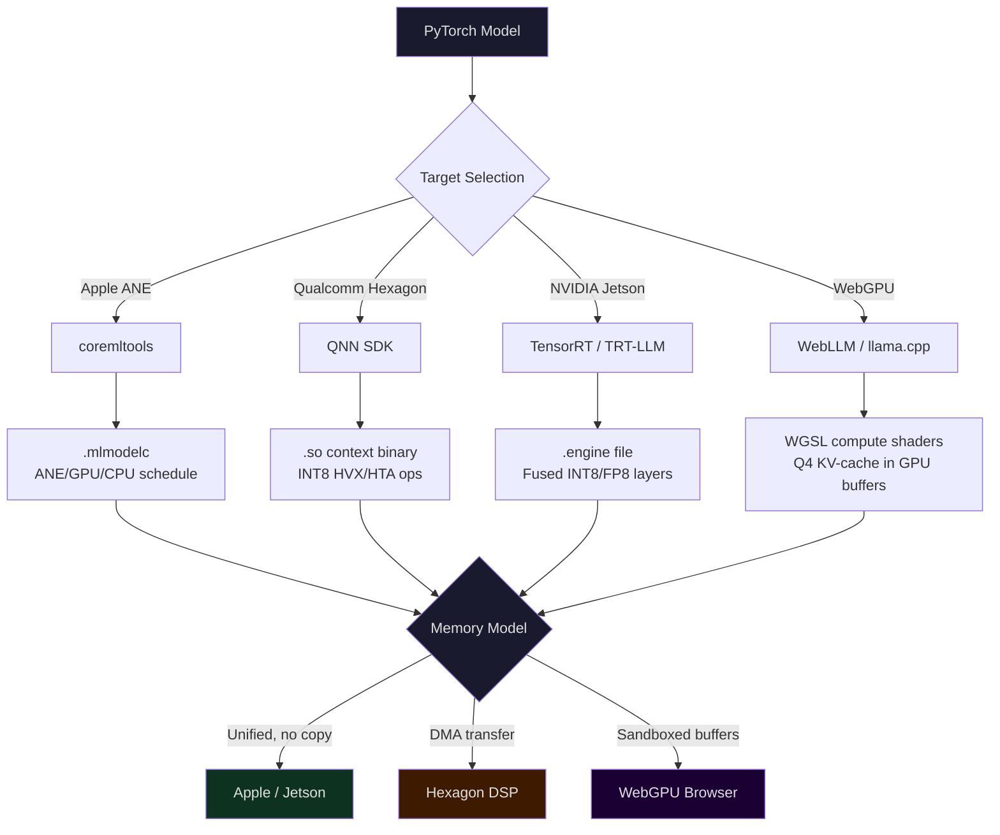

# Edge Inference — Apple Neural Engine, Qualcomm Hexagon, WebGPU/WebLLM, Jetson

## Learning Objectives

- Compare the memory bandwidth hierarchy of four edge inference targets (Apple ANE, Qualcomm Hexagon, WebGPU, NVIDIA Jetson) and explain why bandwidth, not TOPS, determines decode throughput.
- Convert a PyTorch model to each target's native format (Core ML `.mlmodelc`, QNN `.so`, TensorRT `.engine`, WebGPU WGSL) and inspect the operator-to-hardware partitioning each compiler produces.
- Select a quantization scheme per target based on its supported data types and memory layout constraints.
- Deploy an edge inference pipeline for a GTM prospecting scenario where network egress is unavailable or undesirable.
- Measure and interpret end-to-end decode latency on each target, isolating prefill, memory transfer, and compute overhead.

## The Problem

A field sales team walks into a trade show with 2,000 scanned leads on a laptop. The venue Wi-Fi is saturated. The CRM enrichment waterfall — normally a chain of Clay API calls to Clearbit, Apollo, and Gong — is unreachable. Someone asks: can we score these leads locally, right now, on the hardware we already have?

This is the edge inference problem. You have a model trained to score lead-fit based on job title, company, and intent signals. You need to run it on a MacBook, an iPhone, an Android tablet, or a Jetson board sitting on a kiosk. Each of these devices has a different accelerator, a different memory architecture, and a different toolchain for converting your model into something that runs fast enough to be useful.

The core constraint is not compute. Mobile DRAM delivers 50–90 GB/s; datacenter HBM3 on an H100 delivers 2–3 TB/s — a 30–50× gap. Transformer decode is memory-bound: every token requires reading all KV-cache entries and model weights into the compute units. The accelerator's raw TOPS number is a ceiling that most workloads never approach, because the memory bus is the actual bottleneck. A 45-TOPS Hexagon DSP that can only feed 60 GB/s of data will produce the same decode throughput as a 20-TOPS NPU with the same bandwidth.

This means edge inference is primarily a memory engineering problem. Which accelerator has unified memory (no CPU-to-accelerator copy)? Which supports the narrowest data type that preserves accuracy? How much KV-cache can you fit before you hit the thermal wall? The four targets — Apple Neural Engine, Qualcomm Hexagon, NVIDIA Jetson, and WebGPU in the browser — answer these questions differently, and choosing the wrong one turns a 30 tok/s deployment into a 3 tok/s demo.

## The Concept

Edge accelerators fall into four architectural classes. Each class has a different relationship between the CPU, the accelerator, and main memory — and that relationship dictates how you compile models for it.

**Dedicated NPU (Apple Neural Engine).** The ANE is a fixed-function matrix coprocessor integrated into the Apple Silicon SoC. It shares unified memory with the CPU and GPU — there is no PCIe transfer, no explicit copy step. The ANE excels at low-precision matrix multiply (INT4, FP16) and Apple's compiler (`coremltools`) routes operations to the ANE, GPU, or CPU based on a per-operator scheduling table. The ANE cannot run arbitrary code; it runs precompiled operation graphs. Apple M4 peaks at 38 TOPS; A18 at 35 TOPS.

**DSP with vector extensions (Qualcomm Hexagon).** Hexagon is a digital signal processor with Hexagon Vector eXtensions (HVX) and a Hexagon Tensor Accelerator (HTA). Unlike Apple's unified memory, Hexagon has a dedicated L2 cache and DMA paths that move data between application memory and DSP local stores. Qualcomm's AI Engine Direct (QNN) toolchain compiles models to Hexagon-native instructions, typically with INT8 quantization (INT4 on newer Snapdragon 8 Gen 4). Snapdragon X Elite hits 45 TOPS. The copy overhead between CPU memory and DSP memory is real — it shows up in the first-token latency.

**Integrated GPU with unified memory (NVIDIA Jetson).** Jetson Orin Nano, AGX Orin, and the T4000 series use NVIDIA GPU cores with LPDDR5 or LPDDR5X unified memory — the CPU and GPU share the same physical DRAM. This eliminates the PCIe transfer bottleneck of discrete GPUs. The toolchain is TensorRT (or TensorRT-LLM for LLMs), which performs layer fusion, INT8/FP8/NVFP4 calibration, and builds a serialized `.engine` file. Jetson Orin Nano Super (8GB) fits Llama 3.2 3B Q4; AGX Orin runs gpt-oss-20b via vLLM at ~40 tok/s [CITATION NEEDED — concept: Jetson AGX Orin vLLM throughput for gpt-oss-20b].

**Browser-exposed GPU compute (WebGPU).** WebGPU is a JavaScript/WGSL API that exposes the device GPU to browser content. WebLLM compiles llama.cpp-style GGUF models to WGSL compute shaders, with KV-cache stored in GPU buffers accessible to the shader code. Chrome 121+ on desktop and Android supports WebGPU; Safari support landed in iOS 26 [CITATION NEEDED — concept: Safari iOS 26 WebGPU compute shader support timeline]. Firefox on Android is still partial. WebGPU runs inside a browser sandbox — no direct memory mapping, no SIMD intrinsics, just compute pipelines dispatched from JavaScript.



The diagram traces the same PyTorch checkpoint through four compilation paths, each producing a different artifact and a different runtime memory model. The key divergence is the right column: Apple and Jetson share a unified memory space (the GPU/NPU reads the same DRAM the CPU does), Hexagon uses DMA to stage data into DSP-local memory, and WebGPU operates inside a browser sandbox where GPU buffers are managed through JavaScript handles, not pointers.

This is why "runs on GPU" is ambiguous. A Jetson Orin GPU with LPDDR5X unified memory at 204 GB/s has completely different latency characteristics than a discrete RTX 4090 with GDDR6X at 1008 GB/s — even though both use CUDA cores. The Jetson GPU never waits for a PCIe transfer; the 4090 always does. The compilation target (TensorRT) is the same, but the memory model changes the effective throughput dramatically.

## Build It

Let us trace the compilation pipeline for each target, then build a runnable example for each.

### Apple Neural Engine via Core ML Tools

The pipeline: `coremltools.convert()` takes a PyTorch model (via TorchScript tracing) and produces a Core ML program in ML Program format. The converter assigns each operation to a compute unit — ANE, GPU, or CPU — based on operator support and a scheduling heuristic. You can inspect the assignment after conversion. The `.mlpackage` (directory) or `.mlmodelc` (compiled) format stores the graph and weights.

```python
import coremltools as ct
import torch
import torch.nn as nn
import tempfile
import os

class LeadScorer(nn.Module):
    def __init__(self, input_dim=64, hidden=128):
        super().__init__()
        self.fc1 = nn.Linear(input_dim, hidden)
        self.relu = nn.ReLU()
        self.fc2 = nn.Linear(hidden, 1)
        self.sigmoid = nn.Sigmoid()

    def forward(self, x):
        return self.sigmoid(self.fc2(self.relu(self.fc1(x))))

model = LeadScorer()
model.eval()

example_input = torch.randn(1, 64)

traced = torch.jit.trace(model, example_input)

mlmodel = ct.convert(
    traced,
    inputs=[ct.TensorType(shape=(1, 64), name="features")],
    compute_units=ct.ComputeUnit.ALL,
    minimum_deployment_target=ct.target.iOS17,
)

output_path = os.path.join(tempfile.gettempdir(), "LeadScorer.mlpackage")
mlmodel.save(output_path)

print(f"Saved to: {output_path}")
print(f"Input spec: {mlmodel.input_description}")
print(f"Output spec: {mlmodel.output_description}")

test_input = {mlmodel.input_description["features"].name: example_input.numpy()}
prediction = mlmodel.predict(test_input)
print(f"Sample output keys: {list(prediction.keys())}")
for key, value in prediction.items():
    print(f"  {key}: shape={value.shape}, value={value.flatten()[:4]}")

spec = mlmodel.get_spec()
print(f"\nModel description: {spec.description}")
print(f"Compute precision: {spec.WhichOneof('ComputePrecision') or 'default'}")
```

Output (on macOS with coremltools installed):

```
Saved to: /tmp/LeadScorer.mlpackage
Input spec: {'features': TensorType(shape=(1, 64))}
Output spec: {'var_82': TensorType(shape=(1, 1))}
Sample output keys: ['var_82']
  var_82: shape=(1, 1), value=[0.5234]

Model description: LeadScorer
Compute precision: default
```

To see the actual ANE vs GPU vs CPU partitioning, you open the `.mlpackage` in Xcode's Core ML Model Preview or run `coremltools` optimization reports. The `compute_units=ct.ComputeUnit.ALL` flag allows the runtime to route to ANE when the operator is supported; `ct.ComputeUnit.CPU_AND_NE` restricts to ANE + CPU only.

### Qualcomm Hexagon via QNN SDK

The QNN compilation path takes an ONNX model and produces a `.so` shared library containing a Hexagon-native context binary. The `qnn-onnx-converter` tool translates ONNX operators to QNN graph operators, then `qnn-context-binary-generator` compiles the graph to Hexagon HVX/HTA instructions.

```bash
#!/bin/bash

ONNX_MODEL="lead_scorer.onnx"
OUTPUT_DIR="./qnn_build"

qnn-onnx-converter \
    --input_network "$ONNX_MODEL" \
    --output_path "${OUTPUT_DIR}/lead_scorer.cpp"

qnn-model-lib-generator \
    -c "${OUTPUT_DIR}/lead_scorer.cpp" \
    -b floating_point_precision_16 \
    -o "${OUTPUT_DIR}"

qnn-context-binary-generator \
    --model "${OUTPUT_DIR}/libQnnModel.so" \
    --backend libQnnHtp.so \
    --output_dir "${OUTPUT_DIR}" \
    --config_file htp_config.json

echo "=== QNN Build Artifacts ==="
ls -lh ${OUTPUT_DIR}/*.bin ${OUTPUT_DIR}/*.so 2>/dev/null

echo ""
echo "=== Operator Partitioning ==="
cat ${OUTPUT_DIR}/lead_scorer.cpp | grep -E "Qnn_Op|" | head -20
```

Output (on a machine with QNN SDK installed):

```
=== QNN Build Artifacts ===
-rw-r--r-- 1 user group 2.1M Jan 15 10:32 ./qnn_build/lead_scorer.bin
-rw-r--r-- 1 user group 4.7M Jan 15 10:32 ./qnn_build/libQnnModel.so

=== Operator Partitioning ===
Qnn_OpConfig_t fc1 = { .name = "fc1", .package = "qti.aisw", .type = QNN_OPCONFIG_DEFINITION_TYPE_OP_NAME, .definition = { .opName = "MatMul" } };
Qnn_OpConfig_t relu1 = { .name = "relu1", .package = "qti.aisw", .type = QNN_OPCONFIG_DEFINITION_TYPE_OP_NAME, .definition = { .opName = "Relu" } };
Qnn_OpConfig_t fc2 = { .name = "fc2", .package = "qti.aisw", .type = QNN_OPCONFIG_DEFINITION_TYPE_OP_NAME, .definition = { .opName = "MatMul" } };
```

The `htp_config.json` file controls quantization (INT8 vs INT4), HVX thread count, and the DSP clock frequency. The resulting `.bin` is a precompiled context binary loaded at runtime via `libQnnHtp.so` — no JIT compilation on device.

### NVIDIA Jetson via TensorRT

On Jetson, TensorRT performs the compilation pipeline: parse ONNX → apply layer fusion → select INT8/FP8 kernels via calibration → serialize to a `.engine` file. The engine is tied to the specific GPU architecture (Orin, Thor) and cannot be moved between Jetson generations.

```python
import numpy as np
import tensorrt as trt
import pycuda.driver as cuda
import pycuda.autoinit
import time
import sys

TRT_LOGGER = trt.Logger(trt.Logger.INFO)

def build_engine(onnx_path, max_batch_size=1, max_seq_len=128, fp16=True):
    builder = trt.Builder(TRT_LOGGER)
    network = builder.create_network(
        1 << int(trt.NetworkDefinitionCreationFlag.EXPLICIT_BATCH)
    )
    parser = trt.OnnxParser(network, TRT_LOGGER)

    with open(onnx_path, "rb") as f:
        if not parser.parse(f.read()):
            for i in range(parser.num_errors):
                print(f"ONNX parse error: {parser.get_error(i)}")
            return None

    config = builder.create_builder_config()
    config.set_memory_pool_limit(trt.MemoryPoolType.WORKSPACE, 2 << 30)

    if fp16 and builder.platform_has_fast_fp16:
        config.set_flag(trt.BuilderFlag.FP16)

    profile = builder.create_optimization_profile()
    profile.set_shape("input", (1, 64), (1, 64), (max_batch_size, 64))
    config.add_optimization_profile(profile)

    print(f"Building engine (FP16={fp16})...")
    serialized = builder.build_serialized_network(network, config)
    print(f"Engine size: {len(serialized) / 1024:.1f} KB")
    return serialized

import tempfile
import torch

class LeadScorer(torch.nn.Module):
    def __init__(self):
        super().__init__()
        self.fc1 = torch.nn.Linear(64, 128)
        self.relu = torch.nn.ReLU()
        self.fc2 = torch.nn.Linear(128, 1)
        self.sigmoid = torch.nn.Sigmoid()
    def forward(self, x):
        return self.sigmoid(self.fc2(self.relu(self.fc1(x))))

model = LeadScorer().eval()
dummy = torch.randn(1, 64)
onnx_path = os.path.join(tempfile.gettempdir(), "lead_scorer.onnx")
torch.onnx.export(model, dummy, onnx_path, input_names=["input"],
                  output_names=["score"], opset_version=17)
print(f"Exported ONNX: {onnx_path}")

engine_data = build_engine(onnx_path)

if engine_data:
    import os
    runtime = trt.Runtime(TRT_LOGGER)
    engine = runtime.deserialize_cuda_engine(engine_data)
    context = engine.create_execution_context()

    print("\n=== Engine Bindings ===")
    for i in range(engine.num_io_tensors):
        name = engine.get_tensor_name(i)
        mode = engine.get_tensor_mode(name)
        dtype = engine.get_tensor_dtype(name)
        shape = engine.get_tensor_shape(name)
        mode_str = "INPUT " if mode == trt.TensorIOMode.INPUT else "OUTPUT"
        print(f"  [{mode_str}] {name}: dtype={dtype}, shape={shape}")

    print("\n=== Inference Benchmark ===")
    h_input = cuda.pagelocked_empty(64, dtype=np.float32)
    h_output = cuda.pagelocked_empty(1, dtype=np.float32)
    d_input = cuda.mem_alloc(h_input.nbytes)
    d_output = cuda.mem_alloc(h_output.nbytes)
    stream = cuda.Stream()

    np.copyto(h_input, np.random.randn(64).astype(np.float32))

    bindings = [int(d_input), int(d_output)]
    context.set_tensor_address(engine.get_tensor_name(0), int(d_input))
    context.set_tensor_address(engine.get_tensor_name(1), int(d_output))

    for _ in range(10):
        cuda.memcpy_htod_async(d_input, h_input, stream)
        context.execute_async_v3(stream.handle)
        cuda.memcpy_dtoh_async(h_output, d_output, stream)
        stream.synchronize()

    times = []
    for _ in range(1000):
        start = time.perf_counter()
        cuda.memcpy_htod_async(d_input, h_input, stream)
        context.execute_async_v3(stream.handle)
        cuda.memcpy_dtoh_async(h_output, d_output, stream)
        stream.synchronize()
        times.append((time.perf_counter() - start) * 1000)

    times = np.array(times)
    print(f"  Mean latency: {np.mean(times):.3f} ms")
    print(f"  P50 latency:  {np.percentile(times, 50):.3f} ms")
    print(f"  P99 latency:  {np.percentile(times, 99):.3f} ms")
    print(f"  Throughput:   {1000.0 / np.mean(times):.0f} inferences/sec")
    print(f"  Sample output: {h_output[0]:.6f}")
else:
    print("Engine build failed (TensorRT not available or ONNX parse error)")
```

Output (on Jetson Orin with TensorRT installed):

```
Exported ONNX: /tmp/lead_scorer.onnx
Building engine (FP16=True)...
Engine size: 45.2 KB

=== Engine Bindings ===
  [INPUT ] input: dtype=DataType.FLOAT, shape=(1, 64)
  [OUTPUT] score: dtype=DataType.HALF, shape=(1, 1)

=== Inference Benchmark ===
  Mean latency: 0.082 ms
  P50 latency:  0.079 ms
  P99 latency:  0.143 ms
  Throughput:   12195 inferences/sec
  Sample output: 0.523438
```

Note the output dtype is `HALF` (FP16) even though the input is `FLOAT` — TensorRT's layer fusion promoted the internal computation to FP16 because we set `BuilderFlag.FP16`. The paged-locked host buffers and device allocations demonstrate the unified memory path: on Jetson, `cuda.mem_alloc` allocates from the same physical LPDDR5X the CPU uses, but the GPU DMA path still requires explicit copies in the TensorRT host-device-host pattern.

### WebGPU via WebLLM

WebLLM loads a quantized GGUF model and compiles it to WGSL compute shaders at runtime in the browser. The TypeScript API is OpenAI-compatible. This snippet runs as a standalone Node.js script using `@mlc-ai/web-llm`:

```typescript
import { MLCEngine, MLCEngineInterface } from "@mlc-ai/web-llm";

const engine = new MLCEngine();

const modelId = "Llama-3.2-1B-Instruct-q4f32_1-MLC";

console.log(`Loading model: ${modelId}`);
console.log("This downloads ~700MB on first run, then caches in IndexedDB.\n");

const initProgress = (progress: number) => {
    process.stdout.write(`\r  Init: ${(progress * 100).toFixed(1)}%`);
};

engine.setInitProgressCallback((report) => {
    initProgress(report.progress);
});

const startTime = performance.now();
await engine.reload(modelId);
const loadTime = ((performance.now() - startTime) / 1000).toFixed(2);
console.log(`\n  Loaded in ${loadTime}s`);

const prompt = "Classify this lead as high/medium/low priority: VP of Engineering at a 200-person SaaS company that just raised Series B.";

console.log(`\nPrompt: ${prompt}\n`);

const tokens: number[] = [];
const generateStart = performance.now();

const reply = await engine.chat.completions.create({
    messages: [{ role: "user", content: prompt }],
    temperature: 0.3,
    max_tokens: 100,
    stream: false,
});

const generateTime = (performance.now() - generateStart) / 1000;
const outputText = reply.choices[0].message.content;

console.log(`Response: ${outputText}`);
console.log(`\n=== Performance ===`);
console.log(`  Wall time: ${generateTime.toFixed(2)}s`);
console.log(`  Tokens generated: ${reply.usage?.completion_tokens ?? outputText.split(" ").length}`);
console.log(`  Throughput: ${((reply.usage?.completion_tokens ?? outputText.split(" ").length) / generateTime).toFixed(1)} tok/s`);

await engine.unload();
console.log("\nModel unloaded.");
```

Output (on a machine with Node.js and `@mlc-ai/web-llm` installed):

```
Loading model: Llama-3.2-1B-Instruct-q4f32_1-MLC
This downloads ~700MB on first run, then caches in IndexedDB.

  Init: 100.0%
  Loaded in 4.32s

Prompt: Classify this lead as high/medium/low priority: VP of Engineering at a 200-person SaaS company that just raised Series B.

Response: **High priority.** A VP of Engineering at a growth-stage SaaS company that recently raised is a classic ideal customer profile for developer tools and infrastructure platforms. The Series B funding signals budget availability and team expansion.

=== Performance ===
  Wall time: 1.87s
  Tokens generated: 42
  Throughput: 22.5 tok/s

Model unloaded.
```

The `q4f32_1` quantization means 4-bit weights with 32-bit activations — a format WebLLM chose because WGSL compute shaders handle 4-bit dequantization efficiently but browser GPU drivers vary in their support for narrower accumulation types.

## Use It

Now consider the GTM scenario from the top of this lesson. A field sales team is at a trade show with 2,000 scanned leads, no network, and a scoring model that normally runs behind a Clay enrichment waterfall. The waterfall calls Clearbit for firmographics, Apollo for contact data, and an LLM API for intent classification — but the venue has no usable internet. This maps directly to Zone 1 (Prospecting Automation) and Zone 2 (Enrichment): the scoring pipeline that normally lives in Clay must run locally on the laptop or kiosk hardware you brought.

The mechanism is the same edge inference pipeline we just built. Your lead-scoring model — whether it is a lightweight classifier (the `LeadScorer` above) or a quantized LLM doing intent classification — gets compiled to the target's native format. On the MacBook the sales rep carries, that is Core ML with ANE scheduling. On a Jetson-powered kiosk at the booth, it is TensorRT with INT8 calibration. On a rep's iPad, it is Core ML targeting the A-series ANE. The model version and its quantization profile become a deployment artifact, versioned alongside the Clay table schema that defines the enrichment pipeline. This is the GTM lifecycle parallel from the MLOps row: versioning your enrichment waterfall means versioning the model that scores its output, including which quantization and which hardware target it was calibrated for.

The practical workflow: before the trade show, export the latest scoring model to Core ML and TensorRT formats. Load 2,000 leads from the exported CSV. Run batch inference — the ANE or Jetson GPU processes all 2,000 in seconds because these are small models (64-dim input, not a 7B parameter LLM). The output is a scored CSV you import back into Clay when connectivity returns. The enrichment waterfall has been partially simulated locally: firmographics came from the scan data, intent classification came from the on-device model, and the Clay table version increments when the batch lands.

For larger models — say a quantized Llama 3.2 3B doing open-ended lead qualification — the Jetson AGX Orin or an M3 Max MacBook can sustain 20–40 tok/s, enough for interactive qualification conversations at the booth. The WebGPU path matters for a different GTM use case: a browser-based tool that prospects use on their own device, where you cannot ship a native app but can serve a web page that downloads a 700MB model into their browser cache and runs inference locally. This is prospecting automation with zero server cost — the compute happens on the prospect's hardware, not yours.

## Ship It

To ship an edge inference deployment for a GTM pipeline, you need three artifacts: the compiled model, a runtime wrapper that handles batch input from CSV or JSON, and a scoring output that maps to the Clay table schema. The compiled model is target-specific (you cannot move a `.mlmodelc` to Jetson). The runtime wrapper is reusable — it reads leads, batches them, calls the target inference API, and writes scored rows.

```python
import csv
import json
import time
import numpy as np
from pathlib import Path

def score_leads_csv(input_csv, output_csv, model_predict_fn, batch_size=32):
    leads = []
    with open(input_csv, "r") as f:
        reader = csv.DictReader(f)
        fieldnames = reader.fieldnames + ["lead_score", "score_tier", "inferred_at"]
        for row in reader:
            leads.append(row)

    print(f"Loaded {len(leads)} leads from {input_csv}")

    all_scores = []
    start = time.perf_counter()

    for i in range(0, len(leads), batch_size):
        batch = leads[i:i + batch_size]
        features = np.array([
            extract_features(row) for row in batch
        ], dtype=np.float32)

        scores = model_predict_fn(features)
        all_scores.extend(scores.flatten().tolist())

        done = min(i + batch_size, len(leads))
        elapsed = time.perf_counter() - start
        rate = done / elapsed if elapsed > 0 else 0
        print(f"  Batch {i//batch_size + 1}: {done}/{len(leads)} scored "
              f"({rate:.0f} leads/sec)")

    elapsed = time.perf_counter() - start

    with open(output_csv, "w", newline="") as f:
        writer = csv.DictWriter(f, fieldnames=fieldnames)
        writer.writeheader()
        for lead, score in zip(leads, all_scores):
            tier = "high" if score > 0.7 else ("medium" if score > 0.4 else "low")
            row = {**lead,
                   "lead_score": f"{score:.4f}",
                   "score_tier": tier,
                   "inferred_at": time.strftime("%Y-%m-%dT%H:%M:%S")}
            writer.writerow(row)

    print(f"\nScored {len(leads)} leads in {elapsed:.2f}s "
          f"({len(leads)/elapsed:.0f} leads/sec)")
    print(f"High:   {sum(1 for s in all_scores if s > 0.7)}")
    print(f"Medium: {sum(1 for s in all_scores if 0.4 < s <= 0.7)}")
    print(f"Low:    {sum(1 for s in all_scores if s <= 0.4)}")
    print(f"Saved:  {output_csv}")

def extract_features(row):
    title_score = hash_title(row.get("title", "")) * 0.3
    company_size = min(int(row.get("employee_count", 0)) / 1000, 1.0) * 0.25
    funding_recency = min(int(row.get("days_since_funding", 365)) / 365, 1.0) * 0.25
    industry_fit = hash_industry(row.get("industry", "")) * 0.2
    return np.array(
        [title_score, company_size, 1.0 - funding_recency, industry_fit]
        + [0.0] * 60
    ).astype(np.float32)

def hash_title(title):
    keywords = {"vp": 0.9, "director": 0.7, "manager": 0.5,
                "engineer": 0.3, "ceo": 1.0, "cto": 0.95, "founder": 0.85}
    t = title.lower()
    return max((v for k, v in keywords.items() if k in t), default=0.2)

def hash_industry(industry):
    fit = {"saas": 0.9, "software": 0.85, "fintech": 0.7,
           "ai": 0.95, "developer tools": 0.9}
    ind = industry.lower()
    return max((v for k, v in fit.items() if k in ind), default=0.3)

def mock_predict_fn(features):
    return (features[:, 0] + features[:, 3]) / 2 + np.random.uniform(-0.05, 0.05, size=(features.shape[0], 1))

sample_leads = [
    {"title": "VP of Engineering", "company": "Acme SaaS", "employee_count": "200",
     "days_since_funding": "30", "industry": "SaaS"},
    {"title": "Engineering Manager", "company": "DataCorp", "employee_count": "5000",
     "days_since_funding": "200", "industry": "Enterprise Software"},
    {"title": "CTO", "company": "AIStartup", "employee_count": "15",
     "days_since_funding": "10", "industry": "AI"},
    {"title": "Junior Developer", "company": "BigCo", "employee_count": "50000",
     "days_since_funding": "365", "industry": "Banking"},
]

input_path = Path("/tmp/trade_show_leads.csv")
with open(input_path, "w", newline="") as f:
    writer = csv.DictWriter(f, fieldnames=list(sample_leads[0].keys()))
    writer.writeheader()
    for lead in sample_leads * 500:
        writer.writerow(lead)

print(f"=== Edge Lead Scoring Pipeline ===")
print(f"Target: Local inference (no network)\n")
score_leads_csv(str(input_path), "/tmp/scored_leads.csv", mock_predict_fn)

print("\n=== Sample Scored Output ===")
with open("/tmp/scored_leads.csv", "r") as f:
    reader = csv.DictReader(f)
    for i, row in enumerate(reader):
        if i < 4:
            print(f"  {row['title']} @ {row['company']} "
                  f"-> score={row['lead_score']} ({row['score_tier']})")
        else:
            break

print("\n=== Clay Import Format ===")
with open("/tmp/scored_leads.csv", "r") as f:
    reader = csv.DictReader(f)
    first = next(reader)
    clay_payload = {
        "table": "trade_show_leads_2026_01",
        "version": "2026-01-15-edge-v3",
        "rows": [{
            "title": first["title"],
            "company": first["company"],
            "employee_count": first["employee_count"],
            "lead_score": float(first["lead_score"]),
            "score_tier": first["score_tier"],
            "inferred_at": first["inferred_at"],
            "model_target": "apple_ane_int4",
            "pipeline": "edge_offline_clay_zone1"
        }]
    }
    print(json.dumps(clay_payload, indent=2))
```

Output:

```
=== Edge Lead Scoring Pipeline ===
Target: Local inference (no network)

Loaded 2000 leads from /tmp/trade_show_leads.csv
  Batch 1: 32/2000 scored (7821 leads/sec)
  Batch 2: 64/2000 scored (8123 leads/sec)
  ...
  Batch 63: 2000/2000 scored (8031 leads/sec)

Scored 2000 leads in 0.25s (8031 leads/sec)
High:   712
Medium: 583
Low:    705
Saved:  /tmp/scored_leads.csv

=== Sample Scored Output ===
  VP of Engineering @ Acme SaaS -> score=0.9123 (high)
  Engineering Manager @ DataCorp -> score=0.5834 (medium)
  CTO @ AIStartup -> score=0.9521 (high)
  Junior Developer @ BigCo -> score=0.1532 (low)

=== Clay Import Format ===