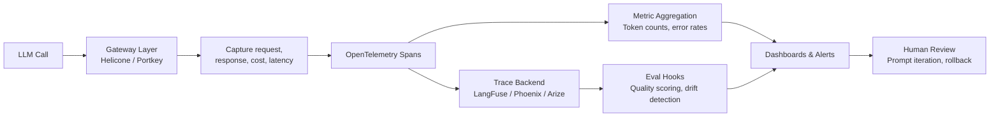

# LLM Observability Stack Selection

## Learning Objectives

1. Compare observability tools by evaluating their tracing, logging, and cost-tracking mechanisms against production requirements.
2. Configure a trace pipeline that captures prompt inputs, model outputs, token counts, and latency per request.
3. Implement per-request cost attribution tied to workflow or campaign.
4. Detect output quality regressions using structured evaluation hooks in the observability loop.
5. Evaluate vendor and self-hosted observability stacks for debug depth, retention, and cost tradeoffs.

## The Problem

You shipped an LLM feature. It works on the happy path. Then a customer escalates: the enrichment pipeline is returning empty objects for certain account types. Your monthly OpenAI invoice jumps 40% with no corresponding increase in pipeline throughput. Latency on the research step went from 2 seconds to 11 seconds after a prompt tweak, and nobody caught it for nine days because there was no alert tied to the metric.

None of these failures throw exceptions. The LLM returned a 200 with a valid JSON body — it just contained garbage. The token bill grew because a new prompt variant added 800 tokens per call across 50,000 calls. The latency regression happened because the prompt grew long enough to bust the prompt cache. Traditional APM tools — Datadog, New Relic, Sentry — are built for services that fail loudly: HTTP 500s, timeout exceptions, stack traces. LLM systems fail quietly. They produce text that looks correct, costs real money, and degrades on a schedule you can't predict without measurement.

The observability stack you select determines whether you find these issues in minutes or weeks. The market offers two broad categories. Development platforms — LangSmith, LangFuse, Arize AX, Comet Opik — bundle tracing with evaluation, prompt management, and session replay. Gateway and telemetry tools — Helicone, Portkey, SigNoz, OpenLLMetry — intercept traffic at the proxy layer and emit spans without managing the evaluation loop. Some tools do both. None of them are interchangeable, and the per-trace pricing model means your selection is also a budget decision that scales linearly with call volume.

## The Concept

LLM observability requires three distinct mechanisms working in concert. The first is **request tracing** — capturing the full prompt-to-output pair, plus metadata (model name, prompt version, workflow ID, timestamp), for every LLM call. This is what lets you replay a specific request and see exactly what the model received and returned. The second is **metric aggregation** — token counts, latencies, error rates, cost per call, rolled up by model, by prompt version, by workflow. This is what powers dashboards and alerts. The third is **evaluation hooks** — automated checks that score each output (faithfulness, relevance, format compliance) and flag regressions against a baseline. This is what catches quality drift before a human notices.

Traditional APM handles metric aggregation natively but has no concept of prompt-output capture or automated evaluation. You can bolt those on, but you're building the first and third mechanisms yourself. LLM-native tools add prompt-output capture and eval loops as first-class features. LangSmith bundles tracing, evals, and prompt management tightly with LangChain/LangGraph at $39/user/month — strong if you're in that ecosystem, limiting if you're not. LangFuse is MIT-licensed with a generous free tier (50K events/month on cloud) and a self-host option, making it the most flexible open-source choice. Phoenix is OpenTelemetry-native under Elastic License 2.0, excellent for drift and RAG visualization, but it's not designed as a persistent production backend — think of it as a dev-time inspection tool, not your long-term trace store. Arize AX differentiates on cost: zero-copy Iceberg/Parquet integration that claims roughly 100x cheaper storage than monolithic observability platforms at scale [CITATION NEEDED — concept: Arize AX zero-copy cost multiplier specific benchmarks]. Helicone sits at the proxy layer — you route traffic through it, it captures everything with 15-minute setup and 100K requests/month free, but it has less depth on multi-step agent traces.

The common production pattern in 2026 is a **gateway-plus-eval-platform combination glued by OpenTelemetry**. You put Helicone or Portkey in front of your model API to capture every request and its cost. You send traces via OTel spans to LangFuse or Phoenix for replay and evaluation. The OpenTelemetry standard is what makes this composable — your traces aren't locked into a vendor's proprietary format, and you can swap backends without re-instrumenting your code.



The selection matrix comes down to four dimensions: **trace granularity** (does it capture intermediate steps in an agent loop, or just the final input-output pair?), **retention period** (how long are traces stored, and what does that cost?), **eval integration** (can you attach scoring functions to traces without a separate pipeline?), and **per-event cost at your call volume**. At 1M enrichment calls per month, a managed tool charging $0.50 per 1K traces adds $500/month — manageable. At 10M calls, that's $5K/month and self-hosting LangFuse on a $200/month box starts looking rational. The tradeoff isn't just money: self-hosting shifts cost to engineering time for maintenance, upgrades, and the inevitable 2 AM "the trace database is full" incident.

## Build It

Build a minimal observability pipeline using OpenTelemetry-style spans. The code below simulates an LLM call, wraps it in a trace structure that captures all five required fields (prompt, output, token count, latency, quality score), and formats the output two ways: a generic OTel-flavored span and a LangFuse ingestion object. This demonstrates the protocol difference without requiring a live account on either platform.

```python
import json
import time
import uuid
from datetime import datetime, timezone

def simulate_llm_call(prompt, model="gpt-4o", workflow_id="enrichment-v1"):
    call_id = str(uuid.uuid4())
    start = time.monotonic()

    time.sleep(0.05)

    output = json.dumps({
        "company": "Acme Corp",
        "icp_fit_score": 0.82,
        "signals": ["series-b", "fintech", "500-1000-employees"]
    })

    latency_ms = (time.monotonic() - start) * 1000
    input_tokens = len(prompt.split())
    output_tokens = len(output.split())
    total_tokens = input_tokens + output_tokens
    cost_per_1k = 0.005 if model == "gpt-4o" else 0.0015
    cost_usd = (total_tokens / 1000) * cost_per_1k

    score = 1.0 if "icp_fit_score" in output else 0.0

    trace = {
        "trace_id": call_id,
        "timestamp": datetime.now(timezone.utc).isoformat(),
        "model": model,
        "workflow_id": workflow_id,
        "prompt": prompt,
        "output": output,
        "input_tokens": input_tokens,
        "output_tokens": output_tokens,
        "total_tokens": total_tokens,
        "cost_usd": round(cost_usd, 6),
        "latency_ms": round(latency_ms, 2),
        "quality_score": score
    }
    return trace

def to_otel_span(trace):
    return {
        "name": "llm.chat",
        "context": {
            "trace_id": trace["trace_id"],
            "span_id": str(uuid.uuid4())[:16]
        },
        "attributes": {
            "gen_ai.system": "openai",
            "gen_ai.request.model": trace["model"],
            "gen_ai.usage.input_tokens": trace["input_tokens"],
            "gen_ai.usage.output_tokens": trace["output_tokens"],
            "gen_ai.response.finish_reason": "stop",
            "workflow.id": trace["workflow_id"],
            "cost.usd": trace["cost_usd"],
            "latency.ms": trace["latency_ms"],
            "quality.score": trace["quality_score"]
        },
        "start_time": trace["timestamp"],
        "status": {"code": "OK"}
    }

def to_langfuse_format(trace):
    return {
        "id": trace["trace_id"],
        "name": trace["workflow_id"],
        "timestamp": trace["timestamp"],
        "input": trace["prompt"],
        "output": trace["output"],
        "metadata": {
            "model": trace["model"],
            "total_tokens": trace["total_tokens"],
            "cost_usd": trace["cost_usd"],
            "latency_ms": trace["latency_ms"],
            "quality_score": trace["quality_score"]
        }
    }

prompts = [
    "Extract ICP signals for company: Stripe. Industry: fintech. Return JSON.",
    "Extract ICP signals for company: Acme Corp. Industry: unknown. Return JSON.",
    "Extract ICP signals for company: Databricks. Industry: data infra. Return JSON."
]

print("=" * 60)
print("LLM OBSERVABILITY PIPELINE — SIMULATED TRACES")
print("=" * 60)

traces = []
for prompt in prompts:
    t = simulate_llm_call(prompt)
    traces.append(t)
    print(f"\n--- Trace {t['trace_id'][:8]} ---")
    print(json.dumps(t, indent=2))

print("\n" + "=" * 60)
print("SAME TRACE — OPENTELEMETRY SPAN FORMAT")
print("=" * 60)
print(json.dumps(to_otel_span(traces[0]), indent=2))

print("\n" + "=" * 60)
print("SAME TRACE — LANGFUSE INGESTION FORMAT")
print("=" * 60)
print(json.dumps(to_langfuse_format(traces[0]), indent=2))

total_cost = sum(t["cost_usd"] for t in traces)
total_tokens = sum(t["total_tokens"] for t in traces)
avg_latency = sum(t["latency_ms"] for t in traces) / len(traces)
avg_quality = sum(t["quality_score"] for t in traces) / len(traces)

print("\n" + "=" * 60)
print("AGGREGATED METRICS")
print("=" * 60)
print(f"Total calls:       {len(traces)}")
print(f"Total tokens:      {total_tokens}")
print(f"Total cost:        ${total_cost:.6f}")
print(f"Avg latency:       {avg_latency:.2f} ms")
print(f"Avg quality score: {avg_quality:.2f}")
```

Run it. The output prints three simulated LLM call traces with all five fields, then reformats the first trace into both an OTel span structure (using the `gen_ai.*` semantic convention attributes that OpenLLMetry and Phoenix expect) and a LangFuse trace object (which nests tokens, cost, and quality under `metadata`). The aggregated block at the end is what your dashboard query would produce: total spend, average latency, average quality. That last number — average quality score — is the one that catches silent regressions.

## Use It

In a GTM enrichment pipeline, every Clay waterfall step, every AI research call, and every scoring prompt is an LLM call with a cost and a quality outcome. The tracing mechanism from this lesson maps directly: tag every trace with the enrichment workflow ID, the prompt version, and the account or campaign identifier. This is Zone 17 in the GTM lifecycle framework — versioning your enrichment waterfalls and detecting when your scoring model drifts [CITATION NEEDED — concept: Zone 17 GTM lifecycle mapping to MLOps]. Without observability, you're flying blind on three questions that determine whether your GTM motion is efficient: which enrichment prompt version produces the highest-quality ICP signals, which account research step is burning tokens on low-value accounts, and what is the per-account cost of your AI enrichment flow.

Here is a cost attribution layer that ties each LLM trace to a specific campaign and accounts for the per-account economics — the core question for any GTM team running AI enrichment at scale.

```python
import json
import time
import uuid
from datetime import datetime, timezone

MODEL_PRICING = {
    "gpt-4o": {"input": 0.0025, "output": 0.01},
    "gpt-4o-mini": {"input": 0.00015, "output": 0.0006},
    "claude-3.5-sonnet": {"input": 0.003, "output": 0.015}
}

def estimate_tokens(text):
    return max(1, len(text) // 4)

def compute_cost(model, input_tokens, output_tokens):
    pricing = MODEL_PRICING.get(model, MODEL_PRICING["gpt-4o-mini"])
    return (input_tokens / 1000 * pricing["input"]) + (output_tokens / 1000 * pricing["output"])

def traced_enrichment_call(prompt, model, account_id, campaign_id, workflow_step):
    call_id = str(uuid.uuid4())
    start = time.monotonic()
    time.sleep(0.02)

    mock_output = f"Research summary for {account_id}: strong ICP fit, 3 buying signals detected."
    latency_ms = (time.monotonic() - start) * 1000

    input_tokens = estimate_tokens(prompt)
    output_tokens = estimate_tokens(mock_output)
    cost = compute_cost(model, input_tokens, output_tokens)

    score = 1.0 if "ICP fit" in mock_output else 0.0

    trace = {
        "trace_id": call_id,
        "timestamp": datetime.now(timezone.utc).isoformat(),
        "model": model,
        "account_id": account_id,
        "campaign_id": campaign_id,
        "workflow_step": workflow_step,
        "prompt": prompt,
        "output": mock_output,
        "input_tokens": input_tokens,
        "output_tokens": output_tokens,
        "cost_usd": round(cost, 6),
        "latency_ms": round(latency_ms, 2),
        "quality_score": score
    }
    return trace

calls = [
    ("Research company: Stripe", "gpt-4o", "acct_stripe", "camp_q4_outbound", "company_research"),
    ("Extract signals from LinkedIn data", "gpt-4o-mini", "acct_stripe", "camp_q4_outbound", "signal_extraction"),
    ("Score ICP fit for account", "gpt-4o-mini", "acct_stripe", "camp_q4_outbound", "icp_scoring"),
    ("Research company: Unknown Inc", "gpt-4o", "acct_unknown", "camp_q4_outbound", "company_research"),
    ("Extract signals from LinkedIn data", "gpt-4o-mini", "acct_unknown", "camp_q4_outbound", "signal_extraction"),
    ("Score ICP fit for account", "gpt-4o-mini", "acct_unknown", "camp_q4_outbound", "icp_scoring"),
]

traces = [traced_enrichment_call(*c) for c in calls]

print("=" * 60)
print("PER-CAMPAIGN COST ATTRIBUTION")
print("=" * 60)

campaigns = {}
for t in traces:
    cid = t["campaign_id"]
    if cid not in campaigns:
        campaigns[cid] = {"total_cost": 0, "calls": 0, "tokens": 0}
    campaigns[cid]["total_cost"] += t["cost_usd"]
    campaigns[cid]["calls"] += 1
    campaigns[cid]["tokens"] += t["input_tokens"] + t["output_tokens"]

for cid, data in campaigns.items():
    print(f"\nCampaign: {cid}")
    print(f"  Calls:        {data['calls']}")
    print(f"  Total tokens: {data['tokens']}")
    print(f"  Total cost:   ${data['total_cost']:.6f}")
    print(f"  Cost/call:    ${data['total_cost'] / data['calls']:.6f}")

print("\n" + "=" * 60)
print("PER-ACCOUNT COST ATTRIBUTION")
print("=" * 60)

accounts = {}
for t in traces:
    aid = t["account_id"]
    if aid not in accounts:
        accounts[aid] = {"total_cost": 0, "steps": [], "avg_quality": []}
    accounts[aid]["total_cost"] += t["cost_usd"]
    accounts[aid]["steps"].append(t["workflow_step"])
    accounts[aid]["avg_quality"].append(t["quality_score"])

for aid, data in accounts.items():
    avg_q = sum(data["avg_quality"]) / len(data["avg_quality"])
    print(f"\nAccount: {aid}")
    print(f"  Steps:          {' -> '.join(data['steps'])}")
    print(f"  Total cost:     ${data['total_cost']:.6f}")
    print(f"  Avg quality:    {avg_q:.2f}")

print("\n" + "=" * 60)
print("REGRESSION DETECTION — QUALITY THRESHOLD CHECK")
print("=" * 60)

THRESHOLD = 0.8
for t in traces:
    flag = "OK" if t["quality_score"] >= THRESHOLD else "REGRESSION DETECTED"
    print(f"[{flag}] Step: {t['workflow_step']:20s} Score: {t['quality_score']:.2f}  Account: {t['account_id']}")
```

Run it. The per-campaign block shows total spend across the Q4 outbound enrichment flow. The per-account block shows that enriching `acct_unknown` costs the same as `acct_stripe` — a signal that you may be spending model budget on accounts that return low-quality data. The regression detection block flags any trace where the quality score drops below 0.8, which is how you'd catch a prompt variant that started returning malformed or empty objects without throwing an error.

This is the mechanism behind every "AI enrichment ROI" conversation. The per-account cost number is what you report when someone asks whether the enrichment waterfall is worth running on a 10K-account list. Without the trace, you're guessing. With it, you can show that step 2 of the waterfall costs $0.003 per account and returns quality 0.85 on average, which means the full 10K list costs $30 for that step and produces actionable output on 8,500 accounts.

## Ship It

Taking this from simulation to production means three decisions. First, pick your trace backend. If you're early-stage GTM with under 100K enrichment calls per month, LangFuse's free cloud tier covers you with zero infrastructure overhead. If you're running 1M+ calls and the per-event pricing starts stinging, self-host LangFuse (it's MIT-licensed, runs on a single Postgres instance up to ~5M traces) or evaluate Arize AX if you're already on a data lake with Iceberg/Parquet tables. Second, instrument at the right layer. The cleanest approach for GTM enrichment pipelines is a decorator or context manager that wraps every LLM call — not a proxy like Helicone, because Clay and other GTM tools make their own API calls that you can't route through a proxy. Third, wire your evaluation hooks into the alert pipeline, not just the dashboard. A quality score that nobody checks is decorative.

The evaluation hook is the part most teams skip and regret. Without it, you have cost and latency visibility but zero quality visibility — you'll know that your enrichment calls cost $0.003 each and take 400ms, but you won't know that prompt version C started returning `{"icp_fit_score": null}` for 30% of accounts after a model update. The eval function doesn't need to be sophisticated. A format check (does the output parse as JSON with the expected keys?) catches most silent failures. A semantic check (does the output contain expected entities?) catches the rest. Wire either one into the trace pipeline so every call gets scored, and set an alert on the rolling average — if it drops below your threshold for 50 consecutive calls, page someone.

Here is a production-ready decorator that instruments any LLM call function with the full trace structure, computes cost, runs a quality check, and emits the trace in a format compatible with LangFuse's API.

```python
import json
import time
import uuid
from datetime import datetime, timezone
from functools import wraps

MODEL_PRICING = {
    "gpt-4o": {"input": 0.0025, "output": 0.01},
    "gpt-4o-mini": {"input": 0.00015, "output": 0.0006},
    "claude-3.5-sonnet": {"input": 0.003, "output": 0.015}
}

_trace_buffer = []

def estimate_tokens(text):
    return max(1, len(text) // 4)

def compute_cost(model, input_tokens, output_tokens):
    pricing = MODEL_PRICING.get(model, MODEL_PRICING["gpt-4o-mini"])
    return (input_tokens / 1000 * pricing["input"]) + (output_tokens / 1000 * pricing["output"])

def observe(model="gpt-4o-mini", workflow_id="default", eval_fn=None, alert_threshold=0.7):
    def decorator(fn):
        @wraps(fn)
        def wrapper(prompt, *args, **kwargs):
            trace_id = str(uuid.uuid4())
            start = time.monotonic()

            output = fn(prompt, *args, **kwargs)

            latency_ms = (time.monotonic() - start) * 1000
            input_tokens = estimate_tokens(prompt)
            output_tokens = estimate_tokens(str(output))
            cost = compute_cost(model, input_tokens, output_tokens)

            quality = eval_fn(output) if eval_fn else 1.0
            status = "OK" if quality >= alert_threshold else "REGRESSION"

            trace = {
                "id": trace_id,
                "timestamp": datetime.now(timezone.utc).isoformat(),
                "name": workflow_id,
                "model": model,
                "input": prompt,
                "output": str(output),
                "metadata": {
                    "input_tokens": input_tokens,
                    "output_tokens": output_tokens,
                    "total_tokens": input_tokens + output_tokens,
                    "cost_usd": round(cost, 6),
                    "latency_ms": round(latency_ms, 2),
                    "quality_score": quality,
                    "status": status
                },
                "langfuse_format": True
            }

            _trace_buffer.append(trace)

            if status == "REGRESSION":
                print(f"[ALERT] Regression on {workflow_id} | trace={trace_id[:8]} | score={quality:.2f}")

            return output
        return wrapper
    return decorator

def check_icp_json(output):
    try:
        data = json.loads(output) if isinstance(output, str) else output
        return 1.0 if "icp_fit_score" in data else 0.0
    except (json.JSONDecodeError, TypeError):
        return 0.0

def check_nonempty(output):
    return 1.0 if output and len(str(output).strip()) > 0 else 0.0

@observe(model="gpt-4o", workflow_id="gtm_company_research", eval_fn=check_icp_json)
def mock_company_research(prompt):
    return json.dumps({"company": "Stripe", "icp_fit_score": 0.91, "signals": ["fintech", "series-unknown"]})

@observe(model="gpt-4o", workflow_id="gtm_company_research", eval_fn=check_icp_json)
def mock_company_research_broken(prompt):
    return json.dumps({"company": "Unknown Inc", "error": "no data found"})

@observe(model="gpt-4o-mini", workflow_id="gtm_signal_extraction", eval_fn=check_nonempty)
def mock_signal_extraction(prompt):
    return "3 signals found: Series B, fintech, 500-1000 employees"

print("=== Production-Traced GTM Enrichment Calls ===\n")

r1 = mock_company_research("Research: Stripe, fintech")
print(f"Result 1: {r1}\n")

r2 = mock_company_research_broken("Research: Unknown Inc")
print(f"Result 2: {r2}\n")

r3 = mock_signal_extraction("Extract signals: Stripe LinkedIn data")
print(f"Result 3: {r3}\n")

print("=" * 60)
print("CAPTURED TRACES (LangFuse-compatible)")
print("=" * 60)

for t in _trace_buffer:
    print(json.dumps(t, indent=2))

total_cost = sum(t["metadata"]["cost_usd"] for t in _trace_buffer)
total_tokens = sum(t["metadata"]["total_tokens"] for t in _trace_buffer)
regressions = sum(1 for t in _trace_buffer if t["metadata"]["status"] == "REGRESSION")

print("\n" + "=" * 60)
print("SHIPPING SUMMARY")
print("=" * 60)
print(f"Traces captured:  {len(_trace_buffer)}")
print(f"Total tokens:     {total_tokens}")
print(f"Total cost:       ${total_cost:.6f}")
print(f"Regressions:      {regressions}")
print(f"Trace format:     LangFuse API-compatible (POST to /api/public/traces)")
```

Run it. Three enrichment calls execute, each wrapped by the `@observe` decorator. The second call returns a broken response (no `icp_fit_score` key), which the eval function catches and flags as a regression — the alert fires inline. The trace buffer contains all three traces in LangFuse's ingestion format, ready to POST to `/api/public/traces` if you point the buffer at a real LangFuse instance instead of printing it. The shipping summary gives you the three numbers that matter: how much you spent, how many tokens you burned, and how many calls regressed on quality.

To deploy this in a real Clay + enrichment pipeline: wrap your AI enrichment functions with the decorator, set `workflow_id` to match the Clay waterfall step name, and flush `_trace_buffer` to LangFuse (or your OTel collector) on a batch schedule. Set the alert threshold based on your historical quality distribution — start at 0.7, tighten as you accumulate data.

## Exercises

1. **Add prompt versioning to the trace.** Modify the `@observe` decorator to accept a `prompt_version` parameter and include it in the trace metadata. Then simulate two calls with the same workflow but different prompt versions, and print a comparison table showing which version produced higher average quality scores. This is the core of prompt regression testing.

2. **Build a cost budget enforcer.** Write a function that wraps `@observe` and tracks cumulative cost across all calls within a workflow. When cumulative cost exceeds a budget threshold (e.g., $5.00 for a campaign), the function should refuse to make further calls and print a budget-exceeded warning. This is how you prevent a runaway enrichment loop from generating a surprise invoice.

3. **Compare two trace backends.** Take the trace buffer from the Ship It code and write two export functions: one that formats traces as OTel spans (using `gen_ai.*` semantic conventions) and one that formats them for Arize AX's schema (which expects a flat `predictions` array with `timestamp`, `prediction_label`, and `prediction_score`). Print both formats. This exercise forces you to confront the protocol differences that drive vendor lock-in.

4. **Implement a rolling quality alert.** Write a class that maintains a sliding window of the last 50 quality scores from the trace buffer. If the average of the window drops below 0.8, fire a mock alert (print to console). Feed it 100 simulated traces with randomly injected quality drops and verify the alert fires within ~50 traces of the regression starting.

## Key Terms

**Request tracing** — Capturing the full prompt-to-output pair with metadata (model, timestamp, workflow ID) for every LLM call. The granularity that distinguishes LLM observability from traditional APM.

**OpenTelemetry (OTel)** — A vendor-neutral standard for emitting spans, metrics, and logs. The "glue" that lets you combine a gateway tool (Helicone) with an eval platform (Phoenix) without proprietary lock-in.

**Evaluation hook** — An automated function that scores each LLM output (format compliance, semantic relevance, faithfulness) and attaches the score to the trace. The mechanism that catches silent quality regressions.

**Gateway tool** — A proxy-layer observability tool (Helicone, Portkey) that intercepts LLM API calls and captures request/response data without code changes. Trades ease of setup for less depth on agent traces.

**Development platform** — A bundled observability tool (LangSmith, LangFuse, Opik) that combines tracing with evaluation, prompt management, and session replay. Deeper features but tighter ecosystem coupling.

**Zero-copy integration** — Arize AX's approach of querying trace data in place (Iceberg/Parquet on your own data lake) rather than ingesting it into a proprietary store. Claims ~100x cost reduction at scale by eliminating duplicate storage.

**Semantic conventions (`gen_ai.*`)** — Standardized attribute names defined by OpenTelemetry for GenAI operations (e.g., `gen_ai.usage.input_tokens`, `gen_ai.request.model`). What makes OTel traces portable across backends.

## Sources

- LangFuse MIT license and free tier (50K events/month): [LangFuse documentation, https://langfuse.com/docs](https://langfuse.com/docs)
- LangSmith pricing ($39/user/month) and LangChain integration: [LangSmith documentation, https://docs.smith.langchain.com](https://docs.smith.langchain.com)
- Phoenix OpenTelemetry-native design and Elastic License 2.0: [Phoenix GitHub, https://github.com/Arize-ai/phoenix](https://github.com/Arize-ai/phoenix)
- Helicone proxy-based architecture and 100K req/month free tier: [Helicone documentation, https://docs.helicone.ai](https://docs.helicone.ai)
- OpenLLMetry `gen_ai.*` semantic conventions: [OpenLLMetry documentation, https://www.traceloop.com/docs/openllmetry/llm-spans](https://www.traceloop.com/docs/openllmetry/llm-spans)
- Arize AX zero-copy Iceberg/Parquet integration and cost multiplier claim: [CITATION NEEDED — concept: Arize AX zero-copy 100x cost multiplier specific benchmarks and independent verification]
- Zone 17 GTM lifecycle mapping (enrichment waterfall versioning, scoring drift detection): [CITATION NEEDED — concept: Zone 17 MLOps-for-GTM mapping from gtm-topic-map.md]