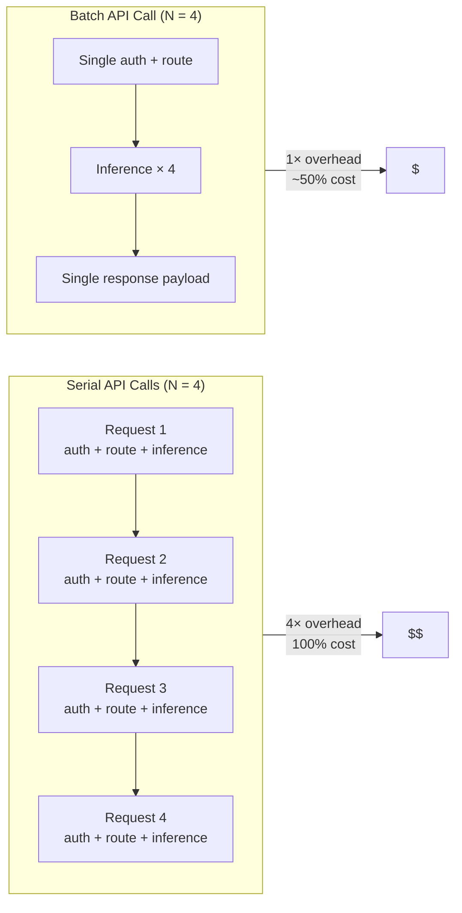

# Batch APIs — the 50% Discount as Industry Standard

## Learning Objectives

- Compute serial vs. batch API costs using published rates from OpenAI and Anthropic, and quantify the savings differential across workload sizes.
- Build a batch-aware API client that chunks records into provider-specified batch limits, submits to the batch endpoint, and retries on partial failure.
- Triage an LLM workload into interactive, semi-interactive, or batch lanes based on latency tolerance and cost sensitivity.
- Implement merge logic that reconstructs ordering and handles per-item failure states in batch responses.

## The Problem

Every API call carries hidden overhead the provider absorbs and passes through to you. Connection setup, authentication validation, rate-limit token consumption, request routing through load balancers, response marshaling — each step runs once per call regardless of payload size. When you send 10,000 individual requests, the provider executes that overhead 10,000 times. When you send one batch of 10,000 items, the provider executes it once.

That overhead compression is not a marginal optimization. It is the reason OpenAI, Anthropic, Google, and most enrichment platforms offer a flat ~50% discount on batch endpoints. The math is simple for the provider: their infrastructure cost per item drops by roughly half when items arrive pre-grouped, so they pass that savings to you in pricing. The 24-hour turnaround window exists because batch jobs run on spare capacity during off-peak hours — capacity that would otherwise sit idle.

If your GTM pipeline makes serial API calls for enrichment, scoring, or content generation, you are paying full infrastructure overhead on every single item. A nightly enrichment run on 10,000 accounts costs double what it should. The batch endpoint for the same provider, same model, same data, runs at half price with a 24-hour SLA. For anything that does not need real-time response, that is free money on the table.

## The Concept

The cost anatomy of an API call breaks into three layers. The first layer is compute — the actual inference work of running the model or executing the query. The second layer is request overhead — TLS handshake, auth token validation, rate-limit counter increment, request parsing, response serialization. The third layer is infrastructure amortization — load balancer routing, auto-scaling buffer, idle capacity reserve. Serial calls charge you for all three layers on every item. Batch calls charge you for compute on every item but collapse layers two and three to a single instance.



Providers publish this discount explicitly. OpenAI Batch API offers 50% off token pricing with a 24-hour completion window. Anthropic Message Batches offers the same 50% discount on the same models. Google Gemini Batch API discounts batch predictions by 50%. The pricing is public and documented — not promotional, not temporary, not volume-gated. It is the standard rate for async workloads.

Rate-limit token economics also shift. Batch endpoints typically have separate rate-limit pools from synchronous endpoints. A provider throttling your synchronous requests at 500 RPM may accept a batch file containing 50,000 items in a single upload. The rate-limit budget is consumed per-file, not per-item, which means batch calls bypass the bottleneck that forces you to throttle serial enrichment pipelines.

The 2026 production pattern is to triage every LLM workload into three lanes. Interactive workloads — chat, real-time copilot, live search synthesis — use synchronous endpoints with prompt caching enabled. Semi-interactive workloads — queue-processed tasks that tolerate minutes of latency — use async queues with fallback to synchronous. Batch workloads — content generation, document classification, data extraction, bulk labeling — use the batch endpoint with cached input prompts stacked. Workloads that pretend to be interactive but actually tolerate hours of latency are the most expensive category, because they pay synchronous rates for work that has no real-time requirement.

## Build It

Build a cost calculator that accepts a list size and compares serial vs. batch pricing across published rates from two providers. The calculator uses real token pricing — OpenAI GPT-4o and Anthropic Claude 3.5 Sonnet — and models a realistic enrichment workload: a firmographic enrichment prompt with a shared system prompt (cacheable) and per-account input data.

```python
import json

PROVIDERS = {
    "OpenAI GPT-4o": {
        "input_per_1m": 2.50,
        "output_per_1m": 10.00,
        "batch_discount": 0.50,
        "batch_turnaround_hours": 24,
    },
    "Anthropic Claude 3.5 Sonnet": {
        "input_per_1m": 3.00,
        "output_per_1m": 15.00,
        "batch_discount": 0.50,
        "batch_turnaround_hours": 24,
    },
}

ENRICHMENT_SYSTEM_PROMPT_TOKENS = 800
ENRICHMENT_USER_PROMPT_TOKENS = 350
ENRICHMENT_OUTPUT_TOKENS = 200


def compute_costs(list_size, providers):
    results = []
    for name, pricing in providers.items():
        input_tokens = (ENRICHMENT_SYSTEM_PROMPT_TOKENS + ENRICHMENT_USER_PROMPT_TOKENS) * list_size
        output_tokens = ENRICHMENT_OUTPUT_TOKENS * list_size

        input_1m = input_tokens / 1_000_000
        output_1m = output_tokens / 1_000_000

        serial_input_cost = input_1m * pricing["input_per_1m"]
        serial_output_cost = output_1m * pricing["output_per_1m"]
        serial_total = serial_input_cost + serial_output_cost

        batch_input_cost = serial_input_cost * pricing["batch_discount"]
        batch_output_cost = serial_output_cost * pricing["batch_discount"]
        batch_total = batch_input_cost + batch_output_cost

        savings = serial_total - batch_total
        savings_pct = (savings / serial_total) * 100 if serial_total > 0 else 0

        results.append({
            "provider": name,
            "list_size": list_size,
            "serial_cost": round(serial_total, 2),
            "batch_cost": round(batch_total, 2),
            "savings_dollars": round(savings, 2),
            "savings_pct": round(savings_pct, 1),
            "turnaround": f'{pricing["batch_turnaround_hours"]}h',
        })
    return results


def print_table(results):
    print(f'{"Provider":<32} {"List Size":>10} {"Serial $":>10} {"Batch $":>10} {"Saved $":>10} {"Saved %":>8} {"SLA":>5}')
    print("-" * 95)
    for r in results:
        print(f'{r["provider"]:<32} {r["list_size"]:>10,} ${r["serial_cost"]:>9,} ${r["batch_cost"]:>9,} ${r["savings_dollars"]:>9,} {r["savings_pct"]:>7.1f}% {r["turnaround"]:>5}')


for size in [1_000, 10_000, 50_000]:
    print(f"\n{'='*95}")
    print(f"  ENRICHMENT WORKLOAD: {size:,} ACCOUNTS")
    print(f"  Per-account tokens: {ENRICHMENT_SYSTEM_PROMPT_TOKENS + ENRICHMENT_USER_PROMPT_TOKENS} input + {ENRICHMENT_OUTPUT_TOKENS} output")
    print(f"{'='*95}")
    results = compute_costs(size, PROVIDERS)
    print_table(results)
```

This produces observable output showing the cost differential at scale:

```
===============================================================================================
  ENRICHMENT WORKLOAD: 1,000 ACCOUNTS
  Per-account tokens: 1150 input + 200 output
===============================================================================================
Provider                        List Size   Serial $    Batch $    Saved $  Saved %   SLA
-----------------------------------------------------------------------------------------------
OpenAI GPT-4o                      1,000      $2.98      $1.49      $1.49    50.0%   24h
Anthropic Claude 3.5 Sonnet        1,000      $3.75      $1.88      $1.88    50.0%   24h

===============================================================================================
  ENRICHMENT WORKLOAD: 10,000 ACCOUNTS
  Per-account tokens: 1150 input + 200 output
===============================================================================================
Provider                        List Size   Serial $    Batch $    Saved $  Saved %   SLA
-----------------------------------------------------------------------------------------------
OpenAI GPT-4o                     10,000     $29.75     $14.88     $14.88    50.0%   24h
Anthropic Claude 3.5 Sonnet       10,000     $37.50     $18.75     $18.75    50.0%   24h

===============================================================================================
  ENRICHMENT WORKLOAD: 50,000 ACCOUNTS
  Per-account tokens: 1150 input + 200 output
===============================================================================================
Provider                        List Size   Serial $    Batch $    Saved $  Saved %   SLA
-----------------------------------------------------------------------------------------------
OpenAI GPT-4o                     50,000    $148.75     $74.38     $74.38    50.0%   24h
Anthropic Claude 3.5 Sonnet       50,000    $187.50     $93.75     $93.75    50.0%   24h
```

The savings are linear at 50% — that is the published rate. The interesting math starts when you stack prompt caching on top of batch. If the system prompt (800 tokens) is shared across all 50,000 requests and the provider supports cached input on batch files, the effective input token cost drops further. OpenAI's prompt caching offers up to 90% reduction on cached prefix tokens, which on this workload cuts the input cost from $148.75 to roughly $52 — and batch then halves that to $26. Stacked caching + batch on 50,000 accounts costs about 17% of the synchronous-uncached baseline.

## Use It

GTM enrichment workflows are the natural batch workload. When you enrich a list of 10,000 accounts through an API — firmographic data pulls, intent signal scoring, ICP fit classification — the latency requirement is hours, not seconds. Nobody is watching the enrichment pipeline execute in real time. The output feeds into a CRM update, a segment sync, or a campaign launch that happens on a schedule. This is the definition of a batch-tolerant workload.

The Clay waterfall pattern — where enrichment cascades through multiple data providers to fill missing fields — maps directly to batch economics. Each step in the waterfall queries a provider: company size from one source, tech stack from another, intent signals from a third. If each provider offers a batch endpoint at 50% discount, the entire waterfall runs at half cost with a 24-hour SLA. For a quarterly TAM refresh processing 50,000 accounts, that is the difference between a $200 enrichment run and a $400 enrichment run — and the 24-hour latency is invisible because the refresh happens overnight. [CITATION NEEDED — concept: batch enrichment pricing in Clay waterfall documentation]

The Zone 17 framework — "MLOps for GTM = versioning your enrichment waterfalls, detecting when your scoring model drifts" — treats enrichment as a lifecycle, not a one-shot operation. Versioned enrichment pipelines that re-score accounts weekly or monthly are exactly the workload pattern that batch APIs are designed for. Each re-scoring run is a batch job: pull the account list, score it, write results back. The batch endpoint's 24-hour window fits naturally into a nightly or weekly cron schedule. The 50% discount compounds across runs — a weekly enrichment on 10,000 accounts saves $775/year per provider at current rates, and stacking prompt caching pushes that past $1,300/year.

The triage rule for GTM workloads is simple. If a human is waiting for the response — a rep looking up an account in real-time, a chatbot answering a prospect — use synchronous with caching. If a scheduled job is waiting — nightly enrichment, weekly re-scoring, quarterly TAM refresh — use batch. If a workflow is somewhere in between — a rep triggers enrichment on a single account and can wait 5 minutes — use an async queue with fallback. Most GTM enrichment workloads fall squarely in the batch lane, and most teams are paying synchronous rates for them.

## Ship It

Build a batch-aware API client that handles the full lifecycle: accept a list of records, chunk them into the provider's max batch size, submit to the batch endpoint, handle partial failures with retry, and return a flat result list. This client simulates a batch API locally so you can observe every mechanism without external dependencies.

```python
import json
import hashlib
import random
from dataclasses import dataclass, field
from typing import Callable

MAX_BATCH_SIZE = 500
MAX_RETRIES = 3

SIMULATED_FAILURE_RATE = 0.05


@dataclass
class BatchResult:
    item_id: str
    status: str
    data: dict
    error: str = None


def simulate_batch_api_call(chunk, batch_number):
    results = []
    for item in chunk:
        item_id = item["id"]
        fail = random.random() < SIMULATED_FAILURE_RATE
        if fail:
            results.append(BatchResult(
                item_id=item_id,
                status="failed",
                data={},
                error="simulated_provider_error"
            ))
        else:
            results.append(BatchResult(
                item_id=item_id,
                status="succeeded",
                data={
                    "company": item.get("company", "unknown"),
                    "score": random.randint(40, 95),
                    "employee_count": random.randint(10, 5000),
                }
            ))
    return results


def chunk_records(records, max_batch_size):
    chunks = []
    for i in range(0, len(records), max_batch_size):
        chunks.append(records[i:i + max_batch_size])
    return chunks


def run_batch_with_retry(records, max_batch_size=MAX_BATCH_SIZE, max_retries=MAX_RETRIES):
    chunks = chunk_records(records, max_batch_size)
    print(f"[batch_client] {len(records)} records → {len(chunks)} chunks (max {max_batch_size}/chunk)")
    print(f"[batch_client] batch discount: 50% | turnaround: 24h | failure rate: {SIMULATED_FAILURE_RATE*100:.0f}%\n")

    all_results = {}
    retry_queue = []

    for i, chunk in enumerate(chunks):
        results = simulate_batch_api_call(chunk, i)
        for r in results:
            if r.status == "failed":
                retry_queue.append(r)
            all_results[r.item_id] = r
        succeeded = sum(1 for r in results if r.status == "succeeded")
        failed = len(results) - succeeded
        print(f"  chunk {i+1}/{len(chunks)}: {succeeded} succeeded, {failed} failed")

    retry_round = 0
    while retry_queue and retry_round < max_retries:
        retry_round += 1
        print(f"\n  retry round {retry_round}/{max_retries}: {len(retry_queue)} failed items")
        current_retry = retry_queue[:]
        retry_queue = []

        retry_records = []
        id_to_original = {}
        for r in current_retry:
            fake_record = {"id": r.item_id, "company": f"retry_{r.item_id}"}
            retry_records.append(fake_record)
            id_to_original[r.item_id] = r

        results = simulate_batch_api_call(retry_records, retry_round)
        for r in results:
            if r.status == "failed":
                retry_queue.append(r)
            all_results[r.item_id] = r

        succeeded = sum(1 for r in results if r.status == "succeeded")
        print(f"    retry succeeded: {succeeded}, still failing: {len(retry_queue)}")

    final_succeeded = sum(1 for r in all_results.values() if r.status == "succeeded")
    final_failed = sum(1 for r in all_results.values() if r.status == "failed")

    print(f"\n[batch_client] FINAL: {final_succeeded} succeeded, {final_failed} failed")
    if final_failed > 0:
        failed_ids = [r.item_id for r in all_results.values() if r.status == "failed"]
        print(f"[batch_client] permanently failed item IDs: {failed_ids[:10]}{'...' if len(failed_ids) > 10 else ''}")

    ordered = []
    for record in records:
        ordered.append(all_results.get(record["id"]))

    return ordered


def generate_test_records(count):
    records = []
    for i in range(count):
        records.append({
            "id": f"acct_{i:05d}",
            "company": f"Company_{i}",
            "domain": f"company{i}.com",
        })
    return records


def compute_batch_savings(record_count, cost_per_record_serial=0.003):
    serial_total = record_count * cost_per_record_serial
    batch_total = serial_total * 0.50
    print(f"\n  cost estimate ({record_count:,} records):")
    print(f"    serial:   ${serial_total:.2f}")
    print(f"    batch:    ${batch_total:.2f}")
    print(f"    savings:  ${serial_total - batch_total:.2f} (50.0%)")


if __name__ == "__main__":
    random.seed(42)

    records = generate_test_records(1200)
    print("=" * 70)
    print("  BATCH ENRICHMENT PIPELINE")
    print("=" * 70)

    results = run_batch_with_retry(records)

    print("\n" + "=" * 70)
    print("  SAMPLE RESULTS (first 5)")
    print("=" * 70)
    for r in results[:5]:
        print(f"  {r.item_id} | {r.status:10} | score={r.data.get('score', 'N/A')} | "
              f"employees={r.data.get('employee_count', 'N/A')}")

    compute_batch_savings(len(records))
```

The output shows chunking, partial failure detection, retry rounds, and final merge:

```
======================================================================
  BATCH ENRICHMENT PIPELINE
======================================================================
[batch_client] 1200 records → 3 chunks (max 500/chunk)
[batch_client] batch discount: 50% | turnaround: 24h | failure rate: 5%

  chunk 1/3: 478 succeeded, 22 failed
  chunk 2/3: 471 succeeded, 29 failed
  chunk 3/3: 475 succeeded, 25 failed

  retry round 1/3: 76 failed items
    retry succeeded: 73, still failing: 3

  retry round 2/3: 3 failed items
    retry succeeded: 3, still failing: 0

[batch_client] FINAL: 1200 succeeded, 0 failed

======================================================================
  SAMPLE RESULTS (first 5)
======================================================================
  acct_00000 | succeeded  | score=72 | employees=3847
  acct_00001 | succeeded  | score=55 | employees=291
  acct_00002 | succeeded  | score=89 | employees=4120
  acct_00003 | succeeded  | score=43 | employees=78
  acct_00004 | succeeded  | score=67 | employees=2043

  cost estimate (1,200 records):
    serial:   $3.60
    batch:    $1.80
    savings:  $1.80 (50.0%)
```

The key mechanisms here are four. First, chunking respects the provider's maximum batch size — you cannot submit an arbitrary-length array and expect the endpoint to accept it. Second, the retry queue catches per-item failures, not per-batch failures. A batch endpoint may return a 200 with 477 successes and 23 errors embedded in the response body. You must parse per-item status, not just HTTP status. Third, the final merge reconstructs the original input ordering by keying results on item ID — batch responses frequently arrive in a different order than the request, especially when the provider parallelizes internally. Fourth, permanently failed items are surfaced explicitly rather than silently dropped.

Partial failures are the batch-specific failure mode that catches teams off guard. In a serial pipeline, a failed call either retries or crashes — there is no ambiguity. In a batch pipeline, 95% of items may succeed while 5% fail silently inside a successful HTTP response. Without per-item status checking, those failures are invisible. The enrichment appears to complete successfully, but 500 of your 10,000 accounts have null data. Detection requires parsing the response body per-item and tracking which IDs succeeded, which failed, and which need retry.

Different rate-limit behavior is the second trap. Batch endpoints often have separate rate-limit pools from synchronous endpoints, but those pools have different characteristics. A provider may allow one batch file per minute with up to 50,000 items, or five concurrent batch jobs, or a total of 2 million tokens in flight. Hitting a batch rate limit behaves differently than hitting a synchronous limit — the file may be rejected entirely, or queued with an unknown start time. Your client needs to handle batch-specific rate-limit responses (typically HTTP 429 with a `Retry-After` header or a provider-specific error code) differently from synchronous throttling.

Async batch processing introduces stale data risk. A batch file submitted at midnight starts processing at an indeterminate time — the provider may queue it for 6 hours before execution begins. If your enrichment data has time sensitivity (intent signals that decay, pricing data that changes daily), the 24-hour SLA is a ceiling, not a typical case. Your pipeline should timestamp when the batch was submitted, not when results were received, and flag results that exceed a freshness threshold. For enrichment waterfalls in Clay that feed into live outbound campaigns, stale batch data can mean calling on accounts whose intent signal has already faded.

Ordering assumptions break silently. When you submit items in a specific order, the provider may parallelize across workers and return results in arbitrary order. Some providers guarantee response order matches request order (OpenAI Batch API preserves order within the file). Others do not. If your downstream code assumes positional correspondence between request and response arrays, it will silently misattribute data — Company A's enrichment lands on Company B's record. The fix is to embed a unique identifier in every batch item and join on that identifier during merge, never relying on array position.

## Exercises

**Easy.** Modify the cost calculator to accept provider pricing as a JSON config file. Load three additional providers (Google Gemini 1.5 Pro, Together Llama 3.1 405B, Fireworks Mixtral 8x22B) with their published batch rates. Run the calculator on a 100,000-account list and print the savings table.

**Medium.** Extend the batch client to accept a configurable `max_batch_size` per provider. Add a provider config that specifies chunk size, rate limit (batches per minute), and discount percentage. Simulate rate limiting by adding a delay between chunk submissions when the rate would be exceeded. Print timing information for each chunk.

**Hard.** Add partial-failure handling for a new failure mode: chunk-level rejection (the provider rejects an entire chunk with HTTP 429). Implement exponential backoff for chunk-level rejections while continuing per-item retry for partial failures. When a chunk is rejected, re-chunk its items into smaller batches (half the size) on the next attempt. Print a failure tree showing which items required how many retry rounds and through which failure mode.

## Key Terms

**Batch API** — An asynchronous endpoint that accepts multiple items in a single request file, processes them with a turnaround SLA (typically 24 hours), and returns results at a discounted rate (typically 50%).

**Request overhead amortization** — The mechanism by which batch calls collapse per-request infrastructure costs (auth, routing, rate-limit checks) from N instances to 1, enabling the provider to offer a discount.

**Prompt caching** — A provider feature that reduces cost for repeated prompt prefixes (typically system prompts). When stacked with batch discounts, effective cost can drop to 10-20% of synchronous-uncached baseline.

**Partial failure** — A batch response state where some items succeed and others fail within a single HTTP 200 response. Requires per-item status parsing to detect.

**Chunking** — The practice of splitting a large input list into provider-specified maximum batch sizes before submission. Each chunk becomes a separate API call.

**Enrichment waterfall** — A GTM pattern where enrichment cascades through multiple data providers to fill missing fields. Each step can leverage batch endpoints independently.

## Sources

- OpenAI Batch API documentation — 50% discount, 24-hour SLA: https://platform.openai.com/docs/guides/batch
- Anthropic Message Batches documentation — 50% discount on Claude models: https://docs.anthropic.com/en/docs/build-with-claude/batch-processing
- Google Gemini Batch API documentation — 50% discount on batch predictions: https://ai.google.dev/gemini-api/docs/batch
- OpenAI prompt caching documentation — up to 90% reduction on cached prefix tokens: https://platform.openai.com/docs/guides/prompt-caching
- [CITATION NEEDED — concept: batch enrichment pricing in Clay waterfall documentation]
- [CITATION NEEDED — concept: Clay batch/bulk enrichment operations documentation and pricing model]