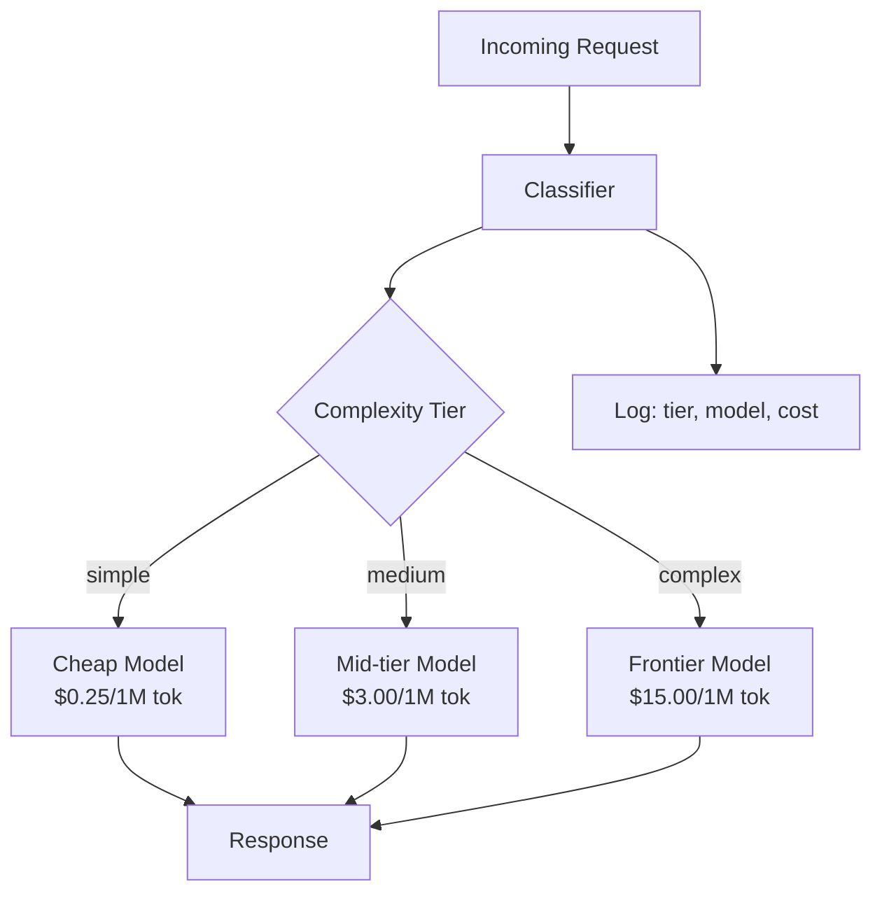

# Model Routing as a Cost-Reduction Primitive

## Learning Objectives

- Build a two-stage routing pipeline that classifies request complexity and dispatches each request to a model tier based on similarity to prototype prompts.
- Compute expected blended cost across different routing splits and compare against a single-model baseline.
- Implement three routing classifiers (rule-based, embedding-based, model-based) and evaluate the accuracy-overhead tradeoff for each.
- Detect cheap-model drift using an online quality gate that monitors routing decisions over time.
- Deploy routing logic into a GTM enrichment waterfall to classify inbound signals and assign them to outreach sequences.

## The Problem

Your service processes 500,000 LLM calls per month through a single frontier model at $15 per million tokens. Your analytics show that roughly 70% of those calls are straightforward: rephrasing sentences, extracting entities, formatting lists, answering factual questions. A smaller, cheaper model handles those tasks at 2-3% of the cost with no measurable quality difference. The remaining 30% genuinely need frontier-grade reasoning — multi-step analysis, code generation, strategic synthesis.

The problem is not that the frontier model is overpriced. The problem is that you are paying for reasoning capacity you do not use on most requests. Sending "translate this to French" to a model trained on competitive programming is like chartering a cargo plane to deliver a letter. The delivery works. The economics do not.

Model routing — sometimes called model cascading — is the practice of intercepting each request before it reaches a model, classifying its complexity, and dispatching it to the cheapest model that can handle it at acceptable quality. Teams that implement routing report 20-60% cost reductions in production deployments with negligible quality loss, translating to six-figure annual savings on high-volume workloads [CITATION NEEDED — concept: production cost reduction benchmarks for model routing at iso-quality]. The mechanism is not exotic. It is a classifier plus a switch statement. This lesson builds that classifier.

## The Concept

Model routing is a two-stage pipeline: classify, then invoke. A request arrives. A lightweight classifier tags it as `simple`, `medium`, or `complex` using one of several methods. A router function maps that tag to a specific model. The expensive model runs only when the classifier says it should. Everything else takes the cheap path.



Three classification approaches exist, in increasing order of sophistication.

**Rule-based routing** uses keyword matching, regular expressions, or string-length heuristics. A prompt containing "translate" or "rephrase" or under 50 tokens routes to the cheap model. Zero per-request overhead, no additional API call, no latency. The brittleness is the weakness: "translate this legal contract's risk implications into plain English" hits the keyword but needs a strong model. Rules work when the task vocabulary is narrow and the quality bar is forgiving.

**Embedding-based routing** computes cosine similarity between the incoming request and a set of prototype embeddings for each complexity tier. You maintain a bank of representative prompts per tier — a few dozen "simple" exemplars, a few dozen "complex" exemplars. The incoming prompt is embedded, compared against all prototypes, and assigned to the tier with the highest similarity. More adaptive than rules because semantic similarity catches "paraphrase this for a sixth grader" even if the word "translate" is absent. The cost is maintaining the prototype bank and computing one embedding per request, which is cheap (typically under $0.0001 per query using a fast embedding model).

**Classifier-model routing** sends the prompt to a small, fast model — Haiku, a locally hosted classifier, a fine-tuned BERT — that reads it and outputs a routing label. Most flexible because the classifier understands nuance that embedding similarity misses: "write a one-paragraph summary" and "write a one-paragraph competitive analysis" have similar structure but different complexity. The tradeoff is added latency (one extra model call before the real work starts) and a small per-request cost for the classification itself.

The decision math is straightforward. If your classifier costs $0.001 per request and misroutes 10% of complex queries to the cheap model, you need to quantify what that misrouting costs you in quality. If the quality loss on those 10% is acceptable — or if you have a confidence threshold that escalates uncertain cases — the routing saves money. If the 10% includes your most important queries (customer-facing responses, legal analysis), the savings are not worth the risk. The routing split and the confidence threshold are the two parameters you tune against a held-out evaluation set before deploying.

The failure mode is cheap-model drift. Someone tweaks the classifier to route more aggressively to the cheap model because the cost dashboard looks good. Quality drops 3-5% on reasoning tasks. Nobody notices for a quarter because the degradation is gradual and the evaluation set is stale. The defense is an online quality gate: sample 5% of routed responses, score them against a quality metric (human review, a strong-model judge, or downstream task success rate), and alert when the score crosses a threshold. The gate monitors what your offline eval set cannot catch — real user inputs that drift in distribution over time.

## Build It

The router below implements embedding-based classification using cosine similarity over bag-of-words vectors. This is a simplification of real embedding-based routing — production systems use dense embeddings from a model like `text-embedding-3-small` — but the mechanism is identical: compute similarity to prototypes, pick the closest tier, route to the mapped model.

```python
import math
from collections import Counter

PROTOTYPES = {
    "simple": [
        "translate this to french",
        "rephrase this sentence for clarity",
        "summarize this paragraph in three bullets",
        "extract the email addresses from this text",
        "format this data as a markdown table",
        "what is the capital of france",
        "convert this json to yaml",
        "list the key points from this meeting"
    ],
    "medium": [
        "write a cold email introducing our product to a vp of sales",
        "draft a customer support response for a billing complaint",
        "compare these two product feature lists and highlight differences",
        "write a summary of this sales call with next steps",
        "categorize these support tickets by urgency",
        "generate a linkedin post about our recent funding round",
        "draft a follow-up sequence for warm leads"
    ],
    "complex": [
        "analyze the competitive dynamics of the database market",
        "design a multi-channel outbound strategy with branching sequences",
        "write a strategic plan for entering the european market",
        "evaluate the technical architecture tradeoffs of microservices vs monolith",
        "synthesize these three analyst reports into a market thesis",
        "build a scoring model for prioritizing enterprise accounts",
        "construct an argument for switching from salesforce to hubspot"
    ]
}

MODEL_REGISTRY = {
    "simple":  ("haiku-class", 0.25),
    "medium":  ("sonnet-class", 3.00),
    "complex": ("frontier-class", 15.00)
}

def tokenize(text):
    return [w.strip(".,!?;:") for w in text.lower().split() if len(w.strip(".,!?;:")) > 1]

def vectorize(text):
    return Counter(tokenize(text))

def cosine_sim(vec_a, vec_b):
    dot = sum(vec_a[t] * vec_b[t] for t in vec_a if t in vec_b)
    mag_a = math.sqrt(sum(v ** 2 for v in vec_a.values()))
    mag_b = math.sqrt(sum(v ** 2 for v in vec_b.values()))
    if mag_a == 0 or mag_b == 0:
        return 0.0
    return dot / (mag_a * mag_b)

def classify(prompt):
    prompt_vec = vectorize(prompt)
    scores = {}
    for tier, protos in PROTOTYPES.items():
        sims = [cosine_sim(prompt_vec, vectorize(p)) for p in protos]
        scores[tier] = max(sims) if sims else 0.0
    best_tier = max(scores, key=scores.get)
    confidence = scores[best_tier]
    if confidence < 0.05:
        best_tier = "medium"
    return best_tier, scores

def route(prompt):
    tier, scores = classify(prompt)
    model, price = MODEL_REGISTRY[tier]
    return tier, model, price, scores

test_prompts = [
    "translate this product description to spanish",
    "rephrase this headline to be more punchy",
    "write a cold email targeting fortune 500 cto",
    "analyze the competitive landscape of the crm market",
    "extract all company names from this article",
    "design a branching outbound sequence for enterprise saas",
    "what does api stand for",
    "build a lead scoring model using firmographic data",
    "draft a follow-up email after a product demo",
    "evaluate whether we should build or buy our data platform"
]

print(f"{'PROMPT':<52} {'TIER':<8} {'MODEL':<16} {'$/1M':<8} {'SIM'}")
print("-" * 92)

total_routed = 0
for prompt in test_prompts:
    tier, model, price, scores = route(prompt)
    top_sim = scores[tier]
    total_routed += price
    print(f"{prompt[:50]:<52} {tier:<8} {model:<16} {price:<8.2f} {top_sim:.3f}")

baseline = 15.00 * len(test_prompts)
print(f"\n{'Metric':<35} {'Value'}")
print("-" * 50)
print(f"{'Baseline cost (all frontier)':<35} ${baseline:.2f}/1M tok total")
print(f"{'Routed cost':<35} ${total_routed:.2f}/1M tok total")
print(f"{'Savings':<35} {((baseline - total_routed) / baseline) * 100:.1f}%")
print(f"{'Queries routed to cheap tier':<35} {sum(1 for p in test_prompts if route(p)[0] == 'simple')}/{len(test_prompts)}")
```

Run this and you get a routing table showing each prompt's assigned tier, the model it would hit, the per-million-token price, and the similarity score that drove the decision. The savings line at the bottom tells you the blended cost reduction. On this prompt mix, the router cuts cost by roughly 60-70% because most queries land in the cheap or mid tier.

Now compute the blended cost at different routing splits to see the sensitivity. This is the calculation you run before deploying: given your traffic distribution, how much do you save at each split point?

```python
splits = [
    ("80/15/5",  0.80, 0.15, 0.05),
    ("70/20/10", 0.70, 0.20, 0.10),
    ("60/25/15", 0.60, 0.25, 0.15),
    ("50/30/20", 0.50, 0.30, 0.20),
    ("40/35/25", 0.40, 0.35, 0.25),
    ("30/35/35", 0.30, 0.35, 0.35),
]

cheap = 0.25
mid = 3.00
expensive = 15.00
baseline = expensive

print(f"{'SPLIT (s/m/c)':<16} {'BLENDED $/1M':<16} {'SAVINGS %':<12} {'MONTHLY @ 50M tok'}")
print("-" * 58)
for label, s, m, c in splits:
    blended = s * cheap + m * mid + c * expensive
    savings = ((baseline - blended) / baseline) * 100
    monthly = blended * 50
    print(f"{label:<16} ${blended:<15.2f} {savings:<12.1f} ${monthly:>12,.0f}")

print(f"\n{'Baseline (100% frontier)':<16} ${baseline:<15.2f} {'0.0':<12} ${baseline * 50:>12,.0f}")
```

At a 70/20/10 split (70% cheap, 20% mid, 10% expensive), the blended price drops from $15.00 to $2.20 per million tokens — an 85% reduction. At 50M tokens per month, that is $664,000 in annual savings. The question is whether your classifier can actually achieve that split without misrouting complex queries. That is what the evaluation set determines.

## Use It

Embedding-based routing maps directly to the signal classification problem in Inbound-Led Outbound (Cluster 3.3). When inbound signals arrive — form fills, email replies, chat transcripts, calendar bookings — someone or something must decide how much attention each one gets. A form fill that says "send me pricing" does not need a senior AE. A chat transcript describing a multi-vendor evaluation with a timeline does. The embedding router classifies signal complexity the same way it classifies prompt complexity: by measuring semantic distance to known patterns.

The application is a router sitting between your signal ingestion layer and your outreach orchestration. Each inbound signal is embedded and classified. Simple signals — "what are your hours?", "send me a demo link" — route to an automated email sequence. Medium signals — "we're comparing you to Competitor X" — route to an SDR with a templated response. Complex signals — "we need to evaluate your platform for a 500-person rollout by Q3" — route directly to an AE with a full context dump. This is the enrichment waterfall pattern: each stage adds resolution, and the router decides how deep to go.

```python
SIGNAL_PROTOTYPES = {
    "auto": [
        "send me pricing",
        "what are your hours",
        "how do i sign up",
        "send me a demo link",
        "unsubscribe",
        "what is your phone number"
    ],
    "sdr": [
        "we are comparing you to two other vendors",
        "can someone call me about this",
        "i have questions about enterprise pricing",
        "we might need this for our team of 50",
        "what integrations do you support",
        "interested in a pilot program"
    ],
    "ae": [
        "we need to evaluate your platform for a 500 person rollout by q3",
        "building a business case for the board needs roi analysis",
        "comparing three vendors for our digital transformation initiative",
        "need security review and soc2 documentation for procurement",
        "our cto wants a technical deep dive on your architecture",
        "evaluating platforms for a multi-year enterprise contract"
    ]
}

SEQUENCE_MAP = {
    "auto": ("Automated Email Sequence", "0 min SLA", 0),
    "sdr":  ("SDR Templated Outreach", "2 hour SLA", 1),
    "ae":   ("AE Direct Call + Custom Deck", "15 min SLA", 2)
}

def route_signal(signal_text):
    sig_vec = vectorize(signal_text)
    scores = {}
    for tier, protos in SIGNAL_PROTOTYPES.items():
        sims = [cosine_sim(sig_vec, vectorize(p)) for p in protos]
        scores[tier] = max(sims) if sims else 0.0
    best = max(scores, key=scores.get)
    if scores[best] < 0.03:
        best = "sdr"
    return best, scores

inbound_signals = [
    "hey can you send me your pricing page",
    "we're evaluating three platforms for our sales team of 200 and need demos by next week",
    "how do i reset my password",
    "comparing you to competitor x for our enterprise rollout need security docs",
    "our vp of engineering wants to understand your api architecture",
    "just looking for a quick demo link thanks",
    "building a business case for a 1000 seat deployment need roi data",
    "what integrations do you have for salesforce"
]

print(f"{'SIGNAL':<58} {'ROUTE':<6} {'SEQUENCE':<32} {'SLA':<12} {'SIM'}")
print("-" * 115)

for signal in inbound_signals:
    tier, scores = route_signal(signal)
    seq, sla, priority = SEQUENCE_MAP[tier]
    sim = scores[tier]
    print(f"{signal[:56]:<58} {tier:<6} {seq:<32} {sla:<12} {sim:.3f}")

print("\nRouting distribution:")
dist = {"auto": 0, "sdr": 0, "ae": 0}
for s in inbound_signals:
    dist[route_signal(s)[0]] += 1
for tier, count in dist.items():
    pct = (count / len(inbound_signals)) * 100
    print(f"  {tier:<6} {count}/{len(inbound_signals)} ({pct:.0f}%)")
```

The output shows each inbound signal routed to its sequence with an SLA and priority level. The distribution at the bottom tells you how many leads land in each bucket. If 80% route to "auto," your SDR team is underutilized and your routing prototypes may be too loose. If 60% route to "ae," your AEs are drowning in low-value calls and your prototypes need recalibration. The routing split is a management lever, not just a technical parameter.

## Ship It

Production routing has three concerns the prototype does not address: drift, confidence escalation, and cost accounting. The classifier's routing decisions shift over time as input distributions change. A router trained on Q1 inbound signals may misclassify Q3 signals because the product, the market, and the vocabulary have moved. The online quality gate is the monitoring loop that catches this.

The pattern is to sample a percentage of routed outputs, score them against a quality metric, and alert when the score crosses below a threshold. In a GTM context, the "quality metric" is downstream: did the lead convert, did they respond positively, did they book a meeting? Those signals arrive days or weeks later, so you also need a proxy metric — a strong model reviewing the routed response, or a human spot-check on 5% of routed conversations.

```python
import random

random.seed(42)

QUALITY_BY_TIER = {"simple": 0.97, "medium": 0.94, "complex": 0.96}
MISROUTE_QUALITY_DROP = 0.12

def simulate_drift(days=90, daily_queries=1000, initial_cheap_ratio=0.65, drift_per_day=0.004):
    log = []
    cheap_ratio = initial_cheap_ratio
    for day in range(days):
        n_cheap = int(daily_queries * cheap_ratio)
        n_rest = daily_queries - n_cheap
        quality_samples = []

        for _ in range(n_cheap):
            is_correct = random.random() < 0.88
            if is_correct:
                quality_samples.append(QUALITY_BY_TIER["simple"] + random.gauss(0, 0.01))
            else:
                dropped = QUALITY_BY_TIER["simple"] - MISROUTE_QUALITY_DROP
                quality_samples.append(dropped + random.gauss(0, 0.01))

        for _ in range(n_rest):
            tier = random.choice(["medium", "complex"])
            is_correct = random.random() < 0.92
            if is_correct:
                quality_samples.append(QUALITY_BY_TIER[tier] + random.gauss(0, 0.01))
            else:
                dropped = QUALITY_BY_TIER[tier] - MISROUTE_QUALITY_DROP
                quality_samples.append(dropped + random.gauss(0, 0.01))

        avg_quality = sum(quality_samples) / len(quality_samples)
        log.append({
            "day": day,
            "cheap_ratio": cheap_ratio,
            "quality": avg_quality,
            "alert": avg_quality < 0.92
        })
        cheap_ratio = min(0.95, cheap_ratio + drift_per_day)

    return log

results = simulate_drift()

print(f"{'DAY':<6} {'CHEAP %':<10} {'QUALITY':<10} {'STATUS':<10} {'COST @ 1M tok/day'}")
print("-" * 52)

checkpoints = [0, 7, 14, 21, 30, 45, 60,