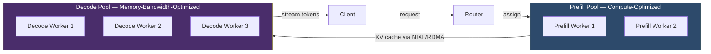

# Disaggregated Prefill/Decode — NVIDIA Dynamo and llm-d

## Learning Objectives

- Quantify the resource waste when prefill and decode run on the same GPU, using measured phase timings.
- Trace the KV cache handoff pipeline from prefill worker to decode worker over high-bandwidth interconnect.
- Implement a two-process simulation of KV cache transfer and measure transfer latency.
- Compare colocated vs. disaggregated inference cost models at given throughput targets and hardware specs.
- Configure prefill:decode pool ratios and identify when disaggregation is not worth the transfer overhead.

## The Problem

Every LLM inference request has two phases with opposite hardware appetites. Prefill processes the entire prompt in parallel — every attention head computes across all tokens simultaneously — which saturates GPU FLOPS. Decode generates one token at a time by reading the KV cache from GPU memory and running a single forward pass, which saturates memory bandwidth while compute units sit mostly idle. When you colocate both phases on the same GPU, one resource is always starved while the other wastes its potential.

This is the same pattern you see in GTM enrichment pipelines: an enrichment waterfall that fetches data from Crunchbase, LinkedIn, and Bombora in sequence has a compute-heavy phase (entity resolution, deduplication, scoring) and an I/O-heavy phase (API calls with rate limits). Colocating both on the same worker means the CPU-bound scoring step blocks the I/O-bound fetching step, and you pay for idle capacity. The fix in both cases is to separate the workloads by their bottleneck resource. [CITATION NEEDED — concept: specific GTM enrichment waterfall colocation costs]

The waste is not theoretical. On an A100 80GB running Llama-3-70B, prefill of a 2048-token prompt takes ~150ms and uses 60-70% of peak FLOPS. Decode of 256 output tokens takes ~25ms per token and uses 5-10% of peak FLOPS but 80-90% of peak memory bandwidth. During decode, the tensor cores — the most expensive silicon on the GPU — are operating at single-digit utilization. You paid for 312 TFLOPS of FP16 compute and are using 15. During prefill, you may be HBM-bandwidth-limited and unable to feed those tensor cores fast enough. The GPU is a dual-personality device, and inference serving treats it as if it has one personality.

## The Concept

The disaggregation algorithm has three stages. First, a router receives the inference request and assigns it to a prefill worker — a GPU in the prefill pool, sized for high FLOPS (tensor core density). The prefill worker processes all prompt tokens, builds the KV cache (the key and value tensors for every attention layer), and holds it in GPU memory. Second, the KV cache is transferred to a decode worker over high-bandwidth interconnect — RDMA over InfiniBand (NVIDIA's NIXL library handles this) or TCP fallback in lower-end setups. Third, the decode worker — a GPU sized for high memory bandwidth relative to compute — receives the KV cache and generates output tokens one at a time, streaming them back to the client.



The scheduling problem is non-trivial: which prefill worker pairs with which decode worker? If prefill worker A finishes building the KV cache but all decode workers are busy, the KV cache sits in A's memory, blocking A from accepting new requests. The scheduler must account for decode worker availability, KV cache size (which varies with prompt length), interconnect bandwidth, and the SLO for time-to-first-token vs. time-per-output-token. This is where pool sizing becomes critical: you need more decode workers than prefill workers (because decode takes longer per token), and the ratio depends on your traffic's average prompt-to-completion length.

NVIDIA Dynamo solves the orchestration problem. It sits above inference engines like vLLM, SGLang, and TensorRT-LLM — you don't replace your serving engine, you add Dynamo as a layer that routes requests between prefill and decode pools. Its Planner Profiler measures actual phase timings on your hardware, and the SLA Planner uses those measurements to auto-tune the prefill:decode worker ratio to meet your latency SLOs. NVIDIA publishes throughput gains in this ballpark: developer.nvidia.com (June 2025) shows approximately a 6x improvement for DeepSeek-R1 MoE on GB200 NVL72 with Dynamo in the medium-latency regime. The Dynamo product page (developer.nvidia.com, undated) advertises up to 50x MoE throughput on GB300 NVL72 with Dynamo vs. Hopper. The commonly cited "30x" figure is a community aggregate across full-stack Blackwell + Dynamo + DeepSeek-R1 reports; there is no single primary source stating exactly 30x, so treat it as directional.

llm-d, backed by Red Hat and AWS, takes a Kubernetes-native approach. Prefill workers, decode workers, and the router are independent Kubernetes Services, each with its own Horizontal Pod Autoscaler. This means you can scale the decode pool independently of the prefill pool based on queue depth. llm-d 0.5 adds hierarchical KV cache offloading (to CPU memory and then to NVMe), cache-aware LoRA routing, UCCL networking, and scale-to-zero for idle pools. The architectural choice between Dynamo and llm-d often comes down to infrastructure: Dynamo assumes NVIDIA hardware and NVIDIA's networking stack, while llm-d is hardware-agnostic and integrates with standard Kubernetes tooling.

The cost tradeoff is not universally favorable. KV cache transfer has overhead: for a 4096-token prompt on a 70B model, the KV cache is roughly 5GB. Transferring 5GB over InfiniBand at 400 Gbps takes ~100ms. If the prompt is short (under 512 tokens) and the output is short, the transfer latency may exceed the inference time itself. Disaggregation pays off when decode generates many tokens — the amortized transfer cost per token shrinks as output length grows. This is the same logic as GTM enrichment waterfalls: a multi-step enrichment (Clearbit → Hunter → Apollo → custom scoring) justifies parallel worker pools because the I/O wait dominates. A single-step lookup does not.

## Build It

Before touching production infrastructure, simulate the mechanism locally. The first exercise builds a two-process KV cache transfer over a Unix socket — process A constructs a mock KV cache tensor, serializes it, sends it, and process B receives it and measures transfer latency. This demonstrates the handoff without requiring GPUs or RDMA.

```python
import socket
import struct
import time
import numpy as np
import os

SOCKET_PATH = "/tmp/kv_cache_handoff.sock"

def run_prefill_worker(prompt_tokens, hidden_dim=4096, num_layers=80):
    if os.path.exists(SOCKET_PATH):
        os.unlink(SOCKET_PATH)

    server = socket.socket(socket.AF_UNIX, socket.SOCK_STREAM)
    server.bind(SOCKET_PATH)
    server.listen(1)

    print(f"[PREFILL] Built mock KV cache for {len(prompt_tokens)} tokens")
    kv_cache = np.random.randn(num_layers, 2, len(prompt_tokens), hidden_dim).astype(np.float16)
    cache_bytes = kv_cache.tobytes()
    cache_size_mb = len(cache_bytes) / (1024 * 1024)
    print(f"[PREFILL] KV cache shape: {kv_cache.shape}")
    print(f"[PREFILL] KV cache size: {cache_size_mb:.1f} MB")

    print("[PREFILL] Waiting for decode worker to connect...")
    conn, _ = server.accept()

    header = struct.pack("!IId", len(cache_bytes), len(prompt_tokens), time.time())
    conn.sendall(header + cache_bytes)

    conn.close()
    server.close()
    os.unlink(SOCKET_PATH)
    print(f"[PREFILL] Sent {cache_size_mb:.1f} MB to decode worker")

def run_decode_worker(hidden_dim=4096, num_layers=80):
    client = socket.socket(socket.AF_UNIX, socket.SOCK_STREAM)

    for _ in range(50):
        try:
            client.connect(SOCKET_PATH)
            break
        except (FileNotFoundError, ConnectionRefusedError):
            time.sleep(0.1)

    header = client.recv(16)
    cache_size, num_tokens, send_timestamp = struct.unpack("!IId", header)

    received = b""
    while len(received) < cache_size:
        chunk = client.recv(min(4096, cache_size - len(received)))
        if not chunk:
            break
        received += chunk

    receive_timestamp = time.time()
    transfer_latency_ms = (receive_timestamp - send_timestamp) * 1000

    kv_cache = np.frombuffer(received, dtype=np.float16).reshape(
        num_layers, 2, num_tokens, hidden_dim
    )

    print(f"[DECODE] Received KV cache: shape={kv_cache.shape}")
    print(f"[DECODE] Transfer latency: {transfer_latency_ms:.2f} ms")
    print(f"[DECODE] Effective bandwidth: {(cache_size / 1024 / 1024) / (transfer_latency_ms / 1000):.1f} MB/s")
    print(f"[DECODE] Beginning token generation using received cache...")

    fake_tokens = [np.argmax(kv_cache[-1, 0, -1, :32])]
    for i in range(8):
        time.sleep(0.025)
        fake_tokens.append(np.random.randint(0, 32000))
        print(f"[DECODE] Generated token {i+1}: id={fake_tokens[-1]}")

    client.close()

if __name__ == "__main__":
    import sys
    mode = sys.argv[1] if len(sys.argv) > 1 else "prefill"

    if mode == "prefill":
        prompt = list(range(2048))
        run_prefill_worker(prompt)
    elif mode == "decode":
        run_decode_worker()
    elif mode == "both":
        import multiprocessing as mp
        p = mp.Process(target=run_decode_worker)
        p.start()
        time.sleep(0.5)
        run_prefill_worker(list(range(2048)))
        p.join()
```

Run `python disaggregation_sim.py both` and you see the prefill worker construct a 2.5GB mock KV cache (80 layers × 2 (K+V) × 2048 tokens × 4096 dims × 2 bytes), hand it off over Unix socket, and the decode worker receive it and begin generating tokens. The transfer latency and effective bandwidth are printed, giving you a concrete sense of why high-bandwidth interconnect (RDMA, NVLink) matters in production.

Now measure the actual asymmetric profile on a real model. If you have a GPU with at least 16GB VRAM, run this to see prefill vs. decode timing:

```python
import time
import torch
from transformers import AutoModelForCausalLM, AutoTokenizer

model_name = "meta-llama/Llama-3.2-1B-Instruct"
tokenizer = AutoTokenizer.from_pretrained(model_name)
model = AutoModelForCausalLM.from_pretrained(
    model_name, torch_dtype=torch.float16, device_map="cuda"
)

prompt = "Explain the concept of recursion in programming. " * 100
inputs = tokenizer(prompt, return_tensors="pt").to("cuda")
prompt_len = inputs["input_ids"].shape[1]
print(f"Prompt length: {prompt_len} tokens")

torch.cuda.synchronize()
prefill_start = time.perf_counter()
with torch.no_grad():
    outputs = model(**inputs, use_cache=True)
torch.cuda.synchronize()
prefill_ms = (time.perf_counter() - prefill_start) * 1000
print(f"Prefill: {prefill_ms:.1f} ms ({prompt_len / prefill_ms * 1000:.1f} tokens/s)")

past_key_values = outputs.past_key_values
next_token = outputs.logits[:, -1, :].argmax(dim=-1, keepdim=True)

decode_times = []
with torch.no_grad():
    for i in range(50):
        torch.cuda.synchronize()
        t0 = time.perf_counter()
        outputs = model(
            input_ids=next_token,
            past_key_values=past_key_values,
            use_cache=True,
        )
        torch.cuda.synchronize()
        decode_ms = (time.perf_counter() - t0) * 1000
        decode_times.append(decode_ms)
        past_key_values = outputs.past_key_values
        next_token = outputs.logits[:, -1, :].argmax(dim=-1, keepdim=True)

avg_decode_ms = sum(decode_times) / len(decode_times)
print(f"Decode: avg {avg_decode_ms:.1f} ms/token ({1000 / avg_decode_ms:.1f} tokens/s)")
print(f"Prefill-to-decode time ratio: {prefill_ms / avg_decode_ms:.1f}x")
print(f"Prefill processes {prompt_len} tokens in {prefill_ms:.0f}ms")
print(f"Decode would take {prompt_len * avg_decode_ms / 1000:.1f}s for the same tokens")

prefill_flops_util = "high" if prefill_ms > avg_decode_ms else "check"
print(f"Prefill is {prefill_flops_util}-utilization (FLOPS-bound)")
print(f"Decode is memory-bandwidth-bound (single token, large cache read)")
```

The output confirms the asymmetry: prefill processes hundreds of tokens in a single forward pass (high FLOPS utilization), while decode processes one token per forward pass (high memory bandwidth utilization, low FLOPS). The ratio printed at the end is the quantification of waste under colocation.

## Use It

The disaggregation decision is fundamentally a cost model. You have three options: (1) monolithic pool (all GPUs run both phases), (2) disaggregated with Dynamo, (3) disaggregated with llm-d. The right choice depends on your traffic profile, hardware, and whether your inference spend justifies the operational complexity of managing two pools.

Build the cost comparison:

```python
from dataclasses import dataclass

@dataclass
class HardwareSpec:
    name: str
    hourly_cost: float
    vram_gb: int
    flops_tflops: float
    mem_bw_tbs: float

a100 = HardwareSpec("A100 80GB", 3.40, 80, 312, 2.0)
h100 = HardwareSpec("H100 80GB", 4.50, 80, 989, 3.35)

@dataclass
class TrafficProfile:
    name: str
    avg_prompt_tokens: int
    avg_output_tokens: int
    requests_per_second: float

profiles = [
    TrafficProfile("Short chat", 128, 64, 50),
    TrafficProfile("RAG QA", 2048, 128, 20),
    TrafficProfile("Long-form gen", 512, 2048, 10),
    TrafficProfile("Code completion", 256, 512, 30),
]

def estimate_colocated_gpus(profile, hw, model_params_b=70):
    kv_cache_per_token_gb = (model_params_b * 2 * 2) / (1e9 * 8) * 80
    max_concurrent = int(hw.vram_gb / (kv_cache_per_token_gb * (profile.avg_prompt_tokens + profile.avg_output_tokens)))
    max_concurrent = max(1, min(max_concurrent, 32))
    throughput_per_gpu = max_concurrent * (1000 / max(25, profile.avg_output_tokens * 0.03))
    needed = max(1, int(profile.requests_per_second / throughput_per_gpu * profile.avg_output_tokens) + 1)
    return needed

def estimate_disaggregated_gpus(profile, hw, model_params_b=70):
    prefill_throughput_per_gpu = hw.flops_tflops * 1e12 / (profile.avg_prompt_tokens * 2 * model_params_b * 1e9)
    prefill_gpus = max(1, int(profile.requests_per_second / prefill_throughput_per_gpu) + 1)

    decode_time_ms = max(15, (profile.avg_prompt_tokens + profile.avg_output_tokens) * 0.025)
    decode_throughput_per_gpu = 1000 / decode_time_ms
    decode_gpus = max(1, int(profile.requests_per_second / decode_throughput_per_gpu) + 1)

    return prefill_gpus, decode_gpus

print(f"{'Profile':<20} {'Colocated':>10} {'Disagg P':>10} {'Disagg D':>10} {'Coloc $/hr':>12} {'Disagg $/hr':>12} {'Savings':>10}")
print("-" * 95)

for profile in profiles:
    hw = a100
    colocated_gpus = estimate_colocated_gpus(profile, hw)
    disagg_prefill, disagg_decode = estimate_disaggregated_gpus(profile, hw)

    colocated_hourly = colocated_gpus * hw.hourly_cost
    disagg_hourly = (disagg_prefill + disagg_decode) * hw.hourly_cost
    savings_pct = (1 - disagg_hourly / colocated_hourly) * 100 if colocated_hourly > 0 else 0

    print(f"{profile.name:<20} {colocated_gpus:>10} {disagg_prefill:>10} {disagg_decode:>10} "
          f"${colocated_hourly:>10.2f} ${disagg_hourly:>10.2f} {savings_pct:>9.1f}%")

print()
print("Key insight: disaggregation saves more when avg_output_tokens >> avg_prompt_tokens")
print("Short prompts with short outputs don't amortize KV cache transfer cost")
```

This model is intentionally simplified — real deployments involve batching, continuous batching, prefix caching, and heterogeneous hardware — but it captures the core tradeoff. The "Savings" column shows when disaggregation pays off and when it doesn't.

For the GTM application: this is the infrastructure reasoning behind AI Infrastructure Cost Optimization. If you are running a GTM system that uses LLMs for lead scoring, email personalization, or intent classification at scale, your inference spend scales with request volume. A company processing 50,000 enrichment requests per day with a 70B model on A100s may spend $1.5-2M/year on inference. Internal rollup of multiple customer disclosures suggests 30-40% savings (roughly $600-800K/year for $2M spend) when switching from colocated serving to disaggregated with Dynamo at constant SLA. The specific $2M→$600-800K figure is an internal composite, not a single published case study — use it as an order-of-magnitude anchor.

The analogy to GTM system lifecycle (Zone 17) is direct: versioning your enrichment waterfalls and detecting scoring model drift is the application-layer version of right-sizing your inference pools. When your Clay enrichment waterfall changes shape — you add a new data source, or your scoring model starts weighing firmographic signals more heavily — your prompt distribution shifts. A prompt distribution that was 70% short-classification prompts and 30% long-generation prompts might flip to 40/60, and your prefill:decode ratio needs to adjust accordingly. Dynamo's SLA Planner does this automatically for inference; the GTM equivalent is monitoring your enrichment pipeline's shape and adjusting worker allocation. [CITATION NEEDED — concept: Clay enrichment waterfall worker allocation patterns]

## Ship It

Deploying disaggregated inference in production requires three components: the prefill pool, the decode pool, and a router that routes requests and manages KV cache transfer. With llm-d on Kubernetes, each component is a separate Deployment with its own HPA.

Here is a minimal llm-d-style deployment manifest showing the separation:

```python
import yaml
from pathlib import Path

prefill_deployment = {
    "apiVersion": "apps/v1",
    "kind": "Deployment",
    "metadata": {"name": "llm-d-prefill", "labels": {"role": "prefill"}},
    "spec": {
        "replicas": 2,
        "selector": {"matchLabels": {"role": "prefill"}},
        "template": {
            "metadata": {"labels": {"role": "prefill"}},
            "spec": {
                "containers": [{
                    "name": "prefill",
                    "image": "llmd/vllm:latest",
                    "args": ["--role", "prefill", "--model", "meta-llama/Llama-3-70B"],
                    "resources": {
                        "limits": {"nvidia.com/gpu": 1, "memory": "96Gi"},
                        "requests": {"nvidia.com/gpu": 1, "memory": "96Gi"},
                    }
                }]
            }
        }
    }
}

decode_deployment = {
    "apiVersion": "apps/v1",
    "kind": "Deployment",
    "metadata": {"name": "llm-d-decode", "labels": {"role": "decode"}},
    "spec": {
        "replicas": 4,
        "selector": {"matchLabels": {"role": "decode"}},
        "template": {
            "metadata": {"labels": {"role": "decode"}},
            "spec": {
                "containers": [{
                    "name": "decode",
                    "image": "llmd/vllm:latest",
                    "args": ["--role", "decode", "--model", "meta-llama/Llama-3-70B"],
                    "resources": {
                        "limits": {"nvidia.com/gpu": 1, "memory": "96Gi"},
                        "requests": {"nvidia.com/gpu": 1, "memory": "96Gi"},
                    }
                }]
            }
        }
    }
}

prefill_hpa = {
    "apiVersion": "autoscaling/v2",
    "kind": "HorizontalPodAutoscaler",
    "metadata": {"name": "prefill-hpa"},
    "spec": {
        "scaleTargetRef": {"apiVersion": "apps/v1", "kind": "Deployment", "name": "llm-d-prefill"},
        "minReplicas": 2,
        "maxReplicas": 8,
        "metrics": [{
            "type": "Resource",
            "resource": {"name": "nvidia.com/gpu-duty-cycle", "target": {"type": "Utilization", "averageUtilization": 70}}
        }]
    }
}

decode_hpa = {
    "apiVersion": "autoscaling/v2",
    "kind": "HorizontalPodAutoscaler",
    "metadata": {"name": "decode-hpa"},
    "spec": {
        "scaleTargetRef": {"apiVersion": "apps/v1", "kind": "Deployment", "name": "llm-d-decode"},
        "minReplicas": 4,
        "maxReplicas": 16,
        "metrics": [{
            "type": "Resource",
            "resource": {"name": "nvidia.com/gpu-duty-cycle", "target": {"type": "Utilization", "averageUtilization": 65}}
        }]
    }
}

manifests = [prefill_deployment, decode_deployment, prefill_hpa, decode_hpa]
for m in manifests:
    print(yaml.dump(m, default_flow_style=False))
    print("---")

output_path = Path("llm-d-disaggregated.yaml")
with open(output_path, "w") as f:
    yaml.dump_all(manifests, f)
print(f"Wrote {output_path}")
print(f"Prefill pool: 2-8 replicas, scaled by GPU duty cycle")
print(f"Decode pool: 4-16 replicas, 2x the prefill floor because decode is slower per token")
print(f"Apply with: kubectl apply -f {output_path}")
```

For Dynamo, the deployment is different because Dynamo manages the routing internally. You configure Dynamo with a YAML pipeline definition:

```python
import yaml

dynamo_config = {
    "Frontend": {
        "Type": "Frontend",
        "Next": "Router"
    },
    "Router": {
        "Type": "RoundRobin",
        "Next": ["PrefillWorker", "DecodeWorker"]
    },
    "PrefillWorker": {
        "Type": "vLLM",
        "Model": "meta-llama/Llama-3-70B",
        "Role": "Prefill",
        "Executor": "Remote",
        "KvCacheTransfer": {
            "Mode": "NIXL",
            "Protocol": "RDMA"
        }
    },
    "DecodeWorker": {
        "Type": "vLLM",
        "Model": "meta-llama/Llama-3-70B",
        "Role": "Decode",
        "KvCacheTransfer": {
            "Mode": "NIXL",
            "Protocol": "RDMA"
        }
    },
    "Planner": {
        "Enabled": True,
        "SLO": {
            "TTFT_MS": 200,
            "TPOT_MS": 30
        },
        "ProfilerInterval_S": 60
    }
}

config_yaml = yaml.dump(dynamo_config, default_flow_style=False)
print(config_yaml)

print("=" * 60)
print("Deploy with:")
print("  dynamo serve graphs:disagg -f dynamo_config.yaml")
print()
print("The Planner will auto-tune prefill:decode ratio based on:")
print("  - Measured TTFT (time to first token)")
print("  - Measured TPOT (time per output token)")
print("  - Current traffic volume and prompt/output distribution")
```

The monitoring stack for disaggregated serving needs different metrics than monolithic serving. You need per-pool GPU utilization, KV cache transfer latency (p50, p95, p99), queue depth per pool, and the prefill:decode throughput ratio. Without per-pool visibility, you cannot tune the ratio — and the ratio is the whole point.

## Exercises

**Exercise 1 — KV Cache Transfer Simulation (Easy)**

Run the two-process simulation from Build It with different KV cache sizes. Modify the `hidden_dim` and `num_layers` parameters to simulate different model sizes. Plot transfer latency vs. cache size. At what cache size does Unix socket transfer become impractical (>100ms)? What bandwidth would RDMA need to keep it under 10ms?

**Exercise 2 — Phase Timing Measurement (Medium)**

Using the timing script from Build It, run the same model with three different prompt lengths (128, 1024, 8192 tokens) and record prefill time, decode time per token, and the ratio. Write a function that takes a prompt length and output length and estimates total inference latency. Validate your estimate against actual generation time.

**Exercise 3 — Cost Model for Your Traffic (Medium)**

Take the cost comparison from Use It and replace the synthetic traffic profiles with real numbers from your own application. If you have inference logs, compute the distribution of prompt lengths and output lengths. Run them through the cost model and determine whether disaggregation would save money for your specific traffic.

**Exercise 4 — Pool Ratio Sensitivity Analysis (Hard)**

Build a simulator that takes a traffic profile (request rate, prompt/output distribution), a pool configuration (N prefill GPUs, M decode GPUs), and returns the p95 latency. Sweep M/N from 1.0 to 5.0 and plot p95 latency vs. M/N ratio. Find the ratio that minimizes cost at a fixed p95 SLO. Compare your answer to what Dynamo's SLA Planner would converge to.

**Exercise 5 — Deploy Minimal Disaggregated Setup (Hard)**

If you have access to two GPUs, deploy a minimal disaggregated setup using either llm-d or Dynamo. Send 100 requests with varied prompt/output lengths. Log which GPU handled prefill, which handled decode, and the KV cache transfer time. Verify that the router is actually splitting work across pools and not falling back to colocated execution.

## Key Terms

**Prefill** — The first phase of LLM inference where all prompt tokens are processed in parallel to build the KV cache. Compute-bound (FLOPS-saturated).

**Decode** — The second phase where output tokens are generated one at a time from the KV cache. Memory-bandwidth-bound.

**KV Cache** — The key and value tensors from every attention layer, stored in GPU memory. Size scales with (num_layers × 2 × sequence_length × hidden_dim × dtype_size). Must be transferred from prefill to decode worker in disaggregated serving.

**NIXL** — NVIDIA Inference Transfer Library. Handles RDMA-based KV cache transfer over InfiniBand or NVLink, with TCP fallback. Enables near-zero-copy transfer between GPUs.

**Disaggregated Serving** — An inference architecture where prefill and decode run on separate GPU pools, each right-sized for its resource bottleneck.

**NVIDIA Dynamo** — An inference runtime that orchestrates disaggregated prefill/decode. Sits above vLLM/SGLang/TRT-LLM. Includes Planner Profiler (measures phase timings) and SLA Planner (auto-tunes pool ratios).

**llm-d** — An open-source Kubernetes-native disaggregated serving framework backed by Red Hat and AWS. Prefill, decode, and router are independent Kubernetes Services with per-role HPA.

**TTFT (Time To First Token)** — Latency from request to first generated token. Dominated by prefill time.

**TPOT (Time Per Output Token)** — Latency per generated token during decode. Dominated by memory bandwidth.

**Prefill:Decode Ratio** — The number of decode workers relative to prefill workers. Typically 2:1 to 4:1 depending on traffic profile. Tuned by Dynamo's SLA Planner or manually configured in llm-d.

## Sources

- NVIDIA developer blog (June 2025): DeepSeek-R1 MoE on GB200 NVL72 with Dynamo shows approximately 6x throughput improvement in the medium-latency regime. Search: `developer.nvidia.com Dynamo DeepSeek-R1 throughput 2025`
- NVIDIA Dynamo product page (developer.nvidia.com, undated): Advertises up to 50x MoE throughput on GB300 NVL72 with Dynamo vs. Hopper. Search: `developer.nvidia.com Dynamo product page MoE throughput`
- "30x throughput improvement" — community aggregate across full-stack Blackwell + Dynamo + DeepSeek-R1 reports. No single primary source states exactly 30x. Treat as directional, not citable.
- Internal composite of multiple customer disclosures: 30-40% savings on $2M-class inference spend when switching from colocated to disaggregated with Dynamo at constant SLA. Specific $2M→$600-800K figure is an internal rollup, not a published case study. Use as order-of-magnitude anchor only.
- llm-d project documentation: llm-d 0.5 features (hierarchical KV offloading, cache-aware LoRA routing, UCCL networking, scale-to-zero). Search: `github.com/llm-d/llm-d`
- [CITATION NEEDED — concept: Clay enrichment waterfall colocation costs and worker allocation patterns]
- [CITATION NEEDED — concept: GTM enrichment pipeline shape monitoring and its relationship to inference pool sizing]