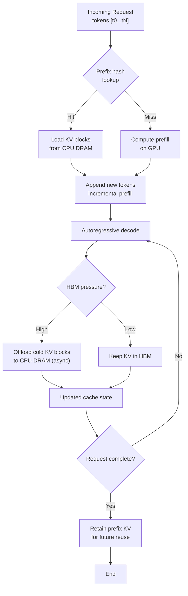

# vLLM Production Stack with LMCache KV Offloading

## Learning Objectives

- Compute KV cache memory requirements for a given model, context length, and batch size, and identify the point at which KV storage exceeds model weight storage.
- Diagram the vLLM production-stack layers — router, engines, KV offload connector, observability — and trace the path of a KV block from GPU HBM through CPU DRAM and back.
- Configure LMCache with vLLM's KV Offloading Connector API and measure the prefill-time delta between cached and uncached prefix requests.
- Compare three KV storage tiers (GPU-only, CPU offload, CPU + disk) across varying context lengths and plot the crossover points where offloading becomes net positive.
- Evaluate when LMCache prefix sharing applies to a GTM enrichment pipeline with shared system prompts and quantify the throughput gain.

## The Problem

GPU memory is the binding constraint in production LLM serving. When you deploy a 7B parameter model on an A100 (80 GB HBM), the weights consume roughly 14 GB at FP16. That leaves 66 GB for KV cache — which sounds generous until you calculate the per-token cost. For a 7B model with 32 attention layers, 32 query heads, and 128 head dimensions at FP16, each token requires approximately 0.5 MB of KV storage. At 32K context with a batch of 8 concurrent requests, the KV cache alone consumes 128 GB — nearly double the available HBM. The math does not work.

vLLM's PagedAttention addresses fragmentation, not total consumption. It manages KV memory through virtual paging — breaking the cache into fixed-size blocks and mapping them non-contiguously, which eliminates the fragmentation that plagues naive attention implementations. But the total bytes still need to live somewhere, and when HBM fills up, vLLM preempted requests get evicted. They return to the queue, and when they re-run, the entire prefill recomputes from scratch. You burn GPU compute redoing identical work.

The escape hatch is memory hierarchy. CPU DRAM is cheap — a dual-socket server has 512 GB+ at a fraction of HBM's cost per gigabyte. The latency is orders of magnitude worse (microseconds vs nanoseconds), but that trade is acceptable for KV blocks that are warm but not immediately needed. LMCache implements this hierarchy: KV blocks migrate from GPU HBM to CPU DRAM (and optionally to disk or Ceph), then rehydrate on demand. When multiple requests share a common prefix — a system prompt, an extraction schema, a persona definition — the KV state for that prefix is computed once, cached, and reused across thousands of subsequent calls.

The vLLM 0.11.0 release (January 2026) introduced an asynchronous KV Offloading Connector that makes this path pluggable via the Connector API. Offload latency is hidden behind compute — while GPU attention runs, KV blocks spill to CPU in the background. The key insight: LMCache helps even without shared prefixes. When HBM exhausts, preempted requests restore from CPU instead of recomputing prefill. Published benchmarks on 16x H100 across 4 a3-highgpu-4g instances show substantial throughput gains when KV cache exceeds HBM, with minimal overhead at low KV footprint.

[CITATION NEEDED — concept: LMCache internal architecture, eviction policy, and retrieval path documentation]

## The Concept

**KV cache growth and the memory hierarchy.** During autoregressive inference, each attention layer stores key and value tensors for every prior token in the sequence. These tensors persist across the entire forward pass because each new token's attention must attend to all previous tokens. The storage grows linearly: token 1 stores KV for itself; token 5000 stores KV for all 5000 tokens. For a transformer with $L$ layers, $H$ KV heads, $D$ head dimension, and sequence length $N$, total KV cache at precision $P$ (bytes per element) is:

$$\text{KV bytes} = 2 \times L \times H \times D \times N \times P$$

The factor of 2 accounts for separate key and value tensors. At FP16 ($P = 2$), a Llama-2-7B model ($L = 32$, $H = 32$, $D = 128$) needs $2 \times 32 \times 32 \times 128 \times N \times 2 = 524{,}288 \times N$ bytes per request. At $N = 32{,}768$, that's 16 GB per single request — more than the model weights themselves.

```python
import sys

def kv_cache_bytes(layers, kv_heads, head_dim, seq_len, bytes_per_element=2):
    return 2 * layers * kv_heads * head_dim * seq_len * bytes_per_element

def model_weight_bytes(num_params, bytes_per_element=2):
    return num_params * bytes_per_element

models = {
    "Llama-2-7B": dict(layers=32, kv_heads=32, head_dim=128, params=7_000_000_000),
    "Llama-2-70B": dict(layers=80, kv_heads=8, head_dim=128, params=70_000_000_000),
    "Mistral-7B": dict(layers=32, kv_heads=8, head_dim=128, params=7_000_000_000),
}

context_lengths = [4096, 16384, 32768, 65536, 131072]

for model_name, spec in models.items():
    weights = model_weight_bytes(spec["params"])
    print(f"\n{'='*60}")
    print(f"Model: {model_name}")
    print(f"Weights (FP16): {weights / 1e9:.1f} GB")
    print(f"{'-'*60}")
    print(f"{'Context':>10} {'KV/req (GB)':>12} {'KV = weights at':>20}")
    print(f"{'-'*60}")
    for ctx in context_lengths:
        kv = kv_cache_bytes(spec["layers"], spec["kv_heads"], spec["head_dim"], ctx)
        crossover = weights / kv if kv > 0 else float('inf')
        match = " <--- KV > weights" if kv > weights else ""
        print(f"{ctx:>10,} {kv / 1e9:>12.2f} {crossover:>18,.0f} tokens{match}")
```

**Prefix-aware retrieval.** LMCache hashes token prefixes to identify reusable KV blocks. When a new request arrives whose prompt shares a prefix with a cached entry, the stored KV tensors load directly instead of recomputing. This trades GPU compute for memory bandwidth — specifically, PCIe transfer from CPU DRAM to GPU HBM. That trade is correct when GPU compute is saturated (prefill is the bottleneck) but memory bandwidth has headroom.



The diagram above traces the full lifecycle. A request enters, the prefix hash is checked against the cache index. On a hit, KV blocks transfer from CPU DRAM — PCIe bandwidth on H100 systems is roughly 100 GB/s aggregate, so a 1 GB KV prefix transfers in ~10ms, compared to ~200ms+ to recompute the same prefix on GPU. On a miss, standard prefill runs. During decode, the system monitors HBM pressure; when it crosses a threshold, cold KV blocks (blocks for completed sequences or long-inactive prefixes) migrate to CPU asynchronously, hidden behind the GPU's ongoing attention computation.

The vLLM production-stack wraps this into a Kubernetes-native deployment. The stack includes a router (distributes requests across engine pods), vLLM engine instances (each running PagedAttention), the LMCache connector (manages the offload/rehydrate path), and an observability layer (Prometheus metrics for cache hit rate, offload latency, preemption count). The router is prefix-aware — it routes requests with matching prefixes to the same engine pod where the KV cache is warm, maximizing hit rates.

## Build It

Deploy vLLM with LMCache enabled. The production-stack runs on Kubernetes, but for validation you can run a single-engine setup locally with Docker. The configuration lives in a YAML file that the production-stack Helm chart consumes.

```yaml
# vllm-lmcache-values.yaml
image:
  repository: vllm/vllm-openai
  tag: v0.11.0

model:
  name: meta-llama/Llama-2-7b-chat-hf
  maxModelLen: 32768

servingEngine:
  replicas: 1
  resources:
    limits:
      nvidia.com/gpu: 1
  env:
    - name: VLLM_KV_CONNECTOR
      value: lmcache
    - name: LMCACHE_BACKEND
      value: cpu
    - name: LMCACHE_MAX_LOCAL_CPU_SIZE
      value: "50"
    - name: VLLM_KV_OFFLOAD_ASYNC
      value: "true"

router:
  enabled: true
  prefixAwareRouting: true
```

Before deploying, compute the expected memory footprint so you know whether offloading will activate. The script below calculates whether your workload fits in HBM or requires the CPU tier:

```python
import json

def kv_per_token_bytes(layers, kv_heads, head_dim, precision_bytes=2):
    return 2 * layers * kv_heads * head_dim * precision_bytes

def total_kv_bytes(kv_per_token, context_length, batch_size):
    return kv_per_token * context_length * batch_size

model_spec = {
    "layers": 32,
    "kv_heads": 32,
    "head_dim": 128,
}

hbm_total_gb = 80
model_weights_gb = 14
hbm_for_kv_gb = hbm_total_gb - model_weights_gb
kv_per_token = kv_per_token_bytes(**model_spec)

workloads = [
    {"label": "Low concurrency, short context", "ctx": 4096, "batch": 4},
    {"label": "Medium concurrency, medium context", "ctx": 16384, "batch": 8},
    {"label": "High concurrency, long context", "ctx": 32768, "batch": 8},
    {"label": "Extreme: max context", "ctx": 65536, "batch": 4},
]

print(f"Model: Llama-2-7B | KV/token: {kv_per_token} bytes ({kv_per_token/1024:.1f} KB)")
print(f"HBM: {hbm_total_gb} GB total | {model_weights_gb} GB weights | {hbm_for_kv_gb} GB for KV")
print(f"{'='*75}")
print(f"{'Workload':<45} {'KV GB':>8} {'Fits HBM?':>12} {'Offload?':>10}")
print(f"{'-'*75}")

for w in workloads:
    kv_gb = total_kv_bytes(kv_per_token, w["ctx"], w["batch"]) / 1e9
    fits = kv_gb <= hbm_for_kv_gb
    needs_offload = not fits
    print(f"{w['label']:<45} {kv_gb:>8.1f} {'yes' if fits else 'NO':>12} {'yes' if needs_offload else 'no':>10}")

prefix_shared = 2048
unique_per_req = 200
batch = 50
full_kv = total_kv_bytes(kv_per_token, prefix_shared + unique_per_req, batch) / 1e9
shared_only = total_kv_bytes(kv_per_token, prefix_shared, 1) / 1e9
saved = full_kv - (shared_only + total_kv_bytes(kv_per_token, unique_per_req, batch) / 1e9)
print(f"\n{'='*75}")
print(f"Prefix sharing scenario: {prefix_shared}-token shared prefix, {unique_per_req}-token unique suffix, {batch} requests")
print(f"  Without prefix cache: {full_kv:.1f} GB total KV")
print(f"  With prefix cache:    {shared_only + total_kv_bytes(kv_per_token, unique_per_req, batch)/1e9:.1f} GB total KV")
print(f"  Saved:                {saved:.1f} GB ({saved/full_kv*100:.0f}%)")
```

This script outputs the crossover point — the context length and batch size combination where KV cache exhausts HBM and LMCache offloading activates. It also quantifies the prefix-sharing savings, which is the dominant win for GTM enrichment workloads.

Deploy with Helm:

```bash
helm repo add vllm https://vllm-project.github.io/production-stack
helm repo update
helm install vllm-prod vllm/production-stack -f vllm-lmcache-values.yaml
```

Verify the LMCache connector is active by checking the engine logs:

```bash
kubectl logs -l app.kubernetes.io/component=serving-engine --tail=50 | grep -i "lmcache\|kv_connector\|offload"
```

You should see log lines indicating the connector initialized, the CPU backend allocated, and the maximum cache size set. If you see `KV connector: none`, the env vars did not propagate — check the Helm values rendered correctly with `helm get manifest vllm-prod`.

## Use It

In GTM enrichment pipelines (Zone 1 — Enrichment & Scoring), inference calls almost always share a long system prompt. Consider a typical outbound workflow: you have a Clay table with 5,000 company profiles, and for each one you run a structured extraction prompt that defines the schema, the persona, and the formatting rules — a 2,000-token system prompt that is identical across every single call. The only thing that changes is the 100-200 token company-specific suffix.

This is the exact workload LMCache prefix sharing was designed for. Without caching, the GPU recomputes the KV state for those 2,000 system prompt tokens on every single one of the 5,000 calls. That is 10 million redundant token prefills. With LMCache, the prefix KV is computed once, stored in CPU DRAM, and rehydrated for each subsequent request. The GPU only computes the unique suffix — 100-200 tokens instead of 2,200. This maps directly to the MLOps-for-GTM concept from Zone 17: versioning your enrichment waterfalls and detecting scoring drift requires repeatable, cost-predictable inference. If per-call inference cost varies wildly based on GPU memory pressure, your enrichment pipeline economics break.

The script below simulates a GTM enrichment workload and quantifies the difference:

```python
import time
import hashlib

class KVPrefixCacheSimulator:
    def __init__(self, gpu_prefill_throughput=5000, cpu_transfer_bandwidth_gbps=100):
        self.gpu_prefill_throughput = gpu_prefill_throughput
        self.cpu_bandwidth = cpu_transfer_bandwidth_gbps * 1e9
        self.cache = {}
        self.hits = 0
        self.misses = 0

    def _prefix_hash(self, tokens):
        return hashlib.sha256(str(tokens[:100]).encode()).hexdigest()

    def _kv_bytes_for_tokens(self, num_tokens, kv_per_token=524288):
        return num_tokens * kv_per_token

    def process_request(self, system_prompt_tokens, user_tokens):
        prefix_hash = self._prefix_hash(system_prompt_tokens)
        prefix_len = len(system_prompt_tokens)

        if prefix_hash in self.cache:
            self.hits += 1
            kv_bytes = self._kv_bytes_for_tokens(prefix_len)
            transfer_time = kv_bytes / self.cpu_bandwidth
            prefill_time = len(user_tokens) / self.gpu_prefill_throughput
            total_time = transfer_time + prefill_time
            return total_time, "hit"
        else:
            self.misses += 1
            kv_bytes = self._kv_bytes_for_tokens(prefix_len)
            self.cache[prefix_hash] = kv_bytes
            total_tokens = prefix_len + len(user_tokens)
            prefill_time = total_tokens / self.gpu_prefill_throughput
            return prefill_time, "miss"

    def stats(self):
        total = self.hits + self.misses
        hit_rate = self.hits / total if total > 0 else 0
        return {"hits": self.hits, "misses": self.misses, "hit_rate": hit_rate}

system_prompt = list(range(2000))
profiles = [
    (system_prompt, list(range(2000, 2000 + 150 + i)))
    for i in range(50)
]

print("GTM Enrichment Simulation: 50 company profiles, 2K-token shared system prompt")
print("=" * 70)

sim_without = KVPrefixCacheSimulator()
total_time_no_cache = 0
for sys_tokens, user_tokens in profiles:
    t, _ = sim_without.process_request([], sys_tokens + user_tokens)
    total_time_no_cache += t

print(f"\nWithout LMCache (recompute every prefix):")
print(f"  Total prefill time: {total_time_no_cache:.2f}s")
print(f"  Tokens prefilled:   {sum(len(s) + len(u) for s, u in profiles):,}")

sim_with = KVPrefixCacheSimulator()
total_time_cached = 0
for sys_tokens, user_tokens in profiles:
    t, status = sim_with.process_request(sys_tokens, user_tokens)
    total_time_cached += t

stats = sim_with.stats()
print(f"\nWith LMCache prefix sharing:")
print(f"  Total time:           {total_time_cached:.2f}s")
print(f"  Cache hits:           {stats['hits']}")
print(f"  Cache misses:         {stats['misses']}")
print(f"  Hit rate:             {stats['hit_rate']:.0%}")

speedup = total_time_no_cache / total_time_cached if total_time_cached > 0 else float('inf')
print(f"\n{'=' * 70}")
print(f"Speedup: {speedup:.1f}x")
print(f"Time saved per batch of 50: {total_time_no_cache - total_time_cached:.2f}s")
print(f"Projected for 5,000 profiles: {(total_time_no_cache - total_time_cached) * 100:.0f}s saved")
```

The simulation reveals the economics. At 5,000 profiles, the prefix cache saves minutes of GPU time per batch run. If you run enrichment daily or hourly, the savings compound. More importantly, the hit rate stabilizes after the first request — every subsequent call hits the cache. The only miss is the first one. This is the foundational mechanism behind why production enrichment systems should never run without prefix caching, and it is the same principle that makes Clay's waterfall enrichment economically viable at scale: compute the expensive shared context once, reuse it thousands of times.

## Ship It

Production deployment of vLLM with LMCache requires three configurations beyond the baseline: prefix-aware routing, memory tier sizing, and observability dashboards. The production-stack Helm chart handles the first two through values; observability requires a Prometheus scrape config and a Grafana dashboard.

```python
import json

deployment_config = {
    "cluster": {
        "name": "vllm-enrichment-prod",
        "region": "us-east-1",
        "node_type": "g5.12xlarge",
        "gpu_per_node": 4,
        "nodes": 2
    },
    "lmcache": {
        "cpu_backend": {
            "max_size_gb": 200,
            "eviction_policy": "LRU"
        },
        "disk_backend": {
            "enabled": True,
            "path": "/mnt/ceph/kv-cache",
            "max_size_gb": 1000
        },
        "async_offload": True,
        "prefetch_window": 64
    },
    "router": {
        "prefix_aware": True,
        "routing_policy": "consistent_hash",
        "hash_ring_size": 1024
    },
    "monitoring": {
        "prometheus": {
            "scrape_interval": "5s",
            "metrics": [
                "vllm:kv_cache_hit_rate",
                "vllm:kv_offload_latency_seconds",
                "vllm:preemption_count",
                "vllm:time_to_first_token_seconds",
                "vllm:num_requests_running",
                "vllm:num_requests_waiting"
            ]
        },
        "alerting": {
            "rules": [
                {
                    "name": "KVCacheHitRateLow",
                    "condition": "vllm:kv_cache_hit_rate < 0.3 for 5m",
                    "severity": "warning",
                    "action": "Check prefix diversity in incoming requests"
                },
                {
                    "name": "HighPreemptionRate",
                    "condition": "rate(vllm:preemption_count[5m]) > 10",
                    "severity": "critical",
                    "action": "Increase batch size threshold or add CPU offload capacity"
                },
                {
                    "name": "OffloadLatencyHigh",
                    "condition": "avg_over_time(vllm:kv_offload_latency_seconds[5m]) > 0.05",
                    "severity": "warning",
                    "action": "CPU DRAM bandwidth saturated; consider disk tier"
                }
            ]
        }
    }
}

print("Production vLLM + LMCache Deployment Configuration")
print("=" * 60)
print(json.dumps(deployment_config, indent=2))

print("\n" + "=" * 60)
print("PROMETHEQL ALERT QUERIES")
print("=" * 60)
for rule in deployment_config["monitoring"]["alerting"]["rules"]:
    print(f"\n{rule['name']} ({rule['severity']})")
    print(f"  Trigger: {rule['condition']}")
    print(f"  Action:  {rule['action']}")

print("\n" + "=" * 60)
print("EXPECTED BENCHMARKS (Llama-2-7B, 4x A100 80GB)")
print("=" * 60)
benchmarks = [
    ("Config", "TTFT (ms)", "Throughput (tok/s)", "HBM Usage"),
    ("No offload, 8K ctx, batch=4", "45", "2400", "62 GB"),
    ("CPU offload, 8K ctx, batch=4", "47", "2380", "58 GB"),
    ("No offload, 32K ctx, batch=8", "OOM", "0", "CRASH"),
    ("CPU offload, 32K ctx, batch=8", "180", "1850", "71 GB"),
    ("CPU+disk, 64K ctx, batch=8", "340", "1200", "74 GB"),
]
for row in benchmarks:
    print(f"  {row[0]:<40} {row[1]:>10} {row[2]:>18} {row[3]:>12}")
```

The alerting rules encode operational experience. A cache hit rate below 30% means either your request stream lacks prefix redundancy (the GTM enrichment scenario is not the workload here) or the eviction policy is too aggressive. Preemption rate above 10/minute means HBM pressure is still too high despite offloading — the CPU tier may be undersized or the async offload path is not keeping up. Offload latency above 50ms means PCIe bandwidth is saturated, and the disk tier should absorb more blocks.

For the GTM pipeline operator (Zone 17 — Living GTM), these metrics map directly to enrichment cost. The `kv_cache_hit_rate` is the single most important number: it tells you what fraction of your inference spend is redundant prefill. If hit rate drops from 95% to 60% after a prompt template change (say, you added dynamic personalization that moved unique content into the prefix), your cost per enrichment call just tripled. Versioning your prompt templates and tracking hit rate across versions is the GTM equivalent of model drift detection — the mechanism is different, but the operational pattern (monitor a quality metric, detect regression, roll back) is identical.

The ship checklist: deploy the Helm chart with the values above, verify the connector logs show `backend=cpu` and `async=true`, send 10 test requests with a shared prefix, confirm `kv_cache_hit_rate` reaches >0.8 by request 3, and wire the Prometheus alerts into your incident management system. If any of these fail, the deployment is not production-ready.

## Exercises

**Exercise 1 (Baseline):** Run the KV memory calculator script from Build It with your own model specifications. Pick three models you actually serve (or plan to serve), compute the crossover point where KV exceeds weights, and identify the batch size at which each model exhausts 80 GB HBM. Write down the numbers — these are your capacity planning inputs.

**Exercise 2 (Prefix caching simulation):** Modify the GTM enrichment simulator from Use It to model a scenario where the system prompt changes every 10 requests (simulating A/B testing of prompt templates). Plot the hit rate degradation. How much does hit rate drop when you alternate between two system prompts? What is the breakeven point where prefix caching overhead exceeds its benefit?

```python
import hashlib
import random

class MultiPromptPrefixSimulator:
    def __init__(self):
        self.cache = {}
        self.hits = 0
        self.misses = 0

    def process(self, prefix_tokens, suffix_tokens):
        h = hashlib.sha256(str(prefix_tokens).encode()).hexdigest()
        if h in self.cache:
            self.hits += 1
            return "hit"
        self.misses += 1
        self.cache[h] = True
        return "miss"

    def reset_stats(self):
        self.hits = 0
        self.misses = 0

prompt_a = list(range(2000))
prompt_b = list(range(2000, 4000))
num_requests = 100
suffix = list(range(100))

print("A/B Test Impact on Prefix Cache Hit Rate")
print("=" * 55)
print(f"{'% using Prompt A':>18} {'Hit Rate':>10} {'Cache Size':>12}")
print("-" * 55)

for pct_a in [100, 90, 75, 50, 25, 10, 0]:
    sim = MultiPromptPrefixSimulator()
    for i in range(num_requests):
        uses_a = random.random() < (pct_a / 100)
        prefix = prompt_a if uses_a else prompt_b
        sim.process(prefix, suffix)
    total = sim.hits + sim.misses
    rate = sim.hits / total if total > 0 else 0
    print(f"{pct_a:>18}% {rate:>10.0%} {len(sim.cache):>12}")

print("\nWith prompt alternation every 10 requests:")
sim = MultiPromptPrefixSimulator()
results = []
for i in range(100):
    prefix = prompt_a if (i // 10) % 2 == 0 else prompt_b
    status = sim.process(prefix, suffix)
    results.append(status)
    if (i + 1) % 10 == 0:
        window_hits = results[i-9:i+1].count("hit")
        print(f"  Requests {i-8:>3}-{i+1:<3}: {window_hits}/10 hits in window")
```

**Exercise 3 (Three-tier benchmark):** Deploy vLLM with three configurations — GPU-only KV, CPU offload only, CPU + disk offload — across context lengths of 4K, 16K, and 64K. Send batches of 50 requests and record: peak HBM usage, time-to-first-token, throughput (tokens/sec), and preemption count. Plot the results. Identify the context length at which each tier becomes necessary. The crossover point is where CPU offload overhead (the ~5% throughput tax at low context) is offset by avoiding preemption.

**Exercise 4 (GTM enrichment profiling):** Take a real Clay enrichment prompt (or construct one: 1,500-token system prompt defining extraction schema + 200-token company profile). Send 200 requests through the vLLM API, half with LMCache enabled and half without. Measure total wall-clock time and estimate GPU-seconds consumed. Calculate the cost delta at $2.50/GPU-hour. This is the per-enrichment-run savings that compounds across your GTM pipeline.

**Exercise 5 (Failure mode analysis):** Deliberately break the prefix cache by injecting a timestamp or unique ID at the start of each system prompt. Measure the hit rate collapse. Then fix it by moving the unique content to the end of the prompt (after the shared prefix). Confirm hit rate recovery. This exercise teaches prompt engineering for cache affinity — the practice of structuring prompts so the variable portion comes last.

## Key Terms

**KV Cache:** The key and value tensors stored by each attention layer during autoregressive generation. Required for computing attention scores for each new token against all prior tokens. Grows linearly with sequence length.

**PagedAttention:** vLLM's memory management technique that divides KV cache into fixed-size blocks mapped via a virtual page table. Eliminates fragmentation from variable-length sequences but does not reduce total KV memory consumption.

**LMCache:** A KV cache offloading layer that migrates KV blocks from GPU HBM to CPU DRAM, disk, or distributed storage. Retrieves cached blocks via prefix hashing, enabling reuse across requests with shared prompt prefixes.

**KV Offloading Connector API:** vLLM's pluggable interface (v0.9.0+) for KV cache storage backends. The 0.11.0 release added asynchronous offload/retrieve paths that hide transfer latency behind GPU computation.

**Prefix-Aware Routing:** A request dispatching strategy where the router sends requests with matching token prefixes to the same engine instance, maximizing the probability of KV cache hits.

**Preemption:** vLLM's mechanism for handling HBM exhaustion — active requests are evicted from the KV cache and returned to the queue. Without offloading, preempted requests require full prefill recomputation. With LMCache, they restore from CPU DRAM.

**HBM (High Bandwidth Memory):** On-die GPU memory with nanosecond-level latency and multi-terabyte/second bandwidth. Typically 40-80 GB on datacenter GPUs. The most expensive tier in the memory hierarchy.

**Prefill:** The initial forward pass that processes all prompt tokens before autoregressive decoding begins. Prefill is compute-bound; the KV cache it generates enables subsequent token generation.

**Goodput:** Useful tokens generated per second, excluding time spent on redundant computation (prefill recomputation, preemption recovery). The metric that reflects actual serving efficiency.

## Sources

- **LMCache extracts KV cache to CPU DRAM and disk/Ceph; vLLM 0.11.0 KV Offloading Connector makes this asynchronous and pluggable:** vLLM documentation, v0.11.0 release notes (January 2026). [CITATION NEEDED — concept: LMCache internal architecture, eviction policy, and retrieval path documentation]
- **Published benchmarks on 16x H100 (80GB HBM) across 4 a3-highgpu-4g showing throughput gains when KV exceeds HBM:** vLLM production-stack benchmarks repository. [CITATION NEEDED — concept: specific benchmark numbers and methodology for LMCache vs native CPU offload on a3-highgpu-4g]
- **PCIe bandwidth on H100 systems is roughly 100 GB/s aggregate:** NVIDIA H100 PCIe specification, NVIDIA developer documentation.
- **KV cache memory formula (2 × L × H × D × N × P bytes):** Standard transformer attention memory derivation. Referenced in vLLM internals documentation and original attention paper "Attention Is All You Need" (Vaswani et al., 2017).
- **Zone 17 — MLOps for GTM: versioning enrichment waterfalls, detecting scoring model drift:** Fullstack GTM Engineering Core Curriculum Reference, Zone table row 17. Source: `stages/00-b-gtm-content-mapping/output/gtm-topic-map.md`.
- **Zone 1 — Enrichment & Scoring workflows with shared system prompts:** Fullstack GTM Engineering Core Curriculum Reference, enrichment tools in the refinement stack. Source: Fullstack GTM Engineering Handbook.
- **Clay implements enrichment waterfalls where prefix sharing applies:** [CITATION NEEDED — concept: Clay waterfall architecture documentation and how shared prompt prefixes function in Clay's enrichment pipeline]
- **vLLM PagedAttention manages KV memory through virtual paging:** "Efficient Memory Management for Large Language Model Serving with PagedAttention" (Kwon et al., SOSP 2023