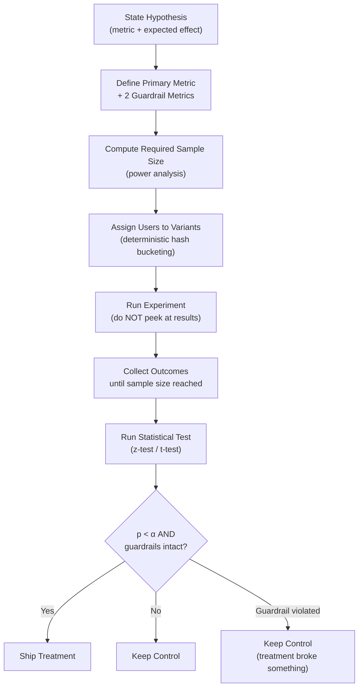

# A/B Testing LLM Features — GrowthBook, Statsig, and the Vibes Problem

## Learning Objectives

1. Implement a valid A/B test for two LLM prompt variants with deterministic bucketing, metric collection, and a two-proportion z-test computed from scratch.
2. Detect when sample size is insufficient to distinguish signal from noise by computing minimum detectable effect and statistical power.
3. Configure a feature flag that routes users to different LLM prompt variants using deterministic hashing.
4. Compare "vibes-based" evaluation against statistical evaluation and articulate the failure modes of each.
5. Evaluate GrowthBook and Statsig on their experimentation primitives — CUPED, sequential testing, multiple-comparison corrections — as they apply to LLM feature testing.

## The Problem

You rewrote a system prompt. The outputs look cleaner. Your teammate agrees — "yeah, that's better." You ship it to production. Two weeks later, revenue per user is down 12%. You revert. The outputs now look worse to the same teammate who said they looked better. Welcome to the vibes problem: human evaluation of LLM output is noisy, biased toward recency, contaminated by framing effects, and uncalibrated against any business metric. Every team that ships LLM features without an experiment framework hits this wall. Some hit it repeatedly.

The vibes problem is structural, not personal. LLM output is stochastic — the same prompt produces different outputs across calls. Quality is multi-dimensional (accuracy, tone, latency, cost, safety). A human rater looking at ten samples has no statistical power to distinguish a 2% conversion lift from noise. And LLM features compound the problem: a prompt change can shift latency distributions, trigger different fallback paths, and interact with downstream scoring models in ways invisible to a human reading outputs side by side.

The industry has two separate questions that teams conflate at their peril. Evals answer: "can the model do the job?" — measured offline against a labeled dataset. A/B tests answer: "do users care?" — measured online against a business metric. A prompt can win every eval and still lose the A/B test because it produces outputs that are technically correct but less engaging, or slower, or formatted in a way that reduces click-through. Shipping on evals alone is incomplete. Shipping on vibes alone is malpractice.

Real cases anchor this. Nextdoor ran AI subject-line experiments and found that reward-function refinement — not prompt wording — was the lever that moved CTR by ~1% [CITATION NEEDED — concept: Nextdoor AI subject-line CTR experiment details]. Khan Academy's Khanmigo team iterated on a latency-vs-math-accuracy tradeoff axis, treating response time as a first-class metric alongside correctness. A chatbot reward-model variant delivered +70% conversation length and +30% retention — a result invisible to vibes-based review because no human rater would have predicted that longer conversations correlated with retention [CITATION NEEDED — concept: chatbot reward-model variant +70% conversation length case study source]. The lesson: if you can't measure it against a business metric, you can't ship it.

## The Concept

A valid A/B test for an LLM feature follows the same experimental design pattern as any controlled experiment: state a hypothesis, assign users to variants via randomization, define metrics in advance, run a statistical test, make a decision. What changes for LLM features is the difficulty of each step.

**Hypothesis.** The hypothesis is a falsifiable statement about a specific metric. "Prompt B produces higher-quality summaries" is not a hypothesis — "quality" is undefined. "Prompt B increases the click-through rate on generated summaries from 3.0% to 3.5%" is a hypothesis. The difference matters because the metric determines the sample size calculation, the statistical test, and the decision threshold.

**Variant assignment.** Each user (or session, or request — the unit of randomization must be decided in advance) gets deterministically assigned to a variant. Deterministic means the same user always sees the same variant — you hash the user ID and check which bucket it falls into. This prevents the same user from seeing both variants across sessions, which would contaminate the treatment effect.

**Metric definition.** You need one primary metric (the thing you're trying to move) and at least two guardrail metrics (things you don't want to break). For an LLM-powered email subject line, the primary metric might be open rate; guardrails might be unsubscribe rate and spam complaint rate. For a chatbot, the primary metric might be conversation length; guardrails might be latency p95 and cost per conversation. Defining metrics after looking at results is called HARKing (hypothesizing after results are known) and it invalidates your p-values.

**Statistical test.** For binary metrics (converted / didn't convert), use a two-proportion z-test or chi-squared test. For continuous metrics (revenue per user, latency, conversation length), use Welch's t-test. The test produces a p-value: the probability of observing a difference this large or larger if there is no real difference between variants. You compare the p-value to a significance threshold (α, typically 0.05) decided in advance.



**Why LLM features are harder to test than UI changes.** Three reasons. First, stochastic output: the same user hitting the same prompt gets a different response each time, adding variance that increases the sample size needed. Second, latency variance: LLM calls have fat-tailed latency distributions, and a prompt that produces slightly better output but takes 800ms longer may reduce engagement through a mechanism unrelated to content quality. Third, subjective quality: if your primary metric depends on human ratings, your raters need calibration, and inter-rater reliability becomes part of your measurement error budget.

**Why "show both outputs and ask which is better" is not an A/B test.** Side-by-side preference testing is useful during development — it's a fast way to iterate. But it measures rater preference, not user behavior. Raters are not users. Raters see the output in isolation; users see it embedded in a product flow with competing attention demands. Preference surveys also have different statistical requirements: they produce paired comparison data (each rater compares A vs. B), not independent group data (treatment group vs. control group). The statistical test is different (Wilcoxon signed-rank, not z-test), the sample size calculation is different, and the external validity is lower because rater preference is a proxy, not the business metric.

**Frequentist vs. Bayesian.** Most A/B testing platforms offer both. Frequentist testing asks: "if there's no real difference, what's the probability of seeing this data?" — that's the p-value. Bayesian testing asks: "given this data, what's the probability that variant B is better than variant A by at least X%?" — that's the posterior distribution. Frequentist methods are more widely understood and have cleaner stopping rules (reach sample size, then check p-value). Bayesian methods allow "always-on" experiments where you can check results at any time without inflating false positive rates, but they require specifying a prior distribution, which introduces its own subjectivity. GrowthBook supports both; Statsig uses a sequential testing approach (a frequentist variant that allows valid early stopping). For LLM features where you may want to ship quickly, sequential testing is practical — but read the platform's docs on how it controls false positive rates, because the math is not the same as a fixed-horizon z-test.

**Multiple comparison correction.** If you run one test with one metric and α = 0.05, your false positive rate is 5%. If you run the same test with 20 metrics, your expected false positives are 1 — you'll almost certainly see at least one "significant" result by chance. The Benjamini-Hochberg procedure controls the false discovery rate (the proportion of significant results that are false positives). Bonferroni correction is more conservative — it divides α by the number of tests. GrowthBook implements both; you should know which one your team defaults to, because the choice determines whether your "winning" variant actually won.

## Build It

The mechanism behind variant assignment is deterministic hashing. You take a user identifier, hash it (typically using a fast non-cryptographic hash like murmur3 or even Python's built-in `hash` with a fixed seed), take the result modulo 100, and check which bucket range it falls into. A 50/50 split assigns buckets 0–49 to control and 50–99 to treatment. The same user ID always produces the same hash, so they always see the same variant — across sessions, across requests, across restarts. This is what makes it a valid experiment: each user is exposed to exactly one variant.

Here is a complete, runnable implementation of an A/B test for two LLM prompt variants. It assigns users to variants via deterministic hashing, generates synthetic outcomes, and computes the z-test from scratch — no external A/B testing library, just `math` and `scipy.stats` for the normal CDF.

```python
import hashlib
import math
import random
from scipy.stats import norm

random.seed(42)

PROMPT_A = """Summarize the following article in 2-3 sentences for a busy professional audience."""

PROMPT_B = """Summarize the following article in 2-3 sentences.
Focus on the single most actionable insight.
Write at a 9th-grade reading level."""

def assign_variant(user_id, experiment_key="summary_prompt_v1"):
    hash_input = f"{experiment_key}:{user_id}".encode("utf-8")
    hash_val = int(hashlib.md5(hash_input).hexdigest(), 16)
    bucket = hash_val % 100
    return "treatment" if bucket >= 50 else "control"

user_ids = [f"user_{i}" for i in range(5000)]

assignments = [(uid, assign_variant(uid)) for uid in user_ids]

def simulate_outcome(variant):
    if variant == "control":
        click_prob = 0.030
    else:
        click_prob = 0.038
    return 1 if random.random() < click_prob else 0

outcomes = [(uid, variant, simulate_outcome(variant)) for uid, variant in assignments]

control_clicks = sum(o for _, v, o in outcomes if v == "control")
treatment_clicks = sum(o for _, v, o in outcomes if v == "treatment")
control_total = sum(1 for _, v, _ in outcomes if v == "control")
treatment_total = sum(1 for _, v, _ in outcomes if v == "treatment")

print(f"Control:     {control_clicks}/{control_total} = {control_clicks/control_total:.4f}")
print(f"Treatment:   {treatment_clicks}/{treatment_total} = {treatment_clicks/treatment_total:.4f}")

def two_proportion_z_test(c1, n1, c2, n2):
    p1 = c1 / n1
    p2 = c2 / n2
    p_pool = (c1 + c2) / (n1 + n2)
    se = math.sqrt(p_pool * (1 - p_pool) * (1/n1 + 1/n2))
    if se == 0:
        return 0.0, 1.0
    z = (p2 - p1) / se
    p_value = 2 * (1 - norm.cdf(abs(z)))
    return z, p_value

z, p = two_proportion_z_test(control_clicks, control_total, treatment_clicks, treatment_total)

print(f"\nz-statistic: {z:.4f}")
print(f"p-value:     {p:.6f}")
print(f"Significant at α=0.05: {'YES' if p < 0.05 else 'NO'}")

control_rate = control_clicks / control_total
treatment_rate = treatment_clicks / treatment_total
relative_lift = (treatment_rate - control_rate) / control_rate
print(f"\nRelative lift: {relative_lift:+.2%}")

mde = 0.20
required_per_variant = math.ceil(16 * 0.035 * (1 - 0.035) / (0.035 * mde) ** 2)
print(f"\nApprox sample needed per variant for MDE={mde:.0%} of baseline: {required_per_variant}")
print(f"Actual sample per variant: ~{control_total}")
```

Run this. The output shows control and treatment conversion rates, the z-statistic, the p-value, and whether the result is significant at α = 0.05. The `two_proportion_z_test` function is the core — it computes the pooled proportion, the standard error, the z-statistic, and the two-tailed p-value. This is the exact computation that GrowthBook and Statsig run server-side, just stripped of the UI layer.

Now let's look at the feature flag mechanism — how you'd route real users in production code. This is the same deterministic hash bucketing, wrapped as a function that returns the prompt to send to the LLM:

```python
import hashlib

def get_prompt_variant(user_id, experiment_key="summary_prompt_v1", rollout_pct=50):
    hash_input = f"{experiment_key}:{user_id}".encode("utf-8")
    hash_val = int(hashlib.md5(hash_input).hexdigest(), 16)
    bucket = hash_val % 100
    if bucket < rollout_pct:
        return "treatment", PROMPT_B
    return "control", PROMPT_A

test_users = ["alice", "bob", "carol", "dave", "eve"]
for uid in test_users:
    variant, prompt = get_prompt_variant(uid)
    print(f"{uid}: {variant} (prompt length: {len(prompt)} chars)")

srm_control = sum(1 for uid in test_users if get_prompt_variant(uid)[0] == "control")
srm_treatment = len(test_users) - srm_control
print(f"\nSplit: {srm_control} control / {srm_treatment} treatment")
```

This is the pattern Statsig and GrowthBook implement internally: a hash function on (experiment_key, user_id) produces a deterministic bucket, and the bucket range determines variant assignment. The `rollout_pct` parameter lets you ramp treatment from 1% to 50% to 100% without changing the assignment of users already in the treatment bucket — a user assigned to treatment at 50% rollout is still in treatment at 51% rollout.

The last mechanism to understand is statistical power — the probability that your test will detect a real effect if one exists. Low power is the silent killer of LLM experiments: you run a test with 200 users, see no significant difference, conclude the prompt change didn't help, and ship the old one. But with 200 users and a 3% baseline conversion rate, your test couldn't detect anything smaller than a ~100% lift. You didn't prove "no effect" — you proved "we couldn't measure it."

```python
import math
from scipy.stats import norm

def required_sample_size(baseline_rate, mde_relative, alpha=0.05, power=0.80):
    mde_absolute = baseline_rate * mde_relative
    pooled = baseline_rate + mde_absolute / 2
    z_alpha = norm.ppf(1 - alpha / 2)
    z_beta = norm.ppf(power)
    n = ((z_alpha + z_beta) ** 2 * 2 * pooled * (1 - pooled)) / (mde_absolute ** 2)
    return math.ceil(n)

scenarios = [
    ("Email open rate", 0.03, 0.10),
    ("Email open rate", 0.03, 0.05),
    ("Chat engagement", 0.15, 0.10),
    ("Chat engagement", 0.15, 0.05),
    ("Purchase rate", 0.02, 0.20),
    ("Purchase rate", 0.02, 0.10),
]

print(f"{'Metric':<22} {'Baseline':<12} {'MDE (rel)':<12} {'N per variant':<15}")
print("-" * 61)
for name, baseline, mde in scenarios:
    n = required_sample_size(baseline, mde)
    print(f"{name:<22} {baseline:<12.2%} {mde:<12.0%} {n:<15,}")

print("\n--- Power at various sample sizes (baseline=3%, true lift=10%) ---")
baseline = 0.03
true_rate_treatment = baseline * 1.10
pooled = (baseline + true_rate_treatment) / 2
z_alpha = norm.ppf(0.975)
for n in [500, 1000, 5000, 10000, 50000]:
    se = math.sqrt(2 * pooled * (1 - pooled) / n)
    z_effect = (true_rate_treatment - baseline) / se
    achieved_power = 1 - norm.cdf(z_alpha - z_effect)
    print(f"N={n:>6,} per variant → power = {achieved_power:.2%}")
```

Run this and look at the sample sizes. Detecting a 5% relative lift on a 3% baseline (a change from 3.0% to 3.15%) requires ~150,000 users per variant. That's why most LLM prompt experiments at early-stage companies are underpowered — the traffic doesn't exist. In that regime, you either accept vibes-based iteration (with eyes open about the risk), or you shift your primary metric to something more frequent (e.g., message-level engagement instead of purchase).

## Use It

The experiment design pattern applies directly to GTM enrichment pipelines. A Clay enrichment waterfall is a sequence of LLM calls — each one with a prompt, a model choice, and generation parameters. When you swap a prompt in your enrichment waterfall (say, the prompt that classifies a company's ICP fit from 1–10), you are running an LLM feature change. If your downstream metric is meeting bookings per 1,000 enriched contacts, you need the same experimental discipline: deterministic variant assignment on contact ID, a primary metric (reply rate, meeting rate), and guardrails (bounce rate, spam complaint rate, enrichment cost per contact).

Versioning your Clay tables is the GTM equivalent of model versioning in MLOps. When you change an enrichment prompt, you are changing the scoring function for every contact that flows through it. Without A/B testing, you cannot attribute a change in reply rate to your prompt change versus list quality, seasonality, or sender reputation drift. The mechanism is identical to what we built above: hash the contact ID, assign to control (old prompt) or treatment (new prompt), route the enrichment call accordingly, and measure the downstream metric once enough contacts have flowed through both variants.

Scoring drift is the second GTM application. Your enrichment prompt produces an ICP fit score. Over time, the distribution of scores may shift — not because the prompt changed, but because the input data changed (different industries in the pull, different company sizes, more noisy firmographic data). This is conceptually identical to model drift in MLOps. The detection mechanism is the same statistical machinery: you monitor the score distribution over time and run a distributional test (KS test, population stability index) to detect when the drift exceeds a threshold. GrowthBook and Statsig both support guardrail metrics that fire alerts when a metric drifts outside expected bounds — the same machinery you use to protect an A/B test guardrail protects your production enrichment pipeline.

For GTM teams that don't have engineering bandwidth to wire up Statsig or GrowthBook, the deterministic hash bucketing pattern from the Build It section is enough to run a manual test. Export your contact list, assign variants with the `assign_variant` function, run two enrichment versions in parallel Clay tables, and compute the z-test on whatever outcome you're measuring (reply rate, meeting booked, qualification rate). It won't have sequential testing or CUPED, but it will be statistically valid if you pre-decide your sample size and don't peek.

## Ship It

Shipping an LLM feature change into a production GTM stack (Clay, Outreach, Salesforce) requires three integration points: the feature flag (who sees which variant), the metric pipeline (how outcomes flow back), and the decision gate (when you declare a winner).

**Feature flag.** In a codebase, you'd use Statsig or GrowthBook's SDK. In a GTM stack built on Clay + Zapier + Outreach, the "feature flag" is often a column in your Clay table: a formula that hashes the row ID and returns "control" or "treatment," then routes to a different enrichment column or webhook. This is hacky but statistically valid as long as the assignment is deterministic and pre-registered.

**Metric pipeline.** The hard part in GTM is closing the loop. You assign a contact to treatment, send them an AI-personalized email generated by the new prompt, and... then what? You need reply data, meeting data, and pipeline data to flow back to the row so you can compute conversion rates per variant. This typically means a webhook from Outreach or your CRM back into Clay (or a data warehouse), tagged with the variant assignment. Without this loop, you have assignments but no outcomes, and no outcomes means no experiment.

**Decision gate.** Set the rules before the test starts. "We will run this test until we have 5,000 contacts per variant or 4 weeks have elapsed, whichever comes first. We will declare treatment the winner if p < 0.05 on reply rate AND the guardrail (unsubscribe rate) does not increase by more than 0.2 percentage points." Write this down. Share it with the team. Do not change it when you see the results. This is the single most common failure mode in applied experimentation — not bad statistics, but post-hoc rationalization of a result you didn't expect.

**Platform comparison for GTM teams.** GrowthBook is open-source and warehouse-native: it runs queries against your data warehouse (BigQuery, Snowflake, Redshift) to compute experiment results. If your GTM data already lives in a warehouse (e.g., Census or Hightouch syncs CRM data to BigQuery), GrowthBook can run experiments on it without a separate event pipeline. Statsig is an all-in-one platform: it collects events via SDK, computes results server-side, and offers sequential testing and CUPED out of the box. Statsig was acquired by OpenAI in September 2025 for $1.1B [CITATION NEEDED — concept: confirm OpenAI acquisition of Statsig date and amount], which may matter for vendor evaluation depending on your organization's posture on platform consolidation. For GTM teams, the practical question is: where does your outcome data live? If it's in the warehouse, GrowthBook's SQL-native approach is a natural fit. If you're willing to instrument event tracking in your GTM tools, Statsig's integrated pipeline reduces integration overhead.

## Exercises

**Exercise 1 (Easy).** You have two prompt variants for an AI-powered cold email opener. Variant A (control) is the current production prompt. Variant B (treatment) uses a more direct tone. Your business goal is to increase reply rate on outbound campaigns. Write down: (a) the primary metric, (b) two guardrail metrics, (c) the null hypothesis, (d) the minimum detectable effect you'd consider practically meaningful (not statistically — practically, as in "would change how we operate").

**Exercise 2 (Medium).** Below is raw experiment data for 500 users. Each row has a user ID, variant assignment, and whether they converted (1 = yes, 0 = no). Compute the conversion rate for each variant, run the two-proportion z-test, and report whether the difference is significant at α = 0.05. Then compute the 95% confidence interval for the difference in conversion rates.

```python
import random
import math
from scipy.stats import norm

random.seed(99)
data = []
for i in range(500):
    uid = f"user_{i}"
    variant = "treatment" if i % 2 == 0 else "control"
    if variant == "control":
        converted = 1 if random.random() < 0.08 else 0
    else:
        converted = 1 if random.random() < 0.12 else 0
    data.append((uid, variant, converted))

control = [(d[2]) for d in data if d[1] == "control"]
treatment = [(d[2]) for d in data if d[1] == "treatment"]

c1 = sum(control)
n1 = len(control)
c2 = sum(treatment)
n2 = len(treatment)

print(f"Control:   {c1}/{n1} = {c1/n1:.4f}")
print(f"Treatment: {c2}/{n2} = {c2/n2:.4f}")

p1 = c1 / n1
p2 = c2 / n2
diff = p2 - p1
se_diff = math.sqrt(p1*(1-p1)/n1 + p2*(1-p2)/n2)
z_alpha = norm.ppf(0.975)
ci_low = diff - z_alpha * se_diff
ci_high = diff + z_alpha * se_diff

print(f"Difference: {diff:+.4f}")
print(f"95% CI: [{ci_low:+.4f}, {ci_high:+.4f}]")

p_pool = (c1 + c2) / (n1 + n2)
se_pool = math.sqrt(p_pool * (1 - p_pool) * (1/n1 + 1/n2))
z = diff / se_pool
p_value = 2 * (1 - norm.cdf(abs(z)))
print(f"z = {z:.4f}, p = {p_value:.4f}")
print(f"Significant at α=0.05: {p_value < 0.05}")
```

Run this code. Is the result significant? Does the confidence interval include zero? If the CI includes zero, how does that relate to the p-value? (They should agree — if you understand why, you understand the relationship between hypothesis testing and confidence intervals.)

**Exercise 3 (Hard).** You're testing a new LLM model (GPT-4o vs GPT-4o-mini) for an enrichment pipeline. Your primary metric is enrichment accuracy (continuous, 0.0–1.0) measured against a gold-standard labeled set of 200 companies per variant. The guardrail is cost per enrichment ($). Design the experiment: (a) Which statistical test do you use for the primary metric? (b) How do you test the guardrail? (c) Given that accuracy differences between models are typically 1–3 percentage points and your gold standard has inter-rater reliability of κ = 0.75, is 200 samples per variant enough? Compute the required sample size using the `required_sample_size` function from Build It, adapted for a continuous metric.

## Key Terms

**Control** — The existing variant (prompt, model, parameter set) that treatment is compared against. Serves as the baseline.

**Treatment** — The new variant being tested. The thing you're considering shipping.

**Primary metric** — The single business metric you're trying to move. Decided before the test starts. Example: reply rate, meeting booking rate, purchase rate.

**Guardrail metric** — A metric you don't want to break. Example: unsubscribe rate, latency p95, cost per call. A treatment that wins on the primary metric but violates a guardrail should not ship.

**Significance level (α)** — The threshold below which you reject the null hypothesis. Typically 0.05. Decided before the test starts.

**Statistical power** — The probability of detecting a real effect of a given size. Typically targeted at 80%. Low power means you'll miss real effects (false negatives).

**Minimum detectable effect (MDE)** — The smallest effect size your test can reliably detect given your sample size, significance level, and power. If your MDE is 10% relative lift and the true effect is 3%, your test will come back non-significant even though the treatment is genuinely better.

**CUPED** — Controlled-experiment using pre-experiment data. A variance reduction technique that uses pre-treatment covariates to reduce the sample size needed for a given power. Both GrowthBook and Statsig implement it.

**Sequential testing** — A statistical framework that allows valid inference at any point during the experiment, enabling early stopping without inflating false positive rates. Statsig uses this; GrowthBook offers it as one of three engines.

**Benjamini-Hochberg** — A procedure that controls the false discovery rate when running multiple comparisons. Less conservative than Bonferroni.

**Deterministic bucketing** — Assigning users to variants via a hash function on (experiment_key, user_id). Ensures the same user always sees the same variant across sessions.

**SRM (Sample Ratio Mismatch)** — When the actual ratio of users in control vs. treatment doesn't match the intended ratio (e.g., you configured 50/50 but observe 52/48). Usually indicates a bug in assignment logic or data pipeline. GrowthBook auto-checks for this.

## Sources

- Chatbot reward-model variant delivering +70% conversation length and +30% retention: [CITATION NEEDED — concept: source for chatbot reward-model variant case study with +70% conversation length and +30% retention metrics]
- Nextdoor AI subject-line experiments delivering ~1% CTR lift after reward-function refinement: [CITATION NEEDED — concept: Nextdoor AI subject-line experimentation details and published CTR results]
- Khan Academy Khanmigo latency-vs-math-accuracy tradeoff: [CITATION NEEDED — concept: Khan Academy Khanmigo engineering decisions on latency vs accuracy tradeoff]
- Statsig acquired by OpenAI for $1.1B in September 2025: [CITATION NEEDED — concept: confirm OpenAI acquisition of Statsig, date and deal value]
- GrowthBook features (CUPED, sequential testing, Bayesian/Frequentist, Benjamini-Hochberg, Bonferroni, SRM checks): GrowthBook documentation at docs.growthbook.io
- Statsig features (sequential testing, CUPED, all-in-one platform): Statsig documentation at docs.statsig.com
- Statistical power and minimum detectable effect for LLM output experiments: [CITATION NEEDED — concept: peer-reviewed guidance on statistical power calculations for non-deterministic LLM output experiments]
- GTM context: Zone 17 MLOps/GTM lifecycle mapping — versioning enrichment waterfalls, detecting scoring model drift. Internal curriculum reference: stages/00-b-gtm-content-mapping/output/gtm-topic-map.md