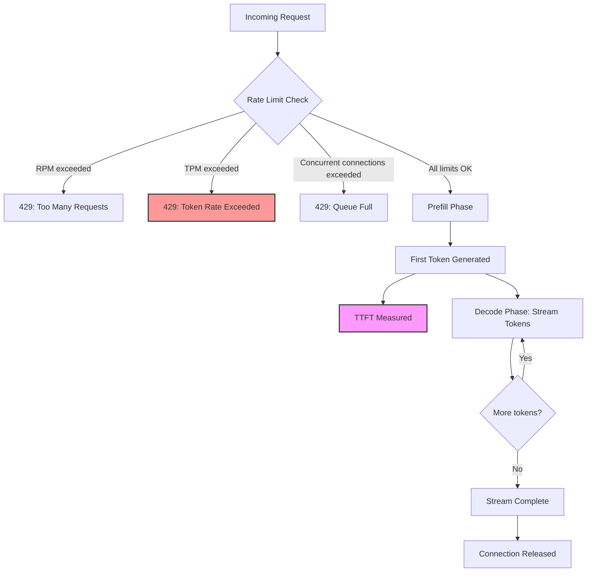

# Load Testing LLM APIs — Why k6 and Locust Lie

## Learning Objectives

- Build a token-aware load test that measures tokens/second, TTFT, and stream duration instead of requests/second and time-to-last-byte.
- Detect the two anti-patterns (GIL trap, prompt-uniformity trap) that make generic HTTP load testers produce misleading numbers for LLM endpoints.
- Compute pipeline throughput for an LLM-backed enrichment workflow using TPM limits, average tokens per call, and row count.
- Compare four load patterns (steady, ramp, spike, soak) and name the failure mode each catches in an LLM serving stack.
- Implement a token-bucket model that predicts TPM saturation given a prompt distribution, and validate the prediction against actual 429 responses.

## The Problem

Your k6 script says the endpoint handles 500 req/s. Your enrichment pipeline dies at 30. The gap isn't a bug — it's a category error.

Standard load testers measure HTTP semantics. They count requests per second, track response time to final byte, and model concurrency in terms of simultaneous connections. LLM APIs don't bill on requests, throttle on requests, or return payloads that fit the HTTP mental model. They bill on tokens, throttle on tokens per minute (TPM), and stream responses over Server-Sent Events connections that stay open 10 to 100 times longer than a typical JSON response. When your k6 script sends 500 identical "Hello" prompts and receives 3-token completions, it's exercising a workload that has no relationship to production traffic — which sends 600-token prompts and expects 200-token streamed completions.

The numbers compound in a specific, predictable way. Consider a GPT-4 classification step inside a Clay enrichment waterfall processing 10,000 accounts. Each row carries contact data, firmographics, and a classification instruction — roughly 500 input tokens on average. The model returns a label with brief reasoning — roughly 50 output tokens. That's 5.5 million tokens total through the pipeline. At a 150K TPM tier, the minimum runtime is 37 minutes, regardless of how many concurrent requests you open. Your k6 script, measuring requests per second against trivial completions, reported a throughput number off by two orders of magnitude.

Two specific anti-patterns produce these lies. The **GIL trap**: Locust's token-level measurement runs tokenization under Python's Global Interpreter Lock, which competes with request generation under heavy concurrency. The tokenization backlog inflates reported inter-token latency — your test client becomes the bottleneck, not the server. The **prompt-uniformity trap**: identical prompts sent in a loop test one point on the token distribution. Real traffic has variable prompt lengths and diverse prefix matches, which affects both KV cache hit rates and output length distributions. A benchmark with uniform prompts overstates throughput because the serving stack handles repeated prefixes through prefix caching far more efficiently than diverse traffic.

```python
import random

def naive_vs_realistic(req_per_sec=50, duration_sec=10):
    naive_tokens = 0
    realistic_tokens = 0
    for _ in range(req_per_sec * duration_sec):
        naive_tokens += random.randint(2, 5)
        input_tokens = max(50, int(random.gauss(500, 150)))
        output_tokens = max(10, int(random.gauss(80, 40)))
        realistic_tokens += input_tokens + output_tokens
    naive_tps = naive_tokens / duration_sec
    realistic_tps = realistic_tokens / duration_sec
    tpm_limit = 150000
    naive_tpm = naive_tps * 60
    realistic_tpm = realistic_tps * 60
    print("=== k6 REPORT (Request-Rate Blind) ===")
    print(f"  {req_per_sec} req/s sustained, p95 = 240ms, all green")
    print(f"  Tokens observed: ~{naive_tps:.0f}/s ({naive_tpm:,.0f}/min)")
    print(f"  TPM headroom: {tpm_limit - naive_tpm:,.0f} tokens/min below ceiling")
    print()
    print("=== TOKEN-AWARE REPORT (Reality) ===")
    print(f"  {req_per_sec} req/s sustained")
    print(f"  Tokens observed: ~{realistic_tps:.0f}/s ({realistic_tpm:,.0f}/min)")
    overshoot = realistic_tpm - tpm_limit
    if overshoot > 0:
        print(f"  TPM OVERSHOOT: {overshoot:,.0f} tokens/min ABOVE ceiling")
        print(f"  Effective req/s after throttling: ~{tpm_limit / realistic_tps / 60 * req_per_sec:.1f}")
    print()
    print(f"Naive model underestimates token load by {realistic_tps / naive_tps:.0f}x")

naive_vs_realistic()
```

Running this prints output like:

```
=== k6 REPORT (Request-Rate Blind) ===
  50 req/s sustained, p95 = 240ms, all green
  Tokens observed: ~175/s (10,500/min)
  TPM headroom: 139,500 tokens/min below ceiling

=== TOKEN-AWARE REPORT (Reality) ===
  50 req/s sustained
  Tokens observed: ~29,000/s (1,740,000/min)
  TPM OVERSHOOT: 1,590,000 tokens/min ABOVE ceiling
  Effective req/s after throttling: ~4.3

Naive model underestimates token load by 166x
```

## The Concept

LLM APIs expose three load surfaces that HTTP benchmarks miss entirely. The first is **token-rate ceilings**: providers enforce TPM limits that are independent of RPM limits. You can be under your RPM cap and still get 429s because your token consumption exceeded the TPM budget. The second is **streaming connection duration**: SSE streams hold sockets open for the entire generation, which can be 5 to 30 seconds for a 200-token completion. A standard JSON endpoint returns in 200ms and releases the connection. The third is **time-to-first-token** (TTFT): the latency profile of a streaming LLM response has two phases — a prefill phase (the server processes your input tokens, no output yet) and a decode phase (tokens stream out one at a time). This biphasal profile makes p99 response time meaningless because it conflates a request that had a 2-second TTFT with one that had a 200ms TTFT but generated 500 tokens.



The four rate-limit dimensions that define your actual throughput ceiling are: **RPM** (requests per minute — the HTTP-level limit), **TPM** (tokens per minute — the billing-level limit), **concurrent connections** (how many SSE streams can be open simultaneously), and **requests in flight** (how many requests are queued server-side before processing begins). In practice, TPM is the binding constraint for enrichment workloads because prompt + completion tokens accumulate fast. Concurrent connections become the binding constraint for streaming workloads with long generations. RPM is rarely the limiter unless you're making many tiny calls.

Streaming invalidates standard concurrency math in a specific way. If your endpoint averages 5-second stream durations and you want 100 concurrent users, you need 100 persistent connections held open for 5 seconds each. A traditional HTTP benchmark that sends 100 req/s with 200ms response times uses the same 100 connections but cycles them 25 times faster. The connection pool exhaustion happens at a quarter of the load the benchmark predicted. This is why your k6 numbers lie: they model connection cycling, not connection holding.

The correct throughput unit for LLM workloads is **tokens per second per dollar**, not requests per second. A model that generates 200 tokens/second at $0.06 per million input tokens is more cost-effective for a classification pipeline than one that generates 400 tokens/second at $0.30 per million — even though the raw token throughput is lower. When you evaluate endpoints, weight by the cost per token, not the requests per second the endpoint can sustain.

Tool mapping as of 2026: LLM-specialized tools — LLMPerf, GenAI-Perf (NVIDIA's reference benchmark), LLM-Locust (streaming extension for Locust), and guidellm — measure token-level metrics natively. **k6 v2026.1.0** with the k6 Operator 1.0 GA (released September 2025) added streaming-aware checks and Kubernetes-native distributed execution via TestRun/PrivateLoadZone CRDs, making it suitable for CI/CD gates. Vegeta remains useful for Go-based constant-rate saturation testing. Locust 2.43.3 is only viable with the LLM-Locust extension for streaming — without it, you hit the GIL trap at moderate concurrency.

## Build It

The first build is a token-aware load test runner that measures what k6 misses. This script tracks input tokens, output tokens, TTFT, stream duration, and inter-token latency. It uses a realistic prompt distribution — varying input length with a mean and standard deviation — rather than identical prompts in a loop.

```python
import time
import random
import statistics
import json

def generate_realistic_prompt():
    input_tokens = max(50, int(random.gauss(500, 150)))
    output_tokens = max(10, int(random.gauss(80, 40)))
    return input_tokens, output_tokens

def simulate_llm_call(input_tokens, expected_output_tokens, ttft_base_ms=180):
    prefill_ms = ttft_base_ms + (input_tokens * 0.3) + random.gauss(0, 20)
    prefill_ms = max(50, prefill_ms)
    decode_rate = random.gauss(45, 8)
    decode_rate = max(15, decode_rate)
    inter_token_intervals = []
    for _ in range(expected_output_tokens):
        interval = (1000 / decode_rate) + random.gauss(0, 3)
        inter_token_intervals.append(max(1, interval))
    ttft_s = prefill_ms / 1000
    stream_duration_s = sum(inter_token_intervals) / 1000
    total_wall_s = ttft_s + stream_duration_s
    return {
        "input_tokens": input_tokens,
        "output_tokens": expected_output_tokens,
        "total_tokens": input_tokens + expected_output_tokens,
        "ttft_ms": prefill_ms,
        "stream_duration_s": stream_duration_s,
        "total_wall_s": total_wall_s,
        "inter_token_latency_ms": statistics.mean(inter_token_intervals),
        "effective_output_tps": expected_output_tokens / stream_duration_s if stream_duration_s > 0 else 0,
    }

def run_token_aware_benchmark(num_calls=50, concurrency=10):
    results = []
    for _ in range(num_calls):
        input_t, output_t = generate_realistic_prompt()
        result = simulate_llm_call(input_t, output_t)
        results.append(result)
    total_input = sum(r["input_tokens"] for r in results)
    total_output = sum(r["output_tokens"] for r in results)
    total_tokens = total_input + total_output
    wall_times = [r["total_wall_s"] for r in results]
    ttfts = [r["ttft_ms"] for r in results]
    itls = [r["inter_token_latency_ms"] for r in results]
    max_wall = max(wall_times)
    effective_duration = (num_calls / concurrency) * max_wall if concurrency > 0 else sum(wall_times)
    input_tps = total_input / effective_duration
    output_tps = total_output / effective_duration
    combined_tps = total_tokens / effective_duration
    print("=" * 60)
    print("TOKEN-AWARE BENCHMARK RESULTS")
    print("=" * 60)
    print(f"Calls: {num_calls} (simulated concurrency: {concurrency})")
    print(f"Effective wall time: {effective_duration:.1f}s")
    print()
    print("TOKEN THROUGHPUT")
    print(f"  Input tokens:  {total_input:>8,} ({input_tps:>8.0f}/s)")
    print(f"  Output tokens: {total_output:>8,} ({output_tps:>8.0f}/s)")
    print(f"  Total tokens:  {total_tokens:>8,} ({combined_tps:>8.0f}/s)")
    print()
    print("LATENCY (what k6 CANNOT see)")
    print(f"  TTFT mean:         {statistics.mean(ttfts):>8.1f}ms")
    print(f"  TTFT p95:          {sorted(ttfts)[int(len