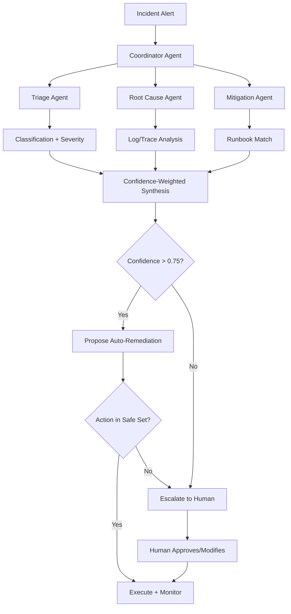

# SRE for AI — Multi-Agent Incident Response, Runbooks, Predictive Detection

## Learning Objectives

- Build a multi-agent incident response coordinator that dispatches specialized diagnostic agents and merges their findings using confidence-weighted voting.
- Implement sliding-window anomaly detection across correlated telemetry signals to identify precursor patterns before cascade failures.
- Compare static runbooks against dynamically generated runbook graphs, identifying the guardrails each requires.
- Trace a compound failure through a multi-agent pipeline to isolate where a degraded agent output poisons downstream agents.
- Evaluate whether a specific remediation action is safe for automated execution or requires human approval based on confidence thresholds.

## The Problem

A production AI agent cluster silently degrades. Latency on Agent 3 in a six-step research pipeline creeps from 200ms to 900ms over four minutes. Agent 4, which consumes Agent 3's structured output, starts receiving partial JSON — most fields populated, some missing. Agent 4 doesn't crash; it fills gaps with plausible-looking defaults. Agent 5 receives Agent 4's output, now subtly wrong, and proceeds. By the time the user sees a response, the pipeline has produced a confidently incorrect answer with no error logged anywhere. The p99 latency metric never crossed the alerting threshold because each agent individually stayed under its SLO. The error rate stayed at zero because no agent returned an error — they returned degraded outputs.

This is the incident class that traditional SRE was not built for. Traditional monitoring assumes components fail visibly: a service returns a 500, a pod gets OOM-killed, a database connection times out. Compound AI systems fail invisibly. One agent's degraded output becomes another agent's poisoned input, and the failure mode is semantic, not infrastructural. No single metric trips. The on-call engineer who gets paged at 3 a.m. — if anyone gets paged at all — faces a dashboard where every green light is lying.

The operational gap is structural. A human paging through Datadog, Loki, and three internal runbooks cannot trace a semantic cascade across six agents faster than the pipeline processes requests. By the time the human identifies Agent 3 as the source, thousands of degraded outputs have reached users. The response cycle — detect, investigate, isolate, mitigate — needs to compress from minutes to seconds. Multi-agent incident response is the architecture pattern that attempts this compression: specialized diagnostic agents working in parallel, coordinated by a supervisor that synthesizes their findings into a ranked action plan, with a human gate for any action that modifies production state.

## The Concept

Three mechanisms compose the 2026 AI SRE stack. Each builds on the one before it.

**Multi-agent incident response** replaces the single-on-call-engineer model with a coordinator agent that dispatches specialized diagnostic agents in parallel. A triage agent classifies the incident from structured alert payloads. A root-cause-analysis agent queries logs, traces, and service topology to isolate the failing component. A mitigation agent proposes remediation steps drawn from the runbook library. The coordinator collects all three outputs and resolves conflicts between them using confidence-weighted voting — not a fixed priority hierarchy where triage always outranks mitigation. When two agents disagree on root cause, the coordinator ranks hypotheses by aggregated confidence and escalates the top candidate to the human gate. Datadog Bits AI and Azure SRE Agent ship this pattern as managed products [CITATION NEEDED — concept: Datadog Bits AI and Azure SRE Agent multi-agent SRE capabilities]. NeuBird Hawkeye adds an adversarial layer: two models analyze the same incident independently, and agreement between them signals confidence while disagreement signals uncertainty that requires escalation [CITATION NEEDED — concept: NeuBird Hawkeye adversarial evaluation pattern].

**Runbooks as executable graphs** formalize the remediation knowledge. A traditional runbook is a wiki page — a linear sequence of "if X, then Y" steps written by an engineer who has since left the team. It rots. An executable runbook is a directed acyclic graph where each node is a diagnostic or remediation step, and edges represent conditional transitions based on observed state. The graph is not static: when an incident fires, the system matches the incident signature against a library of step templates and assembles a runbook graph dynamically. Before executing any node that modifies production state, the system validates the assembled graph against a simulator — a dry run that replays historical incident data through the proposed steps and checks for regressions. Static runbooks document what someone once knew. Generated runbooks adapt to the incident at hand. But generated runbooks without simulator validation are an automated way to make bad decisions faster. The guardrail is non-negotiable: no generated step executes in production without passing simulation.

**Predictive detection via telemetry correlation** moves the response cycle upstream of the alert. The mechanism streams telemetry — latency, token usage, error rates, semantic drift scores — into a sliding window, computes anomaly scores per signal using a rolling baseline, then runs causal correlation across signals to surface leading indicators. The goal is not to forecast a single metric. It is to detect the multivariate signature that precedes compound failures: latency rises on one agent, drift score increases on another, and error rate is still flat. That correlation pattern appears minutes before the cascade. MIT research reports an LLM trained on historical logs, GPU temperatures, and API error patterns predicted 89% of outages 10–15 minutes before they occurred [CITATION NEEDED — concept: MIT LLM outage prediction 89% accuracy, specific paper attribution]. The operational constraint is that prediction without actuation is just a dashboard — the prediction only matters if it triggers the incident response pipeline early enough to mitigate.

Auto-remediation stays deliberately narrow. The safe set is: restart a specific pod, rollback a specific deploy, increase a connection pool size, enable a fallback response path. Anything broader — re-architecting a service, changing routing logic, modifying agent prompts in production — requires human approval. Anyone selling "set it and forget it" autonomous remediation for compound AI systems is overselling the current state of the art. The human gate exists because confidence scores from diagnostic agents are calibrated against historical incidents, and novel failure modes produce confidently wrong diagnoses.

## Build It

You will build a minimal multi-agent incident responder in pure Python. The system takes a simulated incident stream, dispatches three diagnostic