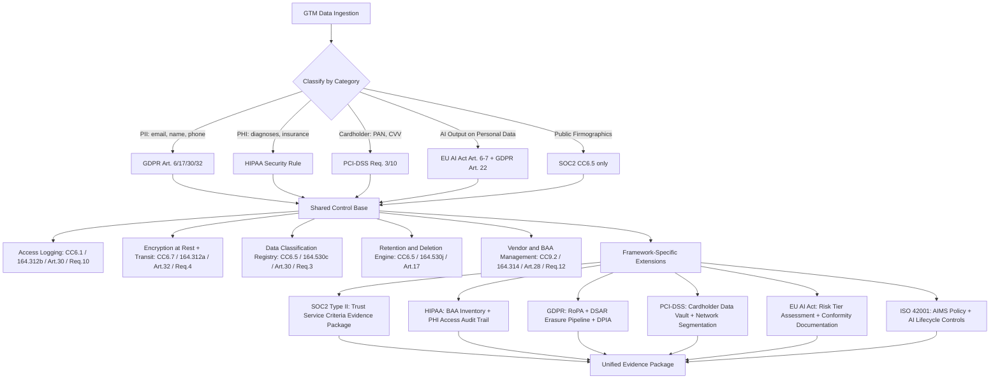

# Compliance — SOC 2, HIPAA, GDPR, PCI-DSS, EU AI Act, ISO 42001

## Learning Objectives

1. Map data flows through GTM systems to identify which compliance frameworks apply based on data type, geography, and processing activity.
2. Implement audit logging and data classification that produces SOC 2 Type II evidence artifacts.
3. Configure retention and deletion pipelines that enforce GDPR right-to-erasure on prospect and customer records.
4. Classify AI-powered GTM features by risk tier under the EU AI Act and ISO 42001.
5. Build a compliance-as-code pipeline that generates auditor-ready evidence from infrastructure and application logs.

## The Problem

Your outbound engine collects email addresses, firmographic data, behavioral signals, and—increasingly—AI-generated content. Every one of those data categories triggers obligations under at least one framework. A single unchecked webhook leaking PII to an unvetted vendor can invalidate your SOC 2 report, trigger GDPR fines up to 4% of global revenue, and kill enterprise deals during security review. The challenge is not that any single framework is impossibly complex—it is that six frameworks apply simultaneously, each with its own scope triggers, evidence formats, and enforcement mechanisms.

The instinct to treat compliance as a legal-only concern fails in practice. A legal team can write a Data Processing Addendum, but they cannot instrument your enrichment waterfall to stop sending personal data to a vendor that lacks a signed DPA. They cannot configure your CRM to auto-delete prospect records after the retention window expires. They cannot classify which of your AI features constitute "high-risk" systems under the EU AI Act. Compliance enforcement lives in the code, in the data pipeline, and in the access controls—not in a policy document that nobody reads after signing.

The second problem is audit fatigue. If you implement six separate compliance programs with independent logging, independent vendor reviews, and independent evidence collection, you will spend more time proving compliance than shipping product. The frameworks overlap heavily: access logging satisfies SOC 2 CC6.1, HIPAA §164.312(b), GDPR Article 30 records, and PCI-DSS Requirement 10 from the same log stream. The engineering task is to build shared primitives that emit evidence in the format each framework demands.

## The Concept

Each framework is a set of controls—policies, technical measures, and evidence requirements—that an auditor or regulator verifies. You do not implement six separate compliance programs. You implement a shared control base (access logging, encryption, data classification, retention enforcement, vendor management, incident response) and then add framework-specific extensions. The shared base covers 70–80% of requirements across all six frameworks. The extensions handle the remaining 20%: HIPAA's Business Associate Agreements, GDPR's data subject rights pipeline, PCI-DSS's network segmentation, and the EU AI Act's risk classification and conformity assessment.

The mechanism that makes this work is **data classification as a first-class system property**. Every record in your GTM stack—every prospect, every enrichment field, every AI-generated email, every support ticket—gets tagged with a data category at ingestion time. That tag propagates through your systems and triggers the correct retention policy, access controls, encryption requirements, and evidence logging automatically. Without classification, you cannot prove to an auditor which records contain PII versus public firmographics, and you cannot enforce deletion on the right subset of records.

The following flowchart shows how a single data classification decision drives framework selection, shared control application, and evidence generation:

Here is how the control families map across frameworks. This is the mapping your auditor uses to avoid requesting the same artifact six times:

| Control Family | SOC 2 | HIPAA | GDPR | PCI-DSS | EU AI Act | ISO 42001 |
|---|---|---|---|---|---|---|
| Access logging | CC6.1 | §164.312(b) | Art. 30 | Req. 10 | Art