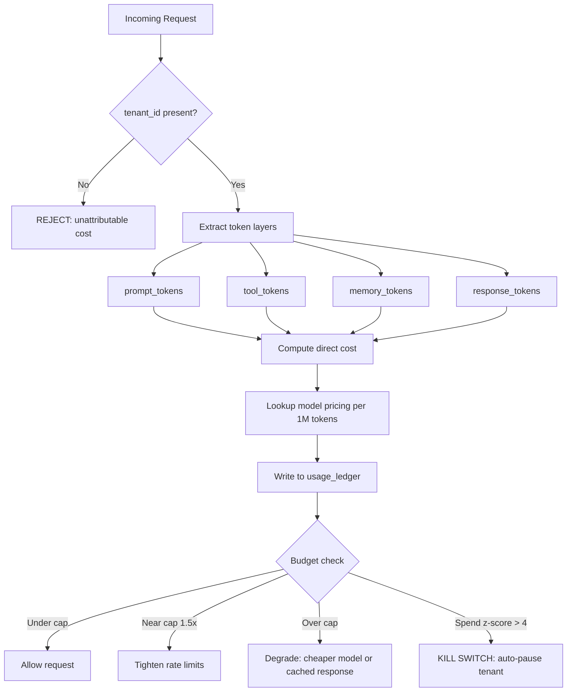

# FinOps for LLMs — Unit Economics and Multi-Tenant Attribution

## Learning Objectives

- Build a token-level cost attribution ledger that tracks per-tenant LLM spend across multiple models and billing periods.
- Implement a two-layer cost model combining direct token costs with allocated overhead using equal-split and proportional strategies.
- Compare overhead allocation methods and compute their impact on per-tenant gross margin.
- Construct a budget circuit-breaker that degrades gracefully when a tenant exceeds a monthly cost cap.
- Map per-tenant unit economics data to ICP refinement by identifying usage signatures of profitable versus subsidized accounts.

## The Problem

You ship an LLM-powered feature and price it at $50 per seat per month. For the first two months, the numbers look fine. Then usage scales and the invoice lands: $40,000 for the billing period, and you cannot answer the three questions your CFO is asking. Which tenant spent it. Which product surface drove it. Whether any individual customer is profitable.

The root cause is a mismatch between pricing structure and cost structure. Flat-rate pricing assumes cost is roughly uniform across users. LLM infrastructure breaks that assumption completely. One tenant that sends 5,000-token context blocks and requests 1,500-token completions on `gpt-4o` burns roughly $0.09 per call. Another tenant issuing the same call pattern on `gpt-4o-mini` burns $0.001. At 500 calls per day, the first tenant costs $1,350/month and the second costs $15/month — but both pay you the same $50. The heavy tenant is a net loss. You are subsidizing them with margin from the light tenant, and you cannot see it because your bill is a single aggregate number from the provider.

Traditional FinOps makes this worse, not better. Cloud cost tools are built around resource tagging — you tag a VM, a database instance, a load balancer. An LLM API call is not a resource; it is a transaction. You cannot tag it after the fact. You cannot allocate it by uptime. The engineering decisions that determine cost — prompt length, context window size, model selection, output token limits, retrieval-augmented context injection — are made inside application code at request time, not in infrastructure configuration. If you do not instrument attribution at the point of request creation, the data is gone forever. Retroactive tagging always misses.

## The Concept

The mechanism is a two-layer cost model. Layer one is **direct cost**: the actual dollars charged by the model provider, computed from token counts multiplied by per-model pricing. Layer two is **attributed overhead**: shared infrastructure costs (vector database hosting, embedding computation, gateway proxy, observability stack) amortized across tenants using a chosen allocation strategy. Direct cost is objective — you can reconcile it against the provider invoice. Overhead allocation is a policy decision, and the policy you choose changes which tenants appear profitable.

Before computing either layer, you need to understand what you are measuring. Every LLM request consumes tokens across four distinct layers: **prompt tokens** (the system and user instructions), **tool tokens** (function call schemas and results injected into context), **memory tokens** (conversation history or retrieved context from prior turns), and **response tokens** (the model's output). Single-bucket billing — where you only track total tokens — hides which of these is driving spend. A tenant whose prompts are lean but whose tool-augmented context balloons to 8,000 tokens per call has a fundamentally different cost profile than one who sends long prompts but gets short responses. The four-layer decomposition is what makes optimization actionable: you cannot reduce tool-token cost if you cannot see it.



Multi-tenant attribution requires three things to work end-to-end. First, a **tenant identifier** (`tenant_id`) must be propagated through every request — not added later by a log parser, but injected at request creation time by the application code that already knows who the caller is. Second, a **usage ledger** must accumulate token consumption per tenant per billing period, persisted to durable storage (not just in-memory metrics). Third, a **cost normalization function** must map raw provider pricing — which varies per model, per token type, and sometimes per region — into a consistent unit so that a `gpt-4o-mini` call and a `claude-3-5-sonnet` call can be summed on the same row of a P&L statement.

The allocation strategy for overhead is where finance and engineering decisions collide. An **equal split** divides overhead by tenant count — simple, but it penalizes light users and subsidizes heavy ones, making your lightest tenants look artificially expensive. A **proportional split** allocates overhead in proportion to direct cost — heavier users pay more overhead, which aligns cost with consumption but can push already-expensive tenants into negative margin. A **tier-weighted split** uses contract tier (Starter, Pro, Enterprise) as the multiplier, which decouples overhead from usage and ties it to what the customer actually pays. None of these is universally correct; the point is that the choice is explicit and its margin impact is visible in the report.

The enforcement ladder operates on top of this attribution data. Rate limits per tenant (set at 2–3x expected peak) catch bursts. Daily spend caps (set at 1.5–3x the contracted ceiling) catch sustained overuse. A kill switch keyed on spend z-score > 4 catches anomalous runaway — a tenant whose cost suddenly jumps four standard deviations above their historical mean, which usually indicates a bug in their integration or a prompt loop. Each rung should produce a specific, machine-readable response: a clear 429 with retry-after for rate limits, a graceful degradation for spend caps, and an auto-pause with on-call page for the kill switch.

## Build It

The code below implements the full cost engine in Python using only stdlib. It wraps simulated LLM calls in a decorator that captures model ID and token counts, writes each invocation to a SQLite ledger, and produces a per-tenant P&L report using two different overhead allocation strategies so you can see the margin impact side by side. Run it directly — no API keys, no external dependencies.

```python
import sqlite3
import random
import functools
from datetime import datetime

PRICING_PER_1M = {
    "gpt-4o": {"input": 2.50, "output": 10.00},
    "gpt-4o-mini": {"input": 0.15, "output": 0.60},
    "claude-3-5-sonnet": {"input": 3.00, "output": 15.00},
}

def compute_token_cost(model, input_tokens, output_tokens):
    rate = PRICING_PER_1M[model]
    return (input_tokens / 1_000_000) * rate["input"] + \
           (output_tokens / 1_000_000) * rate["output"]

conn = sqlite3.connect(":memory:")
conn.execute("""
    CREATE TABLE usage_ledger (
        id INTEGER PRIMARY KEY AUTOINCREMENT,
        tenant_id TEXT NOT NULL,
        model TEXT NOT NULL,
        input_tokens INTEGER NOT NULL,
        output_tokens INTEGER NOT NULL,
        prompt_tokens INTEGER NOT NULL,
        tool_tokens INTEGER NOT NULL,
        memory_tokens INTEGER NOT NULL,
        response_tokens INTEGER NOT NULL,
        cost REAL NOT NULL,
        timestamp TEXT NOT NULL
    )
""")

def traced(tenant_id):
    def decorator(fn):
        @functools.wraps(fn)
        def wrapper(prompt, **kwargs):
            model = kwargs.get("model", "gpt-4o")
            prompt_tokens = len(prompt.split())
            tool_tokens = kwargs.get("tool_tokens", random.randint(0, 500))
            memory_tokens = kwargs.get("memory_tokens", random.randint(0, 2000))
            response_tokens = random.randint(100, 800)
            total_input = prompt_tokens + tool_tokens + memory_tokens
            cost = compute_token_cost(model, total_input, response_tokens)
            conn.execute(
                """INSERT INTO usage_ledger
                (tenant_id, model, input_tokens, output_tokens,
                 prompt_tokens, tool_tokens, memory_tokens, response_tokens,
                 cost, timestamp)
                VALUES (?, ?, ?, ?, ?, ?, ?, ?, ?, ?)""",
                (tenant_id, model, total_input, response_tokens,
                 prompt_tokens, tool_tokens, memory_tokens, response_tokens,
                 cost, datetime.utcnow().isoformat())
            )
            conn.commit()
            return {
                "model": model,
                "input_tokens": total_input,
                "output_tokens": response_tokens,
                "cost": cost
            }
        return wrapper
    return decorator

def make_llm(tenant_id):
    @traced(tenant_id)
    def call(prompt, **kwargs):
        pass
    return call

tenants = {
    "acme-corp": {"revenue": 50.0, "calls": 600, "profile": "heavy"},
    "stark-industries": {"revenue": 50.0, "calls": 400, "profile": "medium"},
    "lightweight-llc": {"revenue": 50.0, "calls": 25, "profile": "light"},
}

random.seed(42