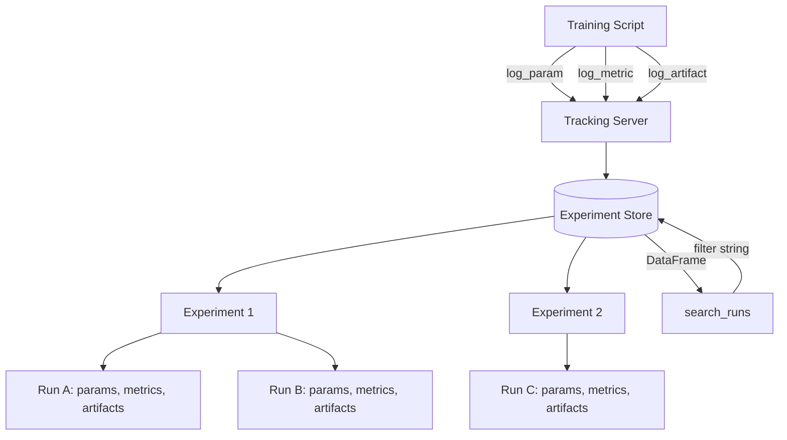

# MLflow Experiment Tracking

## Learning Objectives

1. Configure an MLflow tracking server and create experiments programmatically
2. Log parameters, metrics, and artifacts during model training runs
3. Compare multiple runs to identify optimal hyperparameter configurations
4. Retrieve and filter run data using the MLflow search API
5. Implement a multi-run training loop with automated logging

## The Problem

You trained a lead-scoring model on Tuesday. By Thursday you have forgotten which learning rate, which feature set, and which random seed produced that 0.84 F1 score. Your `experiments/` directory contains fourteen subdirectories with names like `run_final_v2_ACTUAL`. Your notes say "lr=0.001 worked better" but do not specify which dataset version, which preprocessing flags, or whether the validation split was stratified. Your colleague asks which model is in production and you open three notebooks before answering.

This is not a discipline problem. It is an infrastructure problem. Machine learning is empirical by nature — you change a hyperparameter, retrain, measure, repeat — and without a system that captures the full state of every run automatically, you are relying on conventions and memory. Both fail. Spreadsheets of run results break at scale, break harder under collaboration, and provide no programmatic way to query "which runs used feature set B and achieved precision above 0.8?"

Experiment tracking solves this by treating each training run as an immutable record with a unique identifier, a timestamp, structured inputs (parameters), structured outputs (metrics), and arbitrary file outputs (artifacts). The tracking system becomes the single source of truth for what was tried, what worked, and what is deployed. For any GTM workflow that produces a scored or classified output — lead scoring, ICP classification, churn prediction, enrichment prioritization — this record is what lets you debug why the model's behavior changed and reproduce the exact configuration that earned its place in production.

## The Concept

An experiment tracking system stores a write-once ledger of run metadata. Three categories of data get logged per run: parameters (inputs you set — learning rate, max depth, feature flags), metrics (outputs you measure — accuracy, F1, log loss), and artifacts (files you save — model weights, confusion matrix plots, serialized pipelines). Each run is immutable once written. Runs are grouped into experiments, and experiments are searchable via structured filter queries.

The immutability is the load-bearing design choice. If runs could be overwritten, you would lose the ability to compare across time and across team members — someone changes a metric value and suddenly the historical record is unreliable. MLflow enforces this by writing each run to a separate directory keyed by a UUID and by treating metric logs as append-only time series (you can log the same metric multiple times to plot training curves, but historical values are never deleted).

MLflow implements this with a client-server architecture. The tracking server receives logged data via REST API calls (remote) or local filesystem calls (local). Each run gets a unique ID, start and end timestamps, a status (running, finished, failed), and belongs to exactly one experiment. The `mlflow.search_runs()` function queries the underlying store with filter strings like `metrics.accuracy > 0.8 AND params.max_depth = '10'`.



The data model has four entity types. An **Experiment** is a named container for related runs — e.g., "lead_score_v2" or "churn_xgb." A **Run** is a single execution of a training script. Each run contains **Parameters** (string key-value pairs set by the user), **Metrics** (numeric key-value pairs, optionally time-series), **Tags** (string key-value pairs for run-level metadata like git commit hash or environment), and **Artifacts** (arbitrary files stored under the run's artifact URI). Parameters and tags are strings; metrics are numeric. This restriction matters because it determines what you can filter on — `metrics.f1 > 0.8` works, `params.n_estimators` requires string comparison.

## Build It

This script trains a `RandomForestClassifier` on synthetic data across three hyperparameter configurations, logs every parameter and metric to MLflow, saves the trained model as an artifact, then queries the tracking store to find the best-performing run. Every step produces observable output — print statements confirm what was logged and what the search returned.

```python
import mlflow
import mlflow.sklearn
from sklearn.datasets import make_classification
from sklearn.model_selection import train_test_split
from sklearn.ensemble import RandomForestClassifier
from sklearn.metrics import accuracy_score, f1_score
import os
import pandas as pd

X, y = make_classification(n_samples=500, n_features=10, n_informative=5, random_state=42)
X_train, X_test, y_train, y_test = train_test_split(X, y, test_size=0.2, random_state=42)

mlflow.set_tracking_uri("file:///tmp/mlruns")

experiment_name = "demo_classifier"
try:
    experiment_id = mlflow.create_experiment(
        experiment_name,
        artifact_location="/tmp/mlruns/artifacts"
    )
except mlflow.exceptions.MlflowException:
    experiment = mlflow.get_experiment_by_name(experiment_name)
    experiment_id = experiment.experiment_id

mlflow.set_experiment(experiment_name)

configs = [
    {"n_estimators": 10, "max_depth": 3},
    {"n_estimators": 50, "max_depth": 5},
    {"n_estimators": 100, "max_depth": 8},
]

for i, config in enumerate(configs):
    run_name = f"rf_est{config['n_estimators']}_depth{config['max_depth']}"
    with mlflow.start_run(run_name=run_name) as run:
        model = RandomForestClassifier(
            n_estimators=config["n_estimators"],
            max_depth=config["max_depth"],
            random_state=42
        )
        model.fit(X_train, y_train)

        preds = model.predict(X_test)
        acc = accuracy_score(y_test, preds)
        f1 = f1_score(y_test, preds)

        mlflow.log_param("n_estimators", config["n_estimators"])
        mlflow.log_param("max_depth", config["max_depth"])
        mlflow.log_param("random_state", 42)

        mlflow.log_metric("accuracy", acc)
        mlflow.log_metric("f1_score", f1)

        mlflow.sklearn.log_model(
            model,
            artifact_path="model",
            input_example=X_train[:5]
        )

        print(f"Run {i+1}: {run_name}")
        print(f"  accuracy={acc:.4f}  f1={f1:.4f}")
        print(f"  run_id={run.info.run_id}")
        print()

runs_df = mlflow.search_runs(
    experiment_names=[experiment_name],
    order_by=["metrics.accuracy DESC"]
)

print("=== All Runs (sorted by accuracy) ===")
print(runs_df[[
    "run_id",
    "params.n_estimators",
    "params.max_depth",
    "metrics.accuracy",
    "metrics.f1_score"
]].to_string(index=False))
print()

best = runs_df.iloc[0]
print(f"=== Best Run ===")
print(f"  run_id:       {best['run_id']}")
print(f"  n_estimators: {best['params.n_estimators']}")
print(f"  max_depth:    {best['params.max_depth']}")
print(f"  accuracy:     {best['metrics.accuracy']:.4f}")
print(f"  f1_score:     {best['metrics.f1_score']:.4f}")

filtered = mlflow.search_runs(
    experiment_names=[experiment_name],
    filter_string="metrics.f1_score > 0.85"
)
print(f"\n=== Runs with F1 > 0.85: {len(filtered)} ===")

artifact_root = "/tmp/mlruns/artifacts"
for root, dirs, files in os.walk(artifact_root):
    level = root.replace(artifact_root, "").count(os.sep)
    indent = "  " * level
    print(f"{indent}{os.path.basename(root)}/")
    if level <= 2:
        subindent = "  " * (level + 1)
        for file in files[:5]:
            print(f"{subindent}{file}")
```

Run this from a terminal with `mlflow` and `scikit-learn` installed. The output prints each run's metrics as it trains, then a sorted table of all runs, then the best run's details, then the artifact directory tree showing where models and metrics were stored. You should see three runs, their accuracy/F1 scores, and a nested directory structure under `/tmp/mlruns/artifacts/` containing the serialized model files.

To view the MLflow UI, run `mlflow ui --backend-store-uri file:///tmp/mlruns` in a separate terminal and open `http://localhost:5000`. The UI renders the same data as a sortable table with parallel coordinates plots for hyperparameter comparison.

## Use It

The real value of experiment tracking emerges when your training loop spans dozens of configurations and you need to answer questions like "which feature set produced the best precision at recall ≥ 0.9?" The `search_runs` API turns the tracking store into a queryable database. You filter by parameter values, metric thresholds, and tags — then retrieve artifacts (trained models) directly by run ID.

This maps directly to GTM workflows that produce scored or classified outputs. If you are training an ICP classification model — the model that decides whether a company fits your ideal customer profile based on firmographic and technographic features — experiment tracking is what lets you compare "ICP model trained on LinkedIn industry tags" against "ICP model trained on technographic signals from your enrichment provider." Each becomes a run with its feature set logged as parameters, its precision/recall on held-out labeled accounts logged as metrics, and the trained model saved as an artifact. When leadership asks why the ICP model changed, you point to the run, not to memory. This is Zone 17 territory: applying MLOps practices — versioning, reproducibility, drift detection — to the GTM systems that gate your pipeline.

The following script demonstrates the search-and-retrieve pattern. It assumes the runs from the previous section exist. It queries for runs above a metric threshold, loads the best model directly from its artifact URI, and makes a prediction — proving the full cycle from training to retrieval to inference.

```python
import mlflow
import mlflow.sklearn
import pandas as pd
import numpy as np

mlflow.set_tracking_uri("file:///tmp/mlruns")

runs_df = mlflow.search_runs(
    experiment_names=["demo_classifier"],
    filter_string="metrics.accuracy > 0.8",
    order_by=["metrics.f1_score DESC"]
)

if len(runs_df) == 0:
    print("No runs found. Run the Build It script first.")
    exit()

print(f"Found {len(runs_df)} runs with accuracy > 0.8\n")
print(runs_df[[
    "run_id",
    "params.n_estimators",
    "params.max_depth",
    "metrics.accuracy",
    "metrics.f1_score"
]].to_string(index=False))

best_run_id = runs_df.iloc[0]["run_id"]
best_f1 = runs_df.iloc[0]["metrics.f1_score"]
print(f"\nLoading model from best run: {best_run_id} (F1={best_f1:.4f})")

model_uri = f"runs:/{best_run_id}/model"
loaded_model = mlflow.sklearn.load_model(model_uri)

sample = np.random.RandomState(99).randn(3, 10)
predictions = loaded_model.predict(sample)

print(f"\nPredictions for 3 synthetic samples:")
for i, pred in enumerate(predictions):
    print(f"  sample {i+1}: class={pred}")
```

The model loads directly from the artifact store using the `runs:/` URI scheme — no manual path construction, no guessing where the pickle file lives. This is the retrieval pattern you will use in production: the scoring service queries MLflow for the best run, loads the model, and serves predictions.

## Ship It

Moving from local file storage to a shared tracking server is the step that makes experiment tracking useful for teams. A local `file:///tmp/mlruns` store serves one person on one machine. A tracking server on a shared host lets every team member log runs to the same store, compare results, and retrieve each other's models.

For GTM teams operating enrichment waterfalls and scoring models in production, this shared store is the backbone of model lifecycle management. Zone 17 frames this as "versioning your enrichment waterfalls, detecting when your scoring model drifts." The practical application: when your lead-scoring model's precision drops three months after deployment — because the market shifted, your ICP evolved, or your enrichment data provider changed their schema — the MLflow experiment history tells you exactly what the model was trained on, when it was trained, and what performance baseline it should be held against. You retrain with new data, log a new run to the same experiment, and the before/after comparison is automatic. Without this, scoring drift is invisible until someone notices the sales team complaining about lead quality.

The following script sets up logging to a remote tracking server (simulated here with a local SQLite-backed server for reproducibility) and demonstrates tag-based filtering — the pattern for distinguishing production runs from experimental ones.

```python
import mlflow
import mlflow.sklearn
from sklearn.datasets import make_classification
from sklearn.model_selection import train_test_split
from sklearn.linear_model import LogisticRegression
from sklearn.metrics import accuracy_score, f1_score

mlflow.set_tracking_uri("sqlite:////tmp/mlflow.db")

experiment_name = "lead_score_prod"
try:
    mlflow.create_experiment(experiment_name)
except mlflow.exceptions.MlflowException:
    pass
mlflow.set_experiment(experiment_name)

X, y = make_classification(n_samples=1000, n_features=15, n_informative=8, random_state=7)
X_train, X_test, y_train, y_test = train_test_split(X, y, test_size=0.2, random_state=7)

configs = [
    {"C": 0.01, "stage": "experimental"},
    {"C": 0.1, "stage": "experimental"},
    {"C": 1.0, "stage": "candidate"},
]

for config in configs:
    with mlflow.start_run() as run:
        model = LogisticRegression(C=config["C"], max_iter=500, random_state=7)
        model.fit(X_train, y_train)

        preds = model.predict(X_test)
        acc = accuracy_score(y_test, preds)
        f1 = f1_score(y_test, preds)

        mlflow.log_param("C", config["C"])
        mlflow.log_param("max_iter", 500)
        mlflow.log_param("features", "firmographic+technographic")

        mlflow.log_metric("accuracy", acc)
        mlflow.log_metric("f1_score", f1)

        mlflow.set_tag("stage", config["stage"])
        mlflow.set_tag("model_type", "logistic_regression")
        mlflow.set_tag("dataset_version", "2024-01-15")

        mlflow.sklearn.log_model(model, artifact_path="model")

        print(f"C={config['C']:<5} stage={config['stage']:<13} acc={acc:.4f} f1={f1:.4f}")

print()

candidates = mlflow.search_runs(
    experiment_names=[experiment_name],
    filter_string="tags.stage = 'candidate'",
    order_by=["metrics.f1_score DESC"]
)

print(f"Candidate runs (tagged stage='candidate'): {len(candidates)}")
if len(candidates) > 0:
    best = candidates.iloc[0]
    print(f"  Best candidate run_id: {best['run_id']}")
    print(f"  F1: {best['metrics.f1_score']:.4f}")
    print(f"  Model URI: runs:/{best['run_id']}/model")
    print("  -> Promote to production via mlflow.register_model()")
```

To run a shared tracking server for a team: `mlflow server --backend-store-uri postgresql://user:pass@db/mlflow --default-artifact-root s3://your-bucket/mlruns --host 0.0.0.0 --port 5000`. Team members set `mlflow.set_tracking_uri("http://your-server:5000")` in their scripts. The backend store (PostgreSQL) holds run metadata; the artifact root (S3) holds model files and other artifacts. This separation matters at scale — metadata needs fast queries (SQL), artifacts need bulk storage (object store).

To promote a model to production, use the Model Registry: `mlflow.register_model("runs:/<run_id>/model", "lead_score_model")` creates a registry entry with versioning. You then transition versions between stages (Staging → Production) via `client.transition_model_version_stage("lead_score_model", version=3, stage="Production")`. The registry maintains a version history and stage transitions, so you always know which model version is live and can roll back if performance degrades.

## Exercises

1. **Log a training curve.** Modify the Build It script to train a `GradientBoostingClassifier` with staged predictions (use `staged_predict` in scikit-learn). Log accuracy at each stage using `mlflow.log_metric("accuracy", acc, step=i)`. Confirm in the MLflow UI that the metric appears as a line chart with multiple points per run. This demonstrates the time-series metric capability — metrics with the same name and different step values are stored as an ordered series.

2. **Filter by tags.** Add a tag `feature_set` with values `"firmographic"` or `"technographic"` to separate runs in the Ship It script. Write a search query that retrieves only runs with `tags.feature_set = 'technographic'` and `metrics.f1_score > 0.8`. Print the count and the best run's parameters.

3. **Register and transition a model.** Take the best run from Exercise 2. Register it as a new model named `"icp_classifier"` using `mlflow.register_model()`. Then use `MlflowClient` to transition it to the `"Staging"` stage. Print the model version number and current stage. Verify by querying `client.get_latest_versions("icp_classifier", stages=["Staging"])`.

4. **Reproduce a run.** Pick any run ID from the Build It experiment. Write a script that loads the run's parameters via `mlflow.get_run(run_id).data.params`, reconstructs the model configuration from those parameters, retrains on the same synthetic dataset (same `random_state`), and confirms the metrics match the logged values within floating-point tolerance. This is the reproducibility contract — given a run ID, you can recreate the model exactly.

## Key Terms

**Experiment** — A named container for related runs. Groups runs that share a goal (e.g., "lead_score_v2") but differ in hyperparameters or feature sets.

**Run** — A single execution of a training script. Has a unique ID, timestamps, status, and contains parameters, metrics, tags, and artifacts. Immutable once written.

**Parameter** — A string-valued input to a run (e.g., `learning_rate`, `n_estimators`). Set by the user via `mlflow.log_param()`. Stored as strings regardless of original type.

**Metric** — A numeric output measured during a run (e.g., `accuracy`, `f1_score`). Logged via `mlflow.log_metric()`. Supports time-series logging via the `step` argument.

**Artifact** — A file saved during a run (e.g., model weights, plots, serialized pipelines). Stored under the run's `artifact_uri`. Retrieved via `mlflow.artifacts.download_artifacts()` or the `runs:/` URI scheme.

**Tag** — A string-valued metadata label on a run (e.g., `stage`, `git_commit`, `dataset_version`). Set via `mlflow.set_tag()`. Filterable in search queries.

**Tracking Server** — The MLflow service that receives and stores run data. Can be local (file or SQLite backend) or remote (PostgreSQL backend with S3 artifact root). Clients communicate via REST API or local filesystem calls.

**Model Registry** — A versioned store for promoted models. Each registered model has versions (one per run promoted) and stages (None, Staging, Production, Archived). Enables controlled promotion and rollback in production.

**Search Filter String** — A SQL-like predicate used by `mlflow.search_runs()` to query runs. Syntax: `metrics.accuracy > 0.8 AND params.max_depth = '10' AND tags.stage = 'candidate'`. Numeric comparisons work on metrics; string comparisons on params and tags.

## Sources

- Zone 17 mapping ("MLOps for GTM = versioning your enrichment waterfalls, detecting when your scoring model drifts") — from `stages/00-b-gtm-content-mapping/output/gtm-topic-map.md`, Zone table row 17.
- MLflow Tracking API documentation — `mlflow.org/docs/latest/tracking/` (parameter, metric, artifact, tag logging; search_runs filter syntax).
- MLflow Model Registry documentation — `mlflow.org/docs/latest/model-registry/` (register_model, transition_model_version_stage, version staging).
- [CITATION NEEDED — concept: GTM-specific application of scoring drift detection in enrichment waterfalls, tied to a documented case study or framework]