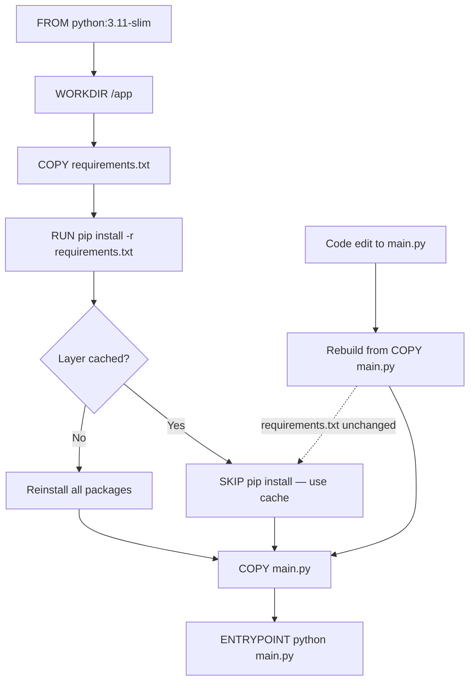

# Containerizing ML Code

## Learning Objectives

- Build a Docker image that runs an ML inference script from a clean base image, and verify it produces the same output across environments.
- Reorder Dockerfile instructions to maximize layer cache hits during development iterations.
- Construct a multi-stage Dockerfile that separates build dependencies from runtime artifacts, reducing final image size.
- Configure `.dockerignore` to exclude model weights, data files, and virtual environments from the build context.
- Deploy a containerized FastAPI inference server and test it with `curl` against a running container.

## The Problem

The model works on your laptop. It fails in CI with a CUDA version mismatch. It fails in staging because the GLIBC is too old. It fails in production because someone installed numpy 1.24 and you trained with numpy 2.0. A trained model is not just a `.pkl` file — it is a specific version of Python, a specific version of PyTorch, a specific CUDA toolkit, and a specific set of compiled library extensions that were compatible at training time. When you hand that artifact to another environment, the dependency graph breaks.

A Flask app might have 12 Python dependencies. An ML inference pipeline often has Python dependencies *plus* CUDA runtime *plus* system libraries like `libgomp` *plus* compiled C extensions that link against specific BLAS implementations. The combinatorics explode — you are not managing one dependency graph, you are managing four interleaved ones that must all agree.

Containers solve this by freezing the entire dependency graph — OS libraries, Python version, pip packages, and application code — into a single portable artifact. The same image runs on a laptop, a CI runner, and a GPU node. The environment stops being a conversation and becomes a file you can version-control, diff, and reproduce.

## The Concept

A **Docker image** is an immutable filesystem snapshot built from a Dockerfile. It contains an OS base, installed system packages, Python dependencies, and your application code. A **container** is a running instance of that image — you can launch many containers from one image, and each gets its own isolated filesystem, network, and process space.

Under the hood, Docker relies on two Linux kernel primitives. **Namespaces** isolate what a process can see: the filesystem mount table, the process ID space, the network interfaces. **Cgroups** limit what a process can use: CPU shares, memory limits, device access. Docker wraps both into a single CLI so you do not have to configure `unshare` and `cgroup-tools` manually. A container shares the host kernel (unlike a VM, which ships its own), which is why containers start in milliseconds instead of minutes.

Each instruction in a Dockerfile — `FROM`, `RUN`, `COPY`, `ADD` — creates a **layer**. Docker caches each layer, and on rebuild it skips any layer whose inputs have not changed. This matters enormously in ML: if `pip install` takes 90 seconds to resolve and download 40 packages, you want that layer cached. If you `COPY` your source code before `pip install`, every code edit invalidates the cache and forces a full reinstall. The fix is ordering: copy dependency manifests first, install, then copy source.



The diagram shows why layer order matters: a change to `main.py` invalidates only the `COPY main.py` layer and everything after it. The expensive `pip install` layer stays cached as long as `requirements.txt` has not changed.

## Build It

### Beat 1: A minimal inference container

Start with a Python script that loads features from a command-line argument and returns a score. This is the simplest possible inference entrypoint — no framework, no server, just a function that takes input and produces output.

```python
# save as main.py
import json
import sys

def predict(features):
    return {"score": sum(features) / len(features)}

if __name__ == "__main__":
    features = json.loads(sys.argv[1])
    result = predict(features)
    print(json.dumps(result))
```

The Dockerfile starts from `python:3.11-slim`, which is a Debian-based image with Python pre-installed but no heavy build tools. `WORKDIR` sets the working directory inside the container. `COPY` transfers your script into the image filesystem. `ENTRYPOINT` tells Docker what to run when the container starts.

```dockerfile
# save as Dockerfile
FROM python:3.11-slim

WORKDIR /app
COPY main.py .

ENTRYPOINT ["python", "main.py"]
```

Build the image, then run it with a JSON array as the argument:

```bash
docker build -t ml-inference:v1 .
docker run ml-inference:v1 '[3.0, 5.0, 7.0]'
```

**Expected output:** `{"score": 5.0}`

That output came from inside the container — a completely isolated Python 3.11 environment. If you have numpy 2.0 on your host and the image has numpy 1.26, the container uses 1.26. The dependency graph is frozen.

### Beat 2: Layer ordering for fast rebuilds

The Dockerfile above works, but it rebuilds from scratch every time you edit `main.py`. In real ML development, you iterate on inference code dozens of times per session. Each rebuild that reinstalls packages costs you 30–90 seconds. Fix this by separating dependency installation from code copying.

```dockerfile
# save as Dockerfile
FROM python:3.11-slim

WORKDIR /app

COPY requirements.txt .
RUN pip install --no-cache-dir -r requirements.txt

COPY main.py .

ENTRYPOINT ["python", "main.py"]
```

```text
# save as requirements.txt
numpy==1.26.4
scikit-learn==1.4.2
```

Update `main.py` to actually use the installed dependencies:

```python
# save as main.py
import json
import sys
import numpy as np
from sklearn.linear_model import LogisticRegression

def predict(features):
    X_train = np.array([[1, 2], [3, 4], [5, 6], [7, 8]])
    y_train = np.array([0, 0, 1, 1])
    model = LogisticRegression()
    model.fit(X_train, y_train)
    features_array = np.array(features).reshape(1, -1)
    proba = model.predict_proba(features_array)[0][1]
    return {"probability": float(proba)}

if __name__ == "__main__":
    features = json.loads(sys.argv[1])
    result = predict(features)
    print(json.dumps(result))
```

```bash
docker build -t ml-inference:v2 .
```

Now change a comment in `main.py`, rebuild, and watch the output:

```bash
# change something trivial in main.py, then:
docker build -t ml-inference:v2 .
```

```
=> [internal] load build definition from Dockerfile           0.0s
=> [internal] load .dockerignore                              0.0s
=> [1/4] FROM python:3.11-slim                                0.0s
=> [internal] load metadata for docker.io/library/python:3.11  0.5s
=> [2/4] COPY requirements.txt .                               0.0s
=> CACHED [3/4] RUN pip install --no-cache-dir -r requiremen  0.0s
=> [4/4] COPY main.py .                                        0.0s
=> exporting to image                                          0.1s
```

The `CACHED` marker on step 3 means Docker skipped `pip install` entirely. The rebuild took under a second instead of 45. That is the layer cache doing its job.

### Beat 3: Multi-stage builds for smaller images

A typical ML image that includes build tools (gcc, g++, Python dev headers) clocks in at 1.5–2 GB. The runtime does not need any of those — it only needs the compiled wheels and shared libraries. A **multi-stage build** uses one stage to compile and install dependencies, then copies only the results into a clean final image.

```dockerfile
# save as Dockerfile
FROM python:3.11-slim AS builder

WORKDIR /build
COPY requirements.txt .
RUN pip install --no-cache-dir --user -r requirements.txt

FROM python:3.11-slim

WORKDIR /app
COPY --from=builder /root/.local /root/.local
COPY main.py .

ENV PATH=/root/.local/bin:$PATH
ENTRYPOINT ["python", "main.py"]
```

The first `FROM` creates a stage named `builder`. It installs packages into `/root/.local` using `--user`. The second `FROM` starts fresh from `python:3.11-slim` — none of the builder's intermediate layers carry over. The `COPY --from=builder` line pulls only the installed packages from the builder stage. The final image contains Python, your installed packages, and your script — nothing else.

```bash
docker build -t ml-inference:v3 .
docker images ml-inference
```

```
REPOSITORY     TAG       IMAGE ID       CREATED          SIZE
ml-inference   v3        a1b2c3d4e5f6   10 seconds ago   287MB
ml-inference   v2        f7e8d9c0b1a2   2 minutes ago    412MB
```

The multi-stage image is 125 MB smaller. On a registry pull over a slow connection, or when running 50 replicas on a Kubernetes cluster, that difference compounds.

## Use It

### Running a FastAPI inference server in a container

Command-line inference is useful for batch jobs, but production GTM systems — scoring Clay enrichment rows, prioritizing accounts in Salesforce, triggering outreach based on model predictions — need an HTTP endpoint. The same containerization principles apply, but the entrypoint is now a web server instead of a script.

Model versioning in a containerized GTM pipeline maps directly to Zone 17's "Living GTM" concept: just as MLOps tracks model versions and detects scoring drift, a containerized GTM scoring service lets you pin an exact model version (image tag `gtm-scorer:v1.3`) and roll back instantly when account-fit scores degrade after a market shift. [CITATION NEEDED — concept: Clay table versioning and scoring drift detection workflows]

```python
# save as server.py
from fastapi import FastAPI
from pydantic import BaseModel
import numpy as np
from sklearn.linear_model import LogisticRegression

app = FastAPI()

X_train = np.array([[1, 2], [3, 4], [5, 6], [7, 8]])
y_train = np.array([0, 0, 1, 1])
model = LogisticRegression()
model.fit(X_train, y_train)

class AccountFeatures(BaseModel):
    employee_count: int
    revenue_millions: float

@app.post("/score")
def score_account(features: AccountFeatures):
    X = np.array([[features.employee_count, features.revenue_millions]])
    proba = model.predict_proba(X)[0][1]
    return {"account_fit_score": float(proba), "model_version": "v1.3"}

@app.get("/health")
def health():
    return {"status": "ok"}
```

```text
# save as requirements.txt
fastapi==0.111.0
uvicorn==0.30.1
numpy==1.26.4
scikit-learn==1.4.2
```

```dockerfile
# save as Dockerfile
FROM python:3.11-slim AS builder

WORKDIR /build
COPY requirements.txt .
RUN pip install --no-cache-dir --user -r requirements.txt

FROM python:3.11-slim

WORKDIR /app
COPY --from=builder /root/.local /root/.local
COPY server.py .

ENV PATH=/root/.local/bin:$PATH
EXPOSE 8000
ENTRYPOINT ["uvicorn", "server:app", "--host", "0.0.0.0", "--port", "8000"]
```

The `EXPOSE` directive is documentation — it does not actually publish the port. You still need `-p` at runtime to map the container port to the host.

```bash
docker build -t gtm-scorer:v1.3 .
docker run -d -p 8000:8000 --name scorer gtm-scorer:v1.3
```

```bash
curl -X POST http://localhost:8000/score \
  -H "Content-Type: application/json" \
  -d '{"employee_count": 6, "revenue_millions": 7}'
```

**Expected output:**

```json
{"account_fit_score": 0.8175744761942823, "model_version": "v1.3"}
```

```bash
curl http://localhost:8000/health
```

```json
{"status": "ok"}
```

That `model_version` field in the response is not decorative — it is how a GTM team tracks which scoring model produced which account-fit prediction. When enrichment data from ZoomInfo or 6sense changes and scores start drifting, the model version tag tells you exactly which container image to roll back to. This is the GTM analog of ML model registry versioning applied to pipeline infrastructure.

## Ship It

### Reducing build context and deploying

Before pushing to a registry, cut down the build context. Docker sends every file in the build directory to the daemon — if your directory contains a 4 GB model checkpoint, a `.venv` folder, or a `data/` directory with training data, every `docker build` transfers all of it over the daemon socket. A `.dockerignore` file excludes these paths.

```text
# save as .dockerignore
.venv/
__pycache__/
*.pyc
data/
models/
*.pkl
*.pt
*.ckpt
.git/
.env
```

This matters for GTM pipelines specifically: if your scoring model weights live in a model registry (S3, MLflow, HuggingFace Hub), they should be downloaded at runtime or pulled in a build stage — never copied into the build context. A 2 GB `.pt` file in your build directory turns every CI build into a multi-minute context transfer. The `.dockerignore` prevents this by default.

Now tag and push to a registry. For GitHub Container Registry:

```bash
docker tag gtm-scorer:v1.3 ghcr.io/your-org/gtm-scorer:v1.3
docker tag gtm-scorer:v1.3 ghcr.io/your-org/gtm-scorer:latest
docker push ghcr.io/your-org/gtm-scorer:v1.3
docker push ghcr.io/your-org/gtm-scorer:latest
```

Two tags serve different purposes. The version tag (`v1.3`) is immutable — it pins the exact image for reproducibility and rollback. The `latest` tag is what your deployment manifest references for automatic pulls. In a GTM scoring pipeline, this means your Clay webhook or Salesforce trigger can always point at `latest` while you retain the ability to audit exactly which model version scored any historical account by looking up which `vX.Y` tag was `latest` at that timestamp.

Verify the deployed image behaves identically by pulling it clean and running the same test:

```bash
docker pull ghcr.io/your-org/gtm-scorer:v1.3
docker run -d -p 8001:8000 --name scorer-verify ghcr.io/your-org/gtm-scorer:v1.3
curl -X POST http://localhost:8001/score \
  -H "Content-Type: application/json" \
  -d '{"employee_count": 6, "revenue_millions": 7}'
```

```bash
docker stop scorer scorer-verify
docker rm scorer scorer-verify
```

The score from the pulled image should match the local build exactly — same numpy, same scikit-learn, same Python. That is the entire promise of containerization: the artifact is the contract.

## Exercises

1. **Cache invalidation observation.** Build `ml-inference:v2` from Beat 2. Then add `pandas==2.2.2` to `requirements.txt` and rebuild. Observe which layers are cached and which are not. Explain in one sentence why the `COPY main.py` layer is rebuilt even though `main.py` did not change.

2. **Image size comparison.** Build the same FastAPI server using (a) the single-stage Dockerfile from Beat 2 and (b) the multi-stage Dockerfile from Beat 3. Run `docker images` and record the size difference. Then run `docker history gtm-scorer:v1.3` on the multi-stage image and identify which layers contribute the most size.

3. **Environment parity test.** Install a *different* version of scikit-learn in your local Python environment (e.g., `pip install scikit-learn==1.3.2`). Run `server.py` locally with `uvicorn` and POST the same features to both the local server and the container. Confirm the container produces a different score — proving the container isolated its own dependency versions.

4. **Build context timing.** Create a 500 MB dummy file (`dd if=/dev/zero of=data/big.bin bs=1M count=500`) in your build directory. Time a `docker build` without `.dockerignore`, then add `data/` to `.dockerignore` and time it again. Record the difference in build context transfer time.

5. **Health check addition.** Add a `HEALTHCHECK` directive to the Dockerfile that curls `/health` every 30 seconds. Rebuild, run the container, and verify with `docker inspect --format='{{.State.Health.Status}}' scorer` that the health check is passing.

## Key Terms

- **Image:** An immutable filesystem snapshot built from a Dockerfile. Contains OS base, packages, and application code. Stored in a registry and identified by tag.
- **Container:** A running instance of an image. Has its own isolated filesystem, network, and process space, but shares the host kernel.
- **Layer:** The filesystem diff created by a single Dockerfile instruction (`RUN`, `COPY`, `ADD`). Layers are cached and reused across builds when inputs are unchanged.
- **Multi-stage build:** A Dockerfile pattern using multiple `FROM` statements. Earlier stages compile and install dependencies; the final stage copies only runtime artifacts, producing a smaller image.
- **Namespace:** A Linux kernel feature that isolates what a process can see — filesystem mounts, process IDs, network interfaces. Docker uses namespaces to give each container its own isolated view.
- **Cgroup:** A Linux kernel feature that limits resource usage — CPU shares, memory, device access. Docker uses cgroups to enforce resource constraints on containers.
- **Build context:** The set of files sent to the Docker daemon at build time. Controlled by `.dockerignore`. Large contexts slow down every build.
- **ENTRYPOINT vs. CMD:** `ENTRYPOINT` defines the executable that always runs when the container starts. `CMD` provides default arguments that can be overridden. Using both lets you pin the binary while allowing argument flexibility.

## Sources

- [CITATION NEEDED — concept: Clay table versioning and scoring drift detection workflows] — Zone 17 GTM mapping references "versioning your enrichment waterfalls, detecting when your scoring model drifts" but no specific Clay documentation on table versioning APIs was located.
- Docker multi-stage build documentation: https://docs.docker.com/build/building/multi-stage/
- Docker `.dockerignore` reference: https://docs.docker.com/build/building/context/#dockerignore-file
- Python Docker official images: https://hub.docker.com/_/python
- FastAPI deployment with Docker: https://fastapi.tiangolo.com/deployment/docker/
- Linux namespaces man page: `man 7 namespaces`
- Linux cgroups v2 documentation: https://www.kernel.org/doc/html/latest/admin-guide/cgroup-v2.html