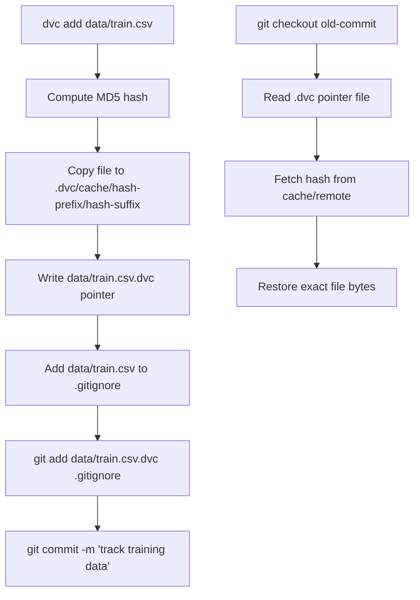

# DVC: Data Version Control

## Learning Objectives

- Initialize a DVC project, track a dataset with `dvc add`, and inspect the resulting `.dvc` pointer file to verify its MD5 hash matches the tracked file.
- Define a multi-stage pipeline in `dvc.yaml` with explicit dependencies and outputs, then reproduce it with `dvc repro`.
- Read a `dvc.lock` file and explain what each recorded hash guarantees about reproducibility.
- Configure a DVC remote (local filesystem or S3) and push/pull data artifacts independently of Git.
- Compare two pipeline runs using `dvc diff` and `dvc metrics diff` to identify which stage re-executed and why.

## The Problem

Git versions code. It does not version data. Committing a 5 GB CSV to a Git repository makes every clone painful for every teammate forever — Git stores full blobs in its object database, and a single large file inflates the `.git` directory even after deletion, because history retains every version. Git LFS mitigates this by storing large files on a separate server and replacing them with pointer objects in Git, but LFS has bandwidth quotas, transfer limits on hosted platforms, and no concept of pipeline dependencies. It is a storage layer, not a reproducibility layer.

The practical consequence: you cannot answer "which training set produced the model that shipped to production on Tuesday?" The training code lives in Git at a specific commit. The dataset lives on someone's laptop, in an S3 bucket with no versioning, or in a shared drive with a filename like `train_final_v3_REAL_final.csv`. When model accuracy drops 4% overnight, and the code hasn't changed, you are now doing archaeology — diffing parquet files by hand, pinging teammates in Slack, guessing at what the upstream pipeline emitted.

DVC solves this by extending Git's content-addressed model to artifacts that don't belong in a Git repository: datasets, model weights, feature stores, evaluation outputs. It does not replace Git — it layers on top of it. Git tracks small pointer files. DVC manages the bytes those pointers reference, plus a pipeline definition that records how artifacts relate to each other.

## The Concept

### Content-Addressable Storage

DVC replaces large files with small pointer files. When you run `dvc add data/train.csv`, four things happen in sequence:

1. DVC computes the MD5 hash of `data/train.csv`.
2. It copies the file into `.dvc/cache/` under a path derived from that hash (same scheme as Git's internal object storage, but using MD5 instead of SHA-1).
3. It writes a `data/train.csv.dvc` pointer file containing the hash, file size, and path.
4. It appends `data/train.csv` to `.gitignore` so Git stops tracking the raw file.

You commit the `.dvc` pointer file to Git. The actual data lives in `.dvc/cache/` (local) or in a configured remote (S3, GCS, Azure Blob, SSH, or even a local directory). The pointer file is the bridge: given a Git commit, you can reconstruct exactly which data version was used by reading the pointer file and fetching the matching hash from the cache or remote.



### Pipeline DAGs and Reproduction

Tracking individual files solves versioning. It doesn't solve reproducibility — you still need to know that "this dataset + this code = this model." DVC addresses this with `dvc.yaml`, a declarative pipeline definition. Each stage in `dvc.yaml` declares dependencies (`deps`), outputs (`outs`), and optionally a command (`cmd`). DVC builds a directed acyclic graph (DAG) from these declarations and uses it to decide what to re-run.

The reproduction logic is straightforward: a stage re-executes if and only if any of its dependencies changed. DVC detects change by comparing the current hash of each dependency against the hash recorded in `dvc.lock` — a file that stores the resolved state of every stage's inputs and outputs after the last successful run. If `data/train.csv` has a different MD5 than what `dvc.lock` recorded, the training stage re-runs. If nothing changed, DVC prints "Stage is up to date" and skips it. This is incremental computation driven by content hashes, not timestamps.

### Remote Storage

The `.dvc/cache/` directory is local. To share data across a team or CI pipeline, you configure a remote — a URL or path pointing to shared storage. `dvc push` uploads cached artifacts to the remote. `dvc pull` downloads them. These operations are independent of `git push` and `git pull`, which only move pointer files and pipeline definitions. This separation matters: cloning a repository gives you the code and the pipeline structure immediately. Fetching the data is an explicit, on-demand step.

## Build It

Let's build a minimal DVC pipeline from scratch. Every command here produces observable output — file creation, hash printing, diff reporting. Run these in a fresh directory.

First, create a project and generate a small dataset:

```bash
mkdir dvc-demo && cd dvc-demo
git init
pip install dvc
dvc init

python3 -c "
import csv, random
random.seed(42)
with open('data/leads.csv', 'w', newline='') as f:
    w = csv.writer(f)
    w.writerow(['company', 'employees', 'intent_score', 'label'])
    for i in range(1000):
        emp = random.choice([50, 200, 500, 1000, 5000])
        score = random.randint(1, 100)
        label = 1 if score > 60 and emp > 200 else 0
        w.writerow([f'company_{i}', emp, score, label])
"
mkdir -p data
```

Wait — let's fix the order. The `data/` directory must exist before writing the CSV:

```bash
mkdir -p dvc-demo && cd dvc-demo
git init
pip install dvc
dvc init
mkdir -p data

python3 -c "
import csv, random
random.seed(42)
with open('data/leads.csv', 'w', newline='') as f:
    w = csv.writer(f)
    w.writerow(['company', 'employees', 'intent_score', 'label'])
    for i in range(1000):
        emp = random.choice([50, 200, 500, 1000, 5000])
        score = random.randint(1, 100)
        label = 1 if score > 60 and emp > 200 else 0
        w.writerow([f'company_{i}', emp, score, label])
print('Created data/leads.csv with 1000 rows')
"
```

Track the dataset with DVC and inspect the pointer file:

```bash
dvc add data/leads.csv

echo "--- Pointer file contents ---"
cat data/leads.csv.dvc

echo "--- MD5 hash of the data file ---"
md5sum data/leads.csv

echo "--- What Git sees ---"
git status --short
```

The `.dvc` pointer file contains an `md5` field. The `md5sum` output should match that field — that's the content-addressed link. Git sees `data/leads.csv.dvc` and `.gitignore` (which DVC updated to exclude `data/leads.csv` itself), but not the raw CSV.

Now commit and define a pipeline. Create `dvc.yaml` with a single stage that computes a basic metric:

```bash
cat > transform.py << 'EOF'
import pandas as pd
import sys

df = pd.read_csv(sys.argv[1])
df['log_employees'] = df['employees'].apply(lambda x: round(np.log(x), 4) if x > 0 else 0)
df.to_parquet(sys.argv[2], index=False)
print(f"Wrote {len(df)} rows to {sys.argv[2]}")
EOF

cat > score.py << 'EOF'
import pandas as pd
import json, sys

df = pd.read_parquet(sys.argv[1])
positive_rate = df['label'].mean()
result = {"positive_rate": round(float(positive_rate), 4), "rows": len(df)}
with open(sys.argv[2], 'w') as f:
    json.dump(result, f, indent=2)
print(json.dumps(result))
EOF

pip install pandas pyarrow numpy

cat > dvc.yaml << 'EOF'
stages:
  transform:
    cmd: python transform.py data/leads.csv data/features.parquet
    deps:
      - data/leads.csv
      - transform.py
    outs:
      - data/features.parquet
  score:
    cmd: python score.py data/features.parquet metrics.json
    deps:
      - data/features.parquet
      - score.py
    outs:
      - metrics.json
EOF
```

Run the pipeline and inspect the lock file:

```bash
dvc repro

echo "--- dvc.lock contents ---"
cat dvc.lock

echo "--- Pipeline DAG ---"
dvc dag

echo "--- Metrics ---"
dvc metrics show
```

`dvc.lock` records the resolved hash of every dependency and output for each stage. The `transform` stage depends on `data/leads.csv` (hash recorded) and `transform.py` (hash recorded). The `score` stage depends on `data/features.parquet` (hash of the output from `transform`). This chain is what makes reproduction deterministic: change any input, and DVC walks the DAG to re-run only the affected stages.

## Use It

Content-addressed data versioning — the mechanism DVC implements — is directly applicable to GTM systems that retrain scoring models on evolving lead data. The canonical case: your enrichment waterfall in Clay produces a table of scored leads every week. You export that table, train a propensity model on it, and deploy the model to prioritize outbound. When the model's precision drops, you need to trace the regression to a specific data change — not just "the data is different," but "row 4,217 changed from `intent_score=72` to `intent_score=18` because the intent provider updated their scoring algorithm."

Version the lead-scoring training dataset with DVC, modify one row, and observe the hash change:

```bash
cd dvc-demo

python3 -c "
import pandas as pd
df = pd.read_csv('data/leads.csv')
print(f'Before: row 0 intent_score = {df.loc[0, \"intent_score\"]}')
df.loc[0, 'intent_score'] = 0
df.to_csv('data/leads.csv', index=False)
print(f'After:  row 0 intent_score = {df.loc[0, \"intent_score\"]}')
"

echo "--- Old pointer hash ---"
cat data/leads.csv.dvc | grep md5

dvc add data/leads.csv

echo "--- New pointer hash ---"
cat data/leads.csv.dvc | grep md5

echo "--- DVC diff ---"
dvc diff HEAD data/leads.csv
```

The hash changes because the file content changed. `dvc diff` shows the structural difference: files added, modified, or deleted between the working tree and a Git reference. This is the same content-addressing mechanism Git uses for source code, applied to data artifacts.

Now re-run the pipeline and observe which stages re-execute:

```bash
echo "--- Re-running pipeline ---"
dvc repro

echo "--- Metrics diff (before vs after) ---"
dvc metrics diff HEAD

echo "--- DAG (unchanged structure, changed data) ---"
dvc dag
```

`dvc repro` detects that `data/leads.csv` has a new hash. It re-runs `transform` (because `leads.csv` is a dependency). `transform` produces a new `features.parquet`, which triggers `score` to re-run as well. `dvc metrics diff HEAD` compares the current `metrics.json` against the version stored at `HEAD` — showing whether the positive rate shifted after the data change.

For a more realistic GTM application, build a pipeline that transforms a raw CRM export into a training-ready feature set. The CRM export is the "upstream pipeline" — it changes when Clay tables update, when enrichment providers modify their APIs, or when ICP filters are refined. Tagging experiments with `dvc exp run` lets you compare two parameter sets (e.g., different intent score thresholds) against the same data version:

```bash
cat > dvc.yaml << 'EOF'
stages:
  transform:
    cmd: python transform.py data/leads.csv data/features.parquet
    deps:
      - data/leads.csv
      - transform.py
    outs:
      - data/features.parquet
    params:
      - threshold
  score:
    cmd: python score.py data/features.parquet metrics.json
    deps:
      - data/features.parquet
      - score.py
    metrics:
      - metrics.json
EOF

cat > params.yaml << 'EOF'
threshold: 60
EOF

cat > transform.py << 'EOF'
import pandas as pd
import numpy as np
import sys, yaml

params = yaml.safe_load(open('params.yaml'))
threshold = params['threshold']

df = pd.read_csv(sys.argv[1])
df['log_employees'] = df['employees'].apply(lambda x: round(np.log(x), 4) if x > 0 else 0)
df['predicted_label'] = (df['intent_score'] > threshold).astype(int)
df.to_parquet(sys.argv[2], index=False)
print(f"Threshold: {threshold}, wrote {len(df)} rows")
EOF

dvc exp run
dvc exp run --set-param threshold=75

echo "--- Experiment comparison ---"
dvc exp diff
```

`dvc exp diff` shows the parameter delta (`threshold: 60 → 75`) and the resulting metric delta side by side. This is the content-addressed pipeline mechanism applied to a concrete GTM question: "does raising the intent score threshold improve lead quality?" [CITATION NEEDED — concept: specific Clay-to-DVC integration patterns]

## Ship It

The pipeline DAG and remote storage mechanism integrate cleanly into CI. On every push to `main`, the CI runner executes `dvc pull` to restore cached data from the remote, `dvc repro` to rebuild any stages whose dependencies changed, and `dvc push` to upload new artifacts. Reviewers see `dvc metrics show` output in the CI log, so a regression is visible before merge — not after a model ships to the scoring API.

Here is a GitHub Actions workflow that implements this:

```yaml
name: DVC Pipeline

on:
  push:
    branches: [main]

jobs:
  reproduce:
    runs-on: ubuntu-latest
    steps:
      - uses: actions/checkout@v4

      - uses: actions/setup-python@v5
        with:
          python-version: '3.11'

      - name: Install dependencies
        run: |
          pip install dvc pandas pyarrow numpy pyyaml

      - name: Configure DVC remote
        run: |
          dvc remote add -d storage s3://my-dvc-bucket/dvc-storage
        env:
          AWS_ACCESS_KEY_ID: ${{ secrets.AWS_ACCESS_KEY_ID }}
          AWS_SECRET_ACCESS_KEY: ${{ secrets.AWS_SECRET_ACCESS_KEY }}

      - name: Pull data
        run: dvc pull

      - name: Reproduce pipeline
        run: dvc repro

      - name: Show metrics
        run: dvc metrics show --all

      - name: Compare with previous commit
        run: dvc metrics diff HEAD~1

      - name: Push updated artifacts
        run: dvc push
        env:
          AWS_ACCESS_KEY_ID: ${{ secrets.AWS_ACCESS_KEY_ID }}
          AWS_SECRET_ACCESS_KEY: ${{ secrets.AWS_SECRET_ACCESS_KEY }}
```

For a local CI equivalent (e.g., a pre-push hook or a self-hosted runner), the same sequence works as a shell script. The observable output is the `dvc metrics diff` block, which prints a table showing whether each metric increased or decreased relative to the previous commit. A reviewer reading the CI log sees the metric delta before approving the merge.

One caveat worth stating plainly: DVC remotes require credentials in CI. For S3, this means `AWS_ACCESS_KEY_ID` and `AWS_SECRET_ACCESS_KEY` as repository secrets. For SSH remotes, it means deploying a key pair. The `dvc remote add` command stores the remote URL in `.dvc/config`, which is committed to Git — so never put credentials in the remote URL itself. Use environment variables or IAM roles.

## Exercises

**Easy:** Initialize a DVC project in an empty Git repository. Create a file `data/sample.csv` with 5 rows of synthetic data. Run `dvc add data/sample.csv`. Open the generated `.dvc` pointer file and confirm the `md5` field matches the output of `md5sum data/sample.csv`. Commit both the pointer file and `.gitignore` to Git.

**Medium:** Extend the pipeline from Build It with a third stage: `evaluate`. This stage reads `metrics.json` and writes a new file `report.txt` containing a human-readable summary (e.g., "Positive rate: 0.34, Rows: 1000"). Add the stage to `dvc.yaml` with appropriate dependencies. Run `dvc repro`, confirm `report.txt` is generated, and verify `dvc.lock` captures all three stages with their hashes.

**Medium:** Given the following broken `dvc.yaml`, identify the error and fix it so `dvc repro` succeeds. The stage `score` references `data/features.parquet` as a dependency, but the `transform` stage outputs to `features.parquet` (no `data/` prefix). Run `dvc repro` before and after the fix — observe the error message DVC prints when a dependency path does not match any upstream output.

```yaml
stages:
  transform:
    cmd: python transform.py data/leads.csv features.parquet
    deps:
      - data/leads.csv
      - transform.py
    outs:
      - features.parquet
  score:
    cmd: python score.py data/features.parquet metrics.json
    deps:
      - data/features.parquet
      - score.py
    outs:
      - metrics.json
```

**Hard:** Change the source data by adding 500 new rows to `data/leads.csv`. Run `dvc repro` and use `dvc dag --mermaid` to print the pipeline graph. Then use `dvc metrics diff HEAD` to show the metric change. Finally, run `dvc exp run --set-param threshold=50` and `dvc exp run --set-param threshold=80`, then `dvc exp diff` to compare both experiments against the default. Write a one-paragraph summary of which threshold produced the highest positive rate and whether that represents model improvement or data distribution shift.

**Hard:** Write a GitHub Actions workflow (or a local shell script) that executes `dvc pull`, `dvc repro`, and `dvc push` in sequence. Print `dvc metrics show --all` to stdout. Add a step that fails the workflow if `positive_rate` drops below 0.15 (using `grep` or a Python one-liner). Test locally by running the script and confirming the metrics appear in stdout.

## Key Terms

- **Content-addressed storage** — A storage model where files are identified by a hash of their contents. Git uses this for source objects; DVC uses it (with MD5) for data artifacts.
- **Pointer file (`.dvc`)** — A small YAML file committed to Git that records the hash and size of a tracked data artifact. It is the link between a Git commit and a specific data version.
- **`dvc.lock`** — A file recording the resolved hashes of every dependency and output for every pipeline stage after the last `dvc repro`. It is the reproducibility guarantee: given the same lock file, the same data, and the same code, the pipeline produces the same outputs.
- **Pipeline DAG** — A directed acyclic graph defined in `dvc.yaml` where nodes are stages (transform, train, evaluate) and edges are dependency relationships. DVC traverses this graph topologically to determine execution order and which stages need re-running.
- **DVC remote** — A configured storage backend (S3, GCS, SSH, local path) where cached artifacts are pushed and pulled. Independent of Git remotes.
- **`dvc exp`** — DVC's experiment management subsystem. Runs the pipeline with parameter overrides and tracks results for comparison without requiring a full Git commit for each experiment.

## Sources

- DVC documentation on content-addressed cache and pointer files: https://dvc.org/doc/user-guide/data-management/managing-external-data
- DVC pipeline and `dvc.yaml` specification: https://dvc.org/doc/user-guide/pipelines/defining-pipelines
- DVC remotes configuration: https://dvc.org/doc/command-reference/remote
- [CITATION NEEDED — concept: specific Clay-to-DVC integration patterns for versioning enrichment waterfall outputs]
- [CITATION NEEDED — concept: GTM engineering adoption of DVC for scoring model retraining pipelines, per 2026 job market data synthesis]