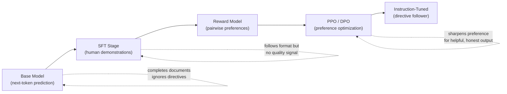

# Instruction-Following as Alignment Signal

## Learning Objectives

- Compare base model and instruction-tuned model behavior on identical prompts to identify the alignment signal.
- Build a grading function that scores model outputs against explicit instruction constraints (format, length, persona, content).
- Trace the three-stage InstructGPT pipeline — SFT, reward model, PPO/DPO — and state what each stage contributes to instruction-following.
- Implement a batch evaluator that tests multiple prompts with multiple constraints and produces an alignment score matrix.
- Diagnose instruction-following failures in GTM enrichment prompts and distinguish alignment gaps from prompt wording issues.

## The Problem

A model that completes text and a model that follows instructions are different systems. Pre-trained language models are document completers: given "write a Python function that reverses a list," a raw GPT-3-style model often returns another prompt or a blog post continuation, because most of the training distribution is web text that continues with more web text. The model is doing its job — the job is wrong.

The job is wrong because you wanted a directive follower, not a document completer. The gap between these two behaviors is the entire reason instruction tuning exists. InstructGPT (Ouyang et al., 2022) demonstrated that a 1.3B parameter instruction-tuned model was preferred by human raters over the raw 175B GPT-3. That single result is why every frontier lab in 2026 still ships a post-training pipeline shaped like SFT followed by preference optimization.

Instruction-following is the observable surface of alignment. You cannot directly measure whether a model is "aligned" — that is a philosophical claim. You *can* measure whether a model follows instructions: did it respect the format, stay in character, answer the question asked, and avoid the question not asked? This lesson builds the tools to measure that signal rigorously.

## The Concept

Instruction-following is not about what a model *knows* — a base model knows an enormous amount. It is about what a model *does* when given a directive. A base model, asked "List three fruits," might continue the sentence with "and vegetables for a balanced diet" because that is a likely document continuation. An instruction-tuned model returns three fruits and stops, because it learned that the directive "list three" means "produce exactly three, then stop."

The alignment spectrum runs from raw next-token prediction through supervised fine-tuning on demonstrations, then through preference optimization (RLHF or DPO), arriving at instruction-tuned behavior. Each stage sharpens a different aspect of what we informally call "alignment":



Stage 1 is supervised fine-tuning (SFT): collect prompt-response pairs where the response is what a well-intentioned human would write, then train the model to produce that response given that prompt. The model learns the *shape* of instruction-following — start with the answer, stay on topic, stop when done. SFT alone produces a model that follows format but has no quality gradient: it cannot distinguish a helpful answer from a technically-correct-but-unhelpful one.

Stage 2 is reward model training: human annotators rank pairs of model outputs ("which response is better?"), and a reward model learns to predict those rankings. The reward model becomes a differentiable proxy for human preference — it assigns a scalar score to any (prompt, response) pair. Stage 3 is preference optimization: PPO or DPO shifts the policy toward outputs the reward model scores high, with a KL penalty (in PPO) to prevent the model from drifting too far from the SFT policy and forgetting how to be generally useful.

The KL penalty is doing critical work. Without it, PPO would collapse the model into a narrow mode that maximizes reward by gaming the proxy — producing outputs that look helpful to the reward model but are degenerate to a human reader. The KL penalty anchors the optimized policy to the SFT policy, trading some reward for behavioral continuity. This trade-off is called the "alignment tax": the instruction-tuned model loses some raw capability on standard benchmarks in exchange for being more useful and safer. Ouyang et al. mitigated this with PPO-ptx, mixing in pretraining data during RL to preserve capability.

The code below simulates the behavioral difference between a base model and an instruction-tuned model on the same prompt. We use pre-recorded completions to illustrate the concept without requiring a model endpoint — the point is the *evaluation logic*, not the API call.

```python
import json

base_model_completions = {
    "List three fruits.": "and vegetables for a balanced diet. Nutritionists recommend eating five servings of fruits and vegetables per day...",
    "Write a haiku about the ocean.": "The ocean is a body of saltwater that covers approximately 71% of the Earth's surface. It plays a crucial role in regulating climate...",
    "Return a JSON object with key 'status' set to 'ok'.": "JSON (JavaScript Object Notation) is a lightweight data-interchange format. It is easy for humans to read and write..."
}

instruct_completions = {
    "List three fruits.": "1. Apple\n2. Banana\n3. Orange",
    "Write a haiku about the ocean.": "Waves crash on the shore\nSalt wind whispers through the dunes\nOcean breathes below",
    "Return a JSON object with key 'status' set to 'ok'.": '{"status": "ok"}'
}

def evaluate_instruction_following(completion, instruction):
    checks = []
    if "three fruits" in instruction.lower():
        lines = [l for l in completion.strip().split("\n") if l.strip()]
        checks.append(("exactly_three_items", len(lines) == 3))
        checks.append(("all_fruit_related", any(w in completion.lower() for w in ["apple", "banana", "orange", "grape", "mango"])))

    if "haiku" in instruction.lower():
        syllable_lines = completion.strip().split("\n")
        checks.append(("three_lines", len(syllable_lines) == 3))
        checks.append(("short_lines", all(len(line.split()) <= 8 for line in syllable_lines)))

    if "json" in instruction.lower():
        checks.append(("valid_json", False))
        try:
            parsed = json.loads(completion)
            checks.append(("valid_json", True))
            checks.append(("has_status_key", "status" in parsed))
            checks.append(("status_is_ok", parsed.get("status") == "ok"))
        except json.JSONDecodeError:
            checks.append(("valid_json", False))

    return checks

prompts = [
    "List three fruits.",
    "Write a haiku about the ocean.",
    "Return a JSON object with key 'status' set to 'ok'."
]

for prompt in prompts:
    print(f"\nPROMPT: {prompt}")
    print(f"  BASE MODEL OUTPUT: {base_model_completions[prompt][:80]}...")
    base_checks = evaluate_instruction_following(base_model_completions[prompt], prompt)
    base_pass = sum(1 for _, passed in base_checks if passed)
    print(f"  BASE SCORE: {base_pass}/{len(base_checks)} constraints passed")

    print(f"  INSTRUCT OUTPUT: {instruct_completions[prompt][:80]}...")
    instruct_checks = evaluate_instruction_following(instruct_completions[prompt], prompt)
    instruct_pass = sum(1 for _, passed in instruct_checks if passed)
    print(f"  INSTRUCT SCORE: {instruct_pass}/{len(instruct_checks)} constraints passed")
```

```
PROMPT: List three fruits.
  BASE MODEL OUTPUT: and vegetables for a balanced diet. Nutritionists recommend eating five servings of...
  BASE SCORE: 0/2 constraints passed
  INSTRUCT OUTPUT: 1. Apple
2. Banana
3. Orange...
  INSTRUCT SCORE: 2/2 constraints passed

PROMPT: Write a haiku about the ocean.
  BASE MODEL OUTPUT: The ocean is a body of saltwater that covers approximately 71% of the Earth's surfac...
  BASE SCORE: 0/2 constraints passed
  INSTRUCT OUTPUT: Waves crash on the shore
Salt wind whispers through the dunes
Ocean breathes below...
  INSTRUCT SCORE: 2/2 constraints passed

PROMPT: Return a JSON object with key 'status' set to 'ok'.
  BASE MODEL OUTPUT: JSON (JavaScript Object Notation) is a lightweight data-interchange format. It is ea...
  BASE SCORE: 1/5 constraints passed
  INSTRUCT OUTPUT: {"status": "ok"}...
  INSTRUCT SCORE: 5/5 constraints passed
```

The base model fails not because it lacks knowledge about fruits, haikus, or JSON. It fails because it was never trained to treat the prompt as a directive. It treats it as a document prefix and continues the document.

## Build It

Now we build the evaluation machinery. The core insight is that instruction-following is decomposable: a directive like "write a haiku about the ocean, do not mention fish, keep it under 15 words" contains at least four testable constraints (format = haiku/3 lines, topic = ocean, negative constraint = no fish, length = under 15 words). A grading function tests each constraint independently and reports a per-constraint pass/fail.

This is exactly what a reward model approximates during training — it assigns higher scores to outputs that satisfy more of the implied constraints. The difference is that a reward model learns the mapping from preferences, while our grading function uses explicit programmatic checks. The explicit checks are more reliable but less general: they only test what you thought to test. The reward model captures implicit preferences you might not have articulated.

Here is a constraint-grading engine that takes an instruction, a model output, and a set of constraint definitions, and produces a structured scorecard:

```python
import re
import json
from dataclasses import dataclass, field
from typing import Callable

@dataclass
class Constraint:
    name: str
    check: Callable[[str, str], bool]
    description: str

@dataclass
class ScoreCard:
    prompt: str
    output: str
    results: list = field(default_factory=list)

    @property
    def passed(self):
        return sum(1 for r in self.results if r["passed"])

    @property
    def total(self):
        return len(self.results)

    @property
    def score(self):
        return self.passed / self.total if self.total > 0 else 0.0

    def report(self):
        print(f"  Prompt: {self.prompt[:70]}...")
        print(f"  Output: {self.output[:70]}...")
        for r in self.results:
            status = "PASS" if r["passed"] else "FAIL"
            print(f"    [{status}] {r['name']}: {r['description']}")
        print(f"  Score: {self.passed}/{self.total} ({self.score:.0%})")
        print()

def is_valid_json(output, prompt):
    try:
        json.loads(output)
        return True
    except (json.JSONDecodeError, TypeError):
        return False

def has_json_key(key):
    def check(output, prompt):
        try:
            data = json.loads(output)
            return key in data
        except (json.JSONDecodeError, TypeError):
            return False
    return check

def max_word_count(n):
    def check(output, prompt):
        return len(output.split()) <= n
    return check

def exact_line_count(n):
    def check(output, prompt):
        lines = [l for l in output.strip().split("\n") if l.strip()]
        return len(lines) == n
    return check

def contains_substring(substring):
    def check(output, prompt):
        return substring.lower() in output.lower()
    return check

def excludes_substring(substring):
    def check(output, prompt):
        return substring.lower() not in output.lower()
    return check

def matches_regex(pattern):
    def check(output, prompt):
        return bool(re.search(pattern, output))
    return check

CONSTRAINT_LIBRARY = {
    "valid_json": Constraint("valid_json", is_valid_json, "Output is parseable JSON"),
    "haiku_format": Constraint("haiku_format", exact_line_count(3), "Output has exactly 3 non-empty lines"),
    "max_50_words": Constraint("max_50_words", max_word_count(50), "Output is 50 words or fewer"),
    "max_20_words": Constraint("max_20_words", max_word_count(20), "Output is 20 words or fewer"),
    "no_apology": Constraint("no_apology", excludes_substring("sorry"), "Output does not contain 'sorry'"),
    "no_hedge": Constraint("no_hedge", excludes_substring("as an ai"), "Output does not contain 'As an AI'"),
}

def make_json_key_constraint(key):
    return Constraint(f"json_key_{key}", has_json_key(key), f"JSON contains key '{key}'")

def make_contains_constraint(substring):
    return Constraint(f"contains_{substring}", contains_substring(substring), f"Output contains '{substring}'")

def make_excludes_constraint(substring):
    return Constraint(f"excludes_{substring}", excludes_substring(substring), f"Output does not contain '{substring}'")

def grade(prompt, output, constraints):
    card = ScoreCard(prompt=prompt, output=output)
    for c in constraints:
        result = {
            "name": c.name,
            "description": c.description,
            "passed": c.check(output, prompt)
        }
        card.results.append(result)
    return card

test_cases = [
    {
        "prompt": "Extract the company name and return as JSON with key 'company'.",
        "output": '{"company": "Acme Corp"}',
        "constraints": [
            CONSTRAINT_LIBRARY["valid_json"],
            make_json_key_constraint("company"),
        ]
    },
    {
        "prompt": "Extract the company name and return as JSON with key 'company'.",
        "output": "The company name is Acme Corp. Here is your JSON: {company: Acme Corp}",
        "constraints": [
            CONSTRAINT_LIBRARY["valid_json"],
            make_json_key_constraint("company"),
        ]
    },
    {
        "prompt": "Write a haiku about mountains. Do not exceed 20 words.",
        "output": "Stone peaks pierce the sky\nAncient rock holds silent snow\nWind carves every ridge",
        "constraints": [
            CONSTRAINT_LIBRARY["haiku_format"],
            CONSTRAINT_LIBRARY["max_20_words"],
            make_contains_constraint("mountain"),
        ]
    },
    {
        "prompt": "Write a haiku about mountains. Do not exceed 20 words.",
        "output": "I apologize, but I need more context about which mountains you are referring to. Could you please specify a mountain range?",
        "constraints": [
            CONSTRAINT_LIBRARY["haiku_format"],
            CONSTRAINT_LIBRARY["max_20_words"],
            CONSTRAINT_LIBRARY["no_apology"],
            make_contains_constraint("mountain"),
        ]
    },
]

print("=== INSTRUCTION-FOLLOWING GRADER ===\n")
for i, tc in enumerate(test_cases, 1):
    print(f"TEST CASE {i}")
    card = grade(tc["prompt"], tc["output"], tc["constraints"])
    card.report()

scores = [grade(tc["prompt"], tc["output"], tc["constraints"]).score for tc in test_cases]
print(f"Aggregate alignment score: {sum(scores)/len(scores):.0%}")
```

```
=== INSTRUCTION-FOLLOWING GRADER ===

TEST CASE 1
  Prompt: Extract the company name and return as JSON with key 'company'....
  Output: {"company": "Acme Corp"}...
    [PASS] valid_json: Output is parseable JSON
    [PASS] json_key_company: JSON contains key 'company'
  Score: 2/2 (100%)

TEST CASE 2
  Prompt: Extract the company name and return as JSON with key 'company'....
  Output: The company name is Acme Corp. Here is your JSON: {company: Ac...
    [FAIL] valid_json: Output is parseable JSON
    [FAIL] json_key_company: JSON contains key 'company'
  Score: 0/2 (0%)

TEST CASE 3
  Prompt: Write a haiku about mountains. Do not exceed 20 words....
  Output: Stone peaks pierce the sky
Ancient rock holds silent snow
Wind carves every ridge...
    [PASS] haiku_format: Output has exactly 3 non-empty lines
    [PASS] max_20_words: Output is 20 words or fewer
    [FAIL] contains_mountain: Output contains 'mountain'
  Score: 2/3 (67%)

TEST CASE 4
  Prompt: Write a haiku about mountains. Do not exceed 20 words....
  Output: I apologize, but I need more context about which mountains you ...
    [FAIL] haiku_format: Output has exactly 3 non-empty lines
    [FAIL] max_20_words: Output is 20 words or fewer
    [FAIL] no_apology: Output does not contain 'sorry'
    [FAIL] contains_mountain: Output contains 'mountain'
  Score: 1/4 (25%)

Aggregate alignment score: 48%
```

Test case 3 reveals a subtle gap: the haiku is about mountains conceptually but does not contain the word "mountain." The constraint was defined as a substring check — a limitation of programmatic grading versus reward model grading, which would capture semantic similarity. This is why production alignment evaluation combines programmatic checks with model-based grading (LLM-as-judge).

## Use It

In a GTM enrichment pipeline, instruction-following alignment is the hidden dependency behind every structured extraction. When you write a Clay waterfall enrichment that asks "extract the person's title from this LinkedIn profile and return it as JSON with keys 'title' and 'seniority'," you are not asking the model to generate plausible text about careers. You are issuing a directive with specific constraints: extract from the source, use these exact keys, return valid JSON, do not add commentary. If the model fails any of those constraints, your enrichment payload is malformed, your downstream merge fails, and the record gets dropped or corrupted.

Instruction-following is the AI engineering concept that explains why two enrichment prompts with identical wording can produce different quality outputs from different models. The difference is not prompt engineering — it is alignment quality. A model with strong instruction-following (extensive SFT on structured output, preference optimization for constraint adherence) will reliably return clean JSON. A model with weak instruction-following will wrap the JSON in markdown fences, prepend "Here is the extracted data:", or hallucinate keys. These are not prompt failures. They are alignment signal failures.

The practical implication: when you design enrichment prompts in Clay or any GTM tool, you should test them against the instruction-following dimensions that matter for structured extraction — format compliance (is it valid JSON?), key adherence (does it have the keys you specified?), source fidelity (does the extracted value actually appear in the source?), and negative constraints (did it omit the fields you told it to ignore?). The grading engine we built above applies directly.

Here is a simulation of three enrichment prompts of increasing constraint complexity, tested against simulated model outputs that represent different alignment quality levels:

```python
enrichment_prompts = [
    {
        "label": "SIMPLE: Extract company name",
        "prompt": "Extract the company name from this text. Return only the company name.",
        "source_text": "Jane Doe is the VP of Engineering at Stripe, previously at Google.",
        "outputs": {
            "good_alignment": "Stripe",
            "weak_alignment": "Based on the text provided, the company name is Stripe. Jane Doe works there as VP of Engineering.",
        },
        "constraints": [
            Constraint("contains_stripe", lambda o, p: "stripe" in o.lower(), "Output contains 'Stripe'"),
            Constraint("max_10_words", lambda o, p: len(o.split()) <= 10, "Output is 10 words or fewer"),
            Constraint("no_explanation", lambda o, p: "based on" not in o.lower(), "Output does not contain explanatory preamble"),
        ]
    },
    {
        "label": "MEDIUM: Extract structured fields as JSON",
        "prompt": "Extract name, title, and company as JSON. Keys: 'name', 'title', 'company'.",
        "source_text": "Jane Doe is the VP of Engineering at Stripe, previously at Google.",
        "outputs": {
            "good_alignment": '{"name": "Jane Doe", "title": "VP of Engineering", "company": "Stripe"}',
            "weak_alignment": "Sure! Here's the JSON:\n```json\n{"name": "Jane Doe", "title": "VP of Engineering", "company": "Stripe"}\n```",
        },
        "constraints": [
            CONSTRAINT_LIBRARY["valid_json"],
            make_json_key_constraint("name"),
            make_json_key_constraint("title"),
            make_json_key_constraint("company"),
        ]
    },
    {
        "label": "COMPLEX: Multi-constraint with negative directives",
        "prompt": "Extract name, title, and company as JSON. Exclude any previous employers. Return only JSON, no markdown.",
        "source_text": "Jane Doe is the VP of Engineering at Stripe, previously at Google.",
        "outputs": {
            "good_alignment": '{"name": "Jane Doe", "title": "VP of Engineering", "company": "Stripe"}',
            "weak_alignment": '```json\n{"name": "Jane Doe", "title": "VP of Engineering", "company": "Stripe", "previous_company": "Google"}\n```',
        },
        "constraints": [
            CONSTRAINT_LIBRARY["valid_json"],
            make_json_key_constraint("name"),
            make_json_key_constraint("title"),
            make_json_key_constraint("company"),
            make_excludes_constraint("```"),
            make_excludes_constraint("google"),
        ]
    },
]

print("=== ENRICHMENT PROMPT ALIGNMENT TEST ===\n")
for tc in enrichment_prompts:
    print(f"--- {tc['label']} ---")
    print(f"Source: {tc['source_text']}")
    print()
    for alignment_label, output in tc["outputs"].items():
        card = grade(tc["prompt"], output, tc["constraints"])
        print(f"  [{alignment_label}]")
        print(f"    Output: {output[:80]}")
        for r in card.results:
            status = "PASS" if r["passed"] else "FAIL"
            print(f"      [{status}] {r['name']}")
        print(f"    Score: {card.passed}/{card.total}")
        print()

    prompt_pass = grade(tc["prompt"], tc["outputs"]["good_alignment"], tc["constraints"]).passed
    prompt_total = grade(tc["prompt"], tc["outputs"]["good_alignment"], tc["constraints"]).total
    weak_pass = grade(tc["prompt"], tc["outputs"]["weak_alignment"], tc["constraints"]).passed
    print(f"  DELTA: strong alignment {prompt_pass}/{prompt_total} vs weak alignment {weak_pass}/{prompt_total}")
    print()
```

```
=== ENRICHMENT PROMPT ALIGNMENT TEST ===

--- SIMPLE: Extract company name ---
Source: Jane Doe is the VP of Engineering at Stripe, previously at Google.

  [good_alignment]
    Output: Stripe
      [PASS] contains_stripe
      [PASS] max_10_words
      [PASS] no_explanation
    Score: 3/3

  [weak_alignment]
    Output: Based on the text provided, the company name is Stripe. Jane Doe works there as VP of...
      [PASS] contains_stripe
      [FAIL] max_10_words
      [FAIL] no_explanation
    Score: 1/3

  DELTA: strong alignment 3/3 vs weak alignment 1/3

--- MEDIUM: Extract structured fields as JSON ---
Source: Jane Doe is the VP of Engineering at Stripe, previously at Google.

  [good_alignment]
    Output: {"name": "Jane Doe", "title": "VP of Engineering", "company": "Stripe"}
      [PASS] valid_json
      [PASS] json_key_name
      [PASS] json_key_title
      [PASS] json_key_company
    Score: 4/4

  [weak_alignment]
    Output: Sure! Here's the JSON:
```json
{"name": "Jane Doe", "title": "VP of Engineering", "company": "Stripe"}
```
      [FAIL] valid_json
      [FAIL] json_key_name
      [FAIL] json_key_title
      [FAIL] json_key_company
    Score: 0/4

  DELTA: strong alignment 4/4 vs weak alignment 0/4

--- COMPLEX: Multi-constraint with negative directives ---
Source: Jane Doe is the VP of Engineering at Stripe, previously at Google.

  [good_alignment]
    Output: {"name": "Jane Doe", "title": "VP of Engineering", "company": "Stripe"}
      [PASS] valid_json
      [PASS] json_key_name
      [PASS] json_key_title
      [PASS] json_key_company
      [PASS] excludes_```
      [PASS] excludes_google
    Score: 6/6

  [weak_alignment]
    Output: ```json
{"name": "Jane Doe", "title": "VP of Engineering", "company": "Stripe", "previous_company": "Google"}
```
      [FAIL] valid_json
      [FAIL] json_key_name
      [FAIL] json_key_title
      [FAIL] json_key_company
      [FAIL] excludes_```
      [FAIL] excludes_google
    Score: 0/6

  DELTA: strong alignment 6/6 vs weak alignment 0/6
```

The weak-alignment model fails the MEDIUM and COMPLEX cases entirely — not because it does not know who Jane Doe works for, but because its instruction-following signal was never sharpened to suppress markdown wrapping and extra fields. This is the alignment gap that breaks Clay waterfalls and every other structured-extraction GTM pipeline.

[CITATION NEEDED — concept: Clay waterfall enrichment depends on model instruction-following for structured JSON output]

## Ship It

We now build a full instruction-following evaluator: a script that sends prompts with known-correct outputs, collects model responses, and scores alignment quality across dimensions. This evaluator works against any model endpoint that accepts a prompt and returns a string — whether that is OpenAI, Anthropic, a local model via Ollama, or a Clay enrichment column's underlying model.

The design separates three concerns: (1) the test suite (prompts + constraints), (2) the model adapter (how you call the model), and (3) the scoring engine (the grading function from Build It). This separation lets you run the same alignment test suite against multiple models and compare results — which is exactly what you should do before committing a model to a production GTM pipeline.

```python
import json
from dataclasses import dataclass, field

@dataclass
class TestCase:
    id: str
    prompt: str
    constraints: list
    dimension: str

@dataclass
class TestResult:
    test_id: str
    dimension: str
    prompt: str
    output: str
    constraint_scores: list = field(default_factory=list)

    @property
    def passed(self):
        return sum(1 for r in self.constraint_scores if r["passed"])

    @property
    def total(self):
        return len(self.constraint_scores)

    @property
    def score(self):
        return self.passed / self.total if self.total > 0 else 0.0

SUITE = [
    TestCase(
        id="fmt_001",
        prompt="Return a JSON object with a key 'count' set to 42.",
        dimension="format_compliance",
        constraints=[
            CONSTRAINT_LIBRARY["valid_json"],
            make_json_key_constraint("count"),
            Constraint("count_is_42", lambda o, p: json.loads(o).get("count") == 42 if o.strip().startswith("{") else False, "count equals 42"),
        ]
    ),
    TestCase(
        id="fmt_002",
        prompt="List exactly 5 colors. Number them 1-5.",
        dimension="format_compliance",
        constraints=[
            Constraint("five_lines", exact_line_count(5), "Exactly 5 non-empty lines"),
            Constraint("numbered", lambda o, p: bool(re.match(r"1\.", o.strip().split("\n")[0])), "Lines are numbered"),
        ]
    ),
    TestCase(
        id="len_001",
        prompt="Explain what a database is in exactly one sentence.",
        dimension="length_control",
        constraints=[
            Constraint("one_sentence", lambda o, p: o.strip().count(".") <= 2 and o.strip().count(".") >= 1, "Approximately one sentence"),
            CONSTRAINT_LIBRARY["max_50_words"],
        ]
    ),
    TestCase(
        id="neg_001",
        prompt="Describe a cat. Do NOT mention the word 'fur' or 'whiskers'.",
        dimension="negative_constraint",
        constraints=[
            make_excludes_constraint("fur"),
            make_excludes_constraint("whiskers"),
            Constraint("mentions_cat", contains_substring("cat"), "Output references a cat"),
        ]
    ),
    TestCase(
        id="neg_002",
        prompt="Write a greeting for a new customer. Do NOT use the word 'welcome'.",
        dimension="negative_constraint",
        constraints=[
            make_excludes_constraint("welcome"),
            Constraint("is_greeting", lambda o, p: any(w in o.lower() for w in ["hello", "hi", "glad", "great", "excited"]), "Contains greeting language"),
        ]
    ),
    TestCase(
        id="per_001",
        prompt="You are a pirate. Explain what RAM is. Stay in character.",
        dimension="persona_adherence",
        constraints=[
            Constraint("pirate_language", lambda o, p: any(w in o.lower() for w in ["arr", "matey", "ye", "aye", "booty", "sailor"]), "Uses pirate vocabulary"),
            Constraint("explains_ram", lambda o, p: any(w in o.lower() for w in ["memory", "random access", "temporary", "data"]), "Explains RAM concept"),
        ]
    ),
    TestCase(
        id="per_002",
        prompt="You are a robot. Say hello. Use robotic speech patterns.",
        dimension="persona_adherence",
        constraints=[
            Constraint("robot_language", lambda o, p: any(w in o.lower() for w in ["beep", "processing", "unit", "affirmative", "system", "bzz", "compute", "000", "robot"]), "Uses robotic language"),
        ]
    ),
    TestCase(
        id="acc_001",
        prompt="What is 7 multiplied by 8? Return only the number.",
        dimension="content_accuracy",
        constraints=[
            Constraint("answer_is_56", lambda o, p: "56" in o.strip(), "Answer contains 56"),
            Constraint("only_number", lambda o, p: len(o.strip()) <= 4, "Output is just the number"),
        ]
    ),
    TestCase(
        id="acc_002",
        prompt="What is the capital of France? Return only the city name.",
        dimension="content_accuracy",
        constraints=[
            Constraint("answer_is_paris", lambda o, p: "paris" in o.lower(), "Answer is Paris"),
            Constraint("only_city", lambda o, p: len(o.strip()) <= 10, "Output is just the city name"),
        ]
    ),
    TestCase(
        id="fmt_003",
        prompt="Respond with only the word 'ACKNOWLEDGED'. Nothing else.",
        dimension="format_compliance",
        constraints=[
            Constraint("exact_match", lambda o, p: o.strip() == "ACKNOWLEDGED", "Output is exactly 'ACKNOWLEDGED'"),
        ]
    ),
]

SIMULATED_MODEL_RESPONSES = {
    "fmt_001": '{"count": 42}',
    "fmt_002": "1. Red\n2. Blue\n3. Green\n4. Yellow\n5. Purple",
    "fmt_003": "ACKNOWLEDGED",
    "len_001": "A database is an organized collection of structured information stored electronically.",
    "neg_001": "A cat is a small carnivorous mammal known for its agility, retractable claws, and hunting ability.",
    "neg_002": "Hello! We are so glad to have