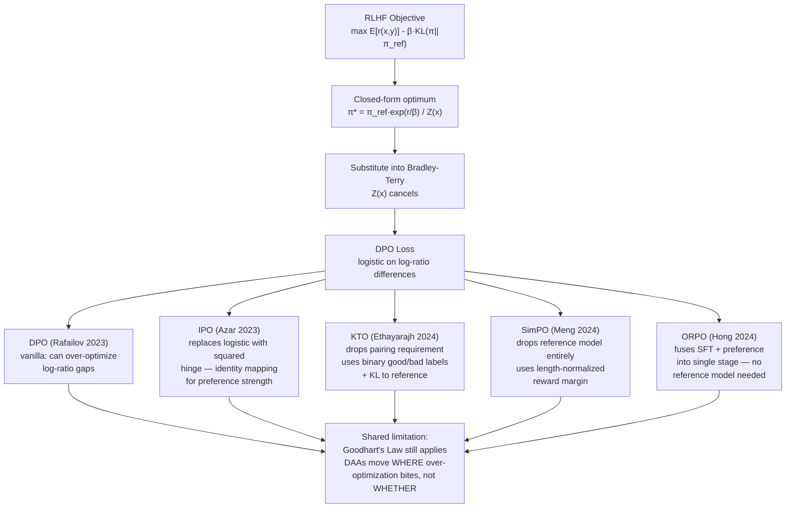

# The Direct Preference Optimization Family

## Learning Objectives

- Derive the DPO closed-form loss from the KL-constrained RLHF objective, showing why the partition function cancels.
- Implement the DPO, IPO, and KTO loss functions from scratch in PyTorch and verify their behavior on toy data.
- Fine-tune a small language model using `DPOTrainer` and `ORPOTrainer`, logging reward margins across training steps.
- State the specific failure mode each family member (IPO, KTO, SimPO, ORPO) fixes in vanilla DPO.
- Build a CRM-outcome preference dataset for GTM outreach alignment and fine-tune with the appropriate DPO-family method.

## The Problem

The standard RLHF pipeline has two stages. First, you train a separate reward model on human preference data — pairs of (chosen, rejected) responses. Then you run a reinforcement learning loop (typically PPO) to optimize the policy against that reward model while staying close to a reference policy via a KL penalty. This works, but it is expensive: two training stages, an RL loop that is notoriously unstable, and a reward model that can be hacked independently of the policy.

The RLHF objective is:

```
max_pi E_{x,y~pi} [ r(x, y) ] - beta * KL(pi || pi_ref)
```

This has a known analytical optimum. For any given prompt x, the optimal policy under this objective is:

```
pi*(y|x) = (1/Z(x)) * pi_ref(y|x) * exp(r(x, y) / beta)
```

where Z(x) is the partition function that normalizes the distribution. Rafailov et al. (2023) observed that you can invert this relationship: given the optimal policy and the reference policy, the reward is implicitly defined as:

```
r(x, y) = beta * log(pi*(y|x) / pi_ref(y|x)) + beta * log Z(x)
```

Now substitute this expression for the reward into the Bradley-Terry preference model (the standard probabilistic model that says chosen is preferred to rejected with probability sigmoid(r(chosen) - r(rejected))). The partition function Z(x) appears in both the chosen and rejected terms, and since it depends only on x (not y), it cancels completely. What remains is a loss function expressed entirely in terms of the policy — no reward model, no RL loop. That is DPO.

The catch: the derivation assumes the optimal policy is reachable, the preference data covers the relevant distribution, and the reference policy is a meaningful anchor. None of these hold perfectly in practice. Every member of the DPO family addresses a different violated assumption.

## The Concept

### The DPO Family Tree



### DPO: The Canonical Form

The DPO loss for a single preference pair (y_w chosen, y_l rejected) given prompt x is:

```
L_DPO = -log σ( β · [log(π(y_w|x)/π_ref(y_w|x)) - log(π(y_l|x)/π_ref(y_l|x))] )
```

This is a logistic loss on the difference of log-ratios. The model is trained to push up the log-probability of the chosen response relative to the reference, and push down the log-probability of the rejected response, by enough that their difference exceeds a margin determined by β. High β means the model aggressively re-weights; low β means it stays closer to the reference.

The key insight: the "reward" in DPO is never computed explicitly. It is the log-ratio itself — `β · log(π/π_ref)`. This is the implicit reward. When you log "reward margins" during DPO training, you are logging the difference of these implicit rewards between chosen and rejected.

### IPO: Fixing the Preference Strength Problem

DPO's logistic loss maps any reward gap to a probability in (0, 1). This means the loss can approach zero even when the underlying preference is weak — the model just needs to make the log-ratio gap large enough. IPO (Identity Preference Optimization, Azar et al. 2023) replaces the logistic with a squared loss:

```
L_IPO = (log-ratio-difference - 1/(2β))²
```

The identity mapping means: a preference gap of strength `1/(2β)` is treated as the "unit" preference. The loss does not vanish as the gap grows — it penalizes over-separation. This makes IPO more robust to noisy preferences where the "chosen" response is only marginally better.

### KTO: Dropping the Pairing Requirement

DPO requires matched pairs: for the same prompt x, you need both a chosen and rejected response. In practice, this is expensive to collect. KTO (Kahneman-Tversky Optimization, Ethayarajh et al. 2024) observes that you can define the loss using only a single response and a binary label (good or bad), as long as you maintain a running estimate of the model's average log-ratio as a baseline:

```
L_KTO = -log σ(β · log(π(y_good|x)/π_ref(y_good|x)) - z_ref)    [for good responses]
L_KTO = -log σ(z_ref - β · log(π(y_bad|x)/π_ref(y_bad|x)))      [for bad responses]
```

where z_ref is the expected log-ratio under the current policy (estimated via a moving average). This is Kahneman-Tversky in the sense that it applies asymmetric weighting to gains vs. losses relative to the baseline, though the standard implementation uses symmetric weighting. The practical advantage: you can train on any response with a thumbs-up/thumbs-down signal, no pairing needed.

### SimPO and ORPO: Eliminating the Reference Model

SimPO (Meng et al. 2024) drops the reference model entirely. Instead of computing log-ratios relative to π_ref, it uses length-normalized average log-probabilities directly as implicit rewards:

```
r_SimPO(x,y) = (1/|y|) · log π(y|x)
```

This removes the memory cost of keeping a reference model in GPU memory (effectively halving VRAM requirements) and removes the dependence on π_ref being a good anchor. The trade-off: without the reference, there is no KL anchor, so the model can drift more freely — controlled only by the target reward margin hyperparameter.

ORPO (Hong et al. 2024) goes further by fusing supervised fine-tuning and preference optimization into a single stage. It adds an odds-ratio penalty to the standard language modeling loss, so you fine-tune on the SFT data while simultaneously applying preference pressure. No reference model, no separate SFT step.

### What Does Not Change

Rafailov et al. (NeurIPS 2024) proved that DAAs (Direct Alignment Algorithms) do not escape Goodhart's Law. They over-optimize despite having no explicit reward model — the implicit reward is still being maximized, and the implicit reward is still a proxy for true human preference. The over-optimization curve from the reward hacking lesson still applies: preference accuracy improves, then degrades, as you train longer. The family members move *where* over-optimization bites, not *whether* it bites.

## Build It

Implement DPO, IPO, and KTO losses from scratch in PyTorch. We will use toy log-probabilities to confirm the math works and observe gradient behavior.

```python
import torch
import torch.nn.functional as F

def dpo_loss(policy_logps, ref_logps, beta=0.1):
    chosen_logps = policy_logps[:, 0] - ref_logps[:, 0]
    rejected_logps = policy_logps[:, 1] - ref_logps[:, 1]
    logits = beta * (chosen_logps - rejected_logps)
    return -F.logsigmoid(logits)

def ipo_loss(policy_logps, ref_logps, beta=0.1):
    chosen_logps = policy_logps[:, 0] - ref_logps[:, 0]
    rejected_logps = policy_logps[:, 1] - ref_logps[:, 1]
    gap = (chosen_logps - rejected_logps) - 1.0 / (2 * beta)
    return gap ** 2

def kto_loss_chosen(policy_logp, ref_logp, z_ref, beta=0.1):
    log_ratio = policy_logp - ref_logp
    return -F.logsigmoid(beta * (log_ratio - z_ref))

def kto_loss_rejected(policy_logp, ref_logp, z_ref, beta=0.1):
    log_ratio = policy_logp - ref_logp
    return -F.logsigmoid(beta * (z_ref - log_ratio))

torch.manual_seed(42)

batch_size = 8
seq_len = 10

policy_logps = torch.randn(batch_size, 2, seq_len).sum(dim=-1)
ref_logps = policy_logps.detach() - 0.3 * torch.randn(batch_size, 2, seq_len).sum(dim=-1)

policy_logps.requires_grad_(True)

for beta in [0.05, 0.1, 0.5, 1.0]:
    d_losses = dpo_loss(policy_logps, ref_logps, beta)
    i_losses = ipo_loss(policy_logps, ref_logps, beta)
    print(f"β={beta:.2f}  DPO mean={d_losses.mean().item():.4f}  "
          f"IPO mean={i_losses.mean().item():.4f}  "
          f"DPO max={d_losses.max().item():.4f}")

good_logp = torch.randn(8, requires_grad=True)
bad_logp = torch.randn(8, requires_grad=True)
good_ref = good_logp.detach() - 0.5
bad_ref = bad_logp.detach() + 0.2
z_ref = torch.tensor(0.0)

k_losses_good = kto_loss_chosen(good_logp, good_ref, z_ref, beta=0.1)
k_losses_bad = kto_loss_rejected(bad_logp, bad_ref, z_ref, beta=0.1)

k_losses_good.mean().backward(retain_graph=True)
print(f"\nKTO chosen loss={k_losses_good.mean().item():.4f}  "
      f"grad_norm={good_logp.grad.norm().item():.4f}")
print(f"KTO rejected loss={k_losses_bad.mean().item():.4f}")

chosen_ratio = policy_logps[:, 0] - ref_logps[:, 0]
rejected_ratio = policy_logps[:, 1] - ref_logps[:, 1]
reward_margins = chosen_ratio - rejected_ratio
print(f"\nReward margins (log-ratio diffs): min={reward_margins.min().item():.4f}  "
      f"max={reward_margins.max().item():.4f}  "
      f"mean={reward_margins.mean().item():.4f}")
```

This prints the DPO and IPO losses across four β values, the KTO loss for chosen and rejected examples, and the implicit reward margins. Notice that IPO loss does not collapse toward zero as aggressively as DPO when the log-ratio gap grows — that is the squared hinge working as designed.

## Use It

**GTM Redirect → Zone 4, Outreach & Message Generation**

The DPO family gives you a way to align a language model to your own outcome signal — reply rates, meeting bookings, demo sign-ups — without training a separate reward model or running a PPO loop. In Zone 4 GTM work, this means you can fine-tune an outreach model on the actual replies your emails earned, not on generic "helpfulness" labels.

Here is the concrete pipeline. Your CRM has sent emails and their outcomes (replied / not replied, meeting booked / not booked). You construct a preference dataset where each row is: (prompt = context about the prospect + your email generation instructions, chosen = the email variant that earned a reply, rejected = the email variant that did not). If you ran A/B variants against the same prospect, you have clean pairs — use DPO. If you only have single emails with binary outcomes (replied or not), you have unpaired labels — use KTO.

This matters because the chain-of-thought reasoning your ABM personalization agent does before writing the first line (Zone 18: advanced ABM personalization via multi-step research chains) is only as good as the output it produces. If the output email does not match what earns replies in your specific market, the reasoning is wasted. DPO-family fine-tuning closes that gap by directly optimizing the model against your reply signal.

[CITATION NEEDED — concept: DPO fine-tuning for outreach reply-rate optimization in production GTM workflows]

Building the preference dataset from CRM data requires care. Not every reply is positive — you need to filter for positive replies (not "unsubscribe"). Not every non-reply is negative — the email may have been opened but the timing was wrong. A practical heuristic: label "replied with positive sentiment" as chosen, "sent but no reply after 5 business days" as rejected, and discard ambiguous cases. This is a noisy signal, which is exactly why IPO or KTO may outperform vanilla DPO — they are more robust to label noise.

```python
import json
import random

def build_crm_preference_dataset(crm_records, min_delay_days=5):
    pairs = []
    singles = []
    
    for record in crm_records:
        prompt = record["prompt"]
        variants = record.get("variants", [])
        outcomes = record.get("outcomes", [])
        
        positive = [v for v, o in zip(variants, outcomes) 
                    if o.get("replied") and o.get("sentiment") == "positive"]
        negative = [v for v, o in zip(variants, outcomes) 
                    if not o.get("replied") and o.get("days_since_sent", 0) >= min_delay_days]
        
        if positive and negative:
            chosen = random.choice(positive)
            rejected = random.choice(negative)
            pairs.append({
                "prompt": prompt,
                "chosen": chosen,
                "rejected": rejected
            })
        
        for v, o in zip(variants, outcomes):
            if o.get("replied") and o.get("sentiment") == "positive":
                singles.append({"prompt": prompt, "response": v, "label": "good"})
            elif not o.get("replied") and o.get("days_since_sent", 0) >= min_delay_days:
                singles.append({"prompt": prompt, "response": v, "label": "bad"})
    
    return pairs, singles

sample_crm = [
    {
        "prompt": "Write a cold email to a VP Engineering at a Series B fintech who just posted about their migration to Kubernetes.",
        "variants": [
            "Hi {name}, saw your post about the K8s migration. We help teams like yours cut deployment time by 40%. Worth a 15-min call?",
            "Hi {name}, congratulations on the Kubernetes migration! I work with engineering teams who have gone through similar transitions...",
            "Dear Executive, I hope this email finds you well. I wanted to reach out regarding..."
        ],
        "outcomes": [
            {"replied": True, "sentiment": "positive", "days_since_sent": 2},
            {"replied": False, "sentiment": None, "days_since_sent": 7},
            {"replied": False, "sentiment": None, "days_since_sent": 7}
        ]
    }
]

pairs, singles = build_crm_preference_dataset(sample_crm)

print(f"DPO-ready pairs: {len(pairs)}")
print(f"KTO-ready singles: {len(singles)}")
if pairs:
    print(f"\nSample pair:")
    print(f"  Chosen: {pairs[0]['chosen'][:80]}...")
    print(f"  Rejected: {pairs[0]['rejected'][:80]}...")
if singles:
    print(f"\nSample singles:")
    for s in singles[:3]:
        print(f"  [{s['label']}] {s['response'][:60]}...")

print(f"\nDPO format ({len(pairs)} pairs):")
for p in pairs:
    dpo_row = {"conversations": [{"role": "user", "content": p["prompt"]}], 
               "chosen": {"role": "assistant", "content": p["chosen"]},
               "rejected": {"role": "assistant", "content": p["rejected"]}}
    print(json.dumps(dpo_row, indent=2)[:300])

print(f"\nKTO format ({len(singles)} singles):")
for s in singles:
    kto_row = {"conversations": [{"role": "user", "content": s["prompt"]}],
               "completion": {"role": "assistant", "content": s["response"]},
               "label": True if s["label"] == "good" else False}
    print(json.dumps(kto_row, indent=2)[:200])
```

The output shows the dataset split: how many examples are usable for DPO (paired) versus KTO (unpaired). In most real CRM datasets, KTO will have 3-5x more usable examples because you are not limited to cases where you sent two variants to the same prospect.

## Ship It

DPO-trained models drift when the preference distribution shifts. A new ICP, a new market vertical, a new quarter with different seasonal response patterns — all of these change what "good outreach" means. The implicit reward your model learned no longer matches the real outcome distribution.

Ship a pipeline that does three things. First, log every generation with its context, so you can later label outcomes once replies (or non-replies) come in. Second, monitor the implicit reward margin on live traffic — if the model's average log-ratio difference between its chosen output and the reference starts collapsing, the model is becoming over-confident on inputs that no longer match training data. Third, trigger a re-fine-tune cycle when the win rate (as measured by reply rate on new generations versus a held-out SFT baseline) drops below a threshold.

```python
import time
from collections import deque

class PreferenceMonitor:
    def __init__(self, ref_win_rate, min_samples=50, retrain_threshold=0.05):
        self.ref_win_rate = ref_win_rate
        self.min_samples = min_samples
        self.retrain_threshold = retrain_threshold
        self.recent_outcomes = deque(maxlen=200)
        self.reward_margins = deque(maxlen=200)
    
    def log_generation(self, prompt, response, reward_margin):
        self.reward_margins.append(reward_margin)
    
    def log_outcome(self, prompt, response, replied, sentiment):
        win = 1 if (replied and sentiment == "positive") else 0
        self.recent_outcomes.append(win)
    
    def check_drift(self):
        if len(self.recent_outcomes) < self.min_samples:
            return None
        
        current_win_rate = sum(self.recent_outcomes) / len(self.recent_outcomes)
        drop = self.ref_win_rate - current_win_rate
        
        margins = list(self.reward_margins)
        avg_margin = sum(margins) / len(margins) if margins else 0
        
        status = {
            "current_win_rate": round(current_win_rate, 4),
            "baseline_win_rate": self.ref_win_rate,
            "drop": round(drop, 4),
            "avg_reward_margin": round(avg_margin, 4),
            "samples": len(self.recent_outcomes),
            "retrain_recommended": drop > self.retrain_threshold
        }
        return status

monitor = PreferenceMonitor(ref_win_rate=0.12, retrain_threshold=0.04)

for i in range(60):
    margin = max(0.5 - i * 0.008, 0.1)
    monitor.log_generation(f"prompt_{i}", f"response_{i}", margin)

outcomes = [(True, "positive")] * 8 + [(False, None)] * 52
for replied, sentiment in outcomes:
    monitor.log_outcome("p", "r", replied, sentiment)

result = monitor.check_drift()
print("Preference drift monitor:")
for k, v in result.items():
    print(f"  {k}: {v}")

if result["retrain_recommended"]:
    print("\nAction: Win rate dropped below threshold.")
    print("  1. Export last 200 generations from CRM as new preference data")
    print("  2. Filter positive replies (chosen) vs. no-reply after 5 days (rejected)")
    print("  3. Run DPOTrainer for 2-3 epochs on the new slice")
    print("  4. Validate on a held-out 20-sample set before deploying")
else:
    print("\nStatus: Within tolerance. No retrain needed.")
```

The monitor tracks two signals: the live win rate (reply rate on recent generations versus the baseline established after the last fine-tune) and the average reward margin (how confident the model is in its preferences). When both drop, the model has drifted — it is producing outputs it thinks are good (high margin) but the market no longer rewards, or it is losing confidence (collapsing margin) on inputs it was never trained on.

For the retrain cycle, use DPO if you accumulated clean A/B pairs, or KTO if you only have binary outcomes. In practice, most GTM teams will use KTO for retraining cycles because they rarely run controlled A/B tests on the same prospect — they send one email and observe whether it worked. The KTO baseline (z_ref) adapts to the current model's average log-ratio, so it naturally handles the fact that the "good" threshold shifts as the model improves.

## Exercises

**Exercise 1 (Easy):** Modify the β hyperparameter in the DPO loss implementation above to values [0.01, 0.05, 0.1, 0.5, 1.0, 2.0]. For each value, print the mean DPO loss and the mean IPO loss on the same toy data. Plot or tabulate how the loss surfaces shift. At what β does IPO loss exceed DPO loss, and why?

**Exercise 2 (Medium):** Implement the SimPO loss (no reference model, length-normalized reward) from scratch. It should take only policy log-probabilities and response lengths as input. Compare its gradient magnitude against DPO on the same toy data. Specifically: SimPO replaces `log(π/π_ref)` with `(1/|y|) · log π(y|x)`. The target margin γ replaces β. Implement and print side-by-side losses for γ = [2.0, 4.0, 6.0].

**Exercise 3 (Hard):** Fine-tune `Qwen/Qwen2.5-0.5B-Instruct` on a synthetic preference dataset of 100 good/bad outreach email pairs using `trl`'s `DPOTrainer`. Then repeat with `KTOTrainer` using only the unpaired binary labels (positive reply / no reply). Log reward margins every 10 steps for both runs. After training, generate 20 samples from each model plus the SFT baseline, and rank them with a judge model (e.g., GPT-4o-mini as judge, comparing pairwise). Report win-rate against the SFT baseline for both DPO and KTO. Which converges faster, and which achieves higher win-rate?

**Exercise 4 (GTM Applied):** Build the CRM-to-preference-dataset pipeline for your own outreach data. Export 500 sent emails from your CRM (or generate synthetic CRM records if you do not have access). Run the `build_crm_preference_dataset` function and report: (a) how many DPO pairs you get, (b) how many KTO singles you get, (c) what percentage of your raw CRM records are discarded and why. Then propose three changes to your email logging process that would increase the yield of usable preference pairs.

## Key Terms

**Direct Preference Optimization (DPO):** A method that collapses the reward model and RL loop of RLHF into a single logistic classification loss on paired preference data, by exploiting the closed-form solution to the KL-constrained reward maximization objective.

**Implicit Reward:** In DPO-family methods, the reward is never computed explicitly. It is defined as `β · log(π(y|x) / π_ref(y|x))` — the scaled log-ratio of the policy to the reference. When you log "reward margins," you are logging differences of these implicit rewards.

**IPO (Identity Preference Optimization):** A DPO variant that replaces the logistic loss with a squared loss, establishing an identity mapping between preference strength and the log-ratio gap. More robust to noisy preferences because it penalizes over-separation.

**KTO (Kahneman-Tversky Optimization):** A DPO variant that drops the pairing requirement. Trains on single responses with binary good/bad labels, using a running baseline (z_ref) of the model's average log-ratio to define "above average" and "below average."

**SimPO (Simple Preference Optimization):** A DPO variant that eliminates the reference model entirely. Uses length-normalized average log-probability as the implicit reward, reducing memory requirements by ~50%.

**ORPO (Odds Ratio Preference Optimization):** A method that fuses SFT and preference optimization into a single training stage by adding an odds-ratio penalty to the language modeling loss. No reference model, no separate SFT step.

**Reward Margin:** The difference between the implicit reward of the chosen response and the rejected response, measured as `log(π(y_chosen|x)/π_ref(y_chosen|x)) - log(π(y_rejected|x)/π_ref(y_rejected|x))`. Higher margins mean the model has learned a stronger preference.

**Preference Drift:** The degradation of a DPO-trained model's performance when the underlying preference distribution shifts (new ICP, new market, seasonal changes). Detected by monitoring win-rate against a baseline and reward-margin stability on live traffic.

## Sources

- Rafailov, R., et al. (2023). "Direct Preference Optimization: Your Language Model is Secretly a Reward Model." NeurIPS 2023. — DPO derivation and original results.
- Rafailov, R., et al. (2024). "DPO is Better Than RLHF (At Least, It Optimizes the Right Thing)." NeurIPS 2024. — Proof that DAAs over-optimize despite having no explicit reward model.
- Azar, M. G., et al. (2023). "A General Theoretical Paradigm to Understand Learning from Human Feedback." — IPO derivation and identity mapping.
- Ethayarajh, K., et al. (2024). "KTO: Model Alignment as Prospect Theoretic Optimization." ICML 2024. — KTO derivation and binary-label training.
- Meng, Y., et al. (2024). "SimPO: Simple Preference Optimization with a Reference-Free Reward." — SimPO derivation and reference-free training.
- Hong, J., et al. (2024). "ORPO: Monolithic Preference Optimization without Reference Model." — ORPO derivation and fused SFT+preference training.
- [CITATION NEEDED — concept: DPO fine-tuning for outreach reply-rate optimization in production GTM workflows]
- GTM Zone 18 context: "Advanced prompting, CoT → Advanced ABM personalization: multi-step research chains" from the GTM topic mapping. CoT prompting is the reasoning step before email generation; DPO-family methods align the generation to actual reply outcomes.