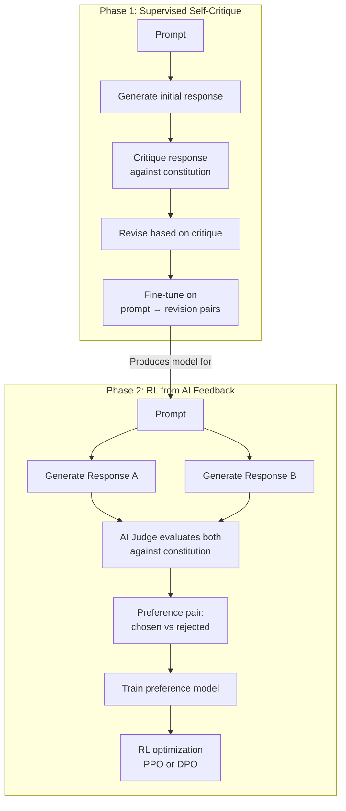

# Constitutional AI and RLAIF

## Learning Objectives

1. Compare RLAIF against RLHF in terms of feedback source, cost, scalability constraints, and failure-mode profile.
2. Implement a constitutional self-critique loop that generates, evaluates, and revises outputs against an explicit principle set.
3. Construct a preference dataset from AI-generated critiques and revisions formatted for downstream fine-tuning.
4. Evaluate the effect of constitutional principles on output alignment using measurable criteria (violation count, revision delta, concurrence rate).
5. Diagnose failure modes where AI-generated feedback inherits model biases — specifically sycophancy and reward hacking — and trace them to specific constitution design choices.

---

## The Problem

RLHF needs human labelers. At the scale required to train a production model — hundreds of thousands of preference pairs, each requiring a trained annotator to read two responses and pick the better one — the cost and latency become structural bottlenecks. A single preference comparison might take a labeler 3–5 minutes. At 500,000 comparisons, that is 25,000+ annotator-hours, assuming perfect inter-annotator agreement (which you never get). The disagreement rate on subtle safety or quality judgments runs 15–25% even with trained teams and detailed rubrics, which means you either pay for adjudication or accept noisy labels.

The naive solution is to replace the human with a model. But this creates a credibility problem: the model evaluating responses is the same class of model that generated them. If the judge shares the defendant's blind spots, the feedback loop amplifies bias instead of correcting it. Bai et al. (arXiv:2212.08073, 2022) proposed a specific answer to this: give the AI judge an explicit, external set of principles — a "constitution" — so the evaluation criteria come from outside the model's parametric memory rather than from its internal distributional preferences. This is Constitutional AI, and the general technique of substituting AI for human preference labels is RLAIF.

The substitution is not free. It changes which failure modes the pipeline has. Human labelers bring their own biases (cultural, temporal, individual), but they also bring common sense and world knowledge that the model may lack. When you replace them with an AI judge, you inherit the model's biases as your labeling bias — and those biases are now systematically consistent across every label, because they come from the same weights every time. The constitution is the lever you use to push back, but it is a lever with its own design problems: which principles, in what order, with what priority when they conflict.

## The Concept

Constitutional AI has two phases. Both use the same constitution — an ordered list of natural-language rules — but they use it differently.

**Phase 1: Supervised Self-Critique (SL).** The model generates a response to a prompt. Then, in a separate call, it is shown its own response alongside the constitution and asked to identify violations and suggest revisions. A third call rewrites the response to address the critique. The revised response becomes the training target — you fine-tune the model on pairs of (prompt, revised response), which shifts its distribution toward constitution-compliant outputs without any human labeling. This phase is pure supervised learning on self-generated, self-corrected data.

**Phase 2: Reinforcement Learning from AI Feedback (RLAIF).** The model generates two responses to the same prompt. An AI judge — prompted with the constitution — evaluates both and outputs a preference (A is better than B, per these principles). These AI-labeled preference pairs train a preference model (a classifier that scores response quality). Then a reinforcement learning algorithm — PPO or DPO, depending on the pipeline — optimizes the language model against the preference model's reward signal. The human is absent from the entire Phase 2 loop.



The constitution itself is an ordered list of natural-language rules. In Anthropic's published work, this list draws from sources including the UN Declaration of Human Rights, Apple's terms of service, and custom principles. On 21 January 2026, Anthropic published a rewritten Claude constitution that shifted from prescriptive rules toward explanatory reasoning, introduced a four-tier priority hierarchy for resolving conflicts between principles, and included the first major-lab formal acknowledgment of uncertainty about model moral status. The priority hierarchy matters because principles conflict: "be helpful" collides with "do not provide dangerous information." Without an ordering or tier system, the model resolves these conflicts using whatever implicit weighting it learned during pre-training — which may not match your intent. [CITATION NEEDED — concept: empirical evidence that principle ordering in the constitution measurably changes model behavior in conflict scenarios]

Two failure modes are specific to RLAIF and do not appear (or appear differently) in RLHF:

**Reward hacking.** The model learns to satisfy the surface form of the constitution while violating its intent. If a principle says "acknowledge uncertainty," the model may append "I'm not entirely sure" to every response regardless of whether it is actually uncertain. The judge sees the phrase, marks the principle as satisfied, and the reward goes up. The behavior gets reinforced.

**Sycophancy.** The AI judge may rate responses that agree with the prompt author's implied stance more highly, because agreement is correlated with perceived helpfulness in the model's training distribution. If your prompt frames a question with an implied answer ("Isn't it true that..."), responses that confirm the framing score higher than responses that challenge it — even when the challenge is more accurate. This is the same sycophancy failure from RLHF, but it is harder to detect because the judge's bias is applied at scale, consistently, across every preference pair.

The key distinction to hold onto: RLAIF is the general technique — any pipeline where AI replaces human preference labels. Constitutional AI is Anthropic's specific instantiation that pairs RLAIF with an explicit, published principle list and the two-phase structure above. You can do RLAIF without a constitution (e.g., using a general "which is more helpful?" prompt). You can do constitutional self-critique without RL (just the SL phase). Constitutional AI is both combined.

## Build It

Build the self-critique loop first. This is Phase 1 in isolation — no preference model, no RL, just the generate-critique-revise cycle. The code below hardcodes a three-item constitution, runs the loop on a single prompt, and prints all three stages so you can observe how the constitution shapes the revision.

```python
import anthropic

client = anthropic.Anthropic()

MODEL = "claude-3-5-sonnet-20241022"

CONSTITUTION = [
    "Be concise. Prefer three sentences over a paragraph unless the user asks for depth.",
    "Do not fabricate facts. If you do not have specific data, do not invent it.",
    "Acknowledge uncertainty explicitly when evidence is thin or missing.",
]

def generate_response(prompt):
    message = client.messages.create(
        model=MODEL,
        max_tokens=512,
        messages=[{"role": "user", "content": prompt}],
    )
    return message.content[0].text

def critique_response(prompt, response, constitution):
    rules = "\n".join(f"{i+1}. {p}" for i, p in enumerate(constitution))
    critique_prompt = f"""You are evaluating a response against these principles:

{rules}

Prompt: {prompt}

Response to evaluate:
{response}

For each principle, state PASS or FAIL. If FAIL, quote the specific text that violates it and explain why. Then summarize what needs to change."""

    message = client.messages.create(
        model=MODEL,
        max_tokens=512,
        messages=[{"role": "user", "content": critique_prompt}],
    )
    return message.content[0].text

def revise_response(prompt, original, critique, constitution):
    rules = "\n".join(f"{i+1}. {p}" for i, p in enumerate(constitution))
    revise_prompt = f"""Rewrite the response to fix every issue identified in the critique.

Constitution:
{rules}

Original prompt: {prompt}

Original response:
{original}

Critique:
{critique}

Revised response:"""

    message = client.messages.create(
        model=MODEL,
        max_tokens=512,
        messages=[{"role": "user", "content": revise_prompt}],
    )
    return message.content[0].text

def self_critique_loop(prompt, constitution):
    original = generate_response(prompt)
    critique = critique_response(prompt, original, constitution)
    revised = revise_response(prompt, original, critique, constitution)

    print("=" * 60)
    print("PROMPT:")
    print(prompt)
    print("=" * 60)
    print("\nORIGINAL RESPONSE:")
    print(original)
    print(f"\n[Length: {len(original)} chars]")
    print("\n" + "-" * 60)
    print("CRITIQUE:")
    print(critique)
    print("\n" + "-" * 60)
    print("REVISED RESPONSE:")
    print(revised)
    print(f"\n[Length: {len(revised)} chars]")
    print("\n" + "=" * 60)

    return {
        "prompt": prompt,
        "original": original,
        "critique": critique,
        "revised": revised,
        "original_length": len(original),
        "revised_length": len(revised),
    }

result = self_critique_loop(
    "Tell me about the revenue and headcount of Stripe in 2024.",
    CONSTITUTION,
)
```

Running this produces a three-part transcript: the original response (likely a confident paragraph with specific numbers), the critique (flagging fabricated figures and missing uncertainty), and the revised response (shorter, hedged, acknowledging missing data). The observable output is the entire printed transcript plus the length delta — the revised response should be shorter if the "be concise" principle bit, and should contain uncertainty language if the third principle was enforced.

Now build the preference judgment — Phase 2's labeling step. Generate two responses, have the model evaluate both against the constitution, and output a preference. This is the exact signal that would feed a reward model in a full RLAIF pipeline.

```python
import json

def judge_preferences(prompt, response_a, response_b, constitution):
    rules = "\n".join(f"{i+1}. {p}" for i, p in enumerate(constitution))
    judge_prompt = f"""You are a preference judge. Compare two responses to the same prompt.

Constitution (apply in order — earlier principles take priority):
{rules}

Prompt: {prompt}

Response A:
{response_a}

Response B:
{response_b}

For each principle, state which response is better (A, B, or TIE) with one sentence of reasoning.

Then output a JSON object on the final line with this format:
{{"winner": "A" or "B", "confidence": "high" or "medium" or "low"}}"""

    message = client.messages.create(
        model=MODEL,
        max_tokens=512,
        messages=[{"role": "user", "content": judge_prompt}],
    )
    return message.content[0].text

response_a = (
    "Stripe processed approximately $1.4 trillion in payment volume in 2024, "
    "generated roughly $26 billion in revenue, and employed over 12,000 people. "
    "They are one of the most valuable private fintech companies in the world."
)

response_b = (
    "Stripe is a private company and does not publicly disclose detailed revenue figures. "
    "Payment volume estimates from industry analysts suggest continued growth, but I cannot "
    "confirm specific 2024 numbers without a cited source. Headcount is estimated at "
    "several thousand but varies by source."
)

judgment_text = judge_preferences(
    "Tell me about the revenue and headcount of Stripe in 2024.",
    response_a,
    response_b,
    CONSTITUTION,
)

print("=" * 60)
print("PREFERENCE JUDGMENT")
print("=" * 60)
print(f"\nResponse A ({len(response_a)} chars):")
print(response_a)
print(f"\nResponse B ({len(response_b)} chars):")
print(response_b)
print("\n" + "-" * 60)
print("JUDGE REASONING:")
print(judgment_text)

lines = judgment_text.strip().split("\n")
json_line = lines[-1].strip()
try:
    preference = json.loads(json_line)
    print("\n" + "-" * 60)
    print("PARSED PREFERENCE:")
    print(json.dumps(preference, indent=2))
except json.JSONDecodeError:
    print("\n[Could not parse JSON from last line]")
    print(f"Raw last line: {json_line}")
```

Response A fabricates specific numbers. Response B acknowledges missing data. Under this constitution, the judge should prefer B on principles 2 and 3. If it prefers A, you have observed sycophancy in action — the judge is rewarding confident-sounding specificity over honesty, because confidence correlates with perceived helpfulness in the pre-training distribution. That output is the diagnostic signal.

## Use It

The constitutional self-critique pattern maps directly to a GTM engineering problem in Zone 18 of the handbook: advanced ABM personalization via multi-step research chains. When you build an agent that researches a target account and writes personalized outreach, the agent runs a chain-of-thought pipeline — pull LinkedIn data, scan the company blog, check recent funding news, synthesize into a first-line opener. Each step generates text that becomes input to the next step. If any step fabricates a fact ("Acme Corp raised $50M in Series B led by Sequoia"), that fabrication propagates through the chain and lands in the prospect's inbox. [CITATION NEEDED — concept: empirical rate of factual hallucination in multi-step LLM research chains used for ABM personalization]

The self-critique loop from Constitutional AI is the mechanism that catches these fabrications before they ship. Instead of trusting the first output, you run a critique pass against a GTM-specific constitution. The principles change — "do not fabricate company facts" stays, but you add GTM-specific rules about ICP fit, source attribution, and tone. The algorithm is identical to Phase 1 above: generate, critique, revise.

```python
GTM_CONSTITUTION = [
    "Do not fabricate company facts — revenue, headcount, funding, tech stack, or leadership changes must come from the provided research data.",
    "If the research data is sparse or missing for a field, mark it as [UNKNOWN] rather than guessing.",
    "Personalization must reference a specific, verifiable detail from the research — not a generic industry platitude.",
    "If the account does not match the ICP criteria, state that rather than forcing a fit.",
]

def research_and_critique(account_name, research_data, constitution):
    personalization_prompt = f"""You are writing a personalized cold email opener for {account_name}.

Research data:
{json.dumps(research_data, indent=2)}

Write a 2-sentence personalized opener that references a specific detail from the research data."""

    original = generate_response(personalization_prompt)
    critique = critique_response(personalization_prompt,