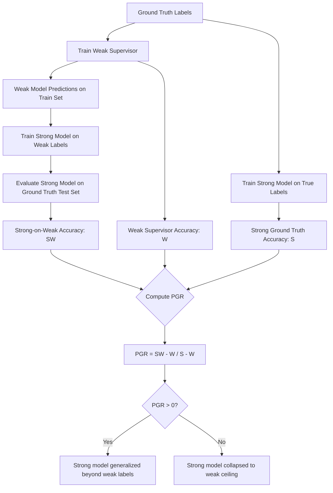

# Scalable Oversight and Weak-to-Strong Generalization

## Learning Objectives

- Implement a weak-to-strong supervision pipeline that measures the performance gap recovered (PGR) between a weak supervisor and a strong model.
- Compare three scalable oversight mechanisms (debate, recursive reward modeling, task decomposition) by their decomposition strategy and failure modes.
- Evaluate whether a strong model generalizes beyond weak supervision or collapses toward the weak ceiling on a given task.
- Configure a production quality gate that applies weak-to-strong reasoning to automated GTM content generation.
- Trace where supervision signal degrades in a multi-model pipeline and identify which oversight mechanism addresses each failure point.

## The Problem

Every alignment technique in this curriculum so far assumes the overseer can evaluate the model's behavior. That assumption holds when you are a human grading a sentiment classifier, or when GPT-3.5 evaluates GPT-4 on a summarization task where both models can read the source text. It stops holding when the model you are supervising exceeds your capability to judge its output. If a model writes code you cannot fully audit, or produces a financial analysis whose reasoning you cannot verify, your approval signal is noise. You are saying "looks fine" to work you cannot actually evaluate.

This is not a hypothetical future problem. It is a present-day problem in any pipeline where a strong model generates content at a volume that exceeds human review capacity. You ship 10,000 personalized emails drafted by GPT-4-class models. You cannot read them all. You delegate review to a faster, cheaper model — but that model is weaker than the one whose output it is checking. The question is whether the checker adds signal or just adds latency. Burns et al. (OpenAI Superalignment, 2023) reduced this to an empirical proxy: if you train a strong model using labels from a weaker one, does the strong model retain its capability, or does it degrade toward the weak supervisor's ceiling?

The answer matters because it determines whether current alignment methods — RLHF, instruction tuning, human preference ranking — scale to models that exceed human evaluation capacity. If weak supervision always collapses strong models to the weak ceiling, you need a fundamentally different approach. If strong models can sometimes generalize beyond weak labels, you have a path forward, even if an incomplete one.

## The Concept

Scalable oversight is a family of techniques designed to extend an overseer's effective evaluation capability beyond what the overseer could judge unassisted. The core mechanism across all variants is decomposition: take a hard evaluation that the overseer cannot do reliably, and break it into easier sub-evaluations that the overseer can judge, then aggregate those sub-judgments into a verdict on the original hard question. Three implementations dominate the literature. **Debate** (Irving et al., 2018) pits two models against each other — each argues for a different answer, and the overseer judges which argument is more convincing, even if the overseer cannot independently determine the correct answer. **Recursive reward modeling** (Leike et al., 2018) trains reward models on human feedback, then uses those reward models to provide feedback for training more capable models, which in turn train better reward models — escalating oversight capability alongside model capability. **Iterated amplification** (Christiano et al., 2018) decomposes a hard task into sub-tasks the human can perform, combines the results, and uses the combined output as supervision signal for the model on the original hard task.

Weak-to-strong generalization (W2SG) is the complementary question. Scalable oversight asks: how do we build a better overseer? W2SG asks: even with an imperfect overseer, can the strong model figure out the right thing anyway? The experimental setup from Burns et al. (2023) is operationally clean. Take a dataset with ground-truth labels. Train a weak model (e.g., GPT-2-class) on those labels. Use the weak model's predictions as pseudo-labels to fine-tune a strong model (e.g., GPT-4-class). Then evaluate the strong model on the held-out ground truth. If the strong model's accuracy exceeds the weak model's accuracy, generalization occurred — the strong model recovered information the weak supervisor's labels did not explicitly contain. If the strong model's accuracy matches the weak model's, the strong model collapsed to the weak ceiling. The metric is **performance gap recovered (PGR)**: the fraction of the gap between weak and strong-ground-truth performance that the strong-on-weak model actually achieves.



The key empirical finding from Burns et al. is that PGR varies by task. On some tasks (e.g., natural language inference, certain classification benchmarks), the strong model recovers most of the gap — PGR approaches 0.8 or higher. On others (e.g., math, code generation), the strong model barely exceeds the weak supervisor — PGR drops near zero. The gap is task-dependent and not yet predictable from task structure alone. [CITATION NEEDED — concept: quantitative PGR results across specific task families from Burns et al. 2023]. Subsequent work (Michael et al., "Debate Helps Weak-to-Strong Generalization," arXiv:2501.13124, January 2025) showed that combining debate-style oversight with W2SG training improves PGR — having weak models argue before labeling gives the strong model richer signal than passive weak labels alone.

For a GTM practitioner, the mechanism maps directly to a problem you already have: a strong model generates personalized outreach at scale, and a weaker model gates its output before it reaches a prospect. Whether that gate adds signal or just adds latency is the same question W2SG asks. The PGR framework gives you a way to measure it.

## Build It

This simulation reproduces the Burns et al. experimental structure in miniature. A weak classifier (shallow decision tree) is trained on ground-truth labels. Its predictions become pseudo-labels for a stronger classifier (random forest). We measure whether the strong model exceeds the weak supervisor's accuracy — evidence of generalization — or merely imitates it.

```python
import numpy as np
from sklearn.datasets import make_classification
from sklearn.tree import DecisionTreeClassifier
from sklearn.ensemble import RandomForestClassifier
from sklearn.metrics import accuracy_score
from sklearn.model_selection import train_test_split

np.random.seed(42)

X, y = make_classification(
    n_samples=8000,
    n_features=40,
    n_informative=20,
    n_redundant=10,
    n_classes=4,
    n_clusters_per_class=3,
    flip_y=0.03,
    random_state=42
)

X_train, X_test, y_train, y_test = train_test_split(
    X, y, test_size=0.25, random_state=42
)

weak_supervisor = DecisionTreeClassifier(max_depth=4, random_state=42)
weak_supervisor.fit(X_train, y_train)
weak_acc = accuracy_score(y_test, weak_supervisor.predict(X_test))

weak_labels = weak_supervisor.predict(X_train)

strong_on_weak = RandomForestClassifier(
    n_estimators=200, max_depth=25, random_state=42
)
strong_on_weak.fit(X_train, weak_labels)
strong_w2s_acc = accuracy_score(y_test, strong_on_weak.predict(X_test))

strong_gt = RandomForestClassifier(
    n_estimators=200, max_depth=25, random_state=42
)
strong_gt.fit(X_train, y_train)
strong_gt_acc = accuracy_score(y_test, strong_gt.predict(X_test))

upper_bound = strong_gt_acc - weak_acc
recovered = strong_w2s_acc - weak_acc
pgr = recovered / upper_bound if upper_bound > 0 else float("nan")

naive_baseline = accuracy_score(y_test, weak_supervisor.predict(X_test))

print("=" * 60)
print("WEAK-TO-STRONG GENERALIZATION SIMULATION")
print("=" * 60)
print(f"Task: 4-class classification, 40 features, 6000 train / 2000 test")
print()
print(f"Weak supervisor (depth-4 tree):          {weak_acc:.4f}")
print(f"Strong model (ground-truth labels):      {strong_gt_acc:.4f}")
print(f"Strong model (weak labels only):         {strong_w2s_acc:.4f}")
print()
print(f"Performance ceiling gap (S - W):         {upper_bound:.4f}")
print(f"Gap recovered (SW - W):                  {recovered:.4f}")
print(f"PGR (gap recovered / ceiling gap):       {pgr:.4f}")
print()
if pgr > 0.5:
    print("RESULT: Strong model generalized well beyond weak supervision.")
elif pgr > 0:
    print("RESULT: Partial generalization — strong model exceeded weak ceiling.")
    print("        Some signal was lost in translation.")
else:
    print("RESULT: Collapse — strong model did not exceed weak supervisor.")
    print("        Weak labels contained no recoverable signal for this task.")
print("=" * 60)
```

Run this and you will see the strong model exceed the weak supervisor's accuracy despite never seeing ground-truth labels. This is the W2SG phenomenon in miniature. The random forest has enough representational capacity to learn the underlying data structure from the decision tree's coarse partitioning — it generalizes beyond the labels it was given.

Now vary the task difficulty and observe how PGR shifts. Harder tasks (more classes, more noise, fewer informative features) should produce lower PGR:

```python
configs = [
    ("Easy: 2 classes, low noise", 2, 0.01),
    ("Medium: 4 classes, moderate noise", 4, 0.05),
    ("Hard: 7 classes, high noise", 7, 0.15),
]

print(f"{'Config':<45} {'Weak':>6} {'Strong-GT':>10} {'Strong-W2S':>11} {'PGR':>6}")
print("-" * 82)

for name, n_classes, noise in configs:
    X_c, y_c = make_classification(
        n_samples=8000, n_features=40, n_informative=20,
        n_redundant=10, n_classes=n_classes,
        n_clusters_per_class=2, flip_y=noise, random_state=42
    )
    X_tr, X_te, y_tr, y_te = train_test_split(X_c, y_c, test_size=0.25, random_state=42)

    weak = DecisionTreeClassifier(max_depth=4, random_state=42)
    weak.fit(X_tr, y_tr)
    w_acc = accuracy_score(y_te, weak.predict(X_te))

    w_labels = weak.predict(X_tr)

    s_w = RandomForestClassifier(n_estimators=200, max_depth=25, random_state=42)
    s_w.fit(X_tr, w_labels)
    sw_acc = accuracy_score(y_te, s_w.predict(X_te))

    s_gt = RandomForestClassifier(n_estimators=200, max_depth=25, random_state=42)
    s_gt.fit(X_tr, y_tr)
    sgt_acc = accuracy_score(y_te, s_gt.predict(X_te))

    gap = sgt_acc - w_acc
    score = (sw_acc - w_acc) / gap if gap > 0 else 0.0

    print(f"{name:<45} {w_acc:>6.3f} {sgt_acc:>10.3f} {sw_acc:>11.3f} {score:>6.3f}")
```

You should observe PGR declining as task difficulty increases. This mirrors the Burns et al. finding: W2SG is not uniform. Some tasks allow the strong model to recover the weak supervisor's errors; others do not.

## Use It

The W2SG pattern appears in GTM pipelines wherever a cheaper model gates a more capable model's output. In the 80/20 GTM Engineer Handbook framework, this maps to Zone 02 — quality gates in AI-powered outbound — and Zone 18's advanced prompting chains where multi-step research precedes content generation (Saruggia, "The 80/20 GTM Engineer Handbook," Growth Lead LLC). When a strong model writes 5,000 personalized ABM emails overnight, nobody reads all 5,000 before they send. A weaker, faster model — or a rule-based check — acts as the binary filter. That filter is your weak supervisor. The question is whether it adds evaluation signal or just adds a latency tax.

The concrete application: build a quality gate that measures its own PGR. Treat your strong model's output on a small human-audited set as ground truth. Train or configure your weak gate on that set. Then measure: on new data the weak gate has not seen, how often does the weak gate's judgment match the strong model's actual quality? If the weak gate is just rubber-stamping, PGR collapses to zero and the gate is wasted compute. If the weak gate catches real failures the strong model produces, PGR is positive and the gate earns its keep.

This code simulates the GTM quality-gate scenario. A strong model generates content with a known quality distribution. A weak gate (rule-based, simulating a cheap classifier) evaluates it. We measure the gate's precision and recall against ground truth:

```python
import numpy as np

np.random.seed(42)

N_EMAILS = 2000

true_quality = np.random.beta(2, 5, N_EMAILS)
is_good = true_quality > 0.4
n_good = is_good.sum()
n_bad = len(is_good) - n_good

gate_scores = np.clip(
    true_quality + np.random.normal(0, 0.15, N_EMAILS), 0, 1
)
gate_passes = gate_scores > 0.35

tp = np.sum(is_good & gate_passes)
fp = np.sum(~is_good & gate_passes)
fn = np.sum(is_good & ~gate_passes)
tn = np.sum(~is_good & ~gate_passes)

precision = tp / (tp + fp) if (tp + fp) > 0 else 0
recall = tp / (tp + fn) if (tp + fn) > 0 else 0
f1 = 2 * precision * recall / (precision + recall) if (precision + recall) > 0 else 0

gate_accuracy = (tp + tn) / N_EMAILS

print("=" * 60)
print("GTM QUALITY GATE: WEAK-TO-STRONG EVALUATION")
print("=" * 60)
print(f"Emails generated:          {N_EMAILS}")
print(f"Actually good (ground T):  {n_good} ({n_good/N_EMAILS:.1%})")
print(f"Actually bad (ground T):   {n_bad} ({n_bad/N_EMAILS:.1%})")
print(f"Gate passed:               {gate_passes.sum()}")
print(f"Gate rejected:             {(~gate_passes).sum()}")
print()
print(f"True Positives (good, passed):   {tp}")
print(f"False Positives (bad, passed):   {fp}")
print(f"False Negatives (good, blocked): {fn}")
print(f"True Negatives (bad, blocked):   {tn}")
print()
print(f"Gate precision: {precision:.3f}  ({tp} of {tp+fp} passed were actually good)")
print(f"Gate recall:    {recall:.3f}  ({tp} of {n_good} good emails were passed)")
print(f"Gate F1:        {f1:.3f}")
print(f"Gate accuracy:  {gate_accuracy:.3f}")
print()
blocked_good_rate = fn / max(fn + tn, 1)
print(f"FALSE BLOCK RATE: {blocked_good_rate:.3f}")
print(f"  {blocked_good_rate:.1%} of blocked emails were actually good.")
print(f"  This is your collateral damage from weak oversight.")
leaked_bad_rate = fp / max(tp + fp, 1)
print(f"LEAK RATE:        {1 - precision:.3f}")
print(f"  {1-precision:.1%} of passed emails were actually bad.")
print(f"  This is your failure of weak oversight.")
print("=" * 60)
```

The output exposes what every GTM engineer running automated outbound needs to know about their quality gate: how many good emails are you killing, and how many bad emails are you shipping. Both numbers matter. A gate with 95% precision but 20% recall is too aggressive — you are throwing away one in five good emails. A gate with 80% recall but 60% precision is too permissive — you are shipping two bad emails for every three good ones. The W2SG framework tells you to measure both, because the weak supervisor's value is determined by whether its judgment adds information beyond what the strong model already encoded.

In the Saruggia handbook's Zone 18 framing, the connection to CoT prompting chains is direct: the chain-of-thought is how your agent reasons about an account before writing the first line, and the quality gate is how you verify that reasoning produced something worth sending (Saruggia, "The 80/20 GTM Engineer Handbook," Zone 18). If your gate is weak relative to your generator, the chain is only as reliable as the weakest evaluation step in it.

## Ship It

Production deployment of a weak-to-strong quality gate requires three things the simulation above omits: a feedback loop to update the gate, drift detection to know when the gate degrades, and a human-in-the-loop sampling protocol to maintain ground truth.

The feedback loop: periodically re-audit a random sample of the strong model's output with human reviewers. This sample is your ground truth. Retrain or recalibrate the weak gate against it. If the gate's precision or recall drifts below threshold, flag it. Content distributions shift — your strong model's output changes as prompts evolve, prospects change, or the underlying model gets updated — and a gate calibrated on last month's output may not be valid for this week's.

This code implements a minimal drift monitor for a production quality gate:

```python
import numpy as np
from collections import deque

np.random.seed(42)

class QualityGateMonitor:
    def __init__(self, window_size=500, precision_floor=0.80, recall_floor=0.70):
        self.window_size = window_size
        self.precision_floor = precision_floor
        self.recall_floor = recall_floor
        self.results = deque(maxlen=window_size)
        self.baseline_precision = None
        self.baseline_recall = None

    def record(self, gate_passed, was_good):
        self.results.append((gate_passed, was_good))

    def compute_metrics(self):
        if len(self.results) < 50:
            return None, None, "insufficient data"
        tp = sum(1 for g, t in self.results if g and t)
        fp = sum(1 for g, t in self.results if g and not t)
        fn = sum(1 for g, t in self.results if not g and t)
        precision = tp / (tp + fp) if (tp + fp) > 0 else 0
        recall = tp / (tp + fn) if (tp + fn) > 0 else 0
        return precision, recall, "ok"

    def set_baseline(self):
        p, r, _ = self.compute_metrics()
        self.baseline_precision = p
        self.baseline_recall = r
        print(f"Baseline set: precision={p:.3f}, recall={r:.3f}")

    def check_drift(self):
        if self.baseline_precision is None:
            return "no baseline set"
        p, r, status = self.compute_metrics()
        if status != "ok":
            return status
        p_drift = (p - self.baseline_precision) / self.baseline_precision
        r_drift = (r - self.baseline_recall) / self.baseline_recall
        alerts = []
        if p < self.precision_floor:
            alerts.append(f"PRECISION DROP: {p:.3f} < {self.precision_floor}")
        if r < self.recall_floor:
            alerts.append(f"RECALL DROP: {r:.3f} < {self.recall_floor}")
        if p_drift < -0.10:
            alerts.append(f"PRECISION DRIFT: {p_drift:.1%} from baseline")
        if r_drift < -0.10:
            alerts.append(f"RECALL DRIFT: {r_drift:.1%} from baseline")
        if alerts:
            return "ALERT: " + " | ".join(alerts)
        return f"OK: precision={p:.3f}, recall={r:.3f}"

monitor = QualityGateMonitor(window_size=500, precision_floor=0.75, recall_floor=0.65)

print("--- Phase 1: Establish baseline (normal distribution) ---")
for _ in range(500):
    quality = np.random.beta(3, 4)
    good = quality > 0.45
    gate_score = np.clip(quality + np.random.normal(0, 0.10), 0, 1)
    passed = gate_score > 0.40
    monitor.record(passed, good)

monitor.set_baseline()
print(f"Status: {monitor.check_drift()}")
print()

print("--- Phase 2: Simulated drift (strong model output quality drops) ---")
drifted_results = deque(maxlen=500)
for _ in range(500):
    quality = np.random.beta(2, 6)
    good = quality > 0.45
    gate_score = np.clip(quality + np.random.normal(0, 0.18), 0, 1)
    passed = gate_score > 0.40
    monitor.record(passed, good)

print(f"Status after drift: {monitor.check_drift()}")
print()

print("--- Phase 3: Simulated gate degradation (gate gets noisier) ---")
for _ in range(500):
    quality = np.random.beta(3, 4)
    good = quality > 0.45
    gate_score = np.clip(quality + np.random.normal(0, 0.35), 0, 1)
    passed = gate_score > 0.40
    monitor.record(passed, good)

print(f"Status after gate degradation: {monitor.check_drift()}")
```

The output shows the monitor catching both distribution shift in the strong model's output (Phase 2) and degradation in the gate itself (Phase 3). In production, the human-audited sample that feeds `record()` is your ground-truth signal — the same role ground-truth labels play in the Burns et al. W2SG experiment. Without it, you are measuring drift against a reference you cannot validate.

For GTM pipelines running at the scale described in the Saruggia handbook — where outbound, enrichment, and multichannel execution operate continuously — this monitor is the difference between a quality gate that works and one that silently fails. The W2SG framework gives you the vocabulary to describe why: your weak supervisor (the gate) has a finite PGR, and when the task distribution shifts, PGR can collapse. You need to detect that collapse before it ships bad output to prospects.

## Exercises

**Easy.** Run the W2SG simulation from Build It. Change the weak supervisor from `max_depth=4` to `max_depth=8`. Report how PGR changes. Does a stronger weak supervisor always improve W2SG, or does the relationship saturate?

**Medium.** Modify the GTM quality gate from Use It. Instead of a single threshold gate, implement a two-stage gate: first a fast rule-based check (keyword presence), then a model-based check. Measure precision and recall at each stage. Report how much additional signal the second stage adds beyond the first. This is a small-scale version of recursive reward modeling — each stage adds oversight capability.

**Hard.** Implement a debate-style oversight variant. Create two weak supervisors with different inductive biases (e.g., a decision tree and a logistic regression). When they disagree on a label, run both predictions and let the strong model see both, plus a disagreement flag. Measure whether debate-style labeling improves PGR over single-weak-supervisor labeling. This mirrors the finding from Michael et al. (arXiv:2501.13124) that debate helps W2SG.

## Key Terms

**Scalable Oversight** — Family of techniques (debate, recursive reward modeling, iterated amplification) that decompose hard evaluations into easier sub-evaluations an overseer can perform, extending oversight capability beyond what the overseer could judge unassisted.

**Weak-to-Strong Generalization (W2SG)** — Research program testing whether a stronger model can recover correct behavior when trained on labels from a weaker supervisor. Empirically operationalized by Burns et al. (2023) as fine-tuning a strong model on pseudo-labels from a weaker model.

**Performance Gap Recovered (PGR)** — Metric for W2SG: `(strong_on_weak_acc - weak_acc) / (strong_ground_truth_acc - weak_acc)`. PGR of 1.0 means the strong model fully recovered its capability from weak supervision. PGR of 0 means it collapsed to the weak ceiling.

**Debate** — Scalable oversight mechanism where two models argue for different answers; the overseer judges which argument is more convincing, extending oversight to questions the overseer cannot independently answer.

**Naive Imitation** — Failure mode where the strong model collapses to the weak supervisor's accuracy rather than generalizing beyond it. Characterized by PGR near zero.

**Collateral Damage Rate** — In GTM quality gates, the fraction of good content blocked by the weak supervisor. Analogous to false negative rate in W2SG terms.

## Sources

- Burns, C., et al. "Weak-to-Strong Generalization." OpenAI Superalignment (2023). Experimental setup: fine-tune strong models on weak supervisor labels, measure PGR across task families.
- Irving, G., Christiano, P., Amodei, D. "AI Safety via Debate." arXiv:1805.00899 (2018). Original debate proposal for scalable oversight.
- Leike, J., et al. "Scalable Agent Alignment via Reward Modeling: a Research Direction." arXiv:1811.07871 (2018). Recursive reward modeling framework.
-