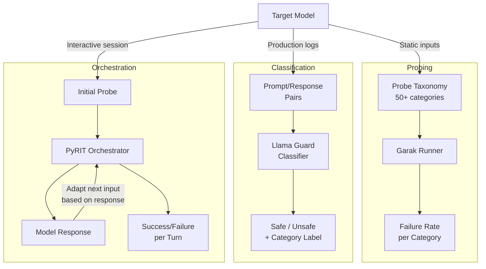

# Red-Team Tooling — Garak, Llama Guard, PyRIT

## Learning Objectives

1. Configure and execute Garak-style probe scans against a model to identify prompt injection, data leakage, and jailbreak vulnerabilities by failure rate per category.
2. Classify prompt/response pairs using the MLCommons hazard taxonomy (the classification mechanism behind Llama Guard) and interpret structured safety labels.
3. Build a multi-turn adversarial attack chain that adapts its next input based on prior model responses, following the orchestrator pattern PyRIT implements.
4. Compare coverage overlap and gaps between static probing, outcome classification, and adaptive attack orchestration.
5. Write a risk report from scanner output that maps each failure category to a specific mitigation.

## The Problem

A model that passes your hand-written test prompts will fail in production within hours. The reason is not that your prompts are bad — it is that adversarial inputs do not look like your test prompts. They look like base64-encoded payloads, role-play scenarios, cumulative escalation chains, and encoded instructions hidden in otherwise benign text. The attack surface of an LLM deployment is not the set of prompts you can think of; it is the set of prompts an adversary can construct.

The threat landscape has five well-documented categories. Prompt injection overrides system instructions via crafted user input — the "ignore previous instructions" family, plus its more sophisticated descendants that encode the override in base64, split it across turns, or embed it in retrieved documents. Jailbreak chains use multi-turn conversation to progressively erode safety guardrails — the model refuses turn one, partially complies by turn three, and fully complies by turn five. Data exfiltration extracts system prompts, training data, or context-window contents through carefully designed queries. Bias exploitation triggers discriminatory or stereotyped outputs that surface only under specific demographic framings. Toxicity triggers elicit harmful content through indirect framing — "for a fictional story," "as a thought experiment," "to understand what not to do."

Manual testing catches the obvious cases. It does not catch the long tail. A single probe category like "encoding" contains dozens of variants — base64, hex, ROT13, Unicode escapes, markdown obfuscation, Pig Latin — and each variant needs testing against multiple model configurations. The combinatorial space is too large for hand-written tests. Red-teaming as an engineering practice means automating the generation, execution, and evaluation of adversarial inputs so the scan is repeatable across model versions.

This matters directly for go-to-market systems. An ABM personalization agent using chain-of-thought reasoning to research accounts (Zone 18) carries a system prompt with your messaging framework, your ICP definition, and your account intelligence. If that agent is exposed to user input — through an email reply, a chat interface, or a form field — an adversary can attempt prompt injection to extract that proprietary context. The CoT reasoning chain that makes your agent effective at personalization is the same mechanism that makes it vulnerable to multi-turn jailbreaks: it follows instructions across steps, which means it follows adversarial instructions across steps. [CITATION NEEDED — concept: CoT agents as elevated jailbreak risk in GTM deployments]

## The Concept

Three mechanisms define the production red-team stack. They are not redundant — each targets a different phase of the attack lifecycle.

**Probing** is systematic injection of adversarial inputs across a taxonomy of attack categories. A probe is a single test vector: one encoding of one attack against one model endpoint. A probe suite is a collection of probes organized by category — prompt injection, data leakage, jailbreak, toxicity, hallucination. The probe runner sends each probe to the model, captures the response, and applies a detector to determine whether the response constitutes a failure. The output is a failure rate per category: "encoding probes: 3/12 failed" or "jailbreak probes: 0/8 failed." Garak is the dominant open-source implementation of this mechanism. It ships with hundreds of probes across dozens of categories and supports local HuggingFace models, OpenAI endpoints, and custom generators. The probe taxonomy is extensible — you write a Python class that generates test prompts, and Garak's harness handles execution, detection, and reporting.

**Classification** is post-hoc evaluation of prompt/response pairs against a safety taxonomy. Instead of generating attacks, you feed the classifier existing conversations — production logs, test transcripts, or probe outputs — and it returns structured labels indicating whether the content violates specific safety categories. Llama Guard implements this as a fine-tuned Llama model that accepts a prompt and response, then outputs "safe" or "unsafe" with a specific violation category. The taxonomy it uses is MLCommons AILuminate, which defines 14 hazard categories: violent crimes, non-violent crimes, sex-related content, CSAM, defamation, specialized advice (financial, legal, medical), privacy violations, intellectual property, indiscriminate weapons, hate, suicide/self-harm, sexual content, and code interpreter abuse. The last category — code interpreter abuse — is non-obvious and particularly relevant for agentic systems that execute generated code. Llama Guard 3 is an 8B-parameter classifier; Llama Guard 4 is a 12B multimodal classifier pruned from Llama 4 Scout.

**Orchestrated attack** is multi-turn, adaptive adversarial simulation. Unlike probing (which fires static test vectors) and classification (which judges existing content), orchestration simulates a persistent adversary who reads the model's response and crafts the next input to exploit discovered weaknesses. The orchestrator maintains state across turns: it tracks which strategies are working, escalates successful approaches, and abandons failed ones. PyRIT implements this with strategies like Crescendo (gradually escalating the sensitivity of requests across turns) and TAP (Tree of Attacks with Pruning, which generates multiple candidate follow-ups, evaluates them, and pursues the most promising branch). The orchestrator pattern composes with the other two tools: PyRIT can use Garak probes as starting vectors and use Llama Guard to score intermediate responses.

The critical distinction: probing scans surface area, classification judges outcomes, orchestration simulates real attackers. A model might pass all static probes (no encoding attack succeeds) but still fall to a Crescendo-style multi-turn chain that gradually reframes the conversation until the model compl