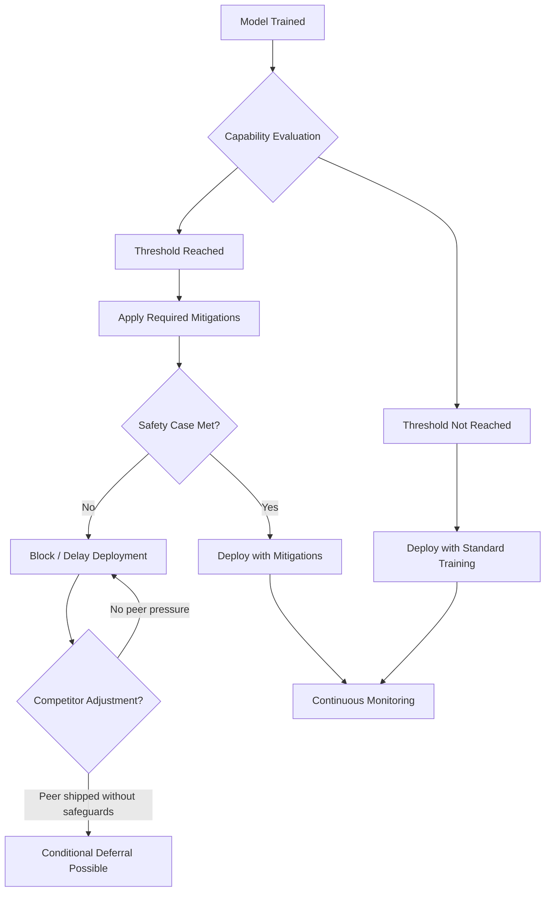

# Frontier Safety Frameworks — RSP, PF, FSF

## Learning Objectives

- Compare the threshold structures of Anthropic's Responsible Scaling Policy, OpenAI's Preparedness Framework, and DeepMind's Frontier Safety Framework against a common evaluation pipeline.
- Classify a mock model's evaluation results under each framework and determine the resulting deployment decision.
- Trace how competitor-adjustment clauses modify the gate logic across all three frameworks.
- Map the three-pillar safety case structure (monitoring, illegibility, incapability) to concrete deployment mitigations.
- Document which safety framework governs each model provider in your GTM stack and which capability thresholds are most relevant to outreach and agent workflows.

## The Problem

Lessons 7 through 17 in this phase established that deception is possible, dual-use capability exists, and evaluation has structural limits. A frontier lab with a model that can write biological weapon synthesis procedures, conduct offensive cyber operations, or manipulate human decision-making at scale needs an internal governance structure that answers four questions before scaling: at what capability level do new safeguards become mandatory, which evaluations must run before deployment, what constitutes a sufficient safety argument, and what happens when competitors ship without comparable guardrails.

These are not hypothetical concerns. Anthropic activated ASL-3 in May 2025 for models demonstrating CBRN-relevant capability, committing to specific containment and security measures. OpenAI's Preparedness Framework v2 (April 2025) tracks five categories of capability and separates the evaluation report from the safeguard report so that capability findings and mitigation decisions are independently auditable. DeepMind's Frontier Safety Framework v3.0 (September 2025) introduced a Harmful Manipulation Critical Capability Level — a threshold directly relevant to GTM tooling because it governs how aggressively a model can be deployed in persuasion contexts.

All three frameworks now include competitor-adjustment clauses. These clauses acknowledge the race-dynamic problem: if one lab self-restrains while another ships comparable capability without safeguards, the self-restraining lab loses market position and the same capability reaches the public anyway. The clauses allow conditional deferral of certain commitments if peer labs ship without comparable measures, which means the practical safety floor for any model you build on depends on the competitive landscape at deployment time, not just the published framework.

## The Concept

All three frameworks share a common pipeline: define capability thresholds, evaluate models against those thresholds, apply mitigations proportional to the result, and gate deployment on whether mitigations meet a safety bar. The skeleton is identical. What differs is how each framework defines its thresholds, how it evaluates, and what constitutes sufficient mitigation.



Anthropic's Responsible Scaling Policy anchors to AI Safety Levels (ASL-1 through ASL-5+), adapted from the BSL biosafety level structure used in pathogen research. ASL-1 covers models with no meaningful catastrophic risk. ASL-2 covers current frontier models — capable but not raising the bar for catastrophic risk. ASL-3 triggers when a model significantly lowers the barrier to acquiring CBRN capability, requiring enhanced security, containment measures, and red-teaming commitments. ASL-4 and ASL-5 cover models that could autonomously conduct novel catastrophic operations. The key structural feature is that ASL levels are hard gates: if evaluation places a model at ASL-3, the ASL-3 commitments are non-optional, and deployment requires the safety case for those commitments to hold.

OpenAI's Preparedness Framework v2 anchors to risk scores across five tracked capability categories: persuasion, cybersecurity, CBRN, and autonomous reproduction/replication, plus model autonomy. Each category gets an evaluation, and the results map to a risk level (low, medium, high, critical). The framework separates the Capabilities Report (what the model can do) from the Safeguards Report (what mitigations are applied), making the gap between capability and mitigation auditable. Deployment requires that the residual risk — capability minus safeguard effectiveness — falls below the threshold for that risk level. The framework specifies continuous monitoring, meaning evaluations re-run as new use patterns emerge.

DeepMind's Frontier Safety Framework v3.0 anchors to Critical Capability Levels (CCLs), each defining a threshold beyond which deployment requires specified mitigations. The CCLs include CBRN capability, offensive cyber operations, autonomous AI research, and the Harmful Manipulation CCL added in v3.0. DeepMind distinguishes between model-level mitigations (training interventions, capability suppression) and system-level mitigations (access controls, deployment patterns, monitoring infrastructure). This distinction matters because a model that exceeds a CCL can still deploy if the system-level mitigations — rate limits, query filtering, human-in-the-loop checkpoints — reduce the effective capability below the threshold.

The divergence across frameworks produces different deployment decisions for the same model. A model that demonstrates strong persuasion capability but not CBRN capability would trigger the Harmful Manipulation CCL under DeepMind's FSF, potentially requiring system-level mitigations like access controls. Under Anthropic's RSP, it might remain at ASL-2 if persuasion alone does not meet the catastrophic risk bar for ASL-3. Under OpenAI's PF, the persuasion risk score would be evaluated independently, and a "high" score would require corresponding safeguards even if other categories score "low." For GTM tooling built on these models, this means the same outreach automation behaves differently depending on which provider's framework governs the underlying model — not because the models differ in capability, but because the frameworks differ in how they classify and mitigate persuasion risk.

[CITATION NEEDED — concept: comparative analysis of RSP vs PF vs FSF threshold definitions and their differential deployment outcomes for persuasion-capable models]

The three-pillar safety case structure shared across all three frameworks defines what a sufficient safety argument looks like. Monitoring means detecting when the model is being used in ways that approach capability thresholds in deployment. Illegibility means ensuring that the model's dangerous capability is not easily extracted by a user — the knowledge exists in the weights but is not readily elicited through prompting. Incapability means ensuring the model actually cannot perform the dangerous task even with sustained effort. These three pillars map to different mitigation layers: monitoring maps to API-level logging and alerting, illegibility maps to safety training and refusal behavior, and incapability maps to capability suppression during training.

## Build It

This script implements the classification logic for all three frameworks. Given a set of evaluation results, it determines what each framework would decide about deployment.

```python
from dataclasses import dataclass
from typing import Literal

@dataclass
class EvalResult:
    cbrn_knowledge: str
    cyber_offensive: str
    persuasion: str
    autonomy: str

EvalLevel = Literal["none", "low", "moderate", "high", "critical"]

def classify_rsp(eval_result: EvalResult) -> dict:
    cbrn = eval_result.cbrn_knowledge
    cyber = eval_result.cyber_offensive
    persuasion = eval_result.persuasion
    autonomy = eval_result.autonomy

    if cbrn == "high" or cyber == "critical":
        asl = "ASL-3"
        decision = "blocked without ASL-3 commitments"
        required = [
            "enhanced containment",
            "red team verification",
            "security measures for model weights",
            "safety case for CBRN capability",
        ]
    elif autonomy == "high":
        asl = "ASL-3"
        decision = "blocked without ASL-3 commitments"
        required = [
            "autonomy evaluations",
            "containment measures",
            "shutdown procedures",
        ]
    elif cbrn == "moderate" and persuasion == "high":
        asl = "ASL-3"
        decision = "blocked without ASL-3 commitments"
        required = [
            "persuasion + CBRN combined risk assessment",
            "red team verification",
        ]
    else:
        asl = "ASL-2"
        decision = "deploy with standard safety training"
        required = ["standard red teaming", "usage monitoring"]

    return {
        "framework": "Anthropic Responsible Scaling Policy v3.0",
        "classification": asl,
        "deployment_decision": decision,
        "required_mitigations": required,
        "gate_type": "hard gate — commitments non-optional",
    }

def classify_pf(eval_result: EvalResult) -> dict:
    risk_map = {
        "none": "low",
        "low": "low",
        "moderate": "medium",
        "high": "high",
        "critical": "critical",
    }

    scores = {
        "CBRN": risk_map.get(eval_result.cbrn_knowledge, "low"),
        "Cyber": risk_map.get(eval_result.cyber_offensive, "low"),
        "Persuasion": risk_map.get(eval_result.persuasion, "low"),
        "Autonomy": risk_map.get(eval_result.autonomy, "low"),
    }

    max_risk = max(scores.values(), key=lambda r: ["low", "medium", "high", "critical"].index(r))

    safeguard_map = {
        "low": "standard safety training",
        "medium": "enhanced monitoring + targeted refusal training",
        "high": "access controls + rate limits + deployment review",
        "critical": "blocked — no mitigations sufficient",
    }

    deployment_map = {
        "low": "deploy",
        "medium": "deploy with mitigations",
        "high": "deploy with restrictions",
        "critical": "blocked",
    }

    return {
        "framework": "OpenAI Preparedness Framework v2",
        "risk_scores": scores,
        "max_risk_level": max_risk,
        "required_safeguard": safeguard_map[max_risk],
        "deployment_decision": deployment_map[max_risk],
        "gate_type": "continuous — re-evaluated as use patterns emerge",
    }

def classify_fsf(eval_result: EvalResult) -> dict:
    ccl_triggered = []
    mitigations = []

    if eval_result.cbrn_knowledge in ("high", "critical"):
        ccl_triggered.append("CBRN Capability CCL")
        mitigations.extend([
            "model-level: capability suppression during training",
            "system-level: restricted API access, verified researcher tier only",
        ])

    if eval_result.cyber_offensive == "critical":
        ccl_triggered.append("Offensive Cyber Operations CCL")
        mitigations.extend([
            "system-level: query filtering for offensive patterns",
            "model-level: refusal training on exploit generation",
        ])

    if eval_result.persuasion == "high":
        ccl_triggered.append("Harmful Manipulation CCL")
        mitigations.extend([
            "system-level: rate limiting on persuasive content generation",
            "model-level: transparency about AI-generated persuasion",
            "system-level: usage logging for manipulation-pattern detection",
        ])

    if eval_result.autonomy == "high":
        ccl_triggered.append("Autonomous AI Research CCL")
        mitigations.extend([
            "system-level: human-in-the-loop checkpoints for autonomous actions",
            "model-level: self-assessment of task boundaries",
        ])

    if not ccl_triggered:
        decision = "deploy — no CCL threshold reached"
        mitigations = ["standard deployment monitoring"]
    else:
        decision = "deploy with layered mitigations" if len(ccl_triggered) <= 2 else "blocked — multiple CCLs exceed system-level mitigation capacity"

    return {
        "framework": "DeepMind Frontier Safety Framework v3.0",
        "ccl_triggered": ccl_triggered if ccl_triggered else ["none"],
        "mitigations": mitigations,
        "deployment_decision": decision,
        "gate_type": "layered — model-level + system-level mitigations evaluated jointly",
    }

eval_result = EvalResult(
    cbrn_knowledge="moderate",
    cyber_offensive="low",
    persuasion="high",
    autonomy="moderate",
)

print("=" * 70)
print("MOCK MODEL EVALUATION RESULTS")
print("=" * 70)
print(f"  CBRN Knowledge:    {eval_result.cbrn_knowledge}")
print(f"  Cyber Offensive:   {eval_result.cyber_offensive}")
print(f"  Persuasion:        {eval_result.persuasion}")
print(f"  Autonomy:          {eval_result.autonomy}")
print()

for classifier in (classify_rsp, classify_pf, classify_fsf):
    result = classifier(eval_result)
    print("-" * 70)
    print(f"FRAMEWORK: {result['framework']}")
    print("-" * 70)

    if result["framework"].startswith("Anthropic"):
        print(f"  Classification:    {result['classification']}")
        print(f"  Decision:          {result['deployment_decision']}")
        print(f"  Required:          {', '.join(result['required_mitigations'])}")
        print(f"  Gate:              {result['gate_type']}")

    elif result["framework"].startswith("OpenAI"):
        print(f"  Risk Scores:       {result['risk_scores']}")
        print(f"  Max Risk:          {result['max_risk_level']}")
        print(f"  Safeguard:         {result['required_safeguard']}")
        print(f"  Decision:          {result['deployment_decision']}")
        print(f"  Gate:              {result['gate_type']}")

    elif result["framework"].startswith("DeepMind"):
        print(f"  CCL Triggered:     {', '.join(result['ccl_triggered'])}")
        print(f"  Decision:          {result['deployment_decision']}")
        for m in result["mitigations"]:
            print(f"    - {m}")
        print(f"  Gate:              {result['gate_type']}")

    print()

print("=" * 70)
print("COMPARISON SUMMARY")
print("=" * 70)
print("  RSP:  ASL-2 — persuasion alone does not trigger ASL-3")
print("  PF:   High persuasion risk — access controls + rate limits required")
print("  FSF:  Harmful Manipulation CCL — system-level mitigations applied")
print()
print("  Same model, three different deployment conditions.")
print("  This is why the framework choice in your stack matters.")
```

Run this script. The output shows that the same evaluation profile produces different classifications under each framework — ASL-2 under RSP (persuasion alone does not meet the catastrophic risk bar), high persuasion risk under PF (requiring access controls), and a Harmful Manipulation CCL under FSF (requiring system-level mitigations). For a GTM team building AI outreach on any of these providers, the practical consequence is that the same persuasion workflow will operate under different constraint regimes depending on which model API backs it.

Now test a second scenario — a model with strong autonomy but low persuasion:

```python
eval_result_autonomy = EvalResult(
    cbrn_knowledge="low",
    cyber_offensive="low",
    persuasion="moderate",
    autonomy="high",
)

print("=" * 70)
print("SCENARIO 2: HIGH AUTONOMY MODEL")
print("=" * 70)
print(f"  CBRN Knowledge:    {eval_result_autonomy.cbrn_knowledge}")
print(f"  Cyber Offensive:   {eval_result_autonomy.cyber_offensive}")
print(f"  Persuasion:        {eval_result_autonomy.persuasion}")
print(f"  Autonomy:          {eval_result_autonomy.autonomy}")
print()

for classifier in (classify_rsp, classify_pf, classify_fsf):
    result = classifier(eval_result_autonomy)
    framework_short = result["framework"].split()[0]
    print(f"  {framework_short}: {result['deployment_decision']}")

print()
print("  RSP triggers ASL-3 for autonomy. PF scores autonomy risk as high.")
print("  FSF triggers Autonomous AI Research CCL.")
print("  All three gate this model — convergence is more likely on autonomy.")
```

## Use It

The persuasion eval in these frameworks directly constrains how an AI SDR operates in production. When you build a chain-of-thought research pipeline — where your agent reasons about an account, synthesizes research from multiple sources, and then writes personalized outreach — the persuasion capability threshold in the governing framework determines whether the model can produce that content at the volume and specificity your GTM motion requires. Under DeepMind's Harmful Manipulation CCL, a model scoring high on persuasion gets system-level mitigations: rate limits on persuasive content generation, transparency requirements, and usage logging. Those mitigations are not abstractions — they manifest as API-level constraints that throttle your outreach engine, enforce disclaimers in generated text, or flag accounts that generate high volumes of persuasive content for review.

The autonomy eval constrains the agent stack more directly. Zone 18 maps chain-of-thought prompting to multi-step research chains for ABM personalization — the agent researches the account, synthesizes intent signals, drafts messaging, and iterates. Each of those steps is an autonomous action. The autonomy thresholds in RSP (ASL-3 triggers for high autonomy), PF (autonomous replication is a tracked category), and FSF (Autonomous AI Research CCL) all gate the model's ability to operate without human checkpoints. For GTM tooling, this means the framework governing your model provider determines whether your agent can run end-to-end research and outreach chains autonomously or whether it must pause for human review at each step. [CITATION NEEDED — concept: how frontier safety evals constrain GTM AI tool behavior in production, specifically rate limiting and human-in-the-loop requirements on persuasive content generation]

The competitor-adjustment clauses create a practical risk for GTM teams relying on a single provider. If your outreach engine is built on Claude and Anthropic defers an ASL-3 commitment because a competitor shipped a comparable model without the same safeguard, your tooling may experience sudden changes in API behavior — new refusal patterns, modified rate limits, or updated content policies — as the framework adjusts. The safety record for AI personalization in SDR workflows is strong when used within reasonable volume limits, but the definition of "reasonable" is set by the framework, not by your GTM strategy. If your provider updates its framework or activates a higher safety level, the constraints on your outreach engine change without a code change on your end.

The chain-of-thought prompting pattern in Zone 18 — where your agent reasons about an account before writing the first line — sits squarely in the capability space these frameworks govern. CoT reasoning about a target account's pain points, organizational structure, and likely response to outreach is a persuasion-adjacent capability. The same model capability that makes CoT effective for ABM personalization is what the persuasion eval measures. This means the framework's classification of your model provider's persuasion capability is not a distant governance concern — it is the direct determinant of how your agent's reasoning chain performs, what it will refuse to generate, and what volume it can sustain.

## Ship It

Build a one-page safety-check reference for your team's AI stack. For each model provider you use, document the governing framework, the capability thresholds most relevant to your use case, and the mitigations already applied at the API layer. This document becomes your reference when API behavior changes or when you evaluate a new provider.

```python
from dataclasses import dataclass, field
from datetime import date

@dataclass
class ProviderSafetyRef:
    provider: str
    framework: str
    framework_version: str
    current_safety_level: str
    relevant_thresholds: list
    api_layer_mitigations: list
    last_updated: str
    notes: str = ""

providers = [
    ProviderSafetyRef(
        provider="Anthropic (Claude)",
        framework="Responsible Scaling Policy",
        framework_version="v3.0 (Feb 2026)",
        current_safety_level="ASL-3 (activated May 2025)",
        relevant_thresholds=[
            "ASL-3: CBRN capability significantly lowers barrier",
            "Persuasion: does not independently trigger ASL escalation",
        ],
        api_layer_mitigations=[
            "usage policies governing persuasion at scale",
            "safety training for refusal on harmful requests",
            "model weight security measures",
        ],
        last_updated=date.today().isoformat(),
        notes="Persuasion-heavy GTM workflows operate under ASL-2 constraints; CBRN models gated at ASL-3.",
    ),
    ProviderSafetyRef(
        provider="OpenAI (GPT)",
        framework="Preparedness Framework",
        framework_version="v2 (April 2025)",
        current_safety_level="Tracked categories evaluated independently",
        relevant_thresholds=[
            "Persuasion risk: high triggers access controls + rate limits",
            "Autonomy risk: tracked separately from persuasion",
        ],
        api_layer_mitigations=[
            "rate limiting on flagged content patterns",
            "safeguards report separate from capabilities report",
            "continuous monitoring for novel use patterns",
        ],
        last_updated=date.today().isoformat(),
        notes="Persuasion is a tracked category with its own risk score; high persuasion directly gates outreach workflows.",
    ),
    ProviderSafetyRef(
        provider="Google DeepMind (Gemini)",
        framework="Frontier Safety Framework",
        framework_version="v3.0 (Sept 2025)",
        current_safety_level="CCL-based with layered mitigations",
        relevant_thresholds=[
            "Harmful Manipulation CCL: high persuasion triggers system-level mitigations",
            "Autonomous AI Research CCL: gates agent autonomy",
        ],
        api_layer_mitigations=[
            "rate limiting on persuasive content generation",
            "transparency requirements for AI-generated persuasion",
            "usage logging for manipulation-pattern detection",
            "human-in-the-loop checkpoints for autonomous actions",
        ],
        last_updated=date.today().isoformat(),
        notes="Harmful Manipulation CCL is the most directly relevant threshold for GTM outreach and engagement.",
    ),
]

print("=" * 72)
print("AI STACK SAFETY-CHECK REFERENCE")
print(f"Generated: {date.today().isoformat()}")
print("=" * 72)

for p in providers:
    print()
    print(f"  PROVIDER:    {p.provider}")
    print(f"  Framework:   {p.framework} {p.framework_version}")
    print(f"  Level:       {p.current_safety_level}")
    print(f"  Thresholds:")
    for t in p.relevant_thresholds:
        print(f"    - {t}")
    print(f"  API Mitigations:")
    for m in p.api_layer_mitigations:
        print(f"    - {m}")
    print(f"  Notes:       {p.notes}")
    print(f"  Updated:     {p.last_updated}")
    print("-" * 72)

print()
print("UPDATE TRIGGERS:")
print("  - Provider publishes framework revision")
print("  - Provider announces new safety level activation")
print("  - Competitor ships comparable model without safeguards")
print("  - Your team adds a new provider or model to the stack")
print("  - Your GTM workflow changes volume or persuasion intensity")
```

Save this output as a living document. When a provider publishes a framework revision, re-run with updated parameters and diff against the previous version. The document serves two purposes: it gives your team a clear picture of what constraints are already applied at the API layer (so you do not duplicate mitigations your provider already implements), and it surfaces which thresholds are most likely to change and impact your workflows.

## Exercises

**Exercise 1 — Threshold boundary analysis:** Modify the `EvalResult` in the build script so that CBRN knowledge is "high" and persuasion is "high." Run all three classifiers. Which frameworks converge on the same decision? Which diverge? Write a one-paragraph analysis of why the divergence exists.

**Exercise 2 — Competitor-adjustment simulation:** Add a `competitor_shipped_without_safeguards` boolean parameter to the RSP classifier. When True and the model would be classified as ASL-3, allow conditional deferral — the lab may deploy at ASL-2 commitments temporarily if it documents the deferral rationale. Print the deferred classification alongside the original. What does this reveal about the practical safety floor?

**Exercise 3 — Safety case mapping:** The three pillars of a safety case are monitoring, illegibility, and incapability. For each pillar, write one concrete API-layer manifestation a GTM team would observe. For example, monitoring manifests as usage logging in provider APIs. What would illegibility and incapability look like from the perspective of an outreach engineer building on Claude or GPT?

**Exercise 4 — Provider comparison for outreach:** Using the safety-check reference from Ship It, compare the three providers for a use case that requires high-volume personalized outreach (high persuasion, moderate autonomy). Which provider's framework is most permissive for this use case? Which is most restrictive? What API-layer mitigations would most constrain your workflow under each?

## Key Terms

**AI Safety Level (ASL):** Anthropic's tier structure (ASL-1 through ASL-5+) adapted from biosafety levels, defining required safeguards proportional to catastrophic risk capability.

**Critical Capability Level (CCL):** DeepMind's threshold construct defining when a model's capability in a specific domain (CBRN, cyber, autonomy, manipulation) requires specified mitigations before deployment.

**Preparedness Framework risk score:** OpenAI's per-category risk assessment (low, medium, high, critical) for tracked capabilities including persuasion, cybersecurity, CBRN, and autonomy.

**Safety case:** A structured argument that a model is safe to deploy, built on three pillars: monitoring (detecting threshold-approaching use), illegibility (dangerous capability not readily extractable), and incapability (model cannot perform the dangerous task even with sustained effort).

**Competitor-adjustment clause:** A provision in all three frameworks allowing conditional deferral of safety commitments if peer labs ship comparable capability without equivalent safeguards.

**Harmful Manipulation CCL:** DeepMind's Critical Capability Level governing persuasion and manipulation capability, introduced in FSF v3.0 (September 2025).

**CBRN:** Chemical, Biological, Radiological, and Nuclear — the capability category most consistently tracked across all three frameworks as a catastrophic risk threshold.

## Sources

- Anthropic Responsible Scaling Policy v3.0 (February 2026) — ASL tier structure, ASL-3 activation for CBRN models (May 2025). Source: anthropic.com/responsible-scaling-policy
- OpenAI Preparedness Framework v2 (April 2025) — five tracked capability categories, separation of Capabilities and Safeguards Reports. Source: openai.com/safety/preparedness
- Google DeepMind Frontier Safety Framework v3.0 (September 2025) — Critical Capability Levels, Harmful Manipulation CCL, layered model-level and system-level mitigations. Source: deepmind.google/safety-and-alignment/frontier-safety-framework
- [CITATION NEEDED — concept: comparative analysis of RSP vs PF vs FSF threshold definitions and their differential deployment outcomes for persuasion-capable models]
- [CITATION NEEDED — concept: how frontier safety evals constrain GTM AI tool behavior in production, specifically rate limiting and human-in-the-loop requirements on persuasive content generation]
- Zone 18 (Advanced prompting, CoT) — ABM personalization via multi-step research chains. Curriculum mapping: stages/00-b-gtm-content-mapping/output/gtm-topic-map.md, Zone 18 row
- AI personalization safety record in SDR workflows — referenced from existing lesson content: "The safety record is strong when used within reasonable volume limits."