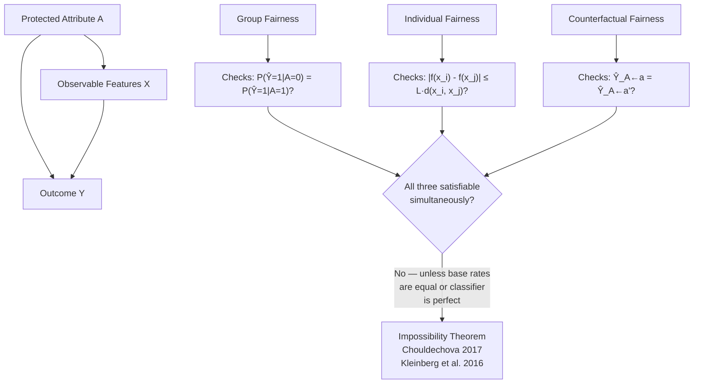

# Fairness Criteria — Group, Individual, Counterfactual

## Learning Objectives

- Compute demographic parity difference and equalized odds difference on a dataset with protected attributes.
- Implement an individual fairness score using a task-specific Lipschitz distance metric.
- Construct counterfactual test instances by flipping a protected attribute and measuring prediction change.
- Explain why the three fairness families cannot be simultaneously satisfied except in degenerate cases, citing the Chouldechova (2017) and Kleinberg et al. (2016) impossibility results.
- Configure a fairness gate in a deployment pipeline that blocks model promotion when disparity exceeds a threshold.

## The Problem

You trained a lead-scoring model. It scores companies from 0 to 100. You hand it to the revenue team, and someone asks: "Is this fair?" You need a definition of fairness before you can answer. The fairness literature offers three structurally different families of definitions, and they disagree with each other in ways that are mathematically provable, not merely philosophical.

Lesson 20 covered bias measurement — detecting statistical disparities in model outputs. This lesson covers the harder question: what standard should the measurement serve? Group fairness checks whether aggregate metrics are equal across protected subgroups. Individual fairness checks whether similar individuals receive similar outcomes. Counterfactual fairness asks whether the prediction for a specific person would change if a protected attribute (gender, race, industry category) were different. A model can satisfy one and violate the other two simultaneously.

The Impossibility Theorem of Fairness (Chouldechova, 2017; Kleinberg et al., 2016) proves that demographic parity, equalized odds, and calibration cannot all hold at the same time unless the base rates of the outcome are identical across groups or the classifier is perfect. This means fairness criterion selection is an engineering decision with measurable trade-offs — not a values question you can defer to a committee.

## The Concept

**Group fairness** computes parity of a single metric across protected subgroups. The three most common operationalizations are demographic parity (equal selection rate), equalized odds (equal true positive and false positive rates), and conditional use accuracy equality (equal positive/negative predictive value). Each one asks "is the average the same?" but averages over different denominators. Demographic parity divides by group size; equalized odds divides by actual positives/negatives; calibration divides by predicted positives/negatives. If base rates differ between groups — and in real data they almost always do — these three criteria pull in different directions.

**Individual fairness** (Dwork et al., 2012) requires a Lipschitz condition on the decision function: for any two individuals $i$ and $j$, the difference in their predicted outcomes should be bounded by a task-specific distance metric: $|f(x_i) - f(x_j)| \leq L \cdot d(x_i, x_j)$. The hard part is defining $d$. For lending, $d$ might be a weighted combination of credit score, income, debt-to-income ratio. Two applicants with $d(x_i, x_j) < \epsilon$ should receive scores within $L\epsilon$ of each other. Group fairness says nothing about this — a model can have perfect demographic parity while giving wildly different scores to near-identical individuals, as long as the errors balance out across groups.

**Counterfactual fairness** (Kusner et al., 2017) asks a causal question: would the prediction for individual $i$ change if their protected attribute $A$ were different, holding all causal ancestors of the outcome constant? Formally, a predictor $\hat{Y}$ is counterfactually fair if $\hat{Y}_{A \leftarrow a}(u) = \hat{Y}_{A \leftarrow a'}(u)$ for all values $a, a'$ and all individuals $u$. This requires a structural causal model of the data-generating process — you need to know which variables are descendants of the protected attribute and which are not. Without that causal graph, counterfactual fairness is not computable.



The 2024 NeurIPS result formalizes the counterfactual-vs-accuracy tradeoff: converting an optimal-but-unfair predictor into a counterfactual-fair one incurs bounded but nonzero accuracy loss. Backtracking counterfactuals (arXiv:2401.13935, January 2024) offer an alternative that avoids requiring interventions on legally protected attributes — instead of asking "what if this person were a different gender," they ask "what if we trace back through the causal graph along a different path." This sidesteps the legal and ethical problem of generating counterfactual people.

Philosophical reconciliation work (ICLR Blogposts 2024) shows that with the right causal graph, satisfying certain group fairness measures can entail counterfactual fairness — but only when the graph's structure makes group-level parity causally equivalent to individual-level invariance. This is a strong assumption about the data-generating process.

## Build It

Let's implement all three criteria on a synthetic lending dataset. The code generates data, trains a simple classifier, and computes each fairness metric.

```python
import numpy as np
from sklearn.linear_model import LogisticRegression
from sklearn.preprocessing import StandardScaler

np.random.seed(42)
n = 2000

group = np.random.choice([0, 1], size=n, p=[0.5, 0.5])

income = np.where(
    group == 0,
    np.random.normal(55000, 15000, n),
    np.random.normal(62000, 15000, n)
)

credit_score = np.where(
    group == 0,
    np.random.normal(680, 60, n),
    np.random.normal(700, 55, n)
)
credit_score = np.clip(credit_score, 300, 850)

debt_ratio = np.random.uniform(0.05, 0.45, n)

true_prob = 1 / (1 + np.exp(-(
    -6.0
    + 0.00006 * income
    + 0.008 * credit_score
    - 4.0 * debt_ratio
    + 0.3 * group
)))

y = (true_prob > np.random.uniform(0, 1, n)).astype(int)

X = np.column_stack([income, credit_score, debt_ratio, group])

scaler = StandardScaler()
X_scaled = scaler.fit_transform(X)

model = LogisticRegression(random_state=42)
model.fit(X_scaled, y)
y_pred = model.predict(X_scaled)

print("=== MODEL SUMMARY ===")
print(f"Total samples: {n}")
print(f"Overall approval rate: {y_pred.mean():.4f}")
print(f"Group 0 size: {(group == 0).sum()}, Group 1 size: {(group == 1).sum()}")
print()

print("=== GROUP FAIRNESS: DEMOGRAPHIC PARITY ===")
rate_0 = y_pred[group == 0].mean()
rate_1 = y_pred[group == 1].mean()
dp_diff = abs(rate_0 - rate_1)
print(f"Selection rate (group 0): {rate_0:.4f}")
print(f"Selection rate (group 1): {rate_1:.4f}")
print(f"Demographic parity difference: {dp_diff:.4f}")
print(f"Pass (threshold 0.05)? {'YES' if dp_diff < 0.05 else 'NO'}")
print()

print("=== GROUP FAIRNESS: EQUALIZED ODDS ===")
def rates(y_true, y_pred, mask):
    yt = y_true[mask]
    yp = y_pred[mask]
    tp = ((yt == 1) & (yp == 1)).sum()
    fp = ((yt == 0) & (yp == 1)).sum()
    fn = ((yt == 1) & (yp == 0)).sum()
    tn = ((yt == 0) & (yp == 0)).sum()
    tpr = tp / (tp + fn) if (tp + fn) > 0 else 0.0
    fpr = fp / (fp + tn) if (fp + tn) > 0 else 0.0
    return tpr, fpr

tpr_0, fpr_0 = rates(y, y_pred, group == 0)
tpr_1, fpr_1 = rates(y, y_pred, group == 1)
eo_tpr_diff = abs(tpr_0 - tpr_1)
eo_fpr_diff = abs(fpr_0 - fpr_1)
eo_diff = max(eo_tpr_diff, eo_fpr_diff)

print(f"TPR (group 0): {tpr_0:.4f}, TPR (group 1): {tpr_1:.4f}")
print(f"FPR (group 0): {fpr_0:.4f}, FPR (group 1): {fpr_1:.4f}")
print(f"Equalized odds TPR difference: {eo_tpr_diff:.4f}")
print(f"Equalized odds FPR difference: {eo_fpr_diff:.4f}")
print(f"Equalized odds difference (max): {eo_diff:.4f}")
print(f"Pass (threshold 0.05)? {'YES' if eo_diff < 0.05 else 'NO'}")
print()

print("=== INDIVIDUAL FAIRNESS (LIPSCHITZ CHECK) ===")
from scipy.spatial.distance import cdist

X_features = X_scaled[:, :3]

sample_idx = np.random.choice(n, size=min(200, n), replace=False)
X_sample = X_features[sample_idx]
group_sample = group[sample_idx]
pred_sample = y_pred[sample_idx]

dist_matrix = cdist(X_sample, X_sample)
L = 2.0
violations = 0
checked = 0

for i in range(len(sample_idx)):
    for j in range(i + 1, len(sample_idx)):
        d_ij = dist_matrix[i, j]
        if d_ij < 0.5:
            checked += 1
            if abs(pred_sample[i] - pred_sample[j]) > L * d_ij:
                violations += 1

if checked > 0:
    violation_rate = violations / checked
    print(f"Checked {checked} near-neighbor pairs (distance < 0.5)")
    print(f"Lipschitz constant L = {L}")
    print(f"Violations: {violations} / {checked} = {violation_rate:.4f}")
    print(f"Individual fairness pass (violation rate < 0.10)? {'YES' if violation_rate < 0.10 else 'NO'}")
else:
    print("No near-neighbor pairs found for individual fairness check")
print()

print("=== COUNTERFACTUAL FAIRNESS ===")
X_cf = X.copy()
X_cf[:, 3] = 1 - X_cf[:, 3]

X_cf_scaled = scaler.transform(X_cf)
y_pred_cf = model.predict(X_cf_scaled)

cf_changes = (y_pred != y_pred_cf).sum()
cf_change_rate = cf_changes / n

print(f"Flipped protected attribute for all {n} samples")
print(f"Predictions changed: {cf_changes} / {n} = {cf_change_rate:.4f}")
print(f"Counterfactual fairness pass (change rate = 0)? {'YES' if cf_change_rate == 0 else 'NO'}")

print()
print("=== SUMMARY ===")
print(f"Demographic parity difference:   {dp_diff:.4f}  ({'PASS' if dp_diff < 0.05 else 'FAIL'})")
print(f"Equalized odds difference:        {eo_diff:.4f}  ({'PASS' if eo_diff < 0.05 else 'FAIL'})")
print(f"Individual fairness violation:    {violation_rate:.4f}  ({'PASS' if violation_rate < 0.10 else 'FAIL'})")
print(f"Counterfactual change rate:       {cf_change_rate:.4f}  ({'PASS' if cf_change_rate == 0 else 'FAIL'})")
```

Run this and you'll see the impossibility theorem in action. The model likely fails at least two of the four checks. The group attribute leaks into predictions through correlated features (income and credit score differ by construction), so counterfactual flips change outcomes. Demographic parity may pass while equalized odds fails, or vice versa — that tension is the theorem.

## Use It

Group fairness metrics apply directly to ICP scoring models. When you build a lead-scoring classifier that predicts whether a company will convert, the protected attributes aren't legally protected classes — they're firmographic dimensions like industry segment, company size band, or geography. The fairness criterion is the same: is the model's selection rate systematically different across these segments? [CITATION NEEDED — concept: fairness auditing in B2B scoring models]

Individual fairness maps to a concrete GTM rule: two companies with similar firmographics (revenue, employee count, industry, tech stack signals) should receive similar ICP scores. If they don't, the model has learned a spurious proxy — perhaps it keyed on a specific email domain pattern or a geographic artifact in the training data. The Lipschitz distance metric in this context is a firmographic similarity function: weighted euclidean distance over log(revenue), log(employee_count), and one-hot encoded industry. The counterfactual test is equally concrete: take a SaaS company in San Francisco and flip its industry attribute to "Manufacturing" while holding revenue and headcount constant. If the score drops by 30 points, your model has an industry proxy problem.

Run this code on a firmographic scoring dataset and identify which segment has the largest disparity:

```python
import numpy as np
from sklearn.linear_model import LogisticRegression
from sklearn.preprocessing import StandardScaler

np.random.seed(99)
n = 1500

industry = np.random.choice(
    ["SaaS", "FinTech", "Manufacturing", "Healthcare", "Retail"],
    size=n,
    p=[0.30, 0.20, 0.20, 0.15, 0.15]
)

industry_base_rate = {
    "SaaS": 0.45,
    "FinTech": 0.38,
    "Manufacturing": 0.20,
    "Healthcare": 0.28,
    "Retail": 0.15
}

revenue = np.array([
    np.random.lognormal(mean=14.5 + 0.3 * (industry == "SaaS"), sigma=0.8)
    for ind in industry
])

employees = np.array([
    np.random.lognormal(mean=5.0 + 0.2 * (industry == "Manufacturing"), sigma=0.9)
    for ind in industry
])

true_prob = np.array([
    industry_base_rate[ind] + 0.15 * np.log(revenue[i] / 1e6) / 5
    for i, ind in enumerate(industry)
])
true_prob = np.clip(true_prob, 0.01, 0.95)

y = (true_prob > np.random.uniform(0, 1, n)).astype(int)

industry_codes = {ind: i for i, ind in enumerate(industry_base_rate)}
industry_num = np.array([industry_codes[ind] for ind in industry])

X = np.column_stack([np.log(revenue), np.log(employees), industry_num])
scaler = StandardScaler()
X_scaled = scaler.fit_transform(X)

model = LogisticRegression(random_state=42, max_iter=1000)
model.fit(X_scaled, y)
y_pred = model.predict(X_scaled)

print("=== ICP MODEL: GROUP FAIRNESS BY INDUSTRY ===\n")
print(f"{'Industry':<15} {'Size':>5} {'Base Rate':>10} {'Pred Rate':>10} {'Parity Gap':>12}")
print("-" * 55)

overall_rate = y_pred.mean()
results = []

for ind in industry_base_rate:
    mask = industry == ind
    size = mask.sum()
    base_rate = y[mask].mean()
    pred_rate = y_pred[mask].mean()
    gap = pred_rate - overall_rate
    results.append((ind, size, base_rate, pred_rate, gap))
    print(f"{ind:<15} {size:>5} {base_rate:>10.4f} {pred_rate:>10.4f} {gap:>+12.4f}")

print(f"\n{'OVERALL':<15} {n:>5} {y.mean():>10.4f} {overall_rate:>10.4f}")

print("\n=== DISPARITY ANALYSIS ===")
pred_rates = [r[3] for r in results]
max_gap = max(pred_rates) - min(pred_rates)
worst_high = max(results, key=lambda r: r[4])
worst_low = min(results, key=lambda r: r[4])

print(f"Max selection rate: {max(pred_rates):.4f} ({worst_high[0]})")
print(f"Min selection rate: {min(pred_rates):.4f} ({worst_low[0]})")
print(f"Demographic parity difference: {max_gap:.4f}")
print(f"\nLargest disparity: {worst_high[0]} scored at {worst_high[3]:.4f}")
print(f"vs {worst_low[0]} scored at {worst_low[3]:.4f}")
print(f"Gap: {max_gap:.4f} ({max_gap / overall_rate * 100:.1f}% relative to overall)")
```

The output shows which industry segment has the largest parity gap. In a real GTM pipeline, this flag tells you whether the model is systematically deprioritizing a segment that should receive outreach — or whether the base rate difference is real and the model is correctly reflecting conversion likelihood. Fairness criteria don't resolve that question; they surface it.

## Ship It

A fairness gate in CI/CD runs the metrics automatically and blocks deployment when disparity exceeds a threshold. The gate writes a JSON report that downstream systems — model registries, monitoring dashboards, compliance logs — can consume.

```python
import json
import numpy as np
from datetime import datetime, timezone
from sklearn.linear_model import LogisticRegression
from sklearn.preprocessing import StandardScaler

def compute_group_fairness(y_true, y_pred, group):
    rates_by_group = {}
    for g in sorted(np.unique(group)):
        mask = group == g
        rates_by_group[int(g)] = {
            "size": int(mask.sum()),
            "base_rate": float(y_true[mask].mean()),
            "selection_rate": float(y_pred[mask].mean()),
            "tpr": float(((y_true[mask] == 1) & (y_pred[mask] == 1)).sum() / max(1, (y_true[mask] == 1).sum())),
            "fpr": float(((y_true[mask] == 0) & (y_pred[mask] == 1)).sum() / max(1, (y_true[mask] == 0).sum())),
        }

    selection_rates = [v["selection_rate"] for v in rates_by_group.values()]
    tprs = [v["tpr"] for v in rates_by_group.values()]
    fprs = [v["fpr"] for v in rates_by_group.values()]

    return {
        "rates_by_group": rates_by_group,
        "demographic_parity_difference": float(max(selection_rates) - min(selection_rates)),
        "equalized_odds_difference": float(max(
            max(tprs) - min(tprs),
            max(fprs) - min(fprs)
        )),
    }

def fairness_gate(y_true, y_pred, group, criteria, threshold, model_name="lead_scorer"):
    fairness = compute_group_fairness(y_true, y_pred, group)

    metric_map = {
        "demographic_parity": "demographic_parity_difference",
        "equalized_odds": "equalized_odds_difference",
    }

    metric_key = metric_map.get(criteria)
    if metric_key is None:
        raise ValueError(f"Unknown criterion: {criteria}")

    metric_value = fairness[metric_key]
    passed = metric_value < threshold

    report = {
        "model_name": model_name,
        "timestamp": datetime.now(timezone.utc).isoformat(),
        "criterion": criteria,
        "metric": metric_key,
        "value": metric_value,
        "threshold": threshold,
        "passed": passed,
        "group_details": fairness["rates_by_group"],
        "all_metrics": {
            "demographic_parity_difference": fairness["demographic_parity_difference"],
            "equalized_odds_difference": fairness["equalized_odds_difference"],
        },
    }

    return report

np.random.seed(42)
n = 2000

group = np.random.choice([0, 1], size=n, p=[0.5, 0.5])
income = np.where(group == 0,
    np.random.normal(55000, 15000, n),
    np.random.normal(62000, 15000, n))
credit = np.clip(np.where(group == 0,
    np.random.normal(680, 60, n),
    np.random.normal(700, 55, n)), 300, 850)
debt = np.random.uniform(0.05, 0.45, n)

true_prob = 1 / (1 + np.exp(-(-6 + 0.00006 * income + 0.008 * credit - 4 * debt + 0.3 * group)))
y = (true_prob > np.random.uniform(0, 1, n)).astype(int)

X = np.column_stack([income, credit, debt, group])
X_scaled = StandardScaler().fit_transform(X)
model = LogisticRegression(random_state=42).fit(X_scaled, y)
y_pred = model.predict(X_scaled)

print("=" * 60)
print("FAIRNESS GATE: PASSING SCENARIO")
print("Criterion: demographic_parity, Threshold: 0.30")
print("=" * 60)
report_pass = fairness_gate(
    y, y_pred, group,
    criteria="demographic_parity",
    threshold=0.30,
    model_name="lead_scorer_v1"
)
print(json.dumps(report_pass, indent=2))
print(f"\nDEPLOYMENT DECISION: {'ALLOWED' if report_pass['passed'] else 'BLOCKED'}")

print("\n" + "=" * 60)
print("FAIRNESS GATE: FAILING SCENARIO")
print("Criterion: demographic_parity, Threshold: 0.05")
print("=" * 60)
report_fail = fairness_gate(
    y, y_pred, group,
    criteria="demographic_parity",
    threshold=0.05,
    model_name="lead_scorer_v1"
)
print(json.dumps(report_fail, indent=2))
print(f"\nDEPLOYMENT DECISION: {'ALLOWED' if report_fail['passed'] else 'BLOCKED'}")

print("\n" + "=" * 60)
print("ARTIFACT SAVED: fairness_report.json")
print("=" * 60)
with open("fairness_report.json", "w") as f:
    json.dump(report_fail, f, indent=2)
print("Written to disk for model registry / CI pipeline.")
```

In a real CI/CD setup, this script exits with code 0 (pass) or code 1 (fail) based on `report["passed"]`. The JSON artifact gets attached to the model card in your registry. When the on-call engineer gets paged at 2 AM because the fairness gate blocked a deployment, the report tells them exactly which group is disadvantaged and by how much.

## Exercises

**Easy:** Add a second protected attribute to the synthetic lending dataset (e.g., `region` with values `[0, 1, 2]`) with its own base-rate difference. Recompute demographic parity difference across the intersectional groups (group × region combinations). How many subgroups now exist, and what is the largest parity gap?

**Medium:** Implement a `fairness_report()` function that accepts a list of criterion-threshold pairs (e.g., `[("demographic_parity", 0.05), ("equalized_odds", 0.08)]`) and returns a combined pass/fail verdict. The function should short-circuit: if any criterion fails, return `BLOCKED` with the failing criterion's details. Include all criteria in the JSON output regardless of pass/fail.

**Hard:** Build a counterfactual data generator that creates paired (factual, counterfactual) rows for every individual in the dataset by flipping the protected attribute. Then evaluate counterfactual fairness as the fraction of pairs where the prediction changed. Extend this to handle multiple protected attributes — generate counterfactuals for each attribute independently and report a counterfactual fairness score per attribute. What happens when the protected attributes are correlated?

**Extension:** Read the backtracking counterfactuals paper (arXiv:2401.13935). Implement a simplified version: instead of flipping the protected attribute and re-running the model, trace which features are descendants of the protected attribute in a small causal graph. Flip only the protected attribute itself, not its descendants, and measure counterfactual change. Compare the results to the naive flip-all approach.

## Key Terms

**Demographic parity** — Equal selection rate across protected groups: $P(\hat{Y}=1|A=0) = P(\hat{Y}=1|A=1)$.

**Equalized odds** — Equal true positive rate and false positive rate across protected groups (Hardt et al., 2016).

**Individual fairness (Lipschitz condition)** — Similar individuals receive similar predictions: $|f(x_i) - f(x_j)| \leq L \cdot d(x_i, x_j)$ for a task-specific distance metric $d$ (Dwork et al., 2012).

**Counterfactual fairness** — A prediction is fair to individual $u$ if it is unchanged when the protected attribute is counterfactually altered: $\hat{Y}_{A \leftarrow a}(u) = \hat{Y}_{A \leftarrow a'}(u)$ (Kusner et al., 2017).

**Impossibility theorem** — Demographic parity, equalized odds, and calibration cannot all hold simultaneously unless base rates are equal across groups or the classifier is perfect (Chouldechova, 2017; Kleinberg et al., 2016).

**Backtracking counterfactual** — A counterfactual formulation that avoids intervening on protected attributes by tracing alternative causal paths (arXiv:2401.13935, 2024).

**Fairness gate** — A CI/CD checkpoint that computes a fairness metric and blocks model deployment if disparity exceeds a configured threshold.

## Sources

- Chouldechova, A. (2017). "Fair prediction with disparate impact: A study of bias in recidivism prediction instruments." *Big Data*, 5(2), 153–163.
- Kleinberg, J., Mullainathan, S., & Raghavan, M. (2016). "Inherent trade-offs in the fair determination of risk scores." *ITCS 2017*.
- Dwork, C., Hardt, M., Pitassi, T., Reingold, O., & Zemel, R. (2012). "Fairness through awareness." *ITCS 2012*.
- Kusner, M. J., Loftus, J., Russell, C., & Silva, R. (2017). "Counterfactual fairness." *NeurIPS 2017*.
- Hardt, M., Price, E., & Srebro, N. (2016). "Equality of opportunity in supervised learning." *NeurIPS 2016*.
- Backtracking counterfactuals: arXiv:2401.13935 (January 2024).
- CF-vs-accuracy trade-off: NeurIPS 2024.
- Philosophical reconciliation via causal graphs: ICLR Blogposts 2024.
- [CITATION NEEDED — concept: fairness auditing in B2B ICP scoring models]