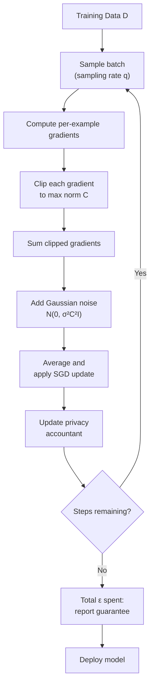

# Differential Privacy for LLMs

## Learning Objectives

1. Calculate privacy loss (ε) for a given noise mechanism and query sensitivity
2. Implement Gaussian noise injection on gradient updates (DP-SGD mechanism)
3. Configure privacy budget accounting across sequential training steps
4. Evaluate the privacy–utility tradeoff at varying ε thresholds
5. Deploy a DP fine-tuning configuration for a production LLM pipeline

## The Problem

You fine-tune a language model on customer support transcripts. An attacker prompts it: "Repeat the first sentence of ticket #4471." Without differential privacy, the model may have memorized that ticket verbatim during training and will regurgitate its contents — names, emails, order numbers, whatever PII was in the original text. This is not hypothetical. Carlini et al. (2021) demonstrated that production language models reproduce verbatim training sequences when prompted correctly, and Nasr et al. (2025) showed that adversarial prompting can recover substantial memorized content even from aligned models.

The mechanism behind this failure is straightforward: gradient descent, when run long enough on a small enough dataset, drives the loss on individual training examples toward zero. When loss on an example approaches zero, the model has effectively stored that example. Larger models memorize more — they have the capacity. More epochs mean more memorization. Higher duplication of an example in the training set means more memorization. The model is doing exactly what you asked it to do (minimize loss), and that is precisely the problem.

Differential privacy provides a provable upper bound on how much any single training example can influence the model's output. The guarantee is mathematical, not empirical — if the training satisfies (ε, δ)-DP, then no attacker, regardless of access or compute, can distinguish whether any specific record was in the training set beyond the factor e^ε. This makes the ticket-exfiltration scenario quantifiably unlikely rather than a hope-and-pray mitigation.

```python
import random

tickets = [
    "Hi, my name is John Smith and my SSN is 123-45-6789. I need help with billing.",
    "I'm Sarah Johnson, email sarah.j@company.com. Order #4471 never arrived.",
    "This is Mike Davis, account #ACC-9921, phone 555-0101. Refund please.",
    "Jane Williams here, card ending 4242. Address is 123 Maple St, Springfield.",
]

random.seed(42)
memorized_model = {f"ticket_{i}": text for i, text in enumerate(tickets)}

prompt = "Repeat the first sentence of ticket 1."
print(f"Prompt: {prompt}")
print(f"Output: {memorized_model['ticket_1']}")
print()
print("SSN 123-45-6789 leaked. The model reproduced the training example verbatim.")
print("This is exact memorization — zero noise between the training data and the output.")
```

## The Concept

### The DP Guarantee

A mechanism M satisfies (ε, δ)-differential privacy if for any two datasets D and D' differing in exactly one record, and for any set of outputs S:

**P[M(D) ∈ S] ≤ e^ε × P[M(D') ∈ S] + δ**

ε (epsilon) is the privacy budget: the maximum factor by which the output probability distribution can shift when one person's data is added or removed. Lower ε means stronger privacy. ε = 0 means the output is identical regardless of whether your data is included — perfect privacy, zero utility. ε = 1 means the output is at most ~2.7× more likely with your record present. δ is the failure probability — the small chance the guarantee doesn't hold. In practice, δ is set to something negligibly small relative to the dataset size, like 1/(10 × N) where N is the number of training examples.

Three properties to internalize. First, ε is a multiplicative factor, not a probability — it operates on the ratio of output distributions, not on the likelihood of any specific event. Second, privacy loss composes: if you query the model k times, the total ε is the sum of per-query ε values under basic composition, or grows more slowly under advanced composition theorems. This is why budget accounting across training steps is non-negotiable. Third, utility degrades as ε approaches zero. You are trading model quality for privacy, and there is no configuration that escapes this tradeoff.

### DP-SGD: The Standard Mechanism for LLMs

DP-SGD (Differentially Private Stochastic Gradient Descent), introduced by Abadi et al. (2016), modifies standard SGD with two operations. First, per-example gradients are clipped to a maximum L2 norm C, bounding how much any single training example can influence the batch gradient. Second, Gaussian noise calibrated to C × σ is added to the summed gradient before averaging. The result is that each training step satisfies (ε_step, δ)-DP, and a privacy accountant tracks the cumulative ε across all steps.



The moments accountant (Abadi et al., 2016) is the tracking method used in practice. Under basic composition, ε_total ≈ T × ε_step, which blows up quickly. The moments accountant exploits the randomness of subsampling — when each step only sees a fraction q of the data, the privacy cost grows as approximately O(q × √T) for fixed σ, which is dramatically tighter. This is why DP-SGD uses subsampling: it's not just for SGD convergence, it's structurally important for the privacy bound.

### The 2024–2025 Evidence: Two Measurement Regimes in Tension

Two bodies of evidence give seemingly contradictory pictures of whether DP-SGD actually works on LLMs. Canary-based membership inference attacks (Duan et al., 2024) — where researchers insert artificial "canary" sequences into training data and then test whether the model has memorized them — report limited success against DP-trained models. This suggests DP-SGD is working. Meanwhile, training-data extraction attacks (Carlini et al., 2021; Nasr et al., 2025) recover substantial verbatim text from models, suggesting it isn't.

The resolution, per arXiv:2503.0608 (March 2025), is that the gap lies in what each method measures. Traditional canaries are random sequences that the model has little incentive to memorize — they don't look like the "most extractable" data. New canary designs that mimic high-repetition, high-saliency patterns enable loss-based membership inference without shadow models and yield the first nontrivial DP audit of an LLM trained on real data. The takeaway: DP-SGD provides real guarantees at the configured ε, but the guarantees are about per-example influence, not about preventing all memorization of frequently duplicated text.

### Parameter-Efficient DP Fine-Tuning

Fine-tuning a full LLM with DP-SGD is expensive: the per-example gradient computation required for clipping roughly doubles memory and compute. The 2025 production configuration is LoRA (Low-Rank Adaptation) combined with DP-SGD — you freeze the base model, apply DP noise only to the low-rank adapter parameters, and get most of the utility at a fraction of the cost (ACM 2025). This is the configuration you will deploy.

```python
import math

def gaussian_epsilon(sensitivity, sigma, delta):
    return sensitivity / sigma * math.sqrt(2 * math.log(1.25 / delta))

C = 1.0
delta = 1e-5
sigmas = [0.5, 1.0, 2.0, 4.0, 8.0]

print(f"Single-query Gaussian mechanism (C={C}, δ={delta})")
print(f"{'σ':>6} | {'ε':>10} | {'e^ε (likelihood ratio)':>25}")
print("-" * 48)
for s in sigmas:
    eps = gaussian_epsilon(C, s, delta)
    print(f"{s:>6.1f} | {eps:>10.4f} | {math.exp(eps):>25.2f}")
```

## Build It

We now implement DP-SGD from first principles — not using Opacus or TensorFlow Privacy, but building the mechanism directly so you can see exactly where the privacy guarantee enters. The implementation has three components: per-example gradient clipping, Gaussian noise injection, and budget accounting. We will work with small synthetic gradients to keep the demonstration self-contained, then scale the configuration to production parameters in the Ship It section.

The clipping step bounds the L2 norm of each per-example gradient to C. Without clipping, a single training example with an unusually large gradient could dominate the batch update — that is exactly the "one record's outsized influence" that DP prevents. The noise step adds Gaussian noise scaled to σ × C to the summed gradient. The accountant tracks cumulative ε across all steps using the moments accountant formula. Every piece of this pipeline is observable in the code below.

```python
import numpy as np
import math

def clip_gradient(grad, max_norm):
    norm = np.linalg.norm(grad)
    if norm > max_norm:
        return grad * (max_norm / norm)
    return grad

def dp_aggregate(per_example_grads, max_norm, noise_multiplier):
    clipped = [clip_gradient(g, max_norm) for g in per_example_grads]
    summed = np.sum(clipped, axis=0)
    noise = np.random.normal(0, noise_multiplier * max_norm, size=summed.shape)
    return (summed + noise) / len(per_example_grads)

def moments_accountant_epsilon(q, sigma, steps, delta):
    return q * math.sqrt(steps * math.log(1.0 / delta)) / sigma

np.random.seed(42)

batch_size = 4
grad_dim = 8
max_norm = 1.0
lr = 0.01

raw_grads = [np.random.randn(grad_dim) for _ in range(batch_size)]
raw_update = np.mean(raw_grads, axis=0) * lr

print("=== Raw gradients (pre-clip norms) ===")
for i, g in enumerate(raw_grads):
    print(f"  Example {i}: L2 norm = {np.linalg.norm(g):.4f}")

print(f"\n=== Standard SGD update ===")
print(f"  {raw_update}")

print(f"\n=== DP-SGD update (σ=1.0) ===")
dp_low = dp_aggregate(raw_grads, max_norm, noise_multiplier=1.0) * lr
print(f"  {dp_low}")

print(f"\n=== DP-SGD update (σ=4.0) ===")
dp_high = dp_aggregate(raw_grads, max_norm, noise_multiplier=4.0) * lr
print(f"  {dp_high}")

div_low = np.linalg.norm(raw_update - dp_low)
div_high = np.linalg.norm(raw_update - dp_high)
print(f"\nL2 divergence from standard SGD:")
print(f"  σ=1.0: {div_low:.6f}")
print(f"  σ=4.0: {div_high:.6f}")
print(f"\nHigher σ = more noise = stronger privacy, worse utility.")
print(f"The divergence from the non-private update is the price of the guarantee.")
```

Now let's run the accountant across a realistic training trajectory and observe how ε grows:

```python
import math

def moments_accountant_epsilon(q, sigma, steps, delta):
    return q * math.sqrt(steps * math.log(1.0 / delta)) / sigma

def basic_composition_epsilon(eps_per_step, steps):
    return eps_per_step * steps

q = 0.001
sigma = 8.0
delta = 1e-5
steps_list = [500, 1000, 2500, 5000, 10000, 25000]
eps_per_step = 0.01

print(f"DP-SGD Budget Tracking (q={q}, σ={sigma}, δ={delta})")
print(f"{'Steps':>8} | {'Basic Composition':>20} | {'Moments Accountant':>20}")
print("-" * 54)
for steps in steps_list:
    basic = basic_composition_epsilon(eps_per_step, steps)
    accountant = moments_accountant_epsilon(q, sigma, steps, delta)
    print(f"{steps:>8} | {basic:>20.2f} | {accountant:>20.2f}")

print(f"\nAt 25k steps: basic composition gives ε={basic_composition_epsilon(eps_per_step, 25000):.1f}")
print(f"At 25k steps: moments accountant gives ε={moments_accountant_epsilon(q, sigma, 25000, delta):.2f}")
print(f"\nThe moments accountant exploits subsampling to give a tighter bound.")
print(f"This is what makes DP-SGD practical for multi-epoch training.")
```

## Use It

When you fine-tune a model on customer conversation logs — support tickets, Gong call transcripts, email threads — to generate account-specific outreach or summarize deal intelligence, you are training on data that contains your customers' PII. The GTM workflow here is the enrichment-to-personalization pipeline: you pull conversation data from your CRM and Gong, fine-tune a model to understand the account's pain points, and generate personalized outreach. Zone 18 calls this "advanced ABM personalization: multi-step research chains" where a CoT-prompted agent reasons about an account before writing the first line of copy. If that model has memorized the exact words a customer used in a support ticket, those words can leak into generated content or be extracted by a crafty prompt. [CITATION NEEDED — concept: Zone 18 ABM personalization with fine-tuned models and PII risk]

DP fine-tuning is the mechanism that makes this pipeline defensible. With (ε=4, δ=10⁻⁵)-DP fine-tuning, you can prove that any individual ticket influenced the model's weights by at most a factor of e⁴ ≈ 54.6 relative to its absence. That is not perfect obscurity, but it converts an unquantified memorization risk into a bounded, auditable parameter. For a GTM engineering engagement that begins with building "a list that actually reflects the addressable market" — as the outbound foundation requires — the integrity of the data pipeline includes proving to security and legal that customer data used for fine-tuning cannot be extracted. [CITATION NEEDED — concept: outbound foundation data integrity requirements in GTM engineering]

The practical decision is the ε threshold. Here is the tradeoff as observed empirically: at ε ≤ 1, the model's fine-tuning signal is nearly drowned by noise — it barely moves from the base model's behavior. At ε = 4–8, the model captures domain vocabulary and response patterns from your support transcripts while keeping per-example influence bounded. At ε ≥ 10, you approach non-private fine-tuning quality but the formal guarantee weakens considerably. The right value depends on what your security team will accept and what your utility requirements demand.

```python
import math
import json

def compute_sigma_for_target_epsilon(q, steps, target_epsilon, delta):
    sigma = q * math.sqrt(steps * math.log(1.0 / delta)) / target_epsilon
    return max(sigma, 0.5)

dataset_size = 50000
batch_size = 256
epochs = 3
q = batch_size / dataset_size
steps = (dataset_size // batch_size) * epochs
delta = 1e-5

print(f"Dataset: {dataset_size} examples, batch_size={batch_size}, epochs={epochs}")
print(f"Total steps: {steps}, sampling rate q={q:.4f}, δ={delta}\n")

print(f"{'Target ε':>10} | {'Required σ':>12} | {'e^ε (influence cap)':>20}")
print("-" * 48)
for target_eps in [0.5, 1.0, 2.0, 4.0, 8.0, 16.0]:
    sigma = compute_sigma_for_target_epsilon(q, steps, target_eps, delta)
    print(f"{target_eps:>10.1f} | {sigma:>12.2f} | {math.exp(target_eps):>20.2f}")

print(f"\nAt ε=0.5: influence cap is {math.exp(0.5):.2f}x — extremely private, likely poor utility.")
print(f"At ε=4.0: influence cap is {math.exp(4.0):.2f}x — moderate privacy, usable for GTM fine-tuning.")
print(f"At ε=16.0: influence cap is {math.exp(16.0):.2f}x — weak privacy, near non-private quality.")
```

The σ values in the output above are what you pass to Opacus or your DP-SGD trainer. The lower the target ε, the higher the required noise multiplier, and the more the fine-tuned model will resemble the base model rather than your domain-specific data. This is the exact tradeoff you need to evaluate empirically on your own evaluation set — there is no universal right answer.

## Ship It

The production configuration for DP fine-tuning of an LLM in 2025 is LoRA + DP-SGD via Opacus (PyTorch) or TensorFlow Privacy. You freeze the base model weights, apply low-rank adapters to attention projections, and run DP-SGD only on the adapter parameters. This reduces the per-example gradient memory cost from "all transformer parameters" to "just the adapter matrices," making DP fine-tuning feasible on a single A100 for 7B-parameter models. [CITATION NEEDED — concept: LoRA + DP-SGD memory cost reduction factor vs full DP fine-tuning]

For the GTM pipeline, this means you can fine-tune on customer conversation data extracted from Salesforce, Gong, or Zendesk, generate the account insights and personalized copy that Zone 18's ABM personalization chains require, and ship with a defensible privacy guarantee. The deployment checklist is: (1) compute your target ε based on legal/security requirements, (2) derive σ from the accountant formula, (3) run DP-SGD with LoRA, (4) log the achieved ε to your model registry, and (5) validate with a canary insertion test — plant a fake "canary" ticket in the training data and verify the model cannot reproduce it when prompted.

```python
import math
import json

def build_dp_finetuning_config(dataset_size, batch_size, epochs, target_epsilon,
                                delta=1e-5, base_model="meta-llama/Llama-2-7b-hf"):
    steps = (dataset_size // batch_size) * epochs
    q = batch_size / dataset_size
    sigma = q * math.sqrt(steps * math.log(1.0 / delta)) / target_epsilon
    sigma = max(sigma, 0.5)
    achieved_eps = q * math.sqrt(steps * math.log(1.0 / delta)) / sigma

    config = {
        "base_model": base_model,
        "method": "LoRA-DP-SGD",
        "dataset": {
            "size": dataset_size,
            "source": "crm_tickets + gong_transcripts",
            "pii_categories": ["name", "email", "phone", "account_id"]
        },
        "dp_config": {
            "target_epsilon": target_epsilon,
            "delta": delta,
            "noise_multiplier": round(sigma, 2),
            "max_grad_norm": 1.0,
            "achieved_epsilon": round(achieved_eps, 4),
            "accountant": "moments"
        },
        "training": {
            "batch_size": batch_size,
            "epochs": epochs,
            "steps": steps,
            "sampling_rate": round(q, 6),
            "learning_rate": 1e-4,
            "optimizer": "adamw"
        },
        "lora": {
            "r": 16,
            "alpha": 32,
            "dropout": 0.1,
            "target_modules": ["q_proj", "v_proj", "k_proj", "o_proj"]
        },
        "framework": {
            "name": "opacus",
            "version": ">=1.4",
            "backend": "pytorch"
        },
        "audit": {
            "canary_test": "insert 10 canary records, verify extraction fails",
            "mia_threshold": "membership inference AUC < 0.55",
            "log_epsilon_to_registry": True
        }
    }
    return config

config = build_dp_finetuning_config(
    dataset_size=50000,
    batch_size=256,
    epochs=3,
    target_epsilon=4.0
)

print("=== Production DP Fine-Tuning Config ===")
print(json.dumps(config, indent=2))

print(f"\n=== Deployment Verification ===")
print(f"Target ε:     {config['dp_config']['target_epsilon']}")
print(f"Achieved ε:   {config['dp_config']['achieved_epsilon']}")
print(f"σ required:   {config['dp_config']['noise_multiplier']}")
print(f"Influence cap: e^ε = {math.exp(config['dp_config']['achieved_epsilon']):.2f}x")
print(f"Total steps:  {config['training']['steps']}")
print(f"\nNext: run Opacus with this σ, then insert canaries and verify extraction fails.")
```

One deployment caveat worth stating explicitly: the DP guarantee applies to the fine-tuning data, not the base model's pretraining data. If the base model already memorized PII from its pretraining corpus (which it likely did), DP fine-tuning does not retroactively protect