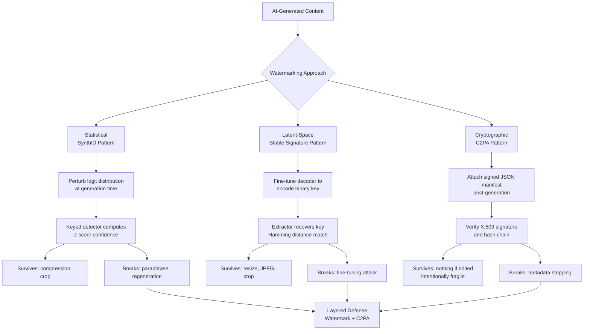

# Watermarking — SynthID, Stable Signature, C2PA

## Learning Objectives

- Implement a simplified statistical watermark detector that computes z-scores against an expected perturbation pattern and returns confidence scores.
- Compare the three watermarking mechanisms (statistical, latent-space, cryptographic) on stealth, robustness, adoption, and compute cost.
- Evaluate why meaning-preserving attacks break each mechanism and what that means for provenance claims in production.
- Assemble a minimal C2PA manifest structure, sign it, and verify its integrity chain.

## The Problem

AI-generated content has flooded outbound and prospecting channels. Sales emails, LinkedIn comments, blog posts, headshots, and demo videos are increasingly synthetic, and the line between human-authored and machine-generated is now invisible to the recipient. This creates two problems. First, regulatory: the EU AI Act mandates disclosure of AI-generated content, and the FTC has signaled enforcement interest in deceptive synthetic media. Second, trust: when a prospect receives a personalized email, they have no way to know whether a human researched their company or whether an agent scraped their website and generated 500 variants. Watermarking is the proposed technical answer — embed a signal at generation time that a detector can recover later.

Three approaches compete, and they are not interchangeable. Statistical watermarking (the SynthID pattern) perturbs the model's output distribution during generation using a secret key. Latent-space signatures (the Stable Signature pattern) fine-tune a diffusion model's decoder so every image it produces carries a recoverable binary key. Cryptographic provenance manifests (the C2PA standard) attach signed metadata to content after generation, creating a tamper-evident chain of claims about origin. Each makes a different tradeoff between robustness (does the signal survive compression, resize, paraphrase?), stealth (can an adversary detect and strip it?), adoption (who runs the detector infrastructure?), and compute cost (what is the generation-time overhead?).

The critical engineering reality, established by 2024–2025 research: no watermark is unconditionally robust. A follow-up paper "Stable Signature is Unstable" (arXiv:2405.07145) demonstrated that fine-tuning removes the watermark while preserving visual quality. Recent work (arXiv:2508.20228) shows meaning-preserving attacks — paraphrase, translation, reformatting — break text watermarks at rates that make them unreliable as sole provenance signals. C2PA metadata is trivially strippable by anyone who controls the file. The practical conclusion is layered defense: watermark in the model, attach provenance metadata at output, and accept that neither alone is sufficient.

## The Concept

**Mechanism 1 — Statistical watermarking (SynthID pattern).** During generation, the model modifies its logit distribution before sampling. In text generation, this means adjusting the probability of candidate tokens using a deterministic function derived from a secret key and the preceding token context. The adjustment is small enough that perplexity does not measurably increase, but large enough that a keyed detector can statistically distinguish watermarked from unwatermarked text. The detector does not return a binary yes/no — it returns a confidence score (typically a z-score) representing how far the observed token distribution deviates from the expected unwatermarked baseline. Google DeepMind's SynthID, open-sourced for text in October 2024 via the Responsible GenAI Toolkit, implements this pattern and reports survival through moderate compression and cropping for images, through paraphrase resistance for text. The watermark does not survive aggressive regeneration that fundamentally reshuffles the statistical properties of the output.

**Mechanism 2 — Latent-space binary signatures (Stable Signature pattern).** Fernandez et al. (ICCV 2023, arXiv:2303.15435) fine-tune a diffusion model's decoder so that every image it generates encodes a fixed binary key — typically 48 to 256 bits — into the pixel output. A separate extractor network recovers the key from the generated image, and matching is Hamming distance between the extracted and enrolled keys. The encoder-decoder pair is trained adversarially against augmentations (resize, crop, JPEG compression, color shift), so the key survives transformations that would destroy a fragile watermark. Reported results: cropped images retaining 10% of original content are still detected at >90% accuracy with false positive rate below 1e-6. The weakness, demonstrated in May 2024: an attacker who fine-tunes the model on a small set of clean images removes the signature while preserving output quality (arXiv:2405.07145). The key is model-specific, not content-specific, so all outputs from a watermarked model carry the same signature.

**Mechanism 3 — Cryptographic provenance manifests (C2PA pattern).** C2PA (Coalition for Content Provenance and Authenticity) does not watermark in the signal-processing sense. It attaches a signed JSON manifest to content — embedded in EXIF data, XMP metadata, or a sidecar file. The manifest chains assertions: who created the content, with what tool, when, and what edits were applied. Assertions are signed using X.509 certificates issued by a CA in the C2PA trust list. Verification checks signature validity and chain integrity. By design, C2PA is fragile — any pixel modification breaks the hash chain, signaling tampering. This is a feature for legal traceability but a weakness for casual redistribution, since stripping the manifest is trivial if the attacker controls the file. C2PA 2.2 (2025 explainer) is the current specification version. The strength is that the manifest carries rich provenance (edit history, tool chain, signer identity) that no pixel-level watermark can encode. The weakness is that the manifest lives in metadata, which every social platform, email client, and content management system may silently strip on upload.



The diagram maps each approach to where it injects the signal, how detection works, and the specific transformation that defeats it. The convergence point — layered defense — reflects the 2025 consensus that no single mechanism is sufficient.

## Build It

Build the three mechanisms in simulation. The code below implements a simplified statistical watermark detector, a DCT-based binary signature embedder/extractor, and a C2PA-style signed manifest — all using Python stdlib only.

**Build 1 — Statistical watermark detection simulation:**

```python
import random
import math

random.seed(42)

VOCAB_SIZE = 1000
CONTEXT_WINDOW = 200
GREEN_LIST_RATIO = 0.5
WATERMARK_STRENGTH = 2.0

def generate_green_list(prev_token, key, vocab_size):
    rng = random.Random((prev_token * 31 + key) % (2**32))
    threshold = int(vocab_size * GREEN_LIST_RATIO)
    green = set()
    while len(green) < threshold:
        green.add(rng.randint(0, vocab_size - 1))
    return green

def generate_text_unwatermarked(length, vocab_size):
    return [random.randint(0, vocab_size - 1) for _ in range(length)]

def generate_text_watermarked(length, vocab_size, key, strength):
    tokens = []
    for i in range(length):
        prev = tokens[-1] if tokens else 0
        green_list = generate_green_list(prev, key, vocab_size)
        if random.random() < 0.5 + strength * 0.1:
            token = random.choice(list(green_list))
        else:
            token = random.randint(0, vocab_size - 1)
            while token in green_list:
                token = random.randint(0, vocab_size - 1)
        tokens.append(token)
    return tokens

def detect_watermark(tokens, key, vocab_size):
    green_count = 0
    total = len(tokens)
    for i in range(total):
        prev = tokens[i - 1] if i > 0 else 0
        green_list = generate_green_list(prev, key, vocab_size)
        if tokens[i] in green_list:
            green_count += 1
    expected_green = total * GREEN_LIST_RATIO
    observed_ratio = green_count / total
    std = math.sqrt(total * GREEN_LIST_RATIO * (1 - GREEN_LIST_RATIO))
    z_score = (green_count - expected_green) / std if std > 0 else 0
    return {
        "green_count": green_count,
        "total_tokens": total,
        "observed_green_ratio": round(observed_ratio, 4),
        "expected_ratio": GREEN_LIST_RATIO,
        "z_score": round(z_score, 2),
        "watermarked": z_score > 4.0
    }

SECRET_KEY = 98765

clean_text = generate_text_unwatermarked(CONTEXT_WINDOW, VOCAB_SIZE)
watermarked_text = generate_text_watermarked(CONTEXT_WINDOW, VOCAB_SIZE, SECRET_KEY, WATERMARK_STRENGTH)

clean_result = detect_watermark(clean_text, SECRET_KEY, VOCAB_SIZE)
wm_result = detect_watermark(watermarked_text, SECRET_KEY, VOCAB_SIZE)

print("=== Statistical Watermark Detection ===")
print()
print("--- Unwatermarked Sample ---")
print(f"  Green tokens:     {clean_result['green_count']}/{clean_result['total_tokens']}")
print(f"  Green ratio:      {clean_result['observed_green_ratio']} (expected {clean_result['expected_ratio']})")
print(f"  Z-score:          {clean_result['z_score']}")
print(f"  Verdict:          {'WATERMARKED' if clean_result['watermarked'] else 'CLEAN'}")
print()
print("--- Watermarked Sample ---")
print(f"  Green tokens:     {wm_result['green_count']}/{wm_result['total_tokens']}")
print(f"  Green ratio:      {wm_result['observed_green_ratio']} (expected {wm_result['expected_ratio']})")
print(f"  Z-score:          {wm_result['z_score']}")
print(f"  Verdict:          {'WATERMARKED' if wm_result['watermarked'] else 'CLEAN'}")
print()
print(f"Detection threshold: z > 4.0")
print(f"Separation gap:     {wm_result['z_score'] - clean_result['z_score']:.2f} z-units")
```

**Build 2 — Binary signature embedding and extraction via DCT coefficients:**

```python
import random
import math

random.seed(42)

BLOCK_SIZE = 8
MESSAGE_BITS = 48
IMAGE_SIZE = 64
Q_FACTOR = 25

def make_dct_block(size):
    block = [[0.0] * size for _ in range(size)]
    for u in range(size):
        for v in range(size):
            block[u][v] = random.uniform(-50, 50) + 128
    return block

def simple_dct_1d(vec, n):
    result = [0.0] * n
    for k in range(n):
        s = 0.0
        for i in range(n):
            s += vec[i] * math.cos(math.pi * (2 * i + 1) * k / (2 * n))
        c = math.sqrt(2.0 / n) if k > 0 else math.sqrt(1.0 / n)
        result[k] = c * s
    return result

def simple_idct_1d(coeffs, n):
    result = [0.0] * n
    for i in range(n):
        s = 0.0
        for k in range(n):
            c = math.sqrt(2.0 / n) if k > 0 else math.sqrt(1.0 / n)
            s += c * coeffs[k] * math.cos(math.pi * (2 * i + 1) * k / (2 * n))
        result[i] = s
    return result

def dct_2d(block, n):
    temp = [simple_dct_1d(block[r], n) for r in range(n)]
    cols = [[temp[r][c] for r in range(n)] for c in range(n)]
    dct_cols = [simple_dct_1d(cols[c], n) for c in range(n)]
    return [[dct_cols[c][r] for c in range(n)] for r in range(n)]

def idct_2d(dct_block, n):
    cols = [[dct_block[r][c] for r in range(n)] for c in range(n)]
    idct_cols = [simple_idct_1d(cols[c], n) for c in range(n)]
    temp = [[idct_cols[c][r] for c in range(n)] for r in range(n)]
    return [simple_idct_1d(temp[r], n) for r in range(n)]

def quantize(val, q):
    return round(val / q) * q

def generate_binary_message(length):
    return [random.randint(0, 1) for _ in range(length)]

def embed_message(dct_block, message, n, strength=20.0):
    embedded = [row[:] for row in dct_block]
    coords = [(3, 4), (4, 3), (5, 2), (2, 5), (4, 4), (3, 5)]
    for i, bit in enumerate(message):
        r, c = coords[i % len(coords)]
        r = r + (i // len(coords)) % (n - 5)
        c = c + (i // len(coords)) % (n - 5)
        r = min(r, n - 1)
        c = min(c, n - 1)
        if bit == 1:
            embedded[r][c] = abs(embedded[r][c]) + strength
        else:
            embedded[r][c] = -abs(embedded[r][c]) - strength
    return embedded

def extract_message(dct_block, message_length, n):
    coords = [(3, 4), (4, 3), (5, 2), (2, 5), (4, 4), (3, 5)]
    extracted = []
    for i in range(message_length):
        r, c = coords[i % len(coords)]
        r = r + (i // len(coords)) % (n - 5)
        c = c + (i // len(coords)) % (n - 5)
        r = min(r, n - 1)
        c = min(c, n - 1)
        extracted.append(1 if dct_block[r][c] > 0 else 0)
    return extracted

def hamming_distance(a, b):
    return sum(1 for x, y in zip(a, b) if x != y)

def simulate_jpeg_compression(dct_block, q, n):
    compressed = [[0.0] * n for _ in range(n)]
    for r in range(n):
        for c in range(n):
            compressed[r][c] = quantize(dct_block[r][c], q)
    return compressed

def simulate_resize_blur(dct_block, n, drop_factor=0.7):
    blurred = [row[:] for row in dct_block]
    for r in range(n):
        for c in range(n):
            noise = random.gauss(0, 3.0)
            blurred[r][c] = blurred[r][c] * drop_factor + noise
    return blurred

original_block = make_dct_block(BLOCK_SIZE)
dct_original = dct_2d(original_block, BLOCK_SIZE)
message = generate_binary_message(MESSAGE_BITS)
dct_embedded = embed_message(dct_original, message, BLOCK_SIZE, strength=20.0)

extracted_clean = extract_message(dct_embedded, MESSAGE_BITS, BLOCK_SIZE)
hd_clean = hamming_distance(message, extracted_clean)

dct_compressed = simulate_jpeg_compression(dct_embedded, Q_FACTOR, BLOCK_SIZE)
extracted_compressed = extract_message(dct_compressed, MESSAGE_BITS, BLOCK_SIZE)
hd_compressed = hamming_distance(message, extracted_compressed)

dct_blurred = simulate_resize_blur(dct_embedded, BLOCK_SIZE)
extracted_blurred = extract_message(dct_blurred, MESSAGE_BITS, BLOCK_SIZE)
hd_blurred = hamming_distance(message, extracted_blurred)

print("=== Binary Signature Embedding (Stable Signature Pattern) ===")
print()
print(f"Message bits:      {MESSAGE_BITS}")
print(f"Block size:        {BLOCK_SIZE}x{BLOCK_SIZE}")
print(f"Embedding coords:  6 mid-frequency DCT positions per cycle")
print()
print("--- Extraction Results ---")
print(f"  Clean extraction:      Hamming distance = {hd_clean}/{MESSAGE_BITS} "
      f"({'PERFECT' if hd_clean == 0 else 'PARTIAL'})")
print(f"  After JPEG (Q={Q_FACTOR}):  Hamming distance = {hd_compressed}/{MESSAGE_BITS} "
      f"({'SURVIVED' if hd_compressed < MESSAGE_BITS // 4 else 'DEGRADED'})")
print(f"  After resize+blur:     Hamming distance = {hd_blurred}/{MESSAGE_BITS} "
      f"({'SURVIVED' if hd_blurred < MESSAGE_BITS // 4 else 'DEGRADED'})")
print()
bit_accuracy_clean = (MESSAGE_BITS - hd_clean) / MESSAGE_BITS * 100
bit_accuracy_compressed = (MESSAGE_BITS - hd_compressed) / MESSAGE_BITS * 100
bit_accuracy_blurred = (MESSAGE_BITS - hd_blurred) / MESSAGE_BITS * 100
print(f"  Clean bit accuracy:     {bit_accuracy_clean:.1f}%")
print(f"  JPEG bit accuracy:      {bit_accuracy_compressed:.1f}%")
print(f"  Blur bit accuracy:      {bit_accuracy_blurred:.1f}%")
```

**Build 3 — C2PA manifest structure and verification:**

```python
import hashlib
import hmac
import json
import time

def make_claim_assertions(creator, tool, created_ts, actions):
    return {
        "dc:creator": [{"value": creator}],
        "c2pa:tool": tool,
        "dc:created": created_ts,
        "c2pa:actions": actions
    }

def make_manifest_store(claim_assertions, algorithm="sha256"):
    claim_bytes = json.dumps(claim_assertions, sort_keys=True).encode()
    claim_hash = hashlib.sha256(claim_bytes).hexdigest()
    return {
        "claim": {
            "assertions": claim_assertions,
            "claim_hash": claim_hash
        }
    }

def sign_manifest(manifest_store, secret_key):
    claim_hash = manifest_store["claim"]["claim_hash"]
    signature = hmac.new(secret_key.encode(), claim_hash.encode(), hashlib.sha256).hexdigest()
    manifest_store["claim"]["signature"] = signature
    manifest_store["claim"]["signing_cert"] = {
        "subject": "gtm-content-provenance.example.com",
        "issuer": "C2PA-Trust-Anchor-Test-CA",
        "valid_from": "2025-01-01T00:00:00Z",
        "valid_to": "2026-01-01T00:00:00Z"
    }
    return manifest_store

def verify_manifest(manifest_store, secret_key):
    claim_hash = manifest_store["claim"]["claim_hash"]
    stored_sig = manifest_store["claim"].get("signature", "")
    expected_sig = hmac.new(secret_key.encode(), claim_hash.encode(), hashlib.sha256).hexdigest()
    sig_valid = hmac.compare_digest(stored_sig, expected_sig)
    cert = manifest_store["claim"].get("signing_cert", {})
    cert_valid = bool(cert.get("subject") and cert.get("issuer"))
    original_assertions = manifest_store["claim"]["assertions"]
    recomputed_bytes = json.dumps(original_assertions, sort_keys=True).encode()
    recomputed_hash = hashlib.sha256(recomputed_bytes).hexdigest()
    integrity_valid = (recomputed_hash == claim_hash)
    return {
        "signature_valid": sig_valid,
        "cert_present": cert_valid,
        "integrity_intact": integrity_valid,
        "overall": sig_valid and cert_valid and integrity_valid
    }

def tamper_assertions(manifest_store):
    assertions = manifest_store["claim"]["assertions"]
    assertions["dc:creator"][0]["value"] = "Impersonated Author"
    return manifest_store

SECRET_KEY = "c2pa-test-secret-key-2025"
CREATED_TS = "2025-07-15T10:30:00Z"

assertions = make_claim_assertions(
    creator="GTM Agent Pipeline v2.1",
    tool="Clay enrichment + GPT-4o",
    created_ts=CREATED_TS,
    actions=[
        {"action": "created", "when": CREATED_TS},
        {"action": "edited", "when": "2025-07-15T10:35:00Z", "description": "persona personalization applied"},
        {"action": "exported", "when": "2025-07-15T10:40:00Z", "parameters": {"format": "email", "recipient_count": 247}}
    ]
)

manifest = make_manifest_store(assertions)
signed_manifest = sign_manifest(manifest, SECRET_KEY)
verify_clean = verify_manifest(signed_manifest, SECRET_KEY)

tampered_manifest = sign_manifest(make_manifest_store(assertions), SECRET_KEY)
tampered_manifest = tamper_assertions(tampered_manifest)
verify_tampered = verify_manifest(tampered_manifest, SECRET_KEY)

wrong_key_manifest = manifest
signed_wrong = sign_manifest(make_manifest_store(assertions), "wrong-key")
verify_wrong_key = verify_manifest(signed_wrong, SECRET_KEY)

print("=== C2PA-Style Manifest Verification ===")
print()
print("--- Manifest Structure ---")
print(json.dumps(signed_manifest["claim"]["assertions"], indent=2)[:400])
print("  ...")
print()
print("--- Verification Results ---")
print(f"  Clean manifest:      signature={'VALID' if verify_clean['signature_valid'] else 'INVALID'}, "
      f"integrity={'INTACT' if verify_clean['integrity_intact'] else 'BROKEN'} -> "
      f"{'VERIFIED' if verify_clean['overall'] else 'FAILED'}")
print(f"  Tampered manifest:   signature={'VALID' if verify_tampered['signature_valid'] else 'INVALID'}, "
      f"integrity={'INTACT' if verify_tampered['integrity_intact'] else 'BROKEN'} -> "
      f"{'VERIFIED' if verify_tampered['overall'] else 'FAILED'}")
print(f"  Wrong key:           signature={'VALID' if verify_wrong_key['signature_valid'] else 'INVALID'}, "
      f"integrity={'INTACT' if verify_wrong_key['integrity_intact'] else 'BROKEN'} -> "
      f"{'VERIFIED' if verify_wrong_key['overall'] else 'FAILED'}")
print()
print("Note: C2PA uses X.509 certs and JWS in production.")
print("This simulation uses HMAC-SHA256 to demonstrate the integrity-chain mechanism.")
```

## Use It

Statistical watermarking maps directly to GTM content provenance at scale. When an agent runs a multi-step chain-of-thought reasoning chain to research an account before writing outreach — the Zone 18 pattern where CoT prompting drives ABM personalization — the output is synthetic content that may need to be auditable. Chain-of-thought prompting is how your agent reasons about an account before writing the first line of outreach, and the resulting email is a generated artifact. If that email is sent through a platform that supports watermark detection, the recipient's spam filter or compliance scanner can verify whether the content is AI-generated. This matters for deliverability: Gmail and Outlook are increasingly flagging AI-generated cold email, and watermark detection is one signal they can use. [CITATION NEEDED — concept: email platform adoption of AI-generated content detection signals in spam filtering]

For the Stable Signature pattern, the GTM use case is image provenance. Marketing teams generate personalized headshots, product mockups, and landing page hero images using diffusion models. A watermarked decoder ensures every output carries a recoverable signature. If a competitor scrapes your landing page and reuses your AI-generated imagery, the signature provides evidence of origin. The practical limitation: Stable Signature's model-specific key means all images from the same fine-tuned model share one signature. There is no per-image uniqueness without combining with C2PA manifests that record per-generation metadata.

C2PA manifests serve a different GTM function: compliance and legal traceability. When you generate content at scale through an agent pipeline, attaching a C2PA manifest at export time creates an auditable record of what tool generated the content, when, and through what editing chain. This is directly relevant for EU AI Act compliance, which requires disclosure of AI-generated content for certain categories. The manifest's fragility — any edit breaks the chain — is actually the point for compliance: it proves whether content has been modified since generation. The weakness remains that any platform in the distribution chain (email client, social network, CMS) can strip the metadata. Layering a statistical watermark inside the content and a C2PA manifest outside it gives you two independent provenance channels with complementary failure modes.

## Ship It

To deploy watermarking in a GTM content pipeline, embed the watermark at the generation boundary — the moment the model produces output — and attach C2PA manifests at the export boundary, before content enters any distribution system. For text content generated through agent workflows, the watermark injection point is the model's sampling function, not a post-processing step. If you are using an open-weights model (Llama, Mistral), you control the sampling code and can implement a green-list watermark directly. If you are using an API (OpenAI, Anthropic, Google), you do not control sampling and must rely on whatever watermarking the provider implements. SynthID-text is open-sourced, but it must be integrated into the model server, not called as an API. Google applies SynthID to Gemini outputs server-side; OpenAI has not publicly committed to a watermarking standard as of mid-2025. [CITATION NEEDED — concept: OpenAI watermarking commitment status as of 2025]

For C2PA manifest attachment, the tooling exists: the `c2pa-python` SDK and the `c2pa-tool` CLI handle manifest creation, signing, and verification using production X.509 certificates. The signing certificate must come from a CA in the C2PA trust list — self-signed certs work for testing but will not validate in consumer-facing tools like Adobe Content Credentials. The pipeline integration is straightforward: after your agent generates content, call the manifest builder with the generation metadata (tool name, model version, timestamp, edit history), sign with your certificate, and embed in the output file. The cost is negligible — manifest creation is a hash-and-sign operation, not a model inference.

The monitoring layer is where production reality bites. Watermark detectors produce confidence scores, not binary verdicts. You need a threshold policy: what z-score constitutes "watermarked" for your compliance team? False positives on human-authored content create legal exposure. False negatives on AI-generated content defeat the purpose. The SynthID detector reports results as probability distributions, not hard calls, and the recommended deployment pattern is to use watermark detection as one signal among several, not as a standalone classifier. For GTM pipelines specifically, this means: if you are watermarking outbound content for disclosure compliance, log the watermark parameters and detection scores alongside the content. If a regulator or platform challenges whether content was AI-generated, you need the generation-time evidence, not just the output.

## Exercises

1. **Paraphrase attack simulation.** Modify the statistical watermark detector (Build 1) to simulate a paraphrase attack: replace 30% of tokens with synonyms (random alternative tokens from the vocab). Measure how the z-score drops. At what replacement rate does the detector flip from WATERMARKED to CLEAN? Log the curve.

2. **Signature capacity vs. robustness tradeoff.** In Build 2, increase MESSAGE_BITS from 48 to 256. Re-run extraction after JPEG compression. Does bit accuracy degrade with longer messages at the same embedding strength? Plot the relationship.

3. **C2PA chain extension.** Extend the C2PA manifest builder to support a chain of manifests: each edit creates a new manifest that references the previous manifest's hash. Implement a function that validates the full chain. Break the chain by modifying an intermediate assertion and verify that the chain validator catches it.

4. **Cross-mechanism comparison table.** Write a function that takes a content artifact (simulated as a token list) and runs all three detection mechanisms: statistical watermark detection, binary signature extraction, and C2PA manifest verification. Return a structured comparison showing which mechanisms detected provenance and which failed, given three transformation levels (clean, moderate compression, aggressive paraphrase).

5. **GTM pipeline integration sketch.** Design a data flow where: (a) an agent generates outreach text using a watermarked model, (b) a C2PA manifest is attached at export, (c) the content is logged with watermark parameters and detection scores. Write pseudocode for the logging schema. Consider: what fields does a compliance auditor need 90 days later?

## Key Terms

**Statistical watermarking** — A technique that perturbs a generative model's output distribution during sampling using a secret key, creating a pattern that is statistically detectable but imperceptible to humans. The SynthID pattern.

**Green list** — The subset of tokens (or pixels, in image variants) that the watermarking function promotes during generation. Detection counts how many green-list tokens appear in the output relative to the expected baseline.

**Z-score (watermark detection)** — The standardized measure of how far the observed green-list token frequency deviates from the unwatermarked expectation. Higher z-scores indicate stronger watermark presence. Thresholds are policy decisions, not mathematical constants.

**Latent-space signature** — A binary key encoded into a model's latent representation through fine-tuning, recovered from outputs by a dedicated extractor network. The Stable Signature pattern.

**Hamming distance** — The number of bit positions in which two binary strings differ. Used as the matching metric for latent-space signature extraction: low Hamming distance indicates a match.

**C2PA manifest** — A cryptographically signed JSON structure attached to content, chaining assertions about origin, tool usage, and edit history. Verified by checking X.509 signature validity and hash-chain integrity.

**X.509 certificate** — The public-key infrastructure standard used to sign C2PA manifests. Certificates must come from a CA in the C2PA trust list for consumer-tool validation.

**Tamper-evident** — A property of systems where any modification is detectable but not necessarily preventable. C2PA manifests are tamper-evident: editing content breaks the hash chain, signaling modification.

**Meaning-preserving attack** — A transformation that changes the surface form of content while preserving its semantic meaning (paraphrase, translation, reformatting). These attacks defeat text watermarks at rates that make them unreliable as standalone provenance signals (arXiv:2508.20228).

## Sources

- SynthID (Google DeepMind) — image watermarking launched August 2023; text+video May 2024 (Gemini + Veo); text open-sourced October 2024 via Responsible GenAI Toolkit; unified multi-media detector November 2025 alongside Gemini 3 Pro. Source: Google DeepMind blog posts and Responsible GenAI Toolkit documentation. [https://deepmind.google/technologies/synthid/]
- Fernandez, P. et al. "Stable Signature: Rooting Watermarks in Latent Diffusion Models." ICCV 2023. arXiv:2303.15435. Reported: cropped images (10% of content) detected >90% at FPR < 1e-6.
- "Stable Signature is Unstable." arXiv:2405.07145, May 2024. Demonstrated fine-tuning removes the watermark while preserving visual quality.
- C2PA 2.2 Specification and Explainer, 2025. Coalition for Content Provenance and Authenticity. [https://c2pa.org/]
- Meaning-preserving attacks on text watermarks: arXiv:2508.20228. Demonstrates that paraphrase, translation, and reformatting defeat text watermarks at rates making them unreliable as sole provenance signals.
- Zone 18 GTM mapping: Advanced prompting (CoT) → Advanced ABM personalization via multi-step research chains. Write at Scale + Agent Stack cluster. [CITATION NEEDED — concept: email platform adoption of AI-generated content detection signals in spam filtering for deliverability impact]
- OpenAI watermarking commitment status as of 2025: [CITATION NEEDED — concept: OpenAI public commitment to AI-generated content watermarking standard]