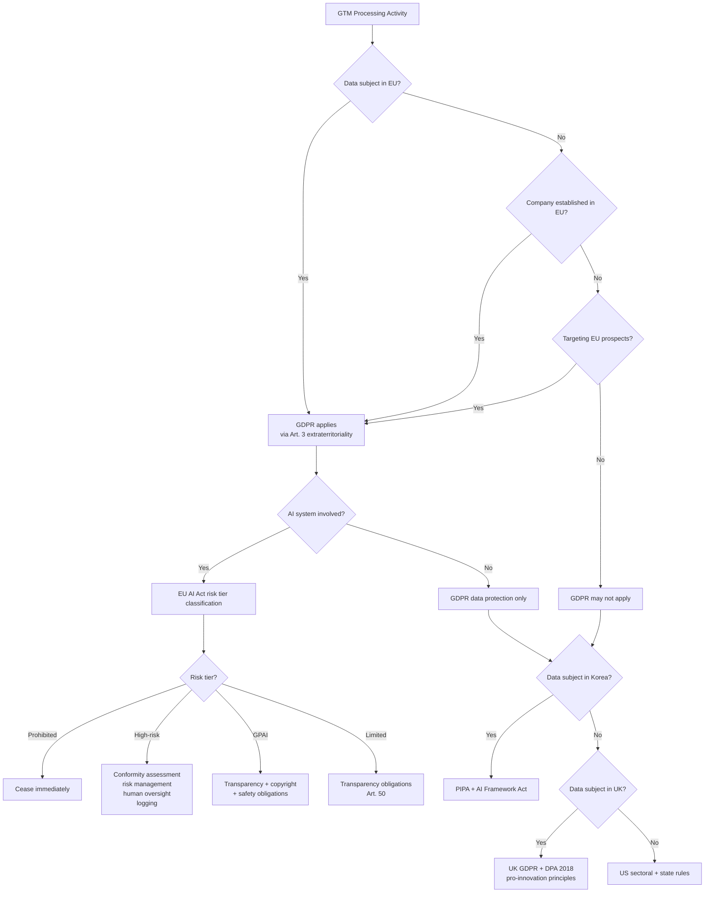

# Regulatory Frameworks — EU, US, UK, Korea

## Learning Objectives

- Classify a data processing activity against the EU AI Act's four risk tiers and state which obligations attach to each tier.
- Compare the extraterritoriality triggers in GDPR Article 3, Korea's PIPA, and the EU AI Act's market-placement logic.
- Map a GTM data pipeline (collection, enrichment, scoring, outreach) against lawful-basis requirements across all four jurisdictions.
- Implement a compliance decision function that takes a processing description and returns required actions per jurisdiction.
- Evaluate which 2025–2027 regulatory deadlines affect a given GTM system's deployment timeline.

## The Problem

Your GTM stack pulls prospect data from LinkedIn, enriches it through third-party APIs, scores it with a model, and sends automated outreach. Each step touches personal data. Four regulatory regimes — EU, US, UK, Korea — each have different rules about what "touches personal data" even means, when you need consent versus legitimate interest, and whether your ML scoring constitutes an automated decision the data subject can challenge.

The EU AI Act entered force on 1 August 2024. Its staged implementation rolls obligations across 2025, 2026, and 2027. Korea's AI Framework Act passed in December 2024 with an effective date of January 2026. The US has no comprehensive federal AI law, but the NIST AI Risk Management Framework and state-level privacy statutes (CCPA/CPRA, Colorado AI Act) create enforceable obligations. The UK rebranded its AI Safety Institute to the AI Security Institute in February 2025, narrowing scope from broad safety to security specifically — a signal that the UK's "pro-innovation" posture means fewer binding constraints, not zero.

For a GTM engineer, the practical problem is this: the same enrichment waterfall that is legal under US sectoral rules may violate GDPR's Article 6 lawful-basis requirement, may constitute a high-risk AI system under the EU AI Act if it evaluates individuals for employment relevance, and may require explicit consent under Korea's PIPA that is stricter than either EU or US frameworks. You need to know which regime applies, when, and what it requires — before you build the pipeline.

## The Concept

Four regulatory models. Four enforcement philosophies. One pipeline that has to satisfy all of them.

**The EU model** operates on rights-based precaution with extraterritorial reach. The EU AI Act uses a risk-tier structure: prohibited practices (social scoring, manipulative AI, real-time biometric identification in most cases), high-risk systems (AI used in employment, education, essential services, law enforcement), general-purpose AI models (with additional obligations for models with systemic risk), and limited-risk systems (transparency obligations only — chatbots, deepfakes, emotion recognition). The GPAI Code of Practice, published 10 July 2025, operationalizes these obligations across three chapters: Transparency, Copyright, and Safety & Security, with 12 total commitments. Enforcement begins August 2026. Penalties reach 15M EUR or 3% of global annual turnover, whichever is higher.

GDPR sits underneath the AI Act and operates independently. Article 3 extends GDPR's reach to any controller offering goods or services to EU data subjects or monitoring their behavior — regardless of where the controller is established. Article 6 defines six lawful bases for processing: consent, contract, legal obligation, vital interests, public task, and legitimate interests. Article 22 restricts solely automated decisions with legal or similarly significant effects. For GTM, Article 22 is the sleeper provision: if your ML scoring model determines whether a prospect gets outreach, and that outreach affects their access to employment opportunities, you may need human-in-the-loop review or explicit consent.



**The US model** fragments. There is no comprehensive federal AI statute. The NIST AI Risk Management Framework (AI RMF 1.0, January 2023) is voluntary guidance organized around four functions: Govern, Map, Measure, Manage. The US AI Safety Institute was rebranded to the Center for AI Standards and Innovation (CAISI) in June 2025 under NIST, signaling a shift toward pro-growth, standards-based rather than enforcement-based oversight. At the state level, California's CCPA/CPRA grants consumers rights to know, delete, and opt out of data sale and sharing. Colorado's AI Act (effective February 2026) requires developers and deployers of high-risk AI systems to exercise reasonable care to prevent algorithmic discrimination — the closest US analogue to the EU AI Act's high-risk tier. For GTM, the US model means compliance is jurisdictional: what's permissible in Texas may trigger obligations in California or Colorado.

**The UK model** sits between the EU and US. Post-Brexit, the UK retained GDPR domestically (UK GDPR, paired with the Data Protection Act 2018) but adopted a "pro-innovation" regulatory approach to AI. The UK's February 2025 rebrand from AI Safety Institute to AI Security Institute narrowed the institutional scope from broad AI safety to security-focused evaluation. The UK has no equivalent to the EU AI Act. Instead, existing regulators — the ICO for data protection, the FCA for financial services, the MHRA for medical devices — apply sector-specific AI principles within their domains. The practical result: UK GTM operations face GDPR-equivalent data protection rules but no horizontal AI Act obligations.

**Korea's model** combines structural GDPR alignment with stricter consent requirements. Korea's Personal Information Protection Act (PIPA), amended in 2023, aligns conceptually with GDPR but imposes consent obligations that go further — for example, requiring separate consent for each purpose of processing rather than bundled consent. The Korean AI Framework Act, passed December 2024 and effective January 2026, establishes an AI Safety Institute under the Ministry of Science and ICT (Article 12). It mandates local representatives for foreign AI companies operating in Korea, requires risk assessments for high-impact AI systems, and imposes safety measures for generative AI. For GTM, Korea means: if you're prospecting into Korean companies, PIPA's consent requirements govern your data collection, and if your enrichment or scoring uses AI classified as high-impact, the Framework Act adds obligations on top.

The enforcement timelines matter because they create transition windows. The EU AI Act's prohibited practices took effect 2 February 2025. GPAI transparency obligations apply from 2 August 2025. Full applicability — including Article 50 transparency requirements and high-risk system obligations — arrives 2 August 2026. Legacy GPAI models and high-risk AI embedded in regulated products have until 2 August 2027. If you are deploying a GTM AI system today, you need to know which deadline applies to which component.

## Build It

Let's build a regulatory scope determination function. Given a company's establishment, a data subject's location, and a processing activity, this function determines which regulatory frameworks apply and what obligations attach.

```python
REGULATIONS = {
    "GDPR": {
        "extraterritorial_triggers": [
            "offering_goods_or_services_to_eu",
            "monitoring_eu_behavior",
            "establishment_in_eu",
        ],
        "key_articles": {
            "art_6": "lawful basis required before processing",
            "art_22": "safeguards for solely automated decisions with significant effects",
            "art_13_14": "transparency obligations to data subject",
            "art_35": "DPIA required for high-risk processing",
        },
        "max_penalty": "20M EUR or 4% global annual turnover",
    },
    "EU_AI_ACT": {
        "risk_tiers": ["prohibited", "high_risk", "gpai", "limited_risk"],
        "timeline": {
            "2025-02-02": "prohibited practices and AI literacy",
            "2025-08-02": "GPAI transparency obligations",
            "2026-08-02": "full applicability including Art. 50",
            "2027-08-02": "legacy GPAI and embedded high-risk",
        },
        "max_penalty": "15M EUR or 3% global annual turnover",
    },
    "UK_GDPR": {
        "triggers": ["establishment_in_uk", "offering_goods_to_uk"],
        "key_provisions": {
            "DPA_2018": "Data Protection Act supplements UK GDPR",
            "ico_guidance": "sector-specific AI principles via ICO",
        },
        "max_penalty": "17.5M GBP or 4% global annual turnover",
        "ai_act_equivalent": None,
    },
    "PIPA": {
        "triggers": ["data_subject_in_korea"],
        "key_requirements": {
            "consent": "separate consent per processing purpose",
            "pseudonymization": "required for certain datasets",
            "overseas_transfer": "separate consent required",
        },
        "max_penalty": "3% of revenue related to violation",
    },
    "KOREA_AI_ACT": {
        "effective": "2026-01",
        "key_requirements": {
            "local_representative": "required for foreign AI companies",
            "risk_assessment": "required for high-impact AI",
            "safety_measures": "required for generative AI",
        },
        "max_penalty": "30M KRW or 3% revenue",
    },
    "US_STATE": {
        "applicable_laws": {
            "CCPA_CPRA": "California — opt-out, deletion, knowing rights",
            "COLORADO_AI_ACT": "effective 2026-02, anti-discrimination for high-risk AI",
        },
        "federal": "NIST AI RMF is voluntary, not enforceable",
    },
}


def determine_regulatory_scope(
    company_establishment,
    data_subject_locations,
    processing_activity,
    uses_ai=False,
    ai_risk_tier=None,
):
    applicable = []

    company_countries = [c.lower() for c in company_establishment]
    subject_countries = [c.lower() for c in data_subject_locations]

    eu_countries = [
        "germany", "france", "netherlands", "ireland", "spain",
        "italy", "poland", "sweden", "austria", "belgium",
    ]

    targets_eu = any(c in eu_countries for c in subject_countries)
    targets_uk = "uk" in subject_countries or "united kingdom" in subject_countries
    targets_korea = "korea" in subject_countries or "south korea" in subject_countries
    targets_us = "us" in subject_countries or "united states" in subject_countries
    established_eu = any(c in eu_countries for c in company_countries)

    if targets_eu or established_eu:
        obligations = {
            "regulation": "GDPR",
            "articles_triggered": [],
            "actions_required": [],
        }
        obligations["articles_triggered"].append("art_6")
        obligations["actions_required"].append("establish lawful basis before processing")

        if processing_activity in ["ml_scoring", "automated_ranking", "predictive_analytics"]:
            obligations["articles_triggered"].append("art_22")
            obligations["actions_required"].append(
                "implement human review or obtain explicit consent for automated decisions"
            )

        if processing_activity in ["large_scale_enrichment", "profiling"]:
            obligations["articles_triggered"].append("art_35")
            obligations["actions_required"].append("conduct Data Protection Impact Assessment")

        obligations["articles_triggered"].append("art_13_14")
        obligations["actions_required"].append("provide privacy notice to data subjects")

        applicable.append(obligations)

        if uses_ai and ai_risk_tier:
            ai_obligations = {
                "regulation": "EU_AI_ACT",
                "risk_tier": ai_risk_tier,
                "actions_required": [],
            }
            tier_actions = {
                "prohibited": ["CEASE: practice is banned under EU AI Act"],
                "high_risk": [
                    "conduct conformity assessment",
                    "implement risk management system",
                    "ensure human oversight",
                    "maintain automatic logging",
                    "provide instructions for use",
                ],
                "gpai": [
                    "publish training data summary",
                    "comply with EU copyright law",
                    "provide downstream providers with technical documentation",
                ],
                "limited_risk": [
                    "disclose AI use to data subjects (Art. 50)",
                ],
            }
            ai_obligations["actions_required"] = tier_actions.get(ai_risk_tier, ["classify risk tier"])
            applicable.append(ai_obligations)

    if targets_uk or "uk" in company_countries:
        applicable.append({
            "regulation": "UK_GDPR",
            "actions_required": [
                "establish lawful basis (mirrors GDPR Art. 6)",
                "register with ICO if processing personal data",
                "no horizontal AI Act — apply ICO AI guidance sector-specific",
            ],
        })

    if targets_korea:
        applicable.append({
            "regulation": "PIPA",
            "actions_required": [
                "obtain separate consent for each processing purpose",
                "obtain separate consent for any overseas data transfer",
                "appoint personal information protection officer",
            ],
        })

        if uses_ai and processing_activity in ["ml_scoring", "generative_ai", "high_impact_ai"]:
            applicable.append({
                "regulation": "KOREA_AI_ACT",
                "actions_required": [
                    "appoint local representative if foreign company",
                    "conduct risk assessment for high-impact AI",
                    "implement safety measures",
                ],
            })

    if targets_us:
        us_actions = []
        if "california" in subject_locations or "ca" in subject_locations:
            us_actions.append("CCPA/CPRA: provide opt-out mechanism for data sale/sharing")
            us_actions.append("CCPA/CPRA: honor deletion requests within 45 days")
        if "colorado" in subject_locations or "co" in subject_locations:
            if uses_ai and ai_risk_tier == "high_risk":
                us_actions.append("Colorado AI Act: anti-discrimination assessment (effective 2026-02)")
        us_actions.append("NIST AI RMF alignment recommended (voluntary)")
        if us_actions:
            applicable.append({
                "regulation": "US_STATE",
                "actions_required": us_actions,
            })

    return applicable


company = ["united_states"]
subjects = ["germany", "uk", "korea", "california"]
activity = "ml_scoring"
uses_ai = True
risk_tier = "high_risk"

results = determine_regulatory_scope(
    company_establishment=company,
    data_subject_locations=subjects,
    processing_activity=activity,
    uses_ai=uses_ai,
    ai_risk_tier=risk_tier,
)

print(f"Company established: {company}")
print(f"Target markets: {subjects}")
print(f"Processing activity: {activity}")
print(f"AI risk tier: {risk_tier}")
print(f"Applicable frameworks: {len(results)}")
print()

for r in results:
    print(f"[{r['regulation']}]")
    if "articles_triggered" in r:
        print(f"  Articles: {', '.join(r['articles_triggered'])}")
    if "risk_tier" in r:
        print(f"  AI Act tier: {r['risk_tier']}")
    for action in r["actions_required"]:
        print(f"  → {action}")
    print()
```

Run this and you get a per-framework breakdown. The EU subjects trigger GDPR Articles 6, 22, 35, and 13/14, plus the EU AI Act high-risk tier with its five obligation categories. The UK subjects trigger UK GDPR without a horizontal AI Act. The Korean subjects trigger PIPA consent requirements plus the Korea AI Act if your scoring qualifies as high-impact. The California subjects trigger CCPA/CPRA opt-out obligations. One pipeline, four frameworks, twelve distinct action items.

## Use It

Zone 01 — Data Foundation and Enrichment. Every enrichment waterfall, every prospecting workflow, every data pull sits on top of a compliance layer that determines whether the data can be used at all. The regulatory framework classification you just built is not an abstract legal exercise — it is the gate that your Clay waterfall, your Apollo enrichment, your ZoomInfo pull must pass through before any data touches your CRM.

Consider a concrete scenario. Your GTM team wants to build an account-based marketing campaign targeting enterprise SaaS companies in Germany, the UK, and Korea. The pipeline: pull contact data from LinkedIn Sales Navigator, enrich with firmographics from a third-party API, score each account with an ML model trained on historical conversion data, and trigger personalized email outreach. This is a standard ABM personalization workflow — multi-step research chains that produce tailored messaging per account. The chain-of-thought reasoning your agent applies to research each account before writing the first line is itself a processing activity under GDPR.

The problem: that ML scoring model, if it evaluates individuals rather than accounts, may trigger GDPR Article 22 (automated decision-making). If the model determines whether a prospect receives outreach at all — a gate, not a ranking — that is a solely automated decision with potential significance for the data subject. Germany requires either explicit consent or a human-in-the-loop review step. Korea's PIPA requires separate consent for the scoring purpose, distinct from consent for the outreach itself. The UK applies the same Article 22 logic as the EU. The US, depending on the state, may have no equivalent restriction.

```python
def audit_gtm_pipeline(pipeline_steps, target_markets):
    violations = []
    warnings = []

    eu_markets = ["germany", "france", "netherlands", "ireland", "spain", "italy"]

    for step in pipeline_steps:
        step_name = step["name"]
        step_type = step["type"]
        uses_personal_data = step.get("uses_personal_data", True)
        data_sources = step.get("data_sources", [])
        automated = step.get("fully_automated", False)
        affects_access = step.get("affects_access_to_service", False)

        for market in target_markets:
            market = market.lower()

            if market in eu_markets or market in ["uk"]:
                reg = "GDPR" if market in eu_markets else "UK_GDPR"

                if uses_personal_data and "lawful_basis" not in step:
                    violations.append(
                        f"{reg} Art. 6 — {step_name}: no lawful basis documented for {market}"
                    )

                if step_type == "third_party_enrichment":
                    src_reg = data_sources[0].split("/")[0] if data_sources else "unknown"
                    violations.append(
                        f"{reg} Art. 14 — {step_name}: data obtained from third party ({src_reg}), "
                        f"privacy notice required within 1 month for {market}"
                    )

                if automated and affects_access:
                    violations.append(
                        f"{reg} Art. 22 — {step_name}: solely automated decision affecting "
                        f"access to opportunities for {market}"
                    )

                if step_type == "behavioral_tracking":
                    violations.append(
                        f"{reg} Art. 6(1)(f) — {step_name}: behavioral tracking requires "
                        f"legitimate interest assessment for {market}"
                    )

            if market == "korea" or market == "south korea":
                if uses_personal_data and "separate_consent" not in step:
                    violations.append(
                        f"PIPA — {step_name}: separate consent per purpose required for Korea"
                    )

                if step_type == "third_party_enrichment":
                    violations.append(
                        f"PIPA — {step_name}: overseas data transfer requires "
                        f"separate consent for Korea"
                    )

                if step_type == "ml_scoring" and "consent_for_scoring" not in step:
                    violations.append(
                        f"PIPA + Korea AI Act — {step_name}: AI-based scoring requires "
                        f"explicit consent and potential risk assessment"
                    )

            if market in ["california", "ca"]:
                if step_type == "data_sale_or_sharing" and "opt_out_mechanism" not in step:
                    violations.append(
                        f"CCPA/CPRA — {step_name}: opt-out mechanism required for California"
                    )

                if uses_personal_data and "deletion_request_handler" not in step:
                    warnings.append(
                        f"CCPA/CPRA — {step_name}: implement deletion request handler for California"
                    )

    return violations, warnings


pipeline = [
    {
        "name": "LinkedIn contact pull",
        "type": "data_collection",
        "uses_personal_data": True,
        "data_sources": ["linkedin/sales_navigator"],
        "lawful_basis": "legitimate_interest",
    },
    {
        "name": "Third-party firmographic enrichment",
        "type": "third_party_enrichment",
        "uses_personal_data": True,
        "data_sources": ["apollo/api"],
    },
    {
        "name": "ML conversion scoring",
        "type": "ml_scoring",
        "uses_personal_data": True,
        "fully_automated": True,
        "affects_access_to_service": True,
        "consent_for_scoring": False,
    },
    {
        "name": "Automated email outreach",
        "type": "automated_outreach",
        "uses_personal_data": True,
        "fully_automated": True,
    },
]

targets = ["germany", "uk", "korea", "california"]

violations, warnings = audit_gtm_pipeline(pipeline, targets)

print("=" * 60)
print("GTM PIPELINE COMPLIANCE AUDIT")
print("=" * 60)
print(f"Pipeline steps: {len(pipeline)}")
print(f"Target markets: {', '.join(targets)}")
print()

if violations:
    print(f"VIOLATIONS ({len(violations)}):")
    for v in violations:
        print(f"  ✗ {v}")
    print()

if warnings:
    print(f"WARNINGS ({len(warnings)}):")
    for w in warnings:
        print(f"  ⚠ {w}")
    print()

if not violations and not warnings:
    print("No violations or warnings detected.")
else:
    print(f"Total violations: {len(violations)}")
    print(f"Total warnings: {len(warnings)}")
    print(f"Pipeline status: BLOCKED" if violations else "Pipeline status: PROCEED WITH FIXES")
```

This audit surfaces concrete problems. The third-party enrichment step has no Article 14 privacy notice for EU/UK subjects — the data subject does not know you obtained their information from Apollo. The ML scoring step is fully automated and affects whether a prospect receives outreach, triggering Article 22 in the EU and UK. In Korea, there is no separate consent for the scoring purpose, and the overseas data transfer implicit in the enrichment API call requires its own consent under PIPA. In California, there is no deletion request handler.

Each violation maps to a specific article. Each article maps to a specific fix. This is how compliance becomes engineering work rather than a legal afterthought.

## Ship It

Now build the compliance gate that sits in your GTM pipeline. Every prospect record passes through this gate before any enrichment or outreach fires. The gate reads the prospect's jurisdiction, checks the processing activity against the applicable framework, and either permits, blocks, or flags the record.

```python
import json
from datetime import datetime


JURISDICTION_RULES = {
    "EU": {
        "countries": ["DE", "FR", "NL", "IE", "ES", "IT", "PL", "SE", "AT", "BE"],
        "permitted_fields_without_consent": [
            "company_name", "company_domain", "industry", "employee_count",
        ],
        "requires_consent": ["personal_email", "phone", "linkedin_url"],
        "requires_dpia": ["behavioral_profiling", "ml_scoring_individual_level"],
        "requires_human_review": ["automated_decision_affecting_access"],
    },
    "UK": {
        "countries": ["GB"],
        "permitted_fields_without_consent": [
            "company_name", "company_domain", "industry", "employee_count",
        ],
        "requires_consent": ["personal_email", "phone"],
        "requires_dpia": ["behavioral_profiling"],
        "requires_human_review": ["automated_decision_affecting_access"],
    },
    "KR": {
        "countries": ["KR"],
        "permitted_fields_without_consent": ["company_name", "company_domain"],
        "requires_consent": [
            "personal_email", "phone", "linkedin_url",
            "industry", "employee_count", "job_title",
        ],
        "requires_dpia": ["ml_scoring_individual_level"],
        "requires_human_review": ["ml_scoring_individual_level"],
        "requires_overseas_transfer_consent": True,
    },
    "US": {
        "countries": ["US"],
        "permitted_fields_without_consent": [
            "company_name", "company_domain", "industry",
            "employee_count", "job_title", "personal_email",
            "phone", "linkedin_url",
        ],
        "requires_consent": [],
        "requires_dpia": [],
        "requires_human_review": [],
        "state_overrides": {
            "CA": {
                "requires_opt_out": ["data_sale", "data_sharing"],
                "requires_deletion_handler": True,
            },
            "CO": {
                "requires_assessment": ["high_risk_ai"],
            },
        },
    },
}

AUDIT_LOG = []


def classify_jurisdiction(country_code):
    cc = country_code.upper()
    for jurisdiction, rules in JURISDICTION_RULES.items():
        if cc in rules["countries"]:
            if jurisdiction == "US" and "state_overrides":
                return jurisdiction, cc
            return jurisdiction, cc
    return "UNKNOWN", cc


def get_state_code(country_code):
    return None


def validate_record(record, processing_activity):
    country = record.get("country_code", "US")
    jurisdiction, cc = classify_jurisdiction(country)

    state = record.get("state_code")
    fields_present = set(record.get("data_fields", {}).keys())
    fields_stored = record.get("data_fields", {})

    result = {
        "record_id": record.get("id", "unknown"),
        "jurisdiction": jurisdiction,
        "country": cc,
        "state": state,
        "decision": "PERMIT",
        "required_actions": [],
        "blocked_fields": [],
        "warnings": [],
        "timestamp": datetime.utcnow().isoformat() + "Z",
    }

    rules = JURISDICTION_RULES.get(jurisdiction)
    if not rules:
        result["decision"] = "REVIEW"
        result["warnings"].append(f"Unknown jurisdiction: {cc}. Manual review required.")
        log_decision(result)
        return result

    consent_given = record.get("consent_given", False)

    for field in fields_present:
        if field in rules.get("requires_consent", []) and not consent_given:
            result["blocked_fields"].append(field)
            result["decision"] = "BLOCK"
            result["required_actions"].append(
                f"Obtain consent for field '{field}' before processing under {jurisdiction} rules"
            )

    if jurisdiction == "KR" and rules.get("requires_overseas_transfer_consent"):
        if not record.get("overseas_transfer_consent", False):
            result["decision"] = "BLOCK"
            result["required_actions"].append(
                "Obtain separate consent for overseas data transfer (PIPA)"
            )

    if processing_activity in rules.get("requires_dpia", []):
        if not record.get("dpia_completed", False):
            result["decision"] = "BLOCK" if result["decision"] == "BLOCK" else "FLAG"
            result["required_actions"].append(
                f"Conduct DPIA before {processing_activity} under {jurisdiction} rules"
            )

    if processing_activity in rules.get("requires_human_review", []):
        if not record.get("human