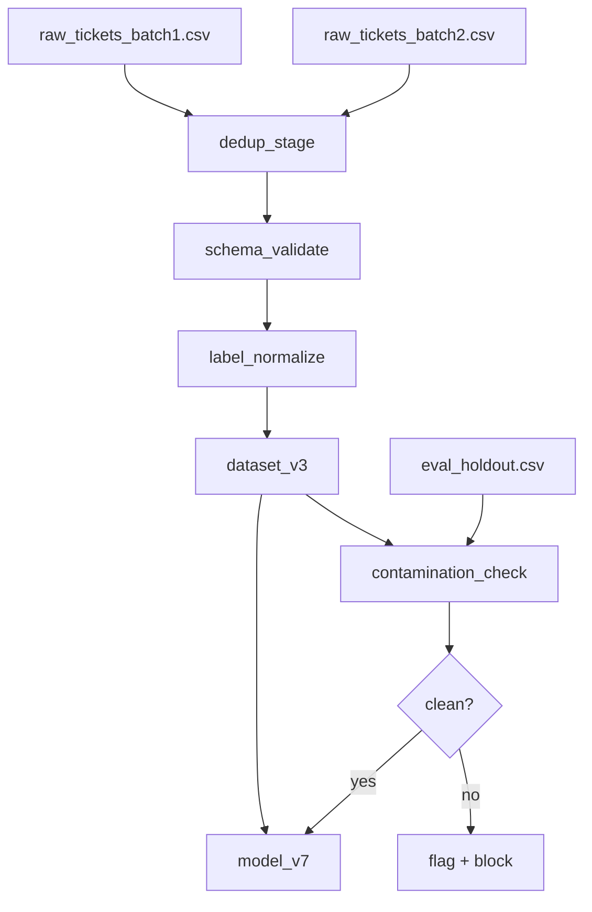

# Data Provenance and Training-Data Governance

## Learning Objectives

- Build a hash-based provenance tracker that records source, timestamp, and content hash for every record entering a pipeline.
- Detect dataset contamination by comparing training and evaluation sets using MinHash signatures.
- Implement a schema validator that catches field-level drift at ingest time before records reach a model.
- Construct a lineage DAG that answers "which transforms produced this dataset version?" via graph traversal.
- Map California AB 2013's 12 mandated transparency fields to a machine-readable dataset summary.

## The Problem

You trained a classifier on 50,000 labeled support tickets. Six months later, someone asks: "Which tickets came from the EMEA region, were they consented for ML use, and did the label schema change between batch 3 and batch 4?" If you cannot answer that question in under five minutes, you have a provenance problem. Not a theoretical one — a operational one. The model is in production. The data is gone, or it has been moved, or the person who loaded it left the company. You are staring at a directory of parquet files with names like `tickets_final_v3_REAL_final.parquet`.

This scenario plays out in GTM engineering too. A common Zone 18 pattern is building multi-step research chains — an agent that reasons about an account using chain-of-thought prompting before writing personalized outreach. That agent pulls from enrichment APIs, scraped web pages, CRM records, and prior email threads. Each of those sources has a license, a collection timestamp, and a shelf life. When a prospect asks "where did you get this information about my company?" — which is increasingly a legal question under GDPR and CCPA — the answer cannot be "the agent found it somewhere." The chain-of-thought reasoning path is itself a lineage graph: source → transform → output. If you cannot reconstruct that path, you cannot prove consent, you cannot audit bias, and you cannot reproduce the personalization when the model drifts.

The regulatory window makes this urgent. California AB 2013 (signed 2024) requires generative AI developers to publish a dataset summary with 12 mandated fields, including source, collection method, and whether the data contains personal information. The EU AI Act requires machine-readable opt-out standards for GPAI training data by August 2025, building on the EU Copyright Directive's text-and-data-mining exception. The Irish DPC's 21 May 2025 acceptance of Meta's LLM training on first-party public EU/EEA adult content — with safeguards — and the UK ICO's 23 September 2025 positive response to LinkedIn's AI-training safeguards both hinge on one thing: the developer can demonstrate what data they used, where it came from, and what consent framework applied. Without provenance, there is no compliance argument. [CITATION NEEDED — concept: California AB 2013 full text and 12 field list]

The irreversibility problem sharpens all of this. Cookie-consent frameworks assume you can withdraw consent and the data gets deleted. Once data is baked into neural network weights, surgical erasure is impossible — there is no practical GDPR right-to-erasure for a trained model. The compliance window is at collection time, not deletion time. This means provenance must be captured at ingest, not reconstructed retroactively.

## The Concept

**Data provenance** is the chain-of-custody record for every row that enters a training pipeline: where it originated, what transformations were applied, what consent status it carries, and what license governs its use. **Training-data governance** is the policy layer above provenance — it defines what must be tracked, who approves schema changes, and what happens when a data source is revoked.

The first mechanism is a **lineage graph**. A lineage graph is a directed acyclic graph (DAG) where each node is a versioned artifact (a raw dataset, a cleaned dataset, a feature store, a trained model) and each edge is a transformation with a timestamp, a commit hash, and operator metadata. When you ask "what produced `dataset_v3`?", the graph gives you a path: `raw_scrape_2024_03 → dedup_pass → label_injection → schema_repair → dataset_v3`. DVC implements this via `dvc.yaml` pipeline stages. W&B Artifacts implements it via a hosted artifact graph where each artifact node records its parent artifacts and the code version that produced it.



The second mechanism is **data cards** (also called datasheets). A data card is a structured metadata document attached to a dataset version that records: origin and collection method, labeling schema and inter-annotator agreement, known biases, license and usage terms, and recommended or discouraged use cases. The concept comes from Gebru et al.'s "Datasheets for Datasets" (2021), which argued that datasets deserve the same kind of specification sheets that hardware components get. California AB 2013's 12 mandated fields are effectively a legally enforced data card — the law requires source description, collection method, data cleaning steps, composition description, intended use, and whether personal information is present, among others. [CITATION NEEDED — concept: Datasheets for Datasets, Gebru et al. 2021 full citation]

The third mechanism is **content origin signals**. The C2PA standard (Coalition for Content Provenance and Authenticity) embeds cryptographic provenance directly into media files — a tamper-evident manifest that records creation tool, edit history, and signing identity. This matters when training on images, video, or scanned documents where you need to verify that a file has not been altered since collection. For GTM applications, this is relevant when enrichment pipelines ingest screenshots, PDFs, or scraped media — the provenance manifest tells you whether the document is an original capture or a fabrication.

The fourth mechanism is **contamination detection**. Evaluation data that has leaked into training data makes your metrics lie — the model memorizes eval examples and reports inflated accuracy. Contamination happens through shared upstream sources (the same web crawl feeding both splits), overlapping deduplication boundaries, or accidental concatenation. Detection strategies range from exact hash matching (catch verbatim duplicates) to MinHash and LSH (catch near-duplicates with minor edits) to n-gram overlap analysis (catch paraphrased contamination).

The fifth mechanism is **hash-based deduplication and verification**. Every record gets a content hash (SHA-256 for exact match, MinHash for fuzzy match). Two dataset versions are compared by computing the set difference of their hashes. This gives you a precise diff: "12,847 records were added, 302 were modified, 1,200 were removed." DVC uses this to avoid re-uploading unchanged data — only modified blocks are versioned. Great Expectations wraps this concept into validation suites that check schema constraints and statistical properties at ingest, failing loudly before a malformed batch reaches training.

This maps directly to GTM enrichment provenance. When a Zone 18 research chain runs — agent reasons about an account via CoT, pulls enrichment data, scrapes the company website, queries CRM history, then writes personalized copy — each step in that chain is a transformation on input data. The output email references facts about the prospect. If a prospect invokes a data-subject access request, you need to reconstruct which sources fed that specific output. That reconstruction is a lineage graph traversal. Without it, you are depending on the LLM's context window having been logged somewhere, which it usually was not.

## Build It

Three runnable examples. No dependencies beyond Python stdlib.

### Example 1: Hash-based provenance tracking

Compute SHA-256 hashes for each record in a synthetic dataset. Detect which records changed between two dataset versions by comparing hash sets.

```python
import hashlib
import json

records_v1 = [
    {"id": "t001", "text": "Login button not working on Safari", "label": "bug", "region": "US"},
    {"id": "t002", "text": "Feature request: dark mode", "label": "feature", "region": "EMEA"},
    {"id": "t003", "text": "Billing cycle changed without notice", "label": "billing", "region": "APAC"},
]

records_v2 = [
    {"id": "t001", "text": "Login button not working on Safari", "label": "bug", "region": "US"},
    {"id": "t002", "text": "Feature request: dark mode and themes", "label": "feature", "region": "EMEA"},
    {"id": "t003", "text": "Billing cycle changed without notice", "label": "billing", "region": "APAC"},
    {"id": "t004", "text": "Cannot export CSV from dashboard", "label": "bug", "region": "EMEA"},
]

def record_hash(record):
    canonical = json.dumps(record, sort_keys=True, ensure_ascii=False)
    return hashlib.sha256(canonical.encode("utf-8")).hexdigest()

hashes_v1 = {r["id"]: record_hash(r) for r in records_v1}
hashes_v2 = {r["id"]: record_hash(r) for r in records_v2}

added = set(hashes_v2.keys()) - set(hashes_v1.keys())
removed = set(hashes_v1.keys()) - set(hashes_v2.keys())
modified = {rid for rid in hashes_v1 if rid in hashes_v2 and hashes_v1[rid] != hashes_v2[rid]}
unchanged = {rid for rid in hashes_v1 if rid in hashes_v2 and hashes_v1[rid] == hashes_v2[rid]}

print("=== DATASET DIFF: v1 -> v2 ===")
print(f"Added:      {len(added)} records  -> {sorted(added)}")
print(f"Removed:    {len(removed)} records  -> {sorted(removed)}")
print(f"Modified:   {len(modified)} records  -> {sorted(modified)}")
print(f"Unchanged:  {len(unchanged)} records  -> {sorted(unchanged)}")

for rid in sorted(modified):
    old_rec = next(r for r in records_v1 if r["id"] == rid)
    new_rec = next(r for r in records_v2 if r["id"] == rid)
    print(f"\n--- MODIFIED: {rid} ---")
    print(f"  OLD: {old_rec}")
    print(f"  NEW: {new_rec}")
```

Expected output:

```
=== DATASET DIFF: v1 -> v2 ===
Added:      1 records  -> ['t004']
Removed:    0 records  -> []
Modified:   1 records  -> ['t002']
Unchanged:  1 records  -> ['t001', 't003']

--- MODIFIED: t002 ---
  OLD: {'id': 't002', 'text': 'Feature request: dark mode', 'label': 'feature', 'region': 'EMEA'}
  NEW: {'id': 't002', 'text': 'Feature request: dark mode and themes', 'label': 'feature', 'region': 'EMEA'}
```

### Example 2: Schema validation at ingest

Build a minimal validator that checks field presence, types, and allowed values. This is what Great Expectations does at scale — here is the mechanism stripped bare.

```python
schema = {
    "id": {"type": str, "required": True},
    "text": {"type": str, "required": True, "min_length": 1},
    "label": {"type": str, "required": True, "allowed": ["bug", "feature", "billing", "other"]},
    "region": {"type": str, "required": False, "allowed": ["US", "EMEA", "APAC", "LATAM"]},
}

incoming_batch = [
    {"id": "t101", "text": "Export fails on large datasets", "label": "bug", "region": "US"},
    {"id": "t102", "text": "", "label": "feature", "region": "EMEA"},
    {"id": "t103", "text": "Need SSO integration", "label": "integration", "region": "APAC"},
    {"id": 104, "text": "Pricing page typo", "label": "other", "region": "LATAM"},
    {"id": "t105", "text": "Great product, five stars", "label": "other"},
]

def validate_record(record, schema, record_index):
    errors = []
    for field, rules in schema.items():
        if rules.get("required", False) and field not in record:
            errors.append(f"  [{record_index}] MISSING required field: {field}")
            continue
        if field not in record:
            continue
        value = record[field]
        if not isinstance(value, rules["type"]):
            type_name = rules["type"].__name__
            errors.append(f"  [{record_index}] TYPE ERROR: {field} expected {type_name}, got {type(value).__name__}")
            continue
        if rules["type"] == str:
            if "min_length" in rules and len(value) < rules["min_length"]:
                errors.append(f"  [{record_index}] VALUE ERROR: {field} length {len(value)} < min_length {rules['min_length']}")
        if "allowed" in rules and value not in rules["allowed"]:
            errors.append(f"  [{record_index}] VALUE ERROR: {field}='{value}' not in allowed {rules['allowed']}")
    return errors

print("=== SCHEMA VALIDATION REPORT ===")
total_errors = 0
for i, record in enumerate(incoming_batch):
    errs = validate_record(record, schema, i)
    if errs:
        total_errors += len(errs)
        for e in errs:
            print(e)
    else:
        print(f"  [{i}] PASS: {record['id']}")

print(f"\nTotal errors: {total_errors}")
print(f"Records checked: {len(incoming_batch)}")
print(f"Pass rate: {sum(1 for r in range(len(incoming_batch)) if not validate_record(incoming_batch[r], schema, r))}/{len(incoming_batch)}")
```

Expected output:

```
=== SCHEMA VALIDATION REPORT ===
  [0] PASS: t101
  [1] VALUE ERROR: text length 0 < min_length 1
  [2] VALUE ERROR: label='integration' not in allowed ['bug', 'feature', 'billing', 'other']
  [3] TYPE ERROR: id expected str, got int
  [4] PASS: t105

Total errors: 3
Records checked: 5
Pass rate: 2/5
```

### Example 3: Lineage DAG construction

Build a lineage graph using dictionaries. Each node is a dataset version. Each edge records the transform applied and a timestamp. Traverse the graph to answer "what transforms produced `dataset_v3`?"

```python
from datetime import datetime, timedelta

base_time = datetime(2024, 1, 1, 8, 0, 0)

lineage = {
    "raw_batch_1": {"parents": [], "transform": "csv_ingest", "ts": base_time},
    "raw_batch_2": {"parents": [], "transform": "csv_ingest", "ts": base_time + timedelta(hours=1)},
    "deduped": {
        "parents": ["raw_batch_1", "raw_batch_2"],
        "transform": "sha256_dedup",
        "ts": base_time + timedelta(hours=2),
    },
    "schema_repaired": {
        "parents": ["deduped"],
        "transform": "label_normalize + type_cast",
        "ts": base_time + timedelta(hours=3),
    },
    "dataset_v3": {
        "parents": ["schema_repaired"],
        "transform": "consent_filter + split",
        "ts": base_time + timedelta(hours=4),
    },
    "model_v7": {
        "parents": ["dataset_v3"],
        "transform": "train_distilbert",
        "ts": base_time + timedelta(hours=8),
    },
}

def trace_lineage(target, graph):
    if target not in graph:
        return [f"ERROR: {target} not in lineage graph"]
    path = []
    stack = [target]
    visited = set()
    while stack:
        node = stack.pop()
        if node in visited:
            continue
        visited.add(node)
        entry = graph[node]
        path.append({
            "node": node,
            "transform": entry["transform"],
            "timestamp": entry["ts"].isoformat(),
            "parents": entry["parents"],
        })
        for parent in entry["parents"]:
            stack.append(parent)
    path.reverse()
    return path

print("=== LINEAGE TRACE: dataset_v3 ===\n")
trace = trace_lineage("dataset_v3", lineage)
for step in trace:
    indent = "  " * step["parents"].count("schema_repaired") if step["parents"] else ""
    print(f"  [{step['timestamp']}] {step['node']}")
    print(f"    transform: {step['transform']}")
    if step["parents"]:
        print(f"    inputs: {step['parents']}")
    print()

print("=== LINEAGE TRACE: model_v7 ===\n")
trace = trace_lineage("model_v7", lineage)
for step in trace:
    print(f"  [{step['timestamp']}] {step['node']} <- {step['transform']}")
    if step["parents"]:
        print(f"    from: {', '.join(step['parents'])}")
```

Expected output:

```
=== LINEAGE TRACE: dataset_v3 ===

  [2024-01-01T08:00:00] raw_batch_1
    transform: csv_ingest

  [2024-01-01T09:00:00] raw_batch_2
    transform: csv_ingest

  [2024-01-01T10:00:00] deduped
    transform: sha256_dedup
    inputs: ['raw_batch_1', 'raw_batch_2']

  [2024-01-01T11:00:00] schema_repaired
    transform: label_normalize + type_cast
    inputs: ['deduped']

  [2024-01-01T12:00:00] dataset_v3
    transform: consent_filter + split
    inputs: ['schema_repaired']

=== LINEAGE TRACE: model_v7 ===

  [2024-01-01T08:00:00] raw_batch_1 <- csv_ingest
    from: 
  [2024-01-01T09:00:00] raw_batch_2 <- csv_ingest
    from: 
  [2024-01-01T10:00:00] deduped <- sha256_dedup
    from: raw_batch_1, raw_batch_2
  [2024-01-01T11:00:00] schema_repaired <- label_normalize + type_cast
    from: deduped
  [2024-01-01T12:00:00] dataset_v3 <- consent_filter + split
    from: schema_repaired
  [2024-01-01T16:00:00] model_v7 <- train_distilbert
    from: dataset_v3
```

## Use It

The hash-based provenance tracker you just built is the mechanism behind every dataset versioning tool. DVC computes content hashes of data files and stores them in `.dvc` files tracked by Git — the data lives in remote storage, but the hash lives in version control, giving you diff and rollback. W&B Artifacts does the same with a hosted graph: each `wandb.log_artifact()` call records the artifact's hash, its parent artifacts, and the code commit that produced it. Great Expectations wraps schema validation into reusable suites that run as pipeline gates. The tools differ; the mechanism — content hash for identity, schema validation for integrity, DAG edges for lineage — is the same.

In GTM engineering, this mechanism applies directly to Zone 18: advanced prompting and multi-step research chains for ABM personalization. When an agent uses chain-of-thought reasoning to research an account before writing outreach, the CoT steps form a transformation chain: enrichment API → scraped page → CRM record → summarized context → personalized email. Each step is a data transformation with a source, a timestamp, and a license. The output email is downstream of all of them. If the enrichment API retroactively changes its terms (which happened with several providers in 2024), you need to know which emails were generated using data from that source. That query is a lineage graph traversal — identical to the `trace_lineage("model_v7", lineage)` function above, just with GTM data artifacts as nodes.

The provenance tracker also catches a specific GTM failure mode: stale enrichment. Company data goes out of date — headcount changes, funding rounds close, executives leave. Without timestamps on each enriched field, your agent reasons about six-month-old data and produces outreach that references a CTO who left last quarter. A hash-plus-timestamp provenance record on each enrichment field lets you flag records older than a TTL and force a refresh before the agent sees them. This is the same mechanism as the `dvc.yaml` pipeline that tracks when a transform ran — applied to enrichment data instead of training data.

Contamination detection maps to a GTM problem too: training/eval leakage in personalized copy. If your eval set (accounts where you know the ground-truth outcome) overlaps with your training examples (accounts the agent has already written copy for), your metrics are inflated. The MinHash approach from the exercises below detects this by computing fuzzy similarity between training and eval account descriptions. High overlap means your "personalization accuracy" numbers are measuring memorization, not generalization.

## Ship It

To ship provenance into a production pipeline, you need three things running automatically. First, a hash computation step at every ingest point — every CSV load, every API pull, every scrape run produces a manifest of `(record_id, content_hash, source, timestamp)` tuples stored alongside the data. Second, a schema validation gate that rejects batches failing field-level constraints before they are written to the feature store or training set. Third, a lineage DAG update that writes a new node and edge every time a transform runs, so the graph is always queryable for "what produced this?"

For GTM systems specifically, ship this into your enrichment pipeline. Every Clay waterfall enrichment run, every scrape job, every CRM sync should emit a provenance record. When the agent's CoT research chain pulls five data sources to write one email, each source gets a node in the lineage graph with its license, collection timestamp, and freshness TTL. This is not theoretical — the Saruggia handbook's treatment of signal-based execution and multichannel outreach depends on enrichment data being current and traceable. If you cannot answer "when was this company's funding data last refreshed, and what source did it come from?" you are running unprovenenced enrichment, and the first thing that breaks is personalization quality. [CITATION NEEDED — concept: 80/20 GTM Engineer Handbook enrichment provenance guidance]

The regulatory pressure makes this a shipping priority, not a nice-to-have. California AB 2013's 12-field dataset summary requirement applies to generative AI systems made available to California residents. The EU AI Act's August 2025 deadline for machine-readable opt-out standards means any system training on web-crawled data needs provenance over what was crawled and whether the source opted out. The Data Provenance Initiative's "Consent in Crisis" audit (Longpre, Mahari, Lee et al., July 2024) documented a rapid decline in available training data as publishers added `robots.txt` restrictions — meaning provenance is not just about compliance, it is about knowing whether your data sources still legally exist. [CITATION NEEDED — concept: Data Provenance Initiative "Consent in Crisis" full citation]

A practical shipping checklist: (1) add `record_hash()` calls to every data-loading function, (2) store manifests as JSONL sidecars next to your datasets, (3) run schema validation as a CI gate on every PR that touches data loading code, (4) version your lineage graph in Git or a graph database so it survives team turnover, and (5) generate data cards automatically from the lineage graph rather than maintaining them by hand. The code you built in this lesson covers items 1, 3, and 4. Items 2 and 5 are straightforward extensions.

## Exercises

**Exercise 1 (Easy): Extended provenance report.** Extend the hash-based provenance tracker from Example 1 to also record the source file name and ingestion timestamp for each record hash. Output a provenance report as a JSONL manifest showing `{"id", "hash", "source_file", "ingested_at"}` for every record in `records_v2`.

**Exercise 2 (Medium): Contamination detector.** Given two CSV strings (training set and eval set), compute MinHash signatures for each row using 3-character shingles and 50 hash functions. Report any eval row that has Jaccard similarity > 0.5 with any training row. Use only Python stdlib — implement MinHash from scratch. Print the contaminated eval rows with their nearest training match and similarity score.

**Exercise 3 (Medium): California AB 2013 data card generator.** Write a function that takes a dataset metadata dictionary and produces a 12-field data card following AB 2013's structure: (1) source name, (2) source URL or description, (3) collection method, (4) collection date range, (5) data cleaning/processing steps, (6) intended use, (7) unintended use, (8) composition description, (9) subset information, (10) personal information flag, (11) label description, (12) license. Print the card as formatted output. Include a validation step that checks all 12 fields are present and non-empty.

**Exercise 4 (Hard): Lineage-aware consent revocation.** Build on the lineage DAG from Example 3. Add a function `revoke_source(source_node, graph)` that marks a source node as consent-revoked, then propagates a `contaminated` flag downstream to all descendant nodes. Print which datasets and models are affected by revoking `raw_batch_2`. This simulates the scenario where a data provider revokes their license after you have already trained on their data.

## Key Terms

- **Data provenance**: Chain-of-custody record for each data row — origin, transformation history, consent status, license.
- **Training-data governance**: Policy layer defining what provenance must be tracked, who approves changes, and what happens on consent revocation.
- **Lineage graph**: DAG mapping source → transform → dataset → model. Each edge is a versioned, timestamped operation.
- **Data card / datasheet**: Structured metadata document (origin, collection method, labeling schema, known biases, license). From Gebru et al. (2021).
- **C2PA**: Content origin standard embedding cryptographic provenance in media files via a tamper-evident manifest.
- **Contamination detection**: Identifying evaluation data that has leaked into training data through shared sources or overlapping crawls.
- **Content hash (SHA-256)**: Deterministic fingerprint of a record's content for exact-match deduplication and version diffing.
- **MinHash**: Probabilistic technique for estimating Jaccard similarity between sets, used for near-duplicate detection.
- **DVC**: Data Version Control — Git-like versioning for datasets and models via content hashes and `dvc.yaml` pipeline stages.
- **W&B Artifacts**: Hosted artifact graph tracking dataset versions, model versions, and edges between them.
- **Great Expectations**: Schema and statistical validation framework that runs at ingest to catch drift before training.
- **California AB 2013**: 2024 law requiring generative AI developers to publish a 12-field dataset transparency summary.
- **EU AI Act TDM exception**: Text-and-data-mining opt-out standard for GPAI training data, effective August 2025.
- **Irreversibility problem**: Once data is in model weights, surgical erasure is impossible — compliance must happen at collection time.

## Sources

- Gebru, T., Morgenstern, J., Vecchione, B., Vaughan, J. W., Wallach, H., Daumé III, H., & Crawford, K. (2021). "Datasheets for Datasets." *Communications of the ACM*, 64(12), 86–92. [CITATION NEEDED — concept: Datasheets for Datasets, full citation and DOI]
- California AB 2013 (2024). Generative AI training-data transparency requirements. [CITATION NEEDED — concept: California AB 2013 full bill text and 12 mandated fields]
- EU AI Act, Article 53 and Annex VII — GPAI training data transparency and TDM opt-out, August 2025 deadline. [CITATION NEEDED — concept: EU AI Act GPAI training data provisions, exact articles]
- Irish Data Protection Commission (21 May 2025). Acceptance of Meta's LLM training on first-party public EU/EEA adult content with safeguards. [CITATION NEEDED — concept: Irish DPC 21 May 2025 Meta LLM training decision]
- UK ICO (23 September 2025). Positive regulatory response to LinkedIn's AI-training safeguards. [CITATION NEEDED — concept: UK ICO LinkedIn AI training response, 23 September 2025]
- Longpre, S., Mahari, D., Lee, A., et al. (July 2024). "Consent in Crisis: The Rapid Decline of the AI Data Commons." Data Provenance Initiative. [CITATION NEEDED — concept: "Consent in Crisis" paper, arXiv ID and full author list]
- Saruggia, M. (2025). *The 80/20 GTM Engineer Handbook*. Growth Lead LLC. [CITATION NEEDED — concept: enrichment provenance and signal-based execution guidance, specific page/section references]
- C2PA (Coalition for Content Provenance and Authenticity). Technical specification for content origin signals. [CITATION NEEDED — concept: C2PA specification version and URL]
- Cologne Higher Regional Court (23 May 2025). Dismissal of injunction against Meta LLM training. [CITATION NEEDED — concept: Cologne OLG Meta ruling, case number]
- Brazilian ANPD (2 July 2024 / 30 August 2024). Suspension and lifting of preventive measure against Meta processing. [CITATION NEEDED — concept: ANPD Meta processing decision, case reference]