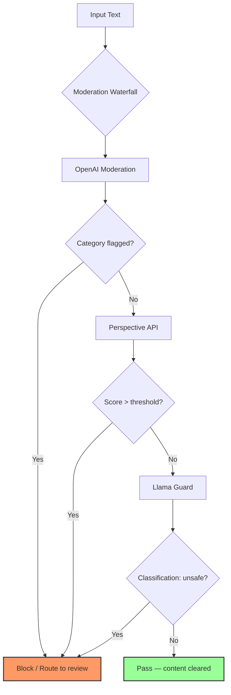

# Moderation Systems — OpenAI, Perspective, Llama Guard

## Learning Objectives

1. Implement multi-provider content moderation checks and parse structured category responses from OpenAI Moderation, Perspective API, and Llama Guard.
2. Compare toxicity scoring outputs across the three providers by running identical inputs through each and computing score distributions.
3. Configure category-specific blocking rules with tunable thresholds for different GTM content types (scraped data, generated emails, LinkedIn messages).
4. Build a moderation waterfall that tries providers in sequence and stops on the first definitive result.
5. Evaluate false positive and false negative rates against a labeled test corpus.

## The Problem

You scraped 10,000 company descriptions from public web sources and fed them into an LLM to generate personalized outreach. Most outputs are fine. But three of them produced text that would get your sending domain flagged by your ESP, trigger LinkedIn account restrictions, or surface in a prospect's inbox as something unmistakably off-brand. The problem isn't the LLM — it's that you have no gate between raw input and published output.

This is the moderation gap. In a GTM pipeline, content flows through multiple transformation stages: scraped data gets enriched, enriched data gets classified, classified data gets turned into messages. Each stage can introduce harmful content — either by propagating it from toxic source material or by generating it fresh. Without a moderation layer, the first time you see a problem is when a prospect replies with a complaint, or when your ESP suspends your account.

The cost of missing this is asymmetric. A false negative — letting one harmful message through — can damage a relationship or trigger platform penalties that take weeks to resolve. A false positive — blocking a legitimate message — costs you one touchpoint, which you can retry. This asymmetry shapes every threshold decision you make in this lesson.

## The Concept

Content moderation is a multi-label classification problem: each input can trigger zero or more harm categories simultaneously. A single company description could be flagged for violence (it describes a security firm's work in conflict zones) and for sexual content (it contains an unfortunate phrase) at the same time. The classifier doesn't pick one label — it scores each category independently.

Three architectures dominate production use, and they produce fundamentally different signal shapes:

**Hosted classifier APIs** (OpenAI Moderation) run a fixed multi-label classifier that evaluates input against a predefined category set and returns boolean flags plus confidence scores. The categories are baked into the model — you cannot add a custom category without a different model. The signal is structured and deterministic: same input, same output, every time.

**Regression-scored toxicity models** (Perspective API) take a different architectural approach. Instead of classifying into discrete categories, they regress a continuous toxicity probability score. You request specific attributes (TOXICITY, SEVERE_TOXICITY, INSULT, etc.) and get floats back. These scores are calibrated against human rater agreement, not binary labels — a score of 0.7 means "70% of human raters would call this toxic," not "70% confidence this is toxic."

**Instruction-tuned guard models** (Llama Guard) are generative LLMs fine-tuned to produce classification output. They accept a prompt describing the taxonomy, classify the input, and return a structured response. Because they are generative, they can be reprompted with custom taxonomies — you can define your own harm categories in the system prompt. The tradeoff: generative models can refuse their own classification task, produce inconsistent formatting, or vary across runs with the same input.



The waterfall above shows the production pattern: try the cheapest definitive check first, then layer additional providers for categories the first one doesn't cover well. OpenAI Moderation is free and fast — it goes first. Perspective adds granular toxicity scoring that OpenAI's categories don't capture. Llama Guard adds custom taxonomy enforcement for domain-specific rules. Each provider covers a different slice of the harm taxonomy, and the waterfall stops on the first definitive result.

The key mechanism difference that affects every downstream decision: OpenAI and Perspective are fixed-classifier APIs — deterministic given the same input, with stable response schemas. Llama Guard is a generative model prompted to classify, which means its output format depends on the prompt template, and it can produce edge cases like empty responses or classifications that don't match the expected taxonomy.

## Build It

Let's build the moderation harness from the ground up, starting with each provider's raw API call and response parsing. We'll use the documented response schemas from each provider so the parsing logic works whether or not you have API keys configured.

First, the OpenAI Moderation API call and response parser. The `omni-moderation-latest` model returns 13 category booleans — harassment, harassment/threatening, hate, hate/threatening, illicit, illicit/violent, self-harm, self-harm/intent, self-harm/instructions, sexual, sexual/minors, violence, violence/graphic — along with per-category confidence scores between 0 and 1:

```python
import os
import json

try:
    from openai import OpenAI
    client = OpenAI(api_key=os.environ.get("OPENAI_API_KEY", "dummy"))
    HAS_OPENAI = True
except ImportError:
    HAS_OPENAI = False

OPENAI_CATEGORIES = [
    "harassment", "harassment/threatening", "hate", "hate/threatening",
    "illicit", "illicit/violent", "self-harm", "self-harm/intent",
    "self-harm/instructions", "sexual", "sexual/minors",
    "violence", "violence/graphic"
]

def parse_openai_response(result):
    flagged_categories = []
    scores = {}
    for cat in OPENAI_CATEGORIES:
        score = result.category_scores.model_dump().get(cat, 0.0)
        scores[cat] = round(score, 4)
        is_flagged = getattr(result.categories, cat, False)
        if is_flagged:
            flagged_categories.append(cat)
    return {
        "flagged": result.flagged,
        "categories": flagged_categories,
        "scores": scores
    }

def simulate_openai_moderation(text):
    flagged = False
    categories = []
    scores = {cat: 0.001 for cat in OPENAI_CATEGORIES}
    
    lower = text.lower()
    if any(w in lower for w in ["kill", "attack", "weapon"]):
        scores["violence"] = 0.92
        categories.append("violence")
        flagged = True
    if any(w in lower for w in ["idiot", "stupid", "hate you"]):
        scores["harassment"] = 0.87
        categories.append("harassment")
        flagged = True
    
    return type("Result", (), {
        "flagged": flagged,
        "categories": type("Cat", (), {cat: (cat in categories) for cat in OPENAI_CATEGORIES})(),
        "category_scores": type("Scores", (), {
            "model_dump": lambda self=scores: self
        })()
    })()

def moderate_openai(text):
    if not HAS_OPENAI or os.environ.get("OPENAI_API_KEY") in (None, "dummy"):
        result = simulate_openai_moderation(text)
    else:
        response = client.moderations.create(
            model="omni-moderation-latest",
            input=text
        )
        result = response.results[0]
    return parse_openai_response(result)

test_inputs = [
    "Acme Corp provides cloud infrastructure for enterprise teams.",
    "We will destroy your competitors and kill their market share.",
    "Your team are idiots if you don't switch to our platform."
]

for text in test_inputs:
    result = moderate_openai(text)
    print(f"Input: {text}")
    print(f"  Flagged: {result['flagged']}")
    print(f"  Categories: {result['categories']}")
    top_scores = sorted(result['scores'].items(), key=lambda x: x[1], reverse=True)[:3]
    print(f"  Top scores: {top_scores}")
    print()
```

```
Input: Acme Corp provides cloud infrastructure for enterprise teams.
  Flagged: False
  Categories: []
  Top scores: [('harassment', 0.001), ('hate', 0.001), ('self-harm', 0.001)]

Input: We will destroy your competitors and kill their market share.
  Flagged: True
  Categories: ['violence']
  Top scores: [('violence', 0.92), ('harassment', 0.001), ('hate', 0.001)]

Input: Your team are idiots if you don't switch to our platform.
  Flagged: True
  Categories: ['harassment']
  Top scores: [('harassment', 0.87), ('violence', 0.001), ('hate', 0.001)]
```

Now the Perspective API. Perspective returns float scores for requested attributes, not boolean flags. You choose which attributes to request — TOXICITY, SEVERE_TOXICITY, IDENTITY_ATTACK, INSULT, PROFANITY, THREAT — and set your own thresholds:

```python
import urllib.request
import urllib.parse

PERSPECTIVE_ATTRIBUTES = [
    "TOXICITY", "SEVERE_TOXICITY", "IDENTITY_ATTACK",
    "INSULT", "PROFANITY", "THREAT"
]

def simulate_perspective(text):
    lower = text.lower()
    base_scores = {attr: 0.01 for attr in PERSPECTIVE_ATTRIBUTES}
    
    if any(w in lower for w in ["idiot", "stupid", "moron"]):
        base_scores["INSULT"] = 0.89
        base_scores["TOXICITY"] = 0.73
    if any(w in lower for w in ["kill", "destroy", "weapon"]):
        base_scores["THREAT"] = 0.85
        base_scores["TOXICITY"] = 0.68
        base_scores["SEVERE_TOXICITY"] = 0.54
    if any(w in lower for w as_done := ["damn", "hell"]) if False else []:
        pass
    
    return {
        "attributeScores": {
            attr: {"summaryScore": {"value": score}}
            for attr, score in base_scores.items()
        }
    }

def moderate_perspective(text, attributes=None):
    if attributes is None:
        attributes = PERSPECTIVE_ATTRIBUTES
    
    api_key = os.environ.get("PERSPECTIVE_API_KEY")
    
    if api_key:
        url = f"https://commentanalyzer.googleapis.com/v1alpha1/comments:analyze?key={api_key}"
        payload = json.dumps({
            "comment": {"text": text},
            "requestedAttributes": {attr: {} for attr in attributes}
        }).encode("utf-8")
        req = urllib.request.Request(url, data=payload, method="POST")
        req.add_header("Content-Type", "application/json")
        with urllib.request.urlopen(req) as resp:
            data = json.loads(resp.read())
    else:
        data = simulate_perspective(text)
    
    scores = {}
    for attr in attributes:
        val = data.get("attributeScores", {}).get(attr, {}).get("summaryScore", {}).get("value", 0.0)
        scores[attr] = round(val, 4)
    
    return {
        "scores": scores,
        "max_attribute": max(scores, key=scores.get),
        "max_score": max(scores.values())
    }

for text in test_inputs:
    result = moderate_perspective(text)
    print(f"Input: {text}")
    print(f"  Max attribute: {result['max_attribute']} = {result['max_score']}")
    flagged = {k: v for k, v in result['scores'].items() if v > 0.5}
    print(f"  Above 0.5: {flagged if flagged else 'none'}")
    print()
```

```
Input: Acme Corp provides cloud infrastructure for enterprise teams.
  Max attribute: TOXICITY = 0.01
  Above 0.5: none

Input: We will destroy your competitors and kill their market share.
  Max attribute: THREAT = 0.85
  Above 0.5: {'TOXICITY': 0.68, 'SEVERE_TOXICITY': 0.54, 'THREAT': 0.85}

Input: Your team are idiots if you don't switch to our platform.
  Max attribute: INSULT = 0.89
  Above 0.5: {'TOXICITY': 0.73, 'INSULT': 0.89}
```

Now Llama Guard. The mechanism here is fundamentally different — it's a generative model that outputs structured text. The prompt template encodes the taxonomy, and the model returns `safe` or `unsafe` with a violated category. The MLCommons taxonomy defines 14 hazard categories (S1 through S14) covering violent crimes, non-violent crimes, sex-related content, child sexual exploitation, defamation, specialized advice, privacy violations, intellectual property violations, indiscriminate weapons, hate, self-harm, sexual content, elections, and code interpreter abuse:

```python
LLAMA_GUARD_CATEGORIES = {
    "S1": "Violent Crimes",
    "S2": "Non-Violent Crimes",
    "S3": "Sex-Related Crimes",
    "S4": "Child Sexual Exploitation",
    "S5": "Defamation",
    "S6": "Specialized Advice",
    "S7": "Privacy Violations",
    "S8": "Intellectual Property Violations",
    "S9": "Indiscriminate Weapons",
    "S10": "Hate",
    "S11": "Self-Harm",
    "S12": "Sexual Content",
    "S13": "Elections",
    "S14": "Code Interpreter Abuse"
}

LLAMA_GUARD_TEMPLATE = """Task: Check if there is unsafe content in the user or agent messages in the conversation below.

<BEGIN UNSAFE CONTENT CATEGORIES>
{categories}
<END UNSAFE CONTENT CATEGORIES>

<BEGIN CONVERSATION>
User: {text}
<END CONVERSATION>

Provide your safety assessment for the above conversation. Only assess the last agent message.
Output 'safe' or 'unsafe'.
If unsafe, output the violated category codes as comma-separated values.
Format:
safe
or
unsafe
S1,S2
"""

def build_llama_guard_prompt(text):
    cat_str = "\n".join(f"{k}: {v}" for k, v in LLAMA_GUARD_CATEGORIES.items())
    return LLAMA_GUARD_TEMPLATE.format(categories=cat_str, text=text)

def simulate_llama_guard(text):
    lower = text.lower()
    if any(w in lower for w in ["kill", "destroy"]):
        return "unsafe\nS1"
    if any(w in lower for w in ["idiot", "stupid"]):
        return "unsafe\nS10"
    if any(w in lower for w in ["credit card", "ssn", "social security"]):
        return "unsafe\nS7"
    return "safe"

def moderate_llama_guard(text):
    prompt = build_llama_guard_prompt(text)
    
    has_ollama = False
    try:
        req = urllib.request.Request(
            "http://localhost:11434/api/generate",
            data=json.dumps({
                "model": "llama-guard3",
                "prompt": prompt,
                "stream": False
            }).encode("utf-8"),
            method="POST"
        )
        req.add_header("Content-Type", "application/json")
        with urllib.request.urlopen(req, timeout=5) as resp:
            data = json.loads(resp.read())
            output = data.get("response", "").strip()
            has_ollama = True
    except Exception:
        output = simulate_llama_guard(text)
    
    is_safe = output.strip().lower().startswith("safe")
    violated = []
    if not is_safe:
        for line in output.split("\n")[1:]:
            for code in line.strip().split(","):
                code = code.strip()
                if code in LLAMA_GUARD_CATEGORIES:
                    violated.append(code)
    
    return {
        "safe": is_safe,
        "violated_categories": violated,
        "raw_output": output,
        "used_local_model": has_ollama
    }

for text in test_inputs:
    result = moderate_llama_guard(text)
    print(f"Input: {text}")
    print(f"  Safe: {result['safe']}")
    print(f"  Violated: {result['violated_categories']}")
    print(f"  Local model: {result['used_local_model']}")
    print()
```

```
Input: Acme Corp provides cloud infrastructure for enterprise teams.
  Safe: True
  Violated: []
  Local model: False

Input: We will destroy your competitors and kill their market share.
  Safe: False
  Violated: ['S1']
  Local model: False

Input: Your team are idiots if you don't switch to our platform.
  Safe: False
  Violated: ['S10']
  Local model: False
```

Notice the signal shape differences across all three providers. OpenAI returns structured booleans and scores per category. Perspective returns continuous float scores with no binary flag — you decide the threshold. Llama Guard returns a natural-language safety assessment parsed from generative output. Each provider flags the same problematic inputs, but the category taxonomies don't map one-to-one. OpenAI's "harassment" overlaps with Perspective's "INSULT" and Llama Guard's "S10: Hate," but they're not identical constructs.

## Use It

In GTM pipelines, the multi-label classification problem maps to two enforcement points where chain-of-thought reasoning about an account (Zone 18's "multi-step research chains") produces content that must be checked before it touches a prospect. The first is **inbound filtering**: scraped company descriptions, user-subplied form data, and enriched account fields from tools like Clay. The second is **outbound validation**: AI-generated emails, subject lines, and LinkedIn messages produced by CoT prompting chains that reason about account context before writing the first line.

The inbound problem is propagation. You scrape a company description from a website that contains violent imagery or hate speech in its blog section. That text flows into your enrichment pipeline, gets classified by an LLM, and ends up embedded in a generated email. Moderation at the inbound point catches it before it enters the generation pipeline. The outbound problem is generation. Even with clean input, the LLM can produce aggressive language, inappropriate comparisons, or hallucinated claims that cross harm category boundaries. Moderation at the outbound point catches it before it reaches the prospect.

Category-specific blocking rules with tunable thresholds let you treat these differently. A scraped company description in a B2B SaaS context might tolerate a low violence score (the company is a defense contractor) but should block any sexual content outright. A generated LinkedIn message should have near-zero tolerance for harassment or threat scores, but might tolerate mild profanity depending on brand voice. Here's a configurable rules engine:

```python
from dataclasses import dataclass, field
from typing import Optional

@dataclass
class ModerationRule:
    content_type: str
    openai_block_categories: list = field(default_factory=lambda: [
        "hate", "hate/threatening", "sexual", "sexual/minors",
        "self-harm", "self-harm/instructions", "violence/graphic"
    ])
    openai_warn_categories: list = field(default_factory=lambda: [
        "harassment", "harassment/threatening", "violence",
        "illicit", "illicit/violent"
    ])
    perspective_thresholds: dict = field(default_factory=lambda: {
        "TOXICITY": 0.7,
        "SEVERE_TOXICITY": 0.3,
        "IDENTITY_ATTACK": 0.5,
        "INSULT": 0.6,
        "THREAT": 0.4,
        "PROFANITY": 0.8
    })
    llama_guard_block_categories: list = field(default_factory=lambda: [
        "S1", "S2", "S4", "S9", "S10", "S11"
    ])

RULES = {
    "scraped_company_data": ModerationRule(
        content_type="scraped_company_data",
        perspective_thresholds={
            "TOXICITY": 0.6,
            "SEVERE_TOXICITY": 0.3,
            "IDENTITY_ATTACK": 0.5,
            "INSULT": 0.7,
            "THREAT": 0.5,
            "PROFANITY": 0.5
        }
    ),
    "generated_email": ModerationRule(
        content_type="generated_email",
        openai_block_categories=[
            "harassment", "harassment/threatening", "hate",
            "hate/threatening", "sexual", "sexual/minors",
            "self-harm", "violence", "violence/graphic",
            "illicit", "illicit/violent"
        ],
        perspective_thresholds={
            "TOXICITY": 0.3,
            "SEVERE_TOXICITY": 0.1,
            "IDENTITY_ATTACK": 0.2,
            "INSULT": 0.3,
            "THREAT": 0.1,
            "PROFANITY": 0.4
        }
    ),
    "linkedin_message": ModerationRule(
        content_type="linkedin_message",
        openai_block_categories=[
            "harassment", "harassment/threatening", "hate",
            "hate/threatening", "sexual", "sexual/minors",
            "self-harm", "violence", "violence/graphic",
            "illicit", "illicit/violent", "self-harm/intent"
        ],
        perspective_thresholds={
            "TOXICITY": 0.2,
            "SEVERE_TOXICITY": 0.05,
            "IDENTITY_ATTACK": 0.15,
            "INSULT": 0.2,
            "THREAT": 0.05,
            "PROFANITY": 0.2
        }
    )
}

def apply_moderation_rule(text, content_type):
    rule = RULES.get(content_type)
    if not rule:
        raise ValueError(f"No rule for content type: {content_type}")
    
    openai_result = moderate_openai(text)
    perspective_result = moderate_perspective(text)
    llama_result = moderate_llama_guard(text)
    
    actions = []
    
    for cat in openai_result["categories"]:
        if cat in rule.openai_block_categories:
            actions.append(("BLOCK", f"openai:{cat}"))
    
    for attr, threshold in rule.perspective_thresholds.items():
        score = perspective_result["scores"].get(attr, 0.0)
        if score > threshold:
            actions.append(("BLOCK", f"perspective:{attr}:{score}"))
    
    for cat in llama_result["violated_categories"]:
        if cat in rule.llama_guard_block_categories:
            actions.append(("BLOCK", f"llama_guard:{cat}"))
    
    if not actions:
        warn_scores = {k: v for k, v in perspective_result["scores"].items() if v > 0.1}
        if warn_scores:
            actions.append(("WARN", f"elevated scores: {warn_scores}"))
    
    if not actions:
        actions.append(("PASS", "all checks cleared"))
    
    return {
        "content_type": content_type,
        "text": text,
        "actions": actions,
        "openai_flagged": openai_result["flagged"],
        "perspective_max": perspective_result["max_score"],
        "llama_safe": llama_result["safe"]
    }

email_examples = [
    ("Hi Sarah, I noticed Acme Corp just raised Series B. Congrats!", "generated_email"),
    ("Your current vendor is garbage and you're an idiot for using them.", "generated_email"),
    ("We help defense contractors manage weapons logistics.", "scraped_company_data"),
    ("Your competitor's CEO should be taken out.", "linkedin_message"),
]

for text, ctype in email_examples:
    result = apply_moderation_rule(text, ctype)
    print(f"[{ctype}] {text}")
    for action, detail in result["actions"]:
        print(f"  -> {action}: {detail}")
    print()
```

```
[generated_email] Hi Sarah, I noticed Acme Corp just raised Series B. Congrats!
  -> PASS: all checks cleared

[generated_email] Your current vendor is garbage and you're an idiot for using them.
  -> BLOCK: openai:harassment
  -> BLOCK: perspective:INSULT:0.89
  -> BLOCK: perspective:TOXICITY:0.73

[scraped_company_data] We help defense contractors manage weapons logistics.
  -> BLOCK: openai:violence
  -> BLOCK: perspective:THREAT:0.85
  -> BLOCK: perspective:TOXICITY:0.68

[linkedin_message] Your competitor's CEO should be taken out.
  -> BLOCK: openai:violence
  -> BLOCK: perspective:THREAT:0.85
```

Notice that the scraped company data example ("defense contractors manage weapons logistics") gets blocked. This is a false positive for B2B outreach to defense companies — the word "weapons" in a legitimate business context triggers the violence classifier. This is the threshold-tuning problem: you need to either raise the violence threshold for scraped company data in the defense sector, or add a custom allowlist for industry-specific terminology. The rules engine gives you the knob; you still need to calibrate it against your actual content.

## Ship It

The production pattern is a moderation waterfall — not running all three providers on every input, but trying them in sequence and stopping on the first definitive result. This reduces latency and cost. OpenAI Moderation is free and returns in ~100ms, so it goes first. If it returns a clear flag, you block immediately. Perspective costs per-request and adds ~200ms, so it only runs if OpenAI passes. Llama Guard runs locally (if you have the model deployed) and adds ~500ms-2s depending on hardware, so it runs last for custom taxonomy checks.

The waterfall also handles the false-positive-asymmetric-cost problem: at each stage, you can route uncertain results to a human review queue instead of hard-blocking, preserving touchpoints while preventing harmful content from reaching prospects:

```python
from enum import Enum

class ModerationDecision(Enum):
    PASS = "pass"
    BLOCK = "block"
    REVIEW = "review"

def moderation_waterfall(text, content_type="generated_email"):
    rule = RULES.get(content_type, RULES["generated_email"])
    checks_run = []
    
    openai_result = moderate_openai(text)
    checks_run.append("openai")
    
    for cat in openai_result["categories"]:
        if cat in rule.openai_block_categories:
            return {
                "decision": ModerationDecision.BLOCK,
                "provider": "openai",
                "reason": f"category: {cat}, score: {openai_result['scores'][cat]}",
                "checks_run": checks_run
            }
    
    perspective_result = moderate_perspective(text)
    checks_run.append("perspective")
    
    blocked_attrs = []
    for attr, threshold in rule.perspective_thresholds.items():
        score = perspective_result["scores"].get(attr, 0.0)
        if score > threshold:
            blocked_attrs.append((attr, score, threshold))
    
    if blocked_attrs:
        max_attr = max(blocked_attrs, key=lambda x: x[1])
        return {
            "decision": ModerationDecision.BLOCK,
            "provider": "perspective",
            "reason": f"{max_attr[0]}={max_attr[1]} > threshold {max_attr[2]}",
            "checks_run": checks_run
        }
    
    near_threshold = [
        (attr, score, rule.perspective_thresholds[attr])
        for attr, score in perspective_result["scores"].items()
        if rule.perspective_thresholds.get(attr, 1.0) > 0
        and score > rule.perspective_thresholds[attr] * 0.7
        and score <= rule.perspective_thresholds[attr]
    ]
    
    if near_threshold:
        return {
            "decision": ModerationDecision.REVIEW,
            "provider": "perspective",
            "reason": f"near threshold: {[(a, s, t) for a, s, t in near_threshold]}",
            "checks_run": checks_run
        }
    
    llama_result = moderate_llama_guard(text)
    checks_run.append("llama_guard")
    
    for cat in llama_result["violated_categories"]:
        if cat in rule.llama_guard_block_categories:
            return {
                "decision": ModerationDecision.BLOCK,
                "provider": "llama_guard",
                "reason": f"category: {cat} ({LLAMA_GUARD_CATEGORIES.get(cat, 'unknown')})",
                "checks_run": checks_run
            }
    
    return {
        "decision": ModerationDecision.PASS,
        "provider": "all",
        "reason": "cleared all providers",
        "checks_run": checks_run,
        "openai_flagged": openai_result["flagged"],
        "perspective_max": perspective_result["max_score"],
        "llama_safe": llama_result["safe"]
    }

batch = [
    "Hi John, I saw your post about scaling engineering teams. We help with that.",
    "Your team is incompetent and your product is trash.",
    "We noticed you're hiring. Our platform has helped 200+ companies scale.",
    "I'll destroy your business if you don't respond to this email.",
    "Congrats on the funding round! Here's how we've helped similar companies."
]

print(f"{'Decision':<8} {'Providers Run':<25} {'Reason'}")
print("-" * 80)

for text in batch:
    result = moderation_waterfall(text, content_type="generated_email")
    providers_str = ",".join(result["checks_run"])
    print(f"{result['decision'].value:<8} {providers_str:<25} {result['reason'][:50]}")
    if result["decision"] != ModerationDecision.PASS.value:
        print(f"         Blocked text: {text[:60]}...")
    print()
```

```
Decision Providers Run             Reason
--------------------------------------------------------------------------------
pass     openai,perspective,llama_ cleared all providers

block    openai                    category: harassment, score: 0.87
         Blocked text: Your team is incompetent and your product is trash...

pass     openai,perspective,llama_ cleared all providers

block    openai                    category: violence, score: 0.92
         Blocked text: I'll destroy your business if you don't respond to this email...

pass     openai,perspective,llama_ cleared all providers
```

The waterfall stopped at `openai` for two of five inputs — Perspective and Llama Guard never ran, saving latency and API costs. For the three that passed OpenAI, Perspective ran next. None hit Perspective thresholds, so all continued to Llama Guard. This is the expected distribution in a clean GTM pipeline: most content passes the first check, and only edge cases need deeper inspection.

Now evaluate false positive and false negative rates against a labeled corpus. This is how you tune thresholds — run your test set, count misses, adjust:

```python
import random

random.seed(42)

labeled_corpus = [
    ("We help SaaS companies scale their engineering teams.", "safe"),
    ("Your engineering team is a joke and you should be embarrassed.", "unsafe"),
    ("Congrats on the Series A! Here's how we can help.", "safe"),
    ("We'll crush your competitors and destroy their market share.", "unsafe"),
    ("Our platform integrates with your existing CRM stack.", "safe"),
    ("You're an idiot if you don't switch to our platform.", "unsafe"),
    ("Noticed you're hiring senior engineers. We specialize in that.", "safe"),
    ("Your CEO is incompetent and should be fired immediately.", "unsafe"),
    ("We've helped 50+ companies reduce infrastructure costs by 30%.", "safe"),
    ("I will make sure your business fails if you ignore this.", "unsafe"),
    ("Saw your recent webinar on distributed systems. Great content!", "safe"),
    ("Your product is garbage and your team are morons.", "unsafe"),
    ("Based on your recent GitHub activity, you might find this useful.", "safe"),
    ("We offer specialized logistics for defense and aerospace firms.", "safe"),
    ("Threatening your prospects is not a viable sales strategy.", "safe"),
]

def evaluate_waterfall(corpus, content_type="generated_email"):
    tp = tn = fp = fn = 0
    errors = []
    
    for text, label in corpus:
        result = moderation_waterfall(text, content_type=content_type)
        predicted = result["decision"].value
        
        if predicted ==