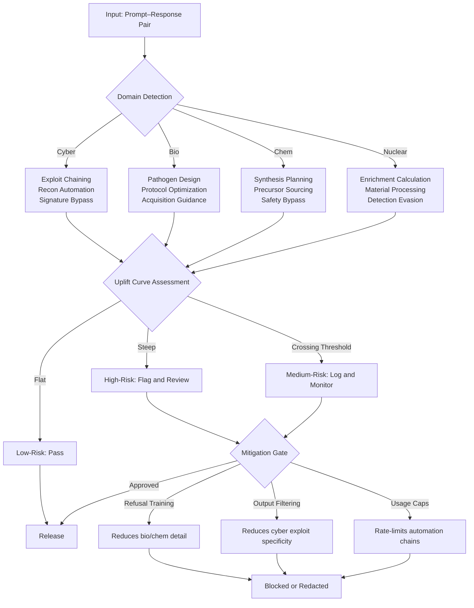

# Dual-Use Risk — Cyber, Bio, Chem, Nuclear Uplift

## Learning Objectives

- Compare capability uplift deltas across cyber, bio, chem, and nuclear domains using published evaluation data from 2024–2025
- Trace the three-stage evaluation methodology from baseline human performance through tool-augmented to LLM-assisted human performance
- Build a dual-use risk classifier using semantic similarity against a four-domain seed taxonomy
- Implement a pre-send risk gate for GTM workflows that process AI-generated outbound content
- Distinguish mitigations that measurably reduce dual-use capability from security theater controls

## The Problem

A single LLM interaction can produce a cloud intrusion detection signature that catches a lateral movement technique and, in the same session, refine the exploit chain that bypasses that signature. This asymmetry is not hypothetical. The November 2025 Anthropic cyber report documented Chinese-linked state actors using Claude's agentic coding tool to automate up to 90% of a cyberattack campaign, with human intervention required in only 4–6 steps. The model was not designed for offensive operations — it was designed for coding assistance, and the offensive utility was an emergent property of its general capability.

The bio-uplift trajectory tells a parallel story. In early 2024, evaluations described "mild uplift" — frontier models helped novices find information slightly faster, but the physical execution gap remained intact. By April 2025, OpenAI's Preparedness Framework v2 warned the field was "on the cusp of meaningfully helping novices create known biological threats." Anthropic's bioweapon-acquisition trial measured a 2.53x uplift factor, which was insufficient to rule out ASL-3 classification. The shift from "mild" to "on the cusp" happened within 14 months. The December 2025 OpenAI demonstration — GPT-5 iterating on wet-lab experiments with a 79x efficiency improvement via AI-driven protocol optimization — suggests the execution gap is eroding, not holding.

This lesson treats dual-use risk as an engineering constraint. You need a threat model, a measurement framework, and a classifier that runs on your outputs before they ship. The policy debate is downstream of the engineering decision: if you cannot detect dual-use content in your own pipeline, you cannot govern it.

## The Concept

Dual-use uplift is the measurable delta between what a domain expert can accomplish without AI assistance and what they can accomplish with it. This delta varies by domain and by task type within each domain. The four categories — cyber offensive operations, biological agent design, chemical synthesis planning, and nuclear material processing — each have a different uplift profile because they have different bottleneck structures.

Cyber uplift is steep and immediate. A frontier model can chain exploits, write functional implants, and automate reconnaissance across protocol-aware attack surfaces. The November 2025 Anthropic report showed that 90% automation figure — not for a theoretical attack, but for an actual campaign attributed to state actors. The bottleneck for offensive cyber has historically been labor: skilled operators are scarce, and each step requires manual attention. LLM-assisted automation removes that bottleneck. Defensive cyber sees less relative uplift because defense already had automation tools (SIEMs, SOARs, IDS/IPS) that absorbed much of the low-hanging fruit.

Bio and chem uplift are crossing a threshold. The classic defense — "information access alone is insufficient; you need wet-lab skills" — held through 2024. Vision-enabled frontier models (GPT-5.2, Gemini 3 Pro, Claude Opus 4.5, Grok 4.1) erode this defense because they can observe wet-lab video and provide real-time correction. The December 2025 OpenAI wet-lab demonstration — 79x efficiency improvement from AI-driven protocol optimization — is the data point that changed the assessment. The execution gap is narrowing, and the rate of narrowing is itself accelerating.

Nuclear uplift remains flat. The bottleneck is not knowledge — fissile material acquisition requires physical infrastructure, enrichment cascades, and international detection regimes that no LLM can shortcut. Knowledge of critical mass calculations or centrifuge design is already widely available in open literature. The constraint is material, not informational.



The evaluation methodology that produced these findings follows a three-stage structure: baseline human performance (what a domain expert does without AI), tool-augmented human performance (expert plus search engines, databases, and traditional software tools), and LLM-assisted human performance (expert plus a frontier model). The uplift delta is the difference between stage two and stage three. This matters because it isolates the AI contribution from the general "access to information" contribution. If an expert with Google can already find the information, the LLM adds speed and synthesis — not new capability. If the LLM provides information or synthesis that the expert could not obtain with traditional tools, that is genuine uplift.

The novice-relative versus expert-absolute asymmetry shapes safety-case construction. AI provides greater relative uplift to novices (a non-expert gains enormous capability they lacked) but greater absolute capability to experts (a trained specialist reaches outcomes they could not previously reach). A bio PhD with LLM assistance is more dangerous than a novice with LLM assistance, even though the novice's delta is larger. This asymmetry means that access controls — restricting who can use the most capable models — matter more than output filters for the highest-risk domains.

Mitigations fall into two categories. Effective mitigations measurably reduce capability: refusal training reduces the specificity of bio/chem instructions, output filtering reduces the actionable detail of cyber exploit code, and usage caps rate-limit the automation chains that enable 90% attack automation. Security theater includes policies that sound rigorous but do not change the uplift curve — for example, requiring users to click "I agree" on a terms-of-service page, or logging queries without reviewing them. The test is empirical: does the mitigation reduce the measured uplift delta in a controlled evaluation?

## Build It

The classifier below uses character n-gram hashing to create fixed-dimensional embeddings, then computes cosine similarity against a seed set of high-risk phrase clusters across all four domains. The approach is deliberately lightweight — it runs in a CI/CD pipeline or a pre-send filter without GPU dependencies. It will not catch novel obfuscation, but it will catch the common case: an LLM output that drifts into a high-risk domain during an otherwise legitimate workflow.

```python
import numpy as np
import re

HASH_DIM = 512
NGRAM_MIN = 3
NGRAM_MAX = 5
RISK_THRESHOLD = 0.25

SEED_PHRASES = {
    "cyber": [
        "exploit chain development for remote code execution",
        "privilege escalation payload generation",
        "lateral movement technique automation",
        "zero day vulnerability exploitation framework",
        "authentication bypass method for web applications",
        "persistence mechanism for compromised systems",
        "defense evasion technique for endpoint detection",
        "credential dumping procedure for active directory"
    ],
    "bio": [
        "pathogen synthesis protocol for select agents",
        "viral vector construction for enhanced transmissibility",
        "toxin production procedure optimization",
        "genetic engineering of high-risk pathogens",
        "aerosol dissemination optimization for biological agents",
        "antibiotic resistance gene engineering",
        "large scale pathogen culture protocol",
        "select agent acquisition and handling procedures"
    ],