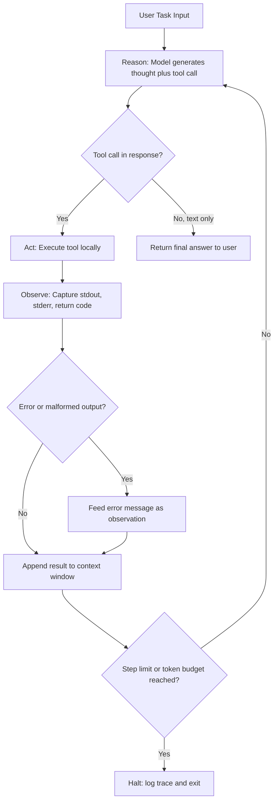

# Capstone 01 — Terminal-Native Coding Agent

## Learning Objectives

- Implement a ReAct loop that reasons, selects a tool, executes it, parses the result, and decides whether to continue or terminate.
- Define tool schemas that constrain model output into parseable, executable function calls.
- Build error recovery into an agent loop by feeding tool failures back into context as observations.
- Trace an agent's decision path through a JSONL log to diagnose loop failures.
- Compare terminal agent architecture against GTM enrichment pipelines that use the same plan-act-observe structure.

## The Problem

Coding agents became the dominant AI application category by 2026. Claude Code, Cursor 3 with Composer 2, Amp, OpenCode, Factory Droids, and Google Jules all ship variations of the same architecture: a terminal harness, a permissioned tool surface, a sandbox, and a plan-act-observe loop built around a frontier model. The frontier is narrow — Live-SWE-agent reached 79.2% on SWE-bench Verified with Opus 4.5 — but the engineering surface is wide. Most production failure modes are not model mistakes. They are tool-loop instability, context poisoning from unbounded tool output, runaway token cost on long runs, and destructive filesystem operations that nobody gated.

You cannot reason about these failure modes from the outside. You have to build the loop, watch it crash on turn 47 when ripgrep returns 8MB of matches into your context window, and then rebuild the truncation layer. You have to see the model emit malformed JSON in a tool call, watch your parser throw, and decide whether to retry, skip, or feed the error back. That experience — not the API call, not the prompt — is what makes someone an agent engineer.

This capstone asks you to build a terminal-native coding agent end to end. The agent accepts a task, plans an approach, reads files and runs commands to gather information, iterates on its own output, and terminates with a result. You will build it in three increasing scopes: a single round trip, a full loop, and a hardened loop with error recovery and observability.

## The Concept

The ReAct loop — Reason, Act, Observe, repeat — is the control structure that every coding agent implements under different names. The model receives a task and a set of tool definitions. It produces a text response that may include a structured tool call. If a tool call is present, the harness executes it, captures the output, appends that output to the conversation, and re-invokes the model. The model reasons about the new observation and decides whether to call another tool or produce a final answer. The loop terminates when the model emits a response with no tool call, or when a step limit fires.

The tool definition is the contract between the model and your harness. Each tool has a name, a description, and an input schema (a JSON Schema object). The model sees these definitions and emits tool calls that conform to the schema. This is where most agent bugs live: if your schema is ambiguous, the model fills gaps with guesses. If your description says "read a file" but your implementation also writes metadata, the model's mental model diverges from reality and the loop degrades. Tool schemas are not documentation — they are the API the model programs against.

Most agent failures are parsing failures, not reasoning failures. The model reasons adequately but emits a tool call with a missing required field, or your harness truncates stdout at a boundary that splits a JSON object, or a subprocess returns a non-zero exit code and your code raises an exception instead of feeding the error message back to the model as an observation. Robust agents treat every error as data: the tool failed, here is why, now reason about what to do next. This is the same principle that makes defensive programming work in distributed systems — failures are expected, contained, and communicated.



The state machine above is the entire agent. Everything else — which tools you expose, how you truncate output, what your step limit is, whether you log to JSONL — is configuration around this loop. The model does the reasoning. Your harness does everything else: dispatch, execution, truncation, error containment, logging, termination.

## Build It

### Exercise 1 — Single Tool-Call Round Trip (Easy)

The smallest useful unit of an agent is one round trip: send a prompt with a tool definition, capture the model's tool invocation, execute it, and print the result. This exercise isolates the tool-use API call from the loop logic. If you can do this, you have every primitive needed to build the full loop — you just need to wrap it in a while statement.

```python
import anthropic
import json
import os

os.makedirs("/tmp/agent_lab", exist_ok=True)
with open("/tmp/agent_lab/sample.txt", "w") as f:
    f.write("Project: acme-crm\nVersion: 2.1.0\nStatus: production\nOwner: eng-team\n")

client = anthropic.Anthropic()

tools = [
    {
        "name": "read_file",
        "description": "Read the complete contents of a file at the given path.",
        "input_schema": {
            "type": "object",
            "properties": {
                "path": {
                    "type": "string",
                    "description": "Absolute or relative file path to read."
                }
            },
            "required": ["path"]
        }
    }
]

response = client.messages.create(
    model="claude-sonnet-4-20250514",
    max_tokens=1024,
    tools=tools,
    messages=[
        {
            "role": "user",
            "content": "Read the file at /tmp/agent_lab/sample.txt and tell me what project it describes."
        }
    ]
)

print(f"Stop reason: {response.stop_reason}")
print(f"Content blocks: {len(response.content)}")
print()

for block in response.content:
    if block.type == "tool_use":
        print(f"TOOL CALL: {block.name}")
        print(f"INPUT: {json.dumps(block.input)}")
        print(f"ID: {block.id}")
    elif block.type == "text":
        print(f"TEXT: {block.text}")
```

Run this and you will see the model emit a `tool_use` block with `name: "read_file"` and `input: {"path": "/tmp/agent_lab/sample.txt"}`. The stop reason will be `tool_use`, meaning the model paused and expects you to execute the tool and return the result. In a full agent, you would execute the tool, append the result as a `tool_result` message, and call the API again. That is the loop.

### Exercise 2 — Full ReAct Loop with Three Tools (Medium)

Now wrap the round trip in a loop. The agent gets three tools — read a file, list a directory, run a shell command — and runs until it produces a final text answer with no tool call, or hits a step limit of 10 iterations. Every turn is printed to stdout so you can watch the model reason, act, and observe in real time.

```python
import anthropic
import json
import os
import subprocess

client = anthropic.Anthropic()
MODEL = "claude-sonnet-4-20250514"
MAX_STEPS = 10

with open("/tmp/agent_lab/config.json", "w") as f:
    json.dump({"app_name": "acme-crm", "port": 8080, "debug": False}, f, indent=2)

tools = [
    {
        "name": "read_file",
        "description": "Read the complete contents of a file at the given path.",
        "input_schema": {
            "type": "object",
            "properties": {"path": {"type": "string", "description": "File path to read."}},
            "required": ["path"]
        }
    },
    {
        "name": "list_directory",
        "description": "List the names of all files and directories at the given path.",
        "input_schema": {
            "type": "object",
            "properties": {"path": {"type": "string", "description": "Directory path to list."}},
            "required": ["path"]
        }
    },
    {
        "name": "run_command",
        "description": "Execute a shell command and return stdout and stderr.",
        "input_schema": {
            "type": "object",
            "properties": {"command": {"type": "string", "description": "Shell command to execute."}},
            "required": ["command"]
        }
    }
]

def execute_tool(name, tool_input):
    if name == "read_file":
        try:
            with open(tool_input["path"], "r") as f:
                return f.read()[:4096]
        except Exception as e:
            return f"ERROR: {e}"
    elif name == "list_directory":
        try:
            entries = os.listdir(tool_input["path"])
            return json.dumps(entries)
        except Exception as e:
            return f"ERROR: {e}"
    elif name == "run_command":
        try:
            result = subprocess.run(
                tool_input["command"],
                shell=True,
                capture_output=True,
                text=True,
                timeout=30
            )
            output = result.stdout + result.stderr
            return output[:4096] if output else "(no output)"
        except subprocess.TimeoutExpired:
            return "ERROR: command timed out after 30 seconds"
        except Exception as e:
            return f"ERROR: {e}"
    return f"ERROR: unknown tool '{name}'"

def run_agent(task):
    messages = [{"role": "user", "content": task}]

    for step in range(MAX_STEPS):
        response = client.messages.create(
            model=MODEL,
            max_tokens=4096,
            tools=tools,
            messages=messages
        )

        print(f"\n{'='*60}")
        print(f"STEP {step + 1}")
        print(f"{'='*60}")

        tool_results = []
        assistant_content = []

        for block in response.content:
            if block.type == "tool_use":
                print(f"\n[TOOL CALL] {block.name}")
                print(f"  input: {json.dumps(block.input)}")
                result = execute_tool(block.name, block.input)
                print(f"  result: {result[:300]}")
                tool_results.append({
                    "type": "tool_result",
                    "tool_use_id": block.id,
                    "content": result
                })
                assistant_content.append(block)
            elif block.type == "text" and block.text.strip():
                print(f"\n[TEXT] {block.text}")
                assistant_content.append(block)

        if response.stop_reason == "end_turn":
            final_text = " ".join(
                b.text for b in response.content if b.type == "text"
            )
            print(f"\n{'='*60}")
            print(f"AGENT COMPLETE (stopped on step {step + 1})")
            print(f"{'='*60}")
            return final_text

        messages.append({"role": "assistant", "content": assistant_content})
        messages.append({"role": "user", "content": tool_results})

    print(f"\n[STEP LIMIT REACHED after {MAX_STEPS} steps]")
    return None

if __name__ == "__main__":
    result = run_agent(
        "Find out what application is configured in /tmp/agent_lab/config.json, "
        "then run 'uname -a' to check the system info, and report both."
    )
    if result:
        print(f"\nFinal answer: {result}")
```

Watch the output. The model will call `read_file` on the config, observe the contents, then call `run_command` with `uname -a`, observe that output, and then synthesize both into a final text answer. That synthesis step — where the model combines multiple observations into a conclusion — is the "reason" in ReAct. The loop gave the model four things: a task, tools, accumulated observations, and permission to decide when it is done.

### Exercise 3 — Error Recovery and JSONL Tracing (Hard)

Production agents do not crash on errors. They feed errors back into the loop as observations and let the model self-correct. This exercise adds three things: structured error capture (non-zero exit codes, missing files, malformed JSON), a JSONL trace logger that writes every turn to disk, and a truncation layer that prevents tool output from blowing up the context window.

```python
import anthropic
import json
import os
import subprocess
import sys
from datetime import datetime, timezone

client = anthropic.Anthropic()
MODEL = "claude-sonnet-4-20250514"
MAX_STEPS = 15
MAX_OUTPUT_CHARS = 4096
TRACE_FILE = "agent_trace.jsonl"

if os.path.exists(TRACE_FILE):
    os.remove(TRACE_FILE)

tools = [
    {
        "name": "read_file",
        "description": "Read the complete contents of a file at the given path.",
        "input_schema": {
            "type": "object",
            "properties": {"path": {"type": "string"}},
            "required": ["path"]
        }
    },
    {
        "name": "list_directory",
        "description": "List all files and directories at the given path.",
        "input_schema": {
            "type": "object",
            "properties": {"path": {"type": "string"}},
            "required": ["path"]
        }
    },
    {
        "name": "run_command",
        "description": "Execute a shell command. Returns stdout, stderr, and exit code.",
        "input_schema": {
            "type": "object",
            "properties": {"command": {"type": "string"}},
            "required": ["command"]
        }
    }
]

def truncate(text, limit=MAX_OUTPUT_CHARS):
    if len(text) <= limit:
        return