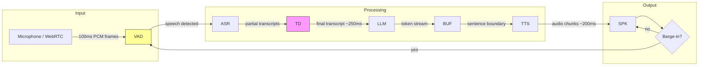

# Capstone 03 — Real-Time Voice Assistant (ASR to LLM to TTS)

## Learning Objectives

- **Wire a three-stage streaming pipeline** (ASR → LLM → TTS) that produces first audio output in under 800ms for a typical utterance.
- **Implement partial result forwarding** so each downstream stage begins work before the upstream stage completes.
- **Add barge-in (interruption) handling** using a shared state object that cancels in-flight generation and TTS playback when new speech is detected.
- **Measure and report pipeline latency** at each stage (ASR transcription, LLM first token, TTS first audio) against a fixed budget.
- **Augment the LLM stage with retrieval** so a voice agent grounds spoken responses in product documentation and case studies rather than parametric memory.

## The Problem

A voice assistant is three models stitched together under a latency budget. Speech must become text, text must become reasoning, reasoning must become speech — and the user notices every 100ms of delay. The naïve implementation treats each stage as a blocking HTTP call: record the full utterance, send it to ASR, wait for the transcript, send it to the LLM, wait for the full response, send it to TTS, wait for the audio, play it. Each "wait" is 200–2000ms. Stack four of them and your assistant feels like a walkie-talkie — press, release, wait, receive. Users hang up.

The 2025–2026 wave of voice platforms (OpenAI Realtime API, LiveKit Agents, Pipecat, Vapi, Retell) collapsed those waits by making every stage stream. ASR emits partial transcripts mid-utterance. The LLM yields tokens one at a time. TTS begins synthesis on sentence boundaries before generation completes. The architecture is an event stream, not a batch job. The capstone is to build this pipeline, measure where latency actually accumulates, and fix the failure modes that emerge under load: a VAD that fires on background noise, a turn-detector that waits for punctuation that never arrives in conversational speech, a TTS that buffers 400ms before emitting its first chunk.

Then there is the interaction problem. Humans interrupt each other constantly. When a user speaks while the assistant is mid-sentence, the pipeline must stop TTS playback, discard pending LLM tokens, feed the new audio to ASR, and begin a fresh response — all within the time it takes the user to say "actually, wait." Without barge-in handling, the assistant talks over the user. With poorly tuned barge-in, every background noise cancels the response and the assistant stutters. The hard problem is not wiring three API calls. It is making the resulting conversation feel like a phone call, not a form submission.

## The Concept

### The Three-Stage Pipeline and Its Latency Budget

Audio arrives in frames — typically 100–250ms chunks of PCM data sampled at 16kHz. Each stage of the pipeline operates on these frames incrementally rather than waiting for the complete utterance. The critical mechanism is **partial result forwarding**: each stage begins work before the upstream stage finishes, trading completeness for responsiveness.

The latency budget for conversational voice is roughly 800ms from end-of-user-speech to first-audio-out. Break that down: ASR needs to finalize the transcript (or at least reach high confidence) within 200–300ms after the user pauses. The LLM must emit its first token within 200–300ms of receiving the transcript. TTS must synthesize and begin streaming the first audio chunk within 200ms of receiving the first sentence. Everything else — remaining tokens, remaining audio — streams behind that first chunk. The user does not wait for the full response. They hear the beginning while the rest is still being generated.



### Audio Fundamentals That Determine Everything Else

Microphones capture PCM (pulse-code modulation) audio at a sample rate — 16kHz is standard for speech because it covers the frequency range of human voice (80Hz–8kHz) without wasting bandwidth on frequencies the ear cannot use for speech intelligibility. Each sample is a 16-bit integer representing amplitude. Frames are chunked into fixed-size buffers: 4096 samples at 16kHz equals 256ms of audio, which is a common frame size for streaming ASR.

Encoding matters at every boundary. Raw PCM is uncompressed — high quality, high bandwidth. μ-law (8kHz, 8-bit) is the PSTN telephone standard — low quality, low bandwidth. Opus is the modern codec used by WebRTC — it adapts bitrate to network conditions and handles packet loss gracefully. The pipeline must agree on format at every handoff. ASR expects a specific encoding (Whisper wants 16kHz mono PCM or a WAV/MP3 file). TTS produces a specific encoding (OpenAI TTS returns MP3, Opus, AAC, or FLAC). Mismatches cause either silent failures, garbled audio, or latency spikes from transcoding.

### Streaming vs. Request-Response Semantics

The difference between a voice assistant that feels live and one that feels queued is whether partial results cross stage boundaries. In request-response mode, each stage is a blocking call — ASR returns the full transcript, then the LLM receives it, then the LLM returns the full response, then TTS receives it. Total latency is the sum of all stages. In streaming mode, each stage opens a persistent connection (WebSocket, Server-Sent Events, or WebRTC data channel) and forwards partial results as they arrive. ASR sends interim transcripts that get progressively refined. The LLM yields tokens one at a time. TTS begins synthesis on sentence boundaries mid-generation. Total perceived latency is the maximum of the critical-path stages, not the sum — because they overlap.

The turn detector sits between ASR and the LLM. Its job is to decide when the user has finished speaking — or at least finished enough that the assistant should start responding. A simple turn detector uses a silence threshold (e.g., 700ms of audio below a volume floor). A trained turn detector (like the one in LiveKit's pipeline) uses a model that classifies end-of-turn from acoustic and linguistic features, handling cases like mid-sentence pauses and trailing filler words ("I was thinking... um..."). False positives (responding too early) cut users off. False negatives (waiting too long) add latency.

### Interruption Handling — The Hard Problem

When the user speaks while the assistant is responding, the pipeline must execute a coordinated cancellation across all three stages. This requires a shared state object — or a message bus — that every stage checks before producing output. The LLM loop checks the state before yielding the next token. The TTS consumer checks the state before synthesizing the next sentence. The audio player checks the state before playing the next chunk. When an interruption fires, the state flips, pending tokens are discarded, the audio buffer is flushed, and new audio from the microphone routes back to ASR.

Without this shared state, the LLM keeps generating into a void, TTS keeps synthesizing responses nobody will hear, and the audio queue grows until memory pressure or a user hangup kills the session. The coordination problem is not algorithmically complex — it is a boolean flag and a generation counter — but getting it right under concurrent threads and network latency is where most hand-built pipelines break.

## Build It

### Stage 1: Measure a Non-Streaming Baseline

Before streaming, measure the batch pipeline to see where latency accumulates. This establishes the budget you are trying to beat.

```python
import time
from openai import OpenAI

client = OpenAI()

LATENCY_BUDGET_MS = {
    "asr": 300,
    "llm_first_token": 300,
    "tts_first_audio": 200,
    "total_target": 800,
}

def measure_asr(audio_path):
    start = time.perf_counter()
    with open(audio_path, "rb") as f:
        transcript = client.audio.transcriptions.create(
            model="whisper-1",
            file=f,
        )
    elapsed_ms = (time.perf_counter() - start) * 1000
    print(f"[ASR] {elapsed_ms:.0f}ms — \"{transcript.text}\"")
    return transcript.text, elapsed_ms

def measure_llm(prompt, system_prompt="You are a concise voice assistant. Respond in under 30 words."):
    tokens = []
    first_token_ms = None
    start = time.perf_counter()

    stream = client.chat.completions.create(
        model="gpt-4o-mini",
        messages=[
            {"role": "system", "content": system_prompt},
            {"role": "user", "content": prompt},
        ],
        stream=True,
    )

    for chunk in stream:
        delta = chunk.choices[0].delta.content
        if delta:
            if first_token_ms is None:
                first_token_ms = (time.perf_counter() - start) * 1000
                print(f"[LLM] First token: {first_token_ms:.0f}ms")
            tokens.append(delta)
            print(delta, end="", flush=True)

    print()
    full_response = "".join(tokens)
    total_ms = (time.perf_counter() - start) * 1000
    print(f"[LLM] Complete: {total_ms:.0f}ms — {len(full_response)} chars")
    return full_response, first_token_ms or total_ms

def measure_tts(text, output_path="response.mp3"):
    start = time.perf_counter()
    response = client.audio.speech.create(
        model="tts-1",
        voice="alloy",
        input=text,
        response_format="mp3",
    )
    response.write_to_file(output_path)
    elapsed_ms = (time.perf_counter() - start) * 1000
    print(f"[TTS] {elapsed_ms:.0f}ms — wrote {output_path}")
    return elapsed_ms

def run_batch_pipeline(audio_path):
    print("=== Batch Pipeline (Non-Streaming) ===\n")
    t0 = time.perf_counter()

    transcript, asr_ms = measure_asr(audio_path)
    response, llm_first_ms = measure_llm(transcript)
    tts_ms = measure_tts(response)

    total_ms = (time.perf_counter() - t0) * 1000
    print(f"\n=== Latency Report ===")
    print(f"ASR:            {asr_ms:6.0f}ms  (budget: {LATENCY_BUDGET_MS['asr']}ms)")
    print(f"LLM first tok:  {llm_first_ms:6.0f}ms  (budget: {LATENCY_BUDGET_MS['llm_first_token']}ms)")
    print(f"TTS:            {tts_ms:6.0f}ms  (budget: {LATENCY_BUDGET_MS['tts_first_audio']}ms)")
    print(f"Total (serial): {total_ms:6.0f}ms  (target: {LATENCY_BUDGET_MS['total_target']}ms)")
    over = total_ms - LATENCY_BUDGET_MS["total_target"]
    print(f"Over budget:    {over:+.0f}ms")
    return total_ms

if __name__ == "__main__":
    run_batch_pipeline("input.wav")
```

Run this with a short WAV file (a few seconds of speech at 16kHz mono). The output will show total latency well above 800ms because each stage waits for the previous one to complete fully. That is your baseline. Now collapse the waits.

### Stage 2: Streaming Pipeline with Sentence-Boundary TTS

The streaming pipeline overlaps LLM generation and TTS synthesis. The LLM emits tokens into a queue. A sentence accumulator watches for sentence boundaries (`.`, `?`, `!`) and pushes complete sentences to a TTS queue as soon as they form. TTS synthesizes each sentence independently. The first sentence reaches TTS while the LLM is still generating the second.

```python
import threading
import queue
import time
import re
from openai import OpenAI

client = OpenAI()

SENTENCE_END = re.compile(r"[.!?]\s")

class StreamingVoicePipeline:
    def __init__(self):
        self.interrupted = False
        self.generation_id = 0
        self.tts_queue = queue.Queue()
        self.latency = {}

    def _generate_llm(self, transcript, system_prompt):
        gen_id = self.generation_id
        start = time.perf_counter()
        first_token_ms = None
        buffer = ""

        stream = client.chat.completions.create(
            model="gpt-4o-mini",
            messages=[
                {"role": "system", "content": system_prompt},
                {"role": "user", "content": transcript},
            ],
            stream=True,
        )

        for chunk in stream:
            if self.interrupted or self.generation_id != gen_id:
                print("\n[LLM] Barge-in detected — stopping generation")
                break
            delta = chunk.choices[0].delta.content
            if not delta:
                continue
            if first_token_ms is None:
                first_token_ms = (time.perf_counter() - start) * 1000
                self.latency["llm_first_token"] = first_token_ms
                print(f"[LLM] First token: {first_token_ms:.0f}ms")
            buffer += delta
            print(delta, end="", flush=True)

            while SENTENCE_END.search(buffer):
                match = SENTENCE_END.search(buffer)
                sentence = buffer[:match.end()].strip()
                buffer = buffer[match.end():]
                if sentence:
                    self.tts_queue.put(sentence)

        self.tts_queue.put(None)
        total_ms = (time.perf_counter() - start) * 1000
        self.latency["llm_total"] = total_ms
        print(f"\n[LLM] Generation complete: {total_ms:.0f}ms")

    def _synthesize_tts(self):
        gen_id = self.generation_id
        sentence_count = 0

        while True:
            sentence = self.tts_queue.get()
            if sentence is None or self.interrupted or self.generation_id != gen_id:
                break

            start = time.perf_counter()
            response = client.audio.speech.create(
                model="tts-1",
                voice="alloy",
                input=sentence,
                response_format="mp3",
            )
            elapsed_ms = (time.perf_counter() - start) * 1000
            sentence_count += 1

            if sentence_count == 1:
                self.latency["tts_first_audio"] = elapsed_ms
                print(f"[TTS] First sentence synthesized: {elapsed_ms:.0f}ms — \"{sentence[:60]}...\"")
            else:
                print(f"[TTS] Sentence {sentence_count}: {elapsed_ms:.0f}ms")

            filename = f"response_part_{sentence_count}.mp3"
            response.write_to_file(filename)

        print(f"[TTS] Synthesis complete — {sentence_count} sentence(s)")

    def interrupt(self):
        self.generation_id += 1
        self.interrupted = True
        self.tts_queue = queue.Queue()
        print("[PIPELINE] Interrupted — flushing all queues")

    def run(self, transcript, system_prompt="You are a concise voice assistant. Respond in under 40 words."):
        self.interrupted = False
        self.generation_id += 1
        self.latency = {}

        print("=== Streaming Pipeline ===\n")
        t0 = time.perf_counter()

        llm_thread = threading.Thread(
            target=self._generate_llm,
            args=(transcript, system_prompt),
        )
        tts_thread = threading.Thread(target=self._synthesize_tts)

        llm_thread.start()
        tts_thread.start()

        llm_thread.join()
        tts_thread.join()

        total_ms = (time.perf_counter() - t0) * 1000
        llm_first = self.latency.get("llm_first_token", 0)
        tts_first = self.latency.get("tts_first_audio", 0)
        time_to_first_audio = llm_first + tts_first

        print(f"\n=== Streaming Latency Report ===")
        print(f"LLM first token:     {llm_first:6.0f}ms")
        print(f"TTS first sentence:  {tts_first:6.0f}ms")
        print(f"Time to first audio: {time