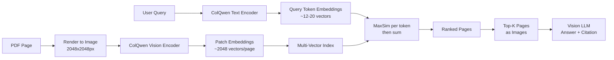

# Capstone 04 — Multimodal Document QA (Vision-First PDF, Tables, Charts)

## Learning Objectives

1. Build a vision-first PDF extraction pipeline that renders pages to images and extracts structured content using a multimodal LLM
2. Compare text-native extraction against vision-first extraction on table-heavy and chart-heavy pages, measuring structural fidelity
3. Implement a hybrid extraction strategy that runs text parsing first and falls back to vision on low-confidence or structurally complex pages
4. Deploy a document QA system that answers natural-language questions against multi-page PDFs with page-level source citations
5. Evaluate late-interaction multi-vector retrieval against OCR-then-text baselines on visual document content

## The Problem

Most B2B intelligence is locked inside PDFs that nobody reads in full. Security questionnaires run 80 pages. RFPs embed pricing matrices in tables with merged cells and color-coded tiers. Analyst reports present market sizing as stacked bar charts where the numbers exist only as visual pixels — the text layer contains axis labels and a title, nothing more. Competitor battlecards scatter annotations across slides exported to PDF. When a RevOps team needs to know what a vendor proposed for enterprise pricing in last quarter's RFP, someone opens the PDF, scrolls, and guesses.

Text-only extraction tools — pdfplumber, PyPDF2, pdfminer — parse the embedded text layer and return whatever characters the PDF author placed there. This works adequately on born-digital documents with clean, linear structure. It fails silently on three categories that matter most for business intelligence: tables with merged cells or nested headers, where the spatial layout carries the meaning; charts and diagrams, where the data exists only as rendered pixels; and scanned documents, where the text layer is absent entirely. A pdfplumber extraction of a pricing table might return the right words but flatten the row-column relationships into a string of numbers with no structure. A chart returns its title and axis labels — the actual data points are invisible to a text parser.

The production answer is vision-first extraction: render each page to an image and ask a multimodal model to read it the way a human would. ColPali, introduced by Illuin Tech, formalized this as late-interaction multi-vector retrieval — treating each page as an image, embedding it into ~2048 patch vectors, and letting a query attend to specific visual regions directly. Successors like ColQwen2.5 and ColQwen3-omni pushed accuracy further. On the ViDoRe benchmark, vision-first retrieval beats OCR-then-text baselines on financial filings, scientific papers, and handwritten notes, and the gap widens precisely on the content types that text parsers fail: charts, complex tables, and diagrams.

The trade-off is real. A ColQwen embedding is ~2048 vectors per page, not a single pooled vector. Storage balloons. Inference latency per page is higher than text parsing. DocPruner (2026) addresses this by pruning 50% of patch vectors without measurable accuracy loss on ViDoRe v3. For document QA systems, the accuracy gain on visual content justifies the storage cost — the alternative is an answer that is confidently wrong because a table's structure was lost in text extraction.

## The Concept

Two extraction paradigms exist for PDFs, and the choice between them is the single most important architectural decision in a document QA pipeline. Text-native extraction parses the embedded text layer. Libraries like pdfplumber attempt to reconstruct table structure by analyzing text coordinates and whitespace patterns. This is fast (milliseconds per page), cheap (no model calls), and deterministic. It works on born-digital PDFs with clean structure. It fails when the text layer is absent, when table structure depends on visual cues like merged cells and colored headers, or when the content is fundamentally visual rather than textual.

Vision-first extraction renders each page to a PNG and sends it to a vision-language model. The model sees what a human sees: layout, visual hierarchy, chart geometry, table borders, color coding, and spatial relationships. It can extract table structure by reading it visually, infer chart data points from bar heights or pie slice proportions, and understand the relationship between a figure and its caption. This is slower (seconds per page), more expensive (model API calls), and non-deterministic. But it recovers semantic content that text parsers cannot access by design — the information is encoded in pixels, not in the text layer.

The retrieval mechanism behind vision-first QA at scale is **late-interaction multi-vector scoring**. Instead of compressing a page into a single embedding vector, the vision encoder produces one embedding per spatial patch — roughly 2048 vectors per page. At query time, each query token embedding is compared against every patch vector. The maximum similarity for each query token is found, and these maxima are summed to produce the page's relevance score. This lets the query attend to specific visual regions without compressing the page into a single vector that would average away spatial detail.

The scoring function is `score(query, doc) = Σ_i max_j (q_i · d_j)` where `q_i` is the i-th query token embedding and `d_j` is the j-th document patch embedding. This is the mechanism that makes vision-first retrieval work at scale — it avoids the information bottleneck of pooling a rich visual page into a single vector before the query has a chance to inspect specific regions.

For production cost optimization, a **hybrid pipeline** runs text extraction first on every page (cheap, fast), flags pages where text extraction returns low confidence or where structural elements are detected, and sends only those flagged pages through the