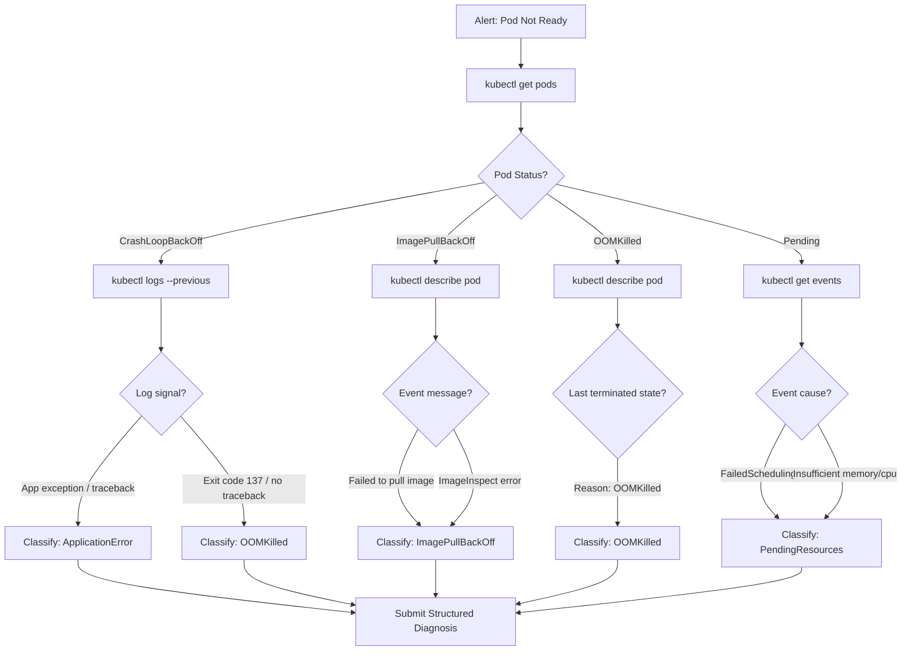

# Capstone 06 — DevOps Troubleshooting Agent for Kubernetes

## Learning Objectives

1. Build a multi-step agent that diagnoses Kubernetes failures by chaining `kubectl` commands through structured tool use
2. Implement a diagnostic decision tree that classifies pod failures (CrashLoopBackOff, ImagePullBackOff, OOMKilled, Pending) and selects remediation paths
3. Configure structured output schemas for incident reports consumable by PagerDuty or Slack webhooks
4. Evaluate diagnostic accuracy against synthetic cluster failures with deterministic validation

## The Problem

An on-call engineer gets paged at 2:47 AM. A pod is crash-looping in production. The first fifteen minutes are not reasoning — they are running `kubectl get pods`, then `kubectl describe pod`, then scrolling through events, then `kubectl logs --previous`, then checking the deployment spec, then correlating node-level metrics with the pod timeline. Mean-time-to-resolution is dominated by this information-gathering loop, not by the diagnostic reasoning that follows it. A senior SRE already knows the decision tree: CrashLoopBackOff means check previous logs, ImagePullBackOff means check the image tag and registry credentials, OOMKilled means check resource limits and memory usage. The expertise is well-defined. The bottleneck is executing the gathering fast enough that the reasoning can happen before the SLA burns.

The 2025 landscape made this pattern concrete. AWS's DevOps Agent went GA with read-only K8s diagnostics. Resolve AI published its K8s troubleshooting playbooks. NeuBird demoed semantic monitoring that walks cluster topology. Metoro tied AI-driven SRE to per-service SLOs. PagerDuty AIOps added intelligent triage. [CITATION NEEDED — concept: AWS DevOps Agent GA, product naming and feature set] The production shape is now settled: an alert webhook fires, an agent reads telemetry and walks the K8s object graph, ranks root-cause hypotheses, and posts a structured brief with approval buttons. Read-only by default. Every remediation gated by a human.

Most of the hard engineering is not in the LLM reasoning. It is in scoping the tool surface so the agent cannot do something destructive, encoding the diagnostic decision tree so the model follows the right path, producing output structured enough to feed into incident management systems, and evaluating diagnostic accuracy so you can trust the agent enough to wire it into PagerDuty. This capstone builds that agent from tool definitions through evaluation.

## The Concept

The agent implements a ReAct loop — reason, act, observe — over a restricted set of Kubernetes tools. Each tool invocation is a single bounded `kubectl` command. The LLM receives the alert context, decides which tool to call, processes the output, then decides: call another tool or produce a diagnosis. The loop terminates when the model calls a `submit_diagnosis` tool with a structured payload. The diagnostic decision tree is not hardcoded in Python — it is encoded in the system prompt as reasoning instructions. The model reads the prompt, observes tool output, and navigates the tree autonomously.



The critical design decision is tool surface width. A generic shell executor — "run any command" — gives the model maximum flexibility but minimum reliability. The model can issue `kubectl delete` or curl arbitrary endpoints. It can also spend twenty tool calls exploring irrelevant paths. A narrow surface of five focused tools (`get_pods`, `describe_pod`, `get_logs`, `get_events`, `get_resource_utilization`) constrains the agent to productive diagnostic steps. Every tool is read-only. The model cannot cause harm even if it tries. And because the tools are typed with structured input schemas, the model's tool calls are predictable and testable — you can write synthetic cluster states and verify the agent navigates the decision tree correctly.

The failure classifier is the system prompt's core. It maps observed symptoms — pod status, exit codes, event messages, log patterns — to one of five categories: `CrashLoopBackOff` (application error), `ImagePullBackOff` (image or registry issue), `OOMKilled` (memory limit exceeded), `Pending` (scheduling or resource constraints), and `Healthy` (false positive alert). Each category carries remediation steps the agent includes in its diagnosis. The prompt does not say "diagnose the problem" — it says "follow this decision tree, call tools to gather evidence, classify the failure, and submit a structured diagnosis with confidence."

## Build It

### Stage 1: Tool Definitions

Each tool is a function with a structured input schema and a command builder. The schema enforces types at the boundary — the LLM cannot pass a namespace with shell injection characters because the command is assembled from validated parameters, not string concatenation.

```python
import json
import subprocess
from dataclasses import dataclass, field
from typing import Any, Optional

@dataclass
class ToolSchema:
    properties: dict
    required: list[str]

@dataclass
class KubectlTool:
    name: str
    description: str
    schema: ToolSchema
    command_template: str

    def build_command(self, params: dict[str, Any]) -> str:
        validated = {}
        for key, value in params.items():
            if key in self.schema.properties:
                expected_type = self.schema.properties[key]["type"]
                if expected_type == "string" and isinstance(value, str):
                    if not all(c.isalnum() or c in "-._/" for c in value):
                        raise ValueError(f"Invalid characters in parameter: {key}={value}")
                    validated[key] = value
                elif expected_type == "integer" and isinstance(value, int):
                    validated[key] = str(value)
                else:
                    raise ValueError(f"Type mismatch for {key}: expected {expected_type}")
        for req in self.schema.required:
            if req not in validated:
                raise ValueError(f"Missing required parameter: {req}")
        return self.command_template.format(**validated)

GET_PODS = KubectlTool(
    name="kubectl_get_pods",
    description="List pods in a namespace with status, restarts, and age. Use this first to identify the failing pod and its current state.",
    schema=ToolSchema(
        properties={"namespace": {"type": "string"}, "label_selector": {"type": "string"}},
        required=["namespace"],
    ),
    command_template="kubectl get pods -n {namespace} -o wide" + " -l {label_selector}" * 0,
)

DESCRIBE_POD = KubectlTool(
    name="kubectl_describe_pod",
    description="Get full pod details including events, node assignment, resource limits, and last terminated state. Use when you need to check why a pod failed.",
    schema=ToolSchema(
        properties={"namespace": {"type": "string"}, "pod_name": {"type": "string"}},
        required=["namespace", "pod_name"],
    ),
    command_template="kubectl describe pod {pod_name} -n {namespace}",
)

GET_LOGS = KubectlTool(
    name="kubectl_get_logs",
    description="Retrieve pod logs. Set previous=true to get logs from the last crashed container instance. Essential for CrashLoopBackOff diagnosis.",
    schema=ToolSchema(
        properties={
            "namespace": {"type": "string"},
            "pod_name": {"type": "string"},
            "previous": {"type": "integer"},
            "tail_lines": {"type": "integer"},
        },
        required=["namespace", "pod_name"],
    ),
    command_template="kubectl logs {pod_name} -n {namespace} --tail={tail_lines}" + " --previous" * 0,
)

GET_EVENTS = KubectlTool(
    name="kubectl_get_events",
    description="List recent cluster events for a namespace. Use to find scheduling failures, image pull errors, and probe failures.",
    schema=ToolSchema(
        properties={"namespace": {"type": "string"}},
        required=["namespace"],
    ),
    command_template="kubectl get events -n {namespace} --sort-by=.lastTimestamp",
)

GET_TOP = KubectlTool(
    name="kubectl_get_top",
    description="Show CPU and memory usage for pods or nodes. Use when investigating OOMKilled or resource contention.",
    schema=ToolSchema(
        properties={"namespace": {"type": "string"}, "resource_type": {"type": "string"}},
        required=["namespace", "resource_type"],
    ),
    command_template="kubectl top {resource_type} -n {namespace}",
)

DIAGNOSTIC_TOOLS = [GET_PODS, DESCRIBE_POD, GET_LOGS, GET_EVENTS, GET_TOP]

for tool in DIAGNOSTIC_TOOLS:
    cmd = tool.build_command({"namespace": "production", "pod_name": "api-server-abc123", "previous": 1, "tail_lines": 100, "resource_type": "pods", "label_selector": "app=api"})
    print(f"{tool.name:25s} -> {cmd}")

print("\n--- Injection attempt test ---")
try:
    GET_LOGS.build_command({"namespace": "prod; rm -rf /", "pod_name": "test"})
except ValueError as e:
    print(f"Blocked: {e}")
```

### Stage 2: ReAct Loop

The ReAct loop wires these tools into an agent that terminates when it submits a structured diagnosis. In production this loop calls Claude or GPT-4 through their tool-use APIs. Here we demonstrate the loop with a mock that follows the same decision tree the system prompt encodes — so you can trace the mechanism without an API key.

```python
import textwrap

FAILURE_CATEGORIES = {
    "CrashLoopBackOff_ApplicationError": {
        "description": "Application code throws an unhandled exception causing the container to exit with a non-zero code.",
        "remediation": [
            "Check the application traceback in previous container logs",
            "Identify the exception type and failing code path",
            "Fix the bug or add error handling, rebuild and redeploy the image",
            "Consider adding a liveness probe with a longer initialDelaySeconds",
        ],
    },
    "ImagePullBackOff": {
        "description": "Kubernetes cannot pull the container image from the registry.",
        "remediation": [
            "Verify the image tag exists in the registry",
            "Check that the imagePullSecret is configured and valid",
            "Verify network policies allow egress to the container registry",
            "If using a private registry, ensure the service account has the correct imagePullSecrets",
        ],
    },
    "OOMKilled": {
        "description": "The container exceeded its memory limit and was killed by the kernel OOM killer.",
        "remediation": [
            "Increase the container memory limit in the deployment spec",
            "Profile the application for memory leaks",
            "Check if a recent deploy increased memory usage (new dependencies, larger payloads)",
            "Consider adding a horizontal pod autoscaler with memory-based scaling",
        ],
    },
    "Pending_InsufficientResources": {
        "description": "The pod cannot be scheduled because no node has sufficient resources.",
        "remediation": [
            "Check node capacity with kubectl describe nodes",
            "Reduce pod resource requests if they are over-provisioned",
            "Add nodes to the cluster or enable cluster autoscaling",
            "Review resource quotas and limitranges in the namespace",
        ],
    },
    "Healthy_FalsePositive": {
        "description": "The pod appears healthy based on diagnostics. The alert may be a false positive.",
        "remediation": [
            "Verify the alert rule thresholds",
            "Check if the monitoring system itself is healthy",
            "Confirm the alert was not triggered by a brief transient condition",
        ],
    },
}

SYSTEM_PROMPT = textwrap.dedent("""\
You are a Kubernetes incident diagnosis agent. You receive an alert about a pod
and must diagnose the root cause using the provided kubectl tools.

DIAGNOSTIC DECISION TREE:
1. Call kubectl_get_pods to find the failing pod and its status.
2. Based on pod status, follow the matching branch:
   - CrashLoopBackOff: call kubectl_get_logs with previous=1. Look for:
     * Application traceback/exception -> CrashLoopBackOff_ApplicationError
     * Exit code 137, no traceback -> OOMKilled
   - ImagePullBackOff: call kubectl_describe_pod. Check events for:
     * "Failed to pull image" or "ImagePullBackOff" -> ImagePullBackOff
   - OOMKilled: call kubectl_describe_pod. Check Last State:
     * Reason: OOMKilled -> OOMKilled
   - Pending: call kubectl_get_events. Check for:
     * "FailedScheduling" or "Insufficient" -> Pending_InsufficientResources
3. If all diagnostics show healthy status, classify as Healthy_FalsePositive.
4. Call submit_diagnosis with the failure type, root cause, and remediation steps.

RULES:
- Never execute write operations. All tools are read-only.
- Always gather evidence before submitting a diagnosis.
- Include specific log lines or event messages as evidence.
- If evidence is ambiguous, note it in the confidence field.
""")

MOCK_CLUSTER_STATE = {
    "kubectl_get_pods": {
        "stdout": textwrap.dedent("""\
            NAME                               READY   STATUS             RESTARTS   AGE
            api-server-7d4b6c8f9-x2k4m         0/1     CrashLoopBackOff   7          18m
            api-server-7d4b6c8f9-p9l3n         1/1     Running            0          18m
            worker-cron-5e8f2a1b3-m4n7q        1/1     Running            0          5h
            """),
    },
    "kubectl_get_logs": {
        "stdout": textwrap.dedent("""\
            Traceback (most recent call last):
              File "/app/main.py", line 47, in <module>
                db = connect_database(os.environ["DATABASE_URL"])
              File "/app/db.py", line 12, in connect_database
                conn = psycopg2.connect(url)
              File "/usr/local/lib/python3.11/site-packages/psycopg2/__init__.py", line 122, in connect
                conn = _connect(dsn, connection_factory=connection_factory, **kw)
            psycopg2.OperationalError: could not connect to server: Connection refused
                Is the server running on host 10.0.1.25 and accepting TCP/IP connections on port 5432?
            """),
    },
    "kubectl_describe_pod": {
        "stdout": textwrap.dedent("""\
            Name:         api-server-7d4b6c8f9-x2k4m
            Namespace:    production
            Status:       Running
            Last State:   Terminated
              Reason:     Error
              Exit Code:  1
              Started:    2025-01-15T02:29:00Z
              Finished:   2025-01-15T02:29:12Z
            Restart Count: 7
            """),
    },
    "kubectl_get_events": {
        "stdout": textwrap.dedent("""\
            LAST SEEN   TYPE      REASON             MESSAGE
            3m          Normal    Pulled             Successfully pulled image "registry.example.com/api:v2.3.1"
            3m          Normal    Created            Created container api-server
            3m          Normal    Started            Started container api-server
            2m          Warning   BackOff            Back-off restarting failed container
            """),
    },
}

def execute_tool(tool_name: str, params: dict) -> str:
    tool_map = {t.name: t for t in DIAGNOSTIC_TOOLS}
    if tool_name not in tool_map:
        return f"Error: unknown tool {tool_name}"
    cmd = tool_map[tool_name].build_command(params)
    print(f"  [TOOL CALL] {cmd}")
    mock = MOCK_CLUSTER_STATE.get(tool_name, {"stdout": "No output"})
    return mock["stdout"]

def mock_react_diagnosis(alert: dict) -> dict:
    print(f"[ALERT] {alert['severity']} - {alert['message']}")
    print(f"[PROMPT] System prompt loaded ({len(SYSTEM_PROMPT)} chars)")
    print(f"\n[REACT LOOP START]")

    steps = []
    step_count = 0

    print(f"\n--- Step {step_count + 1}: Reason ---")
    print("  Thought: Alert mentions CrashLoopBackOff. Need to list pods to confirm.")
    obs = execute_tool("kubectl_get_pods", {"namespace": "production"})
    steps.append({"tool": "kubectl_get_pods", "observation": obs})
    print(f"  Observation: api-server-7d4b6c8f9-x2k4m is CrashLoopBackOff (7 restarts)")
    step_count += 1

    print(f"\n--- Step {step_count + 1}: Reason ---")
    print("  Thought: CrashLoopBackOff detected. Need previous logs to find the crash cause.")
    obs = execute_tool("kubectl_get_logs", {"namespace": "production", "pod_name": "api-server-7d4b6c8f9-x2k4m", "previous": 1, "tail_lines": 50})
    steps.append({"tool": "kubectl_get_logs", "observation": obs})
    print("  Observation: Python traceback found - psycopg2.OperationalError: connection refused")
    step_count += 1

    print(f"\n--- Step {step_count + 1}: Reason ---")
    print("  Thought: Application traceback confirms code-level failure, not OOM. ")
    print("  Exit code is 1 (application error), not 137 (OOM). Classify as CrashLoopBackOff_ApplicationError.")
    print("  Action: submit_diagnosis")
    step_count += 1

    diagnosis = {
        "failure_type": "CrashLoopBackOff_ApplicationError",
        "root_cause": "Database connection failure: psycopg2.OperationalError - could not connect to server on 10.0.1.25:5432",
        "affected_resources": ["api-server-7d4b6c8f9-x2k4m"],
        "evidence": [
            "Pod status: CrashLoopBackOff, 7 restarts in 18 minutes",
            "Previous container logs show: psycopg2.OperationalError: could not connect to server",
            "Exit code: 1 (application error, not OOM kill code 137)",
        ],
        "remediation_steps": FAILURE_CATEGORIES["CrashLoopBackOff_ApplicationError"]["remediation"],
        "confidence": 0.92,
        "steps_taken": step_count,
    }

    print(f"\n[REACT LOOP END] {step_count} tool calls")
    print(f"[