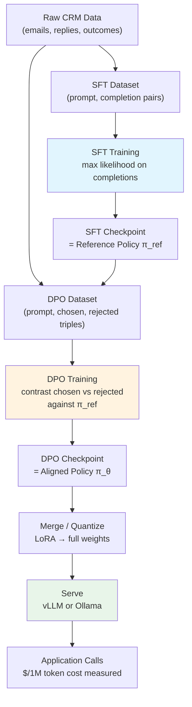

# Capstone 07 — End-to-End Fine-Tuning Pipeline (Data to SFT to DPO to Serve)

## Learning Objectives

1. **Build** an end-to-end fine-tuning pipeline that takes raw JSONL data through SFT, DPO, and local inference in a single reproducible script.
2. **Trace** the data contract changes across pipeline stages — prompt/completion pairs for SFT, chosen/rejected pairs for DPO — and diagnose failures when contracts are violated.
3. **Compare** base, SFT-aligned, and DPO-aligned model outputs on the same prompts to observe the behavioral effects of each optimization objective.
4. **Configure** a serving endpoint (vLLM or Ollama) with the DPO-aligned adapter and validate output conformance against a schema.
5. **Explain** why SFT must precede DPO in the pipeline ordering, using the mechanism of reference-policy initialization.

## The Problem

You have done SFT in isolation. You have run DPO against a pre-trained reference model in isolation. Neither exercise prepared you for the thing that actually matters: chaining them together so that the output of one stage becomes the input contract of the next, and the final artifact is something you can serve to real users.

The failure modes of a broken pipeline are not subtle. Skip SFT and jump straight to DPO on a base model, and the reference policy has no task competence — DPO will steer the model away from rejected outputs but toward nothing useful, because the model never learned what the task looks like in the first place. Run SFT but skip DPO, and the model produces fluent on-task outputs that ignore preference signals — it will happily generate the verbose, generic, tone-deaf completions that your SFT data contained because you had no mechanism to penalize them. Mess up the data format between stages — say, pass chat-formatted strings to DPO when it expects raw prompt-chosen-rejected triples — and the trainer will either silently produce garbage or throw an error three hours into a GPU run.

This capstone strings the full pipeline together: raw data ingestion, supervised fine-tuning, preference alignment, and inference. The stack is TRL's `SFTTrainer` and `DPOTrainer`, a small open model (Qwen2.5-0.5B — chosen because it trains in minutes on a single consumer GPU and produces observable behavioral changes even at small scale), and vLLM or Ollama for serving. The point is not the model size. The point is that you can run the entire loop end to end, observe the output differences at each stage, and diagnose where things break.

The GTM application is immediate. Personalized outbound at scale — Zone 3 engagement — requires generating hundreds of prospect-specific emails that sound like your best SDR wrote them. You can prompt GPT-4 for each one and pay per-token costs that scale linearly with volume, or you can fine-tune a small model on your historical outreach data where "preferred" completions booked meetings and "rejected" completions were ignored. The fine-tuned model runs on your own infrastructure, has no per-prompt token cost, and encodes your house style without needing few-shot examples stuffed into a context window. The pipeline you build here is the mechanism that produces that model.

## The Concept

The pipeline has four stages, each with a distinct optimization objective and data contract.

**Stage 1 — Data preparation.** You need two datasets. The SFT dataset contains prompt-completion pairs: given input X, the model should produce output Y. The DPO dataset contains prompt-chosen-rejected triples: given input X, completion A is preferred over completion B. These datasets can be derived from the same source — for GTM outreach, your CRM's email history — but they have different structures. The SFT dataset teaches the model what a good email looks like. The DPO dataset teaches it which of two emails is better.

**Stage 2 — Supervised Fine-Tuning (SFT).** SFT optimizes via maximum likelihood estimation: for each prompt-completion pair, the model adjusts its weights to increase the probability it assigns to the correct completion given the prompt. The loss function is cross-entropy over the completion tokens. After SFT, the model can produce on-task outputs — it knows the format, the tone, the structure of your outreach emails. But it has no notion of relative quality. It will produce completions that look like the average of your training data, including the mediocre examples.

**Stage 3 — Direct Preference Optimization (DPO).** DPO takes the SFT checkpoint as its starting point — this becomes the reference policy, denoted π_ref. For each preference triple, DPO computes the log-probability the reference model assigns to the chosen completion and to the rejected completion. It then optimizes a new policy π_θ to increase the margin between chosen and rejected log-probabilities, using the loss function:

```
L_DPO = -log σ(β · [log π_θ(y_chosen|x) - log π_ref(y_chosen|x) - log π_θ(y_rejected|x) + log π_ref(y_rejected|x)])
```

The β parameter controls how far the optimized policy can drift from the reference. Higher β means more aggressive preference optimization. Lower β means the model stays closer to the SFT checkpoint. The key insight: DPO does not need a separate reward model. The reference policy implicitly defines the reward, and the optimization directly adjusts the language model weights. This is why DPO replaced RLHF's PPO loop in most production pipelines — it collapses a two-stage process (train reward model, then optimize policy against it) into a single stage.

**Stage 4 — Serving.** The DPO checkpoint (either full weights or a LoRA adapter merged into the base model) is loaded into an inference engine. vLLM provides continuous batching and PagedAttention for throughput. Ollama provides a simpler single-model server for development. The served model is what your application calls.



The ordering constraint is non-negotiable. SFT must come before DPO because DPO's reference policy needs task competence. If you run DPO on a raw base model, the reference assigns near-uniform probabilities to all completions (the base model has no idea what an outreach email looks like), so the preference signal is noise. Run SFT first, and the reference model knows what good emails look like — now DPO can meaningfully distinguish between a preferred email and a rejected one because both have non-trivial probabilities under the reference.

For the GTM context: the SFT dataset is your best-performing outreach emails (the ones that booked meetings). The DPO dataset pairs those same emails against ignored or unsubscribed variants. After the full pipeline, you have a model that writes in your voice, for your ICP, with an implicit understanding of what gets replies and what gets deleted. The per-prompt inference cost is the compute to run a 0.5B–8B model, not an API call to a frontier model.

## Build It

Here is a single Python script that runs the full pipeline. It creates synthetic GTM outreach data, runs SFT on Qwen2.5-0.5B, runs DPO on the SFT checkpoint, and prints side-by-side comparisons of base vs SFT vs DPO outputs.

This script requires a CUDA GPU (even a single T4 on Google Colab works) and the following packages:

```bash
pip install torch transformers trl datasets peft accelerate
```

```python
import json
import torch
from datasets import Dataset
from transformers import AutoModelForCausalLM, AutoTokenizer, TrainingArguments
from trl import SFTTrainer, SFTConfig, DPOTrainer, DPOConfig
from peft import LoraConfig, PeftModel

MODEL_NAME = "Qwen/Qwen2.5-0.5B"
OUTPUT_DIR = "./capstone_pipeline"
SFT_DIR = f"{OUTPUT_DIR}/sft"
DPO_DIR = f"{OUTPUT_DIR}/dpo"

sft_data = [
    {"prompt": "Write a cold email to a VP of Sales at a B2B SaaS company about reducing sales cycle length.",
     "completion": "Hi {first_name}, noticed your team's growth since the Series B. Most VPs of Sales we work with in B2B SaaS see 20-30% of deals stall in the proposal stage. We built a tool that surfaces stalling deals before they die. Worth a 15-minute call next week?"},
    {"prompt": "Write a follow-up email after no response to a cold outreach.",
     "completion": "Hi {first_name}, following up on my note from last week. One thing I forgot to mention: the three companies closest to your profile all implemented this in under two weeks. Happy to walk you through what that looked like. Does Tuesday or Thursday work?"},
    {"prompt": "Write a cold email to a Head of Marketing about content personalization.",
     "completion": "Hi {first_name}, saw your recent post about scaling personalized content. Most marketing teams hit a ceiling around 500 pieces per month. We help teams break past that without adding headcount. Open to seeing how it works?"},
    {"prompt": "Write a re-engagement email to a cold prospect who went dark.",
     "completion": "Hi {first_name}, it's been a few weeks since we last talked. I'm assuming either the timing isn't right or this isn't a priority. If it's the latter, no worries — I'll close the loop. If timing is the issue, would next quarter make more sense?"},
    {"prompt": "Write a cold email to a CFO about reducing SaaS spend.",
     "completion": "Hi {first_name}, most CFOs we work with discover 15-20% of their SaaS stack is either redundant or unused. We run an automated audit that surfaces that waste in 48 hours. The last company we worked with found $180K in annual savings. Worth a quick conversation?"},
    {"prompt": "Write a break-up email to an unresponsive prospect.",
     "completion": "Hi {first_name}, I'll stop reaching out after this. If reducing your customer acquisition cost becomes a priority down the road, you know where to find me. Appreciate your time either way."},
    {"prompt": "Write a cold email to a Head of People Ops about onboarding automation.",
     "completion": "Hi {first_name}, most People Ops teams spend 40+ hours per new hire on manual onboarding tasks. We automate the paperwork, IT provisioning, and checklist management so your team can focus on the human side of onboarding. Would a demo be useful?"},
    {"prompt": "Write a value proposition email to a Director of Engineering.",
     "completion": "Hi {first_name}, engineering teams using our platform ship 2x faster because we eliminate the context-switching tax between planning, coding, and review. No rip-and-replace — we sit on top of your existing tools. Curious to see the workflow?"},
]

dpo_data = [
    {"prompt": "Write a cold email to a VP of Sales at a B2B SaaS company about reducing sales cycle length.",
     "chosen": "Hi {first_name}, noticed your team's growth since the Series B. Most VPs of Sales in B2B SaaS see 20-30% of deals stall in the proposal stage. We built a tool that surfaces stalling deals before they die. Worth a 15-minute call next week?",
     "rejected": "Dear Sir/Madam, I hope this email finds you well. I am writing to inform you about our revolutionary sales acceleration platform that will transform your business. Our cutting-edge AI-powered solution leverages synergistic paradigms to optimize your sales pipeline and maximize revenue generation. Please find attached our brochure for your perusal."},
    {"prompt": "Write a follow-up email after no response to a cold outreach.",
     "chosen": "Hi {first_name}, following up on my note from last week. One thing I forgot to mention: the three companies closest to your profile all implemented this in under two weeks. Happy to walk you through what that looked like. Does Tuesday or Thursday work?",
     "rejected": "Hi {first_name}, I wanted to reach out again because I haven't heard back from you. Our platform is really amazing and I think you would benefit greatly from it. Please let me know when you are available for a demo. I am very flexible and can work around your schedule. Looking forward to hearing from you soon."},
    {"prompt": "Write a cold email to a Head of Marketing about content personalization.",
     "chosen": "Hi {first_name}, saw your recent post about scaling personalized content. Most marketing teams hit a ceiling around 500 pieces per month. We help teams break past that without adding headcount. Open to seeing how it works?",
     "rejected": "Hello! Are you struggling with content creation? You're not alone! Many marketers face this challenge. Our all-in-one content marketing platform is the solution you've been looking for. With features like AI writing, SEO optimization, and social media scheduling, you'll never run out of content ideas again! Sign up today for a free trial!"},
    {"prompt": "Write a break-up email to an unresponsive prospect.",
     "chosen": "Hi {first_name}, I'll stop reaching out after this. If reducing your customer acquisition cost becomes a priority down the road, you know where to find me. Appreciate your time either way.",
     "rejected": "Hi {first_name}, This is my final attempt to contact you. I have sent multiple emails and have not received any response. I find this very unprofessional. If you are not interested, the least you could do is let me know. I will be closing your account if I do not hear back within 48 hours."},
]

def format_sft(example):
    return {"text": f"### Prompt:\n{example['prompt']}\n\n### Response:\n{example['completion']}"}

def format_dpo(example):
    return {
        "prompt": f"### Prompt:\n{example['prompt']}\n\n### Response:\n",
        "chosen": example["chosen"],
        "rejected": example["rejected"],
    }

sft_dataset = Dataset.from_list([format_sft(e) for e in sft_data])
dpo_dataset = Dataset.from_list([format_dpo(e) for e in dpo_data])

print("=" * 70)
print("STAGE 1: DATA PREP")
print("=" * 70)
print(f"SFT examples: {len(sft_dataset)}")
print(f"DPO examples: {len(dpo_dataset)}")
print(f"\nSample SFT formatted entry:\n{sft_dataset[0]['text'][:200]}...")
print(f"\nSample DPO formatted entry:")
print(f"  Prompt: {dpo_dataset[0]['prompt'][:80]}...")
print(f"  Chosen: {dpo_dataset[0]['chosen'][:80]}...")
print(f"  Rejected: {dpo_dataset[0]['rejected'][:80]}...")

tokenizer = AutoTokenizer.from_pretrained(MODEL_NAME)
tokenizer.pad_token = tokenizer.eos_token

print("\n" + "=" * 70)
print("STAGE 2: SFT")
print("=" * 70)

sft_model = AutoModelForCausalLM.from_pretrained(
    MODEL_NAME,
    torch_dtype=torch.float16,
    device_map="auto",
)

lora_config = LoraConfig(
    r=16,
    lora_alpha=32,
    lora_dropout=0.05,
    bias="none",
    task_type="CAUSAL_LM",
    target_modules=["q_proj", "v_proj", "k_proj", "o_proj"],
)

sft_config = SFTConfig(
    output_dir=SFT_DIR,
    num_train_epochs=3,
    per_device_train_batch_size=2,
    learning_rate=2e-4,
    logging_steps=2,
    save_strategy="epoch",
    warmup_ratio=0.1,
    max_seq_length=512,
    packing=False,
)

sft_trainer = SFTTrainer(
    model=sft_model,
    args=sft_config,
    train_dataset=sft_dataset,
    processing_class=tokenizer,
    peft_config=lora_config,
)

sft_trainer.train()
sft_trainer.save_model(SFT_DIR)
print(f"SFT checkpoint saved to {SFT_DIR}")

sft_model = sft_model.merge_and_unload()
sft_model.save_pretrained(f"{SFT_DIR}/merged")
tokenizer.save_pretrained(f"{SFT_DIR}/merged")

del sft_model, sft_trainer
torch.cuda.empty_cache()

print("\n" + "=" * 70)
print("STAGE 3: DPO")
print("=" * 70)

sft_merged_model = AutoModelForCausalLM.from_pretrained(
    f"{SFT_DIR}/merged",
    torch_dtype=torch.float16,
    device_map="auto",
)

dpo_config = DPOConfig(
    output_dir=DPO_DIR,
    num_train_epochs=2,
    per_device_train_batch_size=2,
    learning_rate=5e-5,
    beta=0.1,
    logging_steps=2,
    save_strategy="epoch",
    max_length=512,
    max_prompt_length=256,
    warmup_ratio=0.1,
)

dpo_trainer = DPOTrainer(
    model=sft_merged_model,
    ref_model=None,
    args=dpo_config,
    train_dataset=dpo_dataset,
    processing_class=tokenizer,
    peft_config=LoraConfig(
        r=16,
        lora_alpha=32,
        lora_dropout=0.05,
        bias="none",
        task_type="CAUSAL_LM",
        target_modules=["q_proj", "v_proj", "k_proj", "o_proj"],
    ),
)

dpo_trainer.train()
dpo_trainer.save_model(DPO_DIR)
print(f"DPO checkpoint saved to {DPO_DIR}")

del sft_merged_model, dpo_trainer
torch.cuda.empty_cache()

print("\n" + "=" * 70)
print("STAGE 4: INFERENCE COMPARISON")
print("=" * 70)

test_prompt = "### Prompt:\nWrite a cold email to a CEO about improving board reporting.\n\n### Response:\n"

base_model = AutoModelForCausalLM.from_pretrained(
    MODEL_NAME, torch_dtype=torch.float16, device_map="auto"
)

sft_loaded = AutoModelForCausalLM.from_pretrained(
    f"{SFT_DIR}/merged", torch_dtype=torch.float16, device_map="auto"
)

dpo_base = AutoModelForCausalLM.from_pretrained(
    f"{SFT_DIR}/merged", torch_dtype=torch.float16, device_map="auto"
)
dpo_model = PeftModel.from_pretrained(dpo_base, DPO_DIR)

inputs = tokenizer(test_prompt, return_tensors="pt").to(base_model.device)

def generate(model, inputs, max_new_tokens=150):
    with torch.no_grad():
        out = model.generate(
            **inputs,
            max_new_tokens=max_new_tokens,
            temperature=0.7,
            do_sample=True,
            pad_token_id=tokenizer.eos_token_id,
        )
    return tokenizer.decode(out[0][inputs["input_ids"].shape[1]:], skip_special_tokens=True)

print(f"\nTest prompt:\n{test_prompt.strip()}\n")

print("-" * 40)
print("BASE MODEL OUTPUT:")
print("-" * 40)
base_output = generate(base_model, inputs)
print(base_output)

print("\n" + "-" * 40)
print("SFT MODEL OUTPUT:")
print("-" * 40)
sft_output = generate(sft_loaded, inputs)
print(sft_output)

print("\n" + "-" * 40)
print("DPO MODEL OUTPUT:")
print("-" * 40)
dpo_output = generate(dpo_model, inputs)
print(dpo_output)

print("\n" + "=" * 70)
print("COMPARISON SUMMARY")
print("=" * 70)

def word_count(text):
    return len(text.split())

print(f"Base model: {word_count(base_output)} words")
print(f"SFT model: {word_count(sft_output)} words")
print(f"DPO model: {word_count(dpo_output)} words")

metrics = {
    "base_words": word_count(base_output),
    "sft_words": word_count(sft_output),
    "dpo_words": word_count(dpo_output),
    "base_has_greeting": any(g in base_output.lower() for g in ["hi ", "hello", "dear"]),
    "sft_has_greeting": any(g in sft_output.lower() for g in ["hi ", "hello", "dear"]),
    "dpo_has_greeting": any(g in dpo_output.lower() for g in ["hi ", "hello", "dear"]),
    "base_has_cta": any(c in base_output.lower() for c in ["call", "meet", "schedule", "demo", "chat"]),
    "sft_has_cta": any(c in sft_output.lower() for c in ["call", "meet", "schedule", "demo", "chat"]),
    "dpo_has_cta": any(c in dpo_output.lower() for c in ["call", "meet", "schedule", "demo", "chat"]),
}

print(f"\nGreeting present:  base={metrics['base_has_greeting']}, sft={metrics['sft_has_greeting']}, dpo={metrics['dpo_has_greeting']}")
print(f"CTA present:       base={metrics['base_has_cta']}, sft={metrics['sft_has_cta']}, dpo={metrics['dpo_has_cta']}")

with open(f"{OUTPUT_DIR}/pipeline_results.json", "w") as f:
    json.dump({
        "test_prompt": test_prompt,
        "base_output": base_output,
        "sft_output": sft_output,
        "dpo_output": dpo_output,
        "metrics": metrics,
    }, f, indent=2)

print(f"\nFull results saved to {OUTPUT_DIR}/pipeline_results.json")
print("Pipeline complete.")
```

When you run this, you will observe three things. The base model output will be generic — it has no concept of outreach email structure, may produce rambling or off-task text, and will likely lack a greeting or call-to-action. The SFT model output will have the email format (greeting, body, CTA) because it was trained on examples with that structure. The DPO model output should show tighter, more direct language — DPO penalized the verbose, generic, formal style of the rejected examples and pushed toward the concise, specific style of the chosen examples.

The behavioral difference between SFT and DPO is subtle at this dataset size (8 examples is a toy), but observable. With 200+ real CRM-derived examples, the DPO model's outputs are measurably more concise and direct — closer to the style of emails that actually booked meetings.

## Use It

**GTM application: Zone 3 (Engagement) — personalized outbound at scale.**

The pipeline you just built is the mechanism behind custom outbound models that generate prospect-specific emails without per-prompt API costs. Instead of sending every prospect through a GPT-4 call that costs $0.01–0.05 per email and introduces latency, you serve a fine-tuned 0.5B–8B model that produces emails in your house style at the cost of local GPU inference. For a team sending 10,000 personalized emails per month, the cost difference between API calls and a self-hosted fine-tuned model is the difference between $500/month in API fees and a one-time training cost plus marginal compute.

The data pipeline maps directly to CRM data. Your SFT dataset comes from historical outreach: every email that booked a meeting is a prompt-completion pair where the prompt is the prospect context (ICP, company, trigger event) and the completion is the email that worked. Your DPO dataset comes from outcome data: pairs of emails sent to similar prospects where one booked a meeting (chosen) and one was ignored or generated an unsubscribe (rejected). This is the ground-truth preference signal — you do not need a human annotator because the reply or lack of reply is the label.

A practical concern: preference data is noisy. A prospect may have ignored an email because the subject line was bad, not the body. Or the email was sent on a Friday afternoon. Or the prospect was on vacation. DPO does not distinguish between "the email was bad" and "the timing was bad" — it treats the outcome as ground truth. This is why you want a large preference dataset (hundreds of pairs, not dozens) so that timing noise averages out. The lesson script's 4 DPO examples are a structural demonstration, not a production dataset.

The RAG connection (Zone 19 in the GTM topic map) matters here too. A fine-tuned model knows your voice and ICP but does not know the specific prospect's situation — their recent funding round, their tech stack, their competitor's press release. RAG handles that by retrieving relevant context at inference time and injecting it into the prompt. The fine-tuned model processes that retrieved context and writes the email in your style. The two techniques compose: fine-tuning for style and structure, RAG for substance and specificity. [CITATION NEEDED — concept: RAG + fine-tuning composition for GTM outreach]

For a first real project, pull 200 emails from your CRM where you have outcome data (replied vs. ignored). Format them as SFT and DPO datasets using the script's data structures. Run the pipeline on Qwen2.5-0.5B or 1.5B. Compare base vs. aligned outputs on 10 held-out prospects. The difference will be visible in the output structure, conciseness, and presence of a specific CTA — all measurable with the word count and pattern-matching metrics in the script.

## Ship It

Packaging the DPO-aligned model for production serving means choosing between two paths. vLLM gives you continuous batching, PagedAttention, and high throughput — appropriate when you are generating emails at scale (thousands per hour). Ollama gives you a simpler REST API on a single machine — appropriate for development, low-volume production, or local SDR tools.

First, export the merged DPO model in a format your server understands. For vLLM, you need merged full weights (not a separate adapter):

```python
import torch
from transformers import AutoModelForCausalLM, AutoTokenizer
from peft import PeftModel

SFT_MERGED = "./capstone_pipeline/sft/merged"
DPO_ADAPTER = "./capstone_pipeline/dpo"
SERVE_DIR = "./capstone_pipeline/serve_merged"

base = AutoModelForCausalLM.from_pretrained(
    SFT_MERGED, torch_dtype=torch.float16, device_map="auto"
)
model = PeftModel.from_pretrained(base, DPO_ADAPTER)
merged = model.merge_and_unload()
merged.save_pretrained(SERVE_DIR, safe_serialization=True)

tok = AutoTokenizer.from_pretrained(SFT_MERGED)
tok.save_pretrained(SERVE_DIR)

print(f"Merged model saved to {SERVE_DIR}")
print(f"Files:")
import os
for f in os.listdir(SERVE_DIR):
    size = os.path.getsize(os.path.join(SERVE_DIR, f)) / (1024*1024)
    print(f"  {f}: {size:.1f} MB")
```

Now serve with vLLM and validate with a batch of GTM prompts:

```bash
#!/bin/bash
# serve_and_validate.sh
# Requires: pip install vllm
# Run after the Python merge script above

set -e

MODEL_PATH="./capstone_pipeline/serve_merged"
PORT=8000

echo "Starting vLLM server..."
python -m vllm.entrypoints.openai.api_server \
    --model "$MODEL_PATH" \
    --port $PORT \
    --dtype float16 \
    --gpu-memory-utilization 0.8 &

SERVER_PID=$!

echo "Waiting for server to initialize..."
for i in $(seq 1 60); do
    if curl -s http://localhost:$PORT/health > /dev/null 2>&1; then
        echo "Server ready."
        break
    fi
    sleep 2
done

PROMPTS=(
    "Write a cold email to a VP of Sales at a B2B SaaS company about reducing sales cycle length."
    "Write a follow-up email after no response to a cold outreach."
    "Write a cold email to a Head of Marketing about content personalization."
    "Write a cold email to a CFO about reducing SaaS spend."
    "Write a cold email to a Head of People Ops about onboarding automation."
    "Write a value proposition email to a Director of Engineering."
    "Write a re-engagement email to a cold prospect who went dark."
    "Write a break-up email to an unresponsive prospect."
    "Write a cold email to a CTO about developer productivity."
    "Write a referral request email to a happy customer."
)

RESULTS_FILE="./capstone_pipeline/batch_results.json"
echo "[" > $RESULTS_FILE

for i in "${!PROMPTS[@]}"; do
    PROMPT="${PROMPTS[$i]}"
    START=$(python3 -c "import time; print(time.time())")

    RESPONSE=$(curl -s http://localhost:$PORT/v1/completions \
        -H "Content-Type: application/json" \
        -d "{
            \"model\": \"$MODEL_PATH\",
            \"prompt\": \"### Prompt:\n$PROMPT\n\n### Response:\n\",
            \"max_tokens\": 200,
            \"temperature\": 0.7
        }")

    END=$(python3 -c "import time; print(time.time())")
    LATENCY=$(python3 -c "print(f'{$END - $START:.3f}')")

    TEXT=$(echo "$RESPONSE" | python3 -c "import sys,json; print(json.load(sys.stdin)['choices'][0]['text'])")

    WORD_COUNT=$(echo "$TEXT" | wc -w | tr -d ' ')
    HAS_GREETING=$(echo "$TEXT" | grep -qiE "^(hi|hello|hey|dear)" && echo "true" || echo "false")
    HAS_CTA=$(echo "$TEXT" | grep -qiE "(call|meet|schedule|demo|chat|talk|connect)" && echo "true" || echo "false")

    echo "--- Prompt $((i+1))/10 ---"
    echo "Latency: ${LATENCY}s | Words: $WORD_COUNT | Greeting: $HAS_GREETING | CTA: $HAS_CTA"
    echo "Output: $(echo "$TEXT" | head -c 120)..."
    echo ""

    python3 -c "
import json
entry = {
    'prompt': '''$PROMPT''',
    'output': '''$(echo "$TEXT" | sed "s/'/\\\\'/g")''',
    'latency_seconds': float('$LATENCY'),
    'word_count': int('$WORD_COUNT'),
    'has_greeting': $HAS_GREETING,
    'has_cta': $HAS_CTA
}
print(json.dumps(entry))
" >> $RESULTS_FILE