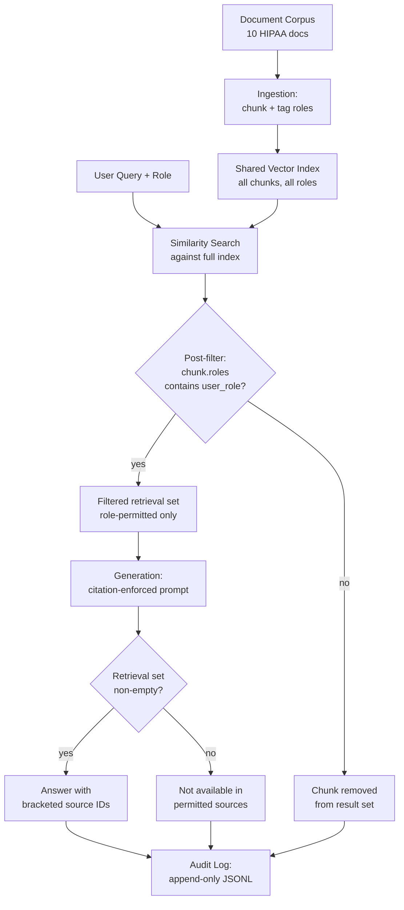

# Capstone 08 — Production RAG Chatbot for a Regulated Vertical

## Learning Objectives

1. Build an end-to-end RAG pipeline that enforces per-document access controls, citation, and audit logging against a ten-document mock regulatory corpus.
2. Implement retrieval-time post-filtering that removes chunks the querying user's role cannot access, and verify that two roles receive different retrieval sets on the same query.
3. Construct a citation-enforced generation step that either returns sourced answers with bracketed source IDs or responds "not available in permitted sources."
4. Compare the four compliance layers of a regulated RAG pipeline against a naive retrieve-and-generate baseline, identifying exactly where the naive version fails an audit check.
5. Evaluate citation fidelity by computing precision and recall of bracketed source IDs against the ground-truth retrieval set.

## The Problem

A general-purpose chatbot retrieves chunks, feeds them to a model, and returns text. That is fine for developer docs and product search. In a regulated vertical — clinical protocols, legal contracts, insurance policies, HIPAA guidance — four constraints make that naive shape non-deployable. First, not every user can see every document: a patient and a compliance officer querying the same knowledge base must receive answers drawn from different source sets. Second, every factual claim in a generated answer must cite a specific source document so a reviewer can trace it. Third, the system must record who asked what, what was retrieved, and what was returned — in an append-only log that survives system restarts. Fourth, a content-policy layer must intercept regulated outputs (medical advice, legal recommendations) before they reach the user.

The naive RAG pipeline — embed chunks, run similarity search, stuff into a prompt, generate — fails all four constraints simultaneously. It retrieves without checking user permissions. It generates without forcing citations. It logs nothing. It applies no output guard. If you ship that pipeline into a hospital or a law firm, it will surface a clinician-only document to a patient in the first week, and the audit trail for that interaction will not exist.

The production shape that Harvey, Glean, Mendable, and similar systems share in 2026 adds four layers on top of the naive pipeline: metadata-tagged ingestion with role fields, post-filtering at retrieval time, citation-enforced prompt construction, and append-only audit logging. Each layer is a separate mechanism with its own failure mode, and each must be testable independently. This capstone builds all four against a mock HIPAA corpus, then ships the result as a CLI tool with a test suite that asserts correct behavior.

## The Concept

The pipeline has four mechanisms, each operating at a different stage. The ingestion stage attaches a `roles` field to every chunk — a list specifying which user roles may retrieve it. This is not encryption or database-level access control; it is a metadata tag that the retrieval layer reads and enforces. The retrieval stage runs similarity scoring against the full index but then post-filters: any chunk whose `roles` list does not contain the querying user's role is removed from the result set before generation sees it. This is called post-filtering because the filtering happens after the vector search, not before — the index is shared across all users, but the returned set is role-specific.



The third mechanism — citation-enforced generation — sits in the prompt construction step. The system prompt instructs the model to append a bracketed source ID after every factual claim, drawing from the chunk IDs provided in context. If the retrieval set is empty (because post-filtering removed every chunk), the model is instructed to return the exact string "not available in permitted sources" rather than answering from its parametric memory. This is critical: without that instruction, the model will hallucinate an answer using training-data knowledge, bypassing the access-control layer entirely.

The fourth mechanism is append-only audit logging. Every query produces a JSON record containing the timestamp, user ID, role, query text, the list of retrieved chunk IDs (before and after filtering), the generated answer's hash, and the answer length. The log is append-only — the system never overwrites or deletes entries — and it lives on local disk as JSONL so it survives process restarts and can be shipped to a SIEM for long-term retention.

In production, each of these four mechanisms maps to a specific tool category. Document parsing uses docling or Unstructured for structured PDFs and ColPali for visually rich documents with tables and charts. Retrieval uses hybrid search (BM25 + dense vectors) followed by a cross-encoder reranker like bge-reranker-v2-gemma. Generation uses a frontier model like Claude Sonnet with prompt caching enabled (60-80% cache hit rate when the system prompt and retrieved context repeat across queries). Guarding uses Llama Guard 4 and NeMo Guardrails for content-policy enforcement. Monitoring uses Langfuse and Phoenix for tracing. Evaluation uses RAGAS on a golden question set, specifically the faithfulness metric, which checks that every claim in the answer is grounded in the retrieved context. This capstone implements simplified versions of all four mechanisms using Python stdlib only, so the compliance logic is fully observable without API keys or GPU access.

Compare this to the naive pipeline. Naive RAG retrieves against a shared index with no role filtering — a patient querying "breach notification requirements" retrieves HIPAA-003, which is restricted to compliance and admin roles. The model generates an answer with no citation enforcement, producing a paragraph that looks authoritative but cannot be traced to a source. No audit record is written. A compliance reviewer asking "who saw this document and what did the system tell them" gets nothing back. The four layers exist precisely to close each of those gaps.

## Build It

The following script builds a complete RAG pipeline against ten mock HIPAA guidance documents. It uses TF-IDF for retrieval (a stand-in for dense embeddings), template-based generation with citation enforcement (a stand-in for an LLM with a system prompt), and append-only JSONL audit logging. Every layer is functional: the access control filters chunks by role, the generation step returns "not available in permitted sources" when the filtered set is empty, and the audit log captures the full interaction.

```python
import json
import math
import hashlib
from collections import Counter, defaultdict
from datetime import datetime, timezone
from pathlib import Path

DOCUMENTS = [
    {
        "doc_id": "HIPAA-001",
        "title": "Permitted Uses of Protected Health Information",
        "roles": ["clinician", "compliance", "admin"],
        "text": "Covered entities may use protected health information for treatment payment and healthcare operations without individual authorization. Treatment includes coordination of care between providers. Payment activities include billing claims processing and eligibility verification. Healthcare operations cover quality assessment training programs and accreditation activities."
    },
    {
        "doc_id": "HIPAA-002",
        "title": "Minimum Necessary Standard",
        "roles": ["clinician", "compliance", "admin"],
        "text": "When using or disclosing protected health information covered entities must make reasonable efforts to limit the information to the minimum necessary to accomplish the intended purpose. The minimum necessary standard does not apply to disclosures to or requests by a provider for treatment. It also does not apply to uses or disclosures required by law."
    },
    {
        "doc_id": "HIPAA-003",
        "title": "Breach Notification Requirements",
        "roles": ["compliance", "admin"],
        "text": "Covered entities must notify affected individuals following a breach of unsecured protected health information within sixty days of discovery. Breaches affecting five hundred or more individuals must be reported to the Secretary of Health and Human Services immediately. Media notification is required for breaches affecting more than five hundred residents of a state or jurisdiction."
    },
    {
        "doc_id": "HIPAA-004",
        "title": "Patient Rights to Access Records",
        "roles": ["clinician", "compliance", "admin", "public"],
        "text": "Individuals have the right to inspect and obtain a copy of their protected health information in a designated record set. Covered entities must provide access within thirty days of the request. A reasonable cost based fee may be charged for copies. Individuals may request an electronic copy if the records are maintained electronically."
    },
    {
        "doc_id": "HIPAA-005",
        "title": "Business Associate Agreements",
        "roles": ["compliance", "admin"],
        "text": "A covered entity must obtain satisfactory assurance in the form of a business associate agreement before disclosing protected health information to a business associate. The agreement must establish the permitted uses and disclosures by the business associate. Business associates are directly liable for compliance with applicable HIPAA rules."
    },
    {
        "doc_id": "HIPAA-006",
        "title": "De-identification Methods",
        "roles": ["compliance", "admin", "public"],
        "text": "Health information is not individually identifiable and is not subject to HIPAA if it is de-identified. Two methods exist for de-identification. The expert determination method requires a qualified statistician to certify that re-identification risk is very small. The safe harbor method requires removal of eighteen specific identifiers including names dates and geographic data."
    },
    {
        "doc_id": "HIPAA-007",
        "title": "Security Rule Technical Safeguards",
        "roles": ["admin"],
        "text": "The Security Rule requires technical safeguards including access controls audit controls and integrity controls. Access controls must provide unique user identification and automatic logoff. Audit controls must record and examine activity in systems containing electronic protected health information. Encryption must address implementation specifications for data at rest and in transit."
    },
    {
        "doc_id": "HIPAA-008",
        "title": "Marketing and Sale of PHI",
        "roles": ["compliance", "admin"],
        "text": "Marketing communications that involve protected health information require prior written authorization from the individual. The sale of protected health information without authorization is prohibited. Treatment communications and communications about health related products or services are generally not considered marketing."
    },
    {
        "doc_id": "HIPAA-009",
        "title": "Research Uses of PHI",
        "roles": ["clinician", "compliance", "admin"],
        "text": "Protected health information may be used for research with authorization from the individual or with a waiver approved by an institutional review board. A limited data set may be used for research with a data use agreement that establishes permitted uses and prohibits re-identification."
    },
    {
        "doc_id": "HIPAA-010",
        "title": "Privacy Practices Public Summary",
        "roles": ["public"],
        "text": "This notice describes how medical information about you may be used and disclosed. You have the right to request restrictions on certain uses and disclosures of your information. You may