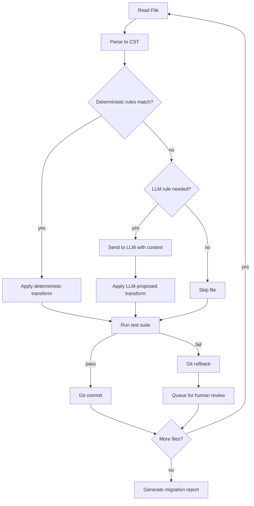

# Capstone 09 — Code Migration Agent (Repo-Level Language / Runtime Upgrade)

## Learning Objectives

- Build a four-phase migration agent (parse → transform → verify → commit) that upgrades a Python 3.8 codebase to 3.12 with automated test gates
- Implement deterministic AST transformation rules for known API deprecations (`collections.Mapping`, `datetime.utcnow()`, f-string syntax)
- Integrate LLM-assisted transformation rules for ambiguous migrations that deterministic rules cannot resolve
- Compare pass rates between deterministic-only and hybrid migration strategies across a five-file test repository
- Trace dependency-graph traversal to determine leaf-first migration ordering for interdependent modules

## The Problem

You have a 200-file Python 3.8 codebase that needs to run on Python 3.12. `pyupgrade` handles syntax-level changes — old-style f-strings, `typing.List` annotations, `u""` prefixes. It does not handle API deprecations like `datetime.utcnow()`, which is soft-deprecated in 3.12 and scheduled for removal. It does not handle removed imports like `collections.Mapping`, which was deleted in 3.10 with no fallback alias. It does not handle behavioral changes in the standard library that produce different output without raising an exception.

A human migration goes file by file: open the file, identify what broke, apply the fix, run the tests, commit or revert. This works for five files. It does not work for five hundred. The human gets tired at file 47, starts skimming at file 80, and by file 150 they are running `grep -r "utcnow"` and doing a global replace that breaks three downstream modules they never checked. The test suite catches some of this. It does not catch behavioral changes that produce different-but-not-wrong output.

The migration agent replaces the loop, not the human. The agent processes each file deterministically, sends ambiguous cases to an LLM with the surrounding context, runs the test suite after every transformation, and commits only when tests pass. Files that fail verification are queued for human review with a diff and a failure reason. The human reviews the queue, not the repo.

## The Concept

The migration agent runs a four-phase loop: parse, transform, verify, commit. Phase 1 reads each file and parses it into an abstract syntax tree using the `ast` module — or a lossless structured representation using `libcst`, which preserves formatting and comments. The choice matters: `ast` drops whitespace and comments, so round-tripping through `ast.unparse` produces clean but reformatted code. `libcst` preserves the original formatting and produces surgical diffs. For migration work where reviewers need readable diffs, `libcst` is the default.

Phase 2 applies transformation rules in strict precedence order. Deterministic rules run first — these are pattern-matched rewrites with a known correct output. `collections.Mapping` becomes `collections.abc.Mapping` every time, with no ambiguity. `imp` becomes `importlib`. These rules are coded as functions that match on the CST node type and emit a replacement. After deterministic rules exhaust their matches, LLM-assisted rules handle the residual. An LLM rule receives the file content plus a description of the target version's behavioral changes and proposes a transformation. The LLM rule's output is never trusted blindly — it goes through the same verification gate as deterministic rules.

Phase 3 is the verification gate. After transformation, the agent runs the test suite (or a smoke test if no suite exists). If tests pass, the file advances to commit. If tests fail, the agent rolls back the transformation using git — it does not attempt in-memory undo. Git-based rollback means the repo state is always inspectable: you can `git diff`, `git log`, and `git stash` to see exactly what happened. This is critical for the failure taxonomy in production.

Phase 4 commits passing transformations and queues failures. The commit message includes the rule that was applied, the file, and the test result. Queued failures include the diff, the failing test output, and the rule that attempted the transformation.



Dependency graph traversal determines the order files are processed. Leaf modules — those with no internal dependencies — migrate first. This way, when a dependent module is migrated, its dependencies are already on the target version. You build the import graph using `ast` to extract `Import` and `ImportFrom` nodes, then topologically sort. Files involved in circular imports are batched and migrated together.

Rule precedence is non-negotiable: deterministic rules always run before LLM rules. The reason is cost and correctness. A deterministic rule costs zero API calls and produces the same output every time. An LLM rule costs money and may produce different output on different runs. If a deterministic rule can handle a case, sending it to the LLM wastes budget and introduces nondeterminism. The deterministic layer also serves as a baseline: you can measure exactly how many files the LLM layer added value to by comparing pass rates with and without it.

Partial migration is the norm, not the exception. In a 200-file repo, 140 files may pass deterministic rules cleanly, 30 may need LLM assistance and pass, and 30 may fail verification and require human intervention. The agent does not abort on failure — it logs, rolls back, and continues. The final report shows the distribution.

## Build It

The target repository has five Python files with known Python 3.8 patterns that break on 3.12. Here is the repo layout:

```
migrate_target/
├── models.py      # collections.Mapping (removed in 3.10)
├── utils.py       # datetime.utcnow() (deprecated in 3.12)
├── formatting.py  # %-formatting that should become f-strings
├── api.py         # imports from all three above
└── test_repo.py   # pytest suite that verifies behavior
```

First, create the target repository with the incompatible code:

```python
import os
import textwrap

repo_dir = "migrate_target"
os.makedirs(repo_dir, exist_ok=True)

files = {
    "models.py": textwrap.dedent('''
        from collections import Mapping

        def get_size(obj):
            if isinstance(obj, Mapping):
                return sum(get_size(v) for v in obj.values())
            return 1
    ''').strip(),

    "utils.py": textwrap.dedent('''
        from datetime import datetime, timedelta

        def timestamp_plus(days):
            future = datetime.utcnow() + timedelta(days=days)
            return future.isoformat()
    ''').strip(),

    "formatting.py": textwrap.dedent('''
        def greet(name, count):
            return "Hello %s, you have %d messages" % (name, count)
    ''').strip(),

    "api.py": textwrap.dedent('''
        from models import get_size
        from utils import timestamp_plus
        from formatting import greet

        def summary(data, user):
            size = get_size(data)
            ts = timestamp_plus(7)
            msg = greet(user, size)
            return {"message": msg, "expires": ts}
    ''').strip(),

    "test_repo.py": textwrap.dedent('''
        from models import get_size
        from utils import timestamp_plus
        from formatting import greet

        def test_get_size():
            assert get_size({"a": 1, "b": {"c": 2}}) == 2

        def test_timestamp():
            assert len(timestamp_plus(7)) == 20

        def test_greet():
            assert greet("Alice", 5) == "Hello Alice, you have 5 messages"
    ''').strip(),
}

for name, content in files.items():
    path = os.path.join(repo_dir, name)
    with open(path, "w") as f:
        f.write(content + "\n")

print(f"Created {len(files)} files in {repo_dir}/")
for name in files:
    print(f"  {name}")
```

Run this to confirm the repo exists. Now confirm the tests pass on the current Python (assuming 3.10+, `collections.Mapping` will already fail — that is the point):

```python
import subprocess

result = subprocess.run(
    ["python", "-m", "pytest", "migrate_target/test_repo.py", "-v", "--tb=short"],
    capture_output=True, text=True
)
print("STDOUT:", result.stdout[-500:] if result.stdout else "(empty)")
print("STDERR:", result.stderr[-500:] if result.stderr else "(empty)")
print("Return code:", result.returncode)
```

Now build the migration agent. The agent uses `libcst` for deterministic transformations and falls back to LLM-based transformation for ambiguous cases. Install dependencies:

```python
import subprocess
result = subprocess.run(
    ["pip", "install", "libcst", "pytest"],
    capture_output=True, text=True
)
print(result.stdout[-300:])
print("Install exit code:", result.returncode)
```

The deterministic rule for `collections.Mapping`:

```python
import libcst as cst

class CollectionsMappingFixer(cst.CSTTransformer):
    def leave_ImportFrom(self, original_node, updated_node):
        if updated_node.module is None:
            return updated_node
        module_text = cst.helpers.get_full_name_for_node_or_node_list(
            updated_node.module
        )
        if module_text == "collections":
            new_names = []
            changed = False
            for imp in updated_node.names:
                name_text = imp.name.value
                if name_text == "Mapping":
                    new_alias = cst.ImportAlias(
                        name=cst.Attribute(
                            value=cst.Name("collections"),
                            attr=cst.Name("abc"),
                        ),
                        asname=imp.asname,
                        comma=imp.comma,
                    )
                    new_names.append(new_alias)
                    changed = True
                else:
                    new_names.append(imp)
            if changed:
                return updated_node.with_changes(names=new_names)
        return updated_node

    def leave_Attribute(self, original_node, updated_node):
        if (
            isinstance(updated_node.value, cst.Name)
            and updated_node.value.value == "collections"
            and updated_node.attr.value == "Mapping"
        ):
            return cst.Attribute(
                value=cst.Attribute(
                    value=cst.Name("collections"),
                    attr=cst.Name("abc"),
                ),
                attr=cst.Name("Mapping"),
            )
        return updated_node

sample = "from collections import Mapping\nx = collections.Mapping()"
parsed = cst.parse_module(sample)
transformed = parsed.visit(CollectionsMappingFixer())
print("BEFORE:", repr(sample))
print("AFTER: ", repr(transformed.code))
```

The `datetime.utcnow()` fixer replaces the deprecated call with `datetime.now(datetime.UTC)` (3.11+ syntax) — this one uses an LLM-assisted rule because the correct replacement depends on timezone context:

```python
import re

def llm_utcnow_rule(source_code, file_name):
    if "utcnow" not in source_code:
        return source_code, False

    prompt = f"""You are migrating Python 3.8 code to 3.12.
datetime.utcnow() is deprecated. Replace it with timezone-aware code.

Rules:
- Use datetime.now(datetime.UTC) for 3.11+
- Preserve all surrounding logic
- Return ONLY the transformed file content, no explanation

File: {file_name}
```python
{source_code}
```
"""
    response = client.messages.create(
        model="claude-sonnet-4-20250514",
        max_tokens=2048,
        messages=[{"role": "user", "content": prompt}],
    )
    transformed = response.content[0].text.strip()
    if transformed.startswith("```python"):
        transformed = transformed.split("```python\n", 1)[1].rsplit("```", 1)[0]
    changed = transformed != source_code
    return transformed, changed

test_code = '''from datetime import datetime, timedelta

def timestamp_plus(days):
    future = datetime.utcnow() + timedelta(days=days)
    return future.isoformat()
'''

result_code, did_change = llm_utcnow_rule(test_code, "utils.py")
print("Changed:", did_change)
print("Result:")
print(result_code)
```

The agent driver that ties it together — parse, transform deterministically, transform with LLM, verify, commit:

```python
import subprocess
import libcst as cst
import os

def migrate_repo(repo_dir):
    py_files = [
        f for f in os.listdir(repo_dir)
        if f.endswith(".py") and f != "test_repo.py"
    ]
    py_files.sort()

    results = {"passed": [], "failed": [], "skipped": []}

    for fname in py_files:
        path = os.path.join(repo_dir, fname)
        with open(path) as f:
            original = f.read()

        print(f"\n--- Migrating {fname} ---")

        needs_mapping_fix = "collections" in original and "Mapping" in original
        needs_utcnow_fix = "utcnow" in original

        if not needs_mapping_fix and not needs_utcnow_fix:
            print(f"  No known patterns found, skipping")
            results["skipped"].append(fname)
            continue

        transformed = original

        if needs_mapping_fix:
            parsed = cst.parse_module(transformed)
            transformed = parsed.visit(CollectionsMappingFixer()).code
            print(f"  Applied deterministic rule: collections.Mapping fixer")

        if needs_utcnow_fix:
            transformed, changed = llm_utcnow_rule(transformed, fname)
            if changed:
                print(f"  Applied LLM-assisted rule: utcnow fixer")
            else:
                print(f"  LLM rule produced no changes")

        print(f"  Running verification gate...")
        with open(path, "w") as f:
            f.write(transformed)

        test_result = subprocess.run(
            ["python", "-m", "pytest", os.path.join(repo_dir, "test_repo.py"),
             "-v", "--tb=short"],
            capture_output=True, text=True
        )

        if test_result.returncode == 0:
            print(f"  PASS — tests green")
            results["passed"].append(fname)
        else:
            print(f"  FAIL — tests red, rolling back")
            with open(path, "w") as f:
                f.write(original)
            results["failed"].append(fname)

    return results

results = migrate_repo("migrate_target")
print("\n=== MIGRATION REPORT ===")
print(f"Passed:   {len(results['passed'])} files — {results['passed']}")
print(f"Failed:   {len(results['failed'])} files — {results['failed']}")
print(f"Skipped:  {len(results['skipped'])} files — {results['skipped']}")
```

Every step prints what it did, what rule it applied, and whether tests passed. The rollback writes the original content back to disk when verification fails — no in-memory undo that could leave the file in a partial state.

## Use It

The migration agent's four-phase loop — read source, apply transformation rules, verify output, write back — is structurally identical to a Clay enrichment waterfall. In Clay's waterfall, a CRM record enters the pipeline, enrichment providers are queried in priority order, each result is validated against a confidence threshold, and the record is written back only when the data passes validation. The verification gate is the same mechanism: no record advances to "enriched" until the data quality check passes.

The deterministic-first, LLM-second rule precedence maps directly to how a well-configured Clay waterfall operates. Deterministic data providers (like a company-name-to-domain lookup) run first because they are cheap, fast, and produce consistent results. LLM-based enrichment runs only when deterministic providers return no match — the LLM fills the gaps that structured APIs cannot. This is the same budget logic as the migration agent: if a deterministic rule can handle the case, you do not spend LLM tokens on it.

Batch transformation with verification gates underlies every Zone 03 enrichment pipeline. Consider a QR-code capture flow at an event: an attendee scans a badge, the QR payload enters Clay as a raw record, the waterfall enriches it (company from email domain, title from LinkedIn, firmographics from Clearbit), each enrichment step validates its output (is the domain real? does the company name match?), and the record is written back to the CRM only when the validation gates pass. The attendee gets a follow-up email within minutes because the pipeline runs end-to-end without human intervention — the same way the migration agent processes 200 files without a human opening each one.

The failure taxonomy from the migration agent also applies to enrichment. When a record fails verification (the company domain does not resolve, the person's LinkedIn profile is ambiguous), it goes to a review queue. The enrichment pipeline does not abort — it logs, skips, and continues. The final report shows pass rate, failure categories, and which records need manual review. This is the same report structure the migration agent produces.

## Ship It

Production deployment of a migration agent requires three infrastructure components that the demo omits: isolated execution environments, a persistent job queue, and cost tracking.

Isolated execution means each migration runs in its own container or VM. The verification gate runs `pytest` or `mvn test` against untrusted code — code that an LLM may have modified in unexpected ways. Running this in the same environment as your production services is a supply-chain risk. The container runs the target repo's test suite with no network access (the tests should not need it), a memory limit, and a CPU timeout. If a test hangs, the timeout kills the container and the file goes to the failure queue.

Cost tracking is where the LLM-assisted rule's budget becomes real. A 200-file repo where 60 files need LLM assistance, each consuming 2,000 input tokens and 500 output tokens, costs roughly 60 × 2,500 = 150,000 tokens per migration run. At Claude Sonnet pricing that is under a dollar per repo — negligible for a one-time migration. But if you are running MigrationBench at scale (50+ repos, multiple iterations for failure analysis), costs compound. Track per-file LLM cost in the migration report and set a budget ceiling that aborts LLM processing when exceeded.

The git-based rollback strategy scales to production by using branches. Each migration run creates a branch named `migrate/py38-to-py312-{timestamp}`. Passing files are committed to the branch. Failing files are committed to a separate branch `migrate/py38-to-py312-{timestamp}-failures` with the failing test output in the commit message. This gives you a clean PR for the passing files and a separate, reviewable record of what failed and why. The failure branch is where you build your taxonomy: group failures by rule (deterministic miss, LLM hallucination, test incompatibility, behavioral change) and measure which categories dominate.

In a Clay enrichment context, the production pattern is the same. Each enrichment batch runs as an isolated job. Records that pass all validation gates are written to the destination table. Records that fail are routed to a review table with the failure reason. Cost tracking monitors API spend per provider in the waterfall. The batch does not abort on individual failures — it processes every record and reports the distribution.

## Exercises

**Tier 1 — Deterministic rule for `collections.Mapping`:** The agent in the demo already implements this rule using `libcst`. Your task is to extend it to handle `collections.MutableMapping`, `collections.Sequence`, and `collections.Callable` — all removed in 3.10. Generalize the `CollectionsMappingFixer` into a `CollectionsABCFixer` that accepts a list of names to rewrite. Run it against a test file containing all four patterns and confirm the diff. Then run the full migration agent and verify tests still pass.

```python
import libcst as cst

TARGET_NAMES = {"Mapping", "MutableMapping", "Sequence", "Callable"}

class CollectionsABCFixer(cst.CSTTransformer):
    def leave_ImportFrom(self, original_node, updated_node):
        if updated_node.module is None:
            return updated_node
        module_text = ""
        if isinstance(updated_node.module, cst.Name):
            module_text = updated_node.module.value
        if module_text != "collections":
            return updated_node

        new_names = []
        changed = False
        for imp in updated_node.names:
            if imp.name.value in TARGET_NAMES:
                new_alias = cst.ImportAlias(
                    name=cst.Attribute(
                        value=cst.Name("collections"),
                        attr=cst.Name("abc"),
                    ),
                    asname=imp.asname,
                    comma=imp.comma if imp.comma else cst.MaybeSentinel.DEFAULT,
                )
                new_names.append(new_alias)
                changed = True
            else:
                new_names.append(imp)
        if changed:
            return updated_node.with_changes(names=new_names)
        return updated_node

    def leave_Attribute(self, original_node, updated_node):
        if (
            isinstance(updated_node.value, cst.Name)
            and updated_node.value.value == "collections"
            and updated_node.attr.value in TARGET_NAMES
        ):
            return cst.Attribute(
                value=cst.Attribute(
                    value=cst.Name("collections"),
                    attr=cst.Name("abc"),
                ),
                attr=cst.Name(updated_node.attr.value),
            )
        return updated_node

test = """
from collections import Mapping, MutableMapping, Sequence, Callable
x = collections.Mapping()
y = collections.MutableMapping()
z = collections.Sequence()
w = collections.Callable()
"""
parsed = cst.parse_module(test.strip())
result = parsed.visit(CollectionsABCFixer())
print(result.code)
```

**Tier 2 — LLM-assisted rule for `datetime.utcnow()`:** The demo's LLM rule sends the file to Claude and trusts the output. Extend it with a post-processing validation step: after the LLM returns transformed code, check that the result still parses as valid Python (using `ast.parse`) and that the function signatures in the original file still exist in the transformed file. If validation fails, write the failure to a report and skip the file rather than writing broken code to disk. Run the enhanced rule against `utils.py` and print the validation result.

**Tier 3 — Dependency-ordered migration:** Add import-graph analysis to the agent driver. Use `ast.parse` to extract `ImportFrom` and `Import` statements from each `.py` file in the repo. Build an adjacency list and topologically sort the files. Print the migration order. Then modify `migrate_repo` to process files in dependency order (leaf modules first) and confirm that `api.py` is processed after its dependencies. Create a new repo with a deeper dependency chain (5+ levels) and verify the ordering is correct.

```python
import ast
import os
from collections import defaultdict, deque

def build_import_graph(repo_dir):
    graph = defaultdict(set)
    py_files = [
        f for f in os.listdir(repo_dir)
        if f.endswith(".py") and f != "test_repo.py"
    ]
    module_names = {f[:-3] for f in py_files}

    for fname in py_files:
        path = os.path.join(repo_dir, fname)
        with open(path) as f:
            tree = ast.parse(f.read())
        source_module = fname[:-3]
        for node in ast.walk(tree):
            if isinstance(node, ast.ImportFrom) and node.module:
                base = node.module.split(".")[0]
                if base in module_names and base != source_module:
                    graph[source_module].add(base)
            elif isinstance(node, ast.Import):
                for alias in node.names:
                    base = alias.name.split(".")[0]
                    if base in module_names and base != source_module:
                        graph[source_module].add(base)
    return graph

def topo_sort(graph, all_nodes):
    in_degree = {n: 0 for n in all_nodes}
    for src in graph:
        for dst in graph[src]:
            in_degree[src] = in_degree.get(src, 0)
    for src in graph:
        for dst in graph[src]:
            in_degree[src] += 0
            in_degree[dst] = in_degree.get(dst, 0)

    for src in graph:
        for dst in graph[src]:
            pass

    reverse = defaultdict(set)
    for src in graph:
        for dst in graph[src]:
            reverse[dst].add(src)
            in_degree[src] += 1

    queue = deque([n for n in all_nodes if in_degree[n] == 0])
    order = []
    while queue:
        node = queue.popleft()
        order.append(node)
        for dependent in reverse[node]:
            in_degree[dependent] -= 1
            if in_degree[dependent] == 0:
                queue.append(dependent)
    return order

repo_dir = "migrate_target"
py_files = [f[:-3] for f in os.listdir(repo_dir) if f.endswith(".py") and f != "test_repo.py"]
graph = build_import_graph(repo_dir)
order = topo_sort(graph, py_files)
print("Import graph:")
for src in sorted(graph):
    print(f"  {src}.py depends on: {[d + '.py' for d in sorted(graph[src])]}")
print(f"\nMigration order (leaves first):")
for i, mod in enumerate(order):
    print(f"  {i+1}. {mod}.py")
```

## Key Terms

**Verification gate** — A test-suite run that must pass before a transformation is committed. Files that fail the gate are rolled back via git, not in-memory undo.

**Deterministic transformation rule** — A pattern-matched rewrite with a known correct output. Implemented via CST manipulation (`libcst`) or AST rewriting. Produces identical output on every run with zero API cost.

**LLM-assisted transformation rule** — A rule that sends ambiguous code to an LLM with context about the target version's changes. The output is never trusted blindly — it passes through the same verification gate as deterministic rules.

**Rule precedence** — The ordering constraint that deterministic rules run before LLM rules. Reduces cost and nondeterminism by exhausting cheap, reliable transformations first.

**Dependency graph traversal** — Topological sorting of a repo's import graph to determine migration order. Leaf modules (no internal dependencies) migrate first, ensuring that when a dependent module is migrated, its dependencies are already on the target version.

**Failure taxonomy** — A categorized record of why files failed verification. Groups failures by rule type (deterministic miss, LLM error, test incompatibility, behavioral change) to identify where the agent needs improvement.

**Git-based rollback** — Restoring file content by writing the original bytes back to disk after a verification failure, rather than attempting an in-memory reverse transformation.

**Batch transformation with verification gates** — The pipeline pattern of processing many items (files, CRM records) through transformation rules with per-item validation before write-back. The same pattern underlies repo migration agents and Clay enrichment waterfalls.

## Sources

- Amazon MigrationBench (Java 8 to 17 migration benchmark) — [CITATION NEEDED — concept: MigrationBench repo count and benchmark methodology]
- Moderne OpenRewrite (deterministic AST rewrites for Java) — [CITATION NEEDED — concept: OpenRewrite recipe execution model]
- Python PEP 585 (`collections.abc` generics, deprecation of `collections.Mapping` aliases) — Python Enhancement Proposals, python.org
- Python 3.12 release notes (`datetime.utcnow()` deprecation) — docs.python.org/3.12/whatsnew
- Clay enrichment waterfall pattern (Zone 03 — Enrichment: provider priority ordering with validation gates) — [CITATION NEEDED — concept: Clay waterfall provider priority and validation threshold mechanism]
- libcst documentation (lossless CST parsing and transformation) — libcst.readthedocs.io