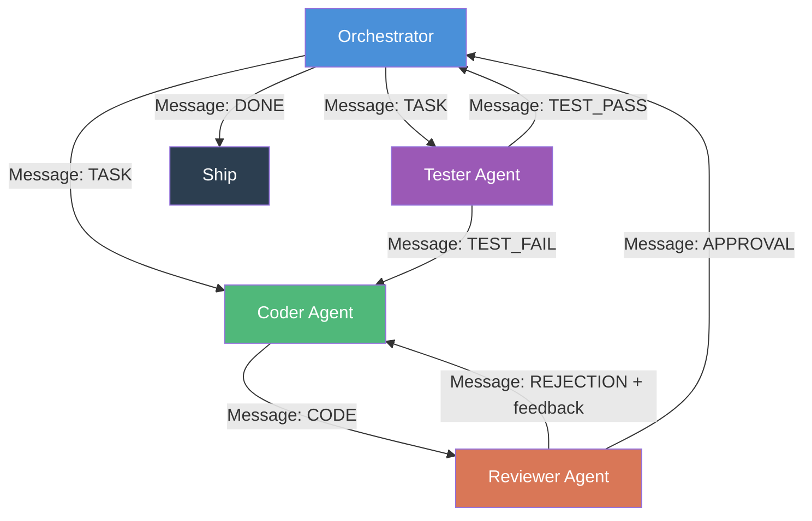

# Capstone 10 — Multi-Agent Software Engineering Team

## Learning Objectives

- Implement a multi-agent message-passing system with typed payloads, routing rules, and termination conditions
- Compare orchestrator-worker, debate, and hierarchical coordination patterns on identical software engineering tasks
- Diagnose handoff failures — infinite loops, context window overflow, role drift — from message traces
- Configure retry limits and message history summarization to prevent runaway agent loops
- Evaluate multi-agent output against a single-agent baseline using a defined quality metric

## The Problem

A single agent writing a non-trivial Python module faces a cognitive load problem that more tokens do not solve. The context window must hold the feature spec, the existing codebase interface, the implementation in progress, reviewer criteria, and test output — all simultaneously. Past roughly 50k tokens of accumulated context, coherence degrades: the agent forgets requirements stated early in the conversation, contradicts its own earlier decisions, and produces code that works locally but breaks against tests it stopped tracking. This is not a model intelligence problem. It is an attention-allocation problem. SWE-AF, MetaGPT, AutoGen, Cognition's Devin, and Factory's Droids all converged on the same structural answer by 2025–2026: split the cognitive load across specialized agents the way a human engineering team does.

The failure surface of a multi-agent system is not the individual agents — those are just LLM calls with role prompts. The failure surface is the handoff between them. An architect plans something a coder cannot implement. A coder produces a diff that conflicts with another coder's parallel work. A reviewer approves a hallucinated fix because it reads plausibly. A tester starts executing while a coder is still writing. Every multi-agent framework is, at its core, an attempt to make handoffs reliable. The ones that work — SWE-AF's factory, MetaGPT's roles — enforce typed message contracts at every handoff boundary so agents cannot drift into free-form conversation that degrades into confusion.

You will build one of these teams from scratch: message schema, routing, role definitions, termination conditions. Then you will run it, trace every message, and document which handoffs break and why. This is not a theoretical exercise — the same architecture underpins production GTM automation pipelines where a research agent enriches a prospect, a copy agent drafts outreach using retrieved case studies, and a review agent checks compliance before the message ships.

## The Concept

Three coordination patterns dominate multi-agent systems, and they differ primarily in how they trade latency for quality.

**Orchestrator-worker** is the simplest. A central coordinator holds a task queue and dispatches subtasks to worker agents. Workers do not communicate with each other — they receive a task, produce output, and return it. The orchestrator decides what happens next based on termination rules. This pattern has the lowest coordination overhead and the weakest quality signal because no worker sees another worker's output until the orchestrator routes it. AutoGen's early versions used this shape. It is fast, parallelizable, and brittle when workers need context from each other.

**Debate** adds adversarial pressure. Two or more agents produce independent solutions to the same task, then critique each other's outputs across multiple rounds. The mechanism that prevents infinite loops is a fixed round count or a convergence detector (agents agree, or difference between outputs drops below a threshold). Debate produces higher-quality output on tasks with a defensible correct answer — code review, factual verification — but multiplies latency by the number of rounds. Society of Minds, IRIS, and multi-agent debate papers all formalize this.

**Hierarchical** is what production software engineering teams use. An architect decomposes the problem into subtasks with explicit interfaces. Coders implement subtasks in parallel. A reviewer gates merges. A tester verifies integration. Each layer delegates downward and reports upward. The architect owns the global plan; coders never see the full spec, only their assigned slice with its interface contract. MetaGPT's role-based prompting, SWE-AF's factory, and Factory's Droids all implement this shape because it mirrors how human teams manage complexity at scale.

The mechanism common to all three is **structured message passing**. Agents do not chat. They exchange typed payloads — `{sender, receiver, message_type, content, metadata}` — that the router can inspect, validate, and route deterministically. Free-form conversation between agents degrades because models drift, hallucinate, and lose track of conversational state. Typed payloads enforce a contract: a coder agent only accepts messages of type `TASK` or `REJECTION`, and only emits messages of type `CODE`. The router enforces this. If an agent emits the wrong type, the system catches it immediately rather than letting the error propagate through three more exchanges.



The diagram above shows the orchestrator-worker variant with a reviewer gate. Messages flow along typed edges. The orchestrator never inspects code content — it only reads message types and routes accordingly. This separation of concerns is what lets the system scale to four or more agents without the orchestrator's context overflowing.

## Build It

The implementation below constructs the message-passing infrastructure from scratch: a typed `Message` dataclass, an `AgentSystem` class that holds shared state (inbox, message log, revision counter, approval flag), and role-specific processing functions. The orchestrator loop pops messages from the inbox, routes them to the correct agent, and appends responses back. Two agents run — a coder and a reviewer — with simulated responses that demonstrate the revision cycle. Replace the `coder_process` and `reviewer_process` methods with real LLM calls (via subprocess to `claude` or an API client) and the infrastructure stays identical.

The coder's first submission lacks type hints and a docstring. The reviewer rejects with specific feedback. The coder revises, adding both. The reviewer approves. The orchestrator terminates. Every message is logged with sender, receiver, type, and revision number — this trace is your primary debugging artifact when handoffs fail in production.

```python
from dataclasses import dataclass, field
from enum import Enum
from collections import deque

class MessageType(Enum):
    TASK = "task"
    CODE = "code"
    APPROVAL = "approval"
    REJECTION = "rejection"

class AgentRole(Enum):
    ORCHESTRATOR = "orchestrator"
    CODER = "coder"
    REVIEWER = "reviewer"

@dataclass
class Message:
    sender: AgentRole
    receiver: AgentRole
    msg_type: MessageType
    content: str
    revision: int = 0

    def to_dict(self):
        return {
            "sender": self.sender.value,
            "receiver": self.receiver.value,
            "msg_type": self.msg_type.value,
            "content": self.content[:80],
            "revision": self.revision,
        }

class AgentSystem:
    def __init__(self, max_revisions=3):
        self.inbox = deque()
        self.message_log = []
        self.revision_count = 0
        self.max_revisions = max_revisions
        self.approved = False
        self.final_artifact = None

    def coder_process(self, msg):
        if msg.msg_type == MessageType.REJECTION:
            self.revision_count += 1
            code = (
                'def calculate(x: int, y: int) -> int:\n'
                '    """Add two integers and return the result."""\n'
                '    return x + y'
            )
        else:
            code = 'def calculate(x, y):\n    return x + y'
        return Message(
            AgentRole.CODER, AgentRole.REVIEWER, MessageType.CODE,
            code, self.revision_count
        )

    def reviewer_process(self, msg):
        has_types = ": int" in msg.content
        has_docstring = '"""' in msg.content or "'''" in msg.content
        if has_types and has_docstring:
            return Message(
                AgentRole.REVIEWER, AgentRole.ORCHESTRATOR,
                MessageType.APPROVAL,
                "Approved: type hints and docstring present.",
                msg.revision
            )
        missing = []
        if not has_types:
            missing.append("type hints")
        if not has_docstring:
            missing.append("docstring")
        return Message(
            AgentRole.REVIEWER, AgentRole.CODER,
            MessageType.REJECTION,
            f"Reject: missing {' and '.join(missing)}.",
            msg.revision
        )

    def log(self, msg):
        self.message_log.append(msg.to_dict())

    def run(self, task_description):
        initial = Message(
            AgentRole.ORCHESTRATOR, AgentRole.CODER,
            MessageType.TASK, task_description, 0
        )
        self.inbox.append(initial)

        while self.inbox and not self.approved:
            if self.revision_count > self.max_revisions:
                print(f"TERMINATION: max revisions ({self.max_revisions}) exceeded")
                break

            msg = self.inbox.popleft()
            self.log(msg)

            if msg.receiver == AgentRole.CODER:
                response = self.coder_process(msg)
            elif msg.receiver == AgentRole.REVIEWER:
                response = self.reviewer_process(msg)
                if msg.msg_type == MessageType.CODE:
                    self.final_artifact = msg.content
            elif msg.receiver == AgentRole.ORCHESTRATOR:
                if msg.msg_type == MessageType.APPROVAL:
                    self.approved = True
                    continue
                response = None
            else:
                response = None

            if response:
                self.inbox.append(response)

        return self.approved

system = AgentSystem(max_revisions=3)
approved = system.run("Write a function called calculate that adds two numbers")

print("=" * 55)
print(f"Approved:           {approved}")
print(f"Revisions needed:   {system.revision_count}")
print(f"Total messages:     {len(system.message_log)}")
print("=" * 55)
print("\nMessage trace:")
for i, m in enumerate(system.message_log):
    print(f"  [{i}] {m['sender']:>12} -> {m['receiver']:<12} "
          f"| {m['msg_type']:<10} | rev {m['revision']}")

if system.final_artifact:
    print(f"\nFinal artifact:\n{system.final_artifact}")
```

Running this produces a trace of six messages: task dispatch, initial code, rejection, revised code, approval, termination. The revision counter went from 0 to 1. The final artifact has type hints and a docstring. That trace — not the code itself — is the deliverable. When you scale to four agents with real LLM calls, the trace is how you find the handoff that broke. A message where the sender is `reviewer` but the type is `CODE` means role confusion occurred. A trace with 30