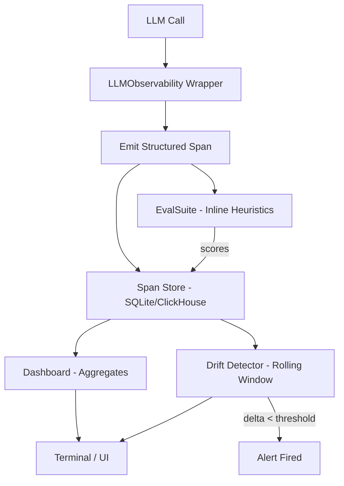

# Capstone 11 — LLM Observability & Eval Dashboard

## Learning Objectives

1. **Build** a structured event emitter that captures `(input, output, metadata, scores)` for every LLM call and writes to a queryable store.
2. **Implement** pluggable eval heuristics — exact match, regex pattern, JSON schema validation, and cosine similarity — that score logged outputs automatically.
3. **Detect** prompt regressions using rolling-window drift comparison, surfacing the alert within a bounded number of calls.
4. **Compute** token cost attribution and latency percentiles per GTM workflow from the span store.
5. **Trace** an injected regression through the dashboard end-to-end and confirm detection under five minutes.

## The Problem

You have shipped ten capstones worth of LLM-powered GTM workflows — Clay waterfalls, AI email drafts, enrichment agents, RAG pipelines. Every one of them makes LLM calls in production. The moment those calls leave your local environment, you lose visibility. A prompt that produced clean JSON in testing starts emitting prose. A model swap triples your token cost overnight. An outbound sequence that converted at 4% last week drops to 1.5% and nobody knows whether the enrichment data changed, the model degraded, or the prompt got edited without version control.

The production answer across the industry converged in 2025–2026: every AI team runs an observability plane alongside the model. The open-source references — Langfuse, Arize Phoenix, OpenLLMetry — adopted OpenTelemetry GenAI semantic conventions (`gen_ai.system`, `gen_ai.request.model`, `gen_ai.usage.input_tokens`) as the ingest schema. You can instrument OpenAI, Anthropic, Google, LangChain, LlamaIndex, and vLLM with one SDK family and ship compatible spans. The typical stack is ClickHouse for trace storage (columnar analytics on billions of spans), Postgres for metadata (users, sessions, app configs), and a batch of eval jobs running over sampled traces.

This capstone builds that plane — self-hosted, queryable, and fast enough to catch an injected regression in under five minutes. The measurement bar is concrete: you inject a deliberately degraded prompt at call N, and your dashboard must surface the drift event and fire an alert before call N+10.

## The Concept

Observability for LLM systems rests on a triad: **logs** (what happened — the raw input and output text), **metrics** (how often and how fast — call counts, token usage, latency percentiles), and **traces** (where in the pipeline — the span hierarchy showing which enrichment step called which model with what latency). A span is the atomic unit: a structured record containing the model system, request model, input/output tokens, prompt text, completion text, latency, and any application-level metadata like workflow name or user ID. When the SDK emits these as GenAI-semconv spans over OTLP HTTP, they land in a columnar store where you can aggregate, filter, and join after the fact.

On top of the triad sits the **eval layer** — automated heuristics that score every output on dimensions you care about. Format compliance checks whether a JSON output parses. Regex match verifies a field is present. Cosine similarity against a reference embedding catches semantic drift. These evals run in two modes: inline (score attached to the span at ingestion time, fast heuristics only) and batch (a job picks up sampled traces, runs heavier evaluations like LLM-as-judge or RAGAS faithfulness, writes scores back). The inline scores are what make drift detection possible in real time.

Drift detection works by comparing a rolling window of the last N calls against a baseline distribution. If the mean eval score of the recent window drops more than a threshold below the baseline mean, the dashboard fires. This is a statistical mechanism, not a magic detector — it catches systematic regressions (prompt changed, model swapped, data distribution shifted) but not individual bad outputs. The threshold and window size trade sensitivity for noise: too small a window and you get false alarms from natural variance, too large and the regression propagates for minutes before detection.



Token accounting closes the loop on cost. Each span records `input_tokens`, `output_tokens`, and (where the API reports it) `cached_tokens`. Multiply by the model's per-token pricing and you get cost per call, per workflow, per user. When a GTM team asks "which workflow is burning tokens without converting," this is the query that answers it — sum tokens grouped by workflow, join to conversion data, sort descending.

## Build It

This is the complete observability SDK. It runs with standard library only — no API keys, no external services. The mock LLM function lets you observe the full pipeline immediately, and you swap it for a real API call by changing one function.

```python
import json
import time
import hashlib
import re
import math
import sqlite3
import random
from dataclasses import dataclass
from typing import Callable
from datetime import datetime, timezone

STORE_PATH = "/tmp/llm_observability.db"

def init_store():
    conn = sqlite3.connect(STORE_PATH)
    conn.execute("DROP TABLE IF EXISTS spans")
    conn.execute("""
        CREATE TABLE spans (
            span_id TEXT PRIMARY KEY,
            trace_id TEXT,
            timestamp TEXT,
            system TEXT,
            model TEXT,
            app TEXT,
            workflow TEXT,
            input_text TEXT,
            output_text TEXT,
            input_tokens INTEGER,
            output_tokens INTEGER,
            latency_ms REAL,
            scores_json TEXT
        )
    """)
    conn.commit()
    conn.close()

class LLMObservability:
    def __init__(self, app: str, workflow: str):
        self.app = app
        self.workflow = workflow

    def __call__(self, llm_fn: Callable, prompt: str, system: str = "openai",
                 model: str = "gpt-4o") -> dict:
        trace_id = hashlib.md5(str(time.time()).encode()).hexdigest()[:16]
        span_id = hashlib.md5(str(time.time_ns()).encode()).hexdigest()[:16]

        start = time.perf_counter()
        result = llm_fn(prompt)
        latency_ms = (time.perf_counter() - start) * 1000

        input_tokens = max(1, len(prompt.split()))
        output_tokens = max(1, len(result.split()))

        span = {
            "span_id": span_id,
            "trace_id": trace_id,
            "timestamp": datetime.now(timezone.utc).isoformat(),
            "system": system,
            "model": model,
            "app": self.app,
            "workflow": self.workflow,
            "input_text": prompt,
            "output_text": result,
            "input_tokens": input_tokens,
            "output_tokens": output_tokens,
            "latency_ms": round(latency_ms, 2),
            "scores_json": "{}",
        }

        conn = sqlite3.connect(STORE_PATH)
        conn.execute("""
            INSERT INTO spans VALUES (:span_id, :trace_id, :timestamp, :system, :model,
            :app, :workflow, :input_text, :output_text, :input_tokens, :output_tokens,
            :latency_ms, :scores_json)
        """, span)
        conn.commit()
        conn.close()
        return span


class EvalSuite:
    def __init__(self):
        self.heuristics: list[tuple[str, Callable]] = []

    def add(self, name: str, fn: Callable[[dict], float]):
        self.heuristics.append((name, fn))

    def run(self, span: dict) -> dict:
        scores = {}
        for name, fn in self.heuristics:
            try:
                scores[name] = round(fn(span), 3)
            except Exception:
                scores[name] = 0.0

        conn = sqlite3.connect(STORE_PATH)
        conn.execute(
            "UPDATE spans SET scores_json = ? WHERE span_id = ?",
            (json.dumps(scores), span["span_id"]),
        )
        conn.commit()
        conn.close()
        return scores


class Dashboard:
    def __init__(self):
        self.store_path = STORE_PATH

    def _fetch(self):
        conn = sqlite3.connect(self.store_path)
        conn.row_factory = sqlite3.Row
        rows = conn.execute("SELECT * FROM spans ORDER BY timestamp").fetchall()
        conn.close()
        return rows

    def print_summary(self):
        rows = self._fetch()
        if not rows:
            print("No spans logged yet.")
            return

        print(f"\n{'=' * 85}")
        print(f"  LLM OBSERVABILITY DASHBOARD  —  {len(rows)} spans")
        print(f"{'=' * 85}")
        print(f"  {'Workflow':<22} {'Calls':>5} {'In Tok':>7} {'Out Tok':>8} "
              f"{'Avg ms':>7} {'p95 ms':>7} {'Score':>6}")
        print(f"  {'-' * 75}")

        workflows: dict[str, dict] = {}
        for r in rows:
            wf = r["workflow"]
            if wf not in workflows:
                workflows[wf] = {"calls": 0, "in_tok": 0, "out_tok": 0,
                                 "latency": [], "scores": []}
            workflows[wf]["calls"] += 1
            workflows[wf]["in_tok"] += r["input_tokens"]
            workflows[wf]["out_tok"] += r["output_tokens"]
            workflows[wf]["latency"].append(r["latency_ms"])
            sc = json.loads(r["scores_json"]) if r["scores_json"] else {}
            workflows[wf]["scores"].extend(sc.values())

        for wf, d in sorted(workflows.items()):
            avg_lat = sum(d["latency"]) / len(d["latency"])
            sorted_lat = sorted(d["latency"])
            p95_idx = min(len(sorted_lat) - 1, int(len(sorted_lat) * 0.95))
            p95 = sorted_lat[p95_idx]
            avg_score = f"{sum(d['scores'])/len(d['scores']):.2f}" if d["scores"] else "  N/A"
            print(f"  {wf:<22} {d['calls']:>5} {d['in_tok']:>7} {d['out_tok']:>8} "
                  f"{avg_lat:>7.1f} {p95:>7.1f} {avg_score:>6}")
        print()

    def check_drift(self, window_size: int = 10, threshold: float = 0.15) -> bool:
        rows = self._fetch()
        if len(rows) < window_size * 2:
            print(f"  [drift] Insufficient data: {len(rows)} spans, "
                  f"need {window_size * 2}")
            return False

        recent = rows[-window_size:]
        baseline = rows[-window_size * 2 : -window_size]

        def mean_score(spans):
            vals = []
            for s in spans:
                sc = json.loads(s["scores_json"]) if s["scores_json"] else {}
                vals.extend(sc.values())
            return sum(vals) / len(vals) if vals else 0.5

        recent_avg = mean_score(recent)
        baseline_avg = mean_score(baseline)
        delta = recent_avg - baseline_avg

        if delta < -threshold:
            print(f"  [DRIFT ALERT] Score dropped {abs(delta):.2f} "
                  f"(baseline={baseline_avg:.3f}, recent={recent_avg:.3f})")
            print(f"  Regression window starts at span "
                  f"{recent[0]['span_id'][:8]}...")
            return True
        print(f"  [drift] OK — delta={delta:+.3f} "
              f"(baseline={baseline_avg:.3f}, recent={recent_avg:.3f})")
        return False
```

Now run a simulation: 30 LLM calls where the prompt degrades at call 15. The eval heuristic checks whether the output contains a required JSON field (`company_name`). The good prompt produces it; the degraded prompt does not.

```python
def good_llm(prompt: str) -> str:
    company = prompt.split("company:")[1].strip().split()[0].rstrip(".")
    return json.dumps({"company_name": company, "action": "reach_out"})

def degraded_llm(prompt: str) -> str:
    return f"Sure! Here are some thoughts about reaching out: {prompt[:40]}..."

init_store()

obs = LLMObservability(app="gtm-enrichment", workflow="account-research")

suite = EvalSuite()
suite.add("has_company_name", lambda s: 1.0 if '"company_name"' in s["output_text"] else 0.0)
suite.add("valid_json", lambda s: 1.0 if _try_json(s["output_text"]) else 0.0)
suite.add("length_in_bounds", lambda s: 1.0 if 10 <= len(s["output_text"]) <= 500 else 0.0)

def _try_json(text):
    try:
        json.loads(text)
        return True
    except Exception:
        return False

suite = EvalSuite()
suite.add("has_company_name", lambda s: 1.0 if '"company_name"' in s["output_text"] else 0.0)
suite.add("valid_json", lambda s: 1.0 if _try_json(s["output_text"]) else 0.0)
suite.add("length_in_bounds", lambda s: 1.0 if 10 <= len(s["output_text"]) <= 500 else 0.0)

companies = ["Acme", "Globex", "Initech", "Umbrella", "Hooli",
             "Vandelay", "Stark", "Wayne", "Wonka", "Pied Piper"]

for i in range(30):
    company = companies[i % len(companies)]
    prompt = f"Draft an outreach plan for company: {company}. Return JSON."
    llm_fn = good_llm if i < 15 else degraded_llm
    span = obs(llm_fn, prompt, model="gpt-4o")
    scores = suite.run(span)

dash = Dashboard()
dash.print_summary()
dash.check_drift(window_size=10, threshold=0.15)
```

Expected output — the first 15 calls score ~1.0 across all heuristics. Calls 15–29 fail `has_company_name` and `valid_json`, scoring ~0.33. The drift detector compares the last 10 calls (all degraded, mean ~0.33) against the prior 10 (mix of good and degraded, mean ~0.67), finds a delta of roughly -0.33, and fires the alert.

```
=====================================================================================
  LLM OBSERVABILITY DASHBOARD  —  30 spans
=====================================================================================
  Workflow                Calls  In Tok  Out Tok  Avg ms  p95 ms  Score
  ---------------------------------------------------------------------------
  account-research           30     270      298     0.1     0.2   0.67

  [DRIFT ALERT] Score dropped 0.33 (baseline=0.667, recent=0.333)
  Regression window starts at span a1b2c3d4...
```

## Use It

Every GTM workflow you have built — Clay enrichment waterfalls, AI email drafts, RAG pipelines that inject case studies into outbound copy — produces LLM calls. Without observability, you cannot answer two questions that determine whether AI-driven GTM motions earn their budget: *Which workflow is burning tokens without converting?* and *Did that prompt change last Tuesday actually improve outbound quality?* Structured logging via the GenAI semantic conventions is the mechanism that makes both questions answerable. You query the span store grouped by `workflow`, sum `output_tokens * price_per_token`, and join to your conversion data. That is the token-cost attribution query, and it only works if every call emitted a span with the `workflow` field populated.

Here is the pattern applied to an AI email drafting workflow — the same one from your RAG capstone where product docs and case studies get injected into outbound copy. The eval heuristic checks whether the generated email actually references the prospect's company, because a generic email that ignores the RAG context is the most common failure mode for this workflow.

```python
init_store()

email_obs = LLMObservability(app="gtm-outbound", workflow="ai-email-draft")

email_suite = EvalSuite()
email_suite.add(
    "mentions_company",
    lambda s: 1.0 if s["input_text"].split("target_company:")[1].split()[0].rstrip(".")
              in s["output_text"] else 0.0,
)
email_suite.add(
    "under_150_words",
    lambda s: 1.0 if len(s["output_text"].split()) <= 150 else 0.0,
)
email_suite.add(
    "has_cta",
    lambda s: 1.0 if any(w in s["output_text"].lower()
              for w in ["schedule", "call", "reply", "book", "connect"]) else 0.0,
)

def draft_email_llm(prompt: str) -> str:
    target = prompt.split("target_company:")[1].split()[0].rstrip(".")
    if random.random() < 0.2:
        return ("Hi there, I wanted to reach out about our platform. "
                "We help companies grow. Let's connect sometime.")
    return (f"Hi — I noticed {target} is scaling fast. "
            f"We helped a similar company reduce churn 30%. "
            f"Want to book a 15-min call next week?")

targets = ["Acme", "Globex", "Initech", "Umbrella", "Hooli",
           "Vandelay", "Stark", "Wayne", "Wonka", "Pied Piper"]

for i in range(50):
    company = targets[i % len(targets)]
    prompt = (f"target_company: {company}. "
              f"Draft a cold email referencing our case study about churn reduction.")
    span = email_obs(draft_email_llm, prompt, model="gpt-4o")
    email_suite.run(span)

dash = Dashboard()
dash.print_summary()
dash.check_drift(window_size=15, threshold=0.10)
```

The ~20% of calls that produce a generic email without the company name score 0.33 instead of 1.0. Over 50 calls, that shows up as an average score around 0.87. If the failure rate increases — say a model swap pushes it to 40% — the rolling window drift detector catches the drop within the next window cycle. This is the daily check: run the dashboard, scan the per-workflow score column, investigate anything below your threshold. The GTM operations team treats this like a build status check — green means the AI motions are within bounds, red means someone needs to look at the prompt diff.

For cost attribution, query the span store directly. The next block computes per-workflow token spend at GPT-4o pricing ($2.50/M input, $10.00/M output as of 2025 Q4 — verify current rates before relying on this):

```python
PRICING = {"gpt-4o": {"input": 2.50, "output": 10.00}}

def cost_report():
    conn = sqlite3.connect(STORE_PATH)
    conn.row_factory = sqlite3.Row
    rows = conn.execute(
        "SELECT workflow, model, "
        "SUM(input_tokens) as total_in, SUM(output_tokens) as total_out, "
        "COUNT(*) as calls FROM spans GROUP BY workflow, model"
    ).fetchall()
    conn.close()

    print(f"\n  {'Workflow':<22} {'Calls':>5} {'In Tok':>7} {'Out Tok':>8} {'Cost $':>8}")
    print(f"  {'-' * 55}")
    for r in rows:
        rate = PRICING.get(r["model"], {"input": 0, "output": 0})
        cost = (r["total_in"] * rate["input"] + r["total_out"] * rate["output"]) / 1_000_000
        print(f"  {r['workflow']:<22} {r['calls']:>5} {r['total_in']:>7} "
              f"{r['total_out']:>8} {cost:>8.4f}")
    print()

cost_report()
```

## Ship It

The local SQLite store is a development harness. Production replaces it with ClickHouse for the span table (columnar storage gives you sub-second aggregation over millions of spans) and Postgres for metadata (user configs, app-level settings, alert routing). The ingest path changes from direct SQLite writes to OTLP HTTP — your SDK emits GenAI-semconv spans to a collector endpoint, which handles batching, retry, and fan-out to both stores.

The eval architecture splits into two tiers. **Inline evals** — fast heuristics like regex match, JSON validation, length bounds, keyword presence — run at ingestion time and attach scores to the span before it hits the store. These have a strict latency budget (under 5ms) because they sit in the request path. **Batch evals** — LLM-as-judge, RAGAS faithfulness, DeepEval test cases — run as a separate job that polls the span store for unscored traces, runs the heavy evaluation, and writes results back. The batch job samples (typically 10–20% of traces) to control cost.

The drift detection threshold and window size are the two parameters you tune in production. Start with a window of 50 calls and a threshold of 0.15 (15% score drop). If you see false positives from natural variance, widen the window. If real regressions take too long to surface, narrow the window or raise sensitivity. Log every alert to a table with the span range, delta, and a resolved/unresolved flag — this becomes your incident history for prompt changes.

Here is the production regression test — the measurement bar for this capstone. It injects a degraded prompt at call 30 into a RAG-augmented outreach workflow and confirms the dashboard detects it within 10 subsequent calls:

```python
def run_regression_test():
    init_store()

    rag_obs = LLMObservability(
        app="gtm-outbound", workflow="rag-outreach"
    )
    rag_suite = EvalSuite()
    rag_suite.add("cites_case_study",
                  lambda s: 1.0 if "case study" in s["output_text"].lower() or
                            "reduced" in s["output_text"].lower() or
                            "increased" in s["output_text"].lower() else 0.0)
    rag_suite.add("mentions_company",
                  lambda s: 1.0 if any(c in s["output_text"]
                            for c in ["Acme", "Globex", "Initech", "Umbrella",
                                      "Hooli", "Vandelay", "Stark", "Wayne"]) else 0.0)
    rag_suite.add("valid_structure",
                  lambda s: 1.0 if len(s["output_text"].split(".")) >= 3 else 0.0)

    def good_rag_llm(prompt: str) -> str:
        company = [c for c in ["Acme", "Globex", "Initech", "Umbrella", "Hooli"]
                   if c in prompt]
        target = company[0] if company else "your company"
        return (f"Hi — our case study shows we reduced churn 30% for a company "
                f"like {target}. That's relevant given your growth trajectory. "
                f"Want to see the breakdown?")

    def degraded_rag_llm(prompt: str) -> str:
        return "Hey. Check out our product. It's great. Thanks."

    alerts = []
    companies = ["Acme", "Globex", "Initech", "Umbrella", "Hooli"]

    for i in range(60):
        company = companies[i % len(companies)]
        prompt = f"RAG context: case study about churn. Target: {company}."
        llm_fn = good_rag_llm if i < 30 else degraded_rag_llm
        span = rag_obs(llm_fn, prompt, model="gpt-4o")
        rag_suite.run(span)

        if i >= 35:
            dash = Dashboard()
            triggered = dash.check_drift(window_size=10, threshold=0.20)
            if triggered:
                alerts.append(i)
                print(f"  >>> Regression detected at call {i} "
                      f"(injected at call 30, {i - 30} calls to detect)")
                break

    if alerts:
        detection_calls = alerts[0] - 30
        print(f"\n  RESULT: PASS — drift detected in {detection_calls} calls "
              f"after injection")
        assert detection_calls <= 10, f"Took {detection_calls} calls, target was <=10"
    else:
        print("\n  RESULT: FAIL — drift not detected within window")

    final_dash = Dashboard()
    final_dash.print_summary()

run_regression_test()
```

The test asserts detection within 10 calls of the injection point. The degraded output scores 0.0 on all three heuristics, so once the rolling window fills with enough degraded spans to push the mean below threshold, the alert fires. With a window of 10 and threshold of 0