# Capstone 12 — Video Understanding Pipeline (Scene, QA, Search)

## Learning Objectives

- Build a scene boundary detection pipeline using frame-to-frame histogram comparison and configurable thresholds.
- Implement visual question answering over detected scenes by routing keyframes through a vision-language model API.
- Construct a searchable text index over scene captions and retrieve matching segments by natural language query.
- Evaluate detection accuracy against known cuts and hallucination rates in QA responses.
- Deploy a CLI tool that accepts a video file path and a query string, returning timestamped scene matches with relevance scores.

## The Problem

A 30-minute sales call contains hundreds of visual transitions, dozens of product mentions scattered across screen shares and face-camera segments, and exactly zero searchable text until you build the extraction machinery. Video is the densest content format most GTM teams handle — a single recorded demo packs more signal into its pixels and audio track than a ten-page case study, but none of that signal is addressable. You cannot query "show me every time pricing appeared on screen" against an MP4 file. The pipeline exists to make video queryable the same way a document corpus is queryable: cut it into units, describe each unit, index the descriptions, and retrieve by relevance.

The production shape at 2026 scale combines scene segmentation, per-scene captioning with a vision-language model, transcript alignment via speech recognition, and a multi-vector index that stores caption, frame embedding, and transcript side by side. Tools like Twelve Labs productized this as Marengo (embedding) plus Pegasus (language grounding). VideoDB shipped a CRUD-for-video API around it. But the mechanism underneath is always the same: segment, caption, embed, retrieve. The capstone builds that stack from components so you understand where each piece can fail — because hallucinated captions and missed scene cuts propagate into every downstream query.

The known-hard failure class is hallucination on counting and action-type questions. A VLM asked "how many people are in this frame?" will confidently answer wrong, and if that answer becomes the indexed caption, every search for "three-person meeting" returns garbage. The pipeline needs evaluation baked in, not bolted on.

## The Concept

Three mechanisms compose the pipeline, and each stage feeds the next. **Shot boundary detection** works by comparing sequential frame histograms — when the distribution of pixel intensities shifts sharply between frame N and frame N+1, a scene cut happened. You score the difference (mean absolute difference of normalized histograms) and threshold it. PySceneDetect implements this with adaptive thresholding; TransNetV2 uses a trained neural network for the same job. Either way, the output is a list of timestamps where the visual content changes enough to count as a new unit. Those detected scenes become the granularity of everything downstream — you do not index raw frames, you index scenes.

**Visual question answering** takes a representative keyframe from each scene and passes it through a multimodal model with a prompt. The model is a vision-language model — Gemini 2.5, Qwen3-VL, or AI2's Molmo 2 — that accepts an image and a text question and returns text. The prompt determines what metadata you extract: "Describe the main visual content in one sentence" produces a caption for search; "Is anyone screen-sharing?" produces a binary label for filtering; "What product is being demoed?" produces a tag for categorization. The caption becomes the text you embed and index. The key decision is which frame to send — the first frame of the scene, the middle frame, or a sampled set. Middle frame is the common default because it represents the scene's stable content rather than the transition itself.

**Embedding-based search** takes the scene captions, embeds them into a vector space (using a sentence embedding model or the VLM's own text encoder), and builds an index. At query time, the user's natural language query is embedded into the same space, and cosine similarity ranks scenes by relevance. This is RAG applied to video — the retrieval unit is a scene with a timestamp, not a text chunk with a page number. The query "every time the prospect mentioned pricing" maps to scenes whose captions contain pricing-related content, and the result includes `(start_time, end_time)` for navigation. Zone 19 maps RAG to "giving your outbound agent memory of your best customer stories" — here the stories are embedded in video, not docs.

```mermaid
flowchart LR
    A[Video File] --> B[Uniform Frame Extraction]
    B --> C[Histogram Diff per Frame Pair]
    C --> D{Diff > Threshold?}
    D -- Yes --> E[Mark Scene Boundary]
    D -- No --> F[Continue Scene]
    E --> G[Scene Segments]
    F --> G
    G --> H[Select Keyframe per Scene]
    H --> I[VLM Caption + QA]
    I --> J[Scene Caption + Metadata]
    J --> K[Text Embedding]
    K --> L[Searchable Index]
    L --> M[Query Embedding]
    M --> N[Cosine Similarity Ranking]
    N --> O[Ranked Scenes with Timestamps]
```



## Build It

Start with scene boundary detection. The mechanism is histogram comparison — convert each frame to a histogram of pixel intensities, normalize it, and compute the absolute difference between consecutive frames. When the difference exceeds a threshold, you have a cut. The code below generates synthetic frames that simulate a multi-scene video (different colored backgrounds representing different visual contexts), then runs the detection. No external video file required — the synthetic frames exercise the exact same histogram logic a real video would.

```python
import numpy as np
from PIL import Image
import os

def create_synthetic_frames(output_dir, num_frames=60, fps=2):
    os.makedirs(output_dir, exist_ok=True)
    scene_colors = [
        (200, 50, 50),
        (50, 200, 50),
        (50, 50, 200),
        (200, 200, 50),
    ]
    frames_per_scene = num_frames // len(scene_colors)

    for i in range(num_frames):
        scene_idx = min(i // frames_per_scene, len(scene_colors) - 1)
        base = np.array(scene_colors[scene_idx], dtype=np.int16)
        noise = np.random.randint(-10, 10, 3)
        color = tuple(np.clip(base + noise, 0, 255).astype(np.uint8))
        frame = np.full((480, 640, 3), color, dtype=np.uint8)

        if i % 7 == 0:
            frame[100:200, 100:300] = np.random.randint(0, 255, (100, 200, 3))

        Image.fromarray(frame).save(os.path.join(output_dir, f"frame_{i:04d}.png"))

    print(f"Generated {num_frames} frames at {fps} fps in {output_dir}")
    print(f"Expected scene boundaries at frames: {[frames_per_scene * k for k in range(1, len(scene_colors))]}")
    return num_frames

def compute_histogram_diff(frame_a, frame_b, bins=32):
    hist_a = np.histogram(frame_a.flatten(), bins=bins, range=(0, 256))[0].astype(float)
    hist_b = np.histogram(frame_b.flatten(), bins=bins, range=(0, 256))[0].astype(float)
    hist_a /= (hist_a.sum() + 1e-8)
    hist_b /= (hist_b.sum() + 1e-8)
    return float(np.sum(np.abs(hist_a - hist_b)))

def detect_scene_boundaries(frame_dir, threshold=0.15, fps=2):
    frame_files = sorted([f for f in os.listdir(frame_dir) if f.endswith(".png")])
    frames = [np.array(Image.open(os.path.join(frame_dir, f))) for f in frame_files]

    boundaries = []
    for i in range(1, len(frames)):
        diff = compute_histogram_diff(frames[i - 1], frames[i])
        if diff > threshold:
            ts = round(i / fps, 2)
            boundaries.append({"frame": i, "timestamp": ts, "diff_score": round(diff, 4)})

    print(f"\nProcessed {len(frames)} frames")
    print(f"Detected {len(boundaries)} scene boundaries:")
    for b in boundaries:
        print(f"  Frame {b['frame']} (t={b['timestamp']}s) diff={b['diff_score']}")
    return boundaries

frames_dir = "/tmp/capstone12_frames"
fps = 2
create_synthetic_frames(frames_dir, num_frames=60, fps=fps)
boundaries = detect_scene_boundaries(frames_dir, threshold=0.15, fps=fps)
```

Now build the indexing layer. Each detected scene gets a keyframe selected from its midpoint. That keyframe goes to a vision-language model for captioning — the VLM is the mechanism that converts pixels into searchable text. If no API key is available, the code falls back to a deterministic mock so the pipeline still produces observable output and the indexing logic is testable end-to-end.

```python
import os
import base64
import json

def describe_frame_vlm(frame_path, question="Describe the main visual content in one sentence."):
    api_key = os.environ.get("OPENAI_API_KEY", "")
    if not api_key:
        avg_color = np.array(Image.open(frame_path)).mean(axis=(0, 1)).astype(int)
        dominant = "red" if avg_color[0] > avg_color[1] and avg_color[0] > avg_color[2] else \
                   "green" if avg_color[1] > avg_color[2] else "blue"
        return f"A slide with {dominant}-dominant background showing presentation content"

    from openai import OpenAI
    client = OpenAI(api_key=api_key)

    with open(frame_path, "rb") as f:
        img_b64 = base64.b64encode(f.read()).decode()

    response = client.chat.completions.create(
        model="gpt-4o",
        messages=[{
            "role": "user",
            "content": [
                {"type": "text", "text": question},
                {"type": "image_url", "image_url": {"url": f"data:image/png;base64,{img_b64}"}},
            ],
        }],
        max_tokens=100,
    )
    return response.choices[0].message.content.strip()

def build_scene_index(frame_dir, boundaries, fps=2):
    frame_files = sorted([f for f in os.listdir(frame_dir) if f.endswith(".png")])
    cut_points = [0] + [b["frame"] for b in boundaries] + [len(frame_files)]

    scenes = []
    for i in range(len(cut_points) - 1):
        start_f = cut_points[i]
        end_f = cut_points[i + 1]
        mid_f = (start_f + end_f) // 2
        keyframe_path = os.path.join(frame_dir, frame_files[min(mid_f, len(frame_files) - 1)])

        caption = describe_frame_vlm(keyframe_path)

        scene = {
            "scene_id": i,
            "start_time": round(start_f / fps, 2),
            "end_time": round(end_f / fps, 2),
            "keyframe": keyframe_path,
            "description": caption,
        }
        scenes.append(scene)
        print(f"Scene {i}: t={scene['start_time']}-{scene['end_time']}s | {caption}")

    return scenes

scenes = build_scene_index(frames_dir, boundaries, fps=fps)
```

Finally, build the search layer. Scene captions become a bag-of-words index, and queries rank scenes by cosine similarity over term vectors. This is the same RAG retrieval mechanism from Zone 19 — "giving your outbound agent memory of your best customer stories" — applied to video scenes instead of document chunks. In production you would replace the bag-of-words with a sentence embedding model, but the retrieval logic (embed query, score against index, rank, return with timestamps) is identical.

```python
def text_to_vector(text):
    tokens = text.lower().replace("-", " ").split()
    counts = {}
    for t in tokens:
        counts[t] = counts.get(t, 0) + 1
    return counts

def cosine_text_sim(text_a, text_b):
    vec_a = text_to_vector(text_a)
    vec_b = text_to_vector(text_b)
    all_words = set(vec_a.keys()) | set(vec_b.keys())
    dot = sum(vec_a.get(w, 0) * vec_b.get(w, 0) for w in all_words)
    mag_a = sum(v ** 2 for v in vec_a.values()) ** 0.5
    mag_b = sum(v ** 2 for v in vec_b.values()) ** 0.5
    if mag_a == 0 or mag_b == 0:
        return 0.0
    return dot / (mag_a * mag_b)

def search_scenes(query, scene_index, top_k=3):
    scored = []
    for scene in scene_index:
        score = cosine_text_sim(query, scene["description"])
        scored.append((scene, round(score, 4)))

    scored.sort(key=lambda x: x[1], reverse=True)
    results = scored[:top_k]

    print(f"\nQuery: '{query}'")
    print(f"Top {len(results)} matching scenes:")
    for scene, score in results:
        print(f"  Scene {scene['scene_id']} | t={scene['start_time']}-{scene['end_time']}s | score={score} | {scene['description']}")
    return results

search_scenes("red presentation slide", scenes)
search_scenes("blue background content", scenes)
```

## Use It

Shot boundary detection and scene-level RAG retrieval map directly to the infrastructure behind call intelligence platforms like Gong and Grain [CITATION NEEDED — concept: call intelligence platforms as video pipeline consumers]. Sales and success teams record hundreds of hours of product demos and discovery calls. Without a pipeline like the one you just built, those recordings sit in a shared Drive folder and rot. With one, every recording becomes a searchable knowledge base: "show me every time a prospect mentioned pricing," "find the demo of the API authentication flow," "which calls included a screen share of the dashboard."

This pipeline sits across two GTM zones. Zone 05 (Enrichment) covers the extraction stage — VLM captioning is structurally identical to enriching a company record, except the source is a video frame instead of a LinkedIn profile. You are pulling structured metadata (topic, product mentioned, screen-share status) out of unstructured pixels. Zone 19 (RAG) covers the retrieval stage — the scene index is a retrieval-augmented generation knowledge base where each chunk has a timestamp instead of a page number. Zone 19 maps RAG to "giving your outbound agent memory of your best customer stories," and video is often where the best stories live: recorded customer testimonials, demo recordings where the prospect reacted positively, success calls where a specific feature clicked.

Vidyard enables one-to-many personalized video for executive outreach sequences — that is a generation tool, but the consumption side (indexing and retrieving those videos by content) requires exactly this pipeline. A team producing hundreds of personalized videos needs to know which ones covered pricing, which showed the dashboard, which got screen-shared. The pipeline you built answers those questions. For contacts inactive 6–12 months with no new signals — classified as low priority, nurture only — a video knowledge base fed by this pipeline can surface the right personalized video to re-engage with, because scenes are tagged and searchable rather than buried in filenames.

The hallucination problem from the concept section has a direct GTM consequence. If the VLM hallucinates "pricing discussion" on a scene that actually showed the dashboard, your outbound agent retrieves the wrong clip and sends a prospect a video segment that contradicts the email's claim. Evaluation is not academic here — it is the difference between a relevant touchpoint and a credibility-damaging one.

## Ship It

Write a CLI tool that accepts a video file path and a query string, runs the full pipeline, and outputs