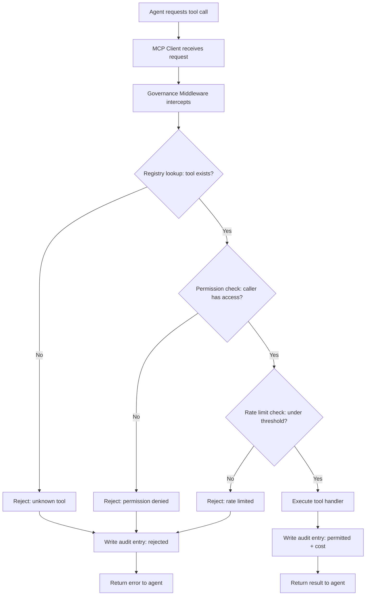

# Capstone 13 — MCP Server with Registry and Governance

## Learning Objectives

- Build a tool registry that stores permission tiers, cost units, and rate limits as queryable metadata separate from tool execution logic.
- Implement governance middleware that intercepts every tool call, evaluates permission and rate-limit policies, and returns structured rejection errors before execution.
- Write an append-only JSONL audit log that records both permitted and rejected invocations with caller identity and input hashes.
- Compare stdio transport against StreamableHTTP for stateless horizontal scaling of MCP servers.
- Deploy an MCP server with registry-backed tool discovery and human-approval gating for destructive operations.

## The Problem

You have built individual MCP tools — an enrichment lookup, a lead scorer, a Slack outreach sender. Each one works in isolation. Now imagine wiring them all into a single agent that a GTM team uses to research accounts, score fit, and draft outbound in one flow. The agent has access to 30 tools. Some hit paid APIs (Apollo, Clay, Clearbit). Some mutate state (send email, update CRM). Some are read-only and cheap (internal Postgres lookups). Without a control layer, the agent will call whatever it wants, whenever it wants, at whatever volume the prompt inspires.

This is not a theoretical concern. An agent that discovers it can enrich companies by domain will happily enrich 5,000 domains in a loop if the prompt is ambiguous about scope. At $0.04 per Apollo enrichment, that is $200 burned in under a minute. A governance layer that caps enrichment calls at 100 per minute per agent prevents this. But the cap cannot live inside the tool itself — the tool does not know who is calling it or why. The cap has to live in middleware that has visibility into the caller, the tool, and the invocation history.

The second problem is visibility. When a GTM ops lead asks "why did our API spend triple last Tuesday?" you need a log that shows every tool invocation: who called what, with what input, and what the outcome was. Without an audit trail, you are reverse-engineering cost spikes from billing dashboards. With one, you grep a JSONL file and find the exact agent and prompt that triggered the spike.

## The Concept

Three mechanisms, layered in sequence, solve this. They are not novel — API gateways have used the same pattern for years — but applying them to MCP tool calls is what makes agent-driven GTM stacks safe to run in production.

**Tool Registry.** A data structure that holds metadata about every tool the agent can invoke: name, input schema, owning team, cost tier, required permission level, and rate limit. The registry is not the tool handler itself. It is the catalog that the governance layer queries before allowing invocation. Without it, the governance middleware has nothing to reason about — it cannot check permissions for a tool whose metadata it cannot look up. The registry pattern mirrors `.well-known` discovery in the AAIF Registry spec [CITATION NEEDED — concept: AAIF Registry `.well-known` capability metadata], where servers publish their capabilities at a known endpoint for platform teams to discover and validate.

**Governance Middleware.** A function that sits between the agent's tool-call request and the actual tool handler. On every call, it performs three checks in order: (1) does the caller's permission set include the tool's required permission level? (2) has the caller exceeded the tool's per-minute rate limit? (3) does the input pass any custom validation beyond JSON Schema (for example, rejecting an enrichment call that asks for 10,000 records)? If any check fails, the middleware returns an error response — not a tool result. The tool handler never executes. This is the same architecture as an API gateway: intercept, evaluate policy, forward or reject.

**Audit Log.** Every invocation — permitted or rejected — writes one line to an append-only JSONL file containing timestamp, caller identity, tool name, input hash (not the raw input, to avoid logging PII), outcome, and cost units consumed. This is not debug logging. It is the record that cost attribution queries and compliance reviews depend on. If a GTM team disputes an API bill, the audit log is the source of truth.



The middleware is the gate. The registry is the reference data. The audit log is the evidence. All three are separate concerns, and keeping them separate matters: you can change rate-limit policy without touching tool handlers, and you can add a new tool to the registry without modifying the middleware logic.

## Build It

The code below builds a complete governance system in TypeScript. It registers three mock GTM tools — enrichment, scoring, and outreach — wraps them in governance middleware, and logs every call to a JSONL audit file. The test sequence at the bottom exercises all three governance outcomes: permitted calls, permission denials, and rate-limit rejections.

You need Node.js installed. Save the file as `capstone13.ts` and run it with `npx tsx capstone13.ts`. Install dependencies first:

```bash
npm init -y && npm install tsx
```

Here is the governance engine, registry, and test harness in one file:

```typescript
import { writeFileSync, appendFileSync, readFileSync, existsSync, createHash } from 'fs';

type PermissionLevel = 'read' | 'write' | 'admin';
type Outcome = 'permitted' | 'rejected';

interface ToolMetadata {
  name: string;
  description: string;
  permission: PermissionLevel;
  costUnits: number;
  rateLimitPerMinute: number;
  owningTeam: string;
}

interface ToolEntry {
  metadata: ToolMetadata;
  handler: (input: Record<string, unknown>) => Promise<Record<string, unknown>>;
}

interface CallerIdentity {
  agentId: string;
  permissions: PermissionLevel[];
}

interface AuditEntry {
  timestamp: string;
  callerId: string;
  toolName: string;
  inputHash: string;
  outcome: Outcome;
  rejectionReason: string | null;
  costUnits: number;
}

const PERMISSION_RANK: Record<PermissionLevel, number> = {
  read: 1,
  write: 2,
  admin: 3,
};

class ToolRegistry {
  private tools = new Map<string, ToolEntry>();

  register(metadata: ToolMetadata, handler: ToolEntry['handler']): void {
    this.tools.set(metadata.name, { metadata, handler });
  }

  get(name: string): ToolEntry | undefined {
    return this.tools.get(name);
  }

  list(): ToolMetadata[] {
    return Array.from(this.tools.values()).map((t) => t.metadata);
  }
}

class AuditLogger {
  constructor(private logPath: string) {
    writeFileSync(logPath, '');
  }

  log(entry: AuditEntry): void {
    appendFileSync(this.logPath, JSON.stringify(entry) + '\n');
  }

  readAll(): AuditEntry[] {
    if (!existsSync(this.logPath)) return [];
    return readFileSync(this.logPath, 'utf-8')
      .trim()
      .split('\n')
      .filter((line) => line.length > 0)
      .map((line) => JSON.parse(line) as AuditEntry);
  }
}

class RateLimiter {
  private callHistory = new Map<string, number[]>();

  isAllowed(key: string, limit: number): boolean {
    const now = Date.now();
    const windowMs = 60_000;
    const history = (this.callHistory.get(key) ?? []).filter((t) => now - t < windowMs);
    if (history.length >= limit) {
      this.callHistory.set(key, history);
      return false;
    }
    history.push(now);
    this.callHistory.set(key, history);
    return true;
  }
}

class GovernanceMiddleware {
  constructor(
    private registry: ToolRegistry,
    private audit: AuditLogger,
    private limiter: RateLimiter
  ) {}

  async invoke(
    toolName: string,
    input: Record<string, unknown>,
    caller: CallerIdentity
  ): Promise<{ ok: true; result: Record<string, unknown> } | { ok: false; error: string }> {
    const inputHash = createHash('sha256').update(JSON.stringify(input)).digest('hex').slice(0, 16);
    const tool = this.registry.get(toolName);

    if (!tool) {
      this.audit.log({
        timestamp: new Date().toISOString(),
        callerId: caller.agentId,
        toolName,
        inputHash,
        outcome: 'rejected',
        rejectionReason: 'unknown_tool',
        costUnits: 0,
      });
      return { ok: false, error: `Tool "${toolName}" is not registered` };
    }

    const requiredRank = PERMISSION_RANK[tool.metadata.permission];
    const callerMaxRank = Math.max(...caller.permissions.map((p) => PERMISSION_RANK[p]));

    if (callerMaxRank < requiredRank) {
      this.audit.log({
        timestamp: new Date().toISOString(),
        callerId: caller.agentId,
        toolName,
        inputHash,
        outcome: 'rejected',
        rejectionReason: `requires_${tool.metadata.permission}_permission`,
        costUnits: 0,
      });
      return {
        ok: false,
        error: `Caller "${caller.agentId}" lacks ${tool.metadata.permission} permission for "${toolName}"`,
      };
    }

    const rateLimitKey = `${caller.agentId}:${toolName}`;
    if (!this.limiter.isAllowed(rateLimitKey, tool.metadata.rateLimitPerMinute)) {
      this.audit.log({
        timestamp: new Date().toISOString(),
        callerId: caller.agentId,
        toolName,
        inputHash,
        outcome: 'rejected',
        rejectionReason: 'rate_limit_exceeded',
        costUnits: 0,
      });
      return {
        ok: false,
        error: `Rate limit of ${tool.metadata.rateLimitPerMinute}/min exceeded for "${toolName}"`,
      };
    }

    const result = await tool.handler(input);

    this.audit.log({
      timestamp: new Date().toISOString(),
      callerId: caller.agentId,
      toolName,
      inputHash,
      outcome: 'permitted',
      rejectionReason: null,
      costUnits: tool.metadata.costUnits,
    });

    return { ok: true, result };
  }
}

async function main() {
  const registry = new ToolRegistry();
  const audit = new AuditLogger('./audit.jsonl');
  const limiter = new RateLimiter();
  const governance = new GovernanceMiddleware(registry, audit, limiter);

  registry.register(
    {
      name: 'enrich_company',
      description: 'Look up company firmographics by domain',
      permission: 'read',
      costUnits: 4,
      rateLimitPerMinute: 5,
      owningTeam: 'data-platform',
    },
    async (input) => {
      const domain = input['domain'] as string;
      return {
        domain,
        employees: 250,
        industry: 'SaaS',
        revenue_band: '$10M-$50M',
      };
    }
  );

  registry.register(
    {
      name: 'score_lead',
      description: 'Score a lead 0-100 based on firmographics',
      permission: 'read',
      costUnits: 1,
      rateLimitPerMinute: 20,
      owningTeam: 'revops',
    },
    async (input) => {
      const domain = input['domain'] as string;
      return { domain, score: 78, tier: 'B', reason: 'industry_match, size_in_range' };
    }
  );

  registry.register(
    {
      name: 'send_outreach',
      description: 'Send a personalized email to a contact',
      permission: 'write',
      costUnits: 2,
      rateLimitPerMinute: 3,
      owningTeam: 'growth',
    },
    async (input) => {
      const email = input['email'] as string;
      return { email, status: 'sent', message_id: `msg_${Date.now()}` };
    }
  );

  console.log('=== Registered Tools ===');
  for (const tool of registry.list()) {
    console.log(
      `  ${tool.name} | perm: ${tool.permission} | cost: ${tool.costUnits}u | limit: ${tool.rateLimitPerMinute}/min | owner: ${tool.owningTeam}`
    );
  }
  console.log();

  const readOnlyAgent: CallerIdentity = {
    agentId: 'research-bot-01',
    permissions: ['read'],
  };

  const fullAccessAgent: CallerIdentity = {
    agentId: 'outreach-bot-01',
    permissions: ['read', 'write'],
  };

  console.log('=== Test 1: Permitted enrichment call ===');
  const r1 = await governance.invoke('enrich_company', { domain: 'acme.com' }, readOnlyAgent);
  console.log('  Result:', JSON.stringify(r1));
  console.log();

  console.log('=== Test 2: Permitted scoring call ===');
  const r2 = await governance.invoke('score_lead', { domain: 'acme.com' }, readOnlyAgent);
  console.log('  Result:', JSON.stringify(r2));
  console.log();

  console.log('=== Test 3: Permission denied (read-only agent tries write) ===');
  const r3 = await governance.invoke('send_outreach', { email: 'vp@acme.com' }, readOnlyAgent);
  console.log('  Result:', JSON.stringify(r3));
  console.log();

  console.log('=== Test 4: Permitted outreach call (full-access agent) ===');
  const r4 = await governance.invoke(
    'send_outreach',
    { email: 'vp@acme.com', body: 'Hi, saw your recent round...' },
    fullAccessAgent
  );
  console.log('  Result:', JSON.stringify(r4));
  console.log();

  console.log('=== Test 5: Rate limit enforcement (enrich at 5/min) ===');
  for (let i = 0; i < 7; i++) {
    const r = await governance.invoke('enrich_company', { domain: `company${i}.com` }, readOnlyAgent);
    console.log(`  Call ${i + 1}: ok=${r.ok}${r.ok ? '' : ' — ' + r.error}`);
  }
  console.log();

  console.log('=== Audit Log (full sequence) ===');
  const entries = audit.readAll();
  console.log(`  Total entries: ${entries.length}`);
  for (const entry of entries) {
    const detail = entry.outcome === 'rejected' ? `REJECTED (${entry.rejectionReason})` : 'PERMITTED';
    console.log(
      `  [${entry.timestamp}] ${entry.callerId} -> ${entry.toolName} | ${detail} | cost: ${entry.costUnits}u`
    );
  }
  console.log();

  const totalCost = entries
    .filter((e) => e.outcome === 'permitted')
    .reduce((sum, e) => sum + e.costUnits, 0);
  console.log(`=== Cost Attribution ===`);
  console.log(`  Total cost units consumed: ${totalCost}`);
  console.log(`  Calls permitted: ${entries.filter((e) => e.outcome === 'permitted').length}`);
  console.log(`  Calls rejected: ${entries.filter((e) => e.outcome === 'rejected').length}`);
}

main().catch(console.error);
```

Running this produces output showing the registry contents, each tool call result (including structured rejection messages), the full audit log, and a cost attribution summary. The rate-limit test fires 7 enrichment calls against a limit of 5 per minute, so calls 6 and 7 are rejected — and those rejections appear in the audit log with `rejectionReason: rate_limit_exceeded`.

The key architectural decision here is that the governance middleware returns a typed result: `{ ok: true, result }` or `{ ok: false, error }`. The agent client code must branch on `ok`. If the agent ignores the error and retries, the rate limiter will continue rejecting — and each rejected retry is logged. This is how you detect runaway loops in the audit data: a sudden spike of `rate_limit_exceeded` entries from the same `callerId` on the same tool.

Now wrap this in an actual MCP server using `@modelcontextprotocol/sdk`. The SDK handles stdio transport and JSON-RPC framing; your governance layer plugs into the tool-call handler:

```typescript
import { Server } from '@modelcontextprotocol/sdk/server/index.js';
import { StdioServerTransport } from '@modelcontextprotocol/sdk/server/stdio.js';
import {
  CallToolRequestSchema,
  ListToolsRequestSchema,
} from '@modelcontextprotocol/sdk/types.js';

const server = new Server(
  { name: 'gtm-governed-tools', version: '1.0.0' },
  { capabilities: { tools: {} } }
);

const registry = new ToolRegistry();
const audit = new AuditLogger('./audit.jsonl');
const limiter = new RateLimiter();
const governance = new GovernanceMiddleware(registry, audit, limiter);

registry.register(
  {
    name: 'enrich_company',
    description: 'Look up company firmographics by domain',
    permission: 'read',
    costUnits: 4,
    rateLimitPerMinute: 5,
    owningTeam: 'data-platform',
  },
  async (input) => ({
    domain: input['domain'],
    employees: 250,
    industry: 'SaaS',
  })
);

server.setRequestHandler(ListToolsRequestSchema, async () => ({
  tools: registry.list().map((m) => ({
    name: m.name,
    description: m.description,
    inputSchema: { type: 'object', properties: {} },
  })),
}));

server.setRequestHandler(CallToolRequestSchema, async (request) => {
  const caller: CallerIdentity = {
    agentId: (request.params as Record<string, unknown>)['_callerId'] as string ?? 'default-agent',
    permissions: ['read', 'write'],
  };

  const result = await governance.invoke(
    request.params.name,
    request.params.arguments as Record<string, unknown>,
    caller
  );

  if (!result.ok) {
    return {
      content: [{ type: 'text', text: `GOVERNANCE REJECTION: ${result.error}` }],
      isError: true,
    };
  }

  return {
    content: [{ type: 'text', text: JSON.stringify(result.result, null, 2) }],
  };
});

const transport = new StdioServerTransport();
await server.connect(transport);
```

The MCP server delegates every tool call through the governance middleware. The `isError: true` flag in the rejection response is how MCP communicates tool-call failures to the agent — the agent sees the error text and can decide whether to retry with different parameters or give up. The governance layer itself does not retry; it rejects and logs.

## Use It

The governance pattern above maps directly to Zone 3 — Tool Orchestration — in production GTM stacks. The canonical example is the Clay waterfall: enrich person email → enrich company firmographics → score fit → route to Slack or CRM. Each step calls a different API with a different cost profile. Apollo enrichment costs real money per call. Clay credits have a finite pool. A Slack message is nearly free but still rate-limited by Slack's API. Without governance, one ambiguous agent prompt triggers the full waterfall on every row in a 10,000-row CSV — and the first sign of trouble is a billing alert.

The tool registry solves the attribution problem. When you register `enrich_company` with `costUnits: 4` and `owningTeam: 'data-platform'`, you can query the audit log at the end of the month and compute exactly how many cost units the data-platform team's tools consumed versus the growth team's tools. This is the data that justifies or kills tool budgets. Without per-tool cost metadata in the registry, you are estimating from API provider billing dashboards, which aggregate across all callers and do not know which agent initiated the call.

The governance middleware solves the containment problem. In a Clay waterfall scenario, the enrichment tool might have a rate limit of 100 calls per minute — the maximum the API provider allows before throttling. Your middleware enforces that limit at 80 per minute to leave headroom. When the agent tries to enrich the 81st company in under a minute, the middleware rejects the call, logs the rejection, and returns a structured error. The agent can be prompted to back off, or the orchestrator can queue remaining rows for the next minute. Either way, you never hit the provider's throttle, and you never waste calls on rate-limit errors that providers do not refund.

The audit log solves the debugging problem. When a GTM ops lead says "the enrichment waterfall produced wrong data for 200 companies last Tuesday," you grep the audit log for that date, find the 200 `enrich_company` calls from the specific agent, and check the input hashes to see whether the inputs were wrong (bad domains passed in) or the tool returned bad data (provider issue). The input hash lets you correlate without storing raw PII — you hash the input at call time and hash the candidate input during debugging to find the matching audit entry.

This same governance pattern also applies to Zone 19 (RAG-augmented outreach). When an agent retrieves case studies and product docs to personalize copy, the retrieval tool itself should be governed: rate-limited to prevent vector-store query flooding, permission-gated so only authorized agents can access competitive battlecard collections, and audit-logged so you can trace which case study was injected into which outbound message. The registry entry for a `retrieve_case_study` tool would carry `permission: 'read'`, a rate limit, and an owning team tag that attributes usage to the content or enablement team.

## Ship It

Moving from stdio to production means switching transports and adding discovery. The 2026 MCP revision mandates StreamableHTTP as the default transport. Unlike stdio (which requires a local process per client) or the older SSE shape (which maintains long-lived connections), StreamableHTTP is stateless: each request is a standalone HTTP POST, and the server can scale horizontally behind a load balancer with no sticky sessions. This matters for GTM tool servers that receive burst traffic — imagine 50 SDRs triggering enrichment workflows simultaneously at 9 AM on a Monday.

Here is a minimal StreamableHTTP deployment using the SDK's HTTP transport and Express:

```typescript
import express from 'express';
import { Server } from '@modelcontextprotocol/sdk/server/index.js';
import { StreamableHTTPServerTransport } from '@modelcontextprotocol/sdk/server/streamableHttp.js';
import {
  CallToolRequestSchema,
  ListToolsRequestSchema,
} from '@modelcontextprotocol/sdk/types.js';

const app = express();
app.use(express.json());

function createServer(): Server {
  const server = new Server(
    { name: 'gtm-governed-tools', version: '1.0.0' },
    { capabilities: { tools: {} } }
  );

  const registry = new ToolRegistry();
  const audit = new AuditLogger(`./audit-${Date.now()}.jsonl`);
  const limiter = new RateLimiter();
  const governance = new GovernanceMiddleware(registry, audit, limiter);

  registry.register(
    {
      name: 'enrich_company',
      description: 'Look up company firmographics by domain',
      permission: 'read',
      costUnits: 4,
      rateLimitPerMinute: 5,
      owningTeam: 'data-platform',
    },
    async (input) => ({ domain: input['domain'], employees: 250, industry: 'SaaS' })
  );

  server.setRequestHandler(ListToolsRequestSchema, async () => ({
    tools: registry.list().map((m) => ({
      name: m.name,
      description: m.description,
      inputSchema: { type: 'object', properties: {} },
    })),
  }));

  server.setRequestHandler(CallToolRequestSchema, async (request) => {
    const caller: CallerIdentity = {
      agentId: 'http-client',
      permissions: ['read', 'write'],
    };
    const result = await governance.invoke(
      request.params.name,
      request.params.arguments as Record<string, unknown>,
      caller
    );
    if (!result.ok) {
      return {
        content: [{ type: 'text', text: `GOVERNANCE REJECTION: ${result.error}` }],
        isError: true,
      };
    }
    return { content: [{ type: 'text', text: JSON.stringify(result.result) }] };
  });

  return server;
}

app.post('/mcp', async (req, res) => {
  const transport = new StreamableHTTPServerTransport({ sessionIdGenerator: undefined });
  const server = createServer();
  try {
    await server.connect(transport);
    await transport.handleRequest(req, res, req.body);
  } catch (err) {
    res.status(500).json({ error: String(err) });
  }
});

app.listen(3000, () => {
  console.log('MCP server listening on http://localhost:3000/mcp');
});
```

Each request creates a fresh server instance with a fresh rate limiter. This is the stateless tradeoff