# Capstone 14 — Speculative-Decoding Inference Server

## Learning Objectives

1. Implement a speculative decoding loop with separate draft and target models, including draft generation, target verification, and rejection-based resampling
2. Measure and compare token-by-token latency between standard autoregressive decoding and speculative decoding on identical prompts
3. Evaluate draft acceptance rate and compute its empirical relationship to throughput gains
4. Configure draft-model sizing heuristics (parameter ratio, K value) for a given target model
5. Detect conditions where speculative decoding produces net-negative latency and implement adaptive fallback

## The Problem

You are paying for GPU compute by the millisecond. Standard autoregressive decoding generates one token per forward pass — every single token pays the full latency cost of running the entire model end to end. For a 70B parameter model, that means moving 140 GB of weights (in FP16) through the GPU's memory hierarchy to produce a single token. The bottleneck is memory bandwidth, not FLOPs. The GPU's tensor cores sit idle while weights stream from HBM. If you are serving a model that generates 30 tokens per second, the compute utilization might be 5–10% of what the silicon can actually do.

This matters acutely when your workload is batch generation of personalized content. A go-to-market team running knowledge-augmented outreach — embedding product docs, case studies, and ICP-specific value propositions into outbound copy (Zone 19 in the GTM stack) — needs to generate hundreds or thousands of personalized messages per hour. Each message requires a distinct generation call. At 30 tokens per second per GPU, the math gets expensive fast. You either buy more GPUs or you make each GPU produce tokens faster.

Speculative decoding attacks this from the bandwidth angle. Instead of one token per forward pass, a tiny draft model guesses the next K tokens cheaply, and the target model verifies all K in a single forward pass — the same pass it would have used for one token. If the draft model guesses well, you get 2–3× throughput with mathematically zero quality loss. If it guesses poorly, you fall back to baseline speed. The mechanism is purely an inference-time technique: no retraining, no fine-tuning, no architecture change. The craft is entirely in the serving operations — choosing the right draft model, tuning K, monitoring acceptance rate drift, and reporting tail latency honestly.

## The Concept

### The mechanism: draft-then-verify

Standard autoregressive decoding runs the target model sequentially. You feed the prompt through the model, take the logits at the final position, sample (or argmax) the next token, append it to the input, and repeat. Each iteration moves the full weight matrix through memory to produce exactly one token. The GPU's compute units are mostly idle — they could handle a much larger batch, but there is nothing for them to multiply because the next token depends on the current one.

Speculative decoding exploits this idle compute with two models running in series. A **draft model** — small, fast, ideally aligned with the target — generates K candidate tokens autoregressively. Each draft forward pass is cheap because the draft model is 10–50× smaller. Then the **target model** processes the original sequence plus all K draft tokens in a single forward pass. Because the target model computes logits for every position in the sequence (that is how causal attention works), it produces predictions at all K+1 positions simultaneously. You compare the target's prediction at each position against the draft model's guess. Matching tokens are accepted. The first mismatch triggers a resample from the target's distribution at that position, and the loop restarts.

```mermaid
flowchart TD
    A([Current token sequence]) --> B[Draft model: autoregressively generate K candidate tokens]
    B --> C[Target model: single forward pass over sequence + K draft tokens]
    C --> D{i less than K?}
    D -->|Yes| E[Compare draft token i with target argmax at position i]
    E -->|Match| F[Accept token, increment i]
    F --> D
    E -->|Mismatch| G[Resample from target distribution, stop checking]
    D -->|No| H[Extract bonus token from target logits at final position]
    H --> I[Append accepted tokens + bonus or correction]
    G --> I
    I --> J{Target length reached?}
    J -->|No| B
    J -->|Yes| K([Output sequence — distribution identical to pure target decoding])
```



The mathematical guarantee is the critical property. The output distribution of speculative decoding is **identical** to running the target model autoregressively. This is not an approximation. The acceptance/rejection procedure is constructed so that accepted tokens follow the target model's distribution exactly, and rejected tokens are resampled from the target's distribution at the point of rejection. The draft model only affects *speed*, never *quality*. The proof relies on a modified rejection sampling scheme: you accept a draft token with probability min(1, p_target(x) / p_draft(x)), and when you reject, you sample from the residual distribution normalized over the rejected mass. In the greedy (argmax) case used for demonstration, this simplifies to: accept if and only if the draft's top choice matches the target's top choice.

### Key variables and their tradeoffs

**K** (speculation length): The number of tokens the draft model proposes per round. Higher K means more potential tokens per target forward pass, but also more wasted draft computation when the draft diverges early. Production systems typically use K = 4–8. EAGLE-3 in vLLM 0.7 defaults to K = 5 and reports 2.5–3× throughput on real traffic distributions [CITATION NEEDED — concept: EAGLE-3 default K and throughput numbers, source: vLLM 0.7 release notes or EAGLE-3 paper].

**Acceptance rate**: The fraction of draft tokens the target model accepts. This depends entirely on how well the draft model approximates the target's distribution. An EAGLE-3 head trained on the target model's hidden states achieves 60–80% acceptance. A randomly chosen small model with no alignment training might see 20–40%. Acceptance rate is not static — it drifts with the input distribution. Code generation, prose, and domain-specific text have different acceptance profiles.

**Draft model size**: The ratio that governs the speedup ceiling. A draft model that is 50× smaller runs roughly 50× faster per token, so the overhead of generating K draft tokens is negligible. But a tiny draft model also has lower acceptance rate. The sweet spot is typically a draft that is 10–30× smaller, trained or fine-tuned to align with the target. Red Hat's Speculators hub publishes aligned draft heads for common open models including Llama 3.3 70B, Qwen3-Coder-30B MoE, and GPT-OSS-120B [CITATION NEEDED — concept: Red Hat Speculators hub model list, source: Red Hat Speculators repository].

### Why this fails

If the draft acceptance rate drops below a threshold that depends on K and the draft-to-target compute ratio, the overhead of generating and rejecting speculative tokens exceeds the speedup. The draft model still has to run K forward passes. The target model still has to process a longer sequence. When most tokens are rejected, you have done strictly more work than standard decoding for the same output. The server needs a fallback path: detect low acceptance rate over a sliding window and reduce K or disable speculation entirely.

This is not a theoretical concern. Acceptance rate drifts when the traffic distribution shifts. A draft model aligned on ShareGPT-style conversations will see degraded acceptance on code, on long-context reasoning, or on domain-specific jargon. SGLang's SpecForge addresses this by providing a training pipeline for draft heads on specific traffic distributions [CITATION NEEDED — concept: SpecForge training pipeline details, source: SGLang documentation or SpecForge paper]. But even with a well-trained draft, you need monitoring.

## Build It

This implementation uses GPT-2 (124M parameters) as the draft model and GPT-2-medium (355M parameters) as the target. They share a tokenizer (vocab size 50,257), which simplifies the code. The size ratio is only 2.9× — much smaller than the 10–50× you would use in production — but it demonstrates the mechanism clearly and runs on CPU in under a minute.

The code implements greedy speculative decoding (argmax at every step) rather than the full rejection-sampling version. Greedy mode loses the distributional equivalence guarantee — the output matches greedy decoding from the target model, not sampled decoding — but it makes the acceptance logic transparent and observable. The production version in vLLM implements the full probabilistic acceptance/rejection scheme.

```python
import torch
import time
from transformers import AutoModelForCausalLM, AutoTokenizer

draft_name = "gpt2"
target_name = "gpt2-medium"

tokenizer = AutoTokenizer.from_pretrained(target_name)
draft_model = AutoModelForCausalLM.from_pretrained(draft_name).eval()
target_model = AutoModelForCausalLM.from_pretrained(target_name).eval()

K = 4
NUM_ROUNDS = 5
PROMPT = "The future of artificial intelligence