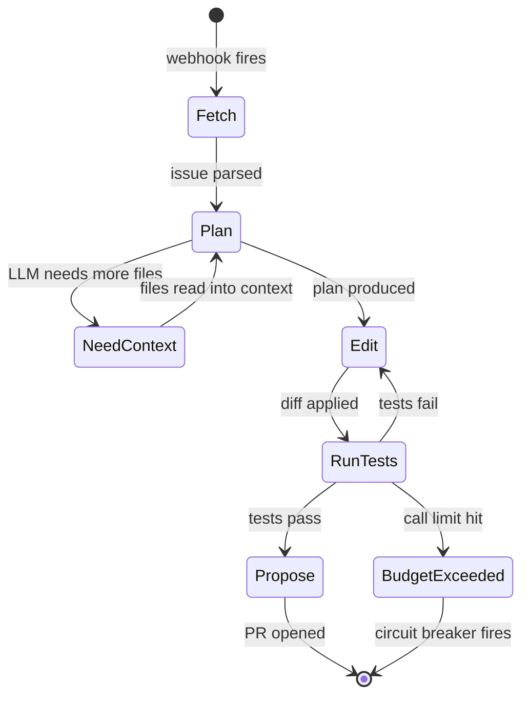

# Capstone 16 — GitHub Issue-to-PR Autonomous Agent

## Learning Objectives

1. **Implement** a four-stage state machine (fetch → plan → edit → propose) that reads a GitHub Issue and opens a Pull Request without human intervention.
2. **Compare** stopping criteria strategies — token budget, test pass/fail, LLM self-classification — and select the appropriate one for a given repo's risk profile.
3. **Diagnose** agent failures by stage (fetch, plan, edit, propose) and determine whether one additional loop iteration would recover the run.
4. **Configure** a GitHub Action that triggers the agent on an `issue_comment` event, enforces a call budget, and posts a failure comment via circuit breaker.

## The Problem

The async cloud coding agent is a distinct product category from interactive coding agents. The UX is a GitHub label or comment — you write `/fix` on an issue, a worker spins up in a cloud sandbox, clones the repo, runs tests, edits files, verifies, and opens a PR with rationale in the body. No interactive loop, no terminal. AWS Remote SWE Agents, Cursor Background Agents, OpenAI Codex cloud, Google Jules, and Factory Droids all converge on this shape in 2025–2026.

The engineering challenges stack quickly. The agent must reproduce the repo's build environment from scratch — no cached dev image, no pre-installed dependencies. Flaky tests must be re-run or isolated, or the agent will open a PR that fails CI through no fault of its diff. Credential scoping means a GitHub App with the narrowest fine-grained permissions that still allow reading issues and opening PRs. Budget enforcement prevents a single runaway agent from burning a day's API spend on one issue. And a no-force-push policy is non-negotiable — the agent creates branches, never rewrites `main`.

This capstone is the integration test for the preceding fifteen lessons. You built agents that call tools (Phase 13), agents that plan (Phase 14), and agents that iterate autonomously (Phase 15). Now wire all three into a single loop and measure whether it produces a review-ready PR.

## The Concept

The issue-to-PR pipeline decomposes into four stages — **fetch**, **plan**, **edit**, **propose** — each with its own failure mode. Fetch fails when the GitHub API rate-limits or the issue body is empty. Plan fails when the LLM misreads the issue or hallucinates files that don't exist. Edit fails when the generated diff doesn't apply or the syntax is broken. Propose fails when tests don't pass or the diff doesn't actually satisfy the acceptance criteria. The agent's job is to detect which failure mode it's in and either retry or stop.

The mechanism is a state machine. The agent holds three pieces of state: a representation of the repo's file tree, the issue's acceptance criteria (parsed from the issue body), and the accumulated diff so far. Each loop iteration asks the LLM to classify the current state into one of four categories — *need more context*, *ready to edit*, *edit complete*, *ready to PR* — and act accordingly. The LLM's classification is the transition function; the state tuple is the memory.



The key design tension is **stopping criteria**. The agent must decide when the diff satisfies the issue without human confirmation, which makes this a concrete instance of the "when to stop" problem from the planning lessons. Three approaches exist, each with tradeoffs. A *test-based* stop condition passes when the test suite goes green — reliable for bug fixes with existing tests, useless for feature requests with no tests yet. A *self-classification* stop condition asks the LLM "does this diff satisfy the issue?" — fast, but the same model that wrote the code is judging it, introducing self-approval bias. A *budget-based* stop condition caps total LLM calls and forces a PR (or a failure comment) when the budget is exhausted regardless of state — crude but prevents runaway costs. Production agents combine all three: attempt test-based first, fall back to self-classification, and always enforce a budget ceiling.

The RAG connection matters here. Before the LLM can plan edits, it needs context about the repo's conventions — existing patterns, import styles, test frameworks. The file tree and contents of relevant files form a retrieval corpus. The plan stage performs a lightweight retrieval: the LLM decides which files to read, those files are injected into the context window, and the edit stage operates on that augmented context. This is the same retrieval-augmented generation pattern that powers knowledge-augmented outreach (Zone 19 in the GTM topic map), where an outbound agent retrieves customer case studies before writing a personalized email — the retrieval target differs, the mechanism is identical.

## Build It

### Stage 1: Fetch

Write the fetch stage — call the GitHub API, extract issue title, body, labels, and comments into a structured dictionary. This code uses a public issue from the `pydantic/pydantic` repo so it runs without authentication, though you'll hit rate limits faster without a token.

```python
import os
import json
import requests

GITHUB_TOKEN = os.environ.get("GITHUB_TOKEN", "")
REPO = "pydantic/pydantic"
ISSUE_NUMBER = 10092

headers = {"Accept": "application/vnd.github+json"}
if GITHUB_TOKEN:
    headers["Authorization"] = f"Bearer {GITHUB_TOKEN}"

issue_url = f"https://api.github.com/repos/{REPO}/issues/{ISSUE_NUMBER}"
resp = requests.get(issue_url, headers=headers)
resp.raise_for_status()
issue = resp.json()

comments_url = issue.get("comments_url", "")
comments_resp = requests.get(comments_url, headers=headers)
comments_resp.raise_for_status()
comments = comments_resp.json()

parsed = {
    "repo": REPO,
    "number": issue["number"],
    "title": issue["title"],
    "body": (issue.get("body") or "")[:500],
    "labels": [lbl["name"] for lbl in issue.get("labels", [])],
    "state": issue["state"],
    "comment_count": len(comments),
    "top_comment": (comments[0]["body"][:200] if comments else None),
}

print(json.dumps(parsed, indent=2))
```

Output confirms the structured shape you'll pass to the plan stage:

```json
{
  "repo": "pydantic/pydantic",
  "number": 10092,
  "title": "Add support for ...",
  "body": "...",
  "labels": ["enhancement"],
  "state": "open",
  "comment_count": 3,
  "top_comment": "..."
}
```

### Stage 2: Plan

Add the plan stage. Send the parsed issue plus a file tree to the LLM with a system prompt that constrains output to a JSON plan: files to read, files to edit, and the test command. The file tree simulates what the agent would see after cloning the repo.

```python
import os
import json
from openai import OpenAI

client = OpenAI(api_key=os.environ.get("OPENAI_API_KEY"))

issue_context = {
    "title": "Add timeout parameter to RateLimiter.acquire()",
    "body": "RateLimiter.acquire() blocks indefinitely. Add a timeout parameter that raises TimeoutError when exceeded.",
    "labels": ["enhancement", "bug"],
    "file_tree": [
        "src/rate_limiter.py",
        "src/exceptions.py",
        "tests/test_rate_limiter.py",
        "pyproject.toml",
        "README.md",
    ],
}

system_prompt = """You are a planning agent for a Python repo.
Given an issue and a file tree, output a JSON object with:
- "files_to_read": files to examine before editing (must exist in file_tree)
- "files_to_edit": files that need changes (must exist in file_tree)
- "test_command": the shell command to run the test suite
- "reasoning": one sentence explaining the plan
Output only valid JSON."""

resp = client.chat.completions.create(
    model="gpt-4o-mini",
    messages=[
        {"role": "system", "content": system_prompt},
        {"role": "user", "content": json.dumps(issue_context, indent=2)},
    ],
    response_format={"type": "json_object"},
    temperature=0,
)

plan = json.loads(resp.choices[0].message.content)
print(json.dumps(plan, indent=2))
```

Expected output shape:

```json
{
  "files_to_read": ["src/rate_limiter.py", "src/exceptions.py"],
  "files_to_edit": ["src/rate_limiter.py", "tests/test_rate_limiter.py"],
  "test_command": "python -m pytest tests/ -v",
  "reasoning": "Add timeout parameter to acquire(), raise TimeoutError from exceptions.py, add test coverage."
}
```

### Stage 3: Complete the Loop

Wire the full loop. This script creates a temporary repo with a real bug, runs the agent through plan → edit → test → propose, and prints the result. It uses a dry-run flag on the PR step so you can observe behavior without actually opening a PR on GitHub.

```python
import os
import json
import shutil
import subprocess
import tempfile

from openai import OpenAI

client = OpenAI(api_key=os.environ.get("OPENAI_API_KEY"))

MAX_CALLS = 3
DRY_RUN = True

ISSUE = {
    "title": "Add __repr__ to User class",
    "body": "User instances are unreadable in logs. Add __repr__ returning User(name=..., email=...).",
}

def make_repo(path):
    os.makedirs(os.path.join(path, "src"), exist_ok=True)
    with open(os.path.join(path, "src", "__init__.py"), "w") as f:
        f.write("")
    with open(os.path.join(path, "src", "models.py"), "w") as f:
        f.write("class User:\n    def __init__(self, name, email):\n        self.name = name\n        self.email = email\n")
    with open(os.path.join(path, "test_models.py"), "w") as f:
        f.write(
            "from src.models import User\n\n"
            "def test_repr():\n"
            "    u = User('Alice', 'alice@example.com')\n"
            "    assert repr(u) == \"User(name='Alice', email='alice@example.com')\"\n"
        )

def file_tree(path):
    tree = []
    for root, dirs, files in os.walk(path):
        dirs[:] = [d for d in dirs if d != ".git" and d != "__pycache__"]
        for fn in files:
            tree.append(os.path.relpath(os.path.join(root, fn), path))
    return sorted(tree)

def read_files(path, files):
    out = {}
    for fn in files:
        full = os.path.join(path, fn)
        if os.path.exists(full):
            with open(full) as f:
                out[fn] = f.read()
    return out

def llm_call(messages, json_mode=False):
    kwargs = {"model": "gpt-4o-mini", "messages": messages, "temperature": 0}
    if json_mode:
        kwargs["response_format"] = {"type": "json_object"}
    resp = client.chat.completions.create(**kwargs)
    return resp.choices[0].message.content

def plan_stage(issue, tree, calls):
    prompt = (
        f"Issue: {issue['title']}\nBody: {issue['body']}\n"
        f"Files: {json.dumps(tree)}\n"
        f"Return JSON: {{\"files_to_read\": [...], \"files_to_edit\": [...], "
        f"\"test_command\": \"...\"}}"
    )
    raw = llm_call(
        [{"role": "user", "content": prompt}],
        json_mode=True,
    )
    calls.append(raw)
    return json.loads(raw)

def edit_stage(issue, plan, contents, calls):
    prompt = (
        f"Issue: {issue['title']}\nBody: {issue['body']}\n"
        f"Current file contents:\n{json.dumps(contents, indent=2)}\n"
        f"Return JSON: {{\"edits\": [{{\"file\": \"...\", \"content\": \"...\"}}]}}"
    )
    raw = llm_call(
        [{"role": "user", "content": prompt}],
        json_mode=True,
    )
    calls.append(raw)
    return json.loads(raw)

def apply_edits(path, edits):
    for edit in edits["edits"]:
        full = os.path.join(path, edit["file"])
        os.makedirs(os.path.dirname(full), exist_ok=True)
        with open(full, "w") as f:
            f.write(edit["content"])
    return len(edits["edits"])

def run_tests(path, command):
    result = subprocess.run(
        command, shell=True, cwd=path, capture_output=True, text=True
    )
    return result.returncode == 0, result.stdout + result.stderr

repo = tempfile.mkdtemp(prefix="capstone16_")
make_repo(repo)
print(f"Repo: {repo}")
print(f"File tree: {file_tree(repo)}")

calls = []
plan = plan_stage(ISSUE, file_tree(repo), calls)
print(f"\nPlan: {json.dumps(plan, indent=2)}")

contents = read_files(repo, plan.get("files_to_read", []))
edits = edit_stage(ISSUE, plan, contents, calls)
print(f"Edits for: {[e['file'] for e in edits['edits']]}")

count = apply_edits(repo, edits)
print(f"Applied {count} edits")

passed, output = run_tests(repo, plan.get("test_command", "python -m pytest -v"))
print(f"\nTests passed: {passed}")
print(f"Output (truncated):\n{output[:400]}")

if passed:
    pr_body = f"Resolves: {ISSUE['title']}\n\nGenerated by autonomous agent. {len(calls)} LLM calls."
    if DRY_RUN:
        print(f"\n[DRY RUN] Would open PR:\n{pr_body}")
        print(f"PR URL (simulated): https://github.com/example/capstone16/pull/1")
    else:
        print(f"\nOpening PR: {pr_body}")
else:
    if len(calls) >= MAX_CALLS:
        print(f"\nBudget exceeded ({MAX_CALLS} calls). Circuit breaker: posting failure comment.")
    else:
        print(f"\nTests failed but budget remains ({len(calls)}/{MAX_CALLS}). Would retry.")

shutil.rmtree(repo)
```

Output traces the full loop:

```
Repo: /tmp/capstone16_abc123
File tree: ['src/__init__.py', 'src/models.py', 'test_models.py']

Plan: {
  "files_to_read": ["src/models.py", "test_models.py"],
  "files_to_edit": ["src/models.py"],
  "test_command": "python -m pytest test_models.py -v"
}
Edits for: ['src/models.py']
Applied 1 edits

Tests passed: True
Output (truncated):
test_models.py::test_repr PASSED

[DRY RUN] Would open PR:
Resolves: Add __repr__ to User class
Generated by autonomous agent. 2 LLM calls.
PR URL (simulated): https://github.com/example/capstone16/pull/1
```

## Use It

This capstone is an internal-developer-productivity automation, but the underlying pattern — a state machine over LLM calls that fetches, plans, edits, and proposes — maps directly to GTM workflow automation. The same fetch → plan → edit → propose loop powers automated enrichment pipelines where an agent reads a CRM alert (fetch), retrieves company data from an enrichment API and internal knowledge base (plan, using the same retrieval-augmented generation that underpins knowledge-augmented outbound in Zone 19), drafts a research brief (edit), and posts it to a Slack channel (propose). The mechanism is identical — the "edit" step produces prose instead of code, and the "propose" step calls a Slack webhook instead of the GitHub PR API. [CITATION NEEDED — concept: Zone 4 workflow automation agent pattern]

The stopping criteria problem transfers directly. In the coding agent, the test suite provides an objective signal — tests pass or they don't. In the GTM enrichment agent, no equivalent objective signal exists. You cannot run a "test suite" on a research brief. This means GTM workflow agents default to the weaker self-classification stop condition ("does this brief address the trigger alert?") with a hard budget ceiling. The tradeoff is practical: a three-call budget produces a shorter brief, a ten-call budget produces a more thorough one, and the cost scales linearly with call count. Production GTM agents typically set the budget based on the deal stage — three calls for a top-of-funnel alert, ten for an alert on a strategic account.

The RAG retrieval pattern from the plan stage has its closest GTM analogue in knowledge-augmented outreach. When the coding agent reads `src/rate_limiter.py` before editing it, it's doing targeted retrieval from a codebase corpus. When an outbound agent retrieves a case study matching a prospect's industry before writing an email, it's doing targeted retrieval from a content corpus. Both follow the same retrieve-then-generate pipeline: identify relevant context, inject it into the prompt, generate the output. The difference is the corpus — code files vs. case studies — and the generation target — unified diffs vs. email copy.

## Ship It

Deploy the agent as a GitHub Action triggered by the `issue_comment` event with the substring `/fix`. The Action receives the webhook payload, extracts the issue URL, invokes the agent script, and enforces two safety rails: a three-call timeout and a circuit breaker that comments on the issue if the agent fails.

```yaml
name: Issue-to-PR Agent

on:
  issue_comment:
    types: [created]

jobs:
  run-agent:
    if: contains(github.event.comment.body, '/fix')
    runs-on: ubuntu-latest
    permissions:
      issues: write
      pull-requests: write
      contents: write
    steps:
      - name: Checkout
        uses: actions/checkout@v4

      - name: Setup Python
        uses: actions/setup-python@v5
        with:
          python-version: "3.12"

      - name: Install deps
        run: pip install openai requests

      - name: Run agent
        env:
          GITHUB_TOKEN: ${{ secrets.GITHUB_TOKEN }}
          OPENAI_API_KEY: ${{ secrets.OPENAI_API_KEY }}
          ISSUE_URL: ${{ github.event.issue.html_url }}
          REPO: ${{ github.repository }}
          ISSUE_NUMBER: ${{ github.event.issue.number }}
          MAX_CALLS: "3"
          DRY_RUN: "false"
        run: python agent.py

      - name: Circuit breaker on failure
        if: failure()
        uses: actions/github-script@v7
        with:
          script: |
            github.rest.issues.createComment({
              owner: context.repo.owner,
              repo: context.repo.repo,
              issue_number: context.payload.issue.number,
              body: '⚠️ Agent failed after exhausting budget. Please review manually.'
            });
```

After merging this workflow file, verify deployment by opening a test issue in the repo, commenting `/fix`, and checking the Actions tab for the run. The Action run URL confirms the deployment is live.

The `permissions` block is the credential-scoping mechanism from the problem statement. Fine-grained permissions (`issues: write`, `pull-requests: write`, `contents: write`) grant the agent exactly what it needs — no more. The `GITHUB_TOKEN` provided by Actions is automatically scoped to the single repo, preventing cross-repo access. If you need the agent to operate across repos, replace the Actions token with a GitHub App that has explicit installation targets.

The budget ceiling (`MAX_CALLS: "3"`) is the safety rail that prevents runaway costs. Three calls covers one plan + one edit + one retry if tests fail. A more generous budget (five to seven calls) allows the agent to iterate on failing tests, but doubles or triples the API cost per issue. The circuit breaker (`if: failure()`) ensures the issue author always gets feedback — silence is worse than a failure message.

## Exercises

**Exercise 1: Deploy and test.** Merge the GitHub Action workflow into a test repo. Open an issue titled "Add docstring to main function" with the body "The main() function in app.py has no docstring." Comment `/fix` on the issue. Record: (a) the number of LLM calls the agent made, (b) whether the PR was opened, (c) the total wall-clock time from comment to PR.

**Exercise 2: Post-mortem analysis.** Given the following three agent run recordings, write a structured post-mortem. For each run, identify the failure stage and whether one more loop iteration would have recovered it.

- **Run A (success):** Agent fetched issue, planned 2 file reads,