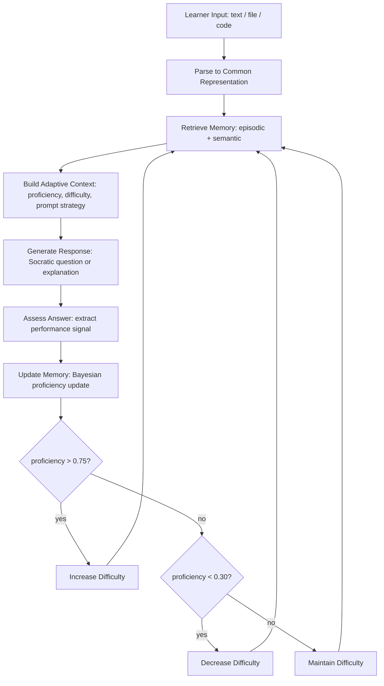

# Capstone 17 — Personal AI Tutor (Adaptive, Multimodal, with Memory)

## Learning Objectives

1. Implement a multi-turn conversational tutor with persistent learner memory across sessions using episodic and semantic storage.
2. Build an adaptive difficulty adjustment loop that responds to learner performance signals using Bayesian-style proficiency updates.
3. Design a multimodal input pipeline that parses `.txt` and `.py` files into a common representation the tutor can reason over.
4. Evaluate tutor effectiveness through session analytics including learning velocity and proficiency trajectory metrics.
5. Configure long-term memory storage with semantic retrieval for learner profile continuity across tutor instances and sessions.

## The Problem

Adaptive tutoring used to be an ed-tech research niche. By 2026 it is a consumer product category with real stakes. Khanmigo is deployed across most US school districts. Duolingo Max hit tens of millions of monthly active users. Google's LearnLM powers tutoring inside Google Classroom. Quizlet Q-Chat sits alongside flashcards. Synthesis Tutor achieved virality with tutor-for-curious-kids positioning. The common technical elements across all of these: multimodal input (type, speak, photograph equations), Socratic pedagogy (ask first, explain later), a learner model that updates after each interaction, and strict age-appropriate safety filters.

You are going to build one of these for a specific subject domain and cohort. The measurement bar is an actual efficacy study: pre-test and post-test scores over two weeks with 10 learners. The memory must persist between sessions and respect privacy constraints. The adaptation loop must demonstrably change behavior based on performance — not just generate questions, but adjust difficulty, explanation depth, and topic sequencing in response to what the learner actually does.

The hard part is not calling an LLM. The hard part is the closed loop: read performance signal, update a learner model, retrieve relevant memory, and let that memory shape the next interaction. If you remove any of those links, you have a chatbot, not a tutor.

## The Concept

An adaptive AI tutor requires three interlocking mechanisms: **memory** (what the learner has done and knows), **adaptation** (how the system adjusts to performance signals), and **multimodal input** (how the learner submits different content types). Each mechanism is independently well-understood. The capstone challenge is making them work as a closed loop where the output of one feeds the input of the next.

**Memory** splits into two layers. Episodic memory stores session-specific exchanges: the question asked, the answer given, the timestamp. This is your conversation log. Semantic memory stores knowledge-level assessments: the learner's proficiency score on "recursion" is 0.72, they have completed 14 attempts on "python_basics," their last session was three days ago. This is your learner model. The distinction matters because episodic memory grows linearly with interactions (eventually you need summarization or truncation), while semantic memory stays compact (a fixed set of proficiency scores per topic).

**Adaptation** is the loop that reads the semantic layer and adjusts three things: question difficulty, explanation depth, and topic sequencing. The mechanism is a proficiency estimate updated after each interaction using a simplified form of Bayesian knowledge tracing. When the learner answers correctly, their proficiency estimate moves toward 1.0. When they answer incorrectly, it moves toward 0.0. The update magnitude depends on the current estimate — a learner at 0.5 who answers correctly jumps more than a learner at 0.9 who answers correctly. Difficulty thresholds then map proficiency to a discrete level: below 0.30 is easy, 0.30–0.75 is medium, above 0.75 is hard.

**Multimodal input** extends beyond text prompts to include file uploads, code snippets, and structured data. Each input type gets parsed into a common representation — a dictionary with a type field, extracted features, and the raw content. A `.py` file yields function names, line count, and whether it contains class definitions. A `.txt` file yields word count and a sentence-level summary. The tutor reasons over this common representation regardless of how the content arrived.



The full pipeline runs on every interaction: input arrives, gets parsed, memory is retrieved, an adaptive context is assembled, the LLM generates a response, the answer is assessed, memory is updated, and performance signals feed back into the difficulty adjustment. The loop never exits — it runs for the duration of the learning session and the state persists to disk for the next one.

The Socratic constraint matters here. A tutor that dumps the answer teaches the learner to ask for answers. A tutor that asks leading questions teaches the learner to reason. The prompt strategy layer enforces this: the system prompt instructs the LLM to never provide a direct answer, always to respond with a question or a hint that moves the learner one step closer. This is a policy constraint, not a model capability — any sufficiently capable LLM can follow it if the prompt is explicit.

## Build It

The following code implements a terminal-based adaptive tutor with all three mechanisms. It parses `.txt` and `.py` files into a common representation, tracks learner proficiency using a Bayesian update rule, adjusts difficulty in real time, and persists learner profiles to disk as JSON. Run it and you will observe the adaptation loop in action — the tutor shifts difficulty as the simulated learner answers correctly or incorrectly, and the profile survives across tutor instances.

```python
import json
from datetime import datetime
from pathlib import Path

LEARNER_DIR = Path("learner_profiles")
LEARNER_DIR.mkdir(exist_ok=True)

QUESTION_BANK = {
    "recursion": {
        1: "What is the base case in a recursive function?",
        2: "Why does missing a base case cause a stack overflow?",
        3: "Trace the call stack of factorial(3) written recursively. What frames exist?",
    },
    "python_basics": {
        1: "What does len([1, 2, 3]) return?",
        2: "Explain the difference between a list and a tuple.",
        3: "How does a list comprehension differ from a for-loop with append()?",
    },
}

def bayesian_update(prior, correct, lr=0.3):
    if