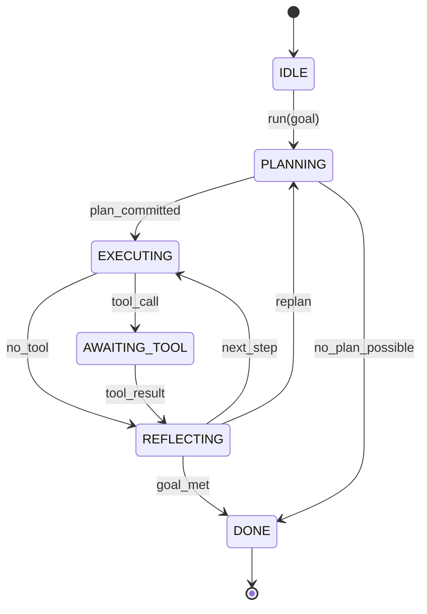

# Agent Harness Loop Contract

## Learning Objectives

- Specify an agent harness loop as a deterministic state machine with six named states, explicit transitions, and a budget envelope.
- Implement a typed input/output schema using Pydantic models that a harness validates before dispatching to any tool or model.
- Build a tool registry and termination predicate callback system that enforces per-session budgets without leaking partial state.
- Trace the Clay enrichment waterfall as a concrete instance of the harness loop contract — iterate, invoke, evaluate confidence, terminate.
- Compare the contract guarantees enforced by the OpenAI Agents SDK loop, LangGraph `StateGraph` cycles, and Anthropic's tool-use loop against a hand-rolled harness.

## The Problem

You build an agent that calls a model, gets a tool call back, executes it, feeds the result in, and repeats. It works for three turns. Then it runs for forty. Somewhere around turn fifteen the model starts hallucinating tool names. By turn twenty-five the accumulated context has drifted — the agent is operating on stale data from an early tool call that has since been overwritten. By turn thirty-two it has called the same read-only endpoint eleven times because nothing told it to stop. The process eats your token budget and produces nothing usable.

This is not a prompt engineering problem. The model behaved exactly as prompted. The failure is structural: there is no contract governing the loop. The loop has no declared states, no transition rules, no termination predicate, no budget guard, and no typed boundary between what the harness controls and what the model controls. Every iteration is ad hoc — the orchestrator and the model share mutable context with no schema, no validation, and no guardrails. When something goes wrong, you cannot point to the line of code that failed because the failure is in the absence of a constraint.

The agent harness loop contract solves this by freezing the control flow into a state machine. The harness owns the loop. The model is a coprocessor that receives typed input and returns typed output at specific states. The contract specifies the schema, the transitions, the termination conditions, and the budget. Once you write it down, swapping models, tools, or policies stops being a refactor — it becomes a registration call against an existing contract.

## The Concept

The harness loop contract has five components: **states**, **transitions**, **tool registration protocol**, **termination conditions**, and **state accumulation semantics**. Each component is a constraint the harness enforces, not a suggestion it makes to the model.

The loop has six states. Five are active, one is terminal. `IDLE` is the only legal entry point. `DONE` is the only legal exit. Every other state has a defined set of legal predecessors and successors. The harness enforces these transitions — if the model returns a tool call during `REFLECTING`, the harness rejects it because `REFLECTING` does not transition to `AWAITING_TOOL`. The model never sees the state names. It sees a prompt, returns a structured response, and the harness maps that response to a legal transition.



The **tool registration protocol** defines how tools enter the loop. A tool is a named function with a typed argument schema and a typed return schema. The registry validates both at registration time — not at call time. When the model returns a tool call, the harness checks the tool name against the registry, validates the arguments against the schema, and only then dispatches. If the tool name does not exist or the arguments fail validation, the harness records the error and transitions to `REFLECTING` with the error as context — it does not crash the loop.

The **termination conditions** are the contract's most critical guarantee. There are three ways the loop terminates: the termination predicate returns true (goal met), the budget is exhausted (max iterations, max tool calls, or wall-clock timeout), or an unrecoverable error occurs (tool not found after retry, schema mismatch after retry). The budget guard fires before the model is called — it checks the iteration count at the top of each cycle and short-circuits to `DONE` if exceeded. This prevents partial state from leaking into a new iteration that will never complete.

The **state accumulation semantics** define what the harness stores between iterations and how. The contract uses an append-only context log — tool calls and results are never overwritten, only appended. The model receives a projection of this log (filtered, summarized, or full depending on the harness configuration), but the source of truth is immutable. This prevents state drift: if the model claims a tool returned a value it did not return, the harness log contradicts it.

This maps directly to patterns you see in production frameworks. The OpenAI Agents SDK implements a tool-use loop where the SDK owns the cycle and the model returns structured tool calls — the contract enforces tool registration and max iterations but leaves termination predicates to the developer. LangGraph models the loop as a cyclic `StateGraph` where nodes are processing steps and edges are conditional transitions — the graph structure *is* the contract, and transitions are validated against declared edges. Anthropic's tool-use loop follows the same iterate-decide-act pattern, with the API returning a `stop_reason` of `tool_use` that signals the harness to execute and re-enter. The differences are in which guarantees each framework hard-codes versus leaves to the developer — but all three implement the same six-state contract at their core.

## Build It

The fastest way to see the contract boundaries is to build a minimal harness that runs against a mock responder — no API calls, no network, no Pydantic yet. Just the state machine, the transition rules, and the budget guard. The mock responder plays the model's role: it receives the current context and returns either a tool call or a final answer. The harness decides what to do with that response based on which state it is in.

```python
from dataclasses import dataclass, field
from enum import Enum

class State(Enum):
    IDLE = "IDLE"
    PLANNING = "PLANNING"
    EXECUTING = "EXECUTING"
    AWAITING_TOOL = "AWAITING_TOOL"
    REFLECTING = "REFLECTING"
    DONE = "DONE"

@dataclass
class LoopState:
    goal: str
    iteration: int = 0
    max_iterations: int = 5
    context_log: list = field(default_factory=list)
    tool_results: list = field(default_factory=list)
    state_history: list = field(default_factory=list)
    current: State = State.IDLE

    def transition(self, new_state: State):
        legal = {
            State.IDLE: {State.PLANNING},
            State.PLANNING: {State.EXECUTING, State.DONE},
            State.EXECUTING: {State.AWAITING_TOOL, State.REFLECTING},
            State.AWAITING_TOOL: {State.REFLECTING},
            State.REFLECTING: {State.EXECUTING, State.PLANNING, State.DONE},
            State.DONE: set(),
        }
        allowed = legal.get(self.current, set())
        if new_state not in allowed:
            raise RuntimeError(f"Illegal transition: {self.current.value} -> {new_state.value}")
        self.state_history.append(f"{self.current.value}->{new_state.value}")
        self.current = new_state

def mock_model_respond(goal: str, iteration: int, tool_results: list) -> dict:
    if iteration >= 3:
        return {"type": "final_answer", "content": f"Research complete for {goal}"}
    tool_name = "search" if iteration == 1 else "fetch_details"
    return {"type": "tool_call", "tool": tool_name, "args": {"q": f"{goal} step {iteration}"}}

def mock_tool_dispatch(name: str, args: dict) -> dict:
    return {"tool": name, "status": "ok", "payload": f"data_for_{args['q']}"}

def run_harness(goal: str) -> LoopState:
    ls = LoopState(goal=goal)

    ls.transition(State.PLANNING)
    print(f"[ENTRY] IDLE -> PLANNING (goal: {goal})")

    while ls.current != State.DONE:
        ls.iteration += 1
        print(f"\n--- Iteration {ls.iteration} ---")

        if ls.iteration > ls.max_iterations:
            print(f"[GUARD] Budget exceeded ({ls.max_iterations}). Halting.")
            ls.transition(State.DONE)
            break

        decision = mock_model_respond(ls.goal, ls.iteration, ls.tool_results)
        ls.context_log.append({"iter": ls.iteration, "decision": decision})
        print(f"[DECISION] type={decision['type']}", end="")
        if decision["type"] == "tool_call":
            print(f" tool={decision['tool']} args={decision['args']}")
        else:
            print(f" content={decision['content']}")

        if decision["type"] == "tool_call":
            ls.transition(State.EXECUTING)
            ls.transition(State.AWAITING_TOOL)
            result = mock_tool_dispatch(decision["tool"], decision["args"])
            ls.tool_results.append(result)
            print(f"[TOOL] {result['tool']} -> {result['payload']}")
            ls.transition(State.REFLECTING)
            print(f"[REFLECT] result accumulated, continuing")
        else:
            ls.transition(State.REFLECTING)
            print(f"[REFLECT] final answer received, terminating")
            ls.transition(State.DONE)

    print(f"\n{'='*55}")
    print(f"HARSES OUTPUT")
    print(f"  iterations_run: {ls.iteration}")
    print(f"  tool_calls: {len(ls.tool_results)}")
    print(f"  context_entries: {len(ls.context_log)}")
    print(f"  terminal_state: {ls.current.value}")
    print(f"  transitions:")
    for t in ls.state_history:
        print(f"    {t}")
    return ls

run_harness("Research ACME Corp market position")
```

Run this and you see the exact contract boundaries printed at each step. The `transition` method enforces legal edges — try changing the mock to return a tool call from `REFLECTING` and the harness raises `RuntimeError` instead of executing it. The budget guard at the top of the loop fires before the model is called. The context log is append-only — `tool_results` grows but entries are never mutated. This is the contract in miniature: schema, transitions, termination, accumulation.

The output confirms three things the contract guarantees. First, every transition is legal