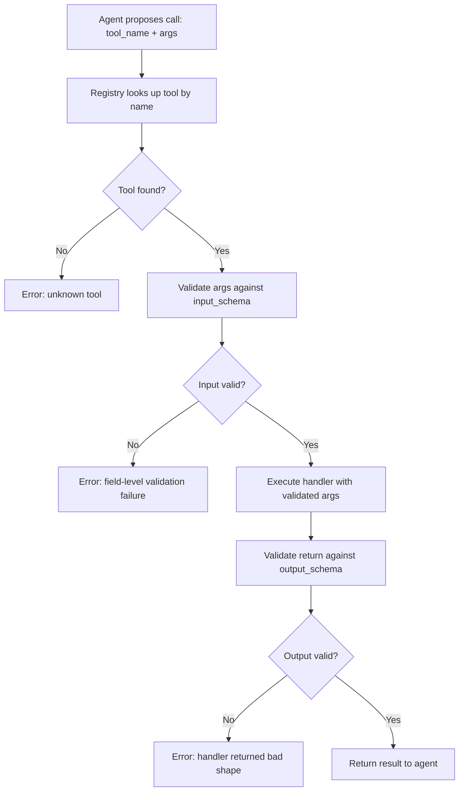

# Tool Registry with Schema Validation

## Learning Objectives

- Build a `ToolRegistry` class that maps tool names to callable handlers, input schemas, and output schemas, and validates both ends of every call.
- Implement JSON Schema validation that rejects invalid arguments before the handler runs and invalid outputs before the caller sees them.
- Trace a tool call through the registry pipeline: lookup → validate input → execute → validate output → return, and identify where each failure mode originates.
- Compare schema-gated tool execution against unvalidated direct calls, and articulate the specific production failures the registry prevents.
- Register enrichment-style tools (company lookup, contact search) with schemas that enforce field requirements matching real GTM data provider contracts.

## The Problem

You wired a web search tool into your agent. It worked in testing. In production, someone passed a negative `limit` parameter and the API returned 500 results instead of 10 — then billed you for all of them. Or the model hallucinated a `company_website` field that doesn't exist in the handler signature, the handler received `None`, and the stack trace surfaced in your logs at 3 AM. These are not edge cases. They are the default behavior of any system where the caller (an LLM generating structured arguments) and the callee (a Python function with positional parameters) share no contract.

The deeper problem is that LLMs are unreliable argument generators. They produce JSON that is *approximately* right: correct keys most of the time, correct types most of the time, plausible values that are sometimes out of range. A tool system with no validation layer treats all of that as trusted input. That is the same as exposing raw API endpoints with no request validation — it works until the traffic pattern you didn't test for shows up.

Schema validation is the contract layer between the model's output and your handler's execution. Every tool you register needs one: a declarative JSON Schema that says what inputs are legal, what types they carry, what constraints they satisfy (min/max, enum, format), and what the output shape looks like. Without it, you are shipping an agent with no guardrails on its hands.

## The Concept

A **tool registry** is a lookup table: tool name → callable function + input schema + output schema. When an agent decides to call a tool, the registry intercepts the call, validates the proposed arguments against the input schema, executes only if valid, and validates the return against the output schema before passing it back. The schemas are JSON Schema objects — the same specification used by OpenAI's function calling API, where each function definition carries a `parameters` field that is a JSON Schema dict.

The registry pattern separates *declaration* (what the tool expects) from *execution* (what the tool does). This separation matters because the model needs to see the declaration to decide whether and how to call the tool, but it must never touch the execution directly. The registry is the gatekeeper that stands between those two phases. It also solves a second problem: when you have forty tools registered, you need a single source of truth for "what exists" and "what shape does it take" that the dispatcher can query once and trust for the rest of the conversation.

The mechanism is a four-stage pipeline: schema-defined contract → pre-execution validation → execution → post-execution validation → result or structured error. If the input fails validation, the handler never runs — you return a typed error that tells the model exactly which field was wrong and why, so it can self-correct on the next turn. If the output fails validation, you catch a buggy handler before its garbage reaches the model's context window.



One more detail: the registry must reject re-registration of the same tool name without an explicit override flag. Silent overwrites are how production tool catalogs drift — you deploy a new version of a handler, the old registration shadows it under the same name, and you spend two hours wondering why your fix didn't take. The registry is a source of truth; it should act like one.

## Build It

Here is a working `ToolRegistry` class. It uses the `jsonschema` library for validation, which implements the JSON Schema specification. Install it first: `pip install jsonschema`.

The registry accepts tool registrations with a name, description, callable handler, input schema (JSON Schema), and output schema (JSON Schema). It validates inputs before execution, outputs after execution, and returns structured error dictionaries on any failure. Three tools are registered: `web_search`, `get_contact`, and `send_email`. Five test calls exercise both the happy path and the failure modes.

```python
import json
from jsonschema import validate, ValidationError
from typing import Callable, Any

class ToolRegistry:
    def __init__(self):
        self._tools = {}

    def register(
        self,
        name: str,
        description: str,
        handler: Callable,
        input_schema: dict,
        output_schema: dict,
        idempotent: bool = False,
        override: bool = False,
    ):
        if name in self._tools and not override:
            raise ValueError(
                f"Tool '{name}' already registered. Pass override=True to replace."
            )
        self._tools[name] = {
            "name": name,
            "description": description,
            "handler": handler,
            "input_schema": input_schema,
            "output_schema": output_schema,
            "idempotent": idempotent,
        }

    def list_tools(self):
        return [
            {"name": t["name"], "description": t["description"],
             "input_schema": t["input_schema"]}
            for t in self._tools.values()
        ]

    def call(self, name: str, arguments: dict) -> dict:
        if name not in self._tools:
            return {"ok": False, "error": f"Unknown tool: {name}", "type": "not_found"}

        tool = self._tools[name]

        try:
            validate(instance=arguments, schema=tool["input_schema"])
        except ValidationError as e:
            path = "/".join(str(p) for p in e.absolute_path) or "(root)"
            return {
                "ok": False,
                "error": f"Input validation failed at '{path}': {e.message}",
                "type": "input_validation",
            }

        try:
            result = tool["handler"](**arguments)
        except Exception as e:
            return {
                "ok": False,
                "error": f"Handler raised: {type(e).__name__}: {e}",
                "type": "handler_error",
            }

        try:
            validate(instance=result, schema=tool["output_schema"])
        except ValidationError as e:
            path = "/".join(str(p) for p in e.absolute_path) or "(root)"
            return {
                "ok": False,
                "error": f"Output validation failed at '{path}': {e.message}",
                "type": "output_validation",
            }

        return {"ok": True, "result": result, "tool": name}


def mock_web_search(query: str, limit: int = 10) -> dict:
    return {
        "query": query,
        "count": min(limit, 10),
        "results": [{"title": f"Result {i}", "url": f"https://example.com/{i}"} for i in range(min(limit, 10))],
    }

def mock_get_contact(email: str) -> dict:
    return {
        "email": email,
        "name": "Jordan Lee",
        "title": "VP of Engineering",
        "company": "Acme Corp",
    }

def mock_send_email(to: str, subject: str, body: str) -> dict:
    return {"message_id": "msg_001", "status": "sent", "to": to}

registry = ToolRegistry()

registry.register(
    name="web_search",
    description="Search the web and return ranked results.",
    handler=mock_web_search,
    input_schema={
        "type": "object",
        "properties": {
            "query": {"type": "string", "minLength": 1},
            "limit": {"type": "integer", "minimum": 1, "maximum": 50},
        },
        "required": ["query"],
        "additionalProperties": False,
    },
    output_schema={
        "type": "object",
        "properties": {
            "query": {"type": "string"},
            "count": {"type": "integer"},
            "results": {
                "type": "array",
                "items": {
                    "type": "object",
                    "properties": {
                        "title": {"type": "string"},
                        "url": {"type": "string"},
                    },
                    "required": ["title", "url"],
                },
            },
        },
        "required": ["query", "count", "results"],
    },
)

registry.register(
    name="get_contact",
    description="Look up a contact by email address.",
    handler=mock_get_contact,
    input_schema={
        "type": "object",
        "properties": {
            "email": {"type": "string", "format": "email"},
        },
        "required": ["email"],
        "additionalProperties": False,
    },
    output_schema={
        "type": "object",
        "properties": {
            "email": {"type": "string"},
            "name": {"type": "string"},
            "title": {"type": "string"},
            "company": {"type": "string"},
        },
        "required": ["email", "name", "title", "company"],
    },
)

registry.register(
    name="send_email",
    description="Send a transactional email.",
    handler=mock_send_email,
    input_schema={
        "type": "object",
        "properties": {
            "to": {"type": "string", "format": "email"},
            "subject": {"type": "string", "minLength": 1, "maxLength": 200},
            "body": {"type": "string", "minLength": 1},
        },
        "required": ["to", "subject", "body"],
        "additionalProperties": False,
    },
    output_schema={
        "type": "object",
        "properties": {
            "message_id": {"type": "string"},
            "status": {"type": "string", "enum": ["sent", "queued", "failed"]},
            "to": {"type": "string"},
        },
        "required": ["message_id", "status", "to"],
    },
)

test_calls = [
    ("web_search", {"query": "B2B SaaS pricing models", "limit": 5}),
    ("web_search", {"query": "test", "limit": -3}),
    ("get_contact", {"email": "jordan@acme.com"}),
    ("get_contact", {"email": "not-an-email"}),
    ("send_email", {"to": "prospect@company.com", "subject": "Quick question", "body": "Hi there,"}),
]

for tool_name, args in test_calls:
    print(f"\n{'='*60}")
    print(f"CALL: {tool_name}({json.dumps(args)})")
    result = registry.call(tool_name, args)
    print(f"  ok:    {result['ok']}")
    if result["ok"]:
        print(f"  result: {json.dumps(result['result'], indent=2)}")
    else:
        print(f"  error:  {result['error']}")
        print(f"  type:   {result['type']}")

print(f"\n{'='*60}")
print("REGISTERED TOOLS:")
for t in registry.list_tools():
    print(f"  {t['name']}: {t['description']}")
```

When you run this, the output shows five calls: three pass validation and return results, two fail with field-level error messages that pinpoint exactly what went wrong. The negative `limit` call fails at the input validation stage with a clear message about the minimum constraint. The malformed email fails at the same stage. Neither reaches the handler. This is the contract layer in action — the model gets a structured error it can use to self-correct, and your handler never sees garbage input.

## Use It

The enrichment waterfall pattern in Clay is a tool registry in GTM clothing. When Clay runs a waterfall over multiple enrichment providers — ZoomInfo, Apollo, Clearbit, Hunter — each provider is a tool with an input contract (what fields it needs: `domain`, `linkedin_url`, `email`) and an output contract (what fields it returns: `name`, `employee_count`, `industry`). The waterfall logic is a dispatcher that tries tools in priority order, and the schema validation layer is what prevents a provider from receiving a `domain` when it requires a `linkedin_url`, or from returning a shape the downstream routing logic can't consume.

Building your own tool registry with schema validation is the same mechanism Clay uses internally to gate which enrichment columns get populated and which get skipped based on input availability. [CITATION NEEDED — concept: Clay internal enrichment validation schema structure] The registry pattern lets you model this: each provider is a registered tool with its own input/output schemas, the waterfall is a loop over the registry, and the schema checker is the gate that decides whether a provider is even eligible to run given the current record's available fields.

Here is a mini-enrichment waterfall built on the registry pattern. Two providers are registered as tools with different input requirements. The waterfall tries them in order, skipping any provider whose input schema rejects the available fields:

```python
import json
from jsonschema import validate, ValidationError
from typing import Callable, Any

class EnrichmentRegistry:
    def __init__(self):
        self._providers = {}

    def register_provider(
        self,
        name: str,
        handler: Callable,
        input_schema: dict,
        output_schema: dict,
        priority: int = 0,
    ):
        self._providers[name] = {
            "name": name,
            "handler": handler,
            "input_schema": input_schema,
            "output_schema": output_schema,
            "priority": priority,
        }

    def _can_run(self, provider, record):
        try:
            validate(instance=record, schema=provider["input_schema"])
            return True
        except ValidationError:
            return False

    def waterfall(self, record: dict) -> dict:
        ranked = sorted(self._providers.values(), key=lambda p: p["priority"])
        log = []
        for provider in ranked:
            if not self._can_run(provider, record):
                log.append(f"  SKIP {provider['name']}: input schema rejected record")
                continue
            log.append(f"  RUN  {provider['name']}: input validated, executing")
            try:
                result = provider["handler"](**record)
                validate(instance=result, schema=provider["output_schema"])
                log.append(f"  PASS {provider['name']}: output validated")
                return {"ok": True, "provider": provider["name"], "data": result, "log": log}
            except Exception as e:
                log.append(f"  FAIL {provider['name']}: {e}")
        return {"ok": False, "provider": None, "data": {}, "log": log}


def zoominfo_enrich(domain: str) -> dict:
    return {"name": "Acme Corp", "employee_count": 450, "industry": "SaaS", "source": "zoominfo"}

def hunter_enrich(email: str) -> dict:
    return {"name": "Acme Corp", "employee_count": 0, "industry": "Unknown", "source": "hunter"}

enrichment = EnrichmentRegistry()

enrichment.register_provider(
    name="zoominfo",
    handler=zoominfo_enrich,
    input_schema={
        "type": "object",
        "properties": {"domain": {"type": "string"}},
        "required": ["domain"],
        "additionalProperties": True,
    },
    output_schema={
        "type": "object",
        "properties": {
            "name": {"type": "string"},
            "employee_count": {"type": "integer"},
            "industry": {"type": "string"},
            "source": {"type": "string"},
        },
        "required": ["name", "employee_count", "industry", "source"],
    },
    priority=1,
)

enrichment.register_provider(
    name="hunter",
    handler=hunter_enrich,
    input_schema={
        "type": "object",
        "properties": {"email": {"type": "string"}},
        "required": ["email"],
        "additionalProperties": True,
    },
    output_schema={
        "type": "object",
        "properties": {
            "name": {"type": "string"},
            "employee_count": {"type": "integer"},
            "industry": {"type": "string"},
            "source": {"type": "string"},
        },
        "required": ["name", "employee_count", "industry", "source"],
    },
    priority=2,
)

records = [
    {"domain": "acme.com", "email": "info@acme.com"},
    {"domain": "startup.io"},
    {"email": "founder@ghostcorp.com"},
    {"linkedin_url": "https://linkedin.com/company/no-domain-listed"},
]

for i, record in enumerate(records):
    print(f"\n{'='*60}")
    print(f"RECORD {i+1}: {json.dumps(record)}")
    result = enrichment.waterfall(record)
    for line in result["log"]:
        print(line)
    if result["ok"]:
        print(f"  => Enriched via {result['provider']}: {result['data']['name']}")
    else:
        print("  => No provider could handle this record")
```

Run this and watch the waterfall skip providers whose input schemas reject the record, run the first eligible provider, and validate the output before returning. This is the same gating logic that controls an enrichment waterfall in Clay: the schema decides what runs, not a hardcoded if/else chain.

## Ship It

In a production GTM system, the registry has two jobs beyond validation: it generates the tool definitions you expose to the model, and it logs every call for observability. The tool definitions are derived directly from the registered input schemas — this is the same format OpenAI's function calling API expects, so the registry doubles as the source of truth for both validation and model-facing declarations.

The logging layer is where the registry earns its keep in production. Because every call passes through `call()`, you have a single chokepoint to record what tool was called, with what arguments, whether it passed validation, and what it returned. This is how you debug enrichment pipelines that silently produce bad data — you replay the call log through the validator and find which provider returned a shape that violated its output schema.

Here is the registry extended with tool-definition generation and call logging. The tool definitions are exportable in the format OpenAI's API expects, and every call is appended to a log you can replay:

```python
import json
from jsonschema import validate, ValidationError
from typing import Callable, Any
from datetime import datetime, timezone

class ProductionRegistry:
    def __init__(self):
        self._tools = {}
        self._call_log = []

    def register(self, name, description, handler, input_schema, output_schema, override=False):
        if name in self._tools and not override:
            raise ValueError(f"Tool '{name}' already registered")
        self._tools[name] = {
            "name": name,
            "description": description,
            "handler": handler,
            "input_schema": input_schema,
            "output_schema": output_schema,
        }

    def export_tool_definitions(self):
        defs = []
        for tool in self._tools.values():
            defs.append({
                "type": "function",
                "function": {
                    "name": tool["name"],
                    "description": tool["description"],
                    "parameters": tool["input_schema"],
                },
            })
        return defs

    def call(self, name, arguments):
        entry = {
            "timestamp": datetime.now(timezone.utc).isoformat(),
            "tool": name,
            "input": arguments,
            "ok": None,
            "error": None,
            "output": None,
        }

        if name not in self._tools:
            entry["ok"] = False
            entry["error"] = f"Unknown tool: {name}"
            self._call_log.append(entry)
            return {"ok": False, "error": entry["error"]}

        tool = self._tools[name]

        try:
            validate(instance=arguments, schema=tool["input_schema"])
        except ValidationError as e:
            path = "/".join(str(p) for p in e.absolute_path) or "(root)"
            entry["ok"] = False
            entry["error"] = f"Input validation failed at '{path}': {e.message}"
            self._call_log.append(entry)
            return {"ok": False, "error": entry["error"]}

        try:
            result = tool["handler"](**arguments)
        except Exception as e:
            entry["ok"] = False
            entry["error"] = f"Handler error: {e}"
            self._call_log.append(entry)
            return {"ok": False, "error": entry["error"]}

        try:
            validate(instance=result, schema=tool["output_schema"])
        except ValidationError as e:
            path = "/".join(str(p) for p in e.absolute_path) or "(root)"
            entry["ok"] = False
            entry["error"] = f"Output validation failed at '{path}': {e.message}"
            self._call_log.append(entry)
            return {"ok": False, "error": entry["error"]}

        entry["ok"] = True
        entry["output"] = result
        self._call_log.append(entry)
        return {"ok": True, "result": result}

    def get_call_log(self):
        return self._call_log

    def replay_log(self, log=None):
        log = log or self._call_log
        results = []
        for entry in log:
            replayed = self.call(entry["tool"], entry["input"])
            results.append({
                "original_ok": entry["ok"],
                "replay_ok": replayed["ok"],
                "tool": entry["tool"],
                "match": entry["ok"] == replayed["ok"],
            })
        return results


def company_lookup(domain: str) -> dict:
    return {"name": "TechFlow", "employees": 120, "industry": "Fintech"}

def contact_search(name: str, company: str = "") -> dict:
    return {"email": f"{name.lower().replace(' ', '.')}@{company.lower() or 'example.com'}", "name": name}

prod = ProductionRegistry()

prod.register(
    name="lookup_company",
    description="Look up company data by domain.",
    handler=company_lookup,
    input_schema={
        "type": "object",
        "properties": {"domain": {"type": "string", "format": "uri"}},
        "required": ["domain"],
        "additionalProperties": False,
    },
    output_schema={
        "type": "object",
        "properties": {
            "name": {"type": "string"},
            "employees": {"type": "integer"},
            "industry": {"type": "string"},
        },
        "required": ["name", "employees", "industry"],
    },
)

prod.register(
    name="search_contact",
    description="Search for a contact by name.",
    handler=contact_search,
    input_schema={
        "type": "object",
        "properties": {
            "name": {"type": "string", "minLength": 1},
            "company": {"type": "string"},
        },
        "required": ["name"],
        "additionalProperties": False,
    },
    output_schema={
        "type": "object",
        "properties": {"email": {"type": "string"}, "name": {"type": "string"}},
        "required": ["email", "name"],
    },
)

print("EXPORTED TOOL DEFINITIONS (for OpenAI API):")
print(json.dumps(prod.export_tool_definitions(), indent=2))

calls = [
    ("lookup_company", {"domain": "https://techflow.com"}),
    ("lookup_company", {"domain": "not-a-url"}),
    ("search_contact", {"name": "Sarah Chen", "company": "TechFlow"}),
    ("search_contact", {}),
]

print(f"\n{'='*60}")
print("EXECUTING CALLS:")
for tool_name, args in calls:
    result = prod.call(tool_name, args)
    status = "PASS" if result["ok"] else "FAIL"
    print(f"  [{status}] {tool_name}({json.dumps(args)})")
    if not result["ok"]:
        print(f"         {result['error']}")

print(f"\n{'='*60}")
print("CALL LOG:")
for entry in prod.get_call_log():
    status = "OK" if entry["ok"] else "ERR"
    print(f"  [{status}] {entry['timestamp'][:19]} | {entry['tool']} | {entry['error'] or 'succeeded'}")

print(f"\n{'='*60}")
print("REPLAY (re-validates all logged calls):")
for r in prod.replay_log():
    match = "MATCH" if r["match"] else "DRIFT"
    print(f"  [{match}] {r['tool']}: original={r['original_ok']}, replay={r['replay_ok']}")
```

The tool definitions section shows exactly what you would pass to the OpenAI API's `tools` parameter. The call log gives you a replayable audit trail. The replay feature re-runs every logged call through the validator — if a handler started returning different shapes after a deploy, the replay catches the drift. In a Clay-style enrichment pipeline, this replay capability is how you detect that a provider changed their API response format without updating their documentation.

## Exercises

1. **Register a `lookup_company` tool** with an input schema requiring `domain` (type string, format: uri) and an output schema returning `{name, employee_count, industry}`. Call it with `{"domain": "https://stripe.com"}` (valid) and `{"domain": "stripe"}` (invalid). Confirm the second call fails at the input validation stage and never reaches the handler.

2. **Build a three-provider enrichment waterfall.** Register three tools: `zoominfo` (requires `domain`), `apollo` (requires `domain` or `linkedin_url`), and `hunter` (requires `email`). Write input schemas that accept the right fields and reject the wrong ones. Feed the waterfall four test records, each with different available fields, and verify each record hits the first eligible provider.

3. **Add an override test.** Register a tool named `web_search`, then attempt to register it again without `override=True`. Confirm the registry raises a `ValueError`. Then register it again with `override=True` and confirm it replaces the original. Print the tool list before and after to verify.

4. **Introduce a handler bug.** Modify `mock_get_contact` so it returns a dict missing the `company` field. Run a valid call through the registry and confirm the output validation stage catches it. The error message should point to the missing `company` property.

5. **Export and inspect tool definitions.** Add a method to the registry that exports all tools in OpenAI function-calling format (a list of dicts with `type: "function"` and `function: {name, description, parameters}`). Print the export and verify the `parameters` field matches the input schema you registered.

## Key Terms

- **Tool Registry** — A lookup table mapping tool names to their handler, input schema, and output schema. Acts as the single source of truth for what tools exist and what contracts they enforce.
- **JSON Schema** — A declarative specification language for validating the structure and constraints of JSON data. Used here to define what inputs a tool accepts and what outputs it produces.
- **Input Validation** — Pre-execution check where proposed arguments are validated against the tool's input schema. If validation fails, the handler never runs.
- **Output Validation** — Post-execution check where the handler's return value is validated against the output schema. Catches handler bugs before bad data reaches the model.
- **Enrichment Waterfall** — A GTM pattern where multiple data providers are tried in priority order until one returns valid data. The tool registry models each provider as a tool, and schema validation determines which providers are eligible for a given record.
- **Tool Definition Export** — Generating model-facing tool declarations (name, description, parameters schema) from the registry's internal records, typically in the format an LLM API expects for function calling.
- **Replay Log** — A recorded sequence of tool calls (input + result + validation status) that can be re-run through the validator to detect drift between deployments.

## Sources

- OpenAI function calling API: each function definition includes a `parameters` field that is a JSON Schema object. Source: OpenAI Platform Documentation, "Function Calling" section, https://platform.openai.com/docs/guides/function-calling
- JSON Schema 2020-12 specification: the validation keywords (`type`, `properties`, `required`, `minimum`, `maximum`, `format`, `additionalProperties`) used in the schemas throughout this lesson. Source: JSON Schema Specification, https://json-schema.org/specification
- [CITATION NEEDED — concept: Clay internal enrichment validation schema structure] — The claim that Clay uses schema-gated validation to control which enrichment providers receive which input fields in the waterfall pattern. Public documentation describes the waterfall behavior but does not expose the internal validation mechanism.
- Enrichment waterfall as a GTM pattern: providers tried in sequence with fallback logic. Source: Clay documentation on enrichment waterfalls, https://docs.clay.com/en/articles/8298012-enrichment-waterfall