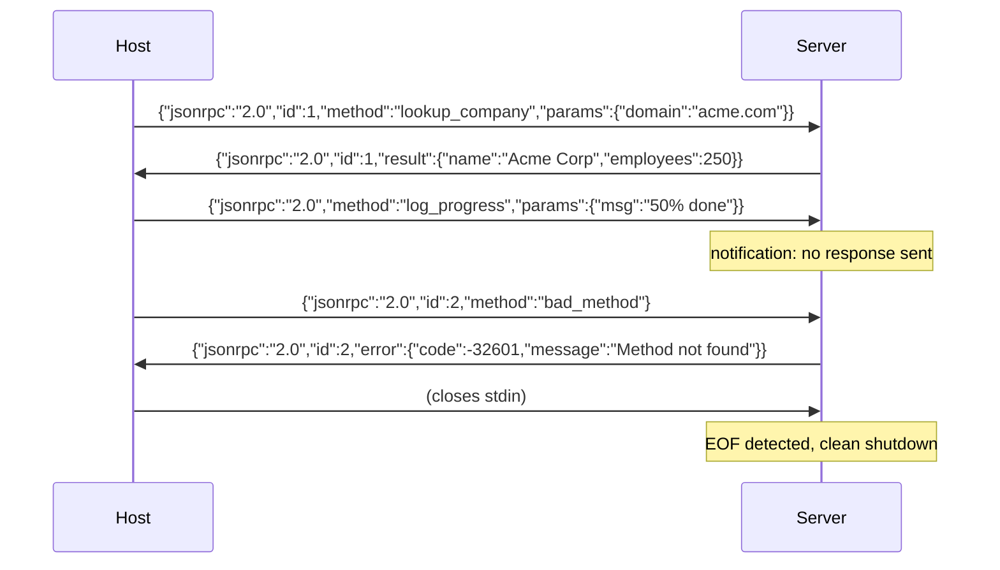

# JSON-RPC 2.0 Over Newline-Delimited Stdio

## Learning Objectives

- Implement a JSON-RPC 2.0 responder that reads newline-delimited requests from stdin and writes responses to stdout.
- Distinguish requests, notifications, and responses by inspecting the `id` field in the message envelope.
- Handle malformed JSON lines without crashing the server or corrupting the rest of the stream.
- Map the five standard JSON-RPC error codes (-32700 through -32603) to their correct semantics.
- Trace a complete round-trip exchange between a host process and a tool server using subprocess pipes.

## The Problem

When an LLM host needs to call a local tool server, it faces a transport problem. HTTP requires a port allocation, a server loop, and connection lifecycle management. WebSockets need a handshake. gRPC pulls in protobuf schemas and code generation. For a tool that takes a company domain and returns an employee count, this infrastructure overhead makes debugging harder, not easier—it adds moving parts between you and the data.

The stdio transport sidesteps all of it. The host spawns the server as a child process and communicates through the pipes the operating system already provides: stdin for input, stdout for output. No port to collide on, no firewall to configure, no handshake to fail. Every MCP server your GTM stack runs—whether through Clay's MCP integrations, an n8n custom node, or a standalone enrichment agent—speaks this protocol underneath the UI. If you cannot read a newline-delimited JSON-RPC message stream, you cannot debug why your enrichment tool silently returns empty results or why your RAG agent cannot reach its retrieval tool.

The wire format is JSON-RPC 2.0, and the framing is newline-delimited JSON. One JSON object per line. The newline character is the protocol boundary. That is the entire transport specification.

## The Concept

JSON-RPC 2.0 defines three message types: requests (expect a response), notifications (fire-and-forget), and responses (result or error). The specification is two pages and has been stable since 2013. It survives because it makes no assumptions about the underlying transport—the same message format works identically over stdio, TCP, WebSocket, or HTTP POST. A host can drive a server it has never seen before if both honor the spec.

A request is a JSON object with `jsonrpc: "2.0"`, an `id` (number or string), a `method` name, and optional `params`. A response carries the same `id` back with either a `result` or an `error` object. A notification looks identical to a request except it omits `id` entirely—the server processes it but sends nothing back. The `id` field is the correlation key: the host assigns it, the server echoes it, and without it the host cannot match a response to the request that triggered it. If a server sends a response without an `id`, the host drops it silently. This is the single most common cause of enrichment pipelines that return nothing with no error message.

The stdio transport frames each message as a single JSON object terminated by `\n`. The host writes to the server's stdin; the server writes to stdout. Stdin and stdout are two unidirectional channels that together create bidirectional RPC. stderr is reserved for logging—anything written to stdout that is not a valid JSON-RPC message will confuse the host's parser.



The spec also defines five reserved error codes in the -32700 to -32603 range. Parse error (-32700) means the incoming line was not valid JSON. Invalid Request (-32600) means the JSON parsed but was not a well-formed JSON-RPC envelope. Method not found (-32601) means the envelope was valid but the method name was unrecognized. Invalid params (-32602) means the method exists but the parameters were wrong. Internal error (-32603) is the catch-all for server-side failures. These codes are part of the protocol—your server should use them, not invent new ones, because hosts dispatch on them.

## Build It

The following script runs as both client and server in a single file. When invoked with `--serve`, it reads newline-delimited JSON-RPC messages from stdin and writes responses to stdout. When invoked without arguments, it spawns itself as a child process, sends a batch of mixed requests and notifications, and prints the full exchange. This demonstrates the round-trip without requiring two separate files.

```python
import sys
import json
import subprocess

ERROR_MESSAGES = {
    -32700: "Parse error",
    -32600: "Invalid Request",
    -32601: "Method not found",
    -32602: "Invalid params",
    -32603: "Internal error",
}

def make_error(code, msg_id=None, detail=None):
    message = detail or ERROR_MESSAGES[code]
    return {
        "jsonrpc": "2.0",
        "id": msg_id,
        "error": {"code": code, "message": message},
    }

def make_result(result, msg_id):
    return {"jsonrpc": "2.0", "id": msg_id, "result": result}

def handle_request(msg):
    method = msg.get("method")
    params = msg.get("params", {})
    msg_id = msg.get("id")

    if method == "lookup_company":
        domain = params.get("domain", "")
        companies = {
            "acme.com": {"name": "Acme Corp", "employees": 250, "industry": "Manufacturing"},
            "globex.com": {"name": "Globex", "employees": 1500, "industry": "Technology"},
        }
        if domain in companies:
            return make_result(companies[domain], msg_id)
        return