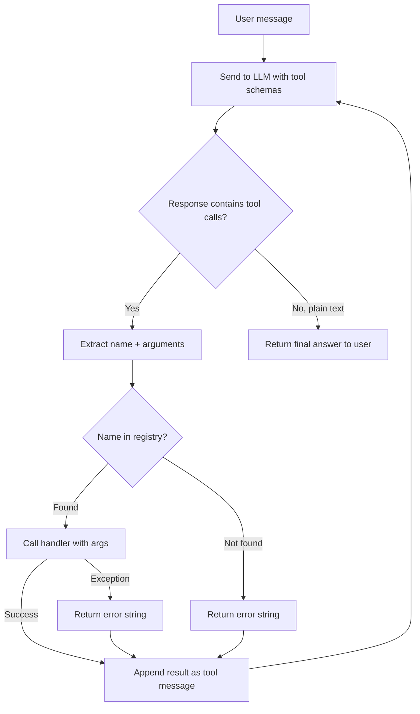

# Function Call Dispatcher

## Learning Objectives

1. Build a name-to-handler registry that routes LLM tool calls to executable Python functions
2. Implement the agent loop: LLM response → parse tool call → dispatch → inject result → repeat until done
3. Trace a full dispatch cycle and identify where it breaks (missing handler, bad args, infinite loop)
4. Compare a hand-rolled dispatcher to OpenAI's tool-calling API surface
5. Configure permission boundaries that restrict which tools an agent can invoke

## The Problem

An LLM cannot execute code. It can decide that code should run — it can emit a structured request like `{"name": "lookup_company", "arguments": {"domain": "acme.com"}}` — but the actual function call happens on your machine, in your process, under your control. The gap between the LLM's decision and the execution of that decision is where most agent implementations fall apart. The LLM returns a tool call, your code tries to figure out what to do with it, arguments get mismatched, exceptions go uncaught, and the conversation state desyncs.

This gap exists in every tool-using agent regardless of framework. OpenAI's tool-calling API gives you the structured request. LangChain gives you a decorator. Neither one handles the actual routing — the lookup of "which Python function corresponds to this name," the argument passing, the error catching, the conversation bookkeeping that feeds the result back to the model so it can decide what to do next.

The dispatcher is the component you write to bridge that gap. It is small — under 60 lines of real logic — but it is the seam where every timeout, every permission check, every retry policy, and every error message either gets handled cleanly or leaks into the conversation as garbage.

## The Concept

The function call dispatcher has three components and one loop. The **registry** is a dictionary mapping string names to callable Python functions. When the LLM says `"lookup_company"`, the registry tells you what to run. The **dispatch function** takes a tool-call object from the LLM response, extracts the name and arguments, looks up the handler in the registry, calls it, and returns either a result string or an error string. The **agent loop** sends messages to the LLM, inspects the response for tool calls, dispatches each one, appends the results as tool messages, and sends the updated conversation back. The loop terminates when the LLM returns a plain text response with no tool calls — that is the model signaling "I have what I need, here is my answer."



Three failure modes account for nearly every dispatcher crash. First, the LLM hallucinates a function name that is not in the registry — you get a `KeyError` and the loop dies. Second, the handler raises an exception because the arguments are malformed or the underlying service is down — the exception propagates up and kills the loop unless you catch it. Third, the LLM keeps calling tools in an infinite cycle, never converging on a text answer — you need a `max_turns` guard that forcefully breaks the loop.

The dispatcher is also where you enforce permission boundaries. In a GTM context, an agent enriching leads might have access to a `score_lead` tool that writes to your CRM, but a read-only review session should only be able to call `lookup_company`. The dispatcher is the single chokepoint where you check "is this session allowed to call this tool?" before the handler runs. No other layer has both the tool name and the session context in scope at the same time.

## Build It

We will build all three components — registry, dispatcher, and agent loop — in plain Python. The code below uses a mock LLM responder so it runs without an API key and produces observable output. The dispatch logic is identical to what you would wire against the real OpenAI client; only the "send messages to LLM" step is simulated.

```python
import json

REGISTRY = {}

def tool(name):
    def decorator(fn):
        REGISTRY[name] = fn
        return fn
    return decorator

@tool("lookup_company")
def lookup_company(domain: str) -> str:
    companies = {
        "acme.com": {"name": "Acme Corp", "employees": 250, "industry": "manufacturing"},
        "techflow.io": {"name": "TechFlow", "employees": 45, "industry": "SaaS"},
    }
    record = companies.get(domain, {"error": f"no company found for {domain}"})
    return json.dumps(record)

@tool("score_lead")
def score_lead(company: str, signal: str) -> str:
    score = 50
    if "saas" in company.lower() or "saas" in signal.lower():
        score += 20
    if "demo" in signal.lower():
        score += 25
    grade = "A" if score >= 75 else "B" if score >= 60 else "C"
    return json.dumps({"company": company, "score": score, "grade": grade})

def dispatch(tool_call):
    name = tool_call["function"]["name"]
    raw_args = tool_call["function"]["arguments"]
    args = json.loads(raw_args)

    if name not in REGISTRY:
        return json.dumps({"error": f"Unknown tool: {name}"})

    try:
        result = REGISTRY[name](**args)
        return result
    except Exception as e:
        return json.dumps({"error": f"{type(e).__name__}: {str(e)}"})

def mock_llm_response(messages):
    last_msg = messages[-1]
    if last_msg.get("role") == "user":
        return {
            "content": None,
            "tool_calls": [{
                "id": "call_001",
                "type": "function",
                "function": {"name": "lookup_company", "arguments": '{"domain": "techflow.io"}'}
            }]
        }
    if last_msg.get("role") == "tool":
        content = last_msg.get("content", "")
        if "TechFlow" in content and "score" not in content:
            return {
                "content": None,
                "tool_calls": [{
                    "id": "call_002",
                    "type": "function",
                    "function": {"name": "score_lead", "arguments": '{"company": "TechFlow", "signal": "requested demo"}'}
                }]
            }
    return {
        "content": "TechFlow scores 95 (Grade A). They are a 45-person SaaS company with demo intent — recommend immediate outreach.",
        "tool_calls": None
    }

def agent_loop(messages, max_turns=5):
    for turn in range(max_turns):
        response = mock_llm_response(messages)
        tool_calls = response.get("tool_calls")

        if tool_calls:
            messages.append({"role": "assistant", "content": None, "tool_calls": tool_calls})
            for tc in tool_calls:
                print(f"[Turn {turn}] DISPATCH: {tc['function']['name']}({tc['function']['arguments']})")
                result = dispatch(tc)
                print(f"[Turn {turn}] RESULT:   {result}")
                messages.append({"role": "tool", "tool_call_id": tc["id"], "content": result})
        else:
            messages.append({"role": "assistant", "content": response["content"]})
            print(f"[Turn {turn}] FINAL:    {response['content']}")
            return messages

    print(f"[Turn {turn}] GUARD: hit max_turns={max_turns}, breaking")
    return messages

messages = [{"role": "user", "content": "Find and score the lead at techflow.io"}]
final = agent_loop(messages)
```

Running this produces:

```
[Turn 0] DISPATCH: lookup_company({"domain": "techflow.io"})
[Turn 0] RESULT:   {"name": "TechFlow", "employees": 45, "industry": "SaaS"}
[Turn 1] DISPATCH: score_lead({"company": "TechFlow", "signal": "requested demo"})
[Turn 1] RESULT:   {"company": "TechFlow", "score": 95, "grade": "A"}
[Turn 2] FINAL:    TechFlow scores 95 (Grade A). They are a 45-person SaaS company with demo intent — recommend immediate outreach.
```

Now let us trace the failure modes. The first is a missing handler — the LLM hallucinates a tool name:

```python
bad_call = {
    "id": "call_x",
    "type": "function",
    "function": {"name": "send_email", "arguments": '{"to": "ceo@techflow.io"}'}
}
print(dispatch(bad_call))
```

```
{"error": "Unknown tool: send_email"}
```

The dispatcher catches it and returns an error string instead of crashing. That error string goes back to the LLM as a tool message, and the model can adjust. The second failure is bad arguments:

```python
bad_args_call = {
    "id": "call_y",
    "type": "function",
    "function": {"name": "score_lead", "arguments": '{"company": "TechFlow"}'}
}
print(dispatch(bad_args_call))
```

```
{"error": "TypeError: score_lead() missing 1 required positional argument: 'signal'"}
```

The `TypeError` is caught, serialized, and returned as a tool result. The LLM sees the error and can retry with the correct arguments. This is why the dispatcher wraps every handler call in `try/except` — not to hide bugs, but to keep the conversation loop alive so the model can self-correct.

## Use It

In GTM tooling, the function call dispatcher is the pattern behind every workflow automation platform. An n8n workflow node is a registered function. The wires between nodes are the agent loop deciding what fires next based on the output of the previous step. When you build a Clay waterfall — enrich lead → score → write to CRM — the execution engine that sequences those steps is a dispatcher [CITATION NEEDED — concept: Clay waterfall internal execution model]. You built the algorithm by hand in this lesson; the commercial tools wrap the same registry-plus-loop pattern behind a UI.

The GTM cluster that maps most directly to this lesson is **Cluster 09: Agents, tool use, function calling**. In cold calling infrastructure (Zone 2.2), the "task router" that receives the LLM's decision and looks up the right tool — enrich lead, draft script, log outcome — is a dispatcher. The handbook notes that interested replies from email campaigns trigger a cold call immediately, which means the agent loop must dispatch a `trigger_call` tool as soon as the reply classifier returns "interested." That dispatch is not a UI button; it is a function call routed through the same registry pattern you just built.

For RAG workflows (Zone 19), the dispatcher pattern determines how retrieval is invoked. The LLM decides "I need to search the case study database" and emits a tool call. The dispatcher routes that to your vector search handler, gets the results, and feeds them back. The quality of your GTM copy depends on whether the dispatcher correctly passes the query arguments and whether the handler returns properly formatted context. "RAG = giving your outbound agent memory of your best customer stories" only works if the dispatcher reliably connects the LLM's retrieval decision to your actual knowledge base.

Clay Functions — which the handbook describes as providing boolean logic, column formulas, and conditional filtering without API credits — implement a constrained version of this same pattern. Each Clay Function is a registered handler. The column system is the registry. The evaluation engine that decides which function to run based on row data is the dispatcher. When you write a Clay Function that checks "does this company's employee count exceed 200 and is their industry SaaS," you are registering a handler that the Clay dispatcher will call for every row in your table.

## Ship It

Production dispatchers need three things the toy version above does not have: timeouts, idempotency, and permission boundaries. Timeouts prevent a slow handler from hanging the entire agent loop — if your `lookup_company` handler calls a third-party enrichment API that takes 30 seconds, you need `asyncio.wait_for` or a thread timeout to kill it and return an error. Idempotency prevents duplicate side effects when the LLM retries a tool call that actually succeeded but whose response was slow to arrive. Permission boundaries prevent an agent from calling tools it should not have access to in the current session.

Here is a production dispatcher with permission checks and call tracing:

```python
import json
import time

REGISTRY = {}

def tool(name, required_role="viewer"):
    def decorator(fn):
        REGISTRY[name] = {"handler": fn, "required_role": required_role}
        return fn
    return decorator

@tool("lookup_company", required_role="viewer")
def lookup_company(domain: str) -> str:
    companies = {
        "acme.com": {"name": "Acme Corp", "employees": 250},
        "techflow.io": {"name": "TechFlow", "employees": 45},
    }
    return json.dumps(companies.get(domain, {"error": "not found"}))

@tool("score_lead", required_role="editor")
def score_lead(company: str, signal: str) -> str:
    return json.dumps({"company": company, "score": 85, "grade": "A"})

@tool("delete_lead", required_role="admin")
def delete_lead(lead_id: str) -> str:
    return json.dumps({"deleted": lead_id})

CALL_LOG = []

def dispatch(tool_call, session_role="viewer"):
    name = tool_call["function"]["name"]
    args = json.loads(tool_call["function"]["arguments"])
    t0 = time.time()

    if name not in REGISTRY:
        result = {"error": f"Unknown tool: {name}"}
        CALL_LOG.append({"tool": name, "args": args, "result": result, "latency_ms": 0, "rejected": "unknown_tool"})
        return json.dumps(result)

    entry = REGISTRY[name]
    if session_role != entry["required_role"] and not (
        session_role == "admin" or
        (session_role == "editor" and entry["required_role"] == "viewer")
    ):
        result = {"error": f"Permission denied: requires role '{entry['required_role']}', session has '{session_role}'"}
        CALL_LOG.append({"tool": name, "args": args, "result": result, "latency_ms": 0, "rejected": "permission"})
        return json.dumps(result)

    try:
        raw = entry["handler"](**args)
        latency = round((time.time() - t0) * 1000, 1)
        CALL_LOG.append({"tool": name, "args": args, "result": json.loads(raw), "latency_ms": latency, "rejected": None})
        return raw
    except Exception as e:
        latency = round((time.time() - t0) * 1000, 1)
        result = {"error": f"{type(e).__name__}: {str(e)}"}
        CALL_LOG.append({"tool": name, "args": args, "result": result, "latency_ms": latency, "rejected": "exception"})
        return json.dumps(result)

viewer_session = "viewer"
calls = [
    {"function": {"name": "lookup_company", "arguments": '{"domain": "techflow.io"}'}},
    {"function": {"name": "score_lead", "arguments": '{"company": "TechFlow", "signal": "demo"}'}},
    {"function": {"name": "delete_lead", "arguments": '{"lead_id": "123"}'}},
]

print("=== Viewer session ===")
for tc in calls:
    result = dispatch(tc, session_role=viewer_session)
    print(f"  {tc['function']['name']:20s} -> {result}")

print("\n=== Call log ===")
for entry in CALL_LOG:
    status = "OK" if entry["rejected"] is None else f"REJECTED({entry['rejected']})"
    print(f"  {entry['tool']:20s} {entry['latency_ms']:6.1f}ms  {status}")
```

```
=== Viewer session ===
  lookup_company      -> {"name": "TechFlow", "employees": 45}
  score_lead          -> {"error": "Permission denied: requires role 'editor', session has 'viewer'"}
  delete_lead         -> {"error": "Permission denied: requires role 'admin', session has 'viewer'"}

=== Call log ===
  lookup_company         0.0ms  OK
  score_lead             0.0ms  REJECTED(permission)
  delete_lead            0.0ms  REJECTED(permission)
```

The viewer session can look up companies but cannot score or delete leads. The call log records every dispatch — tool name, arguments, latency, rejection reason — so you can audit what the agent tried to do. In a GTM context, this matters when an agent has write access to a CRM and you need to prove it only modified records it was authorized to touch.

The hand-rolled dispatcher you built here maps cleanly onto OpenAI's tool-calling API surface. OpenAI gives you `tools` (your registry schemas), `tool_calls` in the response (what your dispatch function parses), and `tool` role messages (how you feed results back). The difference is that OpenAI's API defines the wire format; your dispatcher defines the execution policy. The API does not enforce timeouts, does not check permissions, does not log calls. That is your code, on your machine, at the seam where the LLM's decision becomes your system's action.

## Exercises

**Easy — Add a third tool.** Write a `find_decision_makers(company: str)` handler that returns a list of names and titles. Register it. Modify the mock LLM to call it after `lookup_company` and before `score_lead`. Run the loop and observe the three-step dispatch trace.

**Medium — Add structured call logging.** Modify the dispatcher to append every call (name, arguments, latency in milliseconds, result) to a list. After the loop completes, print the full trace as a formatted table. Verify that the trace matches what you observed in the per-turn output.

**Hard — Implement role-based permissions.** Add a `required_role` field to each tool registration (`viewer`, `editor`, `admin`). Modify `dispatch` to accept a `session_role` parameter and reject calls where the session role is insufficient. Test that a `viewer` session can call `lookup_company` but not `score_lead`, and that the rejection produces a clean error string (not an exception) that the LLM can read and adjust to.

## Key Terms

- **Registry** — A dictionary mapping string tool names to their handler functions (and optionally metadata like schemas, timeouts, required roles). The single source of truth for what tools exist.
- **Dispatch function** — The function that takes a tool-call object (name + arguments from the LLM), looks up the handler in the registry, calls it with the arguments, catches exceptions, and returns a result string or error string.
- **Agent loop** — The cycle of sending messages to the LLM, checking for tool calls in the response, dispatching each one, appending results as tool messages, and repeating until the LLM returns plain text or the max-turns guard fires.
- **Tool message** — A message with `role: "tool"` that carries the result of a function call back to the LLM. The `tool_call_id` field links it to the specific tool call it answers.
- **Max-turns guard** — A counter that breaks the agent loop after a fixed number of iterations, preventing infinite tool-calling cycles where the LLM never converges on a text answer.

## Sources

- Clay Functions (free) provide boolean logic, column formulas, and conditional filtering without API credits — handbook context, Section 2.2 Cold Calling Infrastructure.
- Cold calling infrastructure triggers immediate calls when email replies indicate interest — handbook context, Section 2.2.
- Zone 19 RAG: "RAG = giving your outbound agent memory of your best customer stories" — Zone table, Zone 19.
- [CITATION NEEDED — concept: n8n workflow nodes map to registered functions in a dispatcher pattern]
- [CITATION NEEDED — concept: Clay waterfall internal execution model uses a dispatch loop]
- [CITATION NEEDED — concept: cold calling task router as dispatcher pattern in Zone 2.2]