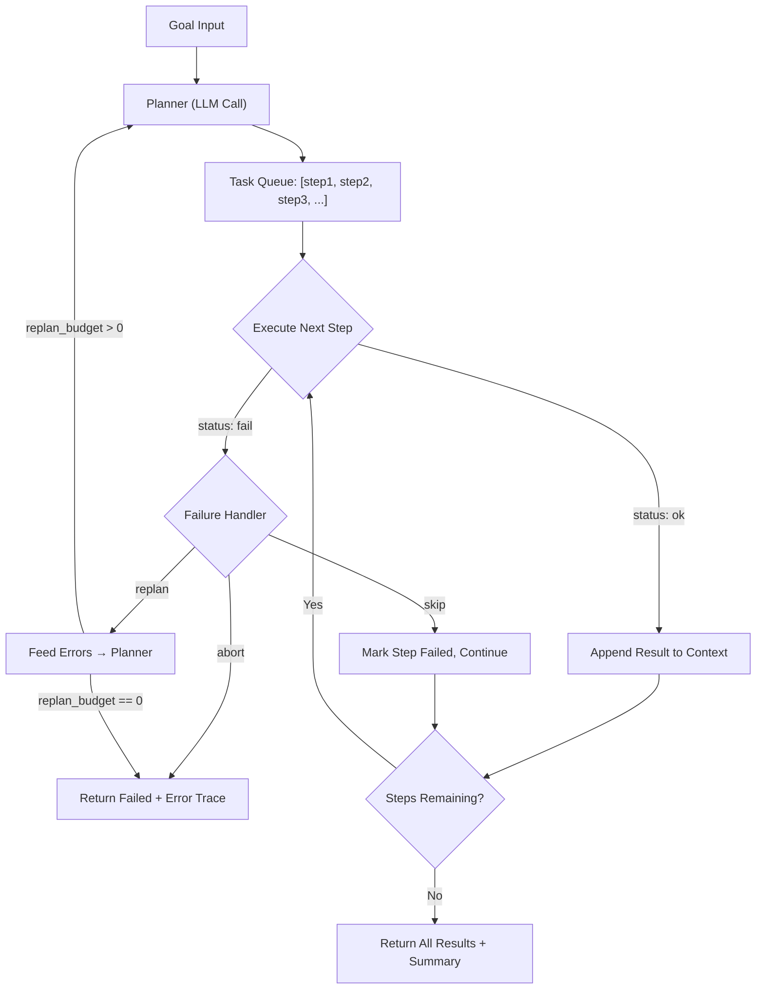

# Plan-Execute Control Flow

## Learning Objectives

1. Implement a two-phase plan-execute control flow with structured task generation, sequential execution, and step-level failure handling.
2. Compare plan-execute and ReAct architectures on predictability, debuggability, and adaptability.
3. Detect step-level failures and dispatch them through abort, skip, or re-plan paths based on failure type and cumulative budget.
4. Enforce hard ceilings on step count and re-plan count to bound execution cost and prevent infinite loops.

## The Problem

A ReAct agent interleaves thinking and acting in a single loop. Each iteration requires a fresh LLM inference: the model reads its prior observations, reasons about the next action, emits a tool call, and waits for the result. This works for short tasks. It breaks down when the task has eight or twelve steps, because every step pays the full cost of an LLM round-trip — latency, tokens, and the risk that the model drifts off plan partway through.

The deeper issue is inspectability. When a ReAct trace goes wrong at step 6, you have to read the model's free-text reasoning across six prior iterations to figure out what it was trying to do and where it diverged. There is no structured artifact you can diff, version, or replay. The plan is implicit — buried in chain-of-thought tokens — and the execution is inseparable from the planning.

Plan-execute solves this by splitting the work into two phases. The planner produces a structured list of steps upfront. The executor runs those steps deterministically, without consulting the LLM between each one. If step 3 fails, you have a concrete data structure to inspect: the step's declared intent, its arguments, its expected outcome, and its actual result. You can replay the plan, modify a single step, or hand the error back to the planner for a revision — all without re-running steps 1 and 2.

## The Concept

A plan-execute agent has two components. The **planner** is a single LLM call that receives a goal and returns a JSON array of step objects. Each step carries a tool name, arguments, and an expected outcome — a short sentence describing what success looks like for that step. The **executor** is a deterministic loop that iterates through the plan, dispatches each step to its named tool, and collects results. No LLM is called during execution unless a failure triggers a re-plan.

The interesting design work happens at the failure boundary. When a step returns an error, the executor has three options: **abort** (stop the entire run and surface the error), **skip** (mark the step failed and continue to the next one), or **re-plan** (hand the error context back to the planner and get a revised plan for the remaining steps). Re-planning is what separates a script from an agent — the system recognizes its original plan won't work and generates a new one informed by what went wrong.



Two budgets bound the system. A **step budget** caps the total number of steps executed across all plan revisions, preventing a runaway loop from burning through API calls. A **re-plan budget** caps the number of times the planner can be re-invoked, preventing oscillation where the planner keeps generating plans that fail in the same way. When either budget is exhausted, the executor halts and returns the accumulated results and error trace.

Contrast this with ReAct. In ReAct, the model decides at every step whether to continue, backtrack, or try something different — it is maximally adaptable but minimally predictable. In plan-execute, the plan is fixed between re-plans, so execution is predictable and debuggable, but the system cannot adapt mid-step the way ReAct can. The trade-off is deliberate: you give up per-step adaptability in exchange for a structured plan you can inspect, replay, and parallelize.

## Build It

The following code implements a complete plan-execute loop. The planner is a mock function that returns a structured JSON plan — in production, this would be an LLM call with a system prompt that constrains the output format. The executor iterates through steps, dispatches each to a tool from a registry, and tracks failures. When consecutive failures exceed a threshold, the executor hands the error context back to the planner for a revised plan. Both a step budget and a re-plan budget are enforced.

```python
import json

PLANNER_SYSTEM_PROMPT = """You are a planning agent. Given a goal, output a JSON array of steps.
Each step: {"id": int, "task": str, "tool": str, "args": dict, "expected_outcome": str}
Tools available: {tools}"""

def planner(goal, tools, errors=None):
    if errors:
        print(f"  [REPLAN] Errors from prior execution: {errors}")
        return [
            {
                "id": 1,
                "task": "try alternative data source for company info",
                "tool": "fallback_scraper",
                "args": {"source": "linkedin", "company": "Acme Corp"},
                "expected_outcome": "employee count and industry",
            },
            {
                "id": 2,
                "task": "extract leadership names from page",
                "tool": "entity_extractor",
                "args": {},
                "expected_outcome": "at least one person name",
            },
        ]
    return [
        {
            "id": 1,
            "task": "find company domain",
            "tool": "domain_lookup",
            "args": {"company": "Acme Corp"},
            "expected_outcome": "valid domain URL",
        },
        {
            "id": 2,
            "task": "scan domain for tech stack",
            "tool": "tech_scanner",
            "args": {},
            "expected_outcome": "list of detected technologies",
        },
        {
            "id": 3,
            "task": "classify ICP fit based on tech stack",
            "tool": "icp_classifier",
            "args": {},
            "expected_outcome": "boolean ICP match and confidence score",
        },
    ]

TOOL_REGISTRY = {
    "domain_lookup": lambda args: {"output": "acme.com", "status": "ok"},
    "tech_scanner": lambda args: {
        "output": None,
        "status": "fail",
        "error": "scanner timed out after 10s",
    },
    "icp_classifier": lambda args: {
        "output": None,
        "status": "fail",
        "error": "no tech data available to classify",
    },
    "fallback_scraper": lambda args: {
        "output": "250 employees, SaaS, Series B",
        "status": "ok",
    },
    "entity_extractor": lambda args: {
        "output": "Jane Doe (CEO), John Smith (CTO)",
        "status": "ok",
    },
}


def execute_plan(plan, tools):
    results = []
    for step in plan:
        tool_fn = tools.get(step["tool"])
        if tool_fn is None:
            outcome = {"status": "fail", "error": f"unknown tool: {step['tool']}"}
        else:
            try:
                outcome = tool_fn(step.get("args", {}))
            except Exception as exc:
                outcome = {"status": "fail", "error": str(exc)}

        entry = {
            "step_id": step["id"],
            "task": step["task"],
            "tool": step["tool"],
            "expected": step["expected_outcome"],
            "actual": outcome,
        }
        results.append(entry)

        status = outcome.get("status", "unknown")
        if status == "ok":
            print(f"  [OK]   Step {step['id']}: {step['task']}")
            print(f"         output: {outcome.get('output')}")
        else:
            print(f"  [FAIL] Step {step['id']}: {step['task']}")
            print(f"         error:  {outcome.get('error')}")

    return results


def count_failures(results):
    return sum(1 for r in results if r["actual"].get("status") != "ok")


def run_plan_execute(goal, tools, max_replans=1, failure_threshold=2, max_total_steps=10):
    plan = planner(goal, tools)
    print("=" * 60)
    print("INITIAL PLAN")
    print("=" * 60)
    for s in plan:
        print(f"  {s['id']}. {s['task']}  [{s['tool']}]")
        print(f"     expects: {s['expected_outcome']}")

    all_results = []
    replans_used = 0
    total_steps_run = 0

    while True:
        steps_to_run = min(len(plan), max_total_steps - total_steps_run)
        if steps_to_run <= 0:
            print("\nHALT: step budget exhausted")
            break

        current_plan = plan[:steps_to_run]
        print(f"\n{'=' * 60}")
        print(f"EXECUTION (revision {replans_used})")
        print("=" * 60)

        results = execute_plan(current_plan, tools)
        all_results.extend(results)
        total_steps_run += len(results)

        failures = count_failures(results)

        if failures < failure_threshold:
            succeeded = len(results) - failures
            print(f"\nDONE: {succeeded}/{len(results)} steps succeeded")
            break

        if replans_used >= max_replans:
            print(f"\nHALT: {failures} failures, re-plan budget exhausted ({max_replans})")
            break

        if total_steps_run >= max_total_steps:
            print(f"\nHALT: {failures} failures, step budget exhausted ({max_total_steps})")
            break

        error_summary = "; ".join(
            r["actual"].get("error", "unknown")
            for r in results
            if r["actual"].get("status") != "ok"
        )
        plan = planner(goal, tools, errors=error_summary)
        replans_used += 1

        print(f"\n{'=' * 60}")
        print(f"REVISED