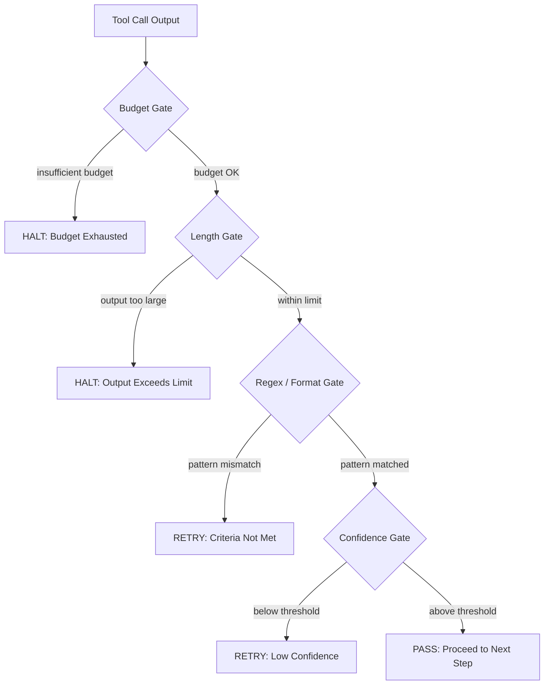

# Lesson 25: Verification Gates and the Observation Budget

## Learning Objectives

1. Implement a `VerificationGate` protocol with a deterministic `evaluate()` method that returns a `PASS`, `RETRY`, or `HALT` decision.
2. Compose budget, length, regex, and confidence gates into a short-circuit chain that halts on the first non-passing decision.
3. Build an `ObservationLedger` that debits verification cost per gate evaluation and refuses execution when the budget is exhausted.
4. Diagnose gate failures from structured logs by distinguishing budget exhaustion, confidence shortfall, and criteria mismatch.
5. Compare full-revalidation, sampling-based, and heuristic-only verification strategies by measuring per-gate cost against total pipeline failure rate.

## The Problem

You have built agents that chain tool calls, enrich records, and score leads. Each step produces output that flows into the next step without inspection. When step three produces garbage — a truncated enrichment, a malformed email, a confidence score that is actually noise — step four receives it as truth and propagates the error forward. By the time the pipeline produces a final result, the original failure is buried under three layers of downstream computation. You cannot debug what you never checked.

The second problem is the mirror image. If you do add checks — running a validation prompt after every enrichment, re-querying the model to confirm a classification, sampling outputs for quality — you discover that verification is itself an API call with a token cost. An enrichment pipeline processing ten thousand records with a verification prompt after every step burns through credits at a rate that makes the pipeline economically nonviable. You checked everything and now you cannot afford to run anything.

The third problem is that these two failure modes interact. A pipeline with no verification produces high-volume garbage. A pipeline with blanket verification produces low-volume gold. What you need is a system that decides *where* to spend verification attention and *when* to stop — a gate between steps that evaluates output quality, and a budget that tracks how much checking you have already done and refuses to let you check past the point of diminishing returns.

## The Concept

A verification gate is a decision function placed between agent steps. It takes three inputs: the output to verify, a set of acceptance criteria, and the current observation budget remaining. It returns one of three decisions: `PASS` (proceed to the next step), `RETRY` (re-run the current step with modified inputs), or `HALT` (stop the pipeline and log the failure). The gate itself consumes observation budget — each evaluation costs units, whether the evaluation is an LLM call, a regex check, or a field-completeness count. This is the critical design constraint: verification is not free, so the gate must account for its own cost before deciding whether downstream verification is even possible.

The observation budget is a finite resource counter. Every verification action — running a validation prompt, checking a regex, counting filled fields — debits the budget. When the budget reaches zero, the pipeline must either accept the current output unverified or halt. This models the real constraint: you cannot afford to verify everything, so you must decide where to spend your verification attention. The budget is not a performance optimization. It is a correctness constraint. A pipeline that verifies without a budget will verify until it runs out of credits, then crash or silently degrade. A pipeline with a budget makes the trade-off explicit: it stops verifying when the cost of checking exceeds the allocated resource, and it produces a structured log explaining why.



The chain has short-circuit semantics. Each gate runs in sequence. If any gate returns `RETRY` or `HALT`, the chain stops immediately — no subsequent gate executes, no additional budget is debited. This is what makes the budget tractable: a cheap heuristic gate placed early in the chain (does the output contain an email address at all?) prevents the expensive semantic gate later (does the email context match the target persona?) from ever running on inputs that would obviously fail. Gate ordering is the primary lever for budget efficiency.

The tension at the center of this design is verification strength versus budget cost. An LLM-based re-evaluation gate — re-prompting the model to judge whether the previous output is correct — costs hundreds or thousands of tokens per evaluation. A regex gate costs one token of bookkeeping. A confidence gate that counts non-null fields costs one token of bookkeeping. The practitioner's job is to allocate the budget across gates so that the total failure rate across the pipeline stays below what the business can tolerate. In a GTM enrichment waterfall, where each Clay provider step is a gate that verifies whether the previous enrichment returned sufficient data, this maps directly: cheap format checks fire first, expensive semantic re-evaluation fires last, and the budget determines how many records you can afford to verify before the pipeline must accept-and-ship or halt.

## Build It

The system has four components: a `GateDecision` record, an `ObservationLedger`, a set of concrete `VerificationGate` implementations, and a `GateChain` that wires them together with short-circuit semantics. Each component is small and composable. The entire system uses Python stdlib only.

```python
from dataclasses import dataclass, field
from enum import Enum
from typing import Any
import re
import json

class Decision(Enum):
    PASS = "PASS"
    RETRY = "RETRY"
    HALT = "HALT"

@dataclass
class GateDecision:
    decision: Decision
    reason: str
    budget_remaining: int
    budget_consumed: int
    gate_name: str

@dataclass
class CallContext:
    tool_name: str
    output: str
    turn: int
    metadata: dict = field(default_factory=dict)

class ObservationLedger:
    def __init__(self, budget: int):
        self.initial_budget = budget
        self.entries = []

    def debit(self, tool_name: str, turn: int, cost: int, note: str = ""):
        self.entries.append({
            "tool": tool_name,
            "turn": turn,
            "cost": cost,
            "note": note,
            "running_total": self.total_spent() + cost,
            "remaining_after": self.initial_budget - self.total_spent() - cost,
        })

    def total_spent(self) -> int:
        return sum(e["cost"] for e in self.entries)

    def remaining(self) -> int:
        return self.initial_budget - self.total_spent()

    def by_tool(self, tool_name: str) -> list:
        return [e for e in self.entries if e["tool"] == tool_name]

    def summary(self) -> dict:
        return {
            "initial_budget": self.initial_budget,
            "total_spent": self.total_spent(),
            "remaining": self.remaining(),
            "entry_count": len(self.entries),
        }

class VerificationGate:
    def __init__(self, name: str, cost: int = 1):
        self.name = name
        self.cost = cost

    def evaluate(self, ctx: CallContext, ledger: ObservationLedger) -> GateDecision:
        raise NotImplementedError

class BudgetGate(VerificationGate):
    def evaluate(self, ctx: CallContext, ledger: ObservationLedger) -> GateDecision:
        if ledger.remaining() < self.cost:
            return GateDecision(
                decision=Decision.HALT,
                reason=f"Budget exhausted: {ledger.remaining()} remaining, {self.cost} needed",
                budget_remaining=ledger.remaining(),
                budget_consumed=ledger.total_spent(),
                gate_name=self.name,
            )
        ledger.debit(ctx.tool_name, ctx.turn, self.cost, f"gate:{self.name}")
        return GateDecision(
            decision=Decision.PASS,
            reason="Budget sufficient",
            budget_remaining=ledger.remaining(),
            budget_consumed=ledger.total_spent(),
            gate_name=self.name,
        )

class RegexGate(VerificationGate):
    def __init__(self, name: str, pattern: str, cost: int = 1):
        super().__init__(name, cost)
        self.pattern = pattern

    def evaluate(self, ctx: CallContext, ledger: ObservationLedger) -> GateDecision:
        if ledger.remaining() < self.cost:
            return GateDecision(
                decision=Decision.HALT,
                reason="Budget exhausted before regex check",
                budget_remaining=ledger.remaining(),
                budget_consumed=ledger.total_spent(),
                gate_name=self.name,
            )
        ledger.debit(ctx.tool_name, ctx.turn, self.cost, f"gate:{self.name}")
        if re.search(self.pattern, ctx.output):
            return GateDecision(
                decision=Decision.PASS,
                reason=f"Pattern matched: {self.pattern}",
                budget_remaining=ledger.remaining(),
                budget_consumed=ledger.total_spent(),
                gate_name=self.name,
            )
        return GateDecision(
            decision=Decision.RETRY,
            reason=f"Pattern not found in output: {self.pattern}",
            budget_remaining=ledger.remaining(),
            budget_consumed=ledger.total_spent(),
            gate_name=self.name,
        )

class MaxLengthGate(VerificationGate):
    def __init__(self, name: str, max_chars: int, cost: int = 1):
        super().__init__(name, cost)
        self.max_chars = max_chars

    def evaluate(self, ctx: CallContext, ledger: ObservationLedger) -> GateDecision:
        if ledger.remaining() < self.cost:
            return GateDecision(
                decision=Decision.HALT,
                reason="Budget exhausted before length check",
                budget_remaining=ledger.remaining(),
                budget_consumed=ledger.total_spent(),
                gate_name=self.name,
            )
        ledger.debit(ctx.tool_name, ctx.turn, self.cost, f"gate:{self.name}")
        if len(ctx.output) <= self.max_chars:
            return GateDecision(
                decision=Decision.PASS,
                reason=f"Output within limit: {len(ctx.output)} <= {self.max_chars} chars",
                budget_remaining=ledger.remaining(),
                budget_consumed=ledger.total_spent(),
                gate_name=self.name,
            )
        return GateDecision(
            decision=Decision.HALT,
            reason=f"Output too large: {len(ctx.output)} > {self.max_chars} chars",
            budget_remaining=ledger.remaining(),
            budget_consumed=ledger.total_spent(),
            gate_name=self.name,
        )

class ConfidenceGate(VerificationGate):
    def __init__(self, name: str, required_fields: list, threshold: float = 0.8, cost: int = 1):
        super().__init__(name, cost)
        self.required_fields = required_fields
        self.threshold = threshold

    def evaluate(self, ctx: CallContext, ledger: ObservationLedger) -> GateDecision:
        if ledger.remaining() < self.cost:
            return GateDecision(
                decision=Decision.HALT,
                reason="Budget exhausted before confidence check",
                budget_remaining=ledger.remaining(),
                budget_consumed=ledger.total_spent(),
                gate_name=self.name,
            )
        ledger.debit(ctx.tool_name, ctx.turn, self.cost, f"gate:{self.name}")
        filled = sum(1 for f in self.required_fields if ctx.metadata.get(f))
        ratio = filled / len(self.required_fields) if self.required_fields else 1.0
        if ratio >= self.threshold:
            return GateDecision(
                decision=Decision.PASS,
                reason=f"Confidence {ratio:.0%} >= {self.threshold:.0%} ({filled}/{len(self.required_fields)} fields)",
                budget_remaining=ledger.remaining(),
                budget_consumed=ledger.total_spent(),
                gate_name=self.name,
            )
        return GateDecision(
            decision=Decision.RETRY,
            reason=f"Confidence {ratio:.0%} < {self.threshold:.0%} ({filled}/{len(self.required_fields)} fields)",
            budget_remaining=ledger.remaining(),
            budget_consumed=ledger.total_spent(),
            gate_name=self.name,
        )

class GateChain:
    def __init__(self, gates: list, ledger: ObservationLedger):
        self.gates = gates
        self.ledger = ledger
        self.decision_log = []

    def run(self, ctx: CallContext) -> GateDecision:
        for gate in self.gates:
            decision = gate.evaluate(ctx, self.ledger)
            self.decision_log.append(decision)
            if decision.decision != Decision.PASS:
                return decision
        if self.decision_log:
            return self.decision_log[-1]
        return GateDecision(
            decision=Decision.PASS,
            reason="No gates configured",
            budget_remaining=self.ledger.remaining(),
            budget_consumed=self.ledger.total_spent(),
            gate_name="none",
        )

print("=== Scenario 1: PASS — valid enrichment output ===")
ledger1 = ObservationLedger(budget=20)
chain1 = GateChain([
    BudgetGate("budget_check", cost=1),
    MaxLengthGate("length_check", max_chars=500, cost=1),
    RegexGate("email_format", pattern=r"[^@]+@[^@]+\.[^@]+", cost=1),
    ConfidenceGate("field_completeness", required_fields=["email", "name", "company", "title"], threshold=0.75, cost=1),
], ledger1)

ctx1 = CallContext(
    tool_name="enrichment_provider_a",
    output="Result: jane.doe@acme.com, VP Engineering at Acme Corp",
    turn=1,
    metadata={"email": "jane.doe@acme.com", "name": "Jane Doe", "company": "Acme Corp", "title": "VP Engineering"},
)
result1 = chain1.run(ctx1)
print(f"Decision: {result1.decision.value}")
print(f"Reason: {result1.reason}")
print(f"Budget consumed: {result1.budget_consumed}, remaining: {result1.budget_remaining}")
print()

print("=== Scenario 2: RETRY — missing email triggers regex gate ===")
ledger2 = ObservationLedger(budget=20)
chain2 = GateChain([
    BudgetGate("budget_check", cost=1),
    MaxLengthGate("length_check", max_chars=500, cost=1),
    RegexGate("email_format", pattern=r"[^@]+@[^@]+\.[^@]+", cost=1),
    ConfidenceGate("field_completeness", required_fields=["email", "name", "company", "title"], threshold=0.75, cost=1),
], ledger2)

ctx2 = CallContext(
    tool_name="enrichment_provider_a",
    output="Result: Jane Doe, VP Engineering at Acme Corp. Contact via website.",
    turn=1,
    metadata={"email": None, "name": "Jane Doe", "company": "Acme Corp", "title": "VP Engineering"},
)
result2 = chain2.run(ctx2)
print(f"Decision: {result2.decision.value}")
print(f"Reason: {result2.reason}")
print(f"Budget consumed: {result2.budget_consumed}, remaining: {result2.budget_remaining}")
print()

print("=== Scenario 3: HALT — budget exhaustion ===")
ledger3 = ObservationLedger(budget=2)
chain3 = GateChain([
    BudgetGate("budget_check", cost=1),
    MaxLengthGate("length_check", max_chars=500, cost=1),
    RegexGate("email_format", pattern=r"[^@]+@[^@]+\.[^@]+", cost=1),
    ConfidenceGate("field_completeness", required_fields=["email", "name", "company", "title"], threshold=0.75, cost=1),
], ledger3)

ctx3 = CallContext(
    tool_name="enrichment_provider_b",
    output="Result: bob@startup.io, CTO at Startup Inc",
    turn=2,
    metadata={"email": "bob@startup.io", "name": "Bob Smith", "company": "Startup Inc", "title": "CTO"},
)
result3 = chain3.run(ctx3)
print(f"Decision: {result3.decision.value}")
print(f"Reason: {result3.reason}")
print(f"Budget consumed: {result3.budget_consumed}, remaining: {result3.budget_remaining}")
print()

print("=== Ledger summary (Scenario 1) ===")
print(json.dumps(ledger1.summary(), indent=2))
print()
print("=== Ledger entries (Scenario 1) ===")
for entry in ledger1.entries:
    print(f"  turn {entry['turn']} | {entry['tool']} | cost {entry['cost']} | {entry['note']} | remaining_after: {entry['remaining_after']}")
```

Running this produces three distinct outcomes from the same gate chain. Scenario 1 passes all four gates, consuming 4 budget units. Scenario 2 short-circuits at the regex gate — the confidence gate never runs, saving 1 budget unit. Scenario 3 passes the budget gate but the length gate consumes the last unit, leaving insufficient budget for the regex gate, which returns `HALT`. The short-circuit is observable in the ledger: scenario 2 has 3 entries (budget, length, regex), not 4.

## Use It

The gate chain maps directly onto a Clay-style enrichment waterfall. In a Clay waterfall, each enrichment provider is a step: provider A tries to find an email, provider B tries if A fails, provider C tries if B fails. Each step is a verification gate — the output of provider A is checked against acceptance criteria (did it return a valid email?), and the decision determines whether the waterfall continues to provider B or accepts the result and proceeds.

The observation budget maps onto your enrichment API spend. Each provider call costs credits. Each validation step — checking email format with a regex, checking domain validity with an MX lookup, checking field completeness — costs additional credits or tokens. The budget tracker forces an explicit decision: at what point does verifying the next record cost more than the value of catching one more bad enrichment?

```python
from dataclasses import dataclass, field
from enum import Enum
import json

class Decision(Enum):
    PASS = "PASS"
    RETRY = "RETRY"
    HALT = "HALT"

@dataclass
class GateDecision:
    decision: Decision
    reason: str
    budget_remaining: int
    gate_name: str
    record_id: str = ""

@dataclass
class EnrichmentRecord:
    record_id: str
    company: str
    contact_name: str
    email: str
    title: str
    provider: str = ""

class WaterfallLedger:
    def __init__(self, budget: int):
        self.initial = budget
        self.spent = 0
        self.records_processed = 0
        self.records_passed = 0
        self.records_retried = 0
        self.records_halted = 0
        self.log = []

    def debit(self, cost: int):
        self.spent