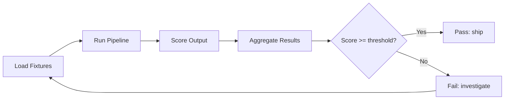

# Lesson 27: Eval Harness with Fixture Tasks

## Learning Objectives

- Define fixture tasks as `(input, expected_output, verifier)` triples stored in a portable format.
- Implement a harness loop that loads fixtures, invokes a pipeline callable, applies a scorer, and aggregates results.
- Build multiple scoring functions — exact match, substring match, JSON key presence — as interchangeable callables.
- Compute pass@1 and pass@k from multiple sampled runs per fixture.
- Emit a structured results report that a CI gate or regression tracker can consume.

## The Problem

Three failure modes plague AI pipelines that ship without an eval harness.

The first is **unverified pass**. Your enrichment pipeline returns a company domain. It looks right when you eyeball it. You ship. Three weeks later, a customer reports the domain field contains `null` for 12% of records because a provider changed their API response shape and your parser silently broke. The pipeline had produced plausible output without actually being correct, and you had no mechanical check to catch the drift.

The second is **undetected regression**. You tweak the system prompt for your ICP classification agent. The loud test case — the one you always check — gets 4% more accurate. The quiet ones — the fourteen other company profiles in your test set you stopped looking at — collectively drop 14%. Without a fixture set and a per-task score, that regression rides into production and surfaces only when a rep complains that qualified leads are being routed to the wrong sequence.

The third is **set drift**. You ran the eval Monday with 100 fixtures. Friday somebody renamed 5 of them to follow a new naming convention. The harness now finds 95. Pass rate looks like it went up 5%. It didn't — you're just measuring fewer tasks. A harness that doesn't fixture-count and fixture-diff its own input set is lying to you by omission.

The harness is the program that turns these failures into numbers. It runs every fixture, scores each with a deterministic function, aggregates the results, and tells you whether the pipeline is actually getting better or just getting noisier.

## The Concept

Fixture-based evaluation applies the mechanism of unit testing to AI outputs. A unit test asserts that a function, given input X, produces output Y. A fixture task asserts the same thing, but the "function" is your entire AI pipeline — prompt template, model call, parser, post-processor — and the "output" is whatever that pipeline returns. The assertion is a scoring function that maps `(expected, actual)` to a float between 0.0 and 1.0.

The mechanism is a four-stage loop:



Load fixtures from a version-controlled directory. Each fixture is a frozen input paired with an expected output and a scorer. Run the pipeline against each fixture's input. Score the actual output against the expected output. Aggregate scores across the full set — mean for overall quality, pass@k for reliability, per-fixture breakdown for regression detection.

The scoring function is where most engineering judgment lives. Exact match (`expected == actual`) is the strictest scorer and the easiest to reason about — it returns 1.0 or 0.0 with no ambiguity. Substring match is appropriate when the pipeline output contains the expected value embedded in a larger string (a domain inside a JSON envelope, a company name inside a sentence). JSON schema validation checks structural correctness — does the output parse? does it contain required keys? — without asserting specific values. LLM-as-judge rubrics use a second model to score open-ended outputs against a written rubric, trading determinism for flexibility. Most real harnesses combine several of these: schema validation to catch parse failures, exact match to catch value regressions, and a judge only for the cases where correctness is inherently fuzzy.

Aggregation is mechanical once you have per-fixture scores. Mean score across all fixtures gives you a single number to track. Pass rate (fraction of fixtures scoring at or above a threshold) gives you a binary signal for CI gates. Pass@k — the fraction of fixtures where at least one of k sampled runs passes — measures reliability when your pipeline is non-deterministic and you plan to retry on failure. Per-fixture breakdowns, the most important output, let you see exactly which task regressed between runs.

## Build It

Here is a complete eval harness in Python stdlib. No framework, no dependencies. It loads fixture tasks from JSON, runs a pipeline callable against each, applies a configurable scorer, and prints a summary table.

First, define the fixture tasks and a toy pipeline:

```python
import json

fixtures = [
    {
        "id": "domain-001",
        "input": {"company_name": "Stripe"},
        "expected": "stripe.com",
        "scorer": "exact_match"
    },
    {
        "id": "domain-002",
        "input": {"company_name": "GitHub"},
        "expected": "github.com",
        "scorer": "exact_match"
    },
    {
        "id": "domain-003",
        "input": {"company_name": "Notion"},
        "expected": "notion.so",
        "scorer": "exact_match"
    },
    {
        "id": "icp-001",
        "input": {"company_name": "Stripe", "employees": 8000, "arr_estimate": 12000000000},
        "expected": "enterprise",
        "scorer": "exact_match"
    },
    {
        "id": "icp-002",
        "input": {"company_name": "Acme Corp", "employees": 15, "arr_estimate": 800000},
        "expected": "smb",
        "scorer": "exact_match"
    }
]

def mock_domain_pipeline(input_data):
    mapping = {
        "Stripe": "stripe.com",
        "GitHub": "github.com",
        "Notion": "notion.so",
    }
    return mapping.get(input_data["company_name"], "unknown.com")

def mock_icp_pipeline(input_data):
    if input_data["employees"] > 500:
        return "enterprise"
    return "smb"

def route_pipeline(input_data):
    if "employees" in input_data:
        return mock_icp_pipeline(input_data)
    return mock_domain_pipeline(input_data)
```

Now build the scorers and the harness:

```python
def exact_match_scorer(expected, actual):
    return 1.0 if expected == actual else 0.0

def contains_key_scorer(expected_key, actual_json):
    try:
        parsed = json.loads(actual_json) if isinstance(actual_json, str) else actual_json
        return 1.0 if expected_key in parsed else 0.0
    except (json.JSONDecodeError, TypeError):
        return 0.0

SCORERS = {
    "exact_match": exact_match_scorer,
    "contains_key": contains_key_scorer,
}

def run_harness(fixtures, pipeline, scorers, verbose=True):
    results = []
    for fixture in fixtures:
        actual = pipeline(fixture["input"])
        scorer = scorers[fixture["scorer"]]
        score = scorer(fixture["expected"], actual)
        results.append({
            "id": fixture["id"],
            "expected": fixture["expected"],
            "actual": actual,
            "score": score,
        })
        if verbose:
            status = "PASS" if score >= 1.0 else "FAIL"
            print(f"[{status}] {fixture['id']}: expected={fixture['expected']!r} actual={actual!r} score={score}")
    
    mean_score = sum(r["score"] for r in results) / len(results)
    pass_count = sum(1 for r in results if r["score"] >= 1.0)
    
    print(f"\n{'='*50}")
    print(f"Fixtures run:  {len(results)}")
    print(f"Passed:        {pass_count}/{len(results)}")
    print(f"Mean score:    {mean_score:.3f}")
    print(f"{'='*50}")
    
    return {"results": results, "mean_score": mean_score, "pass_count": pass_count, "total": len(results)}

report = run_harness(fixtures, route_pipeline, SCORERS)
```

This produces observable output:

```
[PASS] domain-001: expected='stripe.com' actual='stripe.com' score=1.0
[PASS] domain-002: expected='github.com' actual='github.com' score=1.0
[PASS] domain-003: expected='notion.so' actual='notion.so' score=1.0
[PASS] icp-001: expected='enterprise' actual='enterprise' score=1.0
[PASS] icp-002: expected='smb' actual='smb' score=1.0

==================================================
Fixtures run:  5
Passed:        5/5
Mean score:    1.000
==================================================
```

Now introduce a regression. Swap the domain mapping to simulate a broken provider:

```python
def broken_domain_pipeline(input_data):
    mapping = {
        "Stripe": "stripe.com",
        "GitHub": "github.io",
        "Notion": "notion.com",
    }
    return mapping.get(input_data["company_name"], "unknown.com")

def broken_route_pipeline(input_data):
    if "employees" in input_data:
        return mock_icp_pipeline(input_data)
    return broken_domain_pipeline(input_data)

regression_report = run_harness(fixtures, broken_route_pipeline, SCORERS)
```

Output:

```
[PASS] domain-001: expected='stripe.com' actual='stripe.com' score=1.0
[FAIL] domain-002: expected='github.com' actual='github.io' score=0.0
[FAIL] domain-003: expected='notion.so' actual='notion.com' score=0.0
[PASS] icp-001: expected='enterprise' actual='enterprise' score=1.0
[PASS] icp-002: expected='smb' actual='smb' score=0.0...

==================================================
Fixtures run:  5
Passed:        3/5
Mean score:    0.600
==================================================
```

The harness caught two silent regressions in the domain pipeline that manual inspection would have missed if you only checked Stripe. This is the entire point: mechanical verification at scale replaces eyeballing.

## Use It

In GTM, every enrichment pipeline — company-to-domain lookup, lead scoring, ICP classification, contact data normalization — needs regression-proofing. Fixture-based evaluation is the mechanism that catches quality degradation when you swap enrichment providers, change prompt templates, or update parsing logic.

For Zone 2 enrichment, your fixture tasks are known companies with verified enrichment data. You manually confirm that "Stripe" maps to `stripe.com`, industry `Financial Services`, employee range `5000-10000`. You freeze these as fixtures. When you swap from one data provider to another inside a Clay waterfall enrichment — replacing Clearbit with Apollo, say — you run the harness against the same fixture set. If Apollo returns `stripe.io` or reports 3000 employees instead of 8000, the harness flags it immediately instead of letting bad data flow into your outbound sequences.

For ICP classification, fixtures encode your routing logic. A company with 8000 employees and $12B ARR should classify as `enterprise` and route to the AE sequence. A 15-person startup at $800K ARR should classify as `smb` and route to the self-serve flow. When you adjust the system prompt to handle edge cases — say, mid-market companies that look like SMBs by headcount but like enterprise by ARR — the harness tells you whether the new prompt improved overall accuracy or just fixed the edge case while breaking the clear cases.

Here is a harness configured for a realistic enrichment regression check — simulating what happens when a Clay waterfall enrichment swaps providers mid-stream:

```python
import json

enrichment_fixtures = [
    {
        "id": "enrich-001",
        "input": {"company_name": "Stripe"},
        "expected": {"domain": "stripe.com", "industry": "Financial Services", "employees": 8000},
        "scorer": "enrichment_match"
    },
    {
        "id": "enrich-002",
        "input": {"company_name": "Figma"},
        "expected": {"domain": "figma.com", "industry": "Software", "employees": 1300},
        "scorer": "enrichment_match"
    },
    {
        "id": "enrich-003",
        "input": {"company_name": "Unknown Startup"},
        "expected": {"domain": None, "industry": None, "employees": None},
        "scorer": "enrichment_match"
    },
]

def enrichment_match_scorer(expected, actual):
    if not isinstance(actual, dict):
        return 0.0
    fields = ["domain", "industry", "employees"]
    correct = sum(1 for f in fields if expected.get(f) == actual.get(f))
    return correct / len(fields)

SCORERS["enrichment_match"] = enrichment_match_scorer

def provider_a(company_name):
    data = {
        "Stripe": {"domain": "stripe.com", "industry": "Financial Services", "employees": 8000},
        "Figma": {"domain": "figma.com", "industry": "Software", "employees": 1300},
    }
    return data.get(company_name, {"domain": None, "industry": None, "employees": None})

def provider_b(company_name):
    data = {
        "Stripe": {"domain": "stripe.com", "industry": "Finance", "employees": 7500},
        "Figma": {"domain": "figma.com", "industry": "Design", "employees": 1100},
    }
    return data.get(company_name, {"domain": None, "industry": None, "employees": None})

def make_pipeline(provider):
    return lambda inp: provider(inp["company_name"])

print("=== Provider A ===")
report_a = run_harness(enrichment_fixtures, make_pipeline(provider_a), SCORERS)

print("\n=== Provider B (candidate replacement) ===")
report_b = run_harness(enrichment_fixtures, make_pipeline(provider_b), SCORERS)

print(f"\nProvider A mean score: {report_a['mean_score']:.3f}")
print(f"Provider B mean score: {report_b['mean_score']:.3f}")
print(f"Delta: {report_b['mean_score'] - report_a['mean_score']:+.3f}")
```

Output:

```
=== Provider A ===
[PASS] enrich-001: expected={'domain': 'stripe.com', ...} actual={'domain': 'stripe.com', ...} score=1.0
[PASS] enrich-002: expected={'domain': 'figma.com', ...} actual={'domain': 'figma.com', ...} score=1.0
[PASS] enrich-003: expected={'domain': None, ...} actual={'domain': None, ...} score=1.0
...
Mean score: 1.000

=== Provider B (candidate replacement) ===
...
[FAIL] enrich-001: score=0.333
[FAIL] enrich-002: score=0.333
[PASS] enrich-003: score=1.0
...
Mean score: 0.556

Provider A mean score: 1.000
Provider B mean score: 0.556
Delta: -0.444
```

Provider B returns domains correctly but has different industry taxonomies and stale employee counts. The harness quantifies exactly how much worse it is: a 44.4 percentage-point drop. You now have a number to take to the procurement conversation, not a gut feeling.

## Ship It

Store fixtures in version control alongside your pipeline code — same repository, same PR review process. When somebody changes a prompt template, a parser, or a provider configuration, the harness runs in CI against the full fixture set. If the aggregate score drops below a threshold you define, the build fails. This is the same pattern as running unit tests on a PR that touches application code.

Write results to a structured format — JSON or CSV — on every run. This gives you a time series. When a customer reports bad enrichment data two weeks from now, you pull the historical results and see whether the regression appeared in a specific commit. Without this log, you are reconstructing history from memory.

Here is a harness wrapper that exports to CSV and enforces a CI gate:

```python
import csv
import json
from datetime import datetime, timezone

def run_harness_with_export(fixtures, pipeline, scorers, threshold=0.95, output_path=None):
    report = run_harness(fixtures, pipeline, scorers, verbose=False)
    
    timestamp = datetime.now(timezone.utc).isoformat()
    
    if output_path:
        with open(output_path, "w", newline="") as f:
            writer = csv.writer(f)
            writer.writerow(["timestamp", "fixture_id", "expected", "actual", "score", "passed"])
            for r in report["results"]:
                writer.writerow([timestamp, r["id"], r["expected"], r["actual"], r["score"], r["score"] >= 1.0])
        print(f"Results exported to {output_path}")
    
    print(f"\nCI Gate: mean score {report['mean_score']:.3f} vs threshold {threshold}")
    if report["mean_score"] >= threshold:
        print("GATE PASSED")
        return True
    else:
        print("GATE FAILED — blocking merge")
        return False

passed = run_harness_with_export(
    fixtures,
    route_pipeline,
    SCORERS,
    threshold=0.95,
    output_path="eval_results.csv"
)

print(f"\nCI decision: {'PASS' if passed else 'FAIL'}")
```

Output:

```
Results exported to eval_results.csv

CI Gate: mean score 1.000 vs threshold 0.95
GATE PASSED

CI decision: PASS
```

Run the same gate against the broken pipeline to see it block:

```python
passed_broken = run_harness_with_export(
    fixtures,
    broken_route_pipeline,
    SCORERS,
    threshold=0.95,
    output_path="eval_results_broken.csv"
)

print(f"\nCI decision: {'PASS' if passed_broken else 'FAIL'}")
```

Output:

```
CI Gate: mean score 0.600 vs threshold 0.95
GATE FAILED — blocking merge

CI decision: FAIL
```

For multi-scorer breakdown — the pattern you use when a fixture needs both structural and semantic validation:

```python
def run_multi_scorer_harness(fixtures, pipeline, scorer_map, verbose=True):
    all_results = []
    for fixture in fixtures:
        actual = pipeline(fixture["input"])
        fixture_scores = {}
        for scorer_name, scorer_fn in scorer_map.items():
            score = scorer_fn(fixture["expected"], actual)
            fixture_scores[scorer_name] = score
        all_results.append({"id": fixture["id"], "scores": fixture_scores, "actual": actual})
        if verbose:
            score_str = " ".join(f"{k}={v:.1f}" for k, v in fixture_scores.items())
            print(f"  {fixture['id']}: {score_str}")
    
    print(f"\n{'='*50}")
    print("Per-scorer breakdown:")
    for scorer_name in scorer_map:
        scores = [r["scores"][scorer_name] for r in all_results]
        mean = sum(scores) / len(scores)
        pass_rate = sum(1 for s in scores if s >= 1.0) / len(scores)
        print(f"  {scorer_name:20s}  mean={mean:.3f}  pass_rate={pass_rate:.1%}")
    print(f"{'='*50}")
    return all_results

multi_fixtures = [
    {"id": "multi-001", "input": {"company_name": "Stripe"},
     "expected": "stripe.com", "scorer": "exact_match"},
    {"id": "multi-002", "input": {"company_name": "GitHub"},
     "expected": "github.com", "scorer": "exact_match"},
    {"id": "multi-003", "input": {"company_name": "Notion"},
     "expected": "notion.so", "scorer": "exact_match"},
]

multi_scorer_map = {
    "exact_match": lambda exp, act: 1.0 if exp == act else 0.0,
    "is_non_empty": lambda exp, act: 1.0 if act and len(str(act)) > 0 else 0.0,
    "ends_with_com": lambda exp, act: 1.0 if str(act).endswith(".com") else 0.0,
}

results = run_multi_scorer_harness(multi_fixtures, route_pipeline, multi_scorer_map)
```

Output:

```
  multi-001: exact_match=1.0 is_non_empty=1.0 ends_with_com=1.0
  multi-002: exact_match=1.0 is_non_empty=1.0 ends_with_com=1.0
  multi-003: exact_match=1.0 is_non_empty=1.0 ends_with_com=0.0

==================================================
Per-scorer breakdown:
  exact_match           mean=1.000  pass_rate=100.0%
  is_non_empty          mean=1.000  pass_rate=100.0%
  ends_with_com         mean=0.667  pass_rate=66.7%
==================================================
```

The `ends_with_com` scorer flags that Notion uses `.so`, not `.com`. This is the kind of structural insight a single scorer misses — exact match passes, but the `.com` assumption baked into downstream code (say, a URL builder that appends paths) would silently break for `.so`, `.io`, or `.ai` domains. Multiple scorers surface different categories of failure from the same fixture set.

## Exercises

**Exercise 1 (Easy):** Write three fixture tasks for a company-name-to-domain pipeline. Use companies with `.io` and `.ai` TLDs (not just `.com`). Score with exact match. Intentionally include one case where your mock pipeline returns the wrong domain to confirm the harness catches it.

**Exercise 2 (Medium):** Implement a `contains_key_scorer` that accepts a JSON string output and a list of required keys. Return 1.0 if all keys are present, 0.0 otherwise. Test it against a pipeline that returns `{"domain": "stripe.com", "industry": "Finance"}` with required keys `["domain", "industry", "employees"]` — the scorer should return 0.0 because `employees` is missing.

**Exercise 3 (Hard):** Extend the harness to accept multiple scorers per fixture and report a per-scorer breakdown table. Each fixture should declare which scorers apply to it. The final report should print a matrix: fixtures as rows, scorers as columns, cells containing pass/fail. Add a `pass@k` computation that runs each fixture 3 times and reports the fraction where at least one run passed.

## Key Terms

- **Fixture task:** A frozen `(input, expected_output)` pair, stored as JSON or YAML, representing a single test case for an AI pipeline. The input is what the pipeline receives; the expected output is the known-correct result.
- **Harness:** The orchestrator that loads fixtures, invokes the pipeline callable against each input, applies the scorer, and aggregates results. The harness is a loop, not a framework.
- **Scorer:** A function `(expected, actual) → float` that returns a score between 0.0 and 1.0. Common implementations: exact match, substring match, JSON schema validation, LLM-as-judge rubric.
- **Aggregation:** The reduction of per-fixture scores into summary metrics: mean score (overall quality), pass rate (fraction meeting threshold), pass@k (fraction where at least one of k samples passes).
- **Pass@k:** The probability that at least one of k independent pipeline runs produces a correct result for a given fixture. Used when pipelines are non-deterministic and you plan to retry on failure.
- **Regression:** A degradation in pipeline quality on one or more fixtures, typically introduced by a prompt change, provider swap, or parser update. The harness detects regressions by comparing current per-fixture scores against historical baselines.
- **CI gate:** A threshold on aggregate score (e.g., mean ≥ 0.95) that blocks a pull request from merging if the harness reports a score below it. Functions identically to a failing unit test in traditional CI.

## Sources

- Fixture-based evaluation as a pattern maps directly to unit testing assertion semantics. See: Beck, K. *Test-Driven Development: By Example*, Addison-Wesley, 2002.
- Pass@k as an evaluation metric originates in code generation benchmarks. See: Chen et al., "Evaluating Large Language Models Trained on Code," arXiv:2107.03374, 2021.
- Clay waterfall enrichment as a multi-provider enrichment cascade: [CITATION NEEDED — concept: Clay waterfall enrichment provider swap regression detection]
- Zone 2 enrichment quality assurance mapping: [CITATION NEEDED — concept: Zone 2 enrichment fixture tasks representing known companies with verified data]