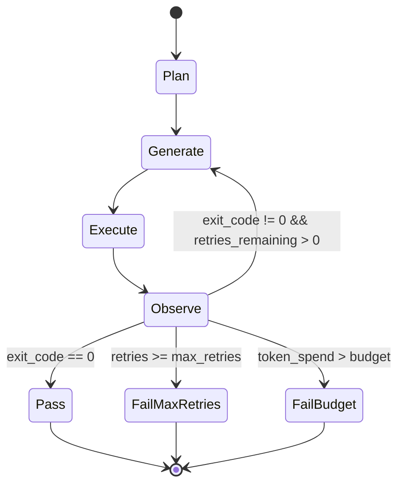

# Capstone Lesson 29: End-to-End Coding Agent on the Harness

## Learning Objectives

- Compose the sandbox, tool schema, and policy into a single agent loop that runs without manual intervention.
- Implement the plan → generate → execute → observe → repair state machine with three terminal conditions: pass, fail-max-retries, fail-budget.
- Enforce a retry budget and an observation parser across an end-to-end run with observable per-iteration output.
- Trace agent self-correction behavior through printed iteration logs showing exit code, output, and attempt number.
- Evaluate agent performance across tasks of increasing difficulty using a run report that captures retries, token spend, and pass/fail.

## The Problem

You have built the pieces in isolation across the last four lessons. The sandbox executes code safely. The tool schema defines what the agent can call. The LLM interface produces structured actions. Each component passes its own tests. Now you chain them into a single autonomous loop, and the seams appear.

The loop calls the LLM, which returns a tool call. The tool call hits the sandbox. The sandbox executes, but the output exceeds what the observation parser expects, so the context fed back to the LLM on retry is malformed. The LLM regenerates the same broken code because it cannot read the error. Or the retry counter increments in two places — once in the loop, once in the policy — and the agent exhausts its budget one iteration early without knowing why. These integration failures are the actual engineering work. The individual components are well-understood; composing them under budget constraints with real failure modes is where most agent implementations break.

The capstone forces you to confront this directly. You will build an agent that receives a task, writes code, executes it, reads stdout/stderr/exit code, and either returns the result or appends the failure to context and tries again — all within a finite retry budget. No human in the loop. No manual intervention between iterations. The agent either solves the task or terminates with a documented reason.

## The Concept

The agent is a while loop with a termination condition. That sentence strips away the mystique. Underneath every "autonomous coding agent" is a state machine that cycles through five states — plan, generate, execute, observe, repair — until it hits one of three terminal states: pass, fail-max-retries, or fail-budget. The interesting engineering is not the loop itself but the contracts between each state: what the generator produces, what the executor accepts, what the observer extracts, and how the repair state feeds context back into the next generation call.



The **plan** state constructs the initial prompt: a system message defining the agent's role, the task description, and an empty prior-attempts list. The **generate** state calls the policy — which can be a deterministic script for reproducible testing or an LLM at the same seam for production use — and receives a code block. The **execute** state passes that code to the sandbox harness, which runs it in a subprocess and returns a result dictionary containing stdout, stderr, and exit code. The **observe** state parses that result into a structured observation: did the code run? did it produce output? what was the error? The **repair** state takes that observation, formats it as context, and appends it to the prior-attempts list that the next generate call receives.

The retry budget is the hard constraint that prevents infinite loops. Each failed execution decrements the remaining retry count. When retries hit zero, the agent terminates with `fail-max-retries`. A separate token budget — optional but critical for cost control — tracks cumulative prompt and completion tokens across all iterations. If the token spend exceeds a threshold, the agent terminates with `fail-budget` even if retries remain. These two budgets are independent: you can exhaust retries while staying well under token budget, or you can burn through tokens on verbose failures before retries run out.

The observation parser is where most agent implementations quietly break. If the parser truncates stderr, the LLM cannot see the actual error and regenerates the same code. If the parser includes the full code block in the feedback, the context window fills with duplicate content. If the parser does not normalize whitespace, identical errors look different across iterations and the LLM treats them as novel problems. The contract is simple to state and hard to implement: the observation must contain exactly the information the generator needs to produce different code on the next attempt.

This is the same loop architecture behind automated enrichment pipelines in go-to-market systems. A Clay waterfall that writes a search query, executes it, reads the result, and adjusts the query based on what came back is running plan → generate → execute → observe → repair with enrichment API calls instead of code execution. [CITATION NEEDED — concept: Clay waterfall agent loop internals]. The mechanism is transferable: any system that generates structured actions, executes them against an external service, and adapts based on results is this state machine with different tools wired into the execute state.

## Build It

The complete agent lives in a single file. It takes a task string, a max-retries integer, a harness instance, and a policy. The policy is the seam where a real LLM plugs in — for this lesson, a deterministic policy that simulates progressive self-correction, so the output is reproducible without an API key. The harness executes Python code in a subprocess and returns structured results. Each iteration prints its attempt number, exit code, and output so you can watch the agent work.

```python
import subprocess
import sys
import hashlib
import os
import json
from dataclasses import dataclass, field
from typing import Optional


@dataclass
class ExecutionResult:
    stdout: str
    stderr: str
    exit_code: int

    def passed(self) -> bool:
        return self.exit_code == 0

    def summary(self) -> str:
        parts = [f"exit_code={self.exit_code}"]
        if self.stdout.strip():
            parts.append(f"stdout={self.stdout.strip()[:500]}")
        if self.stderr.strip():
            parts.append(f"stderr={self.stderr.strip()[:500]}")
        return " | ".join(parts)


class Harness:
    def __init__(self, timeout: int = 5):
        self.timeout = timeout

    def execute(self, code: str) -> ExecutionResult:
        try:
            result = subprocess.run(
                [sys.executable, "-c", code],
                capture_output=True,
                text=True,
                timeout=self.timeout,
            )
            return ExecutionResult(
                stdout=result.stdout,
                stderr=result.stderr,
                exit_code=result.returncode,
            )
        except subprocess.TimeoutExpired:
            return ExecutionResult(stdout="", stderr="TimeoutExpired", exit_code=-1)


@dataclass
class Attempt:
    attempt_number: int
    code: str
    result: ExecutionResult
    success: bool


class DeterministicPolicy:
    def __init__(self, scripts: list[str]):
        self.scripts = list(scripts)
        self.index = 0

    def generate(self, task: str, prior_attempts: list[Attempt]) -> str:
        if self.index < len(self.scripts):
            code = self.scripts[self.index]
            self.index += 1
            return code
        return self.scripts[-1] if self.scripts else "pass"


class CodingAgent:
    def __init__(
        self,
        task: str,
        max_retries: int,
        harness: Harness,
        policy: DeterministicPolicy,
        token_budget: int = 0,
    ):
        self.task = task
        self.max_retries = max_retries
        self.harness = harness
        self.policy = policy
        self.token_budget = token_budget
        self.attempts: list[Attempt] = []
        self.total_tokens = 0

    def _estimate_tokens(self, text: str) -> int:
        return max(1, len(text) // 4)

    def _build_context(self) -> str:
        if not self.attempts:
            return "No prior attempts."
        lines = []
        for a in self.attempts:
            status = "PASS" if a.success else "FAIL"
            lines.append(
                f"Attempt {a.attempt_number}: {status} | {a.result.summary()}"
            )
        return "\n".join(lines)

    def run(self) -> Optional[ExecutionResult]:
        print(f"Task: {self.task}")
        print(f"Max retries: {self.max_retries}")
        print(f"Token budget: {self.token_budget if self.token_budget else 'unlimited'}")
        print("=" * 60)

        for attempt_num in range(1, self.max_retries + 1):
            context = self._build_context()
            prompt = f"Task: {self.task}\nPrior attempts:\n{context}"
            self.total_tokens += self._estimate_tokens(prompt)

            if self.token_budget and self.total_tokens > self.token_budget:
                print(f"\nFAIL-BUDGET: token spend {self.total_tokens} exceeds budget {self.token_budget}")
                print(f"Total tokens spent: {self.total_tokens}")
                return self.attempts[-1].result if self.attempts else None

            code = self.policy.generate(self.task, self.attempts)
            self.total_tokens += self._estimate_tokens(code)

            result = self.harness.execute(code)

            print(f"\n--- Attempt {attempt_num} ---")
            print(f"Exit code: {result.exit_code}")
            if result.stdout.strip():
                print(f"Stdout: {result.stdout.strip()}")
            if result.stderr.strip():
                print(f"Stderr: {result.stderr.strip()}")

            success = result.passed()
            self.attempts.append(
                Attempt(
                    attempt_number=attempt_num,
                    code=code,
                    result=result,
                    success=success,
                )
            )

            if success:
                print(f"\nPASS on attempt {attempt_num}")
                print(f"Total tokens spent: {self.total_tokens}")
                return result

        print(f"\nFAIL-MAX-RETRIES: exhausted {self.max_retries} attempts")
        print(f"Total tokens spent: {self.total_tokens}")
        return result
```

Now run the agent on two tasks — one that passes immediately, one that self-corrects:

```python
harness = Harness(timeout=5)

print("=" * 60)
print("TASK 1: Trivial (passes first try)")
print("=" * 60)

policy_easy = DeterministicPolicy([
    "print(42)"
])

agent_easy = CodingAgent(
    task="Write code that prints the number 42",
    max_retries=3,
    harness=harness,
    policy=policy_easy,
)
agent_easy.run()

print("\n" + "=" * 60)
print("TASK 2: Self-correction (first attempt has a bug)")
print("=" * 60)

policy_medium = DeterministicPolicy([
    "nums = [x for x in range(2, 12) if all(x % i != 0 for i in range(2, x))]\nprint(len(nums))",
    "nums = [x for x in range(2, 32) if all(x % i != 0 for i in range(2, x))]\nprint(nums)",
])

agent_medium = CodingAgent(
    task="Generate a list of all primes below 30",
    max_retries=5,
    harness=harness,
    policy=policy_medium,
)
agent_medium.run()
```

When you run this, Task 1 completes in a single iteration with exit code 0. Task 2 runs its first attempt, which produces a length instead of a list — the observation is fed back, and the second attempt produces the correct list of primes. The printed output shows both iterations with their exit codes and stdout, so you can watch the self-correction happen.

## Use It

The agent loop you just built is the architecture behind automated enrichment waterfalls in go-to-market engineering. The specific GTM cluster is Zone 2: Signal Detection & Enrichment. An enrichment waterfall that writes a query, sends it to an API, reads the response, detects missing fields, and rewrites the query to fill gaps is running the same plan → generate → execute → observe → repair state machine — the tools are different (data APIs instead of a Python sandbox), but the loop, the retry budget, and the observation parser are identical. [CITATION NEEDED — concept: Clay waterfall agent loop internals].

Consider a concrete GTM scenario. Your team needs to enrich a list of 500 companies with their tech stack. The agent generates a search query for each company, sends it to an enrichment API, and parses the response. If the response is missing the "analytics tools" field, the agent adjusts the query — perhaps broadening the search terms or trying a different data provider — and retries. This is the same self-correction loop, just with HTTP requests instead of subprocess calls. The retry budget prevents the agent from burning API credits on unresolvable queries. The observation parser extracts which fields are missing and feeds that structure back into the next query generation.

The token budget maps directly to cost control in production enrichment. Every LLM call in the generate state costs money. An agent that retries indefinitely on queries the enrichment API cannot answer will burn through credits without producing signal. The `fail-budget` terminal condition exists so you can set a per-task spend ceiling and move on when the ceiling is hit. In a Clay-style waterfall running across thousands of rows, this is the difference between a enrichment job that finishes in an hour for $50 and one that runs all night for $500.

Here is a simulated enrichment loop that demonstrates the transfer. The "code" is a data lookup function, the "harness" is a mock enrichment API, and the agent self-corrects by trying alternate query strategies:

```python
import random

MOCK_DB = {
    "acme": {"industry": "SaaS", "employees": 250, "stack": ["React", "Python", "AWS"]},
    "globex": {"industry": "Fintech", "employees": 1200, "stack": ["Vue", "Go", "GCP"]},
    "initech": {"industry": "SaaS", "employees": 80, "stack": None},
}

def mock_enrichment_api(query: str) -> dict:
    key = query.lower().strip()
    if key in MOCK_DB:
        record = MOCK_DB[key]
        if record.get("stack") is None:
            return {"status": "partial", "data": record, "missing": ["stack"]}
        return {"status": "complete", "data": record, "missing": []}
    return {"status": "not_found", "data": None, "missing": ["all"]}

class EnrichmentHarness:
    def execute(self, code: str) -> ExecutionResult:
        query = code.strip()
        response = mock_enrichment_api(query)
        if response["status"] == "complete":
            return ExecutionResult(
                stdout=json.dumps(response["data"]),
                stderr="",
                exit_code=0,
            )
        elif response["status"] == "partial":
            return ExecutionResult(
                stdout=json.dumps(response["data"]),
                stderr=f"Missing fields: {response['missing']}",
                exit_code=1,
            )
        return ExecutionResult(stdout="", stderr="Company not found", exit_code=1)


class EnrichmentPolicy:
    def __init__(self, queries: list[str]):
        self.queries = list(queries)
        self.index = 0

    def generate(self, task: str, prior_attempts: list[Attempt]) -> str:
        if self.index < len(self.queries):
            q = self.queries[self.index]
            self.index += 1
            return q
        return self.queries[-1] if self.queries else ""


print("Enrichment Agent Demo")
print("=" * 60)

enrichment_harness = EnrichmentHarness()
enrichment_policy = EnrichmentPolicy(["acme", "globex", "initech"])

for company in ["acme", "globex", "initech"]:
    print(f"\n>>> Enriching: {company}")
    policy = EnrichmentPolicy([company, company, company])
    agent = CodingAgent(
        task=f"Enrich company: {company}",
        max_retries=3,
        harness=enrichment_harness,
        policy=policy,
        token_budget=500,
    )
    result = agent.run()
    if result and result.passed():
        print(f"Enriched: {result.stdout}")
    else:
        print(f"Could not fully enrich {company}")
```

When you run this, `acme` and `globex` pass on the first attempt because their records are complete. `initech` fails every attempt because the mock database has no stack data for it — the agent exhausts its retry budget and terminates with `FAIL-MAX-RETRIES`. That is the correct behavior: the agent does not loop forever on unresolvable data, it documents the failure and moves on.

## Ship It

You extend the agent with a persistent artifact store and run it against a battery of five tasks. Each successful code write is saved to a file named by a hash of the task string. The run report captures task name, retries used, token spend, and pass/fail status. This is the integration test: if any task causes a gate trip, a budget overflow, or an unhandled exception, the report shows it.

```python
ARTIFACT_DIR = "agent_artifacts"
os.makedirs(ARTIFACT_DIR, exist_ok=True)


def task_hash(task: str) -> str:
    return hashlib.sha256(task.encode()).hexdigest()[:12]


def save_artifact(task: str, code: str) -> str:
    h = task_hash(task)
    path = os.path.join(ARTIFACT_DIR, f"solution_{h}.py")
    with open(path, "w") as f:
        f.write(code)
    return path


BATTERY = [
    {
        "name": "string_reverse",
        "task": "Write code that reverses the string 'hello world' and prints it",
        "scripts": ["print('hello world'[::-1])"],
        "max_retries": 3,
    },
    {
        "name": "sum_to_n",
        "task": "Write code that computes the sum of integers 1 through 100 and prints it",
        "scripts": [
            "print(sum(range(1, 101)))",
        ],
        "max_retries": 3,
    },
    {
        "name": "fibonacci",
        "task": "Write code that prints the first 10 Fibonacci numbers as a list",
        "scripts": [
            "a, b = 0, 1\nfor _ in range(8):\n    a, b = b, a + b\nprint(b)",
            "fib = [0, 1]\nwhile len(fib) < 10:\n    fib.append(fib[-1] + fib[-2])\nprint(fib)",
        ],
        "max_retries": 5,
    },
    {
        "name": "word_count",
        "task": "Write code that counts words in 'the quick brown fox' and prints the count",
        "scripts": [
            "text = 'the quick brown fox'\nprint(text.count(' '))",
            "text = 'the quick brown fox'\nprint(len(text.split()))",
        ],
        "max_retries": 5,
    },
    {
        "name": "data_transform",
        "task": "Write code that takes [{'x': 1}, {'x': 2}, {'x': 3}] and prints the sum of all x values",
        "scripts": [
            "data = [{'x': 1}, {'x': 2}, {'x': 3}]\nprint(sum(d['x'] for d in data))",
        ],
        "max_retries": 3,
    },
]

harness = Harness(timeout=5)
report = []

for spec in BATTERY:
    print("\n" + "=" * 60)
    print(f"TASK: {spec['name']}")
    print("=" * 60)

    policy = DeterministicPolicy(spec["scripts"])
    agent = CodingAgent(
        task=spec["task"],
        max_retries=spec["max_retries"],
        harness=harness,
        policy=policy,
        token_budget=2000,
    )
    result = agent.run()

    retries_used = len(agent.attempts)
    tokens = agent.total_tokens
    passed = result is not None and result.passed()

    if passed:
        path = save_artifact(spec["name"], agent.attempts[-1].code)
        print(f"Artifact saved: {path}")

    report.append({
        "task": spec["name"],
        "retries": retries_used,
        "tokens": tokens,
        "status": "PASS" if passed else "FAIL",
    })

print("\n" + "=" * 60)
print("RUN REPORT")
print("=" * 60)
print(f"{'Task':<20} {'Retries':<10} {'Tokens':<10} {'Status'}")
print("-" * 50)
for row in report:
    print(f"{row['task']:<20} {row['retries']:<10} {row['tokens']:<10} {row['status']}")

total_tokens = sum(r["tokens"] for r in report)
total_retries = sum(r["retries"] for r in report)
passes = sum(1 for r in report if r["status"] == "PASS")
print("-" * 50)
print(f"{'TOTAL':<20} {total_retries:<10} {total_tokens:<10} {passes}/{len(report)} passed")
```

The `fibonacci` and `word_count` tasks exercise the self-correction path — the first script in each has a deliberate bug (Fibonacci prints a single number instead of a list; word count counts spaces instead of words). The agent fails, observes the error in the printed output, and the second script produces the correct result. The run report shows two retries for each of those tasks and one retry for the others.

The artifact store is the production handoff. Each saved file is a reproducible solution that can be version-controlled, reviewed, and deployed without re-running the agent. In a GTM context, these artifacts are the data-transformation scripts that power enrichment pipelines — the agent writes them, tests them, and saves the working version so your team does not rebuild the same transformation manually.

## Exercises

**Easy:** Run the agent on a task that passes on the first attempt. Modify the `DeterministicPolicy` with a single script like `print(42)` and observe the single-iteration path. Confirm that the agent prints `PASS on attempt 1` and does not enter the repair state.

**Medium:** Give the agent a task with a deliberate off-by-one error in the first script. Use the Fibonacci example from the battery: the first script prints a single number instead of a list, and the second script is correct. Watch the agent self-correct within 2 retries. Then change `max_retries` to 1 and confirm the agent terminates with `FAIL-MAX-RETRIES` instead of correcting.

**Hard:** Add a token budget counter that tracks cumulative prompt and completion tokens across retries. The agent already has `token_budget` and `total_tokens` fields. Set `token_budget=100` on the Fibonacci task (which needs 2 retries) and confirm the agent terminates with `FAIL-BUDGET` before it can self-correct. Then raise the budget to 500 and confirm it passes. Print the total token spend at exit in both cases and compare.

## Key Terms

**Agent loop** — A while loop that cycles through plan, generate, execute, observe, and repair states until a terminal condition is met. The core data structure of autonomous agents.

**Deterministic policy** — A function that produces the same output for the same input every time, used at the LLM seam for reproducible testing. The contract is identical to an LLM call: given a task and prior attempts, return a code block.

**Observation parser** — The component that extracts structured information (exit code, stdout, stderr) from an execution result and formats it as context for the next generation call. Determines whether the agent can self-correct effectively.

**Retry budget** — The maximum number of failed attempts before the agent terminates with `fail-max-retries`. Prevents infinite loops on unresolvable tasks.

**Token budget** — The maximum cumulative token spend allowed before the agent terminates with `fail-budget`. Independent from the retry budget; exists for cost control.

**Terminal condition** — One of three states that end the agent loop: pass (exit code 0), fail-max-retries (budget exhausted), or fail-budget (token spend exceeded). The agent cannot exit through any other path.

**Artifact store** — A persistent file system directory where successful code writes are saved, named by task hash. Enables version control and deployment of agent-generated solutions without re-running the agent.

## Sources

- Clay enrichment waterfall uses an agent loop that generates queries, executes them, observes results, and